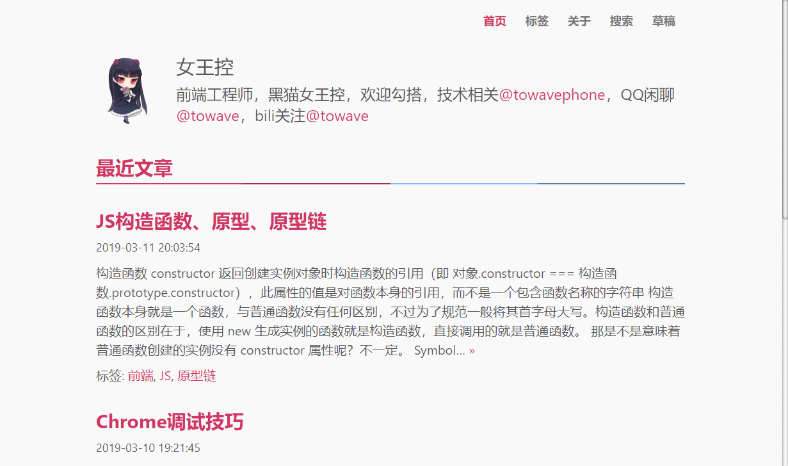

## 技术博客

[](https://github.com/towavephone/GatsbyBlog/actions) [](https://github.com/towavephone/GatsbyBlog/commits/master) [](https://github.com/towavephone/GatsbyBlog/commits/master) [](https://opensource.org/licenses/mit-license.php) [](https://github.com/gatsbyjs/gatsby)

基于 [Kostas Bariotis/kostasbariotis.com](https://github.com/kbariotis/kostasbariotis.com) 二次开发。

崇尚单页应用，离线阅读，关键路径渲染，你可以点击 [技术博客](https://blog.towavephone.com/) 查看效果。

如果博客也是你喜欢的菜，请动动手指 Star 支持一下。

## 最近文章

- [React 设计模式与最佳实践](https://blog.towavephone.com/react-design-pattern/)
- [Chrome 调试技巧](https://blog.towavephone.com/chrome-debug-practice/)
- [富文本框疑难点处理过程](https://blog.towavephone.com/rich-input-question)
- [ReactPlayer 之 IE 兼容性研究](https://blog.towavephone.com/reactplayer-ie-compatibility/)
- [Webpack4 配置笔记](https://blog.towavephone.com/webpack4-config-note/)

## 截图



## 使用

```bash
// 注册 algolia 账号密码，取得相关密钥，填入 .env 文件
mv .env.example .env
yarn
yarn start // 启动本地开发服务器
yarn build // 生成构建文件
yarn serve // 根据生成的构建文件启用本地服务器
yarn deploy:coding // 部署到 coding
yarn deploy:github // 部署到 github
```

> 可能需要翻墙，否则 gatsby-plugin-sharp 安装失败。
