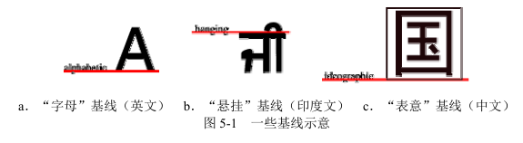
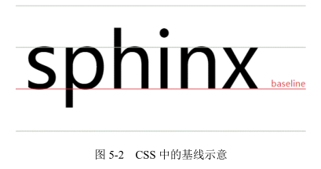
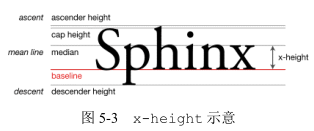
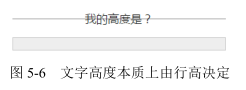
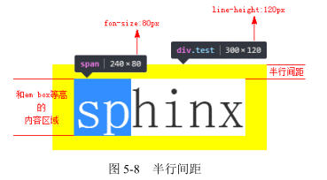
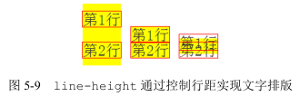
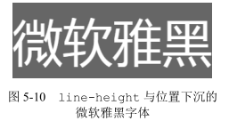
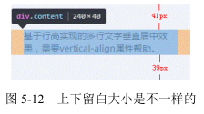
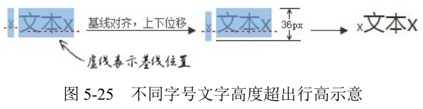
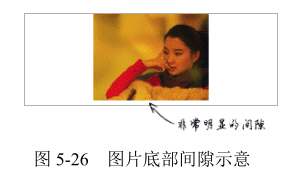

块级元素负责结构，内联元素接管内容，而 CSS 世界是面向图文混排，也就是内联元素设计的，由此可见，本章内容在整个 CSS 世界体系中占有非常重要的位置。

# 字母 x —— CSS 世界中隐匿的举足轻重的角色

## 字母 x 与 CSS 世界的基线

在各种内联相关模型中，凡是涉及垂直方向的排版或者对齐的，都离不开最基本的基线
（baseline）。例如，line-height 行高的定义就是两基线的间距，vertical-align 的默认
值就是基线，其他中线顶线一类的定义也离不开基线，基线甚至衍生出了很多其他基线概念（如
图 5-1 所示）。



字母 x 的下边缘（线）就是我们的基线。



## 字母 x 与 CSS 中的 x-height

CSS 中有一个概念叫作 x-height，指的是字母 x 的高度，术语描述就是基线和等分线（mean line）（也称作中线，midline）之间的距离。



- ascender height: 上行线高度。
- cap height: 大写字母高度。
- median: 中线。
- descender height: 下行线高度。

CSS 中有些属性值的定义就和这个 x-height 有关，最典型的代表就是 vertical-align:middle，这里的 middle 是中间的意思。注意，跟上面的 median（中线）不是一个意思。在 CSS 世界中，middle 指的是基线往上 1/2 x-height 高度。我们可以近似理解为字母 x 交叉点那个位置。

由此可见，vertical-align:middle 并不是绝对的垂直居中对齐，我们平常看到的 middle 效果只是一种近似效果，因为不同的字体在行内盒子中的位置是不一样的

## 字母 x 与 CSS 中的 ex

字母 x 衍生出了 x-height 概念，并在这个基础上深耕细作，进一步衍生出了 ex。注意，这里的 ex 是 CSS 中的一个尺寸单位。

ex 是 CSS 中的一个相对单位，指的是小写字母 x 的高度，没错，就是指 x-height。

虽然说 em、px 这类单位的主要作用是限定元素的尺寸，但是，由于字母 x 受字体等 CSS 属性影响大，不稳定，因此 ex 不太适合用来限定元素的尺寸

没错，ex 的价值就在其副业上 — 不受字体和字号影响的内联元素的垂直居中对齐效果。

内联元素默认是基线对齐的，而基线就是 x 的底部，而 1ex 就是一个 x 的高度。设想一下，假如图标高度就是 1ex，同时背景图片居中，岂不是图标和文字天然垂直居中，而且完全不受字体和字号的影响？因为 ex 就是一个相对于字体和字号的单位。

比如以下的文字后面跟着一个小三角形图标的效果

```css
.icon-arrow {
  display: inline-block;
  width: 20px;
  height: 1ex;
  background: url(arrow.png) no-repeat center;
}
```

<iframe src="/examples/code-editor.html?html=zhangxinxu%3Ci%20class%3D%22icon-arrow%22%3E%3C/i%3E%0A%0A%u5F20%u946B%u65ED%3Ci%20class%3D%22icon-arrow%22%3E%3C/i%3E&css=.icon-arrow%20%7B%0A%20%20%20%20display%3A%20inline-block%3B%0A%20%20%20%20width%3A%2020px%3B%0A%20%20%20%20height%3A%201ex%3B%0A%20%20%20%20background%3A%20url%28/images/5/arrow.png%29%20no-repeat%20center%3B%0A%7D" width="400" height="200"></iframe>

# 内联元素的基石 line-height

下文中所有的“行高”指的就是 line-height

## 内联元素的高度之本 — line-height

默认空`<div>`高度是 0，但是一旦里面写上几个文字，`<div>`高度就有了，请问这个高度由何而来，或者说是由哪个 CSS 属性决定的？

本质上是由 line-height 属性全权决定的，尽管某些场景确实与font-size 大小有关。

例如：

```html
<div class="test1">我的高度是？</div>
<style>
.test1 {
  font-size: 16px;
  line-height: 0;
  border: 1px solid #ccc;
  background: #eee;
}
</style>
```

和

```html
<div class="test2">我的高度是？</div>
<style>
.test1 {
  font-size: 0;
  line-height: 16px;
  border: 1px solid #ccc;
  background: #eee;
}
</style>
```

这两段代码的区别在于一个 line-height 行高为 0，一个 font-size 字号为 0。结果，第一段代码，最后元素的高度只剩下边框那么丁点儿，而后面一段代码，虽然文字小到都看不见了，但是 16px 的内部高度依然坚挺



对于非替换元素的纯内联元素，其可视高度完全由 line-height 决定，也就是什么 padding、border 属性对可视高度是没有任何影响的，这也是我们平常口中的“盒模型”约定俗成说的是块级元素的原因

因此，对于文本这样的纯内联元素，line-height 就是高度计算的基石，用专业说法就是指定了用来计算行框盒子高度的基础高度。比方说，line-height 设为 16px，则一行文字高度是 16px，两行就是 32px，三行就是 48px，所有浏览器渲染解析都是这个值，1 像素都不差

line-height 在替换元素，又或者是块级元素的作用：

行距 = line-height - font-size

半行距的显示：(当我们的字体是宋体的时候，内容区域和 em-box 是等同的)

```css
.test {
  font-family: simsun;
  font-size: 24px;
  line-height: 36px;
  background-color: yellow;
}
.test > span {
  background-color: white;
}
<div class="test">
  <span>sphinx</span>
</div>
```

此时，平常虚无的 em-box 借助内容区域（图 5-8 中字符 sp 的选中区域）暴露出了庐山真面目，“半行距”也准确显现出来了，如图 5-8 右侧标注



所有与文字相关的间距都是从文字的上边缘和下边缘开始标注的，假设 line-height 是 1.5，font-size 大小是 14px，那么我们的半行距大小就是（套用上面的行距公式再除以 2）：(14px * 1.5 - 14px) / 2 = 14px * 0.25 = 3.5px。border 以及 line-height 等传统 CSS 属性并没有小数像素的概念（从 CSS3 动画的细腻程度可以看出），因此，这里的 3.5px 需要取整处理，如果标注的是文字上边距，则向下取整；如果是文字下边距，则向上取整，因为绝大多数的字体在内容区域中都是偏下的。所以，假设设计师标注了文字字形上边缘到图片下边缘间距 20px，则我们实际的 margin-top 值应该是 17px，因为 3.5px 向下取整是 3px。

line-height如何通过改变行距实现文字排版？

当line-height设为 2 的时候，半行距是一半的文字大小，两行文字中间的间隙差不多一个文字尺寸大小；如果 line-height 大小是 1 倍文字大小，则根据计算，半行距是 0，也就是两行文字会紧密依偎在一起；如果 line-height 值是 0.5，则此时的行距就是负值，虽然 line-height 不支持负值，但是行距可以为负值，此时，两行文字就是重叠纠缠在一起



替换元素和块级元素中line-height的影响？

line-height 可以影响替换元素（如图片的高度）？

```html
<style>
.box {
  line-height: 256px;
}
</style>
<div class="box">
  
</div>
```

不可以，不是 line-height 把图片占据高度变高了，而是把“幽灵空白节点”的高度变高了，图片为内联元素，会构成一个“行框盒子”，而在 HTML5 文档模式下，每一个“行框盒子”的前面都有一个宽度为 0 的“幽灵空白节点”，其内联特性表现和普通字符一模一样，所以，这里的容器高度会等于 line-height 设置的属性值 256px。

实际开发的时候，图文和文字混在一起是很常见的，那这种内联替换元素和内联非替换元素在一起时的高度表现又是怎样的呢？

由于同属内联元素，因此，会共同形成一个“行框盒子”，line-height 在这个混合元素的“行框盒子”中扮演的角色是决定这个行盒的最小高度，对于纯文本元素，line-height 直接决定了最终的高度。但是，如果同时有替换元素，则 line-height 只能决定最小高度，为什么会这样呢？一是替换元素的高度不受 line-height 影响，二是 vertical-align 属性在背后作祟。

对于这种混合替换元素的场景，line-height 要想一统江山，需要值足够大才行。但是，实际开发的时候，我们给 line-height 设置的值总是很中规中矩，于是，就会出现类似下面的场景：明明文字设置了 line-height 为 20px，但是，如果文字后面有小图标，最后“行框盒子”高度却是 21px 或是 22px。这种现象背后最大的黑手其实是 vertical-align 属性，我们会在下一章好好深入剖析为什么会有这样的表现

对于块级元素，line-height 对其本身是没有任何作用的，我们平时改变 line-height，块级元素的高度跟着变化实际上是通过改变块级元素里面内联级别元素占据的高度实现的。

## 为什么 line-height 可以让内联元素“垂直居中”

要想让单行文字垂直居中，只要设置 line-height 大小和 height 高度一样就可以了，误区：

- 要让单行文字垂直居中，只需要 line-height 这一个属性就可以，与 height 一点儿关系都没有。也就是说，我们直接：

```css
.title {
  line-height: 24px;
}
```

- 行高控制文字垂直居中，不仅适用于单行，多行也是可以的。准确的说法应该是“line-height 可以让单行或多行元素近似垂直居中”

实现“垂直居中”原因在于 CSS 中“行距的上下等分机制”，如果行距的添加规则是在文字的上方或者下方，则行高是无法让文字垂直居中的。

说“近似”是因为文字字形的垂直中线位置普遍要比真正的“行框盒子”的垂直中线位置低，譬如我们拿现在用得比较多的微软雅黑字体举例：

```html
<style>
p {
  font-size: 80px;
  line-height: 120px;
  background-color: #666;
  font-family: 'microsoft yahei';
  color: #fff;
}
</style>
<p>微软雅黑</p>
```

字形明显偏下，font-size 12px～16px 很多，因此，虽然微软雅黑字体有下沉，但也就 1 像素的样子



多行文本或者替换元素的垂直居中实现原理和单行文本就不一样了，需要 line-height 属性的好朋友 vertical-align 属性帮助才可以，示例代码如下：

```html
<style>
  .box {
    line-height: 120px;
    background-color: #f0f3f9;
  }
  .content {
    display: inline-block;
    line-height: 20px;
    margin: 0 20px;
    vertical-align: middle;
  }
</style>
<div class="box">
  <div class="content">基于行高实现的...</div>
</div>
```

<iframe src="/examples/code-editor.html?html=%3Cdiv%20class%3D%22box%22%3E%0A%20%20%20%20%3Cdiv%20class%3D%22content%22%3E%u57FA%u4E8E%u884C%u9AD8%u5B9E%u73B0%u7684...%3C/div%3E%0A%3C/div%3E&css=.box%20%7B%0A%20%20%20%20width%3A%20280px%3B%0A%20%20%20%20line-height%3A%20120px%3B%0A%20%20%20%20background-color%3A%20%23f0f3f9%3B%0A%20%20%20%20margin%3A%20auto%3B%0A%7D%0A.content%20%7B%0A%20%20%20%20display%3A%20inline-block%3B%0A%20%20%20%20line-height%3A%2020px%3B%0A%20%20%20%20margin%3A%200%2020px%3B%0A%20%20%20%20text-align%3A%20left%3B%0A%20%20%20%20vertical-align%3A%20middle%3B%0A%7D" width="400" height="200"></iframe>

实现的原理大致如下:

1. 多行文字使用一个标签包裹，然后设置 display 为 inline-block。好处在于既能重置外部的 line-height 为正常的大小，又能保持内联元素特性，从而可以设置 vertical-align 属性，以及产生一个非常关键的“行框盒子”。我们需要的其实并不是这个“行框盒子”，而是每个“行框盒子”都会附带的一个产物 — “幽灵空白节点”，即一个宽度为0、表现如同普通字符的看不见的“节点”。有了这个“幽灵空白节点”，我们的 line-height:120px 就有了作用的对象，从而相当于在.content 元素前面撑起了一个高度为 120px 的宽度为 0 的内联元素。
2. 因为内联元素默认都是基线对齐的，所以我们通过对.content 元素设置 vertical-align:middle 来调整多行文本的垂直位置，从而实现我们想要的“垂直居中”效果。如果是要借助 line-height 实现图片垂直居中效果，也是类似的原理和做法

这里实现的“垂直居中”确实也不是真正意义上的垂直居中，也是“近似垂直居中”。还是上面的多行文本垂直居中的例子，如果我们捕获到多行文本元素的尺寸空间，截个图，然后通过尺子工具一量就会发现，上面的留空是41px，下面的留空是 39px，对啦，原来不是完全的垂直居中



不垂直居中与 line-height 无关，而是 vertical-align 导致的，具体原因我们将在 5.3 节讲解。

## 深入 line-height 的各类属性值

line-height 的默认值是 normal，还支持数值、百分比值以及长度值。

```css
div {
  line-height: normal;
  font-family: 'microsoft yahei';
}
div {
  line-height: normal;
  font-family: simsun;
}
```

此时两段 CSS 中 line-height 的属性值 normal 的计算值是不一样的，下表给出的是我在
几个桌面浏览器的测试数据。

|字体|chrome|Firefox|IE|
|:--:|:--:|:--:|:--:|
|微软雅黑|1.32|1.321|1.32|
|宋体|1.141|1.142|1.141|

只要字体确定，各个浏览器下的默认 line-height 解析值基本上都是一样的，然而不同的浏览器所使用的默认中英文字体并不是一样的，并且不同操作系统的默认字体也不一样，换句话说，就是不同系统不同浏览器的默认 line-height 都是有差异的。因此，在实际开发的时候，对 line-height 的默认值进行重置是势在必行的。下面问题来了，line-height 应该重置为多大的值呢？是使用数值、百分比值还是长度值呢？

要回答这个问题，我们需要先对这几种属性值有一定的了解才行

- 数值，如 line-height:1.5，其最终的计算值是和当前 font-size 相乘后的值。例如，假设我们此时的 font-size 大小为 14px，则 line-height 计算值是 1.5*14px = 21px。
- 百分比值，如 line-height:150%，其最终的计算值是和当前 font-size 相乘后的值。例如，假设我们此时的 font-size 大小为 14px，则 line-height 计算值是150%*14px=21px。
- 长度值，也就是带单位的值，如 line-height:21px 或者 line-height:1.5em等，此处 em 是一个相对于 font-size 的相对单位，因此，line-height:1.5em 最终的计算值也是和当前font-size相乘后的值。例如，假设我们此时的font-size大小为 14px，则 line-height 计算值是 1.5*14px=21px。

实际上，line-height:1.5 和另外两个有一点儿不同，那就是继承细节有所差别。如果使用数值作为 line-height 的属性值，那么所有的子元素继承的都是这个值；但是，如果使用百分比值或者长度值作为属性值，那么所有的子元素继承的是最终的计算值。什么意思呢？比方说下面 3 段 CSS 代码

```css
body {
  font-size: 14px;
  line-height: 1.5;
}
body {
  font-size: 14px;
  line-height: 150%;
}
body {
  font-size: 14px;
  line-height: 1.5em;
}
```

对于`<body>`元素而言，上面 3 段 CSS 最终的行高计算值是 21px 是没有任何区别的，但是，如果同时还有子元素，例如：

```css
h3, p { margin: 0; }
h3 { font-size: 32px; }
p { font-size: 20px; }
<h3>标题</h3>
<p>内容</p>
```

结果 line-height:150% 和 line-height:1.5em 的最终表现是“标题”文字和“内容”文字重叠在了一起，如图 5-13 所示

俗话讲“没有对比就没有伤害”，我们来看看 line-height:1.5 的最终表现，排版令人舒畅

<iframe src="/examples/code-editor.html?html=%3Cdiv%20class%3D%22box%20box-1%22%3E%0A%20%20%20%20%3Ch3%3E%u6807%u9898%3C/h3%3E%0A%20%20%20%20%3Cp%3E%u5185%u5BB9%3C/p%3E%0A%3C/div%3E%0A%3Cdiv%20class%3D%22box%20box-2%22%3E%0A%20%20%20%20%3Ch3%3E%u6807%u9898%3C/h3%3E%0A%20%20%20%20%3Cp%3E%u5185%u5BB9%3C/p%3E%0A%3C/div%3E%0A%3Cdiv%20class%3D%22box%20box-3%22%3E%0A%20%20%20%20%3Ch3%3E%u6807%u9898%3C/h3%3E%0A%20%20%20%20%3Cp%3E%u5185%u5BB9%3C/p%3E%0A%3C/div%3E&css=.box%20%20%20%7B%20font-size%3A%2014px%3B%20%7D%0A.box-1%20%7B%20line-height%3A%201.5%3B%20%7D%0A.box-2%20%7B%20line-height%3A%20150%25%3B%20%7D%0A.box-3%20%7B%20line-height%3A%201.5em%3B%20%7D%0A%0Ah3%2C%20p%20%7B%0A%20%20%20%20margin%3A%200%3B%0A%7D%0Ah3%20%7B%20font-size%3A%2032px%3B%20%7D%0Ap%20%20%7B%20font-size%3A%2020px%3B%20%7D" width="400" height="200"></iframe>

line-height:150% 和 line-height:1.5em 代码下的文字重叠的原因在于`<h3>`和`<p>`元素继承的并不是 150% 或者 1.5em，而是`<body>`元素的 line-height 计算值 21px，也就是说，`<h3>`和`<p>`元素的行高都是21px，考虑到`<h3>`的 font-size 大小为 32px，此时`<h3>`的半行间距就是-5.5px，因而“标题”文字和下面的“内容”文字发生重叠。

但是 line-height:1.5 的继承则不同，`<h3>`和`<p>`元素的 line-height 继承的不是计算值，而是属性值 1.5，因此，对于`<h3>`元素，此时的行高计算值是 1.5 * 32px = 48px，`<p>`元素的行高计算值是 1.5 * 20px = 30px，于是，间距合理，排版舒适。

实际上，line-height:150%、line-height:1.5em 要想有类似 line-height:1.5 的继承效果，也是可以实现的，类似下面的 CSS 代码：

```css
* {
  line-height: 150%;
}
```

既然 line-height 数值可以让元素天然继承相对计算特性，那这里的通配符岂不完全没必要？

两者还是有差别的。HTML 中的很多替换元素，尤其表单类的替换元素，如输入框、按钮之类的，很多具有继承特性的CSS属性其自己也有一套，如font-family、font-size 以及这里的line-height。由于继承是属于最弱的权重，因此 body 中设置的line-height 是无法影响到这些替换元素的，但是 * 作为一个选择器，就不一样了，会直接重置这些替换元素默认的 line-height，这其实是我们需要的，因此从道义上讲，使用 * 通配也是合理的。但又考虑到*的性能以及明明有继承却不好好利用的羞耻感，我们可以折中使用下面的方法：

```css
body {
  line-height: 1.5;
}
input, button {
  line-height: inherit;
}
```

## 内联元素 line-height 的“大值特性”

```html
<div class="box">
  <span>内容...</span>
</div>
<style>
  .box {
    line-height: 96px;
  }
  .box span {
    line-height: 20px;
  }

  /*或*/

  .box {
    line-height: 20px;
  }
  .box span {
    line-height: 96px;
  }
</style>
```

一个子元素行高是 20px，一个是96px，假如文字就 1 行，.box 元素的高度分别是多少？

<iframe src="/examples/code-editor.html?html=%3Cdiv%20class%3D%22box%20box1%22%3E%0A%20%20%20%20%3Cspan%3Espan%3A%20line-height%3A20px%3C/span%3E%0A%3C/div%3E%0A%3Cdiv%20class%3D%22box%20box2%22%3E%0A%20%20%20%20%3Cspan%3Espan%3A%20line-height%3A20px%3C/span%3E%0A%3C/div%3E&css=.box%20%7B%0A%20%20%20%20width%3A%20280px%3B%0A%20%20%20%20margin%3A%201em%20auto%3B%0A%20%20%20%20outline%3A%201px%20solid%20%23beceeb%3B%0A%20%20%20%20background%3A%20%23f0f3f9%3B%0A%7D%0A.box1%20%7B%0A%20%20%20%20line-height%3A%2096px%3B%0A%7D%0A.box1%20span%20%7B%0A%20%20%20%20line-height%3A%2020px%3B%0A%7D%0A.box2%20%7B%0A%20%20%20%20line-height%3A%2020px%3B%0A%7D%0A.box2%20span%20%7B%0A%20%20%20%20line-height%3A%2096px%3B%0A%7D" width="400" height="200"></iframe>

全都是 96px 高，无论内联元素 line-height 如何设置，最终父级元素的高度都是由数值大的那个 line-height 决定的，称之为“内联元素 line-height 的大值特性”，幽灵空白节点的问题，“幽灵空白节点”就在`<span>`元素的前方

于是，就效果而言，我们的 HTML 实际上等同于：

```html
<div class="box">
  字符<span>内容...</span>
</div>
```

这下就好理解了，当 .box 元素设置 line-height:96px 时，“字符”高度 96px；当设置 line-height:20px 时，`<span>`元素的高度则变成了 96px，而行框盒子的高度是由高度最高的那个“内联盒子”决定的，这就是 .box 元素高度永远都是最大的那个 line-height的原因。

知道了原因也就能够对症下药，要避免“幽灵空白节点”的干扰，例如，设置`<span>`元素  display:inline-block，创建一个独立的“行框盒子”，这样`<span>`元素设置的 line-height:20px 就可以生效了，这也是多行文字垂直居中示例中这么设置的原因。

# line-height 的好朋友 vertical-align

```html
<style>
  .box { line-height: 32px; }
  .box > span { font-size: 24px; }
</style>
<div class="box">
  <span>文字</span>
</div>
```

.box 元素的高度是多少？

很多人一定认为是 32px，但是事实上，高度并不是 32px，而是要大那么几像素（受不同字体影响，增加高度也不一样），比方说 36px

这里，之所以最终.box 元素的高度并不等于 line-height，就是因为行高的朋友属性 vertical-align 在背后默默地下了黑手

## vertical-align 家族基本认识

抛开 inherit 这类全局属性值不谈，我把 vertical-align 属性值分为以下 4 类：

- 线类，如 baseline（默认值）、top、middle、bottom；
- 文本类，如 text-top、text-bottom；
- 上标下标类，如 sub、super；
- 数值百分比类，如 20px、2em、20%等。

实际上，“数值百分比类”应该是两类，分别是“数值类”和“百分比类”，这里之所以把它们合在一起归为一类，是因为它们有不少共性，包括“都带数字”和“行为表现一致”。

行为表现一致”表示具有相同的渲染规则，具体为：根据计算值的不同，相对于基线往上或往下偏移，到底是往上还是往下取决于 vertical-align 的计算值是正值还是负值，如果是负值，往下偏移，如果是正值，往上偏移。

由于 vertical-align 的默认值是 baseline，即基线对齐，而基线的定义是字母 x 的下边缘。因此，内联元素默认都是沿着字母 x 的下边缘对齐的。对于图片等替换元素，往往使用元素本身的下边缘作为基线，因此，进入上面的演示页面，看到的是图 5-18 所示的图文排列效果。


由于是相对字母 x 的下边缘对齐，而中文和部分英文字形的下边缘要低于字母 x 的下边缘，因此，会给人感觉文字是明显偏下的，一般都会进行调整。比方说，我们给文字内容设置 vertical-align:10px，则文字内容就会在当前基线位置再往上精确偏移 10px，效果如图 5-19 所示。


vertical-align 的数值属性值在实际开发的时候实用性非常强

- 其兼容性非常好
- 其可以精确控制内联元素的垂直对齐位置

假设有一个 display 值为 inline-block 的尺寸为 20 像素×20 像素的小图标，默认状态下，文字是明显偏下的，类似图 5-20 中“请选择”三个字和后面三角图形的位置关系。

这里，我们需要的是垂直居中对齐效果，所以很多人都使用具有强烈语义的 vertical-align:middle 控制图标的垂直位置，然而，由于 middle 并不是真正意义上的垂直居中，因此还是会有像素级别的误差，误差大小与字体和字号均有关。例如，在本例中，图标往下多偏移了 1 像素而导致容器的可视高度变成了 21 像素，如图 5-21 所示。

但是，如果我们使用精确的数值，则一切尽在掌控之中。例如，设置 vertical-align:-5px，此时，图标和文字实现了真正意义上的垂直居中，此时容器的可视高度和当前行高 20 像素保持了一致

在 CSS 世界中，凡是百分比值，均是需要一个相对计算的值，例如，margin 和 padding 是相对于宽度计算的，line-height 是相对于 font-size 计算的，而这里的 vertical-align 属性的百分比值则是相对于 line-height 的计算值计算的。可见，CSS 世界中的各类属性相互间有着紧密联系而非孤立的个体。

但是事实上，平时开发中很少使用。原因在于，在如今的网页布局中，line-height 的计算值都是相对固定并且已知的，因此，直接使用具体的数值反而更方便

## vertical-align 作用的前提

为什么我设置了 vertical-align 却没任何作用

只能应用于内联元素以及 display 值为 table-cell 的元素，当然 CSS 世界中，有一些 CSS 属性值会在背后默默地改变元素 display 属性的计算值，从而导致 vertical-align 不起作用。比方说，浮动和绝对定位会让元素块状化，因此，下面的代码组合 vertical-align 是没有理由出现的：

```css
.example {
  float: left;
  vertical-align: middle; /* 没有作用 */
}
.example {
  position: absolute;
  vertical-align: middle; /* 没有作用 */
}
```

```html
<style>
  .box {
    height: 128px;
  }
  .box > img {
    height: 96px;
    vertical-align: middle;
  }
</style>
<div class="box">
  
</div>
```

此时图片顶着.box 元素的上边缘显示，根本没垂直居中，完全没起作用！

这种情况看上去是 vertical-align:middle 没起作用，实际上，vertical-align 是在努力地渲染的，只是行框盒子前面的“幽灵空白节点”高度太小，如果我们通过设置一个足够大的行高让“幽灵空白节点”高度足够，就会看到 vertical-align:middle 起作用了，CSS 代码如下：

```css
.box {
  height: 128px;
  line-height: 128px; /* 关键 CSS 属性 */
}
.box > img {
  height: 96px;
  vertical-align: middle;
}
```

为什么 display:table-cell 却可以无视行高？

那是因为对 table-cell 元素而言，vertical-align 起作用的是 table-cell 元素自身

```html
<style>
.cell {
  height: 128px;
  display: table-cell;
}
.cell > img {
  height: 96px;
  vertical-align: middle;
}
</style>
<div class="cell">

</div>
```

结果图片并没有要垂直居中的迹象，还是紧贴着父元素的上边缘

但是，如果 vertical-align:middle 是设置在 table-cell 元素上

```css
.cell {
  height: 128px;
  display: table-cell;
  vertical-align: middle;
}
.cell > img {
  height: 96px;
}
```

虽然就效果而言，table-cell 元素设置 vertical-align 垂直对齐的是子元素，但是其作用的并不是子元素，而是 table-cell 元素自身

## vertical-align 和 line-height 之间的关系

最明显的就是 vertical-align 的百分比值是相对于 line-height 计算的，实际是只要出现内联元素，这对好朋友一定会同时出现

```html
<style>
  .box { line-height: 32px; }
  .box > span { font-size: 24px; }
<style>
<div class="box">
<span>文字</span>
</div>
```

其中有一个很关键的点，那就是 24px 的 font-size 大小是设置在`<span>`元素上的，这就导致了外部`<div>`元素的字体大小和`<span>`元素有较大出入

大家一定还记得图 5-16。这里也是类似的，`<span>`标签前面实际上有一个看不见的类似字符的“幽灵空白节点”。看不见的东西不利于理解，因此我们不妨使用一个看得见的字符 x 占位，同时“文字”后面也添加一个 x，便于看出基线位置，于是就有如下 HTML：

```html
<div class="box">
  x<span>文字 x</span>
</div>
```

我们可以明显看到两处大小完全不同的文字。一处是字母 x 构成了一个“匿名内联盒子”，另一处是“文字 x”所在的`<span>`元素，构成了一个“内联盒子”。由于都受 line-height:32px 影响，因此，这两个“内联盒子”的高度都是 32px。下面关键的来了，对字符而言，font-size 越大字符的基线位置越往下，因为文字默认全部都是基线对齐，所以当字号大小不一样的两个文字在一起的时候，彼此就会发生上下位移，如果位移距离足够大，就会超过行高的限制，而导致出现意料之外的高度，如图 5-25 所示。



图 5-25 非常直观地说明了为何最后容器的高度会是 36px，而非 line-height 设置的 32px。

知道了问题发生的原因，那问题就很好解决了。我们可以让“幽灵空白节点”和后面`<span>`元素字号一样大，也就是

```css
.box {
  line-height: 32px;
  font-size: 24px;
}
.box > span { }
```

或者改变垂直对齐方式，如顶部对齐，这样就不会有参差位移了：

```css
.box { line-height: 32px; }
.box > span {
  font-size: 24px;
  vertical-align: top;
}
```

搞清楚了大小字号文字的高度问题，对更为常见的图片底部留有间隙的问题的理解就容易多了。现象是这样的：任意一个块级元素，里面若有图片，则块级元素高度基本上都要比图片的高度高

```css
.box {
  width: 280px;
  outline: 1px solid #aaa;
  text-align: center;
}
.box > img {
  height: 96px;
}
```

结果.box 元素的高度可能就会像图 5-26 一样，底部平白无故多了 5 像素。




当前 line-height 计算值是 20px，而 font-size 只有 14px，因此，字母 x 往下一定有至少 3px 的半行间距（具体大小与字体有关），而图片作为替换元素其基线是自身的下边缘。根据定义，默认和基线（也就是这里字母 x 的下边缘）对齐，字母 x 往下的行高产生的多余的间隙就嫁祸到图片下面，让人以为是图片产生的间隙，实际上，是“幽灵空白节点”、line-height 和 vertical-align 属性共同作用的结果

解决方法如下：

1. 图片块状化。可以一口气干掉“幽灵空白节点”、line-height 和 vertical-align。
2. 容器 line-height 足够小。只要半行间距小到字母 x 的下边缘位置或者再往上，自然就没有了撑开底部间隙高度空间了。比方说，容器设置 line-height:0。
3. 容器 font-size 足够小。此方法要想生效，需要容器的 line-height 属性值和当前 font-size 相关，如 line-height:1.5 或者 line-height:150% 之类；否则只会让下面的间隙变得更大，因为基线位置因字符 x 变小而往上升了。
4. 图片设置其他 vertical-align 属性值。间隙的产生原因之一就是基线对齐，所以我们设置 vertical-align 的值为 top、middle、bottom 中的任意一个都是可以的。