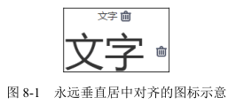
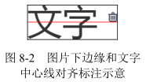

# line-height 的另外一个朋友 font-size

第 5 章介绍过 line-height 和 vertical-align 的好朋友关系，实际上，font-size 也和 line-height 是好朋友，同样也无处不在，并且纸面上 line-height 的数值属性值和百分比值属性值都是相对于 font-size 计算的，其关系可谓不言而喻。

## font-size 和 vertical-align 的隐秘故事

line-height 的部分类别属性值是相对于 font-size 计算的，vertical-align 百分比值属性值又是相对于 line-height 计算的，于是，看上去八辈子都搭不上边的 vertical-align 和 font-size 属性背后其实也有有着关联的。

例如，下面的 CSS 代码组合：

```css
p {
  font-size: 16px;
  line-height: 1.5;
}

p > img {
  vertical-align: -25%;
}
```

此时，p > img 选择器对应元素的 vertical-align 计算值应该是：

16px * 1.5 * -25% = -6px

也就是上面的 CSS 代码等同于：

```css
p {
  font-size: 16px;
  line-height: 1.5;
}

p > img {
  vertical-align: -6px;
}
```

但是两者又有所不同，很显然，-25% 是一个相对计算属性值，如果此时元素的 font-size 发生变化，则图片会自动进行垂直位置调整。我们可以看一个无论 font-size 如何变化、后面图标都垂直居中对齐的例子，无论文字字号是大还是小，后面的图标都非常良好地垂直居中对齐，如图 8-1 所示。



核心 CSS 代码如下：

```css
p > img {
  width: 16px;
  height: 16px;
  vertical-align: 25%;
  position: relative;
  top: 8px;
}
```

原理如下：内联元素默认基线对齐，图片的基线可以看成是图片的下边缘，文字内容的基线是字符 x 下边缘，因此，本例中，图片下边缘默认和“中文”两个汉字字形底边缘往上一点的位置对齐。然后，我们通过 vertical-align:25% 声明让图片的下边缘和中文汉字的中心线对齐。此时，图标和文字的状态应该如图 8-2 所示。



图 8-2 完全就是实例效果注释 top:8px 后的截图标注，没有任何加工。看上去似乎上面小，实际上是视觉误差，分隔线上下完全均等，1 像素不差。

由于我们这里的图标是固定的像素尺寸，因此，通过偏移自身 1/2 高度来实现真正的居中，可以使用 CSS3 transform 位移，我这里为了兼容性，使用了 relative 相对定位。

其居中原理本质上和绝对定位元素 50% 定位加偏移自身 1/2 尺寸实现居中是一样的，只不过这里的偏移使用的是 vertical-align 百分比值。

这么一看，vertical-align 百分比属性值似乎还是有点用的！如果再联想到 vertical-align:middle 实现垂直居中效果经常不尽如人意，说不定还能找到一块更好的宝。但我要告诉你，其实还有更好的实现，那就是使用单位 ex。例如，将前面例子中的 vertical-align:25% 改成 vertical-align:.6ex，效果基本上就是一样的，并且还多了一个优点，就是使用 vertical-align:.6ex 实现的垂直居中效果不会受 line-height 变化影响，而使用 vertical-align:25%，line-height 一旦变化，就必须改变原来的 vertical-align 大小、重新调整垂直位置，这容错性明显就降了一个层次。

因此，虽然例子演示的是 vertical-align 百分比值，实际上是推荐使用与 font-size 有着密切关系的 ex 单位。

说到这里，忍不住想介绍另外一些和 font-size 有着密切的关系的东西。
