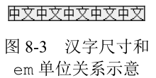
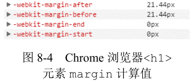

# line-height 的另外一个朋友 font-size

第 5 章介绍过 line-height 和 vertical-align 的好朋友关系，实际上，font-size 也和 line-height 是好朋友，同样也无处不在，并且纸面上 line-height 的数值属性值和百分比值属性值都是相对于 font-size 计算的，其关系可谓不言而喻。

## font-size 和 vertical-align 的隐秘故事

line-height 的部分类别属性值是相对于 font-size 计算的，vertical-align 百分比值属性值又是相对于 line-height 计算的，于是，看上去八辈子都搭不上边的 vertical-align 和 font-size 属性背后其实也有有着关联的。

例如，下面的 CSS 代码组合：

```css
p {
  font-size: 16px;
  line-height: 1.5;
}

p > img {
  vertical-align: -25%;
}
```

此时，p > img 选择器对应元素的 vertical-align 计算值应该是：

16px * 1.5 * -25% = -6px

也就是上面的 CSS 代码等同于：

```css
p {
  font-size: 16px;
  line-height: 1.5;
}

p > img {
  vertical-align: -6px;
}
```

但是两者又有所不同，很显然，-25% 是一个相对计算属性值，如果此时元素的 font-size 发生变化，则图片会自动进行垂直位置调整。我们可以看一个无论 font-size 如何变化、后面图标都垂直居中对齐的例子，无论文字字号是大还是小，后面的图标都非常良好地垂直居中对齐，如图 8-1 所示。


核心 CSS 代码如下：

```css
p > img {
  width: 16px;
  height: 16px;
  vertical-align: 25%;
  position: relative;
  top: 8px;
}
```

原理如下：内联元素默认基线对齐，图片的基线可以看成是图片的下边缘，文字内容的基线是字符 x 下边缘，因此，本例中，图片下边缘默认和“中文”两个汉字字形底边缘往上一点的位置对齐。然后，我们通过 vertical-align:25% 声明让图片的下边缘和中文汉字的中心线对齐。此时，图标和文字的状态应该如图 8-2 所示。


图 8-2 完全就是实例效果注释 top:8px 后的截图标注，没有任何加工。看上去似乎上面小，实际上是视觉误差，分隔线上下完全均等，1 像素不差。

由于我们这里的图标是固定的像素尺寸，因此，通过偏移自身 1/2 高度来实现真正的居中，可以使用 CSS3 transform 位移，我这里为了兼容性，使用了 relative 相对定位。

其居中原理本质上和绝对定位元素 50% 定位加偏移自身 1/2 尺寸实现居中是一样的，只不过这里的偏移使用的是 vertical-align 百分比值。

这么一看，vertical-align 百分比属性值似乎还是有点用的！如果再联想到 vertical-align:middle 实现垂直居中效果经常不尽如人意，说不定还能找到一块更好的宝。但我要告诉你，其实还有更好的实现，那就是使用单位 ex。例如，将前面例子中的 vertical-align:25% 改成 vertical-align:.6ex，效果基本上就是一样的，并且还多了一个优点，就是使用 vertical-align:.6ex 实现的垂直居中效果不会受 line-height 变化影响，而使用 vertical-align:25%，line-height 一旦变化，就必须改变原来的 vertical-align 大小、重新调整垂直位置，这容错性明显就降了一个层次。

因此，虽然例子演示的是 vertical-align 百分比值，实际上是推荐使用与 font-size 有着密切关系的 ex 单位。

说到这里，忍不住想介绍另外一些和 font-size 有着密切的关系的东西。

## 理解 font-size 与 ex、em 和 rem 的关系

ex 是字符 x 高度，显然和 font-size 关系密切，font-size 值越大，自然 ex 对应的大小也就大，对此本书前面已经有介绍，这里不赘述。

下面来看看单位 em。如果说 ex 是字符 x 高度，那是不是 em 就是字符 m 的高度？

我的回答是“不是的”，但是 em 和字符 m 确实有关。em 在传统排版中指一个字模的高度（可以脑补下活字印刷的字模）。

例如，浏览器默认 font-size 大小是 16px，假设一个`<div>`宽度是 160px，则正好可以放下 10 个汉字不换行；如果是 159px 像素，第十个汉字就会掉下来；如果再同时设置 line-height:1 和一个背景色，代码如下：

```css
div {
  width: 160px;
  line-height: 1;
  background-color: #eee;
}
```

我们就会发现中文汉字的尺寸就可以看作 em 单位的代名词，尤其在高度这一块，简直分毫不差，如图 8-3 所示。



也就是说，em 就是'中'等汉字的高度！于是，我们对 em 的理解就更加简单了，直接看一个很容易理解错误的题目，在 Chrome 浏览器下，`<h1>`元素有如下的默认 CSS：

```css
h1 {
  font-size: 2em;
  -webkit-margin-before: 0.67em;
  -webkit-margin-after: 0.67em;
}
```

那么，假设页面没有任何 CSS 重置，根元素 font-size 就是默认的 16px，请问：此时`<h1>`元素 margin-before 的像素计算值是多少？

如果对 em 了解不够，很容易认为 1em 大小就是 16px，于是计算值是16px×0.67 = 10.72px，实际上这是错误的。

我们可以这样想，假设`<h1>`里面有汉字，此时汉字的高度是多少？这个高度就是此时 1em 大小。`<h1>`元素此时 font-size 是 2em，算一下就是 32px，因此，此时里面汉字的高度应该是 32px，也就是说，此时`<h1>`元素的 1em 应该是 32px，于是 margin-before 的像素计算值为 32px×0.67 = 21.44px，和浏览器自己的计算值一样，如图 8-4 所示。



乍一看，似乎出现了死循环悖论：font-size:2em，于是 1em 变成 32px，那此时的 2em 不又是 64px，然后又……

正如前面提到过的一样，CSS 世界的渲染是一次渲染，是不会有死循环的。这里是先计算 font-size，然后再计算给其他使用 em 单位的属性值大小。

总结如下：在 CSS 中，1em 的计算值等同于当前元素所在的 font-size 计算值，可以将其想象成当前元素中（如果有）汉字的高度。

所有相对单位的好处都是一样的，样式表现更具有弹性。例如，理论上，有一个布局，希望小屏时整体缩小，大屏时再弹性扩大，此时就可以让所有元素宽高尺寸等都使用 em，于是，最后只要改变布局祖先元素的 font-size 大小就可以实现整体的弹性变化。

这种策略很棒，也确实可行，但是有一个比较麻烦的事情，它和上面`<h1>`元素计算一样的麻烦，em 是根据当前 font-size 大小计算的，一旦布局中出现标题这种跟基础 font-size 大小不一样的场景的时候，标题里面所有元素 em 都要重新计算一遍，甚为麻烦，最终的成品维护成本就比较高了。

正是由于这种局限性，另外一个和 font-size 密切相关的单位出现了，就是 rem，即 root em，顾名思义，就是根元素 em 大小。em 相对于当前元素，rem 相对于根元素，本质差别在于当前元素是多变的，根元素是固定的，也就是说，如果使用 rem，我们的计算值不会受当前元素 font-size 大小的影响，假设`<h1>`的默认 CSS 是这样：

```css
h1 {
  font-size: 2em;
  -webkit-margin-before: 0.67rem;
  -webkit-margin-after: 0.67rem;
}
```

那么 2m 的 font-size 计算值会被忽略，直接使用根元素的 16px 进行计算，于是 margin-before 计算值是 16 像素×0.67 = 10.72 像素。

因此，要想实现带有缩放性质的弹性布局，使用 rem 是最佳策略，但 rem 是 CSS3 单位，IE9 以上浏览器才支持，需要注意兼容性，我这里就不再多介绍了。

回到 em 单位。em 实际上更适用于图文内容展示的场景，对此进行弹性布局。例如，`<h1>`～`<h6>`以及`<p>`等与文本内容展示的元素的 margin 都是用 em 作为单位，这样，当用户把浏览器默认字号从“中”设置成“大”或改成“小”的时候，上下间距也能根据字号大小自动调整，使阅读更舒服。

再举个适用于 em 的场景，如果我们使用 SVG 矢量图标，建议设置 SVG 宽高如下：

```css
svg {
  width: 1em;
  height: 1em;
}
```

这样，无论图标是个大号文字混在一起还是和小号文字混在一起，都能和当前文字大小保持一致，既省时又省力。

## 理解 font-size 的关键字属性值

font-size 支持长度值，如 1em，也支持百分比值，如 100%。这两点想必众所周知，但font-size 还支持关键字属性值这一点怕是就有不少人不清楚了。

font-size 的关键字属性值分以下两类。

1. **相对尺寸关键字。**指相对于当前元素 font-size 计算，包括：
    - larger：大一点，是`<big>`元素的默认 font-size 属性值。
    - smaller：小一点，是`<small>`元素的默认 font-size 属性值。
2. **绝对尺寸关键字。**与当前元素 font-size 无关，仅受浏览器设置的字号影响。注意这里的措辞，是“浏览器设置”，而非“根元素”，两者是有区别的。
    - xx-large：好大好大，和`<h1>`元素计算值一样。
    - x-large：好大，和`<h2>`元素计算值一样。
    - large：大，和`<h3>`元素计算值近似
    - medium：不上不下，是 font-size 的初始值，和`<h4>`元素计算值一样。
    - small：小，和`<h5>`元素计算值近似。
    - x-small：好小，和`<h6>`元素计算值近似。
    - xx-small：好小好小，无对应的 HTML 元素。

其中，相对尺寸关键字 larger 和 smaller 由于计算的系数在不同浏览器下差异很大，因此实用价值有限，只有类似文档页、帮助页这类对文字尺寸要求不高的场合才有用；而绝对尺寸关键字的实用性要大一些，而且在某些场合是推荐使用的关键字属性值，这个要慢慢讲。

下面两个 CSS 代码有什么区别？

```css
html {
  font-size: 14px;
}

html {
  font-size: 87.5%;
}
```

在绝大多数场景下，两者没有差别，全都计算为 14px，但是如果用户对浏览器的字号进行了调整，例如，把默认的“中”设置成了“大”，如图 8-5 所示（截自 Chrome 浏览器），那么此时，font-size: 14px 计算值还是 14px，但 font-size: 87.5% 的计算值则大了一圈，于是差别就出现了。如果是像素单位 font-size，用户改变浏览器的默认字号后，页面会微丝不动；如果是百分比值 font-size，则字号相应放大，这就涉及用户体验和可访问性问题了。

正常情况下，14 像素的文字大小是足够的，但是，如果是高度近视的用户，或者上班急急忙忙忘记戴眼镜，或者在投影仪上投影网页内容，此时就有大字号浏览网页的需求，如果使用固定的像素单位，显然对这些使用场景是不友好的。

好在浏览器还提供了“网页缩放”功能，但是此功能也是有局限性的：如果网页是定宽非响应式的，则网页放大后窗体以外的内容就看不到了，在 Chrome/Firefox 浏览器下甚至连个水平滚动条都没有，说不定重要信息就会看不到。由此可见，我们是不能轻易忽视浏览器字号设置功能的。

然而，现代网页设计得很精致，要想网页布局跟随字体内容缩放实在两难，要么使用 em，但 em 计算与当前 font-size 耦合，不好维护；要么使用 rem，但 IE8 不支持，桌面端使用尴尬。因此，现实的压迫导致我们只能使用 px 进行布局，尤其桌面端网页。

如何权衡“易于实现维护”“视觉还原”“可访问性”这三者，我这里有两个建议。

1. 即使是定宽的传统桌面端网页，也需要做响应式处理，尤其是针对 1200 像素宽度设计的网页，但只需要响应到 800 像素即可，可以保证至少有 1.5 倍的缩放空间，如果做到这一步，那么是否需要响应浏览器的字号设置这一点就可以忽略。
2. 如果因各种原因无法做响应式处理，也没有必要全局都使用相对单位，毕竟成本等现实问题摆在那里，其实只需要在图文内容为主的重要局部区域使用可缩放的 font-size 处理即可。例如，小说网站的阅读页、微信公众号文章展示区、私信对话内容区、搜索引擎的落地页、评论区等，都强烈建议摒弃 px 单位，而采用下面的实践策略。
    - 容器设置 font-size: medium，此时，这个局部展示区域的字号就跟着浏览器的设置走了，默认计算值是 16px。
    - 容器内的文字字号全部使用相对单位，如百分比值或者 em 都可以，然后基于 16px 进行转换。例如：
      ```css
      .article {
        font-size: medium;
      }
      .article h1 {
        font-size: 2em;
        margin: .875em 0;
      }
      .article p {
        font-size: 87.5%; /* 默认字号下计算值是 14px */
        margin: 1em 0;
      }
      ```
      同时使用自适应流体布局，间距什么的也使用相对单位，例如上面 margin 使用的是 em 单位。于是，当用户改变了浏览器的字号后，整个阅读区域的所有字样甚至布局都会跟着放大，文字一下子就看清楚了。这种局部处理的好处在于，页面的导航、侧边栏这些不需要长时间阅读的模块还是原来的像素布局，还是那么精致，丝毫不受影响。就这么很微小的变动，就可以让你的网页在可访问性这一块超越大多数的网站，何乐而不为？

可以看到，绝对尺寸关键字在实际项目中还有很有价值的，但有价值的仅仅是 medium，至于其他关键字，作用仅限于字面上的那点儿，大家了解一下即可。

## font-size: 0 与文本的隐藏

桌面 Chrome 浏览器下有个 12px 的字号限制，就是文字的 font-size 计算值不能小于 12px，我猜是因为中文，如宋体，要是小于 12px，就会挤成成一团，略丑，Chrome 看不下去，就直接禁用了。

正是这种限制导致我们在使用 em 或 rem 进行布局的时候，不能这么处理：

```css
html {
  font-size: 62.5%;
}
```

理论上，此时根字号计算值是 16px*0.625=10px，于是 width:14px 可以写成 width:1.4em，省了很多计算的麻烦。但是，在 Chrome 下由于 12px 的限制，根字号计算值实际不是 10px，而是 12px，所以，可以试试处理成这样：

```css
html {
  font-size: 625%;
}
```

此时根字号计算值是 100px，既计算无忧，又没有 12px 的最小字号限制。

但是我个人建议还是不要这样处理，尤其使用 em 的时候，因为 font-size 属性和 line-height属性一样，由于继承性的存在，会影响贯穿整个网页，100px 的环境font-size一定会将平时不显山露水的底边对齐问题、间隙问题等放大，导致出现一些明显的样式问题，如果对 CSS 了解不是很深刻，怕是很难明白为什么会发生这样的问题。同时这样做也限制了 px 等其他单位的使用，有时候是比较要命的。

因此，我的建议是仍基于浏览器默认的字号进行相对计算，也就是 medium 对应的 16px，16 这个数字是一定可以整除的，因此计算成本还行，或者使用 Sass 或 Less 之类的工具辅助计算。

还是回到字号限制的问题。实际上，并不是所有小于 12px 的 font-size 都会被当作 12px 处理，有一个值例外，那就是 0，也就是说，如果 font-size:0 的字号表现就是 0，那么文字会直接被隐藏掉，并且只能是 font-size:0，哪怕设置成 font-size:0.0000001px，都还是会被当作 12px 处理的。

因此，如果希望隐藏 logo 对应元素内的文字，除了 text-indent 缩进隐藏外，还可以试试下面这种方法：

```css
.logo {
  font-size: 0;
}
```
