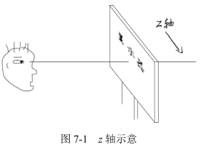
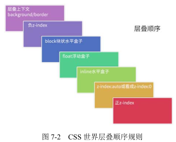
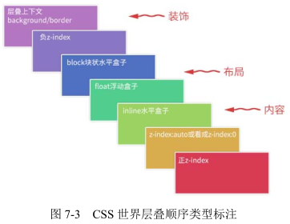
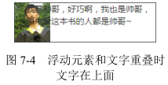
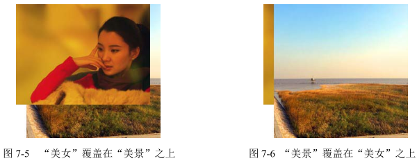
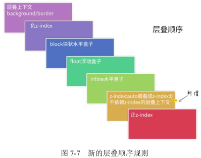
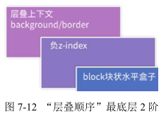
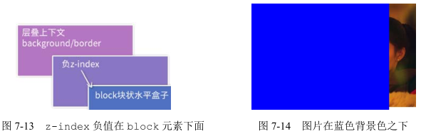
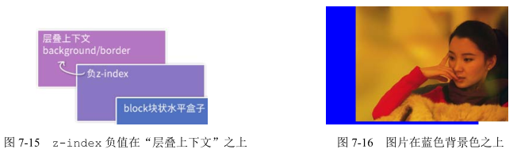
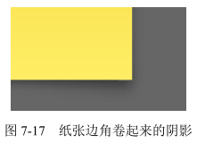

所谓“层叠规则”，指的是当网页中的元素发生层叠时的表现规则。

默认情况下，网页内容是没有偏移角的垂直视觉呈现，当内容发生层叠的时候，一定会有一个前后的层叠顺序产生，有点儿类似于真实世界中“论资排辈”的感觉。

# z-index 只是 CSS 层叠规则中的一部分

在 CSS 世界中，z-index 属性只有和定位元素（position 不为 static 的元素）在一起的时候才有作用，可以是正数也可以是负数。理论上说，数值越大层级越高，但实际上其规则要复杂很多。

但随着 CSS3 新世界的到来，z-index 已经并非只对定位元素有效，flex 盒子的子元素也可以设置 z-index 属性。

要知道，网页中绝大部分元素是非定位元素，并且影响层叠顺序的属性远不止 z-index 一个，因此大家千万不要以为 z-index 属性就可以代表 CSS 世界的层叠规则，实际上 z-index 只是 CSS 层叠规则中的一叶小舟，CSS 层叠规则的体量要比大家想象的要大得多。

# 理解 CSS 世界的层叠上下文和层叠水平

## 什么是层叠上下文

层叠上下文，英文称作 stacking context，是 HTML 中的一个三维的概念。如果一个元素含有层叠上下文，我们可以理解为这个元素在 z 轴上就“高人一等”。

这里出现了一个名词 — z 轴，它指的是什么呢？其表示的是用户与显示器之间这条看不见的垂直线，即图 7-1 中的这条水平线。



层叠上下文是一个概念，跟“块状格式化上下文”（BFC）类似。我们可以把层叠上下文理解为一种“层叠结界”，自成一个小世界。这个小世界中可能有其他的“层叠结界”，而自身也可能处于其他“层叠结界”中。

## 什么是层叠水平

stacking level，决定了同一个层叠上下文中元素在 z 轴上的显示顺序。

所有的元素都有层叠水平，包括层叠上下文元素，也包括普通元素。然而，对普通元素的层叠水平探讨只局限在当前层叠上下文元素中。为什么呢？因为不如此就没有意义。层叠上下文本身就是一个强力的“层叠结界”，而普通元素的层叠水平是无法突破这个结界和结界外的元素去较量层叠水平的。

需要注意的是，诸位千万不要把层叠水平和 CSS 的 z-index 属性混为一谈。尽管某些情况下 z-index 确实可以影响层叠水平，但是只限于定位元素以及 flex 盒子的孩子元素；而层叠水平所有的元素都存在。

# 理解元素的层叠顺序

再来说说层叠顺序。层叠顺序，英文称作 stacking order，表示元素发生层叠时有着特定的垂直显示顺序。注意，这里跟上面两个不一样，上面的“层叠上下文”和“层叠水平”是概念，而这里的“层叠顺序”是规则。

在 CSS 2.1 的年代，在 CSS3 新世界还没有到来的时候（注意这里的前提），层叠顺序规则如图 7-2 所示。



关于图 7-2 这里有一些补充说明。

1. 位于最下面的 background/border 特指层叠上下文元素的边框和背景色。每一个层叠顺序规则仅适用于当前层叠上下文元素的小世界。
2. inline 水平盒子指的是包括 inline/inline-block/inline-table 元素的“层叠顺序”，它们都是同等级别的。
3. 单纯从层叠水平上看，实际上 z-index: 0 和 z-index: auto 是可以看成是一样的。注意这里的措辞 — “单纯从层叠水平上看”，实际上，两者在层叠上下文领域有着根本性的差异。

为什么内联元素的层叠顺序要比浮动元素和块状元素都高？



background/border 为装饰属性，浮动和块状元素一般用作布局，而内联元素都是内容。网页中最重要的是什么？当然是内容了！尤其是 CSS 世界是为更好的图文展示而设计的，因此，一定要让内容的层叠顺序相当高，这样当发生层叠时，重要的文字、图片内容才可以优先显示在屏幕上。例如，文字和浮动图片重叠的时候，如图 7-4 所示。



# 务必牢记的层叠准则

下面这两条是层叠领域的黄金准则。当元素发生层叠的时候，其覆盖关系遵循下面两条准则：

1. 谁大谁上：当具有明显的层叠水平标识的时候，如生效的 z-index 属性值，在同一个层叠上下文领域，层叠水平值大的那一个覆盖小的那一个。
2. 后来居上：当元素的层叠水平一致、层叠顺序相同的时候，在 DOM 流中处于后面的元素会覆盖前面的元素。

在 CSS 和 HTML 领域，只要元素发生了重叠，都离不开上面这两条黄金准则。因为后面会有多个实例说明，这里就到此为止。

# 深入了解层叠上下文

## 层叠上下文的特性

层叠上下文元素有如下特性：

- 层叠上下文的层叠水平要比普通元素高（原因后面会说明）。
- 层叠上下文可以阻断元素的混合模式。（isolation: isolate 创建一个新的层叠上下文(stacking context)。）
- 层叠上下文可以嵌套，内部层叠上下文及其所有子元素均受制于外部的“层叠上下文”。
- 每个层叠上下文和兄弟元素独立，也就是说，当进行层叠变化或渲染的时候，只需要考虑后代元素。
- 每个层叠上下文是自成体系的，当元素发生层叠的时候，整个元素被认为是在父层叠上下文的层叠顺序中。

## 层叠上下文的创建

和块状格式化上下文一样，层叠上下文也基本上是由一些特定的 CSS 属性创建的。我将其总结为 3 个流派。

1. 天生派：页面根元素天生具有层叠上下文，称为根层叠上下文。
2. 正统派：z-index 值为数值的定位元素的传统“层叠上下文”。
3. 扩招派：其他 CSS3 属性。

### 根层叠上下文

根层叠上下文指的是页面根元素，可以看成是`<html>`元素。因此，页面中所有的元素一定处于至少一个“层叠结界”中。

### 定位元素与传统层叠上下文

对于 position 值为 relative/absolute 以及 Firefox/IE 浏览器（不包括 Chrome 浏览器）下含有 position:fixed 声明的定位元素，当其 z-index 值不是 auto 的时候，会创建层叠上下文。

```html
<div style="position:relative; z-index:auto;">
  <!-- 美女 -->
  
</div>
<div style="position:relative; z-index:auto;">
  <!-- 美景 -->
  
</div>
```

结果如图 7-5 所示。效果符合预期，毕竟“美女”图片的 z-index 值是 2，而“美景”图片的 z-index 是 1。

下面我们对父级简单调整一下，把 z-index:auto 改成层叠水平一样高的 z-index:0，代码如下：

```html
<div style="position:relative; z-index:0;">
  <!-- 美女 -->
  
</div>
<div style="position:relative; z-index:0;">
  <!-- 美景 -->
  
</div>
```

结果会发现覆盖关系居然反过来了，此时“美景”图片覆盖在了“美女”图片之上，如图 7-6 所示。



z-index: auto 所在的`<div>`元素是一个普通定位元素，于是，里面的两个``元素的层叠比较就不受父级的影响，两者直接套用“层叠黄金准则”。这里，两个``元素有着明显不一的 z-index 值，因此遵循“谁大谁上”的准则，于是，z-index 为 2 的那个“美女”就显示在 z-index 为 1 的“美景”上面了。

而 z-index 一旦变成数值，哪怕是 0，就会创建一个层叠上下文。此时，层叠规则就发生了变化。层叠上下文的特性里面最后一条是自成体系。两个``元素的层叠顺序比较变成了优先比较其父级层叠上下文元素的层叠顺序。这里，由于外面的两个`<div>`元素都是 z-index:0，两者层叠顺序一样大，此时遵循“层叠黄金准则”的另外一个准则“后来居上”，根据在 DOM 文档流中的位置决定谁在上面，于是，位于后面的“美景”就自然而然显示在“美女”上面了。对，没错，``元素上的 z-index 没起作用！

有时候，我们在网页重构的时候会发现 z-index 嵌套错乱，这时要看看是不是受父级的层叠上下文元素干扰了，可能就豁然开朗了。但我还是提一下，IE6 和 IE7 浏览器有个 bug，就是 z-index:auto 的定位元素也会创建层叠上下文。这就是过去 IE6 和 IE7 的 z-index 会折腾死人的原因。

我再提一下 position:fixed。在过去，position:fixed 和 relative/ absolute 在层叠上下文这一块是一样的，都是需要 z-index 为数值才行。但是，不知道什么时候起，Chrome 等 WebKit 内核浏览器下 position:fixed 元素天然层叠上下文元素，无须 z-index 为数值。根据我的测试，目前 IE 和 Firefox 仍是老套路。

### CSS3 与新时代的层叠上下文

CSS3 新世界的出现除了带来了新属性，还对过去的很多规则发出了挑战，其中对层叠上下文规则的影响显得特别突出。

1. 元素为 flex 布局元素（父元素 display:flex|inline-flex），同时 z-index 值不是 auto。
2. 元素的 opacity 值不是 1。
3. 元素的 transform 值不是 none。
4. 元素 mix-blend-mode 值不是 normal。
5. 元素的 filter 值不是 none。
6. 元素的 isolation 值是 isolate。
7. 元素的 will-change 属性值为上面 2 ～ 6 的任意一个（如 will-change:opacity、will-chang:transform 等）。
8. 元素的 -webkit-overflow-scrolling 设为 touch。

## 层叠上下文与层叠顺序

一旦普通元素具有了层叠上下文，其层叠顺序就会变高。那它的层叠顺序究竟在哪个位置、哪个级别呢？

这里需要分两种情况讨论：

1. 如果层叠上下文元素不依赖 z-index 数值，则其层叠顺序是 z-index:auto，可看成 z:index:0 级别；
2. 如果层叠上下文元素依赖 z-index 数值，则其层叠顺序由 z-index 值决定。



这下大家应该知道为什么定位元素会层叠在普通元素的上面了吧？其根本原因就是：元素一旦成为定位元素，其 z-index 就会自动生效，此时其 z-index 就是默认的 auto，也就是 0 级别，根据上面的层叠顺序表，就会覆盖 inline 或 block 或 float 元素。而不支持 z-index 的层叠上下文元素天然是 z-index:auto 级别，也就意味着，层叠上下文元素和定位元素是一个层叠顺序的，于是当它们发生层叠的时候，遵循的是“后来居上”准则。

```html
 
```

这符合“后来居上”准则，“美景”覆盖在“美女”之上，如图 7-8 所示。

```html
 
```

这同样符合“后来居上”准则，“美女”覆盖在“美景”之上，如图 7-9 所示。


你会发现，两者样式一模一样，只是在 DOM 流中的位置不一样，这导致它们的层叠表现不一样，后面的图片在前面的图片的上面显示。这就说明层叠上下文元素的层叠顺序就是 z-index:auto 级别。

最后分享一个与层叠上下文相关的有趣现象。

在实际项目中，我们可能会渐进使用 CSS3 的 fadeIn 淡入 animation 效果增强体验，于是我们可能就会遇到类似下面的现象，有一个绝对定位的黑色半透明层覆盖在图片上，默认显示如图 7-10 所示。但是，一旦图片开始走 fadeIn 淡出的 CSS3 动画，文字就跑到图片后面去了，因为文字一直是 100%透明的纯白色，文字变淡是因为跑到图片后面，而图片半透明，文字穿透显示而已，如图 7-11 所示。


为什么会这样？实际上，学了本节的内容后就很容易理解了。fadeIn 动画本质是 opacity 透明度的变化：

```css
@keyframes fadeIn {
  0% {
    opacity: 0;
  }
  100% {
    opacity: 1;
  }
}
```

要知道，opacity 的值不是 1 的时候，是具有层叠上下文的，层叠顺序是 z-index:auto 级别，跟没有 z-index 值的 absolute 绝对定位元素是平起平坐的。而本实例中的文字元素在图片元素的前面，于是，只要 CSS3 动画不是最终一瞬间的 opacity:1，位于 DOM 流后面的图片就会遵循“后来居上”准则而覆盖文字。

知道原因，想要解决这个问题就很简单了：

1. 调整 DOM 流的先后顺序；
2. 提高文字的层叠顺序，例如，设置 z-index:1。

# z-index 负值深入理解

z-index 是支持负值的，例如 z-index:-1 或者 z-index:-99999 都是可以的。

那 z-index 具体的表现规则又是怎样的呢？

很多人（包括我）一开始的时候，以为一个定位元素设置 z-index 负值，就会跑到页面的背后，隐藏掉，看不到了。结果实际上是有时候确实隐藏了，但有时候又隐藏不掉。为什么会这样？

因为 z-index 负值的最终表现并不是单一的，而是与“层叠上下文”和“层叠顺序”密切相关。前面展示的层叠顺序规则 7 阶图，其中最下面的 2 阶是理解 z-index 负值表现的关键，如图 7-12 所示。



图 7-12 中已经很明显地标明了，z-index 负值元素的层级是在层叠上下文元素上面、block 元素的下面，也就是 z-index 虽然名为负数层级，但依然无法突破当前层叠上下文所包裹的小世界。

```html
<div class="box">
  
</div>
```

先看下面的 CSS 代码：

```css
.box {
  background-color: blue;
}

.box > img {
  position: relative;
  z-index: -1;
  right: -50px;
}
```

此时.box 是一个普普通通的元素，图片元素所在的层叠上下文元素一定是 .box 的某个祖先元素。好了，知道这么多足够了，现在再回顾一下刚刚出现的图 7-13 所示的这张图。

图 7-13 中非常明显地标明了 z-index 负值在 block 元素的下面。本例中，图片是 z-index 负值元素，.box 是 block 元素，也就是图片应该在 .box 元素的后面显示，因此，图片会被 .box 元素的蓝色背景覆盖。最后的结果确实如此，如图 7-14 所示。



现在，我们给.box 元素加个样式，使其具有层叠上下文。很多 CSS 属性都可以，我们这里就使用不影响视觉表现的 transform 属性示意如下：

```css
.box {
  background-color: blue;
  transform: scale(1);
}

.box > img {
  position: relative;
  z-index: -1;
  right: -50px;
}
```

CSS3 transform 可以让元素具有新的层叠上下文，于是，对照图 7-15，非常明显地标明了 z-index 负值在层叠上下文元素的背景色之上，也就是说，这里 z-index 是负值的图片元素应该在.box 元素的上面。最后的结果确实如此，如图 7-16 所示。



可以这么说，z-index 负值渲染的过程就是一个寻找第一个层叠上下文元素的过程，然后层叠顺序止步于这个层叠上下文元素。

那 z-index 负值在实际项目中有什么用呢？具体作用如下。

1. **可访问性隐藏。**z-index 负值可以隐藏元素，只需要层叠上下文内的某一个父元素加个背景色就可以。它与 clip 隐藏相比的一个优势是，元素无须绝对定位，设置 position:relative 也可以隐藏，另一个优势是它对原来的布局以及元素的行为没有任何影响，而 clip 隐藏会导致控件 focus 的焦点发生细微的变化，在特定条件下是有体验问题的。它的不足之处就是不具有普遍适用性，需要其他元素配合进行隐藏。
2. **IE8 下的多背景模拟。**CSS3 中有一个多背景特性，就是一个 background 可以写多个背景图。虽然 IE8 浏览器不支持多背景特性，但是 IE8 浏览器支持伪元素，于是，IE8 理论上也能实现多背景，这个背景最多 3 个，好在绝大多数场景 3 个背景图足矣。最麻烦的其实是这个伪元素生成的背景一定是使用 absolute 绝对定位，以免影响内容的布局。于是问题来了，绝对定位会覆盖常规的元素，此时则必须借助 z-index 负值，核心 CSS 代码如下：

   ```css
   .box {
     background-image: (1png);
     position: relative;
     z-index: 0; /* 创建层叠上下文 */
   }

   .box:before,
   .box:after {
     content: '';
     position: absolute;
     z-index: -1;
   }

   .box:before {
     background-image: (2png);
   }

   .box:after {
     background-image: (3png);
   }
   ```

   此时，就算.box 元素里面是纯文字，伪元素图片照样在文字下面，如此广泛的适用场景使上面的处理几乎可以作为通用的多背景模拟实现准则来实现了：

   ```html
   <div class="box">我是一段纯文字...</div>
   ```

3. **定位在元素的后面。**我们直接看一个模拟纸张效果的例子，该效果的亮点是纸张的边角有卷起来的效果，因为底边的阴影看起来更有角度，如图 7-17 所示。 

   HTML 结构大致如下：

   ```html
   <div class="container">
     <div class="page">标题和内容</div>
   </div>
   ```

   其中，.container 是灰色背景元素，.page 是黄色背景的纸张元素，关键 CSS 如下：

   ```css
   .container {
     background-color: #666;
     /* 创建层叠上下文 */
     position: relative;
     z-index: 0;
   }

   .page {
     background-color: #f4f39e;
     position: relative;
   }

   /* 边角卷边阴影 */
   .page:before,
   .page:after {
     content: '';
     width: 90%;
     height: 20%;
     box-shadow: 0 8px 16px rgba(0, 0, 0, 0.3);
     position: absolute;
     /* 层叠上下文（灰色背景）之上，定位元素（黄色纸张）之下 */
     z-index: -1;
   }

   /* 边角卷边阴影定位和角度控制 */
   .page:before {
     transform: skew(-15deg) rotate(-5deg);
     transform-origin: left bottom;
     left: 0;
     bottom: 0;
   }

   .page:after {
     transform: skew(15deg) rotate(5deg);
     transform-origin: right bottom;
     right: 0;
     bottom: 0;
   }
   ```

   .container 灰色背景通过 position:relative;z-index:0 创建了层叠上下文，.page 仅有 position:relative 而没有设置 z-index 值，因此只能算 z-index:auto 程度的定位元素，于是，z-index:-1 两个边角阴影就完美地藏在了层叠上下文（灰色背景）之上、普通定位元素（黄色纸张）之下（如图 7-18 所示标注），隐藏了丑陋的细节，展示了完美的边角阴影，实现了最终细腻的样式效果。

   

# z-index“不犯二”准则

此准则内容如下：对于非浮层元素，避免设置 z-index 值，z-index 值没有任何道理需要超过 2。

1. 定位元素一旦设置了 z-index 值，就从普通定位元素变成了层叠上下文元素，相互间的层叠顺序就发生了根本的变化，很容易出现设置了巨大的 z-index 值也无法覆盖其他元素的问题。
2. 避免 z-index “一山比一山高”的样式混乱问题。此问题多发生在多人协作以及后期维护的时候。例如，A 小图标定位，习惯性写了个 z-index:9；B 一看，自己原来的实现被覆盖了，立马写了个 z-index:99；结果比弹框组件层级还高，那还得了，立马弹框组件来一个 z-index:999999；谁知后来，弹框中又要有出错提示效果……显然，最后项目的 z-index 层级管理就是一团糟。

如果真的了解了本章的内容，你就会发现，原来自己的代码中很大一部分 z-index 设置都是多余的，不仅浪费代码，还埋下样式问题风险，尤其那种使用 absolute 绝对定位必使用 z-index 的做法是最愚蠢的。

如果 DOM 顺序确实无法调整，不得不使用 z-index 值，请记住，z-index 不要超过 2，不是不能，而是没有必要。我从业这么多年，遇到很多很复杂的与定位相关的交互场景，但 z-index 最多止步于 2。如果你的定位发现必须 z-index:3 或者以上才能满足效果，建议你检查自己的代码，试试应用“relative 的最小化原则”来实现，试试利用元素原生的层叠顺序进行层级控制，等等。

很重要的一点，我这里的“不犯二”准则，并不包括那些在页面上飘来飘去的元素定位，弹框、出错提示、一些下拉效果等都不受这一准则限制。

对于这类 JavaScript 驱动的浮层组件，我会借助“层级计数器”来管理，原因如下：

1. 总会遇到意想不到的高层级元素；
2. 组件的覆盖规则具有动态性。

所谓“层级计数器”，实际上就是一段 JavaScript 脚本，会遍历所有`<body>`处于显示状态的子元素，并得到最大 z-index 值，和默认的 z-index 做比较。如果超出，则显示的组件的 z-index 自动加 1，这样就不会出现有组件被其他组件覆盖的问题；如果不超出，就使用默认的 z-index 值，我习惯设成 9，因为遵循“不犯二”准则的情况下，9 已经是个足够安全的值了，浮层组件根本无须担心会被页面上某个元素层级覆盖。

此刻大家不妨想想自己的项目，如果所有的浮层相关的组件容器的 z-index 默认值是 9，会不会出现样式问题。如果觉得层级太低不敢想象，则说明你的项目层级这块还有较大改进的空间。页面上主体元素遵循 z-index“不犯二”准则，浮层元素使用 z-index“层级计数器”，双管齐下，从此和 z-index 问题说拜拜！
