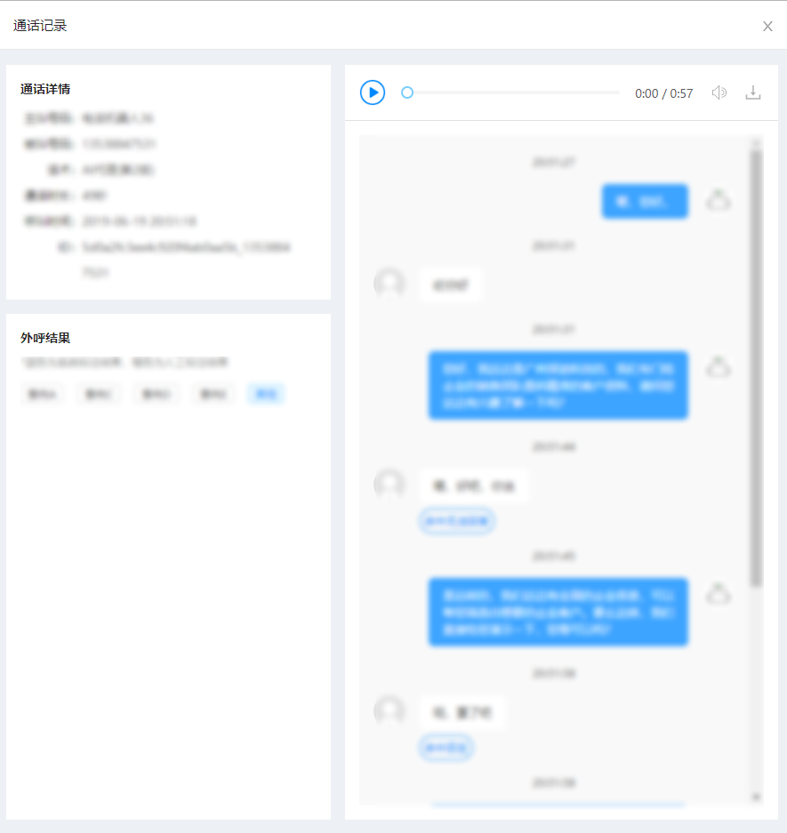

# 需求背景

在做侧边抽屉时遇到了需要强行撑满剩余高度的情况，左边的外呼结果要强行撑满剩余高度，这考察了等高布局的应用



# 解决方案

首先明确侧边栏左边 html 的结构，其中 html 采用 react 写法，css 采用 less 写法

```html
<div className={styles.leftBody}>
  <div className={styles.leftBodyTop}>
    
  </div>
  <div className={styles.leftBodyBottom}>
    
  </div>
</div>
```

## table 布局

比较 hack 的方法

```css
.leftBody {
  display: table;

  .leftBodyTop {
    background: #fff;
    display: table-row;
    height: 0; /* 尽可能的减小高度，即自适应内容 */
  }

  .leftBodyBottom {
    background: #fff;
    display: table-row; /* 占满剩余空间，自适应父类剩余高度 */
    vertical-align: top; /* 将内容放在顶部 */

    &::before { /* 设置 display：table-row; 时，margin 和 padding 设置会失效，故这里用伪元素代替显示 */
      content: '';
      display: block;
      width: 100%;
      height: 16px;
      background: #edf0f4;
    }
  }
}
```

## margin 与 padding

```css
.leftBody {
  overflow: hidden; /* 必须设置，否则露底 */

  .leftBodyTop {
    background: #fff;
  }

  .leftBodyBottom {
    background: #fff;
    margin-top: 16px;
    margin-bottom: -3000px; /* margin 与 padding 相互抵消来撑满剩余高度 */
    padding-bottom: 3000px;
  }
}
```

## absolute

此方法需要对 html 做出改动

```html
<div className={styles.leftBody}>
  <div className={styles.leftBodyTop}>

  </div>
  <div className={styles.leftBodyBottom}>
    <div className={styles.equalHeight} />
    <div className={styles.content}>
    
    </div>
  </div>
</div>
```

由于绝对定位元素无高度的特性无宽度的特性，我们可以伪造一个高度足够高的绝对定位层（设置背景色，边框等属性），同时设置父标签溢出隐藏，那么其多出来的高度就不会显示了，也就实现了看上去的等高布局效果了

```css
.leftBody {
  overflow: hidden; /* 必须设置，否则露底 */

  .leftBodyTop {
    background: #fff;
  }

  .leftBodyBottom {
    background: #fff;
    margin-top: 16px;
    position: relative;

    .equalHeight {
      background: #fff;
      width: 100%;
      height: 999em;
      position: absolute;
      left: 0;
      top: 0;
    }

    .content {
      position: relative;
      z-index: 1; /* 内容必须在上方，否则被 equalHeight 覆盖 */
    }
  }
}
```

## flex

代码最简洁

```css
.leftBody {
  display: flex;
  flex-direction: column;

  .leftBodyTop {
    background: #fff;
  }

  .leftBodyBottom {
    background: #fff;
    margin-top: 16px;
    flex: 1;
  }
}
```

以上更新于`2019-6-20 16:39:27`

---
