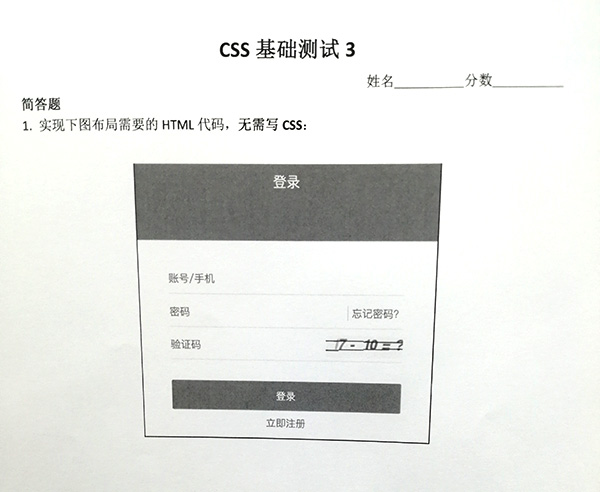
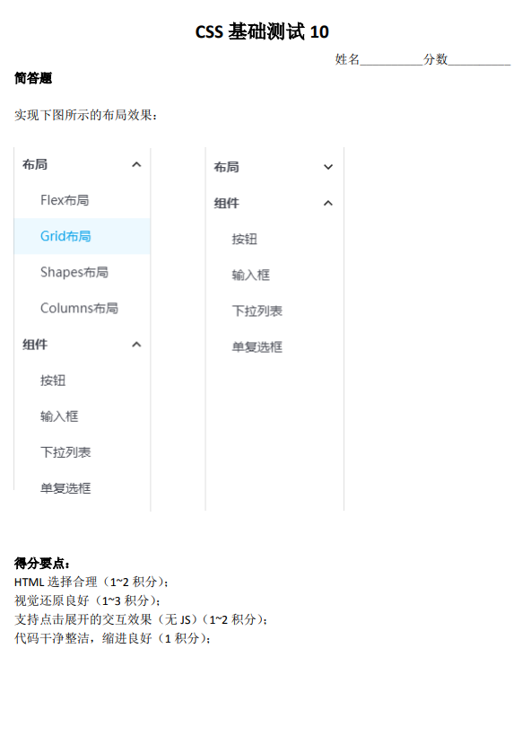
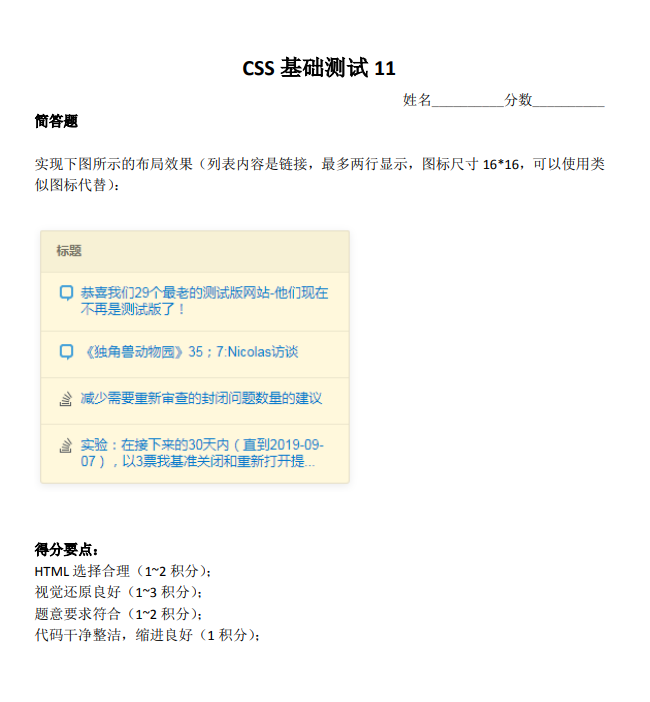
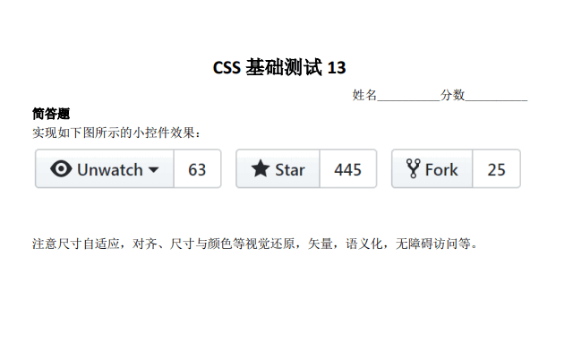
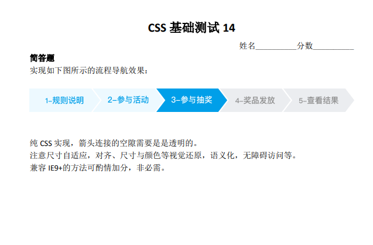
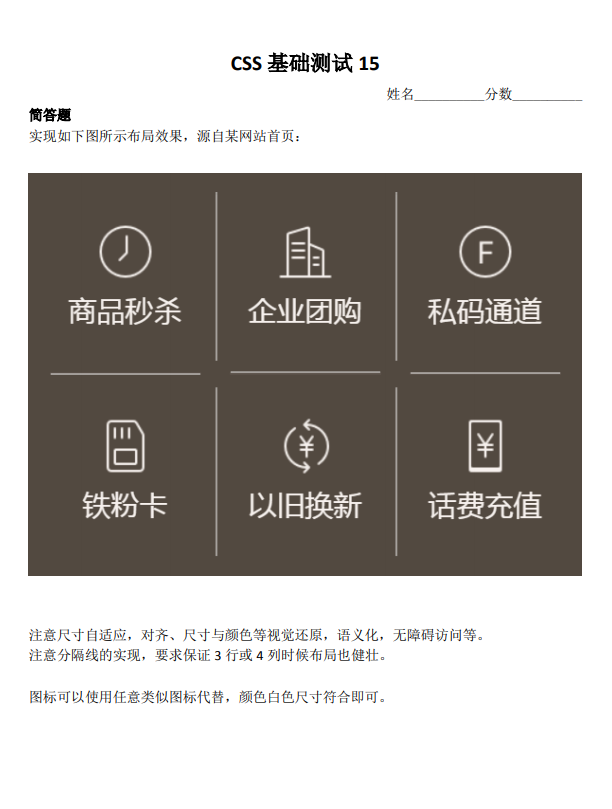
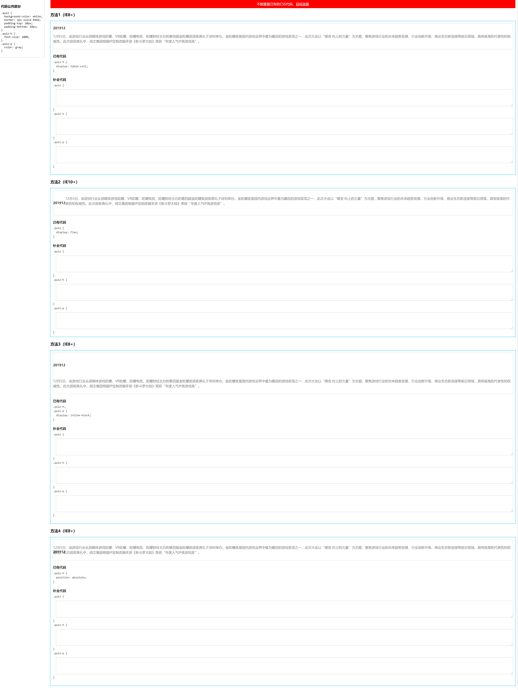

练习地址：[小测答题收集区](https://github.com/zhangxinxu/quiz)

# CSS 测试一


## 具体实现

### overflow: hidden + float（不完美，显示的顺序与实际的 html 顺序不一致）

<iframe src="/examples/css-practice/1-1.html" width="400" height="100"></iframe>

`embed:css-practice/1-1.html`

### flex + flex：1

<iframe src="/examples/css-practice/1-2.html" width="400" height="100"></iframe>

`embed:css-practice/1-2.html`

### table + table-layout: fixed（兼容性较好）

<iframe src="/examples/css-practice/1-3.html" width="400" height="100"></iframe>

`embed:css-practice/1-3.html`

## 实现要点

1. 大家布局其实这 3 类：float+overflow，然后是 flex 布局，很少人使用的 table 布局。
2. float 布局技巧：float:right+overflow:hidden;text-overflow:ellipsis;white-space:nowrap; 原理：overflow:hidden 可以创建格式化上下文，也就是 BFC，类似结界，不受浮动影响，自动分配剩余空间。
3. flex 布局：display:flex > flex: 1;overflow:hidden;text-overflow:ellipsis;white-space:nowrap;
4. 重点是 table 布局：float 布局有个非常明显的不足，那就是 DOM 的位置和视觉是不一致的。table 布局虽然效果有，但是却有很多的不足。1. 左侧 table-cell 的尺寸不建议使用字符撑开，然后内容绝对定位打点布局有较大的限制。非 table-layout:fixed 的表格，其每个单元格尺寸宽度是根据里面内容自动分配的，如果你没有设置 white-space: nowrap 是自动宽度自适应的。但是设置了 white-space: nowrap 则尺寸表现就不符合要求，怎么办呢？其实很简单，再嵌套一层 display:table;table-layout:fixed;的元素。table 布局中，打点只能在 table-layout:fixed 的场景下。所以，我们设置很大宽度的 table-cell 的子元素 display:table;table-layout:fixed;此时就能正常打点了。优点：兼容性更好，DOM 顺序符合认知。
5. 开头打点 direction: rtl 就可以。

# CSS 测试二


## 具体实现

### flex + flex：1

<iframe src="/examples/css-practice/2-1.html" width="400" height="100"></iframe>

`embed:css-practice/2-1.html`

### grid + grid-template-columns: repeat(auto-fit, minmax(0, 1fr))

<iframe src="/examples/css-practice/2-2.html" width="400" height="100"></iframe>

`embed:css-practice/2-2.html`

### table + table-layout: fixed（兼容性较好）

<iframe src="/examples/css-practice/2-3.html" width="400" height="100"></iframe>

`embed:css-practice/2-3.html`

## 实现要点

1. flex 和 grid 布局都能实现我们想要的效果，但是推荐使用 flex 布局，因为语义更好。grid 更适合页面大的框架结构布局，偏向二维。本题语义偏向一维。虽然 grid 控制间隙更方便（grid-gap）。
2. justify-content 可以不需要，flex-wrap 也是多余的，因为默认就是 nowrap，flex-direction 也是不需要的，因为默认就是 row。因此，我们直接在容器元素设置 display:flex 就好了。
3. 子项可以 flex: 1，以及其他很多设置方法。例如 flex: auto;（语义更合适-推荐）。设置 flex:1 实际上空间分配是不足的，于是，等分。因此设置 flex:2, 3, 4...都是可以。还有就是 width:100%，除了还有一种方法：width:-webkit-fill-available 语义是更好的（推荐）。
4. 下面是 grid 布局：grid-template-columns: repeat(auto-fit, minmax(0, 1fr))是一种方法，但是并不是最好的实现，因为这个比较难理解，也不好记忆。更好的实现是 grid-auto-flow: column;
5. 兼容性更好的 table 布局，IE8+都支持，放心使用。.table { display: table; table-layout: fixed; width: 100%; }.cell { display: table-cell;} 固定组合。务必掌握，基础必备布局知识。
6. 不少人.container 左右 0.5rem，子项 margin:0 .5rem 实现 1rem 间隙，这样方式和实际开发是不符合的。实际开发左右 1rem，是一个大的结构元素控制的。使用:last-child 或者:first-child 更符合实际开发，虽然代码更啰嗦了点，因为有一个重置。最好的实现其实还是使用:not()伪类（AsyncGuo 的实现），:not(:last-child) {margin-right: 1rem;} 或者 .btn_item + .btn_item 或者 .btn_item ~ .btn_item（IE7+）

# CSS 测试三


## 具体实现

### flex + space-between

<iframe src="/examples/css-practice/3-1.html" width="400" height="100"></iframe>

`embed:css-practice/3-1.html`

### fixed（不完美）

<iframe src="/examples/css-practice/3-2.html" width="400" height="100"></iframe>

`embed:css-practice/3-2.html`

### grid + space-between

<iframe src="/examples/css-practice/3-3.html" width="400" height="100"></iframe>

`embed:css-practice/3-3.html`

### flex + margin-top（完美）

<iframe src="/examples/css-practice/3-4.html" width="400" height="100"></iframe>

`embed:css-practice/3-4.html`

### table + display: table-footer-group（兼容性较好）

<iframe src="/examples/css-practice/3-5.html" width="400" height="100"></iframe>

`embed:css-practice/3-5.html`

## 实现要点

1. 题意理解要准确：.content 不拉伸，不要影响浏览器默认的滚动；
2. flex 布局是相对大家比较容易想到的实现：.container { display: flex; flex-direction: column; justify-content: space-between; min-height: 100vh;} 但是 IE9 不支持。
3. 另外实现：.container{ display: table; min-height:100vh;}.footer{ display: table-footer-group; /_ IE8+支持 _/}。
4. 如果 footer 高度固定，则实现方法就很多了，例如，绝对定位固定在底部，或者 margin 负值定位。
5. grid 布局也是可以实现类似效果：.container {display: grid; min-height: 100vh; align-content: space-between;}
6. 满分回答：.container { display: flex; flex-direction: column; min-height: 100vh; }footer { margin-top: auto;}
7. margin:auto 是非常体现 CSS 理解深度的一个 CSS 声明。
8. auto 智能的剩余宽度分配。元素如果没有高宽，尺寸会拉伸（或处在可拉伸上下文中），则此时 auto 会智能分配剩余空间，实现上下左右或者居中对齐效果。
9. flex 布局下的所有元素就处于一种尺寸可拉伸的上下文环境，所以此时 footer 设置 margin-top: auto 是可以顶部对齐的（margin-top 自动剩余空间）。

# CSS 测试四


## 具体实现

### flex

<iframe src="/examples/css-practice/4-1.html" width="400" height="100"></iframe>

`embed:css-practice/4-1.html`

## 实现要点

1. 自适应使用 flex 是比较好的方法，图标按钮尺寸固定，进度条宽度自适应；
2. 进度条使用 `input[type="range"]` 是非常棒的实现与想法；
3. 自适应不是等比例缩放，而是进度条宽度自适应；
4. 注意视觉还原；
5. 命名上注意上下文，例如 audio-开头；
6. CSS 图标尽量使用伪元素，更好维护；
7. CSS 图标常用技巧：万能，box-shadow，linear-gradient/radial-radient，clip-path。

# CSS 测试五


## 具体实现

### grid

<iframe src="/examples/css-practice/5-1.html" width="400" height="100"></iframe>

`embed:css-practice/5-1.html`

### flex

<iframe src="/examples/css-practice/5-2.html" width="400" height="100"></iframe>

`embed:css-practice/5-2.html`

### inline-block

<iframe src="/examples/css-practice/5-3.html" width="400" height="100"></iframe>

`embed:css-practice/5-3.html`

## 实现要点

1. 在 grid 布局中，每个子项所相对计算的宽度已经划分好了，并不是父元素的宽度；
2. outline 的优点的扩展的时候不占据额外的空间尺寸，但是缺点是强占了:focus 聚焦状态样式，更推荐使用 box-shadow 实现；
3. flex 布局也是可以指定宽度，包括百分比；
4. 正方形实现大家都用的是 padding 百分比，很好也很奇怪，如果你的宽度是使用 calc 计算得到（非百分比计算），设置 height 与之一样即可。
5. 自适应的实现：1. grid 布局；2. flex（宽度要设置）；3. float；4.inline-block；都是可以的。
6. 关于选中态实现最推荐的方法：使用 radio 单选。优点：1. 无需任何 JS 参与； 2. 语义非常好，包括对辅助设备；3. 开发也很便捷；其他类似场景：新用户注册会让选择感兴趣的标签，也可以使用类似技术。

# CSS 测试六


## 具体实现

### absolute

<iframe src="/examples/css-practice/6-1.html" width="400" height="100"></iframe>

`embed:css-practice/6-1.html`

### display: flex + width: calc(100% - 5em)

<iframe src="/examples/css-practice/6-2.html" width="400" height="100"></iframe>

`embed:css-practice/6-2.html`

### grid + grid-template-columns: auto 1fr

<iframe src="/examples/css-practice/6-3.html" width="400" height="100"></iframe>

`embed:css-practice/6-3.html`

### float: left + overflow: hidden

<iframe src="/examples/css-practice/6-4.html" width="400" height="100"></iframe>

`embed:css-practice/6-4.html`

### margin: -1.5em 0 0 5em

<iframe src="/examples/css-practice/6-5.html" width="400" height="100"></iframe>

`embed:css-practice/6-5.html`

# CSS 测试七


## 具体实现

### 我的解答

<iframe src="/examples/css-practice/7-1.html" width="400" height="100"></iframe>

`embed:css-practice/7-1.html`

### 最佳解答

<iframe src="/examples/css-practice/7-2.html" width="400" height="100"></iframe>

`embed:css-practice/7-2.html`

## 实现要点

1. 考虑各种字号场景，使用 bottom 定位，calc()或者 margin-bottom 微调位置；
2. transform 增加-ms-前缀，兼容 IE9；
3. 考虑边界场景，例如在浏览器上边缘，或者侧面时候；
4. 考虑增加延迟显示，使用 visibility+transition，或者 pointer-events: none（渐进增强）；
5. 考虑键盘访问，增加:focus 伪类显示。

# CSS 测试八


## 具体实现

### 我的解答

<iframe src="/examples/css-practice/8-1.html" width="400" height="100"></iframe>

`embed:css-practice/8-1.html`

有几个缺点，宽度较小时会换行，消息气泡不够还原

### relative + absolute + box-shadow

<iframe src="/examples/css-practice/8-2.html" width="400" height="100"></iframe>

`embed:css-practice/8-2.html`

### flex + flex: 1 + border-radius + direction: rtl

<iframe src="/examples/css-practice/8-3.html" width="400" height="100"></iframe>

`embed:css-practice/8-3.html`

## 实现要点

1. 基准字号使用 16px，不用其它像素值。也不用使用 100px。
2. media 查询和 vw 技巧实现 html 基础尺寸动态化（无需 JS）。
3. 要有统一的类名命名空间，类似 chat-。
4. 遇到不同性质的命名，通常两种方式。1. 类名，但是命名上明显区分，例如 chat-item\_\_left。2. 使用属性选择器。
5. 避免没必要的嵌套，百害无一益。
6. 小尾巴的实现。边框+圆角，box-shadow+圆角，径向渐变
7. 左右对称布局的实现：direction: rtl 配合 CSS 逻辑属性
8. 不推荐使用 dl 标签，可以给每个列表增加 tabindex=0

# CSS 测试九



## 具体实现

### 最佳解答

<iframe src="/examples/css-practice/9-1.html" width="400" height="100"></iframe>

`embed:css-practice/9-1.html`

## 实现要点

1. `<form>` + submit
2. `<fieldset>` + `<legend>`
3. placeholder
4. name
5. required 验证
6. autocomplete="off"
7. tabindex/autofocus
8. type="text"可以缺省
9. 忘记密码，立即注册最好使用`<a>`

# CSS 测试十



## 具体实现

### details > summary

<iframe src="/examples/css-practice/10-1.html" width="400" height="100"></iframe>

`embed:css-practice/10-1.html`

### checkbox

<iframe src="/examples/css-practice/10-2.html" width="400" height="100"></iframe>

`embed:css-practice/10-2.html`

### target

<iframe src="/examples/css-practice/10-3.html" width="400" height="100"></iframe>

`embed:css-practice/10-3.html`

### focus-within

<iframe src="/examples/css-practice/10-4.html" width="400" height="100"></iframe>

`embed:css-practice/10-4.html`

## 实现要点

1. 视觉还原才是重点。
2. details > summary 是最好的实现。可以进一步注意语义化。这个方法 IE/Edge 是不支持。所以可以用来判断是否是 IE 内核浏览器，var isIE = !('open' in document.createElement('details'))。所以如果要兼容 IE，可以写个 polyfill。
3. :checked 方法交互也可以实现，但语义欠佳，不是这种交互的最佳实践。注意优化选择器。
4. :target 方法有触发锚点定位的问题，可以使用一个隐藏的空 div 元素曲线救国。
5. :focus-within 只要子元素有 focus，就能匹配。是目前最先支持的具有“父选择器”特性的伪类。最佳实践是下拉菜单。类似的选择器还有 :target-within。
6. 元素聚焦，同时聚焦轮廓浏览器认为应该显示。:focus:not(:focus-visible) { outline: 0; }
7. 注意不要过度无障碍设置

# CSS 测试十一

实现思路与 CSS 测试六基本一致



## 具体实现

### float: left + overflow: hidden（我的实现）

<iframe src="/examples/css-practice/11-1.html" width="400" height="100"></iframe>

`embed:css-practice/11-1.html`

### background-position

<iframe src="/examples/css-practice/11-2.html" width="400" height="100"></iframe>

`embed:css-practice/11-2.html`

## 实现要点

1. 关于 HTML 语义：article 用在非常大段的完整的描述内容上。header 是表示非常完整的整页的头部，不是具体某一两个标题头。对于一个文字列表的标题，级别 h3~h6 之间，通常是 h3, h4（概率更大）。链接，一定要使用元素。
2. 还是关于 HTML 语义：dl>dt+dd 这里也是不合适的，虽然也是列表，但是这个是“定义列表(define list)>定义标题+定义描述”，这个一般用在对特定描述的解释上。比方说 JS API 解释。
3. 就是关于链接的区域，应该 wrap 整个列表。为了和移动端的交互体验保持一致（方便胡萝卜一样的粗的手指可以精准点击）。a 元素里面是可以放置块状元素的。比较好的 HTML 语义结构应该是：section>h4+ul>li>a
4. 两栏自适应布局，之前有小测，这里就不重复展开，但是，要介绍一个比较有意思的实现：liyongleihf2006，使用 text-indent 负值，这个场景是相当合适的。
5. 多行打点：display: -webkit-box; -webkit-box-orient: vertical; -webkit-line-clamp: 2; 多行打点 overflow:hidden 不是必需的，和单行 ellipsis 不一样。然后可能有些小伙伴不知道的是：Firefox 目前也支持了-webkit-box 打点。
6. 关于固有宽度，固有比例。这个《CSS 世界》有介绍，在 content 内容生成那里 url(xxx.png)。list-style-image: url(icon.svg)也是一样的，CSS 的 width/height 是无法控制图片的尺寸的。

# CSS 测试十二


## 具体实现

### 我的实现

<iframe src="/examples/css-practice/12-1.html" width="400" height="100"></iframe>

`embed:css-practice/12-1.html`

### 最佳实现一

<iframe src="/examples/css-practice/12-2.html" width="400" height="100"></iframe>

`embed:css-practice/12-2.html`

### 最佳实现二

<iframe src="/examples/css-practice/12-3.html" width="400" height="100"></iframe>

`embed:css-practice/12-3.html`

## 实现要点

1. border 三角（IE8+），渐变（IE10+），clip-path 裁剪（非 IE），border-radius 圆角（IE9+）。
2. 左上角定位时候，不需要父元素 relative，也不需要 top, left 指定。
3. clip-path: polygon 配合百分比定位以及 calc 非常强，很多图形（图标，字母，文字）都可以使用这样的方式实现，尺寸任意适配。唯一需要注意的就是兼容性。1/4 圆裁剪：clip-path: ellipse(100% 100% at 0% 0%);
4. 其他实现：border 三角，问题，虽然兼容性好，但是不支持百分比宽度，这就导致无法自动适配尺寸（要么无法适应内容，要么无法使用其他图形-例如文字的色块背景）。
5. skewX 模拟三角是很棒的实现，因为可以高度自适应。
6. 渐变是万能图形绘制方法，理论上，任意的图形都可以使用渐变见绘制，因为 background-size 和多背景。例如彩色照片，每一个像素点（例如红色）可以 background-size：1px 1px; background-image: liner-gradient(red, red)，本题实现的优点：
   1. CSS 简介，不需要伪元素；
   2. 兼容性足够，IE10+；
   3. 方便灵活，包括圆弧也是可以使用渐变的，径向渐变。
7. border-radius 实现 1/4 圆：border-bottom-right-radius: 100%;

# CSS 测试十三



## 具体实现

### 我的实现

<iframe src="/examples/css-practice/13-1.html" width="400" height="100"></iframe>

`embed:css-practice/13-1.html`

### 最佳实现一

<iframe src="/examples/css-practice/13-2.html" width="400" height="100"></iframe>

`embed:css-practice/13-2.html`

### 最佳实现二

<iframe src="/examples/css-practice/13-3.html" width="400" height="100"></iframe>

`embed:css-practice/13-3.html`

## 实现要点

1. 按钮我们没有任何理由使用 `<a>` 标签，除非你要兼容 IE7，所以标签使用应该是 button + a。
2. 可以考虑多按钮，多链接时候的样式表现，会更健壮，扩展性更强。
3. 每个按钮组是不能换行的，按钮组可以使用 flex 布局，如果考虑兼容，可以里面内联 + white-space: nowrap;
4. 按钮组的实现方法，大家实现有 3 种（inline-block，float，inline-flex），如果考虑要点 3，float 布局是不推荐的，因为当下是无法阻止 float 内容不换行的。table 布局其实是上上之选，天然一行显示，兼容到 IE8。
5. 每个按钮控制不要使用标签选择器，而是树结构伪类，例如 :first-child，:last-child，例如圆角：:first-child{border-radius: 3px 0 0 3px;}:last-child{border-radius: 0 3px 3px 0;}。此时就非常强，不要使用标签以及类名进行判断。
6. 同样的，中间的线要走合并，每一个元素都要有完整的边框（如 margin 负值合并），而不是根据标签类型进行缺省。

# CSS 测试十四



## 具体实现

### 我的实现

<iframe src="/examples/css-practice/14-1.html" width="400" height="100"></iframe>

`embed:css-practice/14-1.html`

### 最佳实现一

<iframe src="/examples/css-practice/14-2.html" width="400" height="100"></iframe>

`embed:css-practice/14-2.html`

## 实现要点

1. 就本题实际开发而言，反序是没有必要的。因为会常驻选中类名，DOM 顺序是 1-5 也是可以实现样式控制的。所有列表淡蓝, .active 高亮深天空蓝，~ 后面的灰色。给前面的状态添加一个独立的类名是会增加实际开发的复杂度，是不推荐的，应该活用选择器的一些技术降低我们的维护成本。
2. 应该是 1/2 尺寸图，考虑下不要掉下来。
3. 三角的实现，三类方法：
   1. clip-path：最容易理解，比较符合现实认知，推荐百分比控制（无论尺寸大小形状都 OK），最大的问题：兼容性，IE 全军覆没，移动端可以使用。
   2. border: 切图前端必备技能。https://www.zhangxinxu.com/wordpress/?p=794 问题：定位比较啰嗦（占据尺寸，需要具体定位），border 不支持百分比（据说新的规范在考虑支持），尺寸变化有额外成本。优点：兼容性非常好，IE7+ 支持。border-color: transparent; IE7+支持，IE6 需要使用 dashed 实现。background: transparent; IE6+ 支持。 color: transparent; IE9+ 支持，原生 IE8 不支持。
   3. transform: skewX()。最佳实现，兼顾尺寸控制，定位与兼容性，理解也非常好理解。兼容性 IE9+ 都支持，-ms-。现在 2019 年了，对于 transform 属性，-webkit-, -moz- 私有前缀没有必要再写了。
4. 前面的数值显示。使用计数器，前面的 1-, 2-, 3-, ... 没有必要写在 HTML 中，以后调整（增减），HTML 还需要同时维护。counter 计数器优化我们的实现。https://www.zhangxinxu.com/wordpress/?p=4303 IE8+支持。
5. 语义，更接近 ol > li。还有一点 nav 的语义。

# CSS 测试十五



## 具体实现

### 最佳实现一

<iframe src="/examples/css-practice/15-1.html" width="400" height="100"></iframe>

`embed:css-practice/15-1.html`

### 最佳实现二

<iframe src="/examples/css-practice/15-2.html" width="400" height="100"></iframe>

`embed:css-practice/15-2.html`

### 最佳实现三

<iframe src="/examples/css-practice/15-3.html" width="400" height="100"></iframe>

`embed:css-practice/15-3.html`

## 实现要点

1. grid-template-columns: repeat(auto-fill, minmax(150px, 1fr))。auto-fill：自动填充（列表个数动态），minmax()是一个只用在 grid 布局中的函数，尺寸范围，最小 150px，最大 1 整个格子填满整行。
2. flex 实现了类似的效果，子项：flex: 1 1 33%; min-width: 140px; 可以添加的额外的占位，这样最后的比例都是一致的。
3. 使用查询语句@media screen and (min-width: 600px) {} 没有任何问题，兼容 IE9+，更普世的实现，PC 移动通用。也可以和 flex 布局结合（IE10+）。
4. 线的隐藏。流派 1：宽高个数固定的实现使用树结构伪类匹配，准确匹配需要绘制分隔线的元素。流派 2：隐藏，overflow 隐藏，还有一种是实色覆盖（适合容易不能 overflow:hidden 的场景）。
5. 线的绘制。4 种。1. 伪元素宽高 1 像素填色，或者 1px 边框。2. border+clip-path；3. border-radius > border；4. box-shadow 负值，box-shadow: 16px 0 0 -15px;
6. inset: 1px ==> left: 1px; top: 1px; right: 1px; bottom: 1px;

# CSS 测试十六




## 具体实现

### 我的实现

方法一：（实现过于啰嗦）

```css
.quiz {
  display: table;
}

.quiz-h {
  vertical-align: middle;
  text-align: center;
  padding: 0 26px;
}

.quiz-p {
}
```

方法二：（flex: 1 是多余的）

```css
.quiz {
  align-items: center;
}

.quiz-h {
  padding: 0 26px;
}

.quiz-p {
  flex: 1;
}
```

方法三：(这里的定宽用的不是很好)

```css
.quiz {
  word-spacing: -1em;
}

.quiz-h {
  vertical-align: middle;
  text-align: center;
  width: 120px;
}

.quiz-p {
  vertical-align: middle;
  width: calc(100% - 120px);
}
```

方法四：

```css
.quiz {
  position: relative;
}

.quiz-h {
  text-align: center;
  display: inline-block;
  width: 120px;
  top: 50%;
  transform: translateY(-50%);
  margin: 0;
}

.quiz-p {
  width: calc(100% - 120px);
  margin-left: 120px;
}
```

### 最佳实现

```css
/* 方法1（IE8+） */
.quiz-h {
  vertical-align: middle;
}

.quiz-p {
  display: table-cell;
}

/* 方法2（IE10+） */
.quiz {
  align-items: center;
}

/* 或以下代码 */
/* 
.quiz-h {
  margin: auto 0;
}
*/
/* 方法3（IE8+） */
.quiz {
  white-space: nowrap;
}

.quiz-h {
  margin: 0;
  padding: 0 10px;
  vertical-align: middle;
}

.quiz-p {
  margin: 0;
  margin-right: 90px; /* .quiz-h 的宽度(79.2px)+ 间距(10px) */
  vertical-align: middle;
  white-space: normal;
}

/* 方法4（IE8+） */
.quiz {
  position: relative;
}

.quiz-h {
  top: 0;
  bottom: 0;
  /* 垂直方向上的流体布局，注意让文字垂直居中 */
  height: 1.5em;
  margin: auto 10px;
}

.quiz-p {
  margin: 0 5px 0 80px;
}
```

## 实现要点

1. 第一题只有 1 个人回答完全 OK。display: table 需要设置宽度 100%，以及第一个单元格的尺寸，这个实现啰嗦。这一题的答案比大家想的要简单，.quiz-p {display: table-cell;} 就结束了。（匿名表格特性）
2. flex 实现。align-items: center 方法之一，还可以直接控制子项的 margin，.quiz-h { margin: auto 0; }
3. inlinle-block 实现，大家基本上都是 white-space: nowrap 实现的，有位小伙伴稍微有点区别，就是.quiz-h 宽度 0. 还可以使用 margin 负值实现（参考录播视频）。
4. absolute 定位实现，top: 50% - 1/2 自身高度（IE6+支持），还有定高+top:0; bottom: 0; margin:auto（IE8+）。
5. calc()计算还是 transform 定位，这些 IE8 都不支持，IE9+支持。
