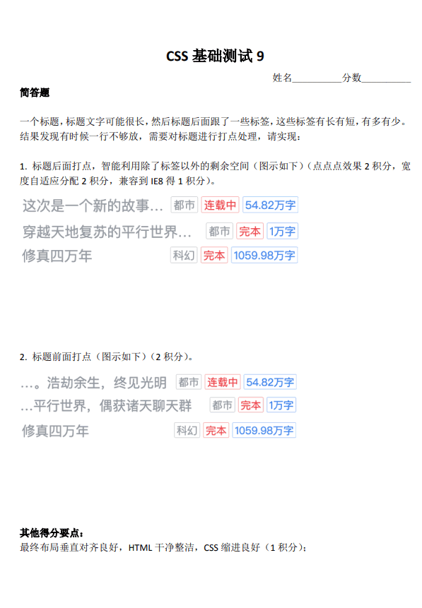
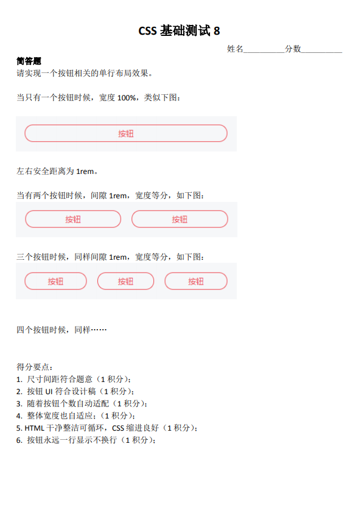
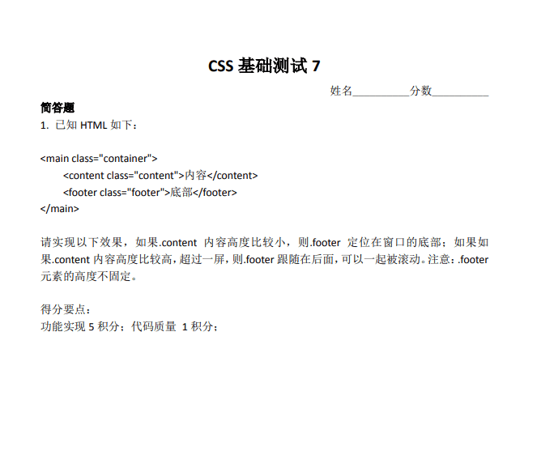
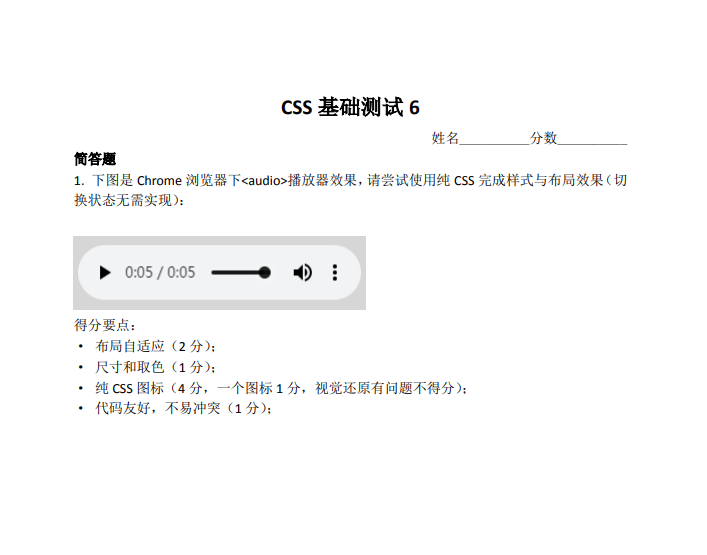
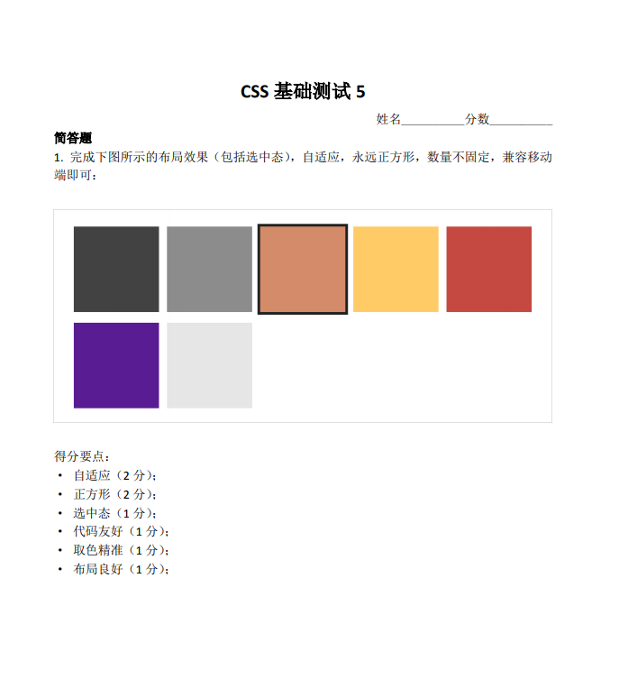
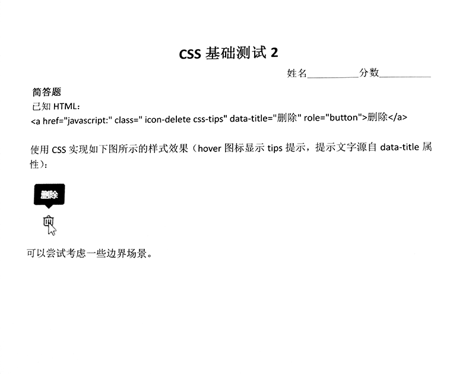

练习地址：[小测答题收集区](https://github.com/zhangxinxu/quiz)

# CSS测试一

## 具体实现

### overflow: hidden + float（不完美，显示的顺序与实际的 html 顺序不一致）

<iframe src="/examples/css-practice/1-1.html" width="400" height="100"></iframe>

`embed:css-practice/1-1.html`

### flex + flex：1

<iframe src="/examples/css-practice/1-2.html" width="400" height="100"></iframe>

`embed:css-practice/1-2.html`

### table + table-layout: fixed（兼容性较好）

<iframe src="/examples/css-practice/1-3.html" width="400" height="100"></iframe>

`embed:css-practice/1-3.html`

## 实现要点

1. 大家布局其实这3类：float+overflow，然后是flex布局，很少人使用的table布局。
2. float布局技巧：float:right+overflow:hidden;text-overflow:ellipsis;white-space:nowrap; 原理：overflow:hidden可以创建格式化上下文，也就是BFC，类似结界，不受浮动影响，自动分配剩余空间。
3. flex布局：display:flex > flex: 1;overflow:hidden;text-overflow:ellipsis;white-space:nowrap;
4. 重点是table布局：float布局有个非常明显的不足，那就是DOM的位置和视觉是不一致的。table布局虽然效果有，但是却有很多的不足。1. 左侧table-cell的尺寸不建议使用字符撑开，然后内容绝对定位打点布局有较大的限制。非table-layout:fixed的表格，其每个单元格尺寸宽度是根据里面内容自动分配的，如果你没有设置white-space: nowrap是自动宽度自适应的。但是设置了white-space: nowrap则尺寸表现就不符合要求，怎么办呢？其实很简单，再嵌套一层display:table;table-layout:fixed;的元素。table布局中，打点只能在table-layout:fixed的场景下。所以，我们设置很大宽度的table-cell的子元素display:table;table-layout:fixed;此时就能正常打点了。优点：兼容性更好，DOM顺序符合认知。
5. 开头打点 direction: rtl 就可以。

# CSS测试二

## 具体实现

### flex + flex：1

<iframe src="/examples/css-practice/2-1.html" width="400" height="100"></iframe>

`embed:css-practice/2-1.html`

### grid + grid-template-columns: repeat(auto-fit, minmax(0, 1fr))

<iframe src="/examples/css-practice/2-2.html" width="400" height="100"></iframe>

`embed:css-practice/2-2.html`

### table + table-layout: fixed（兼容性较好）

<iframe src="/examples/css-practice/2-3.html" width="400" height="100"></iframe>

`embed:css-practice/2-3.html`

## 实现要点

1. flex和grid布局都能实现我们想要的效果，但是推荐使用flex布局，因为语义更好。grid更适合页面大的框架结构布局，偏向二维。本题语义偏向一维。虽然grid控制间隙更方便（grid-gap）。
2. justify-content可以不需要，flex-wrap也是多余的，因为默认就是nowrap，flex-direction也是不需要的，因为默认就是row。因此，我们直接在容器元素设置display:flex就好了。
3. 子项可以flex: 1，以及其他很多设置方法。例如flex: auto;（语义更合适-推荐）。设置flex:1实际上空间分配是不足的，于是，等分。因此设置flex:2, 3, 4...都是可以。还有就是width:100%，除了还有一种方法：width:-webkit-fill-available语义是更好的（推荐）。
4. 下面是grid布局：grid-template-columns: repeat(auto-fit, minmax(0, 1fr))是一种方法，但是并不是最好的实现，因为这个比较难理解，也不好记忆。更好的实现是grid-auto-flow: column;
5. 兼容性更好的table布局，IE8+都支持，放心使用。.table {  display: table;  table-layout: fixed;  width: 100%; }.cell {  display: table-cell;} 固定组合。务必掌握，基础必备布局知识。
6. 不少人.container左右0.5rem，子项margin:0 .5rem实现1rem间隙，这样方式和实际开发是不符合的。实际开发左右1rem，是一个大的结构元素控制的。使用:last-child或者:first-child更符合实际开发，虽然代码更啰嗦了点，因为有一个重置。最好的实现其实还是使用:not()伪类（AsyncGuo的实现），:not(:last-child) {margin-right: 1rem;} 或者  .btn_item + .btn_item 或者 .btn_item ~ .btn_item（IE7+）

# CSS测试三

## 具体实现

### flex + space-between

<iframe src="/examples/css-practice/3-1.html" width="400" height="100"></iframe>

`embed:css-practice/3-1.html`

### fixed（不完美）

<iframe src="/examples/css-practice/3-2.html" width="400" height="100"></iframe>

`embed:css-practice/3-2.html`

### grid + space-between

<iframe src="/examples/css-practice/3-3.html" width="400" height="100"></iframe>

`embed:css-practice/3-3.html`

### flex + margin-top（完美）

<iframe src="/examples/css-practice/3-4.html" width="400" height="100"></iframe>

`embed:css-practice/3-4.html`

### table + display: table-footer-group（兼容性较好）

<iframe src="/examples/css-practice/3-5.html" width="400" height="100"></iframe>

`embed:css-practice/3-5.html`

## 实现要点

1. 题意理解要准确：.content不拉伸，不要影响浏览器默认的滚动；
2. flex布局是相对大家比较容易想到的实现：.container { display: flex; flex-direction: column; justify-content: space-between; min-height: 100vh;} 但是IE9不支持。
3. 另外实现：.container{  display: table;  min-height:100vh;}.footer{  display: table-footer-group; /* IE8+支持 */}。
4. 如果footer高度固定，则实现方法就很多了，例如，绝对定位固定在底部，或者margin负值定位。
5. grid布局也是可以实现类似效果：.container {display: grid; min-height: 100vh;  align-content: space-between;}
6. 满分回答：.container { display: flex; flex-direction: column; min-height: 100vh;
  }footer { margin-top: auto;}
7. margin:auto是非常体现CSS理解深度的一个CSS声明。
8. auto 智能的剩余宽度分配。元素如果没有高宽，尺寸会拉伸（或处在可拉伸上下文中），则此时auto会智能分配剩余空间，实现上下左右或者居中对齐效果。
9. flex布局下的所有元素就处于一种尺寸可拉伸的上下文环境，所以此时footer设置margin-top: auto是可以顶部对齐的（margin-top自动剩余空间）。

# CSS测试四

## 具体实现

### flex

<iframe src="/examples/css-practice/4-1.html" width="400" height="100"></iframe>

`embed:css-practice/4-1.html`

## 实现要点

1. 自适应使用flex是比较好的方法，图标按钮尺寸固定，进度条宽度自适应；
2. 进度条使用 `input[type="range"]` 是非常棒的实现与想法；
3. 自适应不是等比例缩放，而是进度条宽度自适应；
4. 注意视觉还原；
5. 命名上注意上下文，例如audio-开头；
6. CSS图标尽量使用伪元素，更好维护；
7. CSS图标常用技巧：万能，box-shadow，linear-gradient/radial-radient，clip-path。

# CSS测试五

## 实现要点

1. 在grid布局中，每个子项所相对计算的宽度已经划分好了，并不是父元素的宽度；
2. outline的优点的扩展的时候不占据额外的空间尺寸，但是缺点是强占了:focus聚焦状态样式，更推荐使用box-shadow实现；
3. flex布局也是可以指定宽度，包括百分比；
4. 正方形实现大家都用的是padding百分比，很好也很奇怪，如果你的宽度是使用calc计算得到（非百分比计算），设置height与之一样即可。
5. 自适应的实现：1. grid布局；2. flex（宽度要设置）；3. float；4.inline-block；都是可以的。
6. 关于选中态实现最推荐的方法：使用radio单选。优点：1. 无需任何JS参与； 2. 语义非常好，包括对辅助设备；3. 开发也很便捷；其他类似场景：新用户注册会让选择感兴趣的标签，也可以使用类似技术。

# CSS测试六

## 具体实现

### absolute

<iframe src="/examples/css-practice/6-1.html" width="400" height="100"></iframe>

`embed:css-practice/6-1.html`

### display: flex + width: calc(100% - 5em)

<iframe src="/examples/css-practice/6-2.html" width="400" height="100"></iframe>

`embed:css-practice/6-2.html`

### grid + grid-template-columns: auto 1fr

<iframe src="/examples/css-practice/6-3.html" width="400" height="100"></iframe>

`embed:css-practice/6-3.html`

### float: left + overflow: hidden

<iframe src="/examples/css-practice/6-4.html" width="400" height="100"></iframe>

`embed:css-practice/6-4.html`

### margin: -1.5em 0 0 5em

<iframe src="/examples/css-practice/6-5.html" width="400" height="100"></iframe>

`embed:css-practice/6-5.html`

# CSS测试七

## 具体实现

<iframe src="/examples/css-practice/7-1.html" width="400" height="100"></iframe>

`embed:css-practice/7-1.html`

## 实现要点

1. 考虑各种字号场景，使用bottom定位，calc()或者margin-bottom微调位置；
2. transform增加-ms-前缀，兼容IE9；
3. 考虑边界场景，例如在浏览器上边缘，或者侧面时候；
4. 考虑增加延迟显示，使用visibility+transition，或者pointer-events: none（渐进增强）；
5. 考虑键盘访问，增加:focus伪类显示。

# CSS测试八

## 具体实现

### 我的解答

<iframe src="/examples/css-practice/8-1.html" width="400" height="100"></iframe>

`embed:css-practice/8-1.html`

有几个缺点，宽度较小时会换行，消息气泡不够还原

### relative + absolute + box-shadow

<iframe src="/examples/css-practice/8-2.html" width="400" height="100"></iframe>

`embed:css-practice/8-2.html`

### flex + flex: 1 + border-radius + direction: rtl

<iframe src="/examples/css-practice/8-3.html" width="400" height="100"></iframe>

`embed:css-practice/8-3.html`

## 实现要点

1. 基准字号使用16px，不用其它像素值。也不用使用100px。
2. media查询和vw技巧实现html基础尺寸动态化（无需JS）。
3. 要有统一的类名命名空间，类似chat-。
4. 遇到不同性质的命名，通常两种方式。1. 类名，但是命名上明显区分，例如chat-item__left。2. 使用属性选择器。
5. 避免没必要的嵌套，百害无一益。
6. 小尾巴的实现。边框+圆角，box-shadow+圆角，径向渐变
7. 左右对称布局的实现：direction: rtl配合CSS逻辑属性
8. 不推荐使用dl标签，可以给每个列表增加tabindex=0

