# 通用篇

## 复制与保存

### copy 方法

可以通过全局的方法 `copy()` 在 `console` 里 `copy` 任何你能拿到的资源

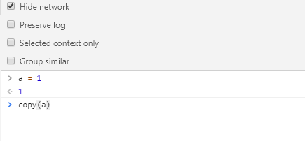

### 存储为一个全局变量

如果你在 `console` 中打印了一堆数据 (例如你在 App 中计算出来的一个数组)，然后你想对这些数据做一些额外的操作比如我们刚刚说的 `copy` (在不影响它原来值的情况下)。那就可以将它转换成一个全局变量，只需要右击它，并选择 “Store as global variable” (保存为全局变量) 选项。

第一次使用的话，它会创建一个名为 temp1 的变量，第二次创建 temp2，第三次 ... 。通过使用这些变量来操作对应的数据，不用再担心影响到他们原来的值

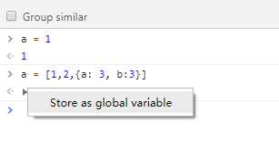

### 保存堆栈信息

大多数情况下都不是一个人开发一个项目，而是一个团队协作，那么如何准确的描述问题，就成为了沟通的关键，这时候 `console` 打印出来的堆栈跟踪的信息对你和同事来说就起大作用了，可以省去很多沟通成本，所以你可以直接把堆栈跟踪的信息保存为一个文件，而不只是截图发给对方


### 直接 Copy HTML

几乎所有人都知道，右击或者点击在 `HTML` 元素边上的省略号 (...) 就可以将它 `copy` 到剪贴板中，但是你不知道的是：古老的 `[ctrl] + [c]` 大法依旧可用！

## 快捷键

### 切换 DevTools 窗口的展示布局

快捷键 `ctrl + shift + D (⌘ + shift + D Mac)` 来实现位置的切换（通常是从 `开始的位置` 到 `右边位置`， 但是如果一开始就是 `右边的位置` 那么会切换到 `左边的位置`）

### 切换 DevTools 的面板

- 按下 `ctrl + [ 和 ctrl + ]` 可以从当前面板的分别向左和向右切换面板
- 按下 `ctrl + 1` 到 `ctrl + 9`可以直接转到编号 1...9 的面板(`ctrl + 1`转到元素面板，`ctrl + 4` 转到 网络信息面板等等)

### 递增/递减

通过使用 `带有` 或者 `不带有修饰键` 的 `上 / 下` 箭头按键， 你可以实现递增和递减 `0.1` ， `1` 或者 `10` 这样数值类型的值

`ctrl + 上 / 下`递增和递减 100，`shift + 上 / 下`递增和递减 10

### elements， logs， sources & network 中的查找

DevTools 中的前 4 个主要的面板，每一个都支持 `[ctrl] + [f]` 快捷方式，你可以使用对应的查询方式来查找信息:

- 在 `Elements` 面板中 - 通过 `string`，`选择器` 或者 `XPath` 来查找
- 而在 `Console`， `Network` 以及 `Source` 面板 - 通过区分大小写，或者可以被视为表达式的 `strings` 来查找

## 使用 Command

快捷键 `Ctrl + Shift + P`

### 截屏

节点截图与全屏截图

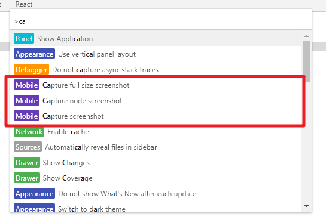

> 注：节点截图有时会失效，全屏截图暂时没有遇到问题，建议大家使用后者。

### 快速切换面板

输入 layout ，你会看到 2 到 3 个选项

- 使用横向面板布局
- 使用纵向面板布局
- 使用自动面板布局

### 快速切换主题

输入 theme 切换主题

## 代码块的使用

### Snippets

它允许你存放 JavaScript 代码到 DevTools 中，方便你复用这些 JavaScript 代码块，进入到 Sources 面板，在导航栏里选中 Snippets 这栏，点击 New snippet(新建一个代码块) ，然后输入你的代码之后保存，大功告成！现在你可以通过右击菜单或者快捷键： `[ctrl] + [enter]` 来运行它了：

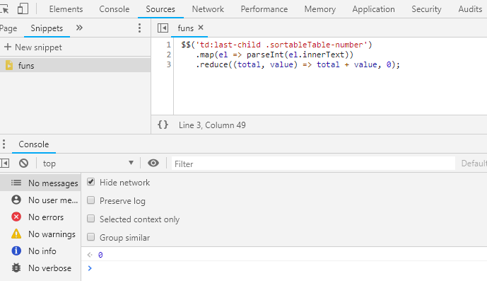

### 运行其他来源的代码块

预设了 Snippets 之后，使用 Command Menu 才是最快的方式，只需在它的输入框中输入 ! ，就可以根据名字来筛选预设代码块：

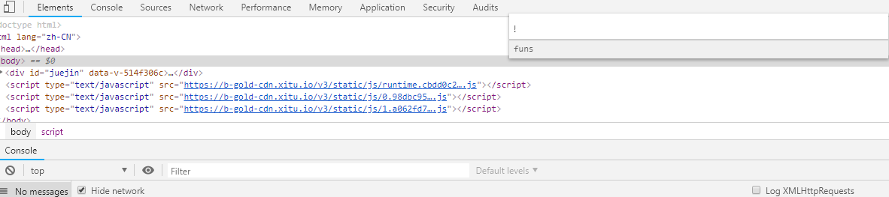

> 查找预设代码块 有时候会出现失效的情况

以上更新于`2019-3-11 20:02:21`

---

# 控制台篇

## console 中的 &amp;

### &amp;0

在 Chrome 的 Elements 面板中， \$0 是对我们当前选中的 html 节点的引用。

理所当然，`$1` 是对上一次我们选择的节点的引用，\$2 是对在那之前选择的节点的引用等等，一直到 `$4`

你可以尝试一些相关操作(例如: `$1.appendChild($0)`)

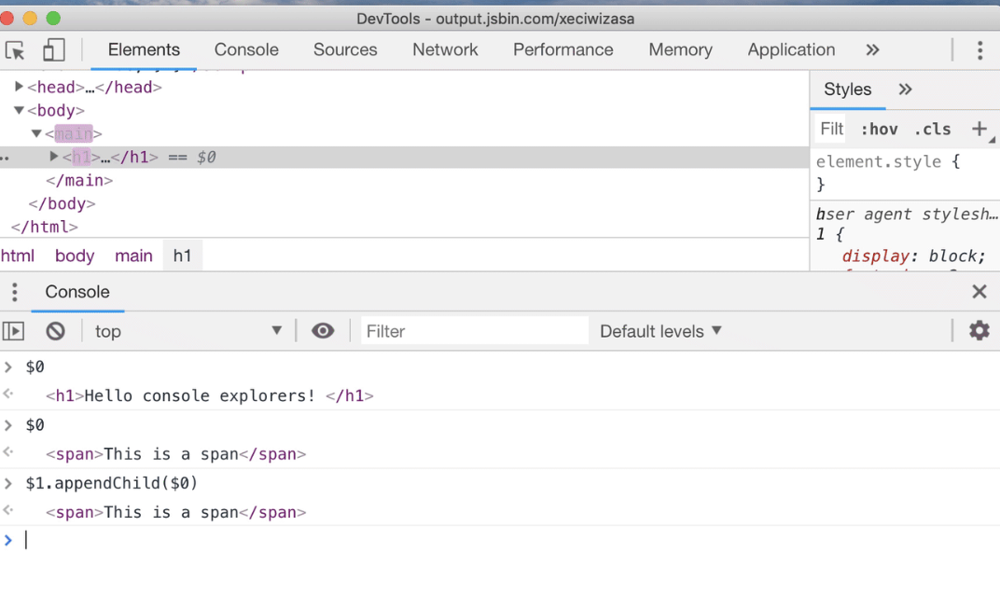

### &amp; 和 &amp;&amp;

如果你没有在 App 中定义过 `$` 变量 (例如 jQuery )的话，它在 console 中就是对这一大串函数 document.querySelector 的别名。

如果是 `$$` 就更加厉害了，还能节省更多的时间，因为它不仅执行 `document.QuerySelectorAll` 并且它返回的是：一个节点的 数组 ，而不是一个 Node list

本质上来说 `Array.from(document.querySelectorAll('div')) === $$('div')` ，但是`document.querySelectorAll('div')` 和 `$$('div')` 哪一种方式更加优雅呢？


### &amp;\_

调试的过程中，你经常会通过打印查看一些变量的值，但如果你想看一下上次执行的结果呢？再输一遍表达式吗？

这时候 `$_` 就派上了用场，`$_` 是对上次执行的结果的 引用 ：

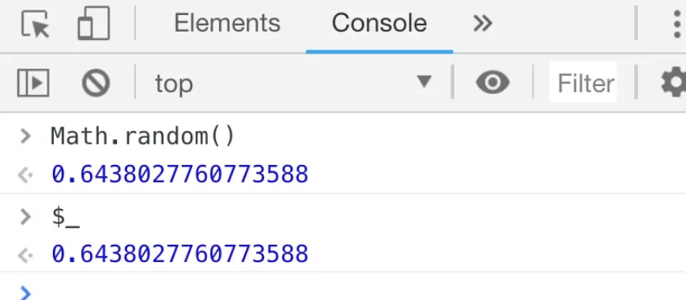

### &amp;i

现在的前端开发过程，离不开各种 `npm` 插件，但你可能没有想过，有一天我们竟然可以在 Dev Tools 里面来使用 `npm` 插件！

有时你只是想玩玩新出的 npm 包，现在不用再大费周章去建一个项目测试了，只需要在 Chrome 插件: [Console Importer](https://chrome.google.com/webstore/detail/console-importer/hgajpakhafplebkdljleajgbpdmplhie/related) 的帮助之下，快速的在 console 中引入和测试一些 npm 库。

运行 `$i('lodash')` 或者 `$i('moment')` 几秒钟后，你就可以获取到 `lodash / momentjs` 了:


## console.log 的 "bug" ?

一般来说，我们会使用 console.log() 来打印某个对象，并且，两次打印之间，还会对这个对象进行修改，最后我们查看打印的结果发现，修改前的打印和修改后的打印，竟然是一样的？这样出乎意料的情况，让我们难以继续 console.log 的调试。

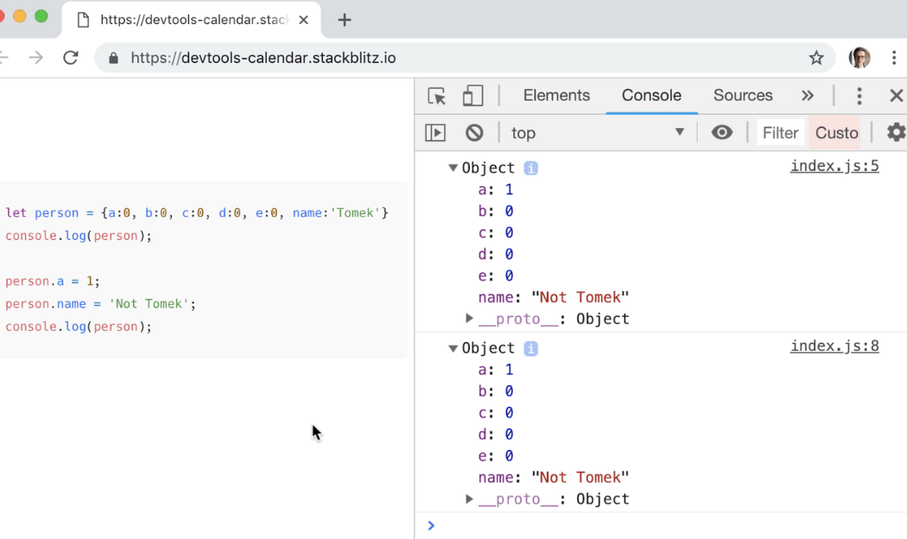

打印的时候，两次都是我们修改之后的值？

> console 中打印出的对象，在你打印出他内容之前，是以引用的方式保存的。

**解决方案**

- 打印一个从这个对象复制出来的对象。
- 使用资源面中的断点来调试
- 使用 JSON.stringify() 方法处理打印的结果

以上更新于`2019-03-10 19:21:45`

---

## 异步的 console

> console 默认就被 async 包裹

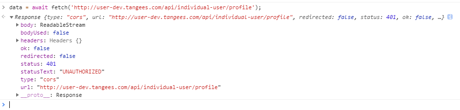

### Storage 系统的占用数和空闲数

```js
await navigator.storage.estimate();
```

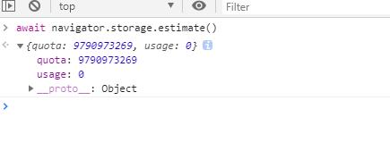

### 设备的 电池信息

```js
console.table(await navigator.getBattery());
```

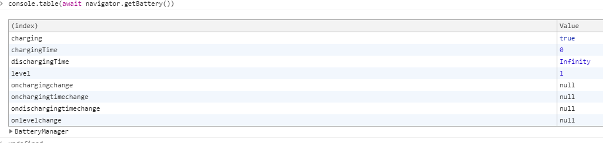

### 媒体能力

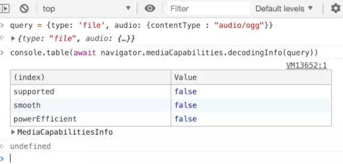

### Cache storage keys

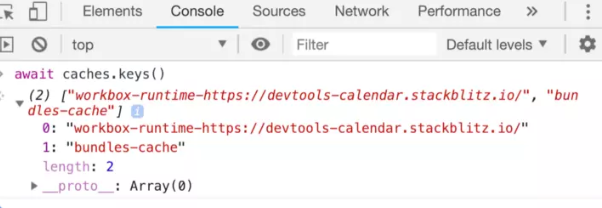

## 对象 &amp; 方法

### queryObjects （对象查询）方法

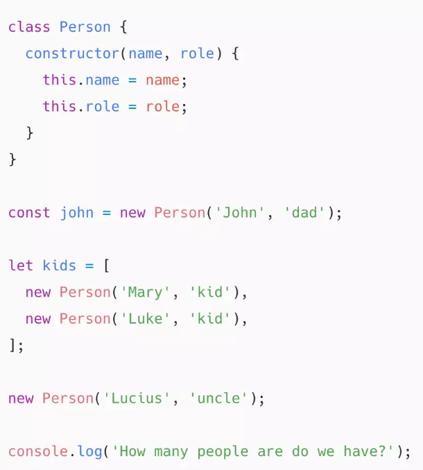

DevTools 里的 queryObjects 函数可以展示这些信息

> 请注意，列表中创建的最后一个对象是不可用的 : 在代码执行后，对于它的引用并没有留存下来，也就是说，我们只有 3 个 person 对象：

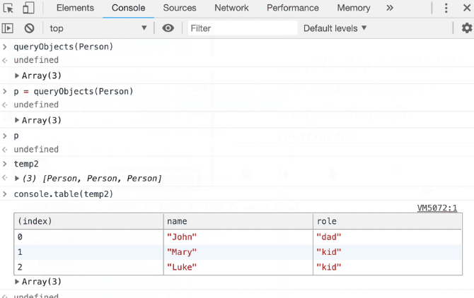

### monitor （镜像）方法

monitor 是 DevTools 的一个方法， 它能够让你 “潜入” 到任何 \_function calls(方法的调用) 中：每当一个被潜入的方法运行的时候，console 控制台会把它的实例打印出来，包含函数名以及调用它的参数

我们把前面例子里面的 Person 类拿过来，并且给它扩展两个方法：

```js
class Person {
  constructor(name, role) {
    this.name = name;
    this.role = role;
  }

  greet() {
    return this.getMessage('greeting');
  }
  getMessage(type) {
    if (type === 'greeting') {
      return `Hello, I'm ${this.name}!`;
    }
  }
}
```

如你所见，greet 方法通过一个特殊的参数来执行 getMessage 方法，让我们看看对 getMessage 方法进行追踪会产生什么结果：

---

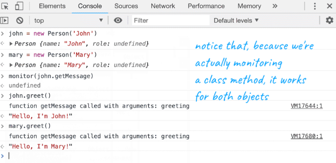

这样写会省很多 console.log

### monitorEvents （镜像事件）方法

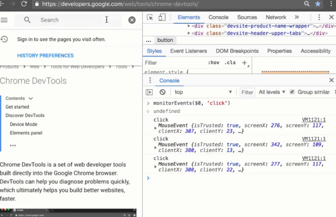

## console 中骚操作

### console.assert

```js
console.assert(assertion, obj1 [, obj2, ..., objN]);
console.assert(assertion, msg [, subst1, ..., substN]); // c-like message formatting
```

> 当我们传入的第一个参数为假时，console.assert 打印跟在这个参数后面的值。

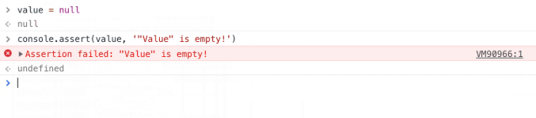

通过它，你可以摆脱令人讨厌的 if 表达式，还可以获得堆栈信息。

### 增强 log 的阅读体验

有时即使你 console.log 一个简单的变量，你可能会忘记（或混淆）哪一个是那个。那当你有不同的变量需要打印的时候，阅读起来会更费劲。

为了让它变得更加易读，你可以打印一个对象，加上 {}


### console.table

如果有一个数组(或者是类数组的对象，或者就是一个对象)需要打印，你可以使用 console.table 方法将它以一个漂亮的表格的形式打印出来。它不仅会根据数组中包含的对象的所有属性，去计算出表中的列名，而且这些列都是可以缩放甚至还可以排序!!!

如果你觉得展示的列太多了，使用第二个参数，传入你想要展示的列的名字:

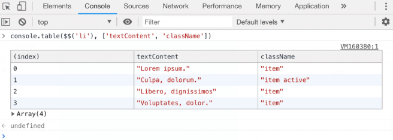

### table 和 {} 的配合

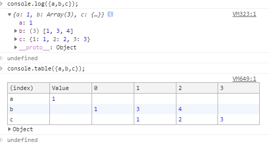

### console.dir

有时候你想要打印一个 DOM 节点。 console.log 会将这个交互式的元素渲染成像是从 Elements 中剪切出来的一样。如果说你想要查看这个节点所关联到的真实的 js 对象呢？并且想要查看他的属性等等？

在那样的情况下，就可以使用 console.dir:

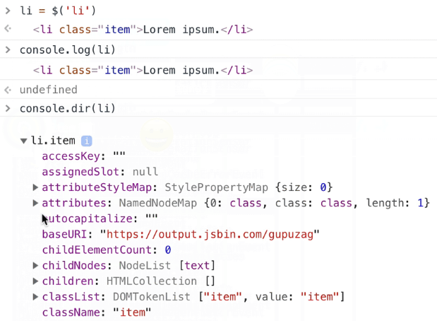

### 给 logs 加上时间戳

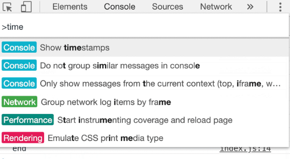

### 监测执行时间

与其在所有事上展示一个时间戳，或许你对脚本中的特殊的节点之间执行的时间跨度更加感兴趣，对于这样的情况，我们可以采用一对有效的 console 方法

- console.time() — 开启一个计时器
- console.timeEnd() — 结束计时并且将结果在 console 中打印出来

如果你想一次记录多件事，可以往这些函数中传入不同的标签值。(例如: console.time('loading') ， console.timeEnd('loading') )

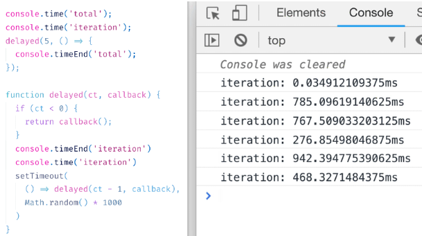

### 直接在回调中使用 console.log

不仅减少了输入，还可能在回调中接收多个参数

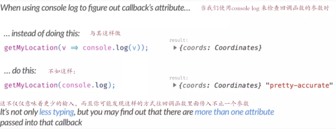

### 使用实时表达式

DevTools 在 Console 面板中引入了一个非常漂亮的附加功能，这是一个名为 Live expression 的工具

只需按下 "眼睛" 符号，你就可以在那里定义任何 JavaScript 表达式。 它会不断更新，所以表达的结果将永远，存在 :-)

同时支持定义好几个：

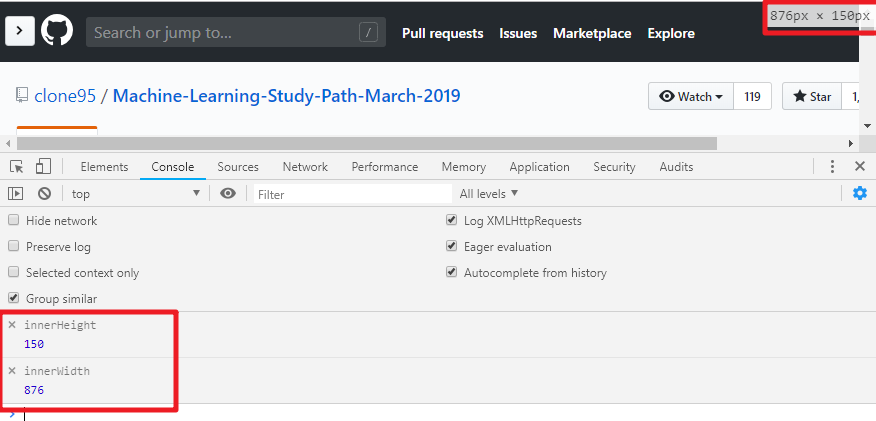

# Network 篇

## 请求过滤

Network 面板中的过滤器输入框接受字符串或正则表达式，对应显示匹配的请求。 但是你也可以使用它来过滤很多属性。

只需输入 例如 method 或者 mime-type :

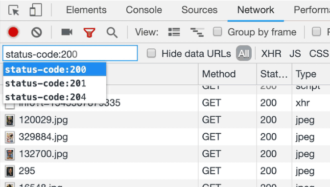

如果想要显示所有可能的关键字，在空白的输入框按下 `[ctrl] + [space]`

## 自定义请求表

要自定义显示哪些列，右键单击请求表标题上的任意位置。

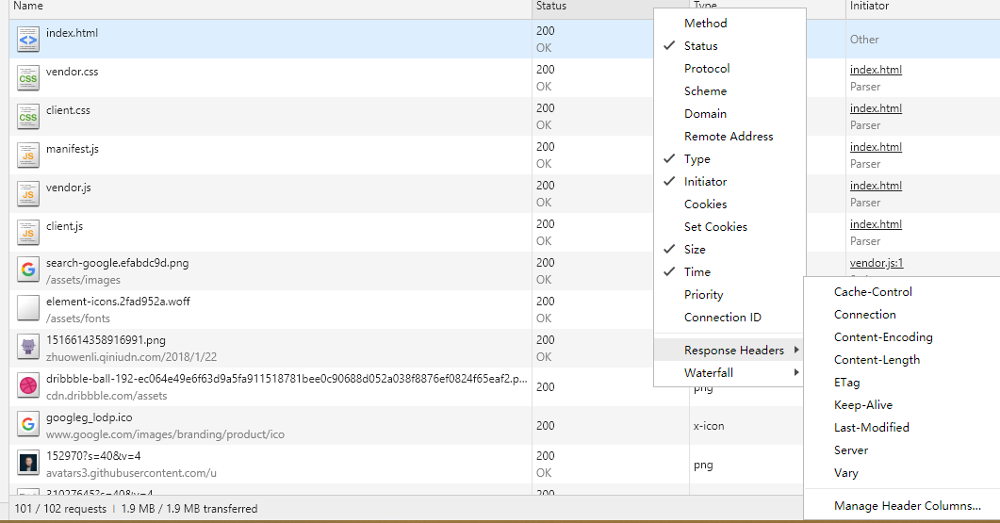

## 重新发送 XHR 的请求（已过时）

## XHR/fetch 断点

在某一特定时刻，你想要对已发送的 “ajax” 请求进行捕获怎么做呢？ 可以使用 XHR/fetch breakpoint 。

> 这些只能在 Source 面板中设置。（我也同样希望可以直接在 Network 面板中设置，但事实并非如此）

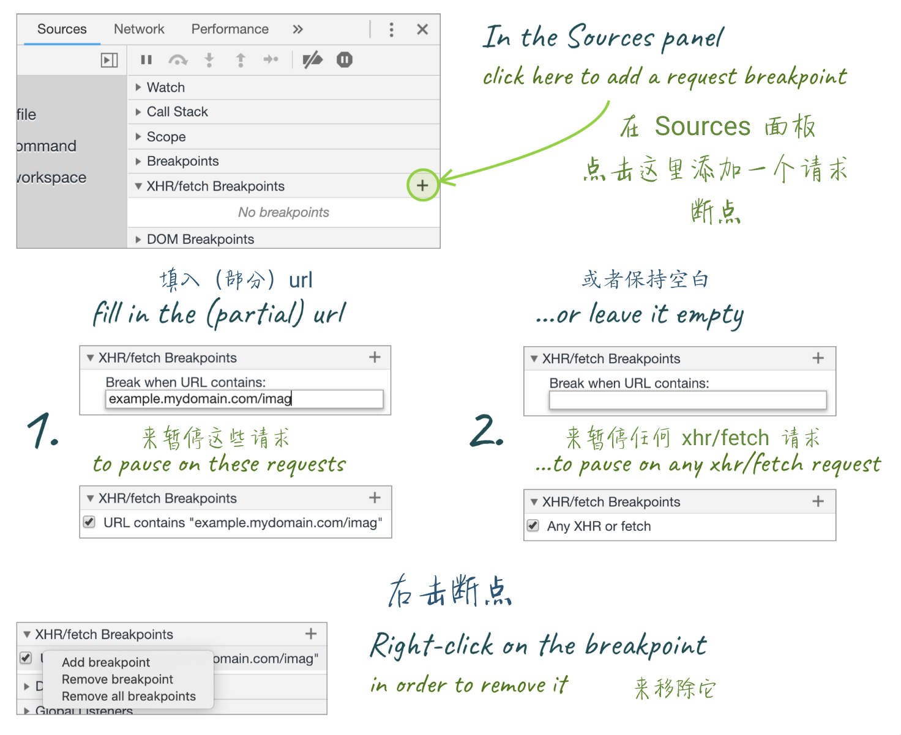

# Drawer 篇

## 检查代码 coverage

实际开发中，你的页面可能并不需要位于尾部的许多代码。也许那是来自外部库的一大块 JavaScript，也许是被遗忘的选择器上的一些 CSS 规则，它们不再匹配任何东西。

使用 coverage 面板来获得关于冗余代码的摘要-细节信息。使用 Drawer 菜单或者 Command 菜单来打开它。

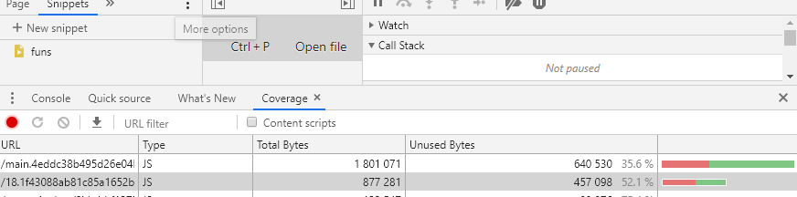

DevTools 的 coverage 工具可以跟踪当前加载的 JS 和 CSS 文件的哪些行正在被执行，并显示未使用字节的百分比。

它用绿色的线条标记运行和用红色的线条标记未运行。举个例子：

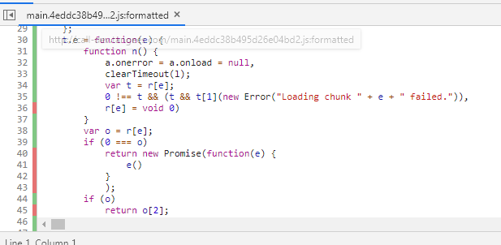

## 检查你修改的内容

通过浏览器进行设计和调整 css ：能够在代码执行的地方进行调试是方便又有趣的开发方式。 但在某些时候，你可能希望将 已更改的内容 与 最初加载的样式表 进行比较。

为此，可以使用 DevTools' Drawer 中的更改工具。

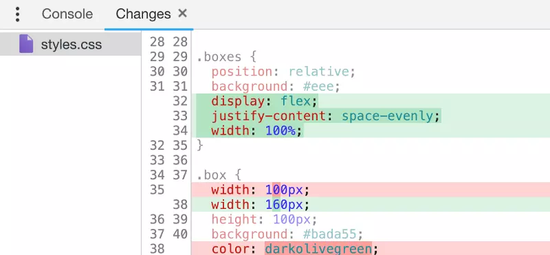

它不仅会使用差异形式的变化（像 Git 这样的源控制工具一样）向你展示，同时还可以撤销它们。

举个例子：

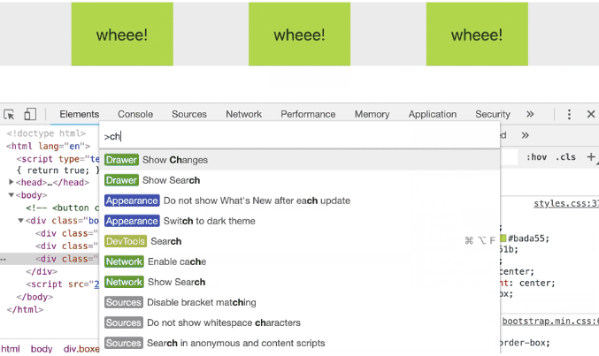

以上更新于`2019-3-19 15:43:42`

---
