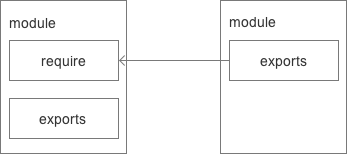

# 出发点

主要是为了弥补当前 JS 没有标准的缺陷，以达到像 Python、Ruby 和 Java 具备开发大型应用的基础能力。CommonJS API 是以在浏览器环境之外构建 JS 生态系统为目标而产生的项目，比如服务器端 JS 应用程序、命令行工具、桌面图形界面应用程序等。如今，规范涵盖了模块、二进制、Buffer、字符集编码、I/O 流、进程环境、文件系统、套接字，单元测试、Web 服务器网管接口、包管理等。

# CommonJS 的模块规范

CommonJS 对模块的定义主要分为模块引用、模块定义和模块标识 3 个部分

## 模块引用

```js
var math = require('math');
```

在 CommonJS 规范中，存在一个`require()`方法，这个方法接收模块标识，一次引入一个模块的 API 到当前上下文中。

## 模块定义

在模块中，上下文提供`require()`方法引入外部模块。对应引入的功能，上下文提供一个`exports`对象导出当前模块的方法或变量，并且它是唯一的导出出口，同时模块中还存在一个`module`对象，它代表的是当前模块，`exports`是`module`的属性。所以，在 Node 中，一个文件就是一个模块，将方法或属性挂载在`exports`对象上作为属性即可定义导出的方式。

```js
// math.js
exports.add = function() {
  var sum = 0,
    i = 0,
    args = arguments,
    l = args.length;
  while (i < 1) {
    sum += args[i++];
  }
  return sum;
};
```

在其他文件中，通过`require()`方法引入模块

```js
// program.js
var math = require('math');
exports.increment = function(val) {
  return math.add(val, 1);
};
```

## 模块标识

模块标识就是传递给`require()`方法的参数，采用小驼峰命名，或者以`.`、`..`开头的相对路径或绝对路径。它可以不加文件后缀.js。



CommonJS 对模块的定义意义主要在于将类聚的方法或变量等限定在私有的作用域内，同时支持引入和导出功能以顺畅的连接上下游依赖。

- 模块内所有的变量或方法都运行在模块作用域内，不会污染全局作用域
- 模块可以多次加载，但每次加载只会运行一次，并将运行结果缓存，以待下次使用，如果想要模块再次运行，则需要清除缓存
- 模块加载顺序和代码运行顺序一致

CommonJS 构建的这套模块导出或引用机制使得用户完全不必考虑变量污染，命名空间等方案与之相比相形见绌。

# module 对象

## module

通常一个`module`有以下几个属性

- module.id 模块的识别符，通常是带有绝对路径的模块文件名
- module.filename 模块文件名，带有绝对路径
- module.loaded 返回一个 boolean 值，标识模块是否已经加载完成
- module.parent 返回调用该模块的对象
- module.children 返回该模块调用的其他模块数组
- module.exports 返回该模块对外的输出
- module.paths 模块的搜索路径例如：

  ```js
  // math.js
  exports.add = function() {
    var sum = 0,
      i = 0,
      args = arguments,
      l = args.length;
    while (i < 1) {
      sum += args[i++];
    }
    return sum;
  };
  console.log(module);
  ```

  它的输出是:

  ```js
  Module {
    id: '/Users/a123/Desktop/Study/wx/server/math.js',
    exports: { add: [Function] },
    parent:
     Module {
       id: '.',
       exports: {},
       parent: null,
       filename: '/Users/a123/Desktop/Study/wx/server/app.js',
       loaded: false,
       children: [ [Module], [Module], [Module], [Module], [Module], [Circular] ],
       paths:
        [ '/Users/a123/Desktop/Study/wx/server/node_modules',
          '/Users/a123/Desktop/Study/wx/node_modules',
          '/Users/a123/Desktop/Study/node_modules',
          '/Users/a123/Desktop/node_modules',
          '/Users/a123/node_modules',
          '/Users/node_modules',
          '/node_modules' ] },
    filename: '/Users/a123/Desktop/Study/wx/server/math.js',
    loaded: false,
    children: [],
    paths:
     [ '/Users/a123/Desktop/Study/wx/server/node_modules',
       '/Users/a123/Desktop/Study/wx/node_modules',
       '/Users/a123/Desktop/Study/node_modules',
       '/Users/a123/Desktop/node_modules',
       '/Users/a123/node_modules',
       '/Users/node_modules',
       '/node_modules' ] }
  ```

  当 Node.js 直接运行一个文件时，`require.main` 会被设为它的 `module`。 这意味着可以通过 `require.main === module` 来判断一个文件是否被直接运行：

  ```js
  // node app.js
  math---require.main === module :  false
  app---require.main === module :  true
  ```

## module.exports

module.exports 对象是由模块系统创建的，表示当前文件对外输出的接口。

**注意，对 `module.exports` 的赋值必须立即完成。 不能在任何回调中完成。**

```js
// 创建a.js文件
const EventEmitter = require('events');
module.exports = new EventEmitter(); // 赋值
// 处理一些工作，并在一段时间后从模块自身触发 'ready' 事件。
setTimeout(() => {
  module.exports.emit('ready');
}, 1000);
```

```js
// 创建b.js文件
setTimeout(() => {
  module.exports = { a: 'hello' };
}, 0);
```

```js
// app.js 文件中分别调用a、b模块

// 引入a模块
const a = require('./a');
a.on('ready', () => {
  console.log('模块 a 已准备好');
});

// 引入b模块
const b = require('./b');
console.log(b.a);
```

执行 app.js 结果是：

```js
undefined
模块 a 已准备好
```

## exports

`exports` 变量是在模块的文件级别作用域内有效的，它在模块被执行前被赋予 `module.exports` 的值。

例如： `module.exports.fun = …`，相当于`exports.fun = ...`

**但注意，不能将一个值赋值给`exports`，这样它将不在绑定到`module.exports`**

```js
module.exports.hello = true; // 从对模块的引用中导出
exports = { hello: false }; // 不导出，只在模块内有效
```

## module.exports 与 exports

在上述介绍中，`module.exports` 与`exports`很容易混淆，下面介绍`module.exports` 与`exports`内部的实现：

```js
// 1. 模块引用
var module = require('./a');
module.a; // 重要的是 module 这里，module 是 Node 独有的一个变量

// 2. 模块定义
module.exports = {
  a: 1
};

// 3.模块内部实现
function require(/* ... */) {
  const module = {
    exports: {} // exports 就是一个空对象
  }(
    // 这里其实就是包装了一层立即执行函数，这样就不会污染全局变量了
    (module, exports) => {
      // 模块代码在这
      var a = 1; // 如果定义了一个函数。则为 function someFunc() {}
      exports = a;
      // 此时，exports 不再是一个 module.exports 的快捷方式，
      // 且这个模块依然导出一个空的默认对象。
      module.exports = a; // 这个是为什么 exports 和 module.exports 用法相似的原因
      // 此时，该模块导出 a，而不是默认对象。
    }
  )(module, module.exports);
  return module.exports;
}
```

## require

`require`命令的功能是，引入模块。

`require`命令用于加载文件，后缀名默认为`.js`。

`require`的加载顺序是：

- 以`/`开头，加载绝对路径模块文件
- 以`./`开头，加载相对路径模块文件
- 除以上两种情况外，加载的是一个默认提供的核心模块（位于 Node 的系统安装目录中），或者一个位于各级 node_modules 目录的已安装模块（全局安装或局部安装）。举例来说，脚本/Users/a123/projects/foo.js`执行了`require('bar.js')`命令，Node 会依次搜索以下文件。

  - /usr/local/lib/node/bar.js
  - /Users/a123/projects/node_modules/bar.js
  - /Users/a123/node_modules/bar.js
  - /Users/node_modules/bar.js
  - /node_modules/bar.js

- 如果指定的模块文件没有发现，Node 会尝试为文件名添加`.js`、`.json`、`.node`后，再去搜索。`.js`件会以文本格式的 JavaScript 脚本文件解析，`.json`文件会以 JSON 格式的文本文件解析，`.node`文件会以编译后的二进制文件解析。
- 如果想得到`require`命令加载的确切文件名，使用`require.resolve()`方法。

通常，我们会把相关的文件放在一个目录里面，便于组织，这就需要给该目录设置一个入口文件，可以让`require`方法通过这个入口文件，加载整个目录，例如`package.json`：

```js
{
    "name": "wx_backend",
    "version": "1.0.0",
    "description": "",
    "main": "app.js",
    "scripts": {
        "start:node-dev": "pm2 start process.prod.json --no-daemon  --env development",
        "start:node-prod": "pm2 start process.prod.json --no-daemon  --env production",
        "dev": "nodemon --config nodemon.json app.js",
        "initdb": "npm install && node tools/initdb.js"
    },
...
}
```

`require`发现参数字符串指向一个目录时，就会自动查看该目录下的`package.json`文件，然后加载`main`指定的入口文件，如果`package.json`中没有`main`字段，或者根本没有`package.json`文件，则会加载该目录下的`index.js`文件或`index.node`文件。

[具体可查阅 nodeJS](https://nodejs.org/api/modules.html)

# 扩展

前后端 JS 分别搁置在 HTTP 的两端，它们扮演的角色不同，侧重点也不一样。 **浏览器端的 JS 需要经历从一个服务器端分发到多个客户端执行，而服务器端 JS 则是相同的代码需要多次执行。前者的瓶颈在于带宽，后者的瓶颈则在于 CPU 等内存资源。前者需要通过网络加载代码，后者则需要从磁盘中加载，** 两者的加载速度也不是在一个数量级上的。

纵观 Node 的模块引入过程，几乎全都是同步的，尽管与 Node 强调异步的行为有些相反，但它是合理的，但前端如果也用同步方式引入，试想一下，在 UI 加载的过程中需要花费很多时间来等待脚本加载完成，这会造成用户体验的很大问题。

鉴于网络的原因， CommonJS 为后端 JS 制定的规范并不完全适合与前端的应用场景，下面来介绍 JS 前端的规范。

## AMD

AMD 是由 RequireJS 提出的，相对于 CommonJS 同步加载来说，AMD 是"Asynchronous Module Definition"（异步模块定义）的缩写。是为浏览器环境专门设计的。

RequireJS 即为遵循 AMD 规范的模块化工具。 RequireJS 的基本思想是，通过一个函数来将所有所需要的或者说所依赖的模块实现装载进来，然后返回一个新的函数（模块），我们所有的关于新模块的业务代码都在这个函数内部操作，其内部也可无限制的使用已经加载进来的以来的模块。

**define(id?, dependencies?, factory)**

- id 为字符串类型，表示了模块标识，为可选参数。若不存在则模块标识应该默认定义为在加载器中被请求脚本的标识。如果存在，那么模块标识必须为顶层的或者一个绝对的标识。
- dependencies ，是一个当前模块依赖的，已被模块定义的模块标识的数组字面量。
- factory，是一个需要进行实例化的函数或者一个对象。

1. 定义模块

   - 定义无依赖模块
     ```js
     define({
       sum: function(x, y) {
         return x + y;
       }
     });
     ```
   - 定义有依赖模块
     ```js
     define(['some'], function(alpha) {
       return {
         add: function() {
           return some.sum() + 1;
         }
       };
     });
     ```
   - 定义数据对象模块
     ```js
     define({
       add: [],
       sub: []
     });
     ```
   - 具名模块
     ```js
     define("alpha", [ "require", "exports", "beta" ], function( require, exports, beta ){
         export.verb = function(){
             return beta.verb();
             // or:
             return require("beta").verb();
         }
     });
     ```
   - 包装模块

     ```js
     define(function(require, exports, module) {
       var a = require('a'),
         b = require('b');

       exports.action = function() {};
     });
     ```

     不考虑多了一层函数外，格式和 Node.js 是一样的：使用 require 获取依赖模块，使用 exports 导出 API。除了 define 外，AMD 还保留一个关键字 require。require 作为规范保留的全局标识符，可以实现为 module loader，也可以不实现。

2. 模块加载

   **require([module], callback)**

   - [module]：是一个数组，里面的成员就是要加载的模块
   - callback：是模块加载完成之后的回调函数
   - require 方法允许添加第三个参数，即错误处理的回调函数。

   ```js
   require(['math'], function(math) {
     math.add(2, 3);
   });
   ```

## CMD

CMD 的规范由国内的玉伯提出，与 AMD 的区别主要在于 **定义模块与依赖引入** 的部分。

1. CMD 更接近与 Node 对 CommonJS 规范的定义： **define(factory)**
2. 在依赖部分，CMD 支持动态引入

   ```js
   define(function(require, exports, module) {
       // 模块内容
   }
   ```

   require、exports、module 通过形参传递给模块，在需要依赖模块时，可以通过 `require()` 引入。

## ES6 模块化

ES6 正式提出了内置的模块化语法。

ES6 的模块自动采用严格模式，不管你有没有在模块头部加上`"use strict";`。

模块功能主要由两个命令构成：`export`和`import`。`export`命令用于规定模块的对外接口，`import`命令用于输入其他模块提供的功能。

1. export

   ```js
   //导出变量
   export var a = 1;

   //导出函数
   export function fun(){
      ...
   }

   //导出类
   export class Rectangle {
       ...
   }

   function fun1() { ... }
   function fun2() { ... }
   //导出对象，即导出引用
   export {fun1 as f1, fun2 as f2} // 重命名模块

   // 导出默认值
   export default function fun3() { ... }

   // 错误, 后面不能跟变量声明语句。
   export default var a = 1

   // 正确
   export default 42
   ```

   另外，`export`语句输出的接口，与其对应的值是动态绑定关系，即通过该接口，可以取到模块内部实时的值。

   ```js
   export var foo = 'bar';
   setTimeout(() => (foo = 'baz'), 500);
   ```

   上面代码输出变量`foo`，值为`bar`，500 毫秒之后变成`baz`。

2. import

   ```js
   // 第一组 example.js
   export default function fun() {
     // 输出
     // ...
   }
   // app.js
   import fun from './example';

   // 第二组 example.js
   export function fun() {
     // 输出
     // ...
   }
   // app.js
   import { fun } from './example'; // 输入
   // 或
   import * as allFun from './example';
   //allFun.fun
   ```

   `export default`命令用于指定模块的默认输出。显然，一个模块只能有一个默认输出，因此`export default`命令只能使用一次。所以，`import`命令后面才不用加大括号，因为只可能对应一个方法。本质上，`export default`就是输出一个叫做`default`的变量或方法，然后系统允许你为它取任意名字。所以，下面的写法是有效的。

   ```js
   // modules.js
   function fun() {
     ...
   }
   export {fun as default};
   // 等同于
   // export default fun;

   // app.js
   import { default as fun } from './modules';
   // 等同于
   // import fun from 'modules';
   ```

3. `CommonJS`和 ES6 中模块化的两者区别

   - 前者支持动态导入，也就是 `require(${path}/xx.js)`，后者目前不支持，但是已有提案
   - 前者是同步导入，因为用于服务端，文件都在本地，同步导入即使卡住主线程影响也不大。而后者是异步导入，因为用于浏览器，需要下载文件，如果也采用同步导入会对渲染有很大影响
   - 前者在导出时都是值拷贝，就算导出的值变了，导入的值也不会改变，所以如果想更新值，必须重新导入一次。但是后者采用实时绑定的方式，导入导出的值都指向同一个内存地址，所以导入值会跟随导出值变化
   - 后者会编译成 `require/exports` 来执行的
