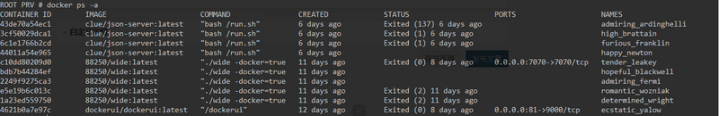

> 翻译[深入 Docker：容器和镜像](http://opensolitude.com/2015/04/26/discovering-docker-containers-images.html)这篇文章，通过一些实例向大家介绍`Docker`容器和镜像的具体区别。

`Docker`是一个非常有趣的项目。它自己宣称可以减轻部署服务器的难度，当然我相信里面有炒作的成分。但是实际使用后，我觉得 Docker 的表现还是可圈可点的。本篇文章将会从头开始进行操作镜像，同时试图通过实例和文档来解答实际操作 Docker 中遇到的问题。

本文仅仅是试图使用深入讲解`Docker`镜像和容器的基础知识，而不是像了解 [Docker：一种更好的虚拟化方式](https://redstack.wordpress.com/2014/11/14/gettingn-to-know-docker-a-better-way-to-do-virtualization/)一样试图总结出 Docker 的所有操作方法。

如果你打算按照本文操作的话，那么你首先有台安装好 Docker 的 Linux 主机。使用 Docker Machine 安装 Docker 很简单，但是同时我也推荐使用 Digital Ocean 中已经安装好 Docker 的云主机直接操作。本篇文章所使用的 Docker 版本为 1.6.0，同时文中所有的命令都需要 root 权限。

## 技巧

同样，译者在正文开始提供一个操作`Docker`的小知识。下文中也会多次使用到这一点。

`Docker`会为所有已经运行（包括已经停止）的容器随机分配一个唯一的名字和一个唯一的 ID，docker 命令可以识别 ID，也可以识别这个名字。



如图所示，第一行的容器的 ID 是 43de70a54ec1，名字是 admiring_ardinghelli

想删除第一行对应的容器，我们只需要 docker rm 43de70a54ec1,或者简写成 docker rm 43de，或者 docker rm admiring_ardinghelli。

## 容器去哪儿了？

刚开始使用 Docker 的用户会发现，运行完一个容器，再次运行这个容器，原来的容器内的内容已经消失了，例如：

现在我们使用 -i（交互式）和 -t（临时终端）参数运行一个容器，然后输入一些交互命令：

```sh
(HOST) # docker run -it ubuntu /bin/bash
(CONTAINER) root@1f608dc4e5b4:/# echo hello docker > /message.txt
(CONTAINER) root@1f608dc4e5b4:/# cat /message.txt
hello docker
(CONTAINER) root@1f608dc4e5b4:/# exit
```

在上面那个容器内，我们创建了 /message.txt 文件，现在我们尝试重新读取这个文件：

```sh
(HOST) # docker run -it ubuntu cat /message.txt
cat: /message.txt: No such file or directory
```

刚刚我们明明新建了这个文件，现在怎么没了？

同时，运行 docker ps 列出容器，刚刚那个 1f608dc4e5b4 容器到哪里去了？

好吧，那么我们用 docker ps -a 命令列出所有容器，然后仔细观察一下：

```sh
(HOST) # docker ps -a
CONTAINER ID        IMAGE                 COMMAND              CREATED             STATUS                      PORTS               NAMES
b3d8c3ef31a0        ubuntu:latest         "cat /message.txt"   33 minutes ago      Exited (1) 33 minutes ago                       admiring_lalande
1f608dc4e5b4        ubuntu:latest         "/bin/bash"          34 minutes ago      Exited (0) 15 minutes ago                       insane_wright
```

现在大家应该可以发现问题了：居然有两个不同的容器，一个执行了 /bin/bash，一个执行了 cat /message.txt。

在本专栏以往的文章中，多次提到：Docker 使用一个叫做 UnionFS 的层级文件系统进行镜像操作。容器对镜像文件的所有操作均是在虚拟出的“改动层”上进行的。当然对容器而言，UnionFS 和普通的文件系统并无差别，也无法看到任何“改动层”。

每次运行 docker run 命令的时候，Docker 都会指定新建容器，并且为容器自己的改动层。所以我们两次都运行了 ubuntu 镜像，那么我们也将会有两个新的、不同的容器，每个容器也都会有自己独立的的“改动层”。因此，在第一个容器内创建的 /message.txt 文件在第二个容器内是无法访问的。当然，要是能互相访问，那我们就得为 Docker 的安全性担心了。

## 容器到底去哪儿了？

> 刚刚的问题是：“容器去哪儿了？” 现在的问题是：“容器到底去哪儿了？我需要里面的 message.txt 文件，怎么才能取出来？”

已经停止的容器中的数据并不会消失，而是被存储在相应的“改动层”中。我们可以通过 docker ps -a 进行查找容器。在这个例子中，我们要找的容器便是执行了 /bin/bash 命令的容器，ID 是 1f608dc4e5b4，名称是 insane_wright。

对比起 ID，容器的名称更加易读。因此在本篇文章后面的例子中，我都将用名称来进行操作和识别容器。当然，你也可以在 docker run 的时候用 --name 参数指定容器的名称。

那么现在我们现在运行上面例子中已经停止的 insane_wright 容器：

```sh
(HOST) # docker start -ai insane_wright
(CONTAINER) root@1f608dc4e5b4:/# cat /message.txt
hello docker
(CONTAINER) root@1f608dc4e5b4:/# exit
```

使用 -a 参数将容器的输出导出到终端，同时使用 -i 参数进行交互式的操作。这条命令可以让我们继续运行容器 insane_wright，现在你应该能看得到我们刚刚创建的 /message.txt 文件了。

## 容器能不能提取出来？

> 现在我们已经运行了自己的容器，容器内也有独立的数据，我们也知道如何获取容器内的数据，那么问题来了：我们能不能把这个状态下的容器给保存起来？

本专栏前面的文章提到过得益于 UnionFS，对于 Docker 来说，其实容器和镜像的差别并不大。容器可以认为是已经运行过的或正在运行的镜像，只不过是镜像上面添加了几个改动层。当然，大部分镜像也是如此。例如某些 mysql 镜像，便仅仅是在官方 ubuntu 镜像的基础上增加了一个 mysql 改动层。

对于上面例子中的容器，我们可以用下面这条命令将其打包成镜像：

```sh
(HOST) $ docker commit -a "Jordan Bach" -m "saved my message" insane_wright jbgo/message:v0.0.1
1c9195e4c24c894a274f857a60b46fb828ee70ff0e78d18017dfb79c5bf68409
```

本条命令将容器 insange_wright 的改动层的属性变为“只读”，并且指定存储为 jbgo/message 镜像。镜像基于原 ubuntu 镜像，增加了一个改动层，标签为 v0.0.1。标签可以为任意，当然一般用来记录版本信息。

当然，如果你打算自己尝试的话，记得将我的名字 jbgo 替换为你自己在 Docker Hub 上的用户名。即便你没有 Docker Hub 账户，也要养成给镜像做签名的习惯。

可以用如下命令检查当前的镜像：

```sh
(HOST) # docker images
REPOSITORY          TAG                 IMAGE ID            CREATED             VIRTUAL SIZE
jbgo/message        v0.0.1              1c9195e4c24c        18 seconds ago      188.3 MB
ubuntu              latest              b7cf8f0d9e82        4 days ago          188.3 MB
```

现在我们有两个镜像了：一个是原有的 ubuntu 镜像，镜像是我们在刚开始进行 docker run 的时候自动从 Docker Hub 上面下载下来的；另一个便是我们刚刚保存的，有一个 /message.txt 文件的镜像。

不信？那我运行给你看。

```sh
(HOST) # docker run -it jbgo/message:v0.0.1 cat /message.txt
hello docker
这里我们并没有运行刚刚的 insane_wright 容器，而是运行了我们刚刚保存的镜像。
我们确实把刚刚的容器保存为一个新的镜像了。
```

还不信？那我检查给你看。

```sh
(HOST) # docker ps -a
CONTAINER ID        IMAGE                 COMMAND              CREATED             STATUS                      PORTS               NAMES
01bd4c098203        jbgo/message:v0.0.1   "cat /message.txt"   10 seconds ago      Exited (0) 9 seconds ago                        hopeful_lovelace
b3d8c3ef31a0        ubuntu:latest         "cat /message.txt"   33 minutes ago      Exited (1) 33 minutes ago                       admiring_lalande
1f608dc4e5b4        ubuntu:latest         "/bin/bash"          34 minutes ago      Exited (0) 15 minutes ago                       insane_wright
```

容器运行记录里面多了一个叫做 hopeful_lovelace 的容器，是运行 jdgo/message:v0.0.1 镜像而创建的这个容器。

## 如何备份镜像？

> 上面我们创建了带有一个 /message.txt 文件的镜像，也用它运行了容器，那么如果 Docker 宿主机崩溃了或者文件消失了怎么办？如何保证我们创建的镜像在系统崩溃后仍然不丢失？

我们需要 Docker Registry，可以存储和下载镜像的地方。Docker Hub 官方提供了 Docker Hub Registry 让我们来存储镜像，当然我们也可以自己搭建 Docker Registry。本篇文章将会使用 Docker Hub Registry，如果你想按照本文中继续操作的话，记得将我的名字 jbgo 换成你自己在 Docker Hub 上的用户名。

使用如下操作将镜像上传到 Docker Registry 上：

```sh
(HOST) # docker push jbgo/message
The push refers to a repository [jbgo/message] (len: 1)
1c9195e4c24c: Image push failed

Please login prior to push:
Username: jbgo
Password:
Email: jordanbach@gmail.com
WARNING: login credentials saved in /root/.dockercfg.
Login Succeeded
The push refers to a repository [jbgo/message] (len: 1)
1c9195e4c24c: Image already exists
b7cf8f0d9e82: Image successfully pushed
2c014f14d3d9: Image successfully pushed
a62a42e77c9c: Image successfully pushed
706766fe1019: Image successfully pushed
Digest: sha256:b2a98b19e06a4df91150f8a2cd47a6e440cbc13b39f1fc235d46f97f631ad117
```

因为我是第一次在本机执行 docker push 操作，所以 Docker Registry 需要验证我的身份。

本次上传的镜像被保存在这里。你可以使用 docker pull jbgo/message 来下载我的镜像。

当然，如果你按照上面的来操作的话，可能会出现一点小问题：

```sh
(HOST) # docker pull jbgo/message
Pulling repository jbgo/message
FATA[0007] Tag latest not found in repository jbgo/message
```

下面我来解释一下到底出了什么问题：当你使用 docker push jbgo/message 命令的时候，默认上传标签为 latest 的镜像。如果没有便会报错。你可以采用如下命令解决： docker tag jbgo/message:v0.0.1 jbgo/message:latest。这次再尝试推送：

```sh
(HOST) # docker push jbgo/message:latest
The push refers to a repository [jbgo/message] (len: 1)
1c9195e4c24c: Image already exists
b7cf8f0d9e82: Image already exists
2c014f14d3d9: Image already exists
a62a42e77c9c: Image already exists
706766fe1019: Image already exists
Digest: sha256:cc2fbbb2029c6402cea639b2454da08ef05672da81176ae97f57d4f51be19fc3
```

这次上传会快得多，因为服务器上已经有了这个镜像，我们上传的仅仅是相同镜像的不同标签而已。

你不信？那我验证给你看：

```sh
(HOST) # docker pull jbgo/message
latest: Pulling from jbgo/message
1c9195e4c24c: Already exists
706766fe1019: Already exists
a62a42e77c9c: Already exists
2c014f14d3d9: Already exists
b7cf8f0d9e82: Already exists
Digest: sha256:cc2fbbb2029c6402cea639b2454da08ef05672da81176ae97f57d4f51be19fc3
Status: Downloaded newer image for jbgo/message:latest
```

当然，别台服务器一样可以使用这个命令下载我的镜像。

当然，也可以使用如下命令上传特定标签的镜像：docker push jbgo/message:v0.0.1。建议使用版本标签标记镜像，并推送特定版本标签的镜像和 latest 标签的镜像。

## 使用完毕的容器如何处理？

> 上面只是介绍了容器如何理解容器和镜像，如果有很多历史容器被保存在硬盘上，想要释放掉这些空间，我们应该怎么做？

使用如下命令删除多个容器：

```sh
(HOST) # docker rm hopeful_lovelace insane_wright admiring_lalande
hopeful_lovelace
insane_wright
admiring_lalande
```

现在再检查一下还有没有这些容器：

```sh
(HOST) # docker ps -a
CONTAINER ID        IMAGE               COMMAND             CREATED             STATUS              PORTS               NAMES
```

我们运行的所有容器和所有的历史容器都会被保存在硬盘上，除非你手动 docker rm 它们。手动删除的容器不能恢复。

## 为什么上传了不止一个镜像？

有心人注意到，刚刚我们第一次上传 jbgo/message 镜像的时候，Docker 上传了不止一个镜像。

```sh
(HOST) # docker push jbgo/message:v0.0.1
...
1c9195e4c24c: Image already exists
b7cf8f0d9e82: Image successfully pushed
2c014f14d3d9: Image successfully pushed
a62a42e77c9c: Image successfully pushed
706766fe1019: Image successfully pushed
```

## 到底发生了什么？

首先使用 docker history 检查一下镜像改动历史：

```sh
(HOST) # docker history jbgo/message:v0.0.1
IMAGE               CREATED             CREATED BY                                      SIZE
1c9195e4c24c        33 minutes ago      /bin/bash                                       108 B
b7cf8f0d9e82        4 days ago          /bin/sh -c #(nop) CMD ["/bin/bash"]             0 B
2c014f14d3d9        4 days ago          /bin/sh -c sed -i 's/^#\s*\(deb.*universe\)$/   1.895 kB
a62a42e77c9c        4 days ago          /bin/sh -c echo '#!/bin/sh' > /usr/sbin/polic   194.5 kB
706766fe1019        4 days ago          /bin/sh -c #(nop) ADD file:777fad733fc954c0c1   188.1 MB
```

会发现，其实我们创建了不止一个镜像，也就是有不止一个改动层。使用 docker inspect 命令仔细观察第一个镜像（第一层）进行过的改动：

```sh
(HOST) # docker inspect 1c9195e4c24c
[{
    "Architecture": "amd64",
    "Author": "Jordan Bach",
    "Comment": "saved my message",
    "Config": {
```

这个肯定就是我们的 /message.txt 改动层了，那么其他的那么多是什么？

jbgo/message 是基于 ubuntu 镜像的，我们来检查一下 ubuntu 镜像的改动历史：

```sh
(HOST) # docker history ubuntu
IMAGE               CREATED             CREATED BY                                      SIZE
b7cf8f0d9e82        4 days ago          /bin/sh -c #(nop) CMD ["/bin/bash"]             0 B
2c014f14d3d9        4 days ago          /bin/sh -c sed -i 's/^#\s*\(deb.*universe\)$/   1.895 kB
a62a42e77c9c        4 days ago          /bin/sh -c echo '#!/bin/sh' > /usr/sbin/polic   194.5 kB
706766fe1019        4 days ago          /bin/sh -c #(nop) ADD file:777fad733fc954c0c1   188.1 MB
```

那么这样一切就很明确了：那些是 ubuntu 镜像的改动历史。为了确保本地和上传到 Docker Hub 的镜像一致，我们上传到 Docker Hub 中的镜像便是包含着五层改动层的新镜像。

## 如何删除镜像？

> 前面提到过，我们删除容器，那么我们本机上仍然保存着镜像，如何删掉它们？

```sh
（HOST） # docker rmi jbgo/message
Error response from daemon: Conflict, cannot delete 1c9195e4c24c because the container 2ea39e64a130 is using it, use -f to force
FATA[0000] Error: failed to remove one or more images
```

提示出错了，根据错误信息可以看出，还有容器在用这一个镜像。

但是我们没有正在运行着的容器啊，到底哪儿出错了？

检查所有容器，发现容器 2ea39e64a130。

```sh
(HOST) # docker ps -a
CONTAINER ID        IMAGE                 COMMAND              CREATED             STATUS                     PORTS               NAMES
2ea39e64a130        jbgo/message:latest   "cat /message.txt"   2 minutes ago       Exited (0) 2 minutes ago                       lonely_jones
```

当然，这是 Docker 的机制：如果你仍然有容器的历史记录，那么为了确保你能再次启动这个容器，这些镜像是不能删除的。

首先删除掉这个容器：docker rm lonely_jones。

然后删除镜像：

```sh
(HOST) # docker rmi jbgo/message
Untagged: jbgo/message:latest
Deleted: 1c9195e4c24c894a274f857a60b46fb828ee70ff0e78d18017dfb79c5bf68409
Deleted: b7cf8f0d9e82c9d96bd7afd22c600bfdb86b8d66c50d29164e5ad2fb02f7187b
Deleted: 2c014f14d3d95811df672ddae2af376f9557f6b8f5623e3e3f8c5ca3f6ff42e6
Deleted: a62a42e77c9c3626118dc411092d23cf658220261acdafe21a7589a8eeba627e
Deleted: 706766fe101906a1a6628173c2677173a5f8c6c469075083f3cf3a8f5e5eb367
```

这次我们可以很轻松地删除掉 jbgo/message 镜像了。确认一下：

```sh
(HOST) # docker images
REPOSITORY          TAG                 IMAGE ID            CREATED             VIRTUAL SIZE
```

确实没了。
