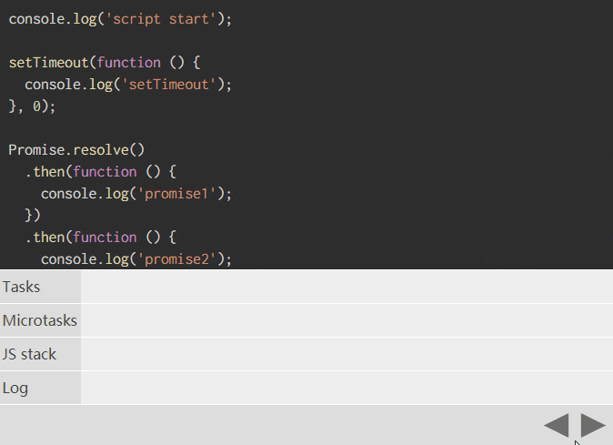

使用以下代码：

```js
console.log('script start');

setTimeout(function () {
  console.log('setTimeout');
}, 0);

Promise.resolve()
  .then(function () {
    console.log('promise1');
  })
  .then(function () {
    console.log('promise2');
  });

console.log('script end');
```

# 运行

<iframe src="/examples/event-loop-deep-learn/promise-settimeout-order.html" width="100%" height="230"></iframe>

日志应以什么顺序显示？

正确答案：`script start`，`script end`，`promise1`，`promise2`，`setTimeout`，但它在浏览器支持方面相当不同。

`Microsoft Edge`，`Firefox 40`，`iOS Safari` 和 `desktop Safari 8.0.8` 输出 setTimeout 在 promise1 和 promise2 之前，尽管这似乎是一种竞争状况。这真的很奇怪，因为 Firefox 39 和 Safari 8.0.7 始终如一地正确。

# 为什么会这样

要了解这一点，您需要了解事件循环如何处理任务和微任务。

每个“线程”都有自己的事件循环，因此每个 `webwork` 都有自己的事件循环，因此可以独立执行，而同一源上的所有窗口都可以共享事件循环，因为它们可以同步通信。事件循环持续运行，执行所有排队的任务。事件循环具有多个任务源，这些任务源保证了该源中的执行顺序（如 IndexedDB 之类的规范定义了它们的执行顺序），但浏览器可以在循环的每个循环中选择从哪个源执行任务。这使浏览器可以优先执行对性能敏感的任务，例如用户输入。

计划了任务，以便浏览器可以从其内部进入 JavaScript/DOM 领域，并确保这些操作顺序发生。在任务之间，浏览器可以呈现更新。从鼠标单击到事件回调，需要安排任务，如解析 HTML 一样，比如在上面的示例中 `setTimeout`。

setTimeout 等待给定的延迟，然后为其回调安排新任务。这就是为什么 setTimeout 在之后 script end 执行的原因，因为 script end 是第一个任务的一部分，并且 setTimeout 记录在单独的任务中。

Microtasks 通常安排事件应该在当前执行脚本后发生，如响应批量的动作，或在不用开启一个全新的任务的情况下使一些逻辑异步。只要没有其他 JavaScript 在执行中间，微任务队列就会在回调之后进行处理，并且在每个任务结束时进行处理。在微任务期间排队的任何其他微任务都将添加到队列的末尾并进行处理。微任务包括 `mutation observer`，以及如上例中的 promise 回调。

一旦 promise 得以解决，或者如果 promise 已经解决，它就会将微任务排队以回调。这样可以确保即使 promise 已经解决，promise 回调也是异步的。因此，`.then(yey, nay)` 对已解决的 promise 进行调用会立即使微任务排队。**这就是为什么 promise1 和 promise2 在 script end 之后的原因，因为当前正在运行的脚本必须在处理微任务之前完成**。**promise1 和 promise2 在 setTimeout 之前，因为微任务总是在下一个任务之前发生**。



# 浏览器的不同

有些浏览器的 `script start`，`script end`，`setTimeout`，`promise1`，`promise2` 在 `setTimeout` 之后运行 `promise` 回调。他们可能将 `promise` 回调称为新任务的一部分，而不是微任务。

这是可以原谅的，因为承诺来自 ECMAScript 而不是 HTML。ECMAScript 具有类似于微型任务的“任务”概念，但是除了模糊的邮件列表讨论之外，这种关系并没有明确。但是，普遍的共识是，应将诺言作为微任务队列的一部分，这是有充分理由的。

将 promise 视为任务会导致性能问题，因为回调可能会因与任务相关的事情（例如渲染）而不必要地延迟。它还会由于与其他任务源的交互而导致不确定性，并可能中断与其他 API 的交互，但稍后会介绍更多。

这是用于使用微任务进行承诺的 Edge 凭单，WebKit 每晚都在做正确的事，因此我认为 Safari 最终会解决此问题，并且它似乎已在 Firefox 43 中得到修复。

真正有趣的是，Safari 和 Firefox 都在此处进行了回归，此问题已得到修复，我不知道这是否只是巧合。

// TODO https://jakearchibald.com/2015/tasks-microtasks-queues-and-schedules/
