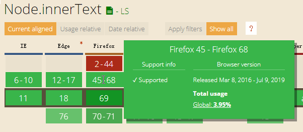
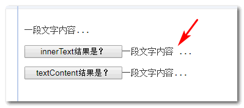
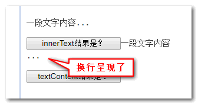
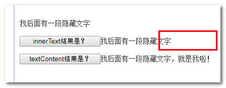
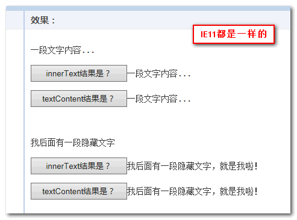

# 简介

innerText IE6 就开始支持，那个时候，Firefox 浏览器是不支持这个 API 的，一直到 2016 年 3 月份 Firefox 45+才开始支持。



而 textContent IE9 浏览器才开始支持：


由于存在兼容性，因此在开发 PC 端项目的时候获取元素的文本内容都是下面的语句：

```js
var text = dom.innerText || dom.textContent;
```

久而久之，就误认为 innerText 和 textContent 作用是一样的。

# innerText 和 textContent 的不同

## 调用对象不同

innerText 只有 HTML 元素才可以调用，但是 textContent 任意 Node 节点都可以：HTMLElement.innerText 和 Node.textContent。

## 值获取规则不同

### 规则差异之块级元素与换行符

```html
<p id="dom">一段文字内容<span style="position:absolute;">...</span></p>
```

实时效果如下：

一段文字内容…

可以看到设置了 position:absolute 的`<span>`元素里面的点点点...和前面的文字内容是紧密连接在一起的，前后没有任何空格。

但是，当我们分别获取 id="dom"的`<p>`元素的 innerText 和 textContent 值的时候，有意思的事情发生了，innerText 的返回值居然在点点点前面出现了一个空格。

如下截图所示：


#### 差异的原因

实际上是 innerText 会保留块级元素的换行特性，以换行符形式呈现。在 HTML 中，如果 white-space 不是 pre 或 pre-wrap 则会表现为空格。也就是下图中的空格实际上是换行符：



例如，我们设置呈现结果的父元素 white-space:pre，则会出现下图所示的效果：



在本例中，虽然`<span>`元素是内联元素，但由于设置了 position:absolute 使其 display 计算值变成了 block，因此，虽然视觉上没有换行，但 innerText 获取的时候依旧产生了换行，导致空格出现。

### 规则差异之隐藏元素的获取与否

```html
<p id="dom2">我后面有一段隐藏文字<span hidden>，就是我啦！</span></p>
```



可以看到，display:none 元素是无法使用 innerText 获取的，但是 textContent 却可以，无论元素隐藏与否。

### 规则差异之性能与回流

此外，由于 innerText 属性值的获取会考虑 CSS 样式，因此读取 innerText 的值将触发回流以确保计算出的样式是最新的，而回流在计算上很昂贵，会降低性能，因此应尽可能避免回流。而 textContent 只是单纯读取文本内容，因此性能更高。

### IE 浏览器不符合上面规则

但是在 IE 浏览器下，innerText 的表现和规范是不符的，最终表现为 textContent 属性一样的效果，也就是没有空格，也不会不显示隐藏元素，例如下面 IE11 下的效果截图：



另外，与 textContent 不同，在 Internet Explorer（版本 11 及以下）中更改 innerText 将从元素中移除子节点，并永久销毁所有子文本节点。不可能再将节点插入任何其他元素或同一元素中。

# 结论

innerText 由于存在诸多特别的特性、以及兼容性差异，以及性能方面问题，以及实际开发的需求的考量，不推荐使用，推荐使用 textContent 获取文本内容。

```js
var text = dom.textContent;
```

如果你的项目还需要兼容 IE8 浏览器，则使用下面的代码：

```js
var text = dom.textContent || dom.innerText;
```

另外，如果你要在一个 DOM 元素中改变文字内容，推荐使用 textContent，而不是 innerHTML，性能会更高一点。
