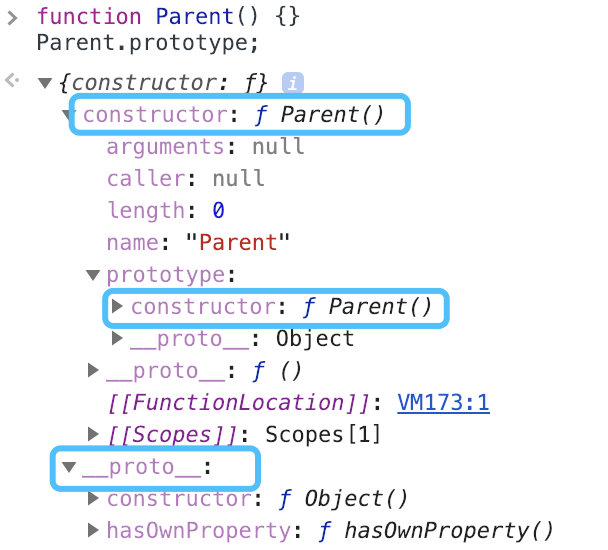
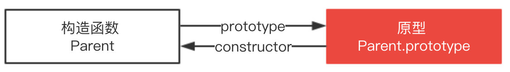
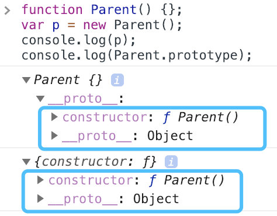
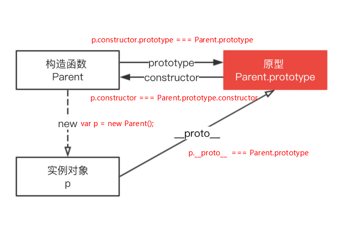
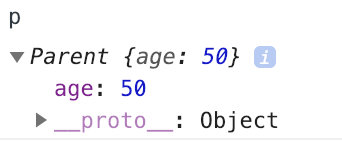
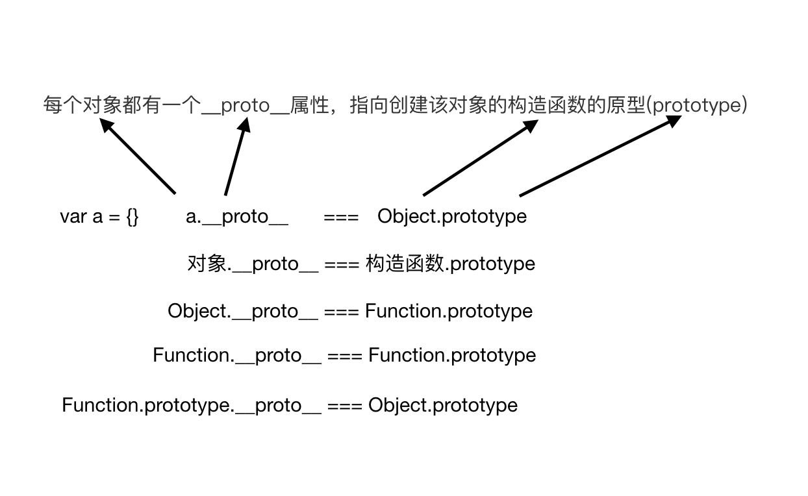

# 构造函数

constructor 返回创建实例对象时构造函数的引用（即 对象.constructor === 构造函数.prototype.constructor），此属性的值是对函数本身的引用，而不是一个包含函数名称的字符串

```js
function Parent(age) {
  this.age = age;
}

var p = new Parent(50);
p.constructor === Parent; // true
p.constructor === Object; // false
```

构造函数本身就是一个函数，与普通函数没有任何区别，不过为了规范一般将其首字母大写。构造函数和普通函数的区别在于，使用 new 生成实例的函数就是构造函数，直接调用的就是普通函数。

那是不是意味着普通函数创建的实例没有 constructor 属性呢？不一定。

```js
// 普通函数
function parent2(age) {
  this.age = age;
}
var p2 = parent2(50);
// undefined

// 普通函数
function parent3(age) {
  return {
    age: age
  };
}
var p3 = parent3(50);
p3.constructor === Object; // true
p3.constructor === Object.prototype.constructor; // true
```

## Symbol 的构造函数

Symbol 是基本数据类型，但作为构造函数来说它并不完整，因为它不支持语法 new Symbol()，Chrome 认为其不是构造函数，如果要生成实例直接使用 Symbol()

```js
new Symbol(123); // Symbol is not a constructor

Symbol(123); // Symbol(123)
```

虽然是基本数据类型，但 Symbol(123) 实例可以获取 constructor 属性值

```js
var sym = Symbol(123);
console.log(sym);
// Symbol(123)

console.log(sym.constructor);
// ƒ Symbol() { [native code] }
```

这里的 constructor 属性来自哪里？其实是 Symbol 原型上的，即 Symbol.prototype.constructor 返回创建实例原型的函数， 默认为 Symbol 函数。

## constructor 只读？

对于引用类型来说 constructor 属性值是可以修改的，但是对于基本类型来说是只读的

```js
function Foo() {
  this.value = 42;
}
Foo.prototype = {
  method: function() {}
};

function Bar() {}

// 设置 Bar 的 prototype 属性为 Foo 的实例对象
Bar.prototype = new Foo();
Bar.prototype.foo = 'Hello World';

Bar.prototype.constructor === Object; // true

// 修正 Bar.prototype.constructor 为 Bar 本身
// Bar.prototype.constructor = Bar;

var test = new Bar(); // 创建 Bar 的一个新实例
console.log(test);
```


对于基本类型来说是只读的，比如 1、“muyiy”、true、Symbol，当然 null 和 undefined 是没有 constructor 属性的。

```js
function Type() {}
var types = [1, 'muyiy', true, Symbol(123)];

for (var i = 0; i < types.length; i++) {
  types[i].constructor = Type;
  types[i] = [types[i].constructor, types[i] instanceof Type, types[i].toString()];
}

console.log(types.join('\n'));
// function Number() { [native code] }, false, 1
// function String() { [native code] }, false, muyiy
// function Boolean() { [native code] }, false, true
// function Symbol() { [native code] }, false, Symbol(123)
```

为什么呢？因为创建他们的是只读的原生构造函数（native constructors），这个例子也说明了依赖一个对象的 constructor 属性并不安全。

## 模拟实现 new

```js
function create() {
  // 1、创建一个空的对象
  var obj = new Object(),
    // 2、获得构造函数，同时删除 arguments 中第一个参数
    Con = [].shift.call(arguments);
  // 3、链接到原型，obj 可以访问构造函数原型中的属性
  Object.setPrototypeOf(obj, Con.prototype); // obj.__proto__ = Con.prototype 没有这个效率高
  // 4、绑定 this 实现继承，obj 可以访问到构造函数中的属性
  var ret = Con.apply(obj, arguments);
  // 5、优先返回构造函数返回的对象
  return ret instanceof Object ? ret : obj;
}
```

# 原型

## prototype

JavaScript 是一种基于原型的语言 (prototype-based language)，这个和 Java 等基于类的语言不一样。

每个对象拥有一个原型对象，对象以其原型为模板，从原型继承方法和属性，这些属性和方法定义在对象的构造器函数的 prototype 属性上，而非对象实例本身。



从上面这张图可以发现，Parent 对象有一个原型对象 Parent.prototype，其上有两个属性，分别是 constructor 和 `__proto__`，其中 `__proto__` 已被弃用。

构造函数 Parent 有一个指向原型的指针，原型 Parent.prototype 有一个指向构造函数的指针 Parent.prototype.constructor，如上图所示，其实就是一个循环引用。

## proto

下图可以看到 Parent 原型（ Parent.prototype ）上有 `__proto__` 属性，这是一个访问器属性（即 getter 函数和 setter 函数），通过它可以访问到对象的内部 [[Prototype]] (一个对象或 null )。



`__proto__` 发音 dunder proto，最先被 Firefox 使用，后来在 ES6 被列为 Javascript 的标准内建属性。

[[Prototype]] 是对象的一个内部属性，外部代码无法直接访问。

> 遵循 ECMAScript 标准，someObject.[[Prototype]] 符号用于指向 someObject 的原型。



这里用 `p.__proto__` 获取对象的原型，`__proto__` 是每个实例上都有的属性，prototype 是构造函数的属性，这两个并不一样，但 `p.__proto__` 和 Parent.prototype 指向同一个对象。

```js
function Parent() {}
var p = new Parent();
p.__proto__ === Parent.prototype;
// true
```

所以构造函数 Parent、Parent.prototype 和 p 的关系如下图。



## 注意点

`__proto__` 属性在 ES6 时才被标准化，以确保 Web 浏览器的兼容性，但是不推荐使用，除了标准化的原因之外还有性能问题。为了更好的支持，推荐使用 Object.getPrototypeOf()。

> 通过改变一个对象的 [[Prototype]] 属性来改变和继承属性会对性能造成非常严重的影响，并且性能消耗的时间也不是简单的花费在 `obj.__proto__` = ... 语句上, 它还会影响到所有继承自该 [[Prototype]] 的对象，如果你关心性能，你就不应该修改一个对象的 [[Prototype]]。

如果要读取或修改对象的 [[Prototype]] 属性，建议使用如下方案，但是此时设置对象的 [[Prototype]] 依旧是一个缓慢的操作，如果性能是一个问题，就要避免这种操作。

```js
// 获取
Object.getPrototypeOf();
Reflect.getPrototypeOf();

// 修改
Object.setPrototypeOf();
Reflect.setPrototypeOf();
```

如果要创建一个新对象，同时继承另一个对象的 [[Prototype]] ，推荐使用 Object.create()。

```js
function Parent() {
  age: 50;
}
var p = new Parent();
// 相当于 Object.setPrototypeOf(child, p.constructor), child.__proto__ = p.constructor
var child = Object.create(p);
```

这里 child 是一个新的空对象，有一个指向对象 p 的指针 `__proto__`。

## 优化实现 new

正如上面介绍的不建议使用 `__proto__`，所以我们使用 Object.create() 来模拟实现，优化后的代码如下

```js
function create() {
  // 1、获得构造函数，同时删除 arguments 中第一个参数
  Con = [].shift.call(arguments);
  // 2、创建一个空的对象并链接到原型，obj 可以访问构造函数原型中的属性
  var obj = Object.create(Con.prototype);
  // 3、绑定 this 实现继承，obj 可以访问到构造函数中的属性
  var ret = Con.apply(obj, arguments);
  // 4、优先返回构造函数返回的对象
  return ret instanceof Object ? ret : obj;
}
```

# 原型链

每个对象拥有一个原型对象，通过 `__proto__` 指针指向上一个原型 ，并从中继承方法和属性，同时原型对象也可能拥有原型，这样一层一层，最终指向 null。这种关系被称为原型链 (prototype chain)，通过原型链一个对象会拥有定义在其他对象中的属性和方法。

```js
function Parent(age) {
  this.age = age;
}

var p = new Parent(50);
p.constructor === Parent; // true
```

这里 p.constructor 指向 Parent，那是不是意味着 p 实例存在 constructor 属性呢？并不是。

我们打印下 p 值就知道了



由图可以看到实例对象 p 本身没有 constructor 属性，是通过原型链向上查找 `__proto__` ，最终查找到 constructor 属性，该属性指向 Parent。

```js
function Parent(age) {
  this.age = age;
}
var p = new Parent(50);

p; // Parent {age: 50}
p.__proto__ === Parent.prototype; // true
p.__proto__.__proto__ === Object.prototype; // true
p.__proto__.__proto__.__proto__ === null; // true
```

下图展示了原型链的运作机制。




# 总结

- Symbol 作为构造函数来说并不完整，因为不支持语法 new Symbol()，但其原型上拥有 constructor 属性，即 Symbol.prototype.constructor。
- 引用类型 constructor 属性值是可以修改的，但是对于基本类型来说是只读的，当然 null 和 undefined 没有 constructor 属性。
- `__proto__` 是每个实例上都有的属性，prototype 是构造函数的属性，这两个并不一样，但 `p.__proto__` 和 Parent.prototype 指向同一个对象。
- `__proto__` 属性在 ES6 时被标准化，但因为性能问题并不推荐使用，推荐使用 Object.getPrototypeOf()。
- 每个对象拥有一个原型对象，通过 `__proto__` 指针指向上一个原型 ，并从中继承方法和属性，同时原型对象也可能拥有原型，这样一层一层，最终指向 null，这就是原型链。
- Object 是所有对象的爸爸，所有对象都可以通过 `__proto__` 找到它
- Function 是所有函数的爸爸，所有函数都可以通过 `__proto__` 找到它
- Function.prototype 和 Object.prototype 是两个特殊的对象，他们由引擎来创建
- 除了以上两个特殊对象，其他对象都是通过构造器 new 出来的
- 函数的 prototype 是一个对象，也就是原型
