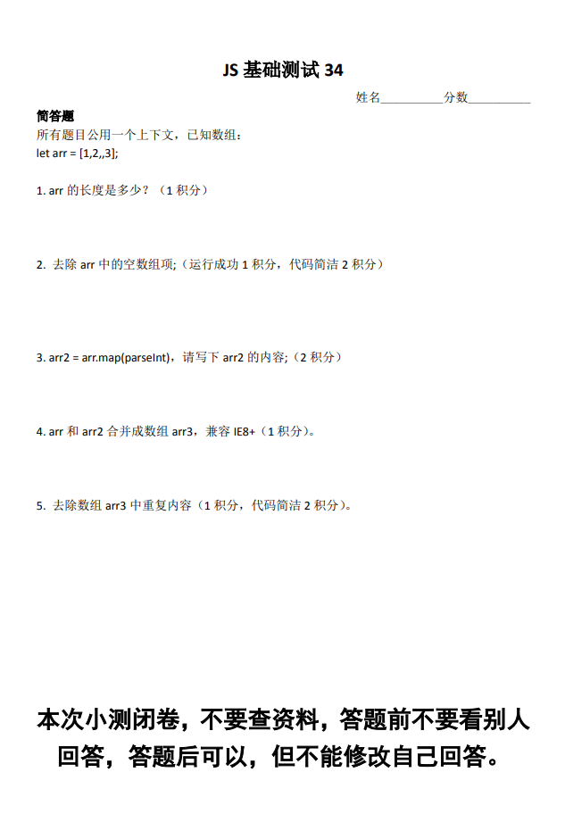
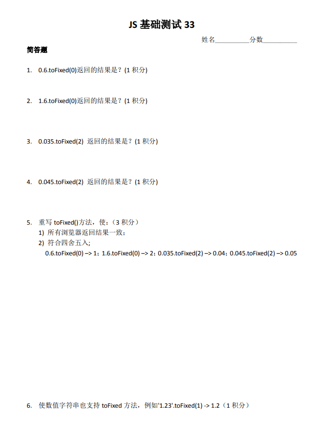
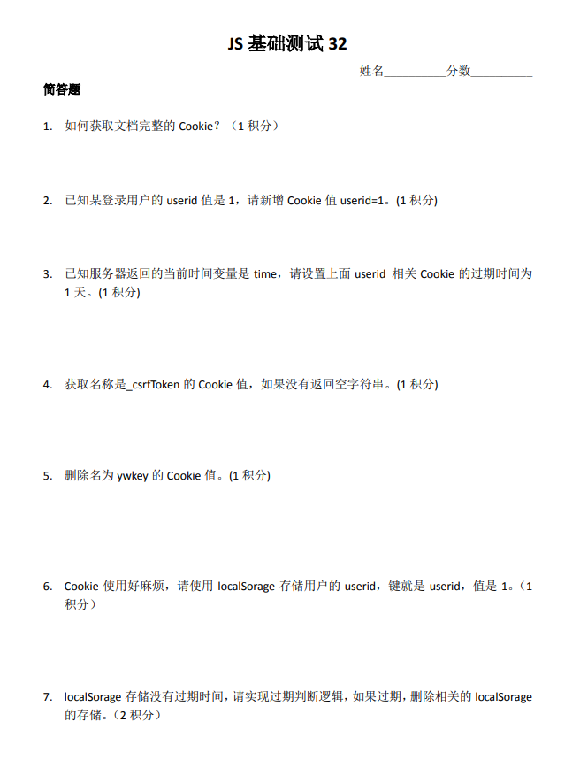
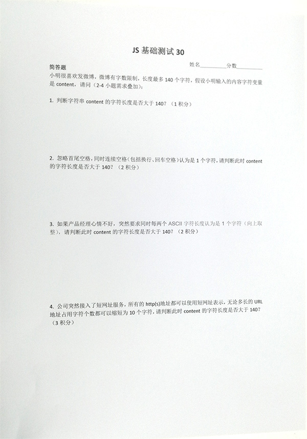
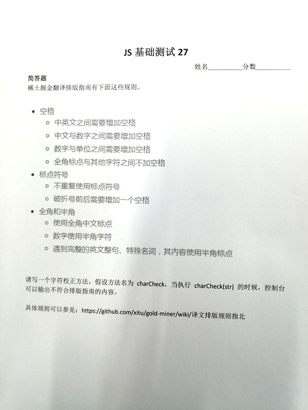
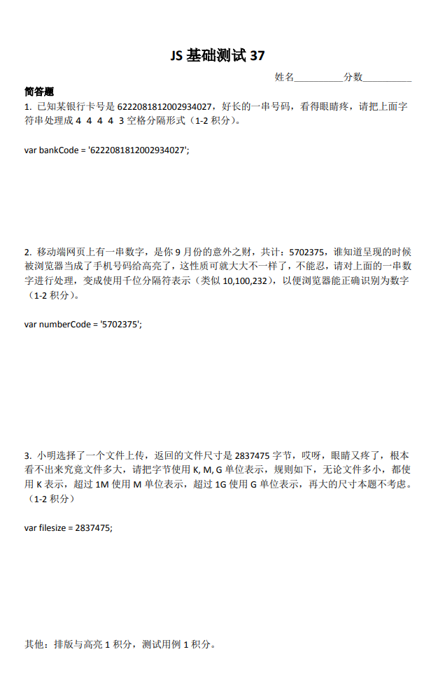

# JS测试一



## 具体实现

### 我的解答

```js
//第一题
4
//第二题
arr.filter((item) => !!item)
//第三题
[1, NaN, empty, NAN]
//第四题
var arr3 = [];
for (var i = 0;i < arr.length; i++) {
  arr3.push(arr[i]);
}
for (var j = 0;j < arr2.length; j++) {
  arr3.push(arr2[i]);
}
//第五题
[...new Set(arr3)]
```

### 最佳解答

```js
//第一题
4
//第二题
arr.filter((item) => true)
// 或者 arr.flat()
//第三题
[1, NaN, empty, NAN]
//第四题
arr.concat(arr2)
//第五题
[...new Set(arr3)]
```

## 实现要点

1. 空数组项也会作为length的一部分；空数组项和空字符串项是有区别的。
2. 第2题，本题只是过滤空数组项，不包括null, undefined这类。
3. 去除空数组项两个比较好的回答：
   1. 数组中的 empty 元素不会参与数组项遍历，故只需返回 true 即可过滤掉 empty 元素（而不会牵连 0、NaN、null、undefined、'' 这些）arr.filter(it => true)。然后补充，但是走for循环，还是会遍历empty数组项。
   2. 或者filter方法参数直接就是一个function即可。例如：~arr.filter(Boolean)~（纠正：不能是Boolean，false会被过滤），arr.filter(Number)， arr.filter(String)
   3. 上面并不是最好的方法。数组有个API，天然去除空数组项，arr.flat()。flat()可以让数组扁平化的方法。
4. 第3题标准答案应该是[1, NaN, NaN]，map里面Function支持参数(value, index, arr)，参见wingmeng的释义。
5. 第4题就是concat，可以数组合并。我自己用“连接猫”记忆这个API。可以分别连接子项，也可以直接连接数组。如果不考虑兼容，可以[...arr, ...arr2]。其他参考方法：Array.prototype.push.apply(arr3, arr2)，也可以[].push.apply(arr3, arr2)，此时arr3是合并后的数组。
6. 数组去重。使用new Set(arr3)，然后把Set对象转换成数组。转数组两个常用方法，一个是Array.from，还有一个是`[...]`。

# JS测试二



## 具体实现

### 我的解答

```js
//第一题
"1"
//第二题
"2"
//第三题
"0.04"
//第四题
"0.04"
//第五题
//不会
```

### 最佳解答

```js
//第一题
"1"
//第二题
"2"
//第三题
"0.04"
//第四题
"0.04"
//第五题
var oldtoFixed = Number.prototype.toFixed
Number.prototype.toFixed = function(digits){
   var length = (parseFloat(this) + '').replace(/^\d+\.?/, '').length;
   var len = length > digits ? length : digits;
   var number = Number(this) + Math.pow(10, -len-1);
   return oldtoFixed.call(number, digits);
}
```

## 实现要点

1. toFixed有两个问题，一是兼容性，二是四舍五入不符合正常的四舍五入认知。金钱计算的时候容易出问题，必须两位小数。
2. 应该返回字符串；补全末尾的0。
3. 机智是实现：方式一：替换小数点保留精度后面一位5为6，方式二：给小数点保留精度后面补一位小数。其中方式2是最简单的

# JS测试三



## 具体实现

### 我的解答

```js
//第一题
document.cookie
//第二题
document.cookie='userid=1';
//第三题
document.cookie='userid=1;expire=' + new Date(Date.now() + 24 * 3600 * 1000).toGMTString();
//第四题
function getCookie(name){
  var strCookie = document.cookie;
  var arrCookie = strCookie.split("; ");
  for (var i = 0;i < arrCookie.length; i++) {
    var arr = arrCookie[i].split("=");
    if (arr[0] === name) {
      return arr[1];
    }
  }
  return "";
}
getCookie('_csrfToken');
//第五题
document.cookie='ywkey=1;expire=' + new Date(Date.now() - 24 * 3600 * 1000).toGMTString();
//第六题
localStorage.setItem('userid', 1);
//第七题
if (timestamp <= Date.now()) {
  localStorage.removeItem('userid');
}
```

### 最佳解答

```js
//第七题
/**
  * 重写localStorage
  */
function rewriteLocalStorage() {
  if (!window.__rewrite__localStorage) {
    Object.assign(window, {
      __rewrite__localStorage: true,
      __localStorage__setItem: localStorage.setItem,
      __localStorage__getItem: localStorage.getItem,
      __localStorage__removeItem: localStorage.removeItem
    })

    if (!localStorage.__expires) {
      localStorage.__expires = "{}"
    }

    localStorage.setItem = function (key, value, millisecond) {
      if (millisecond) {
        let __expires = JSON.parse(localStorage.__expires)
        __expires[key] = +Date.now() + millisecond
        localStorage.__expires = JSON.stringify(__expires)
      }
      window.__localStorage__setItem.call(this, key, value)
    }

    localStorage.getItem = function (key) {
      window.clearExpires()
      return window.__localStorage__getItem.call(this, key)
    }

    localStorage.removeItem = function (key) {
      let __expires = JSON.parse(localStorage.__expires)
      delete __expires[key]
      localStorage.__expires = JSON.stringify(__expires)
      return window.__localStorage__removeItem.call(this, key)
    }

    window.clearExpires = function () {
      let __expires = JSON.parse(localStorage.__expires)
      for (let key in __expires) {
        if (__expires[key] < Date.now()) {
          localStorage.removeItem(key)
        }
      }
    }
  }
}
/**
  * 销毁重写localStorage
  */
function destoryRewriteLocalStorage() {
  if (window.__rewrite__localStorage) {

    localStorage.setItem = window.__localStorage__setItem

    localStorage.getItem = window.__localStorage__getItem

    localStorage.removeItem = window.__localStorage__removeItem

    delete window.__rewrite__localStorage
    delete window.__localStorage__setItem
    delete window.__localStorage__getItem
    delete window.__localStorage__removeItem
    delete window.clearExpires
    localStorage.removeItem("__expires")
  }
}
```

## 实现要点

1. 通过前端手段设置cookie的过期时间，一定要使用服务器时间，不能使用本地时间。两个原因：一个是和服务端统一；本地时间是不准的，用户可以修改的；
2. 获取cookie方法，一类：字符分隔，数组遍历，查询对应的键值。二类：正则，可以看看Seasonley的实现。
3. ?<指的什么？--- （“(?<=\bsub)\w+\b”定位“sub”后面的字符串）。零宽断言。有兼容性问题，见下面讨论，不推荐实际项目使用。
4. 设置过期时间可以expires，也可以是max-age。区别是什么呢？max-age是更新的过期时间用法，是IE9+浏览器才支持的，更容易理解和记忆。
5. 删除cookie可以设置过期时间为之前。
6. localStorage.setItem('userid', 1)或者简写：localStorage.userid = 1;
7. localStorage过期时间，JSON.stringify和JSON.parse是可读性很不错，也容易维护的实现。
8. 可以以上localStorage重写，隐藏时间过期的细节，非常适合作为小工具，小组件。

# JS测试四



## 具体实现

### 我的解答

```js
// 第一题
content.length <= 140
// 第二题
content.trim().replace(/\s+/g,' ')
// 第三题
Math.ceil([...content.trim().replace(/\s+/g,' ')].map((item) => item.charCodeAt()).join('').length / 2)
// 第四题
// 正则实现
```

### 最佳解答

```js
// 第一题
function testLength(str) {
   return str.length > 140;
}

// 第二题
function testLengthNoSpace(str) {
   return testLength(str.trim().replace(/\s+/g,' '));
}

// 第三题
function testLengthNoASCII(str){
  str = str.trim().replace(/\s+/g,' ');
  let ascLen = 0;
  for (let i = 0; i < str.length; i++) {
    // 小于 128 的是可见字符
    str.charCodeAt(i) < 128 && ascLen++;
  }
  return str.length - Math.floor(ascLen / 2) > 140;
}

// 第四题
function testLengthNoURL(str){
   let placeHolder = Array(21).join(',');
   str = str.trim()
      .replace(/\s+/g,' ')
      // \x21-\x7e 匹配不可见字符
      .replace(/http:\/\/[\x21-\x7e]{13,}?(?=[^\x21-\x7e]|$)/g, placeHolder)
      .replace(/https:\/\/[\x21-\x7e]{12,}?(?=[^\x21-\x7e]|$)/g, placeHolder);
   return testLengthNoASCII(str);
}
```

## 实现要点

1. 空格替换直接trim()方法，以及/\s+/g正则即可；
2. ASCII字符非连续也算半个字符，可以使用`str.match(/[\x00-\xff]/g).length`；
3. 网址优先判断；
4. 替换的字符务必是非ASCII字符（否则会认为是5个字符长度）；
5. 20个ASCII字符长度，可以Array(20).join()或者','.repeat(20)；

# JS测试五



## 具体实现

### 最佳解答

```js
var testSpecs = [
    '在LeanCloud上，数据存储是围绕AVObject进行的。',
    '今天出去买菜花了 5000元。',
    '我家的光纤入户宽带有 10Gbps，SSD 一共有 10TB。显示器分辨率宽度是1920px。',
    '今天是 233 ° 的高温。新 MacBook Pro 有 15 % 的 CPU 性能提升。',
    '刚刚买了一部 iPhone ，好开心 ！',
    '她竟然对你说「喵」？！？！？？！！喵？？！！Meow...',
    '你好，我是破折号——一个不苟言笑的符号。',
    '核磁共振成像 (NMRI) 是什么原理都不知道? JFGI!',
    '这件蛋糕只卖 １０００ 元。',
    '乔布斯那句话是怎么说的？「Stay hungry，stay foolish。」',
    '推荐你阅读《Hackers＆Painters：Big Ideas from the Computer Age》，非常的有趣。'
];

charCheck(testSpecs.join(''));

function charCheck(str) {
    // 枚举类型的符号
    var symbols = {
        full: '！（）【】『』「」《》“”‘’；：，。？、',
        half: '!-_()[]{}<>"\';:,./?`',
        getRegStr: function(key) {
            var symbols = typeof key === 'string' ? this[key] : (function(that) {
                if (key instanceof Array) {
                    return key.reduce(function(total, cur) {
                        return total += that[cur];
                    }, '');
                }

                return '';
            })(this);

            // 返回符合 regexp 语法的字符串
            return symbols.split('').map(function(s) {
                return '\\' + s;
            }).join('|');
        },
        getRegRule: function(key, usedAs) {
            var strs = this.getRegStr.call(this, 'full');
            var regArr = ['(\\S+)', '([' + strs + '])'];
            var temp = [].concat(regArr);
            temp.reverse();

            if (usedAs === 'rule') {
                return new RegExp(
                    '(:?' + regArr.join('\\s+') + ')|' +
                    '(:?' + temp.join('\\s+') + ')', 'g');
            } else if (usedAs === 'format') {
                return [
                    new RegExp(regArr.join('\\s+'), 'g'),
                    new RegExp(temp.join('\\s+'), 'g')
                ];
            }
        }
    };

    var regExps = [
        {
            rule: /([\u4e00-\u9fa5]+[a-zA-Z]+)|([a-zA-Z]+[\u4e00-\u9fa5]+)/g,
            format: [
                /([\u4e00-\u9fa5]+)([a-zA-Z]+)/g,
                /([a-zA-Z]+)([\u4e00-\u9fa5]+)/g
            ],
            matches: '$1 $2',
            msg: '中英文之间需要增加空格'
        }, {
            rule: /([\u4e00-\u9fa5]+\d+)|(\d+[\u4e00-\u9fa5]+)/g,
            format: [
                /([\u4e00-\u9fa5]+)(\d+)/g,
                /(\d+)([\u4e00-\u9fa5]+)/g
            ],
            matches: '$1 $2',
            msg: '中文与数字之间需要增加空格'
        }, {
            rule: /(\d)([A-Z]+)/g,
            matches: '$1 $2',
            msg: '数字与大写英文单位之间需要增加空格'
        }, {
            rule: /(\d+)\s+(°|%)/g,
            matches: '$1$2',
            msg: '° 或 % 与数字之间不需要空格'
        }, {
            rule: symbols.getRegRule('full', 'rule'),
            format: symbols.getRegRule('full', 'format'),
            matches: '$1$2',
            msg: '全角标点与其他字符之间不加空格'
        }, {
            // rule: new RegExp('(' + symbols.getRegStr(['full', 'half']) + ')\\1+', 'g'),
            rule: new RegExp('(' + symbols.getRegStr('full') + ')\\1+', 'g'),
            matches: '$1',
            msg: '不重复使用中文标点符号'
        }, {
            rule: /(\S)(——)(\S)/g,
            matches: '$1 $2 $3',
            msg: '破折号前后需要增加一个空格'
        }, {
            // 这条必须位于“遇到完整的英文整句、特殊名词，其內容使用半角标点”之前
            rule: new RegExp('\\s*(' + symbols.getRegStr('half') + ')\\s*', 'g'),
            matches: function(s) {
                s = s.replace(/(^\s*)|(\s*$)/g, '');
                return String.fromCharCode(s.charCodeAt() + 65248);
            },
            msg: '使用全角中文标点'
        }, {
            rule: /[\uFF10-\uFF19]/g,
            matches: function(s) {
                // 半角字符与全角字符的 charCode 相差 65248 
                return String.fromCharCode(s.charCodeAt() - 65248);
            },
            msg: '数字使用半角字符'
        }, {
            // 中文的句号“。”不是全角字符，需要特殊处理
            rule: /[《|「](:?\s*[a-zA-Z]+\s*(。|[\uff00-\uffff])*\s*[a-zA-Z]*)+[\.|」|》]/g,
            matches: function(s) {
                return s.replace(/。|[\uff00-\uffff]/g, function($1) {
                    var half = String.fromCharCode($1.charCodeAt() - 65248);

                    if (!!~['&', '-', '+'].indexOf(half)) {  // 需要前后加空格的字符
                        half = ' ' + half + ' ';
                    } else if (!!~[':', ',', ';'].indexOf(half)) {  // 需要后面加空格的字符
                        half += ' ';
                    } else if (half === 'ㄢ') {
                        half = '.';
                    }

                    return half;
                });
            },
            msg: '遇到完整的英文整句、特殊名词，其內容使用半角标点'
        }
    ];

    var result = str;

    regExps.forEach(function(reg, idx) {
        var format = reg.format;
        var matches = reg.matches;
        var tip = str.match(reg.rule);

        if (tip) {
            console.group('%c' + reg.msg + ' (X)', 'color: red');
            console.log(tip.join('\n'));
            console.groupEnd();

            if (!format) {
                result = result.replace(reg.rule, matches);
            } else if (format instanceof Array) {
                format.forEach(function(fmtReg) {
                    result = result.replace(fmtReg, matches);
                });
            } else if (Object.prototype.toString.call(format) === '[object RegExp]') {
                result = result.replace(format, matches);
            }
        }
    });

    if (result === str) {
        console.log('%c当前文本符合规范 (√)', 'color: green');
        return;
    }

    console.group('按规范格式化后的文本：');
    console.log('%c' + result, 'color: green');
    console.groupEnd();
}
```

# JS测试六



## 具体实现

### 我的解答

```js
// 第一题
var bankCode = '6222081812002934027';
bankCode.replace(/(\d{4})(?=\d)/g,"$1 ")
// 第二题
var numberCode = '57023754';
numberCode.replace(/(\d)(?=(\d{3})+$)/g,'$1,')
// 第三题
function roundNumber(number, n = 2) {
  return Math.round(number * Math.pow(10, n)) / (Math.pow(10, n));
}
function formatterFilesize(size, n){
  var K = 1024;
  var M = 1024 ** 2;
  var G = 1024 ** 3;
 
  if (size < M) {
    return roundNumber(size / K, n) + 'K';
  } else if (size < G) {
    return roundNumber(size / M, n) + 'M';
  }
  return roundNumber(size / G, n) + 'G';
}
formatterFilesize(2837475)
```

### 最佳解答

```js
// 第一题
var bankCode = '6222081812002934027';
bankCode.replace(/(\d{4})/g,'$1 ');
// 第二题
var numberCode = '5702375';
Number(numberCode).toLocaleString('en-US');
// 第三题
var filesize = 2837475;
function format(size) {
 return size>1024**3&&(size/1024**3).toFixed(2)+'G' || 
        size>1024**2&&(size/1024**2).toFixed(2)+'M' || 
        (size/1024).toFixed(2)+'K';
}

format(2837475555) //2.64G
format(2837475) //2.71M
format(28374) //27.71K
```

## 实现要点

1. 这个匹配值得大家关注：bankCode.match(/\d{3,4}/g).join(' ')。然后“$&是最后匹配的字符”。
2. 数字千位分隔符表示语义会更好。`<meta name="format-detection" content="telephone=no">` 这个其实不推荐的。Number(numberCode).toLocaleString()是最佳实现了。toLocaleString保留三位小数（细节可以关注下）。
3. Intl.NumberFormat： https://developer.mozilla.org/en-US/docs/Web/JavaScript/Reference/Global_Objects/NumberFormat
4. 最后一题要点：注意取几位小数，最好向上取，然后注意下文件大小的单位是比特。

