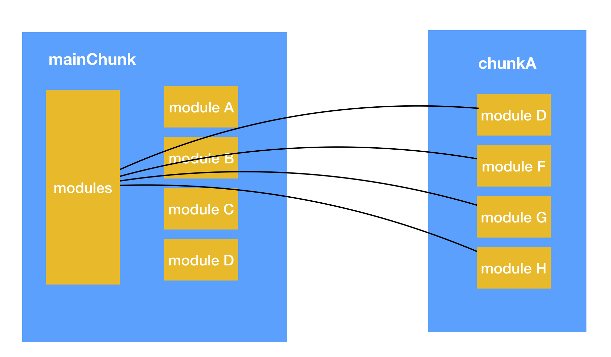
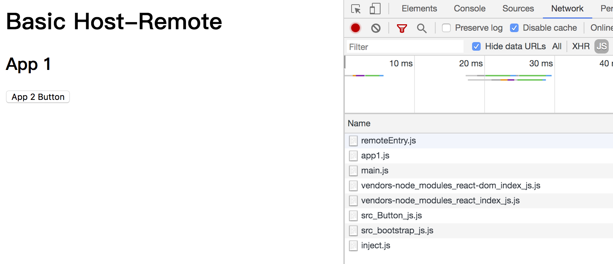

首先了解一下 webpack 的打包原理

# webpack 的打包原理

## chunk 和 module

webpack 里面有两个很核心的概念，叫 chunk 和 module，这里为了简单，只看 js 相关的，用笔者自己的理解去解释一下他们直接的区别：

> module：每一个源码 js 文件其实都可以看成一个 module  
> chunk：每一个打包落地的 js 文件其实都是一个 chunk，每个 chunk 都包含很多 module

默认的 chunk 数量实际上是由你的入口文件的 js 数量决定的，但是如果你配置动态加载或者提取公共包的话，也会生成新的 chunk。

## 打包代码解读

有了基本理解后，我们需要去理解 webpack 打包后的代码在浏览器端是如何加载执行的。为此我们准备一个非常简单的 demo，来看一下它的生成文件。

```js
// src
// ---main.js
// ---moduleA.js
// ---moduleB.js

/**
 * moduleA.js
 */
export default function testA() {
  console.log('this is A');
}

/**
 * main.js
 */
import testA from './moduleA';

testA();

import('./moduleB').then((module) => {});
```

非常简单，入口 js 是 main.js，里面就是直接引入 moduleA.js，然后动态引入 moduleB.js，那么最终生成的文件就是两个 chunk，分别是:

1. main.js 和 moduleA.js 组成的 bundle.js
2. moduleB.js 组成的 0.bundle.js

如果你了解 webpack 底层原理的话，那你会知道这里是用 mainTemplate 和 chunkTemplate 分别渲染出来的，不了解也没关系，我们继续解读生成的代码

### import 变成了什么样

整个 main.js 的代码打包后是下面这样的

```js
(function(module, __webpack_exports__, __webpack_require__) {
  'use strict';
  __webpack_require__.r(__webpack_exports__);
  /* harmony import */
  var _moduleA__WEBPACK_IMPORTED_MODULE_0__ = __webpack_require__(/*!        ./moduleA */ './src/moduleA.js');

  Object(_moduleA__WEBPACK_IMPORTED_MODULE_0__['default'])();

  __webpack_require__
    .e(/*! import() */ 0)
    .then(__webpack_require__.bind(null, /*! ./moduleB             */ './src/moduleB.js'))
    .then((module) => {});
});
```

可以看到，我们的直接 import moduleA 最后会变成 webpack_require，而这个函数是 webpack 打包后的一个核心函数，就是解决依赖引入的。

### webpack_require 是怎么实现的

那我们看一下 webpack_require 它是怎么实现的：

```js
function __webpack_require__(moduleId) {
  // Check if module is in cache
  // 先检查模块是否已经加载过了，如果加载过了直接返回
  if (installedModules[moduleId]) {
    return installedModules[moduleId].exports;
  }
  // Create a new module (and put it into the cache)
  // 如果一个import的模块是第一次加载，那之前必然没有加载过，就会去执行加载过程
  var module = (installedModules[moduleId] = {
    i: moduleId,
    l: false,
    exports: {}
  });
  // Execute the module function
  modules[moduleId].call(module.exports, module, module.exports, __webpack_require__);
  // Flag the module as loaded
  module.l = true;
  // Return the exports of the module
  return module.exports;
}
```

如果简化一下它的实现，其实很简单，就是每次 require，先去缓存的 installedModules 这个缓存 map 里面看是否加载过了，如果没有加载过，那就从 modules 这个所有模块的 map 里去加载。

### modules 从哪里来的

那相信很多人都有疑问了，modules 这么个至关重要的 map 是从哪里来的呢，我们把 bundle.js 生成的 js 再简化一下：

```js
(function(modules) {})({
  './src/main.js': function(module, __webpack_exports__, __webpack_require__) {},
  './src/moduleA.js': function(module, __webpack_exports__, __webpack_require__) {}
});
```

所以可以看到，这其实是个立即执行函数，modules 就是函数的入参，具体值就是我们包含的所有 module，到此一个 chunk 是如何加载的，以及 chunk 如何包含 module，相信大家一定会有自己的理解了。

### 动态引入如何操作呢

上面的 chunk 就是一个 js 文件，所以维护了自己的局部 modules，然后自己使用没啥问题，但是动态引入我们知道是会生成一个新的 js 文件的，那这个新的 js 文件 0.bundle.js 里面是不是也有自己的 modules 呢？那 bundle.js 如何知道 0.bundle.js 里面的 modules 呢？

先看动态 import 的代码变成了什么样：

```js
__webpack_require__
  .e(/*! import() */ 0)
  .then(__webpack_require__.bind(null, /*! ./moduleB             */ './src/moduleB.js'))
  .then((module) => {});
```

从代码看，实际上就是外面套了一层 webpck_require.e，然后这是一个 promise，在 then 里面再去执行 webpack_require。

实际上 webpck_require.e 就是去加载 chunk 的 js 文件 0.bundle.js，具体代码就不贴了，没啥特别的。

等到加载回来后它认为 bundle.js 里面的 modules 就一定会有了 0.bundle.js 包含的那些 modules，这是如何做到的呢？

我们看 0.bundle.js 到底是什么内容，让它拥有这样的魔力：

```js
(window['webpackJsonp'] = window['webpackJsonp'] || []).push([
  [0],
  {
    './src/moduleB.js': function(module, __webpack_exports__, __webpack_require__) {}
  }
]);
```

拿简化后的代码一看，大家第一眼想到的是 jsonp，但是很遗憾的是它不是一个函数，却只是向一个全局数组里面 push 了自己的模块 id 以及对应的 modules。那看起来魔法的核心应该是在 bundle.js 里面了，事实的确也是如此。

```js
var jsonpArray = (window['webpackJsonp'] = window['webpackJsonp'] || []);
var oldJsonpFunction = jsonpArray.push.bind(jsonpArray);
jsonpArray.push = webpackJsonpCallback;
jsonpArray = jsonpArray.slice();
for (var i = 0; i < jsonpArray.length; i++) webpackJsonpCallback(jsonpArray[i]);
var parentJsonpFunction = oldJsonpFunction;
```

在 bundle.js 的里面，我们看到这么一段代码，其实就是说我们劫持了 push 函数，那 0.bundle.js 一旦加载完成，我们岂不是就会执行这里，那不就能拿到所有的参数，然后把 0.bundle.js 里面的所有 module 加到自己的 modules 里面去！

## 总结一下

如果你没有很理解，可以配合下面的图片，再把上面的代码读几遍。



其实简单来说就是，对于 mainChunk 文件，我们维护一个 modules 这样的所有模块 map，并且提供类似 webpack_require 这样的函数。对于 chunkA 文件（可能是因为提取公共代码生成的、或者是动态加载）我们就用类似 jsonp 的方式，让它把自己的所有 modules 添加到主 chunk 的 modules 里面去。

# Module federation

## Module federation 的介绍

允许运行时动态决定代码的引入和加载。

## Module federation 的 demo

我们最关心的还是 Module federation 的实现方式：

[module-federation-examples/basic-host-remote](https://github.com/module-federation/module-federation-examples/tree/master/basic-host-remote)

在此之前，还是需要向大家介绍一下这个 demo 做的事情

```
app1
---index.js 入口文件
---bootstrap.js 启动文件
---App.js react组件

app2
---index.js 入口文件
---bootstrap.js 启动文件
---App.js react组件
---Button.js react组件
```

这是文件结构，其实你可以看成是两个独立应用 app1 和 app2，那他们之前有什么爱恨情仇呢？

```js
/** app1 **/
/**
 * index.js
 **/
import('./bootstrap');

/**
 * bootstrap.js
 **/
import('./bootstrap');
import App from './App';
import React from 'react';
import ReactDOM from 'react-dom';

ReactDOM.render(<App />, document.getElementById('root'));

/**
 * App.js
 **/
import('./bootstrap');
import React from 'react';

import RemoteButton from 'app2/Button';

const App = () => (
  <div>
    <h1>Basic Host-Remote</h1>
    <h2>App 1</h2>
    <React.Suspense fallback='Loading Button'>
      <RemoteButton />
    </React.Suspense>
  </div>
);

export default App;
```

我这里只贴了 app1 的 js 代码，app2 的代码你不需要关心。代码没有什么特殊的，只有一点，app1 的 App.js 里面：

```js
import RemoteButton from 'app2/Button';
```

也就是关键来了，跨应用复用代码来了！app1 的代码用了 app2 的代码，但是这个代码最终长什么样？是如何引入 app2 的代码的？

## Module federation 的配置

先看我们的 webpack 需要如何配置：

```js
/**
 * app1/webpack.js
 */
{
  plugins: [
    new ModuleFederationPlugin({
      name: 'app1',
      library: {
        type: 'var',
        name: 'app1'
      },
      remotes: {
        app2: 'app2'
      },
      shared: ['react', 'react-dom']
    })
  ];
}
```

这个其实就是 Module federation 的配置了，大概能看到想表达的意思：

1. 用了远程模块 app2，它叫 app2
2. 用了共享模块，它叫 shared

remotes 和 shared 还是有一点区别的，我们先来看效果。

生成的 html 文件：

```html
<html>
  <head>
    <script src="app2/remoteEntry.js"></script>
  </head>
  <body>
    <div id="root"></div>
    <script src="app1/app1.js"></script>
    <script src="app1/main.js"></script>
  </body>
</html>
```

ps：这里的 js 路径有修改，这个是可以配置的，这里只是表明从哪里加载了哪些 js 文件

app1 打包生成的文件：

```
app1/index.html
app1/app1.js
app1/main.js
app1/react.js
app1/react-dom.js
app1/src_bootstrap.js
```

ps: app2 你也需要打包，只是我没有贴 app2 的代码以及配置文件，后面需要的时候会再贴出来的

最终页面表现以及加载的 js：



从上往下加载的 js 时序其实是很有讲究的，后面将会是解密的关键：

```
app2/remoteEntry.js
app1/app1.js
app1/main.js
app1/react.js
app1/react-dom.js
app2/src_button_js.js
app1/src_bootstrap.js
```

这里最需要关注的其实还是每个文件从哪里加载，在不去分析原理之前，看文件加载我们至少有这些结论：

1. remotes 的代码自己不打包，类似 external，例如 app2/button 就是加载 app2 打包的代码
2. shared 的代码自己是有打包的

## Module federation 的原理

在讲解原理之前，我还是放出之前的一张图，因为这是 webpack 的文件模块核心，即使升级 5，也没有发生变化


app1 和 app2 还是有自己的 modules，所以实现的关键就是两个 modules 如何同步，或者说如何注入，那我们就来看看 Module federation 如何实现的。

### import 变成了什么

```js
// import源码
import RemoteButton from 'app2/Button';

// import打包代码 在app1/src_bootstrap.js里面
/* harmony import */
var app2_Button__WEBPACK_IMPORTED_MODULE_1__ = __webpack_require__(/*! app2/Button */ '?ad8d');
/* harmony import */
var app2_Button__WEBPACK_IMPORTED_MODULE_1___default = /*#__PURE__*/ __webpack_require__.n(
  app2_Button__WEBPACK_IMPORTED_MODULE_1__
);
```

从这里来看，我们好像看不出什么，因为还是正常的 webpack_require，难道说它真的像我们之前所设想的那样，重写了 webpack_require 吗？

遗憾的是，从源码看这个函数是没有什么变化的，所以核心点不是这里。

但是你注意看加载的 js 顺序：

```
app2/remoteEntry.js
app1/app1.js
app1/main.js
app1/react.js
app1/react-dom.js
app2/src_button_js.js // app2的button竟然先加载了，比我们的自己启动文件还前面
app1/src_bootstrap.js
```

那么是不是我们需要将依赖前置，也就是说在加载远程模块时，它知道自己依赖哪些共享模块，然后去检测是否存在，不存在依次去加载，所以依赖就位后才开始执行自己。

所以它是不是通过依赖前置来解决的呢？

### main.js 文件内容

因为 html 里面和 app1 相关的只有两个文件：app1/app1.js 以及 app1/main.js

那我们看看 main.js 到底写了啥

```js
(() => {
  // webpackBootstrap
  var __webpack_modules__ = {};

  var __webpack_module_cache__ = {};

  function __webpack_require__(moduleId) {
    if (__webpack_module_cache__[moduleId]) {
      return __webpack_module_cache__[moduleId].exports;
    }
    var module = (__webpack_module_cache__[moduleId] = {
      exports: {}
    });
    __webpack_modules__[moduleId](module, module.exports, __webpack_require__);
    return module.exports;
  }
  __webpack_require__.m = __webpack_modules__;

  __webpack_require__('./src/index.js');
})();
```

可以看到区别不大，只是把之前的 modules 换成了 webpack_modules，然后把这个 modules 的初始化由参数改成了内部声明变量。

那我们来看看 webpack_modules 内部的实现:

```js
var __webpack_modules__ = {
  './src/index.js': (__unused_webpack_module, __unused_webpack_exports, __webpack_require__) => {
    __webpack_require__
      .e(/*! import() */ 'src_bootstrap_js')
      .then(__webpack_require__.bind(__webpack_require__, /*! ./bootstrap */ './src/bootstrap.js'));
  },

  'container-reference/app2': (module) => {
    'use strict';
    module.exports = app2;
  },

  '?8bfd': (module, __unused_webpack_exports, __webpack_require__) => {
    'use strict';
    var external = __webpack_require__('container-reference/app2');
    module.exports = external;
  }
};
```

从代码看起来就三个 module：

1. `./src/index.js` 这个看起来就是我们的 `app1/index.js`，里面去动态加载 `bootstrap.js` 对应的 `chunk src_bootstrap_js`
2. `container-reference/app2` 直接返回一个全局的 `app2`，这里感觉和我们的 `app2` 有关系
3. `?8bfd` 这个字符串是我们上面提到的 `app2/button` 对应的文件引用 `id`

那在加载 src_bootstrap.js 之前加载的那些 react 文件还有 app2/button 文件都是谁做的呢？通过 debug，我们发现秘密就在 webpack_require\_\_.e("src_bootstrap_js") 这句话

> 实际上 webpck_require.e 就是去加载 chunk 的 js 文件 0.bundle.js，等到加载回来后它认为 bundle.js 里面的 modules 就一定会有了 0.bundle.js 包含的那些 modules

也就是说原来的 webpack_require\_\_.e 平淡无奇，就是加载一个 script，以致于我们都不想去贴出它的代码，但是这次升级后一切变的不一样了，它成了关键中的关键！

### webpack_require\_\_.e 做了什么

```js
__webpack_require__.e = (chunkId) => {
  return Promise.all(
    Object.keys(__webpack_require__.f).reduce((promises, key) => {
      __webpack_require__.f[key](chunkId, promises);
      return promises;
    }, [])
  );
};
```

看代码，的确发生了变化，现在底层是去调用 webpack_require.f 上面的函数了，等到所有函数都执行完了，才执行 promise 的 then

那问题的核心又变成了 webpack_require.f 上面有哪些函数了，最后发现有三个函数：

#### overridables

```js
/* webpack/runtime/overridables */
__webpack_require__.O = {};
var chunkMapping = {
  src_bootstrap_js: ['?a75e', '?6365']
};
var idToNameMapping = {
  '?a75e': 'react-dom',
  '?6365': 'react'
};
var fallbackMapping = {
  '?a75e': () => {
    return __webpack_require__
      .e('vendors-node_modules_react-dom_index_js')
      .then(() => () => __webpack_require__('./node_modules/react-dom/index.js'));
  },
  '?6365': () => {
    return __webpack_require__
      .e('vendors-node_modules_react_index_js')
      .then(() => () => __webpack_require__('./node_modules/react/index.js'));
  }
};
__webpack_require__.f.overridables = (chunkId, promises) => {};
```

#### remotes

```js
/* webpack/runtime/remotes loading */
var chunkMapping = {
  src_bootstrap_js: ['?ad8d']
};
var idToExternalAndNameMapping = {
  '?ad8d': ['?8bfd', 'Button']
};
__webpack_require__.f.remotes = (chunkId, promises) => {};
```

#### jsonp

```js
/* webpack/runtime/jsonp chunk loading */
var installedChunks = {
  main: 0
};

__webpack_require__.f.j = (chunkId, promises) => {};
```

这三个函数我把核心部分节选出来了，其实注释也写得比较清楚了，我还是解释一下：

1. overridables 可覆盖的，看代码你应该已经知道和 shared 配置有关
2. remotes 远程的，看代码非常明显是和 remotes 配置相关
3. jsonp 这个就是原有的加载 chunk 函数，对应的是以前的懒加载或者公共代码提取

### 加载流程

知道了核心在 webpack_require.e 以及内部实现后，不知道你脑子里是不是对整个加载流程有了一定的思路，如果没有，容我来给你解析一下

1. 先加载 src_main.js，这个没什么好说的，注入在 html 里面的
2. src_main.js 里面执行 webpack_require("./src/index.js")
3. src/index.js 这个 module 的逻辑很简单，就是动态加载 src_bootstrap_js 这个 chunk
4. 动态加载 src_bootstrap_js 这个 chunk 时，经过 overridables，发现这个 chunk 依赖了 react、react-dom，那就看是否已经加载，没有加载就去加载对应的 js 文件，地址也告诉你了
5. 动态加载 src_bootstrap_js 这个 chunk 时，经过 remotes，发现这个 chunk 依赖了?ad8d，那就去加载这个 js
6. 动态加载 src_bootstrap_js 这个 chunk 时，经过 jsonp，就正常加载就好了
7. 所有依赖以及 chunk 都加载完成了，就去执行 then 逻辑：webpack_require src_bootstrap_js 里面的 module：./src/bootstrap.js

到此就一切都正常启动了，其实就是我们之前提到的依赖前置，先去分析，然后生成配置文件，再去加载。

看起来一切都很美好，但其实还是有一个关键信息没有解决！

### 如何知道 app2 的存在

上面的第 4 步加载 react 的时候，因为我们自己实际上也打包了 react 文件，所以当没有加载的时候，我们可以去加载一份，也知道地址

但是第五步的时候，当页面从来没有加载过 app2/Button 的时候，我们去什么地址加载什么文件呢？

这个时候就要用到前面我们提到的 main.js 里面的 webpack_modules 了

```js
var __webpack_modules__ = {
  'container-reference/app2': (module) => {
    'use strict';
    module.exports = app2;
  },

  '?8bfd': (module, __unused_webpack_exports, __webpack_require__) => {
    'use strict';
    var external = __webpack_require__('container-reference/app2');
    module.exports = external;
  }
};
```

这里面有三个 module，我们还有 ?8bfd、container-reference/app2 没有用到，我们再看一下 remotes 的实现

```js
/* webpack/runtime/remotes loading */
var chunkMapping = {
  src_bootstrap_js: ['?ad8d']
};
var idToExternalAndNameMapping = {
  '?ad8d': ['?8bfd', 'Button']
};
__webpack_require__.f.remotes = (chunkId, promises) => {
  if (__webpack_require__.o(chunkMapping, chunkId)) {
    chunkMapping[chunkId].forEach((id) => {
      if (__webpack_modules__[id]) return;
      var data = idToExternalAndNameMapping[id];
      promises.push(
        Promise.resolve(__webpack_require__(data[0]).get(data[1])).then((factory) => {
          __webpack_modules__[id] = (module) => {
            module.exports = factory();
          };
        })
      );
    });
  }
};
```

当我们加载 src_bootstrap_js 这个 chunk 时，经过 remotes，发现这个 chunk 依赖了?ad8d，那在运行时的时候：

```js
id = '?8bfd';
data = ['?8bfd', 'Button'];
// 源码
__webpack_require__(data[0]).get(data[1]);
// 运行时
__webpack_require__('?8bfd').get('Button');
```

结合 main.js 的 module ?8bfd 的代码，那最终就是 app2.get("Button")

这不就是个全局变量吗？看起来有些蹊跷啊！

### 再看 app2/remoteEntry.js

我们好像一直忽略了这个文件，它是第一个加载的，必然有它的作用，带着对全局 app2 有什么蹊跷的疑问，我们去看了这个文件，果然发现了玄机！

```js
var app2;
app2 = (() => {
  'use strict';
  var __webpack_modules__ = {
    '?8619': (__unused_webpack_module, exports, __webpack_require__) => {
      var moduleMap = {
        Button: () => {
          return __webpack_require__
            .e('src_Button_js')
            .then(() => () => __webpack_require__(/*! ./src/Button */ './src/Button.js'));
        }
      };
      var get = (module) => {
        return __webpack_require__.o(moduleMap, module)
          ? moduleMap[module]()
          : Promise.resolve().then(() => {
              throw new Error('Module ' + module + ' does not exist in container.');
            });
      };
      var override = (override) => {
        Object.assign(__webpack_require__.O, override);
      };

      __webpack_require__.d(exports, {
        get: () => get,
        override: () => override
      });
    }
  };
  return __webpack_require__('?8619');
})();
```

如果你细心看，就会发现，这个文件定义了全局的 app2 变量，然后提供了一个 get 函数，里面实际上就是去加载具体的模块

所以 app2.get("Button") 在这里就变成了 app2 内部定义的 get 函数，随后执行自己的 webpack_require

是不是有种焕然大悟的感觉！

原来它是这样在两个独立打包的应用之间，通过全局变量去建立了一座彩虹桥！

当然，app2/remoteEntry.js 是由 app2 根据配置打包出来的，里面实际上就是根据配置文件的导出模块，生成对应的内部 modules

### 你可能忽略的 bootstrap.js

在入口文件 index.js 和真正的文件 app.js 之间多了一个 bootstrap.js，而且里面内容就是异步加载 app.js

那这个文件是不是多余的，笔者试了一下，直接把入口换成 app.js 或者这里换成同步加载，整个应用就跑不起来了

其实从原理上分析后也是可以理解的：

因为依赖需要前置，并且等依赖加载完成后才能执行自己的入口文件，如果不把入口变成一个异步的 chunk，那如何去实现这样的依赖前置呢？毕竟实现依赖前置加载的核心是 webpack_require.e

## 总结

这里解决的主要是 2 个问题：

1. 如何解决依赖问题，这里的实现方式是重写了加载 chunk 的 webpack_require.e，从而前置加载依赖
2. 如何解决 modules 的共享问题，这里是使用全局变量来 hook

这种实现方式的优缺点其实也明显：

优点：做到代码的运行时加载，而且 shared 代码无需自己手动打包缺点：对于其他应用的依赖，实际上是强依赖的，也就是说 app2 有没有按照接口实现，你是不知道的
