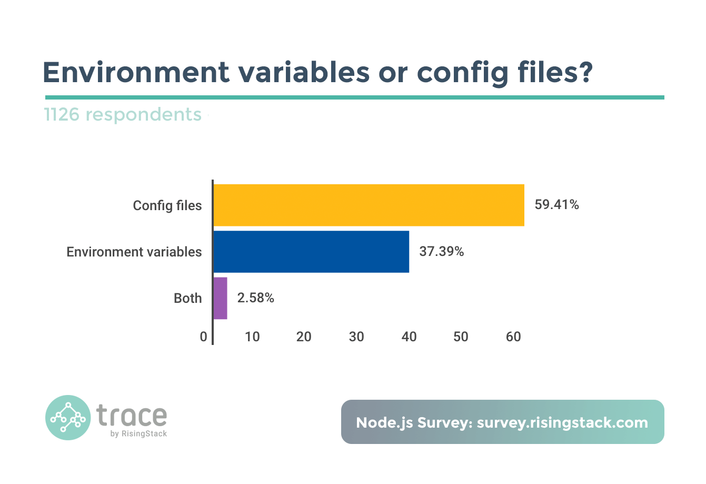

# JS 基础问题

## 简述

与前端 Js 不同, 后端方面除了SSR/爬虫之外很少会接触 DOM, 所以关于 DOM 方面的各种知识基本不会讨论.浏览器端除了图形业务外很少碰到内存问题, 但是后端几乎是直面服务器内存的, 更加偏向内存方面, 对于一些更基础的问题也会更加关注.

## 类型判断

看 [lodash](https://github.com/lodash/lodash)

## 作用域

看 《你不知道的js》

## 引用传递

> js 中什么类型是引用传递, 什么类型是值传递? 如何将值类型的变量以引用的方式传递?

简单点说, 对象是引用传递, 基础类型是值传递, 通过将基础类型包装 (boxing) 可以以引用的方式传递.

引用传递和值传递是一个非常简单的问题, 也是理解 JavaScript 中的内存方面问题的一个基础. 如果不了解引用可能很难去看很多问题.

面试写代码的话, 可以通过 `如何编写一个 json 对象的拷贝函数` 等类似的问题来考察对引用的了解. 不过笔者偶尔会有恶趣味, 喜欢先问应聘者对于 == 的 === 的区别的了解. 然后再问 `[1]` == `[1]` 是 true 还是 false. 如果基础不好的同学可能会被自己对于 == 和 === 的结论影响然后得出错误的结论.

对于技术好的, 希望能直接反驳这个问题本身是有问题的, 比如讲清楚 JavaScript 中没有引用传递只是传递引用. 参见 Is JavaScript a pass-by-reference or pass-by-value language?. 虽然说是复杂版, 但是这些知识对于 3 年经验的同学真的应该是很简单的问题了.

另外如果简历中有写 C++, 则必问 `指针与引用的区别`.

## 内存释放

> JavaScript 中不同类型以及不同环境下变量的内存都是何时释放?

引用类型是在没有引用之后, 通过 v8 的 GC 自动回收, 值类型如果是处于闭包的情况下, 要等闭包没有引用才会被 GC 回收, 非闭包的情况下等待 v8 的新生代 (new space) 切换的时候回收.

与前端 Js 不同, 2年以上经验的 Node.js 一定要开始注意内存了, 不说对 v8 的 GC 有多了解, 基础的内存释放一定有概念了, 并且要开始注意内存泄漏的问题了.

你需要了解哪些操作一定会导致内存泄漏, 或者可以崩掉内存. 比如如下代码能否爆掉 V8 的内存?

```js
let arr = [];
while(true)
  arr.push(1);
```

然后上述代码与下方的情况有什么区别?

```js
let arr = [];
while(true)
  arr.push();
```

如果 push 的是 Buffer 情况又会有什么区别?

```js
let arr = [];
while(true)
  arr.push(new Buffer(1000));
```

思考完之后可以尝试找找别的情况如何爆掉 V8 的内存. 以及来聊聊内存泄漏?

```js
function out() {
  const bigData = new Buffer(100);
  inner = function () {
    void bigData;
  }
}
```

闭包会引用到父级函数中的变量，如果闭包未释放，就会导致内存泄漏。上面例子是 inner 直接挂在了 root 上，从而导致内存泄漏（bigData 不会释放）。详见 [如何分析 Node.js 中的内存泄漏](https://zhuanlan.zhihu.com/p/25736931)

对于一些高水平的同学, 要求能清楚的了解 V8 内存 GC 的机制, 懂得内存快照等 (之后会在调试/优化的小结中讨论) 了. 比如 V8 中不同类型的数据存储的位置, 在内存释放的时候不同区域的不同策略等等.

## ES6 新特性

看阮一峰的 [ECMAScript 6 入门](http://es6.ruanyifeng.com/)

比较简单的会问 let 与 var 的区别, 以及 `箭头函数` 与 `function` 的区别等等.

深入的话, es6 有太多细节可以深入了. 比如结合 `引用` 的知识点来询问 const 方面的知识. 结合 `{}` 的使用与缺点来谈 Set, Map 等. 比如私有化的问题与 symbol 等等.

其他像是闭包是什么? 这种问烂了问题已经感觉没必要问了, 取而代之的是询问闭包应用的场景更加合理. 比如说, 如果回答者通常使用闭包实现数据的私有, 那么可以接着问 es6 的一些新特性 (例如 class, symbol) 能否实现私有, 如果能的话那为什么要用闭包? 亦或者是什么闭包中的数据/私有化的数据的内存什么时候释放? 等等.

`...` 的使用上, 如何实现一个数组的去重 (使用 Set 可以加分).

> const 定义的 Array 中间元素能否被修改? 如果可以, 那 const 修饰对象有什么意义?

其中的值可以被修改. 意义上, 主要保护引用不被修改 (如用 Map 等接口对引用的变化很敏感, 使用 const 保护引用始终如一是有意义的), 也适合用在 immutable 的场景.

# 模块

## 常见问题

> 如何在不重启 node 进程的情况下热更新一个 js/json 文件? 这个问题本身是否有问题?

可以清除掉 require.cache 的缓存重新 require(xxx), 视具体情况还可以用 VM 模块重新执行.

当然这个问题可能是典型的 X-Y Problem, 使用 js 实现热更新很容易碰到 v8 优化之后各地拿到缓存的引用导致热更新 js 没意义. 当然热更新 json 还是可以简单一点比如用读取文件的方式来热更新, 但是这样也不如从 redis 之类的数据库中读取比较合理.

## 简述

其他还有很多内容也是属于很 '基础' 的 Node.js 问题 (例如异步/线程等等), 但是由于归类的问题并没有放在这个分类中. 所以这里只简单讲几个之后没归类的基础问题.

## 模块机制

node 的基础中毫无疑问的应该是有关于模块机制的方面的, 也即 require 这个内置功能的一些原理的问题.

关于模块互相引用之类的, 不了解的推荐先好好读读官方文档.

其实官方文档已经说得很清楚了, 每个 node 进程只有一个 VM 的上下文, 不会跟浏览器相差多少, 模块机制在文档中也描述的非常清楚了:

```js
function require(...) {
  var module = { exports: {} };
  ((module, exports) => {
    // Your module code here. In this example, define a function.
    function some_func() {};
    exports = some_func;
    // At this point, exports is no longer a shortcut to module.exports, and
    // this module will still export an empty default object.
    module.exports = some_func;
    // At this point, the module will now export some_func, instead of the
    // default object.
  })(module, module.exports);
  return module.exports;
}
```

> 如果 a.js require 了 b.js, 那么在 b 中定义全局变量 t = 111 能否在 a 中直接打印出来?

每个 .js 能独立一个环境只是因为 node 帮你在外层包了一圈自执行, 所以你使用 t = 111 定义全局变量在其他地方当然能拿到. 情况如下:

```js
// b.js
(function (exports, require, module, __filename, __dirname) {
  t = 111;
})();

// a.js
(function (exports, require, module, __filename, __dirname) {
  // ...
  console.log(t); // 111
})();
```

> a.js 和 b.js 两个文件互相 require 是否会死循环? 双方是否能导出变量? 如何从设计上避免这种问题?

不会, 先执行的导出其未完成的副本, 通过导出工厂函数让对方从函数去拿比较好避免. 模块在导出的只是 var module = { exports: {...} }; 中的 exports, 以从 a.js 启动为例, a.js 还没执行完会返回一个 a.js 的 exports 对象的未完成的副本给 b.js 模块。 然后 b.js 完成加载，并将 exports 对象提供给 a.js 模块。

另外还有非常基础和常见的问题, 比如 module.exports 和 exports 的区别这里也能一并解决了 exports 只是 module.exports 的一个引用. 

再晋级一点, 众所周知, node 的模块机制是基于 CommonJS 规范的. 对于从前端转 node 的同学, 如果面试官想问的难一点会考查关于 CommonJS 的一些问题. 比如比较 AMD（提前执行、依赖前置）, CMD（延迟执行、依赖就近）, CommonJS 三者的区别, 包括询问关于 node 中 require 的实现原理等.

> node 中 require 的实现原理

require 命令是 CommonJS 规范之中，用来加载其他模块的命令。它其实不是一个全局命令，而是指向当前模块的 module.require 命令，而后者又调用 Node 的内部命令 Module._load。

```js
Module._load = function(request, parent, isMain) {
  // 1. 检查 Module._cache，是否缓存之中有指定模块
  // 2. 如果缓存之中没有，就创建一个新的 Module 实例
  // 3. 将它保存到缓存
  // 4. 使用 module.load() 加载指定的模块文件，
  //    读取文件内容之后，使用 module.compile() 执行文件代码
  // 5. 如果加载/解析过程报错，就从缓存删除该模块
  // 6. 返回该模块的 module.exports
};
```

上面的第 4 步，采用 module.compile() 执行指定模块的脚本，逻辑如下。

```js
Module.prototype._compile = function(content, filename) {
  // 1. 生成一个 require 函数，指向 module.require
  // 2. 加载其他辅助方法到 require
  // 3. 将文件内容放到一个函数之中，该函数可调用 require
  // 4. 执行该函数
};
```

上面的第 1 步和第 2 步，require 函数及其辅助方法主要如下。

1. require(): 加载外部模块
2. require.resolve()：将模块名解析到一个绝对路径
3. require.main：指向主模块
4. require.cache：指向所有缓存的模块
5. require.extensions：根据文件的后缀名，调用不同的执行函数

一旦 require 函数准备完毕，整个所要加载的脚本内容，就被放到一个新的函数之中，这样可以避免污染全局环境。该函数的参数包括 require、module、exports，以及其他一些参数。

```js
(function (exports, require, module, __filename, __dirname) {
  // YOUR CODE INJECTED HERE!
});
```

Module._compile 方法是同步执行的，所以 Module._load 要等它执行完成，才会向用户返回 module.exports 的值。

## 热更新

从面试官的角度看, 热更新是很多程序常见的问题. 对客户端而言, 热更新意味着不用换包, 当然也包含着 md5 校验/差异更新等复杂问题; 对服务端而言, 热更新意味着服务不用重启, 这样可用性较高同时也优雅和有逼格. 问的过程中可以一定程度的暴露应聘程序员的水平.

从 PHP 转 node 的同学可能会有些想法, 比如 PHP 的代码直接刷上去就好了, 并没有所谓的重启. 而 node 重启看起来动作还挺大. 当然这里面的区别, 主要是与同时有 PHP 与 node 开发经验的同学可以讨论, 也是很好的切入点.

在 Node.js 中做热更新代码, 牵扯到的知识点可能主要是 require 会有一个 cache, 有这个 cache 在, 即使你更新了 .js 文件, 在代码中再次 require 还是会拿到之前的编译好缓存在 v8 内存 (code space) 中的的旧代码. 但是如果只是单纯的清除掉 require 中的 cache, 再次 require 确实能拿到新的代码, 但是这时候很容易碰到各地维持旧的引用依旧跑的旧的代码的问题. 如果还要继续推行这种热更新代码的话, 可能要推翻当前的架构, 从头开始重新设计一下目前的框架.

不过热更新 json 之类的配置文件的话, 还是可以简单的实现的, 更新 require 的 cache 可以实现, 不会有持有旧引用的问题, 可以参见我 2 年前写着玩的[例子](https://www.npmjs.com/package/auto-reload), 但是如果旧的引用一直被持有很容易出现内存泄漏, 而要热更新配置的话, 为什么不存数据库? 或者用 zookeeper 之类的服务? 通过更新文件还要再发布一次, 但是存数据库直接写个接口配个界面多爽你说是不是?

所以这个问题其实本身其实是值得商榷的, 可能是典型的 X-Y Problem, 不过聊起来确实是可以暴露水平.

## 上下文

对于 Node.js 而言, 正常情况下只有一个上下文, 甚至于内置的很多方面例如 require 的实现只是在启动的时候运行了内置的函数.

每个单独的 .js 文件并不意味着单独的上下文, 在某个 .js 文件中污染了全局的作用域一样能影响到其他的地方.

而目前的 Node.js 将 VM 的接口暴露了出来, 可以让你自己创建一个新的 js 上下文, 这一点上跟前端 js 还是区别挺大的. 在执行外部代码的时候, 通过创建新的上下文沙盒 (sandbox) 可以避免上下文被污染:

```js
'use strict';
const vm = require('vm');

let code =
`(function(require) {

  const http = require('http');

  http.createServer( (request, response) => {
    response.writeHead(200, {'Content-Type': 'text/plain'});
    response.end('Hello World\\n');
  }).listen(8124);

  console.log('Server running at http://127.0.0.1:8124/');
})`;

vm.runInThisContext(code)(require);
```

这种执行方式与 eval 和 Function 有明显的区别. 关于 VM 更多的一些接口可以先阅读官方文档 VM (虚拟机)

讲完这个知识点, 这里留下一个简单的问题, 既然可以通过新的上下文来避免污染, 那么为什么 Node.js 不给每一个 .js 文件以独立的上下文来避免作用域被污染? 

> 为什么 Node.js 不给每一个 .js 文件以独立的上下文来避免作用域被污染?
 
node 中 require 的实现原理里面有说明，_compile 函数有调用 vm.runInThisContext 函数，即 Node.js 模块正常情况对作用域不会造成污染，意外创建全局变量是一种例外

# 事件/异步

## Promise

相信很多同学在面试的时候都碰到过这样一个问题, 如何处理 Callback Hell. 在早些年的时候, 大家会看到有很多的解决方案例如 Q, async, EventProxy 等等. 最后从流行程度来看 Promise 当之无愧的独领风骚, 并且是在 ES6 的 JavaScript 标准上赢得了支持.

关于它的基础知识/概念推荐看阮一峰的 Promise 对象 这里就不多不赘述.

> Promise 中 .then 的第二参数与 .catch 有什么区别?

```js
somePromise().then(function () {
  throw new Error('oh noes');
}).catch(function (err) {
  // I caught your error! :)
});

somePromise().then(function () {
  throw new Error('oh noes');
}, function (err) {
  // I didn't catch your error! :(
});
```

建议使用 catch

另外关于同步与异步, 有个问题希望大家看一下, 这是很简单的 Promise 的使用例子:

```js
let doSth = new Promise((resolve, reject) => {
  console.log('hello');
  resolve();
});

doSth.then(() => {
  console.log('over');
});
```

毫无疑问的可以得到以下输出结果:

```
hello
over
```

但是首先的问题是, 该 Promise 封装的代码肯定是同步的, 那么这个 then 的执行是异步的吗?（异步）

其次的问题是, 如下代码, setTimeout 到 10s 之后再 .then 调用, 那么 hello 是会在 10s 之后在打印吗, 还是一开始就打印?（hello 是会在 10s 之后在打印）

```js
let doSth = new Promise((resolve, reject) => {
  console.log('hello');
  resolve();
});

setTimeout(() => {
  doSth.then(() => {
    console.log('over');
  })
}, 10000);
```

以及理解如下代码的执行顺序

```js
setTimeout(function() {
  console.log(1)
}, 0);
new Promise(function executor(resolve) {
  console.log(2);
  for( var i=0 ; i<10000 ; i++ ) {
    i == 9999 && resolve();
  }
  console.log(3);
}).then(function() {
  console.log(4);
});
console.log(5);
```

```
2
3
5
4
1
```

## Events

Events 是 Node.js 中一个非常重要的 core 模块, 在 node 中有许多重要的 core API 都是依赖其建立的. 比如 Stream 是基于 Events 实现的, 而 fs, net, http 等模块都依赖 Stream, 所以 Events 模块的重要性可见一斑.

通过继承 EventEmitter 来使得一个类具有 node 提供的基本的 event 方法, 这样的对象可以称作 emitter, 而触发(emit)事件的 cb 则称作 listener. 与前端 DOM 树上的事件并不相同, emitter 的触发不存在冒泡, 逐层捕获等事件行为, 也没有处理事件传递的方法.

> Eventemitter 的 emit 是同步还是异步?

Node.js 中 Eventemitter 的 emit 是同步的. 

另外, 可以讨论如下的执行结果是输出 `hi 1` 还是 `hi 2`?

```js
const EventEmitter = require('events');

let emitter = new EventEmitter();

emitter.on('myEvent', () => {
  console.log('hi 1');
});

emitter.on('myEvent', () => {
  console.log('hi 2');
});

emitter.emit('myEvent');
```

```
hi 1
hi 2
```

或者如下情况是否会死循环?（会出现）

```js
const EventEmitter = require('events');

let emitter = new EventEmitter();

emitter.on('myEvent', () => {
  console.log('hi');
  emitter.emit('myEvent');
});

emitter.emit('myEvent');
```

以及这样会不会死循环?（不会出现，只是多了一个监听）

```js
const EventEmitter = require('events');

let emitter = new EventEmitter();

emitter.on('myEvent', function sth () {
  emitter.on('myEvent', sth);
  console.log('hi');
});

emitter.emit('myEvent');
```

使用 emitter 处理问题可以处理比较复杂的状态场景, 比如 TCP 的复杂状态机, 做多项异步操作的时候每一步都可能报错, 这个时候 .emit 错误并且执行某些 .once 的操作可以将你从泥沼中拯救出来.

另外可以注意一下的是, 有些同学喜欢用 emitter 来监控某些类的状态, 但是在这些类释放的时候可能会忘记释放 emitter, 而这些类的内部可能持有该 emitter 的 listener 的引用从而导致内存泄漏.

## 阻塞/异步

> 如何判断接口是否异步? 是否只要有回调函数就是异步?

开放性问题, 每个写 node 的人都有一套自己的判断方式.

- 看文档
- console.log 打印看看
- 看是否有 IO 操作

单纯使用回调函数并不会异步, IO 操作才可能会异步, 除此之外还有使用 setTimeout 等方式实现异步.

> 有这样一个场景, 你在线上使用 koa 搭建了一个网站, 这个网站项目中有一个你同事写的接口 A, 而 A 接口中在特殊情况下会变成死循环. 那么首先问题是, 如果触发了这个死循环, 会对网站造成什么影响?

Node.js 中执行 js 代码的过程是单线程的. 只有当前代码都执行完, 才会切入事件循环, 然后从事件队列中 pop 出下一个回调函数开始执行代码. 所以实现一个 sleep 函数, 只要通过一个死循环就可以阻塞整个 js 的执行流程. (关于如何避免坑爹的同事写出死循环, 在后面的测试环节有写到.)

> 如何实现一个 sleep 函数?

```js
function sleep(ms) {
  var start = Date.now(), expire = start + ms;
  while (Date.now() < expire) ;
  return;
}
```

而异步, 是使用 libuv 来实现的 (C/C++的同学可以参见 libev 和 libevent) 另一个线程里的事件队列.

如果在线上的网站中出现了死循环的逻辑被触发, 整个进程就会一直卡在死循环中, 如果没有多进程部署的话, 之后的网站请求全部会超时, js 代码没有结束那么事件队列就会停下等待不会执行异步, 整个网站无法响应.

> 如何实现一个异步的 reduce? (注:不是异步完了之后同步 reduce)

需要了解 reduce 的情况, 是第 n 个与 n + 1 的结果异步处理完之后, 在用新的结果与第 n + 2 个元素继续依次异步下去.

```js
// 当 await memo 不是最先出现时，所有的 sleep 并行执行，因为 await memo 使得函数等待上一个函数完成后执行
// utility function for sleeping
const sleep = (n) => new Promise((res) => setTimeout(res, n));

const arr = [1, 2, 3];
const startTime = new Date().getTime();
const asyncRes = await arr.reduce(async (memo, e) => {
 await sleep(2000);
 console.log(e)
 return (await memo) + e;
}, 0);

console.log(asyncRes, `Took ${new Date().getTime() - startTime} ms`);
```

```
1
2
3
6 "Took 2001 ms"
```

```js
// 当 await memo 最先出现时，这些函数按顺序运行，所有的 sleep 串行执行
const sleep = (n) => new Promise((res) => setTimeout(res, n));
const arr = [1, 2, 3];

const startTime = new Date().getTime();

const asyncRes = await arr.reduce(async (memo, e) => {
 await memo;
 await sleep(2000);
  console.log(e)
 return (await memo) + e;
}, 0);

console.log(asyncRes, `Took ${new Date().getTime() - startTime} ms`);
```

```
1
2
3
6 "Took 6003 ms"
```

## Timers

在笔者这里将 Node.js 中的异步简单的划分为两种, 硬异步和软异步.

硬异步是指由于 IO 操作或者外部调用走 libuv 而需要异步的情况. 当然, 也存在 readFileSync, execSync 等例外情况, 不过 node 由于是单线程的, 所以如果常规业务在普通时段执行可能比较耗时同步的 IO 操作会使得其执行过程中其他的所有操作都不能响应, 有点作死的感觉. 不过在启动/初始化以及一些工具脚本的应用场景下是完全没问题的. 而一般的场景下 IO 操作都是需要异步的.

软异步是指, 通过 setTimeout 等方式来实现的异步. 

> 关于 nextTick, setTimeout 以及 setImmediate 三者的区别

setImmediate vs process.nextTick

- setImmediate() 属于 check 观察者，其设置的回调函数，会插入到下次事件循环的末尾。
- process.nextTick() 设置的回调函数，会在代码运行完成后立即执行，会在下次事件循环之前被调用，原文是 “the callback will fire as soon as the code runs to completion, but before going back to the event loop.”
- process.nextTick() 所设置的回调函数会存放到数组中，一次性执行所有回调函数。
- setImmediate() 所设置的回调函数会存到到链表中，每次事件循环只执行链表中的一个回调函数。

setTimeout(fn, 0) vs setImmediate

执行 setTimeout(fn, 0) 其实就是在执行 setTimeout(fn, 1)，也就是说 setImmediate() 是有可能先于 setTimeout(fn, 0) 执行的。

**Event loop 示例**

```
   ┌───────────────────────┐
┌─>│        timers         │
│  └──────────┬────────────┘
│  ┌──────────┴────────────┐
│  │     I/O callbacks     │
│  └──────────┬────────────┘
│  ┌──────────┴────────────┐
│  │     idle, prepare     │
│  └──────────┬────────────┘      ┌───────────────┐
│  ┌──────────┴────────────┐      │   incoming:   │
│  │         poll          │<─────┤  connections, │
│  └──────────┬────────────┘      │   data, etc.  │
│  ┌──────────┴────────────┐      └───────────────┘
│  │        check          │
│  └──────────┬────────────┘
│  ┌──────────┴────────────┐
└──┤    close callbacks    │
   └───────────────────────┘
```

关于事件循环, Timers 以及 nextTick 的关系详见官方文档 The Node.js Event Loop, Timers, and process.nextTick()，[论坛中文讨论](https://cnodejs.org/topic/57d68794cb6f605d360105bf)

## 并行/并发

并行 (Parallel) 与并发 (Concurrent) 是两个很常见的概念.


并发 (Concurrent) = 2 队列对应 1 咖啡机.

并行 (Parallel) = 2 队列对应 2 咖啡机.

Node.js 通过事件循环来挨个抽取事件队列中的一个个 Task 执行, 从而避免了传统的多线程情况下 `2个队列对应 1个咖啡机` 的时候上下文切换以及资源争抢/同步的问题, 所以获得了高并发的成就.

至于在 node 中并行, 你可以通过 cluster 来再添加一个咖啡机.

# 进程

## 简述

关于 Process, 我们需要讨论的是两个概念：操作系统的进程、Node.js 中的 Process 对象. 操作进程对于服务端而言, 好比 html 之于前端一样基础. 想做服务端编程是不可能绕过 Unix/Linux 的. 在 Linux/Unix/Mac 系统中运行 ps -ef 命令可以看到当前系统中运行的进程. 各个参数如下:

|列名称|意义|
|-----|---|
|UID|执行该进程的用户ID|
|PID|进程编号|
|PPID|该进程的父进程编号|
|C|该进程所在的CPU利用率|
|STIME|进程执行时间|
|TTY|进程相关的终端类型|
|TIME|进程所占用的CPU时间|
|CMD|创建该进程的指令|

关于进程以及操作系统一些更深入的细节推荐阅读 APUE, 即《Unix 高级编程》等书籍来了解.

## Process

这里来讨论 Node.js 中的 process 对象. 直接在代码中通过 console.log(process) 即可打印出来. 可以看到 process 对象暴露了非常多有用的属性以及方法, 具体的细节见[官方文档](https://nodejs.org/dist/latest-v6.x/docs/api/process.html), 已经说的挺详细了. 其中包括但不限于:

- 进程基础信息
- 进程 Usage
- 进程级事件
- 依赖模块/版本信息
- OS 基础信息
- 账户信息
- 信号收发
- 三个标准流

### process.nextTick

上一节已经提到过 process.nextTick 了, 这是一个你需要了解的, 重要的, 基础方法.

```
   ┌───────────────────────┐
┌─>│        timers         │
│  └──────────┬────────────┘
│  ┌──────────┴────────────┐
│  │     I/O callbacks     │
│  └──────────┬────────────┘
│  ┌──────────┴────────────┐
│  │     idle, prepare     │
│  └──────────┬────────────┘      ┌───────────────┐
│  ┌──────────┴────────────┐      │   incoming:   │
│  │         poll          │<─────┤  connections, │
│  └──────────┬────────────┘      │   data, etc.  │
│  ┌──────────┴────────────┐      └───────────────┘
│  │        check          │
│  └──────────┬────────────┘
│  ┌──────────┴────────────┐
└──┤    close callbacks    │
   └───────────────────────┘
```

process.nextTick 并不属于 Event loop 中的某一个阶段, 而是在 Event loop 的每一个阶段结束后, 直接执行 nextTickQueue 中插入的 "Tick", 并且直到整个 Queue 处理完. 所以面试时又有可以问的问题了, 递归调用 process.nextTick 会怎么样? 

```js
function test() { 
  process.nextTick(() => test());
}
```

超过 1000 次会提示调用栈过多

这种情况与以下情况, 有什么区别? 为什么?

```js
function test() { 
  setTimeout(() => test(), 0);
}
```

- process.nextTick 是将异步回调放到当前帧的末尾、io 回调之前，如果 nextTick 过多，会导致 io 回调不断延后,最后 callback 堆积太多.
- setImmediate 是将异步回调放到下一帧，不影响 io 回调，不会造成 callback 堆积.
- process.nextTick() 所设置的回调函数会存放到数组中，一次性执行所有回调函数。
- setImmediate() 所设置的回调函数会存到到链表中，每次事件循环只执行链表中的一个回调函数。

### 配置

配置是开发部署中一个很常见的问题，普通的配置有两种方式，一是定义配置文件，二是使用环境变量



你可以通过设置环境变量来指定配置, 然后通过 process.env 来获取配置项. 另外也可以通过读取定义好的配置文件来获取, 在这方面有很多不错的库例如 dotenv, node-config 等, 而在使用这些库来加载配置文件的时候, 通常都会碰到一个当前工作目录的问题

> 进程的当前工作目录是什么? 有什么作用?

当前进程启动的目录, 通过 process.cwd() 获取当前工作目录 (current working directory), 通常是命令行启动的时候所在的目录 (也可以在启动时指定), 文件操作等使用相对路径的时候会相对当前工作目录来获取文件.

一些获取配置的第三方模块就是通过你的当前目录来找配置文件的. 所以如果你错误的目录启动脚本, 可能没法得到正确的结果. 在程序中可以通过 process.chdir() 来改变当前的工作目录.

### 标准流

在 process 对象上还暴露了 process.stderr, process.stdout 以及 process.stdin 三个标准流, 熟悉 C/C++/Java 的同学应该对此比较熟悉. 关于这几个流, 常见的面试问题是问 console.log 是同步还是异步? 如何实现一个 console.log?

如果简历中有出现 C/C++ 关键字, 一般都会问到如何实现一个同步的输入 (类似实现 C 语言的 scanf, C++ 的 cin, Python 的 raw_input 等).

### 维护方面

熟悉与进程有关的基础命令, 如 top, ps, pstree 等命令

## Child Process

子进程 (Child Process) 是进程中一个重要的概念. 你可以通过 Node.js 的 child_process 模块来执行可执行文件, 调用命令行命令, 比如其他语言的程序等. 也可以通过该模块来将 .js 代码以子进程的方式启动. 比较有名的网易的分布式架构 pomelo 就是基于该模块 (而不是 cluster) 来实现多进程分布式架构的.

> child_process.fork 与 POSIX 的 fork 有什么区别?

Node.js 的 child_process.fork() 在 Unix 上的实现最终调用了 POSIX [fork(2)](http://man7.org/linux/man-pages/man2/fork.2.html), 而 POSIX 的 fork 需要手动管理子进程的资源释放 (waitpid), child_process.fork 则不用关心这个问题, Node.js 会自动释放, 并且可以在 option 中选择父进程死后是否允许子进程存活.

- spawn() 启动一个子进程来执行命令
  - options.detached 父进程死后是否允许子进程存活
  - options.stdio 指定子进程的三个标准流
- spawnSync() 同步版的 spawn, 可指定超时, 返回的对象可获得子进程的情况
- exec() 启动一个子进程来执行命令, 带回调参数获知子进程的情况, 可指定进程运行的超时时间
- execSync() 同步版的 exec(), 可指定超时, 返回子进程的输出 (stdout)
- execFile() 启动一个子进程来执行一个可执行文件, 可指定进程运行的超时时间
- execFileSync() 同步版的 execFile(), 返回子进程的输出, 如何超时或者 exit code 不为 0, 会直接 throw Error
- fork() 加强版的 spawn(), 返回值是 ChildProcess 对象可以与子进程交互

其中 exec/execSync 方法会直接调用 bash 来解释命令, 所以如果有命令有外部参数, 则需要注意被注入的情况.

### child.kill 与 child.send

常见会问的面试题, 如 child.kill 与 child.send 的区别. 二者一个是基于信号系统, 一个是基于 IPC.

> 父进程或子进程的死亡是否会影响对方? 什么是孤儿进程?

子进程死亡不会影响父进程, 不过子进程死亡时（线程组的最后一个线程，通常是“领头”线程死亡时），会向它的父进程发送死亡信号. 反之父进程死亡, 一般情况下子进程也会随之死亡, 但如果此时子进程处于可运行态、僵死状态等等的话, 子进程将被进程1（init 进程）收养，从而成为孤儿进程. 另外, 子进程死亡的时候（处于“终止状态”），父进程没有及时调用 wait() 或 waitpid() 来返回死亡进程的相关信息，此时子进程还有一个 PCB 残留在进程表中，被称作僵尸进程.

## Cluster

Cluster 是常见的 Node.js 利用多核的办法. 它是基于 child_process.fork() 实现的, 所以 cluster 产生的进程之间是通过 IPC 来通信的, 并且它也没有拷贝父进程的空间, 而是通过加入 cluster.isMaster 这个标识, 来区分父进程以及子进程, 达到类似 POSIX 的 fork 的效果.

```js
const cluster = require('cluster');            // | | 
const http = require('http');                  // | | 
const numCPUs = require('os').cpus().length;   // | |    都执行了
                                               // | | 
if (cluster.isMaster) {                        // |-|-----------------
  // Fork workers.                             //   | 
  for (var i = 0; i < numCPUs; i++) {          //   | 
    cluster.fork();                            //   | 
  }                                            //   | 仅父进程执行 (a.js)
  cluster.on('exit', (worker) => {             //   | 
    console.log(`${worker.process.pid} died`); //   | 
  });                                          //   |
} else {                                       // |-------------------
  // Workers can share any TCP connection      // | 
  // In this case it is an HTTP server         // | 
  http.createServer((req, res) => {            // | 
    res.writeHead(200);                        // |   仅子进程执行 (b.js)
    res.end('hello world\n');                  // | 
  }).listen(8000);                             // | 
}                                              // |-------------------
                                               // | |
console.log('hello');                          // | |    都执行了
```

在上述代码中 numCPUs 虽然是全局变量但是, 在父进程中修改它, 子进程中并不会改变, 因为父进程与子进程是完全独立的两个空间. 他们所谓的共有仅仅只是都执行了, 并不是同一份.

你可以把父进程执行的部分当做 a.js, 子进程执行的部分当做 b.js, 你可以把他们想象成是先执行了 node a.js 然后 cluster.fork 了几次, 就执行了几次 node b.js. 而 cluster 模块则是二者之间的一个桥梁, 你可以通过 cluster 提供的方法, 让其二者之间进行沟通交流.

### How It Works

worker 进程是由 child_process.fork() 方法创建的, 所以可以通过 IPC 在主进程和子进程之间相互传递服务器句柄.

cluster 模块提供了两种分发连接的方式.

第一种方式 (默认方式, 不适用于 windows), 通过时间片轮转法（round-robin）分发连接. 主进程监听端口, 接收到新连接之后, 通过时间片轮转法来决定将接收到的客户端的 socket 句柄传递给指定的 worker 处理. 至于每个连接由哪个 worker 来处理, 完全由内置的循环算法决定.

第二种方式是由主进程创建 socket 监听端口后, 将 socket 句柄直接分发给相应的 worker, 然后当连接进来时, 就直接由相应的 worker 来接收连接并处理.

使用第二种方式时理论上性能应该较高, 然而时间上存在负载不均衡的问题, 比如通常 70% 的连接仅被 8 个进程中的 2 个处理, 而其他进程比较清闲.

## 进程间通信

IPC (Inter-process communication) 进程间通信技术. 常见的进程间通信技术列表如下:

类型|无连接|可靠|流控制|优先级
---|-----|----|-----|-----
普通PIPE|N|Y|Y|N
命名PIPE|N|Y|Y|N
消息队列|N|Y|Y|N
信号量|N|Y|Y|Y
共享存储|N|Y|Y|Y
UNIX流SOCKET|N|Y|Y|N
UNIX数据包SOCKET|Y|Y|N|N

Node.js 中的 IPC 通信是由 libuv 通过管道技术实现的, 在 windows 下由命名管道（named pipe）实现也就是上表中的最后第二个, *nix 系统则采用 UDS (Unix Domain Socket) 实现.

普通的 socket 是为网络通讯设计的, 而网络本身是不可靠的, 而为 IPC 设计的 socket 则不然, 因为默认本地的网络环境是可靠的, 所以可以简化大量不必要的 encode/decode 以及计算校验等, 得到效率更高的 UDS 通信.

如果了解 Node.js 的 IPC 的话, 可以问个比较有意思的问题

> 在 IPC 通道建立之前, 父进程与子进程是怎么通信的? 如果没有通信, 那 IPC 是怎么建立的?

这个问题也挺简单, 只是个思路的问题. 在通过 child_process 建立子进程的时候, 是可以指定子进程的 env (环境变量) 的. 所以 Node.js 在启动子进程的时候, 主进程先建立 IPC 频道, 然后将 IPC 频道的 fd (文件描述符) 通过环境变量 (NODE_CHANNEL_FD) 的方式传递给子进程, 然后子进程通过 fd 连上 IPC 与父进程建立连接.

最后于进程间通信 (IPC) 的问题, 一般不会直接问 IPC 的实现, 而是会问什么情况下需要 IPC, 以及使用 IPC 处理过什么业务场景等.

## 守护进程

最后的守护进程, 是服务端方面一个很基础的概念了. 很多人可能只知道通过 pm2 之类的工具可以将进程以守护进程的方式启动, 却不了解什么是守护进程, 为什么要用守护进程. 对于水平好的同学, 我们是希望能了解守护进程的实现的.

普通的进程, 在用户退出终端之后就会直接关闭. 通过 & 启动到后台的进程, 之后会由于会话（session 组）被回收而终止进程. 守护进程是不依赖终端（tty）的进程, 不会因为用户退出终端而停止运行的进程.

```c
// 守护进程实现 (C语言版本)
void init_daemon()
{
    pid_t pid;
    int i = 0;

    if ((pid = fork()) == -1) {
        printf("Fork error !\n");
        exit(1);
    }

    if (pid != 0) {
        exit(0);        // 父进程退出
    }

    setsid();           // 子进程开启新会话, 并成为会话首进程和组长进程
    if ((pid = fork()) == -1) {
        printf("Fork error !\n");
        exit(-1);
    }
    if (pid != 0) {
        exit(0);        // 结束第一子进程, 第二子进程不再是会话首进程
                        // 避免当前会话组重新与tty连接
    }
    chdir("/tmp");      // 改变工作目录
    umask(0);           // 重设文件掩码
    for (; i < getdtablesize(); ++i) {
       close(i);        // 关闭打开的文件描述符
    }

    return;
}
```

```js
var spawn = require('child_process').spawn;
var process = require('process');

var p = spawn('node',['b.js'],{
        detached : true
    });
console.log(process.pid, p.pid);
process.exit(0);
```

# IO

## 简述

Node.js 是以 IO 密集型业务著称. 那么问题来了, 你真的了解什么叫 IO, 什么又叫 IO 密集型业务吗?

## Buffer

Buffer 是 Node.js 中用于处理二进制数据的类, 其中与 IO 相关的操作 (网络/文件等) 均基于 Buffer. Buffer 类的实例非常类似整数数组, 但其大小是固定不变的, 并且其内存在 V8 堆栈外分配原始内存空间. Buffer 类的实例创建之后, 其所占用的内存大小就不能再进行调整.

在 Node.js v6.x 之后 new Buffer() 接口开始被废弃, 理由是参数类型不同会返回不同类型的 Buffer 对象, 所以当开发者没有正确校验参数或没有正确初始化 Buffer 对象的内容时, 以及不了解的情况下初始化 就会在不经意间向代码中引入安全性和可靠性问题.

接口|用途
---|---
Buffer.from()|根据已有数据生成一个 Buffer 对象
Buffer.alloc()|创建一个初始化后的 Buffer 对象
Buffer.allocUnsafe()|创建一个未初始化的 Buffer 对象

### TypedArray

Node.js 的 Buffer 在 ES6 增加了 TypedArray 类型之后, 修改了原来的 Buffer 的实现, 选择基于 TypedArray 中 Uint8Array 来实现, 从而提升了一波性能.

使用上, 你需要了解如下情况:

```js
const arr = new Uint16Array(2);
arr[0] = 5000;
arr[1] = 4000;

const buf1 = Buffer.from(arr); // 拷贝了该 buffer
const buf2 = Buffer.from(arr.buffer); // 与该数组共享了内存

console.log(buf1);
// 输出: <Buffer 88 a0>, 拷贝的 buffer 只有两个元素
console.log(buf2);
// 输出: <Buffer 88 13 a0 0f>

arr[1] = 6000;
console.log(buf1);
// 输出: <Buffer 88 a0>
console.log(buf2);
// 输出: <Buffer 88 13 70 17>
```

## String Decoder

字符串解码器 (String Decoder) 是一个用于将 Buffer 拿来 decode 到 string 的模块, 是作为 Buffer.toString 的一个补充, 它支持多字节 UTF-8 和 UTF-16 字符. 例如

```js
const StringDecoder = require('string_decoder').StringDecoder;
const decoder = new StringDecoder('utf8');

const cent = Buffer.from([0xC2, 0xA2]);
console.log(decoder.write(cent)); // ¢

const euro = Buffer.from([0xE2, 0x82, 0xAC]);
console.log(decoder.write(euro)); // €
```

stringDecoder.write 会确保返回的字符串不包含 Buffer 末尾残缺的多字节字符，残缺的多字节字符会被保存在一个内部的 buffer 中用于下次调用 stringDecoder.write() 或 stringDecoder.end()。

```js
const StringDecoder = require('string_decoder').StringDecoder;
const decoder = new StringDecoder('utf8');

decoder.write(Buffer.from([0xE2]));
decoder.write(Buffer.from([0x82]));
console.log(decoder.end(Buffer.from([0xAC])));  // €
```

// TODO nodejs 未完待续，下一篇地址：https://github.com/ElemeFE/node-interview/blob/master/sections/zh-cn/io.md
