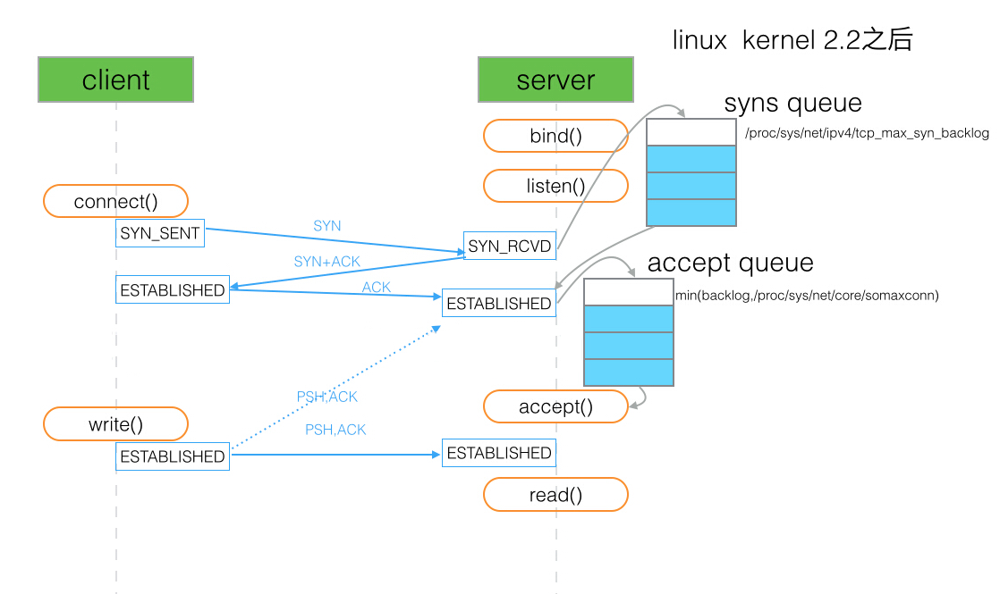
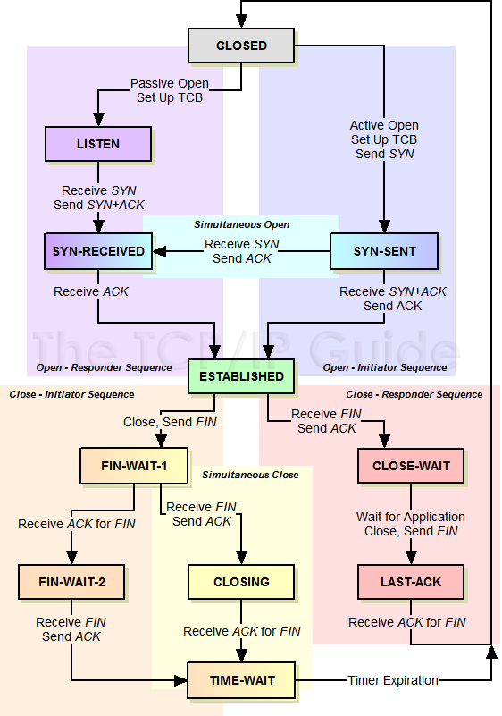

# JS 基础问题

## 简述

与前端 Js 不同, 后端方面除了SSR/爬虫之外很少会接触 DOM, 所以关于 DOM 方面的各种知识基本不会讨论.浏览器端除了图形业务外很少碰到内存问题, 但是后端几乎是直面服务器内存的, 更加偏向内存方面, 对于一些更基础的问题也会更加关注.

## 类型判断

看 [lodash](https://github.com/lodash/lodash)

## 作用域

看 《你不知道的js》

## 引用传递

> js 中什么类型是引用传递, 什么类型是值传递? 如何将值类型的变量以引用的方式传递?

简单点说, 对象是引用传递, 基础类型是值传递, 通过将基础类型包装 (boxing) 可以以引用的方式传递.

引用传递和值传递是一个非常简单的问题, 也是理解 JavaScript 中的内存方面问题的一个基础. 如果不了解引用可能很难去看很多问题.

面试写代码的话, 可以通过 `如何编写一个 json 对象的拷贝函数` 等类似的问题来考察对引用的了解. 不过笔者偶尔会有恶趣味, 喜欢先问应聘者对于 == 的 === 的区别的了解. 然后再问 `[1]` == `[1]` 是 true 还是 false. 如果基础不好的同学可能会被自己对于 == 和 === 的结论影响然后得出错误的结论.

对于技术好的, 希望能直接反驳这个问题本身是有问题的, 比如讲清楚 JavaScript 中没有引用传递只是传递引用. 参见 Is JavaScript a pass-by-reference or pass-by-value language?. 虽然说是复杂版, 但是这些知识对于 3 年经验的同学真的应该是很简单的问题了.

另外如果简历中有写 C++, 则必问 `指针与引用的区别`.

## 内存释放

> JavaScript 中不同类型以及不同环境下变量的内存都是何时释放?

引用类型是在没有引用之后, 通过 v8 的 GC 自动回收, 值类型如果是处于闭包的情况下, 要等闭包没有引用才会被 GC 回收, 非闭包的情况下等待 v8 的新生代 (new space) 切换的时候回收.

与前端 Js 不同, 2年以上经验的 Node.js 一定要开始注意内存了, 不说对 v8 的 GC 有多了解, 基础的内存释放一定有概念了, 并且要开始注意内存泄漏的问题了.

你需要了解哪些操作一定会导致内存泄漏, 或者可以崩掉内存. 比如如下代码能否爆掉 V8 的内存?

```js
let arr = [];
while(true)
  arr.push(1);
```

然后上述代码与下方的情况有什么区别?

```js
let arr = [];
while(true)
  arr.push();
```

如果 push 的是 Buffer 情况又会有什么区别?

```js
let arr = [];
while(true)
  arr.push(new Buffer(1000));
```

思考完之后可以尝试找找别的情况如何爆掉 V8 的内存. 以及来聊聊内存泄漏?

```js
function out() {
  const bigData = new Buffer(100);
  inner = function () {
    void bigData;
  }
}
```

闭包会引用到父级函数中的变量，如果闭包未释放，就会导致内存泄漏。上面例子是 inner 直接挂在了 root 上，从而导致内存泄漏（bigData 不会释放）。详见 [如何分析 Node.js 中的内存泄漏](https://zhuanlan.zhihu.com/p/25736931)

对于一些高水平的同学, 要求能清楚的了解 V8 内存 GC 的机制, 懂得内存快照等 (之后会在调试/优化的小结中讨论) 了. 比如 V8 中不同类型的数据存储的位置, 在内存释放的时候不同区域的不同策略等等.

## ES6 新特性

看阮一峰的 [ECMAScript 6 入门](http://es6.ruanyifeng.com/)

比较简单的会问 let 与 var 的区别, 以及 `箭头函数` 与 `function` 的区别等等.

深入的话, es6 有太多细节可以深入了. 比如结合 `引用` 的知识点来询问 const 方面的知识. 结合 `{}` 的使用与缺点来谈 Set, Map 等. 比如私有化的问题与 symbol 等等.

其他像是闭包是什么? 这种问烂了问题已经感觉没必要问了, 取而代之的是询问闭包应用的场景更加合理. 比如说, 如果回答者通常使用闭包实现数据的私有, 那么可以接着问 es6 的一些新特性 (例如 class, symbol) 能否实现私有, 如果能的话那为什么要用闭包? 亦或者是什么闭包中的数据/私有化的数据的内存什么时候释放? 等等.

`...` 的使用上, 如何实现一个数组的去重 (使用 Set 可以加分).

> const 定义的 Array 中间元素能否被修改? 如果可以, 那 const 修饰对象有什么意义?

其中的值可以被修改. 意义上, 主要保护引用不被修改 (如用 Map 等接口对引用的变化很敏感, 使用 const 保护引用始终如一是有意义的), 也适合用在 immutable 的场景.

# 模块

## 常见问题

> 如何在不重启 node 进程的情况下热更新一个 js/json 文件? 这个问题本身是否有问题?

可以清除掉 require.cache 的缓存重新 require(xxx), 视具体情况还可以用 VM 模块重新执行.

当然这个问题可能是典型的 X-Y Problem, 使用 js 实现热更新很容易碰到 v8 优化之后各地拿到缓存的引用导致热更新 js 没意义. 当然热更新 json 还是可以简单一点比如用读取文件的方式来热更新, 但是这样也不如从 redis 之类的数据库中读取比较合理.

## 简述

其他还有很多内容也是属于很 '基础' 的 Node.js 问题 (例如异步/线程等等), 但是由于归类的问题并没有放在这个分类中. 所以这里只简单讲几个之后没归类的基础问题.

## 模块机制

node 的基础中毫无疑问的应该是有关于模块机制的方面的, 也即 require 这个内置功能的一些原理的问题.

关于模块互相引用之类的, 不了解的推荐先好好读读官方文档.

其实官方文档已经说得很清楚了, 每个 node 进程只有一个 VM 的上下文, 不会跟浏览器相差多少, 模块机制在文档中也描述的非常清楚了:

```js
function require(...) {
  var module = { exports: {} };
  ((module, exports) => {
    // Your module code here. In this example, define a function.
    function some_func() {};
    exports = some_func;
    // At this point, exports is no longer a shortcut to module.exports, and
    // this module will still export an empty default object.
    module.exports = some_func;
    // At this point, the module will now export some_func, instead of the
    // default object.
  })(module, module.exports);
  return module.exports;
}
```

> 如果 a.js require 了 b.js, 那么在 b 中定义全局变量 t = 111 能否在 a 中直接打印出来?

每个 .js 能独立一个环境只是因为 node 帮你在外层包了一圈自执行, 所以你使用 t = 111 定义全局变量在其他地方当然能拿到. 情况如下:

```js
// b.js
(function (exports, require, module, __filename, __dirname) {
  t = 111;
})();

// a.js
(function (exports, require, module, __filename, __dirname) {
  // ...
  console.log(t); // 111
})();
```

> a.js 和 b.js 两个文件互相 require 是否会死循环? 双方是否能导出变量? 如何从设计上避免这种问题?

不会, 先执行的导出其未完成的副本, 通过导出工厂函数让对方从函数去拿比较好避免. 模块在导出的只是 var module = { exports: {...} }; 中的 exports, 以从 a.js 启动为例, a.js 还没执行完会返回一个 a.js 的 exports 对象的未完成的副本给 b.js 模块。 然后 b.js 完成加载，并将 exports 对象提供给 a.js 模块。

另外还有非常基础和常见的问题, 比如 module.exports 和 exports 的区别这里也能一并解决了 exports 只是 module.exports 的一个引用. 

再晋级一点, 众所周知, node 的模块机制是基于 CommonJS 规范的. 对于从前端转 node 的同学, 如果面试官想问的难一点会考查关于 CommonJS 的一些问题. 比如比较 AMD（提前执行、依赖前置）, CMD（延迟执行、依赖就近）, CommonJS 三者的区别, 包括询问关于 node 中 require 的实现原理等.

> node 中 require 的实现原理

require 命令是 CommonJS 规范之中，用来加载其他模块的命令。它其实不是一个全局命令，而是指向当前模块的 module.require 命令，而后者又调用 Node 的内部命令 Module._load。

```js
Module._load = function(request, parent, isMain) {
  // 1. 检查 Module._cache，是否缓存之中有指定模块
  // 2. 如果缓存之中没有，就创建一个新的 Module 实例
  // 3. 将它保存到缓存
  // 4. 使用 module.load() 加载指定的模块文件，
  //    读取文件内容之后，使用 module.compile() 执行文件代码
  // 5. 如果加载/解析过程报错，就从缓存删除该模块
  // 6. 返回该模块的 module.exports
};
```

上面的第 4 步，采用 module.compile() 执行指定模块的脚本，逻辑如下。

```js
Module.prototype._compile = function(content, filename) {
  // 1. 生成一个 require 函数，指向 module.require
  // 2. 加载其他辅助方法到 require
  // 3. 将文件内容放到一个函数之中，该函数可调用 require
  // 4. 执行该函数
};
```

上面的第 1 步和第 2 步，require 函数及其辅助方法主要如下。

1. require(): 加载外部模块
2. require.resolve()：将模块名解析到一个绝对路径
3. require.main：指向主模块
4. require.cache：指向所有缓存的模块
5. require.extensions：根据文件的后缀名，调用不同的执行函数

一旦 require 函数准备完毕，整个所要加载的脚本内容，就被放到一个新的函数之中，这样可以避免污染全局环境。该函数的参数包括 require、module、exports，以及其他一些参数。

```js
(function (exports, require, module, __filename, __dirname) {
  // YOUR CODE INJECTED HERE!
});
```

Module._compile 方法是同步执行的，所以 Module._load 要等它执行完成，才会向用户返回 module.exports 的值。

## 热更新

从面试官的角度看, 热更新是很多程序常见的问题. 对客户端而言, 热更新意味着不用换包, 当然也包含着 md5 校验/差异更新等复杂问题; 对服务端而言, 热更新意味着服务不用重启, 这样可用性较高同时也优雅和有逼格. 问的过程中可以一定程度的暴露应聘程序员的水平.

从 PHP 转 node 的同学可能会有些想法, 比如 PHP 的代码直接刷上去就好了, 并没有所谓的重启. 而 node 重启看起来动作还挺大. 当然这里面的区别, 主要是与同时有 PHP 与 node 开发经验的同学可以讨论, 也是很好的切入点.

在 Node.js 中做热更新代码, 牵扯到的知识点可能主要是 require 会有一个 cache, 有这个 cache 在, 即使你更新了 .js 文件, 在代码中再次 require 还是会拿到之前的编译好缓存在 v8 内存 (code space) 中的的旧代码. 但是如果只是单纯的清除掉 require 中的 cache, 再次 require 确实能拿到新的代码, 但是这时候很容易碰到各地维持旧的引用依旧跑的旧的代码的问题. 如果还要继续推行这种热更新代码的话, 可能要推翻当前的架构, 从头开始重新设计一下目前的框架.

不过热更新 json 之类的配置文件的话, 还是可以简单的实现的, 更新 require 的 cache 可以实现, 不会有持有旧引用的问题, 可以参见我 2 年前写着玩的[例子](https://www.npmjs.com/package/auto-reload), 但是如果旧的引用一直被持有很容易出现内存泄漏, 而要热更新配置的话, 为什么不存数据库? 或者用 zookeeper 之类的服务? 通过更新文件还要再发布一次, 但是存数据库直接写个接口配个界面多爽你说是不是?

所以这个问题其实本身其实是值得商榷的, 可能是典型的 X-Y Problem, 不过聊起来确实是可以暴露水平.

## 上下文

对于 Node.js 而言, 正常情况下只有一个上下文, 甚至于内置的很多方面例如 require 的实现只是在启动的时候运行了内置的函数.

每个单独的 .js 文件并不意味着单独的上下文, 在某个 .js 文件中污染了全局的作用域一样能影响到其他的地方.

而目前的 Node.js 将 VM 的接口暴露了出来, 可以让你自己创建一个新的 js 上下文, 这一点上跟前端 js 还是区别挺大的. 在执行外部代码的时候, 通过创建新的上下文沙盒 (sandbox) 可以避免上下文被污染:

```js
'use strict';
const vm = require('vm');

let code =
`(function(require) {

  const http = require('http');

  http.createServer( (request, response) => {
    response.writeHead(200, {'Content-Type': 'text/plain'});
    response.end('Hello World\\n');
  }).listen(8124);

  console.log('Server running at http://127.0.0.1:8124/');
})`;

vm.runInThisContext(code)(require);
```

这种执行方式与 eval 和 Function 有明显的区别. 关于 VM 更多的一些接口可以先阅读官方文档 VM (虚拟机)

讲完这个知识点, 这里留下一个简单的问题, 既然可以通过新的上下文来避免污染, 那么为什么 Node.js 不给每一个 .js 文件以独立的上下文来避免作用域被污染? 

> 为什么 Node.js 不给每一个 .js 文件以独立的上下文来避免作用域被污染?
 
node 中 require 的实现原理里面有说明，_compile 函数有调用 vm.runInThisContext 函数，即 Node.js 模块正常情况对作用域不会造成污染，意外创建全局变量是一种例外

# 事件/异步

## Promise

相信很多同学在面试的时候都碰到过这样一个问题, 如何处理 Callback Hell. 在早些年的时候, 大家会看到有很多的解决方案例如 Q, async, EventProxy 等等. 最后从流行程度来看 Promise 当之无愧的独领风骚, 并且是在 ES6 的 JavaScript 标准上赢得了支持.

关于它的基础知识/概念推荐看阮一峰的 Promise 对象 这里就不多不赘述.

> Promise 中 .then 的第二参数与 .catch 有什么区别?

```js
somePromise().then(function () {
  throw new Error('oh noes');
}).catch(function (err) {
  // I caught your error! :)
});

somePromise().then(function () {
  throw new Error('oh noes');
}, function (err) {
  // I didn't catch your error! :(
});
```

建议使用 catch

另外关于同步与异步, 有个问题希望大家看一下, 这是很简单的 Promise 的使用例子:

```js
let doSth = new Promise((resolve, reject) => {
  console.log('hello');
  resolve();
});

doSth.then(() => {
  console.log('over');
});
```

毫无疑问的可以得到以下输出结果:

```
hello
over
```

但是首先的问题是, 该 Promise 封装的代码肯定是同步的, 那么这个 then 的执行是异步的吗?（异步）

其次的问题是, 如下代码, setTimeout 到 10s 之后再 .then 调用, 那么 hello 是会在 10s 之后在打印吗, 还是一开始就打印?（hello 是会在 10s 之后在打印）

```js
let doSth = new Promise((resolve, reject) => {
  console.log('hello');
  resolve();
});

setTimeout(() => {
  doSth.then(() => {
    console.log('over');
  })
}, 10000);
```

以及理解如下代码的执行顺序

```js
setTimeout(function() {
  console.log(1)
}, 0);
new Promise(function executor(resolve) {
  console.log(2);
  for( var i=0 ; i<10000 ; i++ ) {
    i == 9999 && resolve();
  }
  console.log(3);
}).then(function() {
  console.log(4);
});
console.log(5);
```

```
2
3
5
4
1
```

## Events

Events 是 Node.js 中一个非常重要的 core 模块, 在 node 中有许多重要的 core API 都是依赖其建立的. 比如 Stream 是基于 Events 实现的, 而 fs, net, http 等模块都依赖 Stream, 所以 Events 模块的重要性可见一斑.

通过继承 EventEmitter 来使得一个类具有 node 提供的基本的 event 方法, 这样的对象可以称作 emitter, 而触发(emit)事件的 cb 则称作 listener. 与前端 DOM 树上的事件并不相同, emitter 的触发不存在冒泡, 逐层捕获等事件行为, 也没有处理事件传递的方法.

> Eventemitter 的 emit 是同步还是异步?

Node.js 中 Eventemitter 的 emit 是同步的. 

另外, 可以讨论如下的执行结果是输出 `hi 1` 还是 `hi 2`?

```js
const EventEmitter = require('events');

let emitter = new EventEmitter();

emitter.on('myEvent', () => {
  console.log('hi 1');
});

emitter.on('myEvent', () => {
  console.log('hi 2');
});

emitter.emit('myEvent');
```

```
hi 1
hi 2
```

或者如下情况是否会死循环?（会出现）

```js
const EventEmitter = require('events');

let emitter = new EventEmitter();

emitter.on('myEvent', () => {
  console.log('hi');
  emitter.emit('myEvent');
});

emitter.emit('myEvent');
```

以及这样会不会死循环?（不会出现，只是多了一个监听）

```js
const EventEmitter = require('events');

let emitter = new EventEmitter();

emitter.on('myEvent', function sth () {
  emitter.on('myEvent', sth);
  console.log('hi');
});

emitter.emit('myEvent');
```

使用 emitter 处理问题可以处理比较复杂的状态场景, 比如 TCP 的复杂状态机, 做多项异步操作的时候每一步都可能报错, 这个时候 .emit 错误并且执行某些 .once 的操作可以将你从泥沼中拯救出来.

另外可以注意一下的是, 有些同学喜欢用 emitter 来监控某些类的状态, 但是在这些类释放的时候可能会忘记释放 emitter, 而这些类的内部可能持有该 emitter 的 listener 的引用从而导致内存泄漏.

## 阻塞/异步

> 如何判断接口是否异步? 是否只要有回调函数就是异步?

开放性问题, 每个写 node 的人都有一套自己的判断方式.

- 看文档
- console.log 打印看看
- 看是否有 IO 操作

单纯使用回调函数并不会异步, IO 操作才可能会异步, 除此之外还有使用 setTimeout 等方式实现异步.

> 有这样一个场景, 你在线上使用 koa 搭建了一个网站, 这个网站项目中有一个你同事写的接口 A, 而 A 接口中在特殊情况下会变成死循环. 那么首先问题是, 如果触发了这个死循环, 会对网站造成什么影响?

Node.js 中执行 js 代码的过程是单线程的. 只有当前代码都执行完, 才会切入事件循环, 然后从事件队列中 pop 出下一个回调函数开始执行代码. 所以实现一个 sleep 函数, 只要通过一个死循环就可以阻塞整个 js 的执行流程. (关于如何避免坑爹的同事写出死循环, 在后面的测试环节有写到.)

> 如何实现一个 sleep 函数?

```js
function sleep(ms) {
  var start = Date.now(), expire = start + ms;
  while (Date.now() < expire) ;
  return;
}
```

而异步, 是使用 libuv 来实现的 (C/C++的同学可以参见 libev 和 libevent) 另一个线程里的事件队列.

如果在线上的网站中出现了死循环的逻辑被触发, 整个进程就会一直卡在死循环中, 如果没有多进程部署的话, 之后的网站请求全部会超时, js 代码没有结束那么事件队列就会停下等待不会执行异步, 整个网站无法响应.

> 如何实现一个异步的 reduce? (注:不是异步完了之后同步 reduce)

需要了解 reduce 的情况, 是第 n 个与 n + 1 的结果异步处理完之后, 在用新的结果与第 n + 2 个元素继续依次异步下去.

```js
// 当 await memo 不是最先出现时，所有的 sleep 并行执行，因为 await memo 使得函数等待上一个函数完成后执行
// utility function for sleeping
const sleep = (n) => new Promise((res) => setTimeout(res, n));

const arr = [1, 2, 3];
const startTime = new Date().getTime();
const asyncRes = await arr.reduce(async (memo, e) => {
 await sleep(2000);
 console.log(e)
 return (await memo) + e;
}, 0);

console.log(asyncRes, `Took ${new Date().getTime() - startTime} ms`);
```

```
1
2
3
6 "Took 2001 ms"
```

```js
// 当 await memo 最先出现时，这些函数按顺序运行，所有的 sleep 串行执行
const sleep = (n) => new Promise((res) => setTimeout(res, n));
const arr = [1, 2, 3];

const startTime = new Date().getTime();

const asyncRes = await arr.reduce(async (memo, e) => {
 await memo;
 await sleep(2000);
  console.log(e)
 return (await memo) + e;
}, 0);

console.log(asyncRes, `Took ${new Date().getTime() - startTime} ms`);
```

```
1
2
3
6 "Took 6003 ms"
```

## Timers

在笔者这里将 Node.js 中的异步简单的划分为两种, 硬异步和软异步.

硬异步是指由于 IO 操作或者外部调用走 libuv 而需要异步的情况. 当然, 也存在 readFileSync, execSync 等例外情况, 不过 node 由于是单线程的, 所以如果常规业务在普通时段执行可能比较耗时同步的 IO 操作会使得其执行过程中其他的所有操作都不能响应, 有点作死的感觉. 不过在启动/初始化以及一些工具脚本的应用场景下是完全没问题的. 而一般的场景下 IO 操作都是需要异步的.

软异步是指, 通过 setTimeout 等方式来实现的异步. 

> 关于 nextTick, setTimeout 以及 setImmediate 三者的区别

setImmediate vs process.nextTick

- setImmediate() 属于 check 观察者，其设置的回调函数，会插入到下次事件循环的末尾。
- process.nextTick() 设置的回调函数，会在代码运行完成后立即执行，会在下次事件循环之前被调用，原文是 “the callback will fire as soon as the code runs to completion, but before going back to the event loop.”
- process.nextTick() 所设置的回调函数会存放到数组中，一次性执行所有回调函数。
- setImmediate() 所设置的回调函数会存到到链表中，每次事件循环只执行链表中的一个回调函数。

setTimeout(fn, 0) vs setImmediate

执行 setTimeout(fn, 0) 其实就是在执行 setTimeout(fn, 1)，也就是说 setImmediate() 是有可能先于 setTimeout(fn, 0) 执行的。

**Event loop 示例**

```
   ┌───────────────────────┐
┌─>│        timers         │
│  └──────────┬────────────┘
│  ┌──────────┴────────────┐
│  │     I/O callbacks     │
│  └──────────┬────────────┘
│  ┌──────────┴────────────┐
│  │     idle, prepare     │
│  └──────────┬────────────┘      ┌───────────────┐
│  ┌──────────┴────────────┐      │   incoming:   │
│  │         poll          │<─────┤  connections, │
│  └──────────┬────────────┘      │   data, etc.  │
│  ┌──────────┴────────────┐      └───────────────┘
│  │        check          │
│  └──────────┬────────────┘
│  ┌──────────┴────────────┐
└──┤    close callbacks    │
   └───────────────────────┘
```

关于事件循环, Timers 以及 nextTick 的关系详见官方文档 The Node.js Event Loop, Timers, and process.nextTick()，[论坛中文讨论](https://cnodejs.org/topic/57d68794cb6f605d360105bf)

## 并行/并发

并行 (Parallel) 与并发 (Concurrent) 是两个很常见的概念.


并发 (Concurrent) = 2 队列对应 1 咖啡机.

并行 (Parallel) = 2 队列对应 2 咖啡机.

Node.js 通过事件循环来挨个抽取事件队列中的一个个 Task 执行, 从而避免了传统的多线程情况下 `2个队列对应 1个咖啡机` 的时候上下文切换以及资源争抢/同步的问题, 所以获得了高并发的成就.

至于在 node 中并行, 你可以通过 cluster 来再添加一个咖啡机.

# 进程

## 简述

关于 Process, 我们需要讨论的是两个概念：操作系统的进程、Node.js 中的 Process 对象. 操作进程对于服务端而言, 好比 html 之于前端一样基础. 想做服务端编程是不可能绕过 Unix/Linux 的. 在 Linux/Unix/Mac 系统中运行 ps -ef 命令可以看到当前系统中运行的进程. 各个参数如下:

|列名称|意义|
|-----|---|
|UID|执行该进程的用户ID|
|PID|进程编号|
|PPID|该进程的父进程编号|
|C|该进程所在的CPU利用率|
|STIME|进程执行时间|
|TTY|进程相关的终端类型|
|TIME|进程所占用的CPU时间|
|CMD|创建该进程的指令|

关于进程以及操作系统一些更深入的细节推荐阅读 APUE, 即《Unix 高级编程》等书籍来了解.

## Process

这里来讨论 Node.js 中的 process 对象. 直接在代码中通过 console.log(process) 即可打印出来. 可以看到 process 对象暴露了非常多有用的属性以及方法, 具体的细节见[官方文档](https://nodejs.org/dist/latest-v6.x/docs/api/process.html), 已经说的挺详细了. 其中包括但不限于:

- 进程基础信息
- 进程 Usage
- 进程级事件
- 依赖模块/版本信息
- OS 基础信息
- 账户信息
- 信号收发
- 三个标准流

### process.nextTick

上一节已经提到过 process.nextTick 了, 这是一个你需要了解的, 重要的, 基础方法.

```
   ┌───────────────────────┐
┌─>│        timers         │
│  └──────────┬────────────┘
│  ┌──────────┴────────────┐
│  │     I/O callbacks     │
│  └──────────┬────────────┘
│  ┌──────────┴────────────┐
│  │     idle, prepare     │
│  └──────────┬────────────┘      ┌───────────────┐
│  ┌──────────┴────────────┐      │   incoming:   │
│  │         poll          │<─────┤  connections, │
│  └──────────┬────────────┘      │   data, etc.  │
│  ┌──────────┴────────────┐      └───────────────┘
│  │        check          │
│  └──────────┬────────────┘
│  ┌──────────┴────────────┐
└──┤    close callbacks    │
   └───────────────────────┘
```

process.nextTick 并不属于 Event loop 中的某一个阶段, 而是在 Event loop 的每一个阶段结束后, 直接执行 nextTickQueue 中插入的 "Tick", 并且直到整个 Queue 处理完. 所以面试时又有可以问的问题了, 递归调用 process.nextTick 会怎么样? 

```js
function test() { 
  process.nextTick(() => test());
}
```

超过 1000 次会提示调用栈过多

这种情况与以下情况, 有什么区别? 为什么?

```js
function test() { 
  setTimeout(() => test(), 0);
}
```

- process.nextTick 是将异步回调放到当前帧的末尾、io 回调之前，如果 nextTick 过多，会导致 io 回调不断延后,最后 callback 堆积太多.
- setImmediate 是将异步回调放到下一帧，不影响 io 回调，不会造成 callback 堆积.
- process.nextTick() 所设置的回调函数会存放到数组中，一次性执行所有回调函数。
- setImmediate() 所设置的回调函数会存到到链表中，每次事件循环只执行链表中的一个回调函数。

### 配置

配置是开发部署中一个很常见的问题，普通的配置有两种方式，一是定义配置文件，二是使用环境变量


你可以通过设置环境变量来指定配置, 然后通过 process.env 来获取配置项. 另外也可以通过读取定义好的配置文件来获取, 在这方面有很多不错的库例如 dotenv, node-config 等, 而在使用这些库来加载配置文件的时候, 通常都会碰到一个当前工作目录的问题

> 进程的当前工作目录是什么? 有什么作用?

当前进程启动的目录, 通过 process.cwd() 获取当前工作目录 (current working directory), 通常是命令行启动的时候所在的目录 (也可以在启动时指定), 文件操作等使用相对路径的时候会相对当前工作目录来获取文件.

一些获取配置的第三方模块就是通过你的当前目录来找配置文件的. 所以如果你错误的目录启动脚本, 可能没法得到正确的结果. 在程序中可以通过 process.chdir() 来改变当前的工作目录.

### 标准流

在 process 对象上还暴露了 process.stderr, process.stdout 以及 process.stdin 三个标准流, 熟悉 C/C++/Java 的同学应该对此比较熟悉. 关于这几个流, 常见的面试问题是问 console.log 是同步还是异步? 如何实现一个 console.log?

如果简历中有出现 C/C++ 关键字, 一般都会问到如何实现一个同步的输入 (类似实现 C 语言的 scanf, C++ 的 cin, Python 的 raw_input 等).

### 维护方面

熟悉与进程有关的基础命令, 如 top, ps, pstree 等命令

## Child Process

子进程 (Child Process) 是进程中一个重要的概念. 你可以通过 Node.js 的 child_process 模块来执行可执行文件, 调用命令行命令, 比如其他语言的程序等. 也可以通过该模块来将 .js 代码以子进程的方式启动. 比较有名的网易的分布式架构 pomelo 就是基于该模块 (而不是 cluster) 来实现多进程分布式架构的.

> child_process.fork 与 POSIX 的 fork 有什么区别?

Node.js 的 child_process.fork() 在 Unix 上的实现最终调用了 POSIX [fork(2)](http://man7.org/linux/man-pages/man2/fork.2.html), 而 POSIX 的 fork 需要手动管理子进程的资源释放 (waitpid), child_process.fork 则不用关心这个问题, Node.js 会自动释放, 并且可以在 option 中选择父进程死后是否允许子进程存活.

- spawn() 启动一个子进程来执行命令
  - options.detached 父进程死后是否允许子进程存活
  - options.stdio 指定子进程的三个标准流
- spawnSync() 同步版的 spawn, 可指定超时, 返回的对象可获得子进程的情况
- exec() 启动一个子进程来执行命令, 带回调参数获知子进程的情况, 可指定进程运行的超时时间
- execSync() 同步版的 exec(), 可指定超时, 返回子进程的输出 (stdout)
- execFile() 启动一个子进程来执行一个可执行文件, 可指定进程运行的超时时间
- execFileSync() 同步版的 execFile(), 返回子进程的输出, 如何超时或者 exit code 不为 0, 会直接 throw Error
- fork() 加强版的 spawn(), 返回值是 ChildProcess 对象可以与子进程交互

其中 exec/execSync 方法会直接调用 bash 来解释命令, 所以如果有命令有外部参数, 则需要注意被注入的情况.

### child.kill 与 child.send

常见会问的面试题, 如 child.kill 与 child.send 的区别. 二者一个是基于信号系统, 一个是基于 IPC.

> 父进程或子进程的死亡是否会影响对方? 什么是孤儿进程?

子进程死亡不会影响父进程, 不过子进程死亡时（线程组的最后一个线程，通常是“领头”线程死亡时），会向它的父进程发送死亡信号. 反之父进程死亡, 一般情况下子进程也会随之死亡, 但如果此时子进程处于可运行态、僵死状态等等的话, 子进程将被进程1（init 进程）收养，从而成为孤儿进程. 另外, 子进程死亡的时候（处于“终止状态”），父进程没有及时调用 wait() 或 waitpid() 来返回死亡进程的相关信息，此时子进程还有一个 PCB 残留在进程表中，被称作僵尸进程.

## Cluster

Cluster 是常见的 Node.js 利用多核的办法. 它是基于 child_process.fork() 实现的, 所以 cluster 产生的进程之间是通过 IPC 来通信的, 并且它也没有拷贝父进程的空间, 而是通过加入 cluster.isMaster 这个标识, 来区分父进程以及子进程, 达到类似 POSIX 的 fork 的效果.

```js
const cluster = require('cluster');            // | | 
const http = require('http');                  // | | 
const numCPUs = require('os').cpus().length;   // | |    都执行了
                                               // | | 
if (cluster.isMaster) {                        // |-|-----------------
  // Fork workers.                             //   | 
  for (var i = 0; i < numCPUs; i++) {          //   | 
    cluster.fork();                            //   | 
  }                                            //   | 仅父进程执行 (a.js)
  cluster.on('exit', (worker) => {             //   | 
    console.log(`${worker.process.pid} died`); //   | 
  });                                          //   |
} else {                                       // |-------------------
  // Workers can share any TCP connection      // | 
  // In this case it is an HTTP server         // | 
  http.createServer((req, res) => {            // | 
    res.writeHead(200);                        // |   仅子进程执行 (b.js)
    res.end('hello world\n');                  // | 
  }).listen(8000);                             // | 
}                                              // |-------------------
                                               // | |
console.log('hello');                          // | |    都执行了
```

在上述代码中 numCPUs 虽然是全局变量但是, 在父进程中修改它, 子进程中并不会改变, 因为父进程与子进程是完全独立的两个空间. 他们所谓的共有仅仅只是都执行了, 并不是同一份.

你可以把父进程执行的部分当做 a.js, 子进程执行的部分当做 b.js, 你可以把他们想象成是先执行了 node a.js 然后 cluster.fork 了几次, 就执行了几次 node b.js. 而 cluster 模块则是二者之间的一个桥梁, 你可以通过 cluster 提供的方法, 让其二者之间进行沟通交流.

### How It Works

worker 进程是由 child_process.fork() 方法创建的, 所以可以通过 IPC 在主进程和子进程之间相互传递服务器句柄.

cluster 模块提供了两种分发连接的方式.

第一种方式 (默认方式, 不适用于 windows), 通过时间片轮转法（round-robin）分发连接. 主进程监听端口, 接收到新连接之后, 通过时间片轮转法来决定将接收到的客户端的 socket 句柄传递给指定的 worker 处理. 至于每个连接由哪个 worker 来处理, 完全由内置的循环算法决定.

第二种方式是由主进程创建 socket 监听端口后, 将 socket 句柄直接分发给相应的 worker, 然后当连接进来时, 就直接由相应的 worker 来接收连接并处理.

使用第二种方式时理论上性能应该较高, 然而时间上存在负载不均衡的问题, 比如通常 70% 的连接仅被 8 个进程中的 2 个处理, 而其他进程比较清闲.

## 进程间通信

IPC (Inter-process communication) 进程间通信技术. 常见的进程间通信技术列表如下:

类型|无连接|可靠|流控制|优先级
---|-----|----|-----|-----
普通PIPE|N|Y|Y|N
命名PIPE|N|Y|Y|N
消息队列|N|Y|Y|N
信号量|N|Y|Y|Y
共享存储|N|Y|Y|Y
UNIX流SOCKET|N|Y|Y|N
UNIX数据包SOCKET|Y|Y|N|N

Node.js 中的 IPC 通信是由 libuv 通过管道技术实现的, 在 windows 下由命名管道（named pipe）实现也就是上表中的最后第二个, *nix 系统则采用 UDS (Unix Domain Socket) 实现.

普通的 socket 是为网络通讯设计的, 而网络本身是不可靠的, 而为 IPC 设计的 socket 则不然, 因为默认本地的网络环境是可靠的, 所以可以简化大量不必要的 encode/decode 以及计算校验等, 得到效率更高的 UDS 通信.

如果了解 Node.js 的 IPC 的话, 可以问个比较有意思的问题

> 在 IPC 通道建立之前, 父进程与子进程是怎么通信的? 如果没有通信, 那 IPC 是怎么建立的?

这个问题也挺简单, 只是个思路的问题. 在通过 `child_process` 建立子进程的时候, 是可以指定子进程的 env (环境变量) 的. 所以 Node.js 在启动子进程的时候, 主进程先建立 IPC 频道, 然后将 IPC 频道的 fd (文件描述符) 通过环境变量 (`NODE_CHANNEL_FD`) 的方式传递给子进程, 然后子进程通过 fd 连上 IPC 与父进程建立连接.

最后于进程间通信 (IPC) 的问题, 一般不会直接问 IPC 的实现, 而是会问什么情况下需要 IPC, 以及使用 IPC 处理过什么业务场景等.

## 守护进程

最后的守护进程, 是服务端方面一个很基础的概念了. 很多人可能只知道通过 pm2 之类的工具可以将进程以守护进程的方式启动, 却不了解什么是守护进程, 为什么要用守护进程. 对于水平好的同学, 我们是希望能了解守护进程的实现的.

普通的进程, 在用户退出终端之后就会直接关闭. 通过 & 启动到后台的进程, 之后会由于会话（session 组）被回收而终止进程. 守护进程是不依赖终端（tty）的进程, 不会因为用户退出终端而停止运行的进程.

```c
// 守护进程实现 (C语言版本)
void init_daemon()
{
    pid_t pid;
    int i = 0;

    if ((pid = fork()) == -1) {
        printf("Fork error !\n");
        exit(1);
    }

    if (pid != 0) {
        exit(0);        // 父进程退出
    }

    setsid();           // 子进程开启新会话, 并成为会话首进程和组长进程
    if ((pid = fork()) == -1) {
        printf("Fork error !\n");
        exit(-1);
    }
    if (pid != 0) {
        exit(0);        // 结束第一子进程, 第二子进程不再是会话首进程
                        // 避免当前会话组重新与tty连接
    }
    chdir("/tmp");      // 改变工作目录
    umask(0);           // 重设文件掩码
    for (; i < getdtablesize(); ++i) {
       close(i);        // 关闭打开的文件描述符
    }

    return;
}
```

```js
var spawn = require('child_process').spawn;
var process = require('process');

var p = spawn('node',['b.js'],{
        detached : true
    });
console.log(process.pid, p.pid);
process.exit(0);
```

# IO

## 简述

Node.js 是以 IO 密集型业务著称. 那么问题来了, 你真的了解什么叫 IO, 什么又叫 IO 密集型业务吗?

## Buffer

Buffer 是 Node.js 中用于处理二进制数据的类, 其中与 IO 相关的操作 (网络/文件等) 均基于 Buffer. Buffer 类的实例非常类似整数数组, 但其大小是固定不变的, 并且其内存在 V8 堆栈外分配原始内存空间. Buffer 类的实例创建之后, 其所占用的内存大小就不能再进行调整.

在 Node.js v6.x 之后 new Buffer() 接口开始被废弃, 理由是参数类型不同会返回不同类型的 Buffer 对象, 所以当开发者没有正确校验参数或没有正确初始化 Buffer 对象的内容时, 以及不了解的情况下初始化 就会在不经意间向代码中引入安全性和可靠性问题.

接口|用途
---|---
Buffer.from()|根据已有数据生成一个 Buffer 对象
Buffer.alloc()|创建一个初始化后的 Buffer 对象
Buffer.allocUnsafe()|创建一个未初始化的 Buffer 对象

### TypedArray

Node.js 的 Buffer 在 ES6 增加了 TypedArray 类型之后, 修改了原来的 Buffer 的实现, 选择基于 TypedArray 中 Uint8Array 来实现, 从而提升了一波性能.

使用上, 你需要了解如下情况:

```js
const arr = new Uint16Array(2);
arr[0] = 5000;
arr[1] = 4000;

const buf1 = Buffer.from(arr); // 拷贝了该 buffer
const buf2 = Buffer.from(arr.buffer); // 与该数组共享了内存

console.log(buf1);
// 输出: <Buffer 88 a0>, 拷贝的 buffer 只有两个元素
console.log(buf2);
// 输出: <Buffer 88 13 a0 0f>

arr[1] = 6000;
console.log(buf1);
// 输出: <Buffer 88 a0>
console.log(buf2);
// 输出: <Buffer 88 13 70 17>
```

## String Decoder

字符串解码器 (String Decoder) 是一个用于将 Buffer 拿来 decode 到 string 的模块, 是作为 Buffer.toString 的一个补充, 它支持多字节 UTF-8 和 UTF-16 字符. 例如

```js
const StringDecoder = require('string_decoder').StringDecoder;
const decoder = new StringDecoder('utf8');

const cent = Buffer.from([0xC2, 0xA2]);
console.log(decoder.write(cent)); // ¢

const euro = Buffer.from([0xE2, 0x82, 0xAC]);
console.log(decoder.write(euro)); // €
```

stringDecoder.write 会确保返回的字符串不包含 Buffer 末尾残缺的多字节字符，残缺的多字节字符会被保存在一个内部的 buffer 中用于下次调用 stringDecoder.write() 或 stringDecoder.end()。

```js
const StringDecoder = require('string_decoder').StringDecoder;
const decoder = new StringDecoder('utf8');

decoder.write(Buffer.from([0xE2]));
decoder.write(Buffer.from([0x82]));
console.log(decoder.end(Buffer.from([0xAC])));  // €
```

## Stream

Node.js 内置的 stream 模块是多个核心模块的基础. 但是流 (stream) 是一种很早之前流行的编程方式. 可以用大家比较熟悉的 C 语言来看这种流式操作:

```c
int copy(const char *src, const char *dest)
{
    FILE *fpSrc, *fpDest;
    char buf[BUF_SIZE] = {0};
    int lenSrc, lenDest;

    // 打开 src 的文件
    if ((fpSrc = fopen(src, "r")) == NULL)
    {
        printf("文件 '%s' 无法打开\n", src);
        return FAILURE;
    }

    // 打开 dest 的文件
    if ((fpDest = fopen(dest, "w")) == NULL)
    {
        printf("文件 '%s' 无法打开\n", dest);
        fclose(fpSrc);
        return FAILURE;
    }
    
    // 从 src 中读取 BUF_SIZE 长的数据到 buf 中
    while ((lenSrc = fread(buf, 1, BUF_SIZE, fpSrc)) > 0)
    {
        // 将 buf 中的数据写入 dest 中
        if ((lenDest = fwrite(buf, 1, lenSrc, fpDest)) != lenSrc)
        {
            printf("写入文件 '%s' 失败\n", dest);
            fclose(fpSrc);
            fclose(fpDest);
            return FAILURE;
        }
        // 写入成功后清空 buf
        memset(buf, 0, BUF_SIZE);
    }
  
    // 关闭文件
    fclose(fpSrc);
    fclose(fpDest);
    return SUCCESS;
}
```

应用的场景很简单, 你要拷贝一个 20G 大的文件, 如果你一次性将 20G 的数据读入到内存, 你的内存条可能不够用, 或者严重影响性能. 但是你如果使用一个 1MB 大小的缓存 (buf) 每次读取 1Mb, 然后写入 1Mb, 那么不论这个文件多大都只会占用 1Mb 的内存.

而在 Node.js 中, 原理与上述 C 代码类似, 不过在读写的实现上通过 libuv 与 EventEmitter 加上了异步的特性. 在 linux/unix 中你可以通过 | 来感受到流式操作.

### Stream 的类型

类|使用场景|重写方法
---|---|---
[Readable](https://github.com/substack/stream-handbook#readable-streams)|只读|_read
[Writable](https://github.com/substack/stream-handbook#writable-streams)|只写|_write
[Duplex](https://github.com/substack/stream-handbook#duplex)|读写|_read, _write
[Transform](https://github.com/substack/stream-handbook#transform)|操作被写入数据, 然后读出结果|_transform, _flush

### 对象模式

通过 Node API 创建的流, 只能够对字符串或者 buffer 对象进行操作. 但其实流的实现是可以基于其他的 JavaScript 类型(除了 null, 它在流中有特殊的含义)的. 这样的流就处在 "对象模式(objectMode)" 中.
在创建流对象的时候, 可以通过提供 `objectMode` 参数来生成对象模式的流. 试图将现有的流转换为对象模式是不安全的

### 缓冲区

Node.js 中 stream 的缓冲区, 以开头的 C 语言拷贝文件的代码为模板讨论, (抛开异步的区别看) 则是从 `src` 中读出数据到 `buf` 中后, 并没有直接写入 `dest` 中, 而是先放在一个比较大的缓冲区中, 等待写入(消费) `dest` 中. 即, 在缓冲区的帮助下可以使读与写的过程分离.

Readable 和 Writable 流都会将数据储存在内部的缓冲区中. 缓冲区可以分别通过 `writable._writableState.getBuffer()` 和 `readable._readableState.buffer` 来访问. 缓冲区的大小, 由构造 stream 时候的 `highWaterMark` 标志指定可容纳的 byte 大小, 对于 `objectMode` 的 stream, 该标志表示可以容纳的对象个数.

#### 可读流

当一个可读实例调用 `stream.push()` 方法的时候, 数据将会被推入缓冲区. 如果数据没有被消费, 即调用 `stream.read()` 方法读取的话, 那么数据会一直留在缓冲队列中. 当缓冲区中的数据到达 `highWaterMark` 指定的阈值, 可读流将停止从底层汲取数据, 直到当前缓冲的报备成功消耗为止.

#### 可写流

在一个在可写实例上不停地调用 writable.write(chunk) 的时候数据会被写入可写流的缓冲区. 如果当前缓冲区的缓冲的数据量低于 `highWaterMark` 设定的值, 调用 writable.write() 方法会返回 true (表示数据已经写入缓冲区), 否则当缓冲的数据量达到了阈值, 数据无法写入缓冲区 write 方法会返回 false, 直到 drain 事件触发之后才能继续调用 write 写入.

```js
// Write the data to the supplied writable stream one million times.
// Be attentive to back-pressure.
function writeOneMillionTimes(writer, data, encoding, callback) {
  let i = 1000000;
  write();
  function write() {
    var ok = true;
    do {
      i--;
      if (i === 0) {
        // last time!
        writer.write(data, encoding, callback);
      } else {
        // see if we should continue, or wait
        // don't pass the callback, because we're not done yet.
        ok = writer.write(data, encoding);
      }
    } while (i > 0 && ok);
    if (i > 0) {
      // had to stop early!
      // write some more once it drains
      writer.once('drain', write);
    }
  }
}
```

#### Duplex 与 Transform

Duplex 流和 Transform 流都是同时可读写的, 他们会在内部维持两个缓冲区, 分别对应读取和写入, 这样就可以允许两边同时独立操作, 维持高效的数据流. 比如说 net.Socket 是一个 Duplex 流, Readable 端允许从 socket 获取、消耗数据, Writable 端允许向 socket 写入数据. 数据写入的速度很有可能与消耗的速度有差距, 所以两端可以独立操作和缓冲是很重要的.

### pipe

stream 的 `.pipe()`, 将一个可写流附到可读流上, 同时将可写流切换到流模式, 并把所有数据推给可写流. 在 pipe 传递数据的过程中, `objectMode` 是传递引用, 非 `objectMode` 则是拷贝一份数据传递下去.

pipe 方法最主要的目的就是将数据的流动缓冲到一个可接受的水平, 不让不同速度的数据源之间的差异导致内存被占满. 关于 pipe 的实现参见 David Cai 的 [通过源码解析 Node.js 中导流（pipe）的实现](https://cnodejs.org/topic/56ba030271204e03637a3870)

## Console

[console.log 同步还是异步取决于与谁相连和`os`](https://nodejs.org/dist/latest-v6.x/docs/api/process.html#process_a_note_on_process_i_o). 不过一般情况下的实现都是如下 ([6.x 源代码](https://github.com/nodejs/node/blob/v6.x/lib/console.js#L42))，其中 `this._stdout` 默认是 `process.stdout`:

```js
// As of v8 5.0.71.32, the combination of rest param, template string
// and .apply(null, args) benchmarks consistently faster than using
// the spread operator when calling util.format.
Console.prototype.log = function(...args) {
  this._stdout.write(`${util.format.apply(null, args)}\n`);
};
```

自己实现一个 console.log 可以参考如下代码:

```js
let print = (str) => process.stdout.write(str + '\n');

print('hello world');
```

注意: 该代码并没有处理多参数, 也没有处理占位符 (即 util.format 的功能).

### console.log.bind(console) 问题

```js
// 源码出处 https://github.com/nodejs/node/blob/v6.x/lib/console.js
function Console(stdout, stderr) {
  // ... init ...

  // bind the prototype functions to this Console instance
  var keys = Object.keys(Console.prototype);
  for (var v = 0; v < keys.length; v++) {
    var k = keys[v];
    this[k] = this[k].bind(this);
  }
}
```

## File

“一切皆是文件”是 Unix/Linux 的基本哲学之一, 不仅普通的文件、目录、字符设备、块设备、套接字等在 Unix/Linux 中都是以文件被对待, 也就是说这些资源的操作对象均为 fd (文件描述符), 都可以通过同一套 system call 来读写. 在 linux 中你可以通过 ulimit 来对 fd 资源进行一定程度的管理限制.

Node.js 封装了标准 POSIX 文件 I/O 操作的集合. 通过 require('fs') 可以加载该模块. 该模块中的所有方法都有异步执行和同步执行两个版本. 你可以通过 fs.open 获得一个文件的文件描述符.

### 编码

// TODO

UTF8, GBK, es6 中对编码的支持, 如何计算一个汉字的长度

BOM

### stdio

stdio (standard input output) 标准的输入输出流, 即输入流 (stdin), 输出流 (stdout), 错误流 (stderr) 三者. 在 Node.js 中分别对应 `process.stdin` (Readable), `process.stdout` (Writable) 以及 `process.stderr` (Writable) 三个 stream.

输出函数是每个人在学习任何一门编程语言时所需要学到的第一个函数. 例如 C 语言的 `printf("hello, world!");` python/ruby 的 `print 'hello, world!'` 以及 JavaScript 中的 `console.log('hello, world!');`

以 C 语言的伪代码来看的话, 这类输出函数的实现思路如下:

```c
int printf(FILE *stream, 要打印的内容)
{
  // ...

  // 1. 申请一个临时内存空间
  char *s = malloc(4096);

  // 2. 处理好要打印的的内容, 其值存储在 s 中
  //      ...

  // 3. 将 s 上的内容写入到 stream 中
  fwrite(s, stream);

  // 4. 释放临时空间
  free(s);

  // ...
}
```

我们需要了解的是第 3 步, 其中的 stream 则是指 stdout (输出流). 实际上在 shell 上运行一个应用程序的时候, shell 做的第一个操作是 fork 当前 shell 的进程 (所以, 如果你通过 ps 去查看你从 shell 上启动的进程, 其父进程 pid 就是当前 shell 的 pid), 在这个过程中也把 shell 的 stdio 继承给了你当前的应用进程, 所以你在当前进程里面将数据写入到 stdout, 也就是写入到了 shell 的 stdout, 即在当前 shell 上显示了.

输入也是同理, 当前进程继承了 shell 的 stdin, 所以当你从 stdin 中读取数据时, 其实就获取到你在 shell 上输入的数据. (PS: shell 可以是 windows 下的 cmd, powershell, 也可以是 linux 下 bash 或者 zsh 等)

当你使用 ssh 在远程服务器上运行一个命令的时候, 在服务器上的命令输出虽然也是写入到服务器上 shell 的 stdout, 但是这个远程的 shell 是从 sshd 服务上 fork 出来的, 其 stdout 是继承自 sshd 的一个 fd, 这个 fd 其实是个 socket, 所以最终其实是写入到了一个 socket 中, 通过这个 socket 传输你本地的计算机上的 shell 的 stdout.

如果你理解了上述情况, 那么你也就能理解为什么守护进程需要关闭 stdio, 如果切到后台的守护进程没有关闭 stdio 的话, 那么你在用 shell 操作的过程中, 屏幕上会莫名其妙的多出来一些输出. 此处对应[守护进程](#守护进程)的 C 实现中的这一段:

```c
for (; i < getdtablesize(); ++i) {
  close(i);  // 关闭打开的 fd
}
```

Linux/unix 的 fd 都被设计为整型数字, 从 0 开始. 你可以尝试运行如下代码查看.

```
console.log(process.stdin.fd); // 0
console.log(process.stdout.fd); // 1
console.log(process.stderr.fd); // 2
```

在上一节中的 [在 IPC 通道建立之前, 父进程与子进程是怎么通信的? 如果没有通信, 那 IPC 是怎么建立的?](#childkill-与-childsend) 中使用环境变量传递 fd 的方法, 这么看起来就很直白了, 因为传递 fd 其实是直接传递了一个整型数字.

### 如何同步的获取用户的输入?

如果你理解了上述的内容, 那么放到 Node.js 中来看, 获取用户的输入其实就是读取 Node.js 进程中的输入流 (即 process.stdin 这个 stream) 的数据.

而要同步读取, 则是不用异步的 read 接口, 而是用同步的 readSync 接口去读取 stdin 的数据即可实现. 以下来自万能的 stackoverflow:

```js
/*
 * http://stackoverflow.com/questions/3430939/node-js-readsync-from-stdin
 * @mklement0
 */
var fs = require('fs');

var BUFSIZE = 256;
var buf = new Buffer(BUFSIZE);
var bytesRead;

module.exports = function() {
  var fd = ('win32' === process.platform) ? process.stdin.fd : fs.openSync('/dev/stdin', 'rs');
  bytesRead = 0;

  try {
    bytesRead = fs.readSync(fd, buf, 0, BUFSIZE);
  } catch (e) {
    if (e.code === 'EAGAIN') { // 'resource temporarily unavailable'
      // Happens on OS X 10.8.3 (not Windows 7!), if there's no
      // stdin input - typically when invoking a script without any
      // input (for interactive stdin input).
      // If you were to just continue, you'd create a tight loop.
      console.error('ERROR: interactive stdin input not supported.');
      process.exit(1);
    } else if (e.code === 'EOF') {
      // Happens on Windows 7, but not OS X 10.8.3:
      // simply signals the end of *piped* stdin input.
      return '';
    }
    throw e; // unexpected exception
  }

  if (bytesRead === 0) {
    // No more stdin input available.
    // OS X 10.8.3: regardless of input method, this is how the end 
    //   of input is signaled.
    // Windows 7: this is how the end of input is signaled for
    //   *interactive* stdin input.
    return '';
  }
  // Process the chunk read.

  var content = buf.toString(null, 0, bytesRead - 1);

  return content;
};
```

## Readline

`readline` 模块提供了一个用于从 Readble 的 stream (例如 process.stdin) 中一次读取一行的接口. 当然你也可以用来读取文件或者 net, http 的 stream, 比如:

```javascript
const readline = require('readline');
const fs = require('fs');

const rl = readline.createInterface({
  input: fs.createReadStream('sample.txt')
});

rl.on('line', (line) => {
  console.log(`Line from file: ${line}`);
});
```

实现上, realine 在读取 TTY 的数据时, 是通过 `input.on('keypress', onkeypress)` 时发现用户按下了回车键来判断是新的 line 的, 而读取一般的 stream 时, 则是通过缓存数据然后用正则 .test 来判断是否为 new line 的.

PS: 打个广告, 如果在编写脚本时, 不习惯这样异步获取输入, 想要同步获取同步的用户输入可以看一看这个 Node.js 版本类 C语言使用的 [scanf](https://github.com/Lellansin/node-scanf/) 模块 (支持 ts).

## REPL

Read-Eval-Print-Loop (REPL)

# Network

## Net

目前互联化的核心是建立在 TCP/IP 协议的基础上的, 这些协议将数据分割成小的数据包进行传输, 并且解决传输过程中各种各样复杂的问题. 关于协议的具体细节推荐阅读 W.Richard Stevens 的[《TCP/IP 详解 卷1：协议》](https://www.amazon.cn/TCP-IP%E8%AF%A6%E8%A7%A3%E5%8D%B71-%E5%8D%8F%E8%AE%AE-W-Richard-Stevens/dp/B00116OTVS/), 本文不做赘述, 只是列举一些常见的知识点, 新人推荐看[《图解TCP/IP》](https://www.amazon.cn/%E5%9B%BE%E4%B9%A6/dp/B00DMS9990/), 抓包工具推荐看[《Wireshark网络分析就这么简单》](https://www.amazon.cn/%E5%9B%BE%E4%B9%A6/dp/B00PB5QQ84/).

### 粘包

默认情况下, TCP 连接会启用延迟传送算法 (Nagle 算法), 在数据发送之前缓存他们. 如果短时间有多个数据发送, 会缓冲到一起作一次发送 (缓冲大小见 `socket.bufferSize`), 这样可以减少 IO 消耗提高性能.

如果是传输文件的话, 那么根本不用处理粘包的问题, 来一个包拼一个包就好了. 但是如果是多条消息, 或者是别的用途的数据那么就需要处理粘包.

可以参见网上流传比较广的一个例子, 连续调用两次 send 分别发送两段数据 data1 和 data2, 在接收端有以下几种常见的情况:

* A. 先接收到 data1, 然后接收到 data2 .
* B. 先接收到 data1 的部分数据, 然后接收到 data1 余下的部分以及 data2 的全部.
* C. 先接收到了 data1 的全部数据和 data2 的部分数据, 然后接收到了 data2 的余下的数据.
* D. 一次性接收到了 data1 和 data2 的全部数据.

其中的 BCD 就是我们常见的粘包的情况. 而对于处理粘包的问题, 常见的解决方案有:

* 1. 多次发送之前间隔一个等待时间
* 2. 关闭 Nagle 算法
* 3. 进行封包/拆包

***方案1***

只需要等上一段时间再进行下一次 send 就好, 适用于交互频率特别低的场景. 缺点也很明显, 对于比较频繁的场景而言传输效率实在太低. 不过几乎不用做什么处理.

***方案2***

关闭 Nagle 算法, 在 Node.js 中你可以通过 [`socket.setNoDelay()`](https://nodejs.org/dist/latest-v6.x/docs/api/net.html#net_socket_setnodelay_nodelay) 方法来关闭 Nagle 算法, 让每一次 send 都不缓冲直接发送.

该方法比较适用于每次发送的数据都比较大 (但不是文件那么大), 并且频率不是特别高的场景. 如果是每次发送的数据量比较小, 并且频率特别高的, 关闭 Nagle 纯属自废武功.

另外, 该方法不适用于网络较差的情况, 因为 Nagle 算法是在服务端进行的包合并情况, 但是如果短时间内客户端的网络情况不好, 或者应用层由于某些原因不能及时将 TCP 的数据 recv, 就会造成多个包在客户端缓冲从而粘包的情况. (如果是在稳定的机房内部通信那么这个概率是比较小可以选择忽略的)

***方案3***

封包/拆包是目前业内常见的解决方案了. 即给每个数据包在发送之前, 于其前/后放一些有特征的数据, 然后收到数据的时候根据特征数据分割出来各个数据包.

### 可靠传输

为每一个发送的数据包分配一个序列号(SYN, Synchronize packet), 每一个包在对方收到后要返回一个对应的应答数据包(ACK, Acknowledgement), 发送方如果发现某个包没有被对方 ACK, 则会选择重发. 接收方通过 SYN 序号来保证数据的不会乱序(reordering), 发送方通过 ACK 来保证数据不缺漏, 以此参考决定是否重传. 关于具体的序号计算, 丢包时的重传机制等可以参见阅读陈皓的 [《TCP的那些事儿（上）》](http://coolshell.cn/articles/11564.html) 此处不做赘述.

### window

TCP 头里有一个 Window 字段, 是接收端告诉发送端自己还有多少缓冲区可以接收数据的. 发送端就可以根据接收端的处理能力来发送数据, 从而避免接收端处理不过来. 详细参见陈皓的 [《TCP的那些事儿（下）》](http://coolshell.cn/articles/11609.html)

> window 是否设置的越大越好?

类似木桶理论, 一个木桶能装多少水, 是由最短的那块木板决定的. 一个 TCP 连接的 window 是由该连接中间一连串设备中 window 最小的那一个设备决定的.

### backlog



关于该 backlog 的定义参见 [man](https://linux.die.net/man/2/listen) 手册:

> The behavior of the backlog argument on TCP sockets changed with Linux 2.2. Now it specifies the queue length for completely established sockets waiting to be accepted, instead of the number of incomplete connection requests.

backlog 用于设置客户端与服务端 `ESTABLISHED` 之后等待 accept 的队列长图 (如上图中的 accept queue). 如果 backlog 过小, 在并发连接大的情况下容易导致 accept queue 装满之后断开连接. 但是如果将这个队列设置的特别大, 那么假定连接数并发量是 65525, 以 php-fpm 的 qps 5000 为例, 处理完约耗时 13s, 而这段时间中连接可能早已被 nginx 或者客户端断开, 那么我们去 accept 这个 socket 时只会拿到一个 broken pipe (该例子出处见 [PHP 源码 Set FPM_BACKLOG_DEFAULT to 511](https://github.com/php/php-src/commit/ebf4ffc9354f316f19c839a114b26a564033708a)). 经过<del>我也不懂的</del>计算 backlog 的长度默认是 511.

另外提一句, 这个 backlog 是通过系统指定时是通过 `somaxconn` 参数来指定 accept queue 的. 而 `tcp_max_syn_backlog` 参数指定的是 SYN queue 的长度.

### 状态机



关于网络连接的建立以及断开, 存在着一个复杂的状态转换机制, 完整的状态表参见 [《The TCP/IP Guide》](http://www.tcpipguide.com/free/t_TCPOperationalOverviewandtheTCPFiniteStateMachineF-2.htm

state|简述
-----|---
CLOSED|连接关闭, 所有连接的初始状态
LISTEN|监听状态, 等待客户端发送 SYN
SYN-SENT|客户端发送了 SYN, 等待服务端回复
SYN-RECEIVED|双方都收到了 SYN, 等待 ACK
ESTABLISHED| SYN-RECEIVED 收到 ACK 之后, 状态切换为连接已建立.
CLOSE-WAIT|被动方收到了关闭请求(FIN)后, 发送 ACK, 如果有数据要发送, 则发送数据, 无数据发送则回复 FIN. 状态切换到 LAST-ACK
LAST-ACK|等待对方 ACK 当前设备的 CLOSE-WAIT 时发送的 FIN, 等到则切换 CLOSED
FIN-WAIT-1|主动方发送 FIN, 等待 ACK
FIN-WAIT-2|主动方收到被动方的 ACK, 等待 FIN
CLOSING|主动方收到了FIN, 却没收到 FIN-WAIT-1 时发的 ACK, 此时等待那个 ACK
TIME-WAIT|主动方收到 FIN, 返回收到对方 FIN 的 ACK, 等待对方是否真的收到了 ACK, 如果过一会又来一个 FIN, 表示对方没收到, 这时要再 ACK 一次

> `TIME_WAIT` 是什么情况? 出现过多的 `TIME_WAIT` 可能是什么原因?

`TIME_WAIT` 是连接的某一方 (可能是服务端也可能是客户端) 主动断开连接时, 四次挥手等待被断开的一方是否收到最后一次挥手 (ACK) 的状态. 如果在等待时间中, 再次收到第三次挥手 (FIN) 表示对方没收到最后一次挥手, 这时要再 ACK 一次. 这个等待的作用是避免出现连接混用的情况 (`prevent potential overlap with new connections` see [TCP Connection Termination](http://www.tcpipguide.com/free/t_TCPConnectionTermination.htm) for more).

出现大量的 `TIME_WAIT` 比较常见的情况是, 并发量大, 服务器在短时间断开了大量连接. 对应 HTTP server 的情况可能是没开启 `keepAlive`. 如果有开 `keepAlive`, 一般是等待客户端自己主动断开, 那么`TIME_WAIT` 就只存在客户端, 而服务端则是 `CLOSE_WAIT` 的状态, 如果服务端出现大量 `CLOSE_WAIT`, 意味着当前服务端建立的连接大面积的被断开, 可能是目标服务集群重启之类.

## UDP

> TCP/UDP 的区别? UDP 有粘包吗?

协议|连接性|双工性|可靠性|有序性|有界性|拥塞控制|传输速度|量级|头部大小
---|---|---|---|---|---|---|---|---|---
TCP|面向连接<br>(Connection oriented)|全双工(1:1)|可靠<br>(重传机制)|有序<br>(通过SYN排序)|无, 有[粘包情况](#粘包)|有|慢|低|20~60字节
UDP|无连接<br>(Connection less)|n:m|不可靠<br>(丢包后数据丢失)|无序|有消息边界, **无粘包**|无|快|高|8字节

UDP socket 支持 n 对 m 的连接状态, 在[官方文档](https://nodejs.org/dist/latest-v6.x/docs/api/dgram.html)中有写到在 `dgram.createSocket(options[, callback])` 中的 option 可以指定 `reuseAddr` 即 `SO_REUSEADDR` 标志. 通过 `SO_REUSEADDR` 可以简单的实现 n 对 m 的多播特性 (不过仅在支持多播的系统上才有).

### 常见的应用场景

<table>
  <tr><th>传输层协议</th><th>应用</th><th>应用层协议</th></tr>
  <tr><td rowspan="5">TCP</td><td>电子邮件</td><td>SMTP</td></tr>
  <tr><td>终端连接</td><td>TELNET</td></tr>
  <tr><td>终端连接</td><td>SSH</td></tr>
  <tr><td>万维网</td><td>HTTP</td></tr>
  <tr><td>文件传输</td><td>FTP</td></tr>
  <tr><td rowspan="8">UDP</td><td>域名解析</td><td>DNS</td></tr>
  <tr><td>简单文件传输</td><td>TFTP</td></tr>
  <tr><td>网络时间校对</td><td>NTP</td></tr>
  <tr><td>网络文件系统</td><td>NFS</td></tr>
  <tr><td>路由选择</td><td>RIP</td></tr>
  <tr><td>IP电话</td><td>-</td></tr>
  <tr><td>流式多媒体通信</td><td>-</td></tr>
</table>

简单的说, UDP 速度快, 开销低, 不用封包/拆包允许丢一部分数据, 监控统计/日志数据上报/流媒体通信等场景都可以用 UDP. 目前 Node.js 的项目中使用 UDP 比较流行的是 [StatsD](https://github.com/etsy/statsd) 监控服务.

## HTTP

目前世界上运行最良好的分布式集群, 莫过于当前的万维网 (http servers) 了. 目前前端工程师也都是靠 HTTP 协议吃饭的, 所以 2-3 年的前端同学都应该对 HTTP 有比较深的理解了, 所以这里不做太多的赘述. 推荐书籍[《图解HTTP》](https://www.amazon.cn/%E5%9B%BE%E4%B9%A6/dp/B00JTQK1L4/), 博客[HTTP 协议入门](http://www.ruanyifeng.com/blog/2016/08/http.html).

另外最近几年开始大家对 HTTP 的面试的考察也渐渐偏向[理解 RESTful 架构](http://www.ruanyifeng.com/blog/2011/09/restful.html). 简单的说, RESTful 是把每个 URI 当做资源 (Resources), 通过 method 作为动词来对资源做不同的动作, 然后服务器返回 status 来得知资源状态的变化 (State Transfer);

### method/status

因为 HTTP 的方法 (method) 与状态码 (status) 讲解太常见, 你可以使用如下代码打印出来自己看 Node.js 官方定义的, 完整的就不列举了.

```javascript
const http = require('http');

console.log(http.METHODS);
console.log(http.STATUS_CODES);
```

一个常见的 method 列表, 关于这些 method 在 RESTful 中的一些应用的详细可以参见[Using HTTP Methods for RESTful Services](http://www.restapitutorial.com/lessons/httpmethods.html)

methods|CRUD|幂等|缓存
---|---|---|---
GET|Read|✓|✓
POST|Create||
PUT|Update/Replace|✓
PATCH|Update/Modify||
DELETE|Delete|✓

> GET 和 POST 有什么区别?

网上有很多讲这个的, 比如从书签, url 等前端的角度去看他们的区别这里不赘述. 而从后端的角度看, 前两年出来一个 《GET 和 POST 没有区别》(出处不好考究, 就没贴了) 的文章比较有名, 早在我刚学 PHP 的时候也有过这种疑惑, 刚学 Node 的时候发现不能像 PHP 那样同时处理 GET 和 POST 的时候还很不适应. 后来接触 RESTful 才意识到, 这两个东西最根本的差别是语义, 引申了看, 协议 (protocol) 这种东西就是人与人之间协商的约定, 什么行为是什么作用都是"约定"好的, 而不是强制使用的, 非要把 GET 当 POST 这样不遵守约定的做法我们也爱莫能助.

跑题了, 简而言之, 讨论这二者的区别最好从 RESTful 提倡的语义角度来讲<del>比较符合当代程序员的逼格</del>比较合理.

> POST 和 PUT 有什么区别?

POST 是新建 (create) 资源, 非幂等, 同一个请求如果重复 POST 会新建多个资源. PUT 是 Update/Replace, 幂等, 同一个 PUT 请求重复操作会得到同样的结果.

### headers

HTTP headers 是在进行 HTTP 请求的交互过程中互相支会对方一些信息的主要字段. 比如请求 (Request) 的时候告诉服务端自己能接受的各项参数, 以及之前就存在本地的一些数据等. 详细各位可以参见 wikipedia:

* [Request fields](https://en.wikipedia.org/wiki/List_of_HTTP_header_fields#Request_fields)
* [Response fields](https://en.wikipedia.org/wiki/List_of_HTTP_header_fields#Response_fields)

> cookie 与 session 的区别? 服务端如何清除 cookie?

主要区别在于, session 存在服务端, cookie 存在客户端. session 比 cookie 更安全. 而且 cookie 不一定一直能用 (可能被浏览器关掉). 服务端可以通过设置 cookie 的值为空并设置一个及时的 expires 来清除存在客户端上的 cookie.

> 什么是跨域请求? 如何允许跨域?

出于安全考虑, 默认情况下使用 XMLHttpRequest 和 Fetch 发起 HTTP 请求必须遵守同源策略, 即只能向相同 host 请求 (host = hostname : port) 注[1]. 向不同 host 的请求被称作跨域请求 (cross-origin HTTP request). 可以通过设置 [CORS headers](https://developer.mozilla.org/en-US/docs/Glossary/CORS) 即 `Access-Control-Allow-` 系列来允许跨域. 例如:

```
location ~* ^/(?:v1|_) {
  if ($request_method = OPTIONS) { return 200 ''; }
  header_filter_by_lua '
    ngx.header["Access-Control-Allow-Origin"] = ngx.var.http_origin; # 这样相当于允许所有来源了
    ngx.header["Access-Control-Allow-Methods"] = "GET, POST, PUT, DELETE, PATCH, OPTIONS";
    ngx.header["Access-Control-Allow-Credentials"] = "true";
    ngx.header["Access-Control-Allow-Headers"] = "Content-Type";
  ';
  proxy_pass http://localhost:3001;
}
```

注[1]：同源除了相同 host 也包括相同协议. 所以即使 host 相同, 从 HTTP 到 HTTPS 也属于跨域, 见[讨论](https://github.com/ElemeFE/node-interview/issues/55).

> `Script error.` 是什么错误? 如何拿到更详细的信息?

接上题, 由于同源性策略 (CORS), 如果你引用的 js 脚本所在的域与当前域不同, 那么浏览器会把 onError 中的 msg 替换为 `Script error.` 要拿到详细错误的方法, 处理配好 `Access-Control-Allow-Origin` 还有在引用脚本的时候指定 `crossorigin` 例如:

```html
<script src="http://another-domain.com/app.js" crossorigin="anonymous"></script>
```

详见 [JavaScript Script Error.](https://sentry.io/answers/javascript-script-error/)


### Agent

Node.js 中的 `http.Agent` 用于池化 HTTP 客户端请求的 socket (pooling sockets used in HTTP client requests). 也就是复用 HTTP 请求时候的 socket. 如果你没有指定 Agent 的话, 默认用的是 `http.globalAgent`.

另外, 目前在 Node.js 的 6.8.1（包括）到 6.10（不包括）版本中发现一个问题:

* 1. 你将 keepAlive 设置为 `true` 时, socket 有复用
* 2. 即使 keepAlive 没有设置成 `true` 但是长时间内有大量请求时, 同样有复用 socket (复用情况参见[@zcs19871221](https://github.com/zcs19871221)的[解析](https://github.com/zcs19871221/mydoc/blob/master/nodejsAgent.md))

1 和 2 这两种情况下, 一旦设置了 request timeout, 由于 socket 一直未销毁, 如果你在请求完成以后没有注意清除该事件, 会导致事件重复监听, 且该事件闭包引用了 req, 会导致内存泄漏.

如果有疑虑的话可以参见 Node 官方讨论的 [issue](https://github.com/nodejs/node/issues/9268) 以及引入此 bug 的 [commit](https://github.com/nodejs/node/blob/ee7af01b93cc46f1848f6962ad2d6c93f319341a/lib/_http_client.js#L565), 如果此处描述有疑问可以在本 repo 的 [issue](https://github.com/ElemeFE/node-interview/issues/19) 中指出.

### socket hang up

hang up 有挂断的意思, socket hang up 也可以理解为 socket 被挂断. 在 Node.js 中当你要 response 一个请求的时候, 发现该这个 socket 已经被 "挂断", 就会就会报 socket hang up 错误.

[Node.js 中源码的情况:](https://github.com/nodejs/node/blob/v6.x/lib/_http_client.js#L286)

```javascript
function socketCloseListener() {
  var socket = this;
  var req = socket._httpMessage;

  // Pull through final chunk, if anything is buffered.
  // the ondata function will handle it properly, and this
  // is a no-op if no final chunk remains.
  socket.read();

  // NOTE: It's important to get parser here, because it could be freed by
  // the `socketOnData`.
  var parser = socket.parser;
  req.emit('close');
  if (req.res && req.res.readable) {
    // Socket closed before we emitted 'end' below.
    req.res.emit('aborted');
    var res = req.res;
    res.on('end', function() {
      res.emit('close');
    });
    res.push(null);
  } else if (!req.res && !req.socket._hadError) {
    // This socket error fired before we started to
    // receive a response. The error needs to
    // fire on the request.
    req.emit('error', createHangUpError());  // <------------------- socket hang up
    req.socket._hadError = true;
  }

  // Too bad.  That output wasn't getting written.
  // This is pretty terrible that it doesn't raise an error.
  // Fixed better in v0.10
  if (req.output)
    req.output.length = 0;
  if (req.outputEncodings)
    req.outputEncodings.length = 0;

  if (parser) {
    parser.finish();
    freeParser(parser, req, socket);
  }
}
```

典型的情况是用户使用浏览器, 请求的时间有点长, 然后用户简单的按了一下 F5 刷新页面. 这个操作会让浏览器取消之前的请求, 然后导致服务端 throw 了一个 socket hang up.

详见万能的 stackoverflow: [NodeJS - What does “socket hang up” actually mean?](http://stackoverflow.com/questions/16995184/nodejs-what-does-socket-hang-up-actually-mean)

## DNS

早期可以用 TCP/IP 通信之后, 有一个比较蛋疼的问题, 就是 ip 都是一串比较长的数字, 比较难记, 于是大家想了个办法, 给每个 ip 取个好记一点的名字比如 `Alan -> 192.168.0.11` 这样只需要记住好记的名字即可, 随着这个名字的规范化最终变成了今天的域名 (Domain name), 而帮助别人记录这个名字的服务就叫域名解析服务 (Domain Name Service).

DNS 服务主要基于 UDP, 这里简单介绍 Node.js 实现的接口中的两个方法:

方法|功能|同步|网络请求|速度
---|---|---|---|---
.lookup(hostname[, options], cb)|通过系统自带的 DNS 缓存 (如 `/etc/hosts`)|同步|无|快
.resolve(hostname[, rrtype], cb)|通过系统配置的 DNS 服务器指定的记录 (rrtype指定)|异步|有|慢

> DNS 模块中 .lookup 与 .resolve 的区别?

当你要解析一个域名的 ip 时, 通过 .lookup 查询直接调用 `getaddrinfo` 来拿取地址, 速度很快, 但是如果本地的 hosts 文件被修改了, .lookup 就会拿 hosts 文件中的地方, 而 .resolve 依旧是外部正常的地址.

由于 .lookup 是同步的, 所以如果由于什么不可控的原因导致 `getaddrinfo` 缓慢或者阻塞是会影响整个 Node 进程的, 参见[文档](https://nodejs.org/dist/latest-v6.x/docs/api/dns.html#dns_dns_lookup).

> hosts 文件是什么? 什么叫 DNS 本地解析?

hosts 文件是个没有扩展名的系统文件, 其作用就是将网址域名与其对应的 IP 地址建立一个关联“数据库”, 当用户在浏览器中输入一个需要登录的网址时, 系统会首先自动从 hosts 文件中寻找对应的IP地址. 

当我们访问一个域名时, 实际上需要的是访问对应的 IP 地址. 这时候, 获取 IP 地址的方式, 先是读取浏览器缓存, 如果未命中 => 接着读取本地 hosts 文件, 如果还是未命中 => 则向 DNS 服务器发送请求获取. 在向 DNS 服务器获取 IP 地址之前的行为, 叫做 DNS 本地解析.

## ZLIB

在网络传输过程中, 如果网速稳定的情况下, 对数据进行压缩, 压缩比率越大, 那么传输的效率就越高等同于速度越快了. zlib 模块提供了 Gzip/Gunzip, Deflate/Inflate 和 DeflateRaw/InflateRaw 等压缩方法的类, 这些类接收相同的参数, 都属于可读写的 Stream 实例.

TODO

## RPC

RPC (Remote Procedure Call Protocol) 基于 TCP/IP 来实现调用远程服务器的方法, 与 http 同属应用层. 常用于构建集群, 以及微服务 (推荐一本[《Node.js 微服务》](https://www.amazon.cn/%E5%9B%BE%E4%B9%A6/dp/B01MXY8ARP)<del>虽然我还没看完</del>)

常见的 RPC 方式:

* [Thrift](http://thrift.apache.org/)
* HTTP
* MQ

### Thrift

> **Thrift**是一种[接口描述语言](https://zh.wikipedia.org/wiki/%E6%8E%A5%E5%8F%A3%E6%8F%8F%E8%BF%B0%E8%AF%AD%E8%A8%80 "接口描述语言")和二进制通讯协议，它被用来定义和创建跨语言的服务。它被当作一个[远程过程调用](https://zh.wikipedia.org/wiki/%E8%BF%9C%E7%A8%8B%E8%BF%87%E7%A8%8B%E8%B0%83%E7%94%A8 "远程过程调用")（RPC）框架来使用，是由[Facebook](https://zh.wikipedia.org/wiki/Facebook "Facebook")为“大规模跨语言服务开发”而开发的。它通过一个代码生成引擎联合了一个软件栈，来创建不同程度的、无缝的[跨平台](https://zh.wikipedia.org/wiki/%E8%B7%A8%E5%B9%B3%E5%8F%B0 "跨平台")高效服务，可以使用[C#](https://zh.wikipedia.org/wiki/C%E2%99%AF "C♯")、[C++](https://zh.wikipedia.org/wiki/C%2B%2B "C++")（基于[POSIX](https://zh.wikipedia.org/wiki/POSIX "POSIX")兼容系统）、Cappuccino、[Cocoa](https://zh.wikipedia.org/wiki/Cocoa "Cocoa")、[Delphi](https://zh.wikipedia.org/wiki/Delphi "Delphi")、[Erlang](https://zh.wikipedia.org/wiki/Erlang "Erlang")、[Go](https://zh.wikipedia.org/wiki/Go "Go")、[Haskell](https://zh.wikipedia.org/wiki/Haskell "Haskell")、[Java](https://zh.wikipedia.org/wiki/Java "Java")、[Node.js](https://zh.wikipedia.org/wiki/Node.js "Node.js")、[OCaml](https://zh.wikipedia.org/wiki/OCaml "OCaml")、[Perl](https://zh.wikipedia.org/wiki/Perl "Perl")、[PHP](https://zh.wikipedia.org/wiki/PHP "PHP")、[Python](https://zh.wikipedia.org/wiki/Python "Python")、[Ruby](https://zh.wikipedia.org/wiki/Ruby "Ruby")和[Smalltalk](https://zh.wikipedia.org/wiki/Smalltalk "Smalltalk")。虽然它以前是由Facebook开发的，但它现在是[Apache软件基金会](https://zh.wikipedia.org/wiki/Apache%E8%BD%AF%E4%BB%B6%E5%9F%BA%E9%87%91%E4%BC%9A "Apache软件基金会")的[开源](https://zh.wikipedia.org/wiki/%E5%BC%80%E6%BA%90 "开源")项目了。该实现被描述在2007年4月的一篇由Facebook发表的技术论文中，该论文现由Apache掌管。

### HTTP

使用 HTTP 协议来进行 RPC 调用也是很常见的, 相比 TCP 连接, 通过通过 HTTP 的方式性能会差一些, 但是在使用以及调试上会简单一些. 近期比较有名的框架参见 [gRPC](http://www.grpc.io/):

> gRPC is an open source remote procedure call (RPC) system initially developed at Google. It uses HTTP/2 for transport, Protocol Buffers as the interface description language, and provides features such as authentication, bidirectional streaming and flow control, blocking or nonblocking bindings, and cancellation and timeouts. It generates cross-platform client and server bindings for many languages.

### MQ

使用消息队列 (Message Queue) 来进行 RPC 调用 (RPC over mq) 在业内有不少例子, 比较适合业务解耦/广播/限流等场景.

TODO

// TODO nodejs 未完待续，下一篇地址：https://github.com/ElemeFE/node-interview/blob/master/sections/zh-cn/network.md
