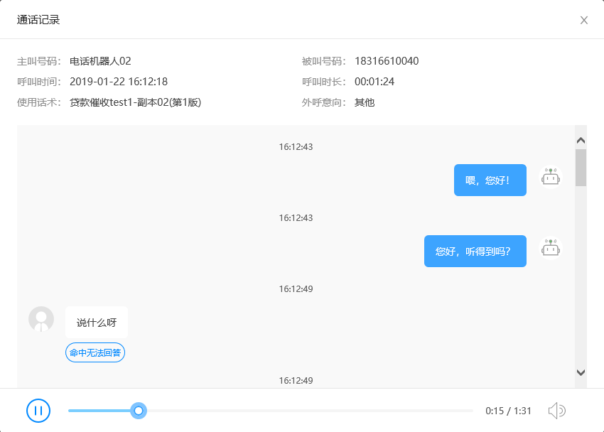

# 需求背景

解决 react-player 控件在 IE 浏览器下声音的播放

# 核心思路

ReactPlayer 底层调用了 audio 标签来播放音频，video 标签来播放视频，因为在 IE 浏览器下是没有 audio 标签的，所以使用了 embed 标签，其在 IE 下是调用 windows media player，关于其用法如下

## 功能

> 播放: MediaPlayer.Play()  
> 暂停: MediaPlayer.Pause()  
> 定位:  
>  - MediaPlayer.SetCurrentEntry(lWhichEntry)  
>  - MediaPlayer.Next()  
>  - MediaPlayer.Previous()  
>
>循环: MediaPlayer.PlayCount = 0  
>  - 0: the clip plays repeatedly  
>  - 1: once  
>
>停止: MediaPlayer.Stop()   

## 属性

> AllowChangeDisplaySize 返回或设置最终用户是否能设置显示尺寸(逻辑型)  
AllowScan 返回或设置是否允许扫描(逻辑型)  
AnimationAtStart 返回或设置控件开始播放之前是否先播放一个动画序列(逻辑型)  
AudioStream 返回或设置音频流的编号(用于多音频流的剪辑，默认为-1)(长整型)  
AutoRewind 返回或设置媒体文件播放完毕后是否自动回绕(逻辑型)  
AutoSize 返回或设置是否自动调整控件大小来适应载入的媒体(逻辑型)  
AutoStart 返回或设置在载入媒体文件之后是否自动开始播放(逻辑型)  
Balance 返回或设置指定立体声媒体文件的播放声道(-10000为左声道，10000为右声道，0为立体声)(长整型)  
Bandwidth 返回或设置当前文件的带宽(长整型)  
BaseURL 返回基本的 HTTP URL(字符串)  
BufferingCount 返回媒体文件回放时缓冲的总时间(长整型)  
BufferingProgress 返回缓冲完成的百分比(长整型)  
BufferingTime 返回缓冲的时间(双精度型)  
CanPreview 返回或设置当前显示的剪辑是能否被预览(逻辑型)  
CanScan 返回或设置当前文件是否支持快进或快退(逻辑型)  
CanSeek 返回或设置当前文件是否能搜索并定位到某个时间(逻辑型)  
CanSeekToMarkers 返回或设置文件是否支持搜索到标签(逻辑型)  
CaptioningID 返回在标题中显示的帧或控件的名称(字符串)  
ChannelDescription 返回电台的描述(字符串)  
ChannelName 返回电台的名称(字符串)  
ChannelURL 返回电台的元文件的位置(字符串)  
ClickToPlay 返回或设置是否可以通过点击图像暂停或播放剪辑(逻辑型)  
ClientID 返回客户端唯一的标识符(字符串)  
CodecCount 返回文件使用的可安装的 codecs 的个数(长整型)  
ContactAddress 返回电台的联系地址(字符串)  
ContactEmail 返回电台的联系电子邮件地址(字符串)  
ContactPhone 返回电台的联系电话(字符串)  
CreationDate 返回剪辑的创建日期(日期型)  
CurrentMarker 返回或设置当前书签号码(长整型)  
CurrentPosition 返回或设置剪辑的当前位置(双精度型)  
CursorType 返回或设置指针类型(长整型)  
DefaultFrame 返回或设置控件的默认目标 Http 帧(字符串)  
DisplayBackColor 返回或设置显示面板的背景色(OLE_COLOR 值)  
DisplayForeColor 返回或设置显示面板的前景色(OLE_COLOR 值)  
DisplayMode 返回或设置显示面板是否用秒或帧的形式显示当前位置(MPDisplayModeConstants 值)  
DisplaySize 返回或设置图像显示窗口的大小(MPDisplaySizeConstant 值)  
Duration 返回或设置剪辑剪辑的播放时间(双精度型)  
EnableContextMenu 返回或设置是否允许使用上下文菜单(逻辑型)  
Enabled 返回或设置控件是否可用(逻辑型)  
EnableFullScreenControls 返回或设置全屏幕控制是否可用(逻辑型)  
EnablePositionControls 返回或设置位置控制是否可用(逻辑型)  
EnableTracker 返回或设置搜索栏控制是否可用(逻辑型)  
ErrorCode 返回当前错误代码(长整型)  
ErrorCorrection 返回当前剪辑的错误修正类型(长整型)  
ErrorDescription 返回当前错误的描述(字符串)  
FileName 返回或设置要播放的剪辑的文件名称(字符串)  
HasError 返回控件是否发生错误(逻辑型)  
HasMultipleItems 返回或设置控件是否包含某些多重项目的内容(逻辑型)  
ImageSourceHeight 返回或设置当前剪辑的原始图像高度(长整型)  
ImageSourceWidth 返回或设置当前剪辑的原始图像宽度(长整型)  
InvokeURLs 返回或设置 URL 是否自动发送请求(逻辑型)  
IsBroadcast 返回或设置源是否进行广播(逻辑型)  
IsDurationValid 返回或设置持续时间值是否有效(逻辑型)  
Language 返回或设置用于本地化语言支持的当前区域语言(长整型)  
LostPackets 返回丢失的数据包数量(长整型)  
MarkerCount 返回文件书签的数量(长整型)  
Mute 返回或设置控件是否播放声音(逻辑型)  
OpenState 返回控件的内容源状态(长整型)  
PlayCount 返回或设置一个剪辑播放的次数(长整型)  
PlayState 返回控件的当前操作状态(长整型)  
PreviewMode 返回或设置控件是否处在预览模式(逻辑型)  
Rate 返回或设置回放帧频(双精度型)  
ReadyState 返回控件是否准备就绪(ReadyStateConstant 值)  
ReceivedPackets 返回已接收到的数据包的数量(长整型)  
ReceptionQuality 返回最后 30 秒接收到的数据包的百分比(长整型)  
RecoveredPackets 返回已转换的数据包的数量(长整型)  
SAMIFileName 返回或设置 closed-captioning 文件名(字符串)  
SAMILang 返回或设置 closed captioning 语言(字符串)  
SAMIStyle 返回或设置 closed captioning 风格(字符串)  
SelectionEnd 返回或设置流的结束位置(双精度型)  
SelectionStart 返回或设置流的起始位置(双精度型)  
SendErrorEvents 返回或设置控件是否发送错误事件(逻辑型)  
SendKeyboardEvents 返回或设置控件是否发送键盘事件(逻辑型)  
SendMouseClickEvents 返回或设置控件是否发送鼠标单击事件(逻辑型)  
SendMouseMoveEvents 返回或设置控件是否发送鼠标移动事件(逻辑型)  
SendOpenStateChangeEvents 返回或设置控件是否发送打开状态改变事件(逻辑型)  
SendPlayStateChangeEvents 返回或设置控件是否发送播放状态改变事件(逻辑型)  
SendWarningEvents 返回或设置控件是否发送警告事件(逻辑型)  
ShowAudioControls 返回或设置是否显示音频控制(逻辑型)  
ShowCaptioning 返回或设置是否显示字幕(逻辑型)  
ShowControls 返回或设置控制面板是否可见(逻辑型)  
ShowDisplay 返回或设置是否显示显示面板(逻辑型)  
ShowGotoBar 返回或设置是否显示跳转栏(逻辑型)  
ShowPositionControls 返回或设置是否显示位置控制(逻辑型)  
ShowStatusBar 返回或设置是否显示状态栏(逻辑型)  
ShowTracker 返回或设置是否显示搜索栏(逻辑型)  
SourceLink 返回内容文件的路径(字符串)  
SourceProtocol 返回用于接收数据的协议(长整型)  
StreamCount 返回媒体帧的数量(长整型)  
TransparentAtStart 返回或设置在开始播放之前和停止之后控件是否透明(逻辑型)  
VideoBorder3D 返回或设置视频边框是否显示为 3D 效果(逻辑型)  
VideoBorderColor 返回或设置视频边框的颜色(OLE_颜色)  
VideoBorderWidth 返回或设置视频边框的宽度(长整型)  
Volume 返回或设置音量(长整型)  

# 解决方案

兼容 IE9~IE11 的 react-player

```jsx
import React from 'react';
import PropTypes from 'prop-types';

function noop() {}

// IE下的audio标签不能播放wav文件，改用embed标签播放，兼容版本：IE9~11
export class IEReactPlayer extends React.PureComponent {
  static propTypes = {
    url: PropTypes.string, // 播放路径
    playing: PropTypes.bool, // 播放状态
    onProgress: PropTypes.func, // 进度更新回调，返回已播放百分比
    onDuration: PropTypes.func,  // 录音长度回调，返回录音总时长，单位为秒
    onEnded: PropTypes.func, // 录音结束回调，无返回值
    volume: PropTypes.number, // 音量属性，范围0~1，此属性调整音量不生效，待解决
    autostart: PropTypes.string, // 是否自动播放，此属性为了兼容Audio组件点击按钮后才请求url，防止点击两次播放按钮才开始播放的情况出现
    progressInterval: PropTypes.number, // 进度刷新间隔，默认100
  };

  static defaultProps = {
    url: '',
    playing: false,
    autostart: 'false',
    progressInterval: 100,
  };

  componentDidMount() {
    const { progressInterval } = this.props;
    this.timer = setInterval(() => {
      // 0：停止状态，1：暂停状态，2：播放状态，4:资源加载完成
      const { onProgress = noop, onDuration = noop, onEnded = noop } = this.props;
      if (this.embed && this.embed.ReadyState === 4) {
        onDuration(this.embed.Duration);
        if (this.embed.PlayState !== 2) {
          onEnded();
        }
        if (this.embed.PlayState === 2 || this.embed.PlayState === 0) {
          onProgress({
            played: this.embed.CurrentPosition / this.embed.Duration,
          });
        }
      }
    }, progressInterval);
  }

  componentWillUnmount() {
    this.timer && clearInterval(this.timer);
  }

  seekTo = (value) => {
    // 设置播放位置，以秒为单位
    this.embed.CurrentPosition = value * this.embed.Duration;
  }

  render() {
    const { url, playing, volume, autostart } = this.props;
    if (this.embed && this.embed.ReadyState === 4) {
      if (playing) {
        this.embed.play();
      } else {
        this.embed.pause();
      }
      this.embed.Volume = volume * 100;
    }
    return (<div>
      {
        url && <embed
          ref={(r) => { this.embed = r; }}
          src={url}
          autostart={autostart}
          hidden
        />
      }
    </div>);
  }
}

export default IEReactPlayer;
```

# 实现效果



