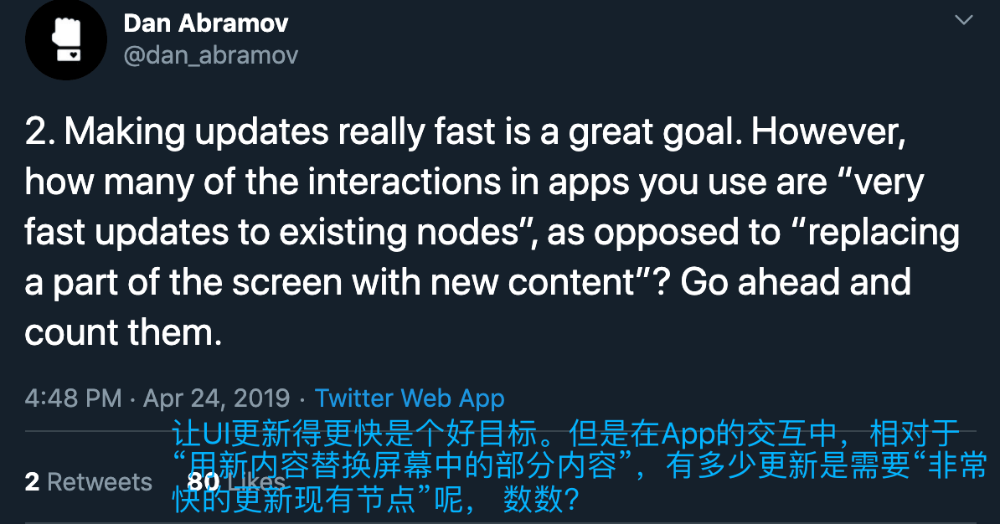
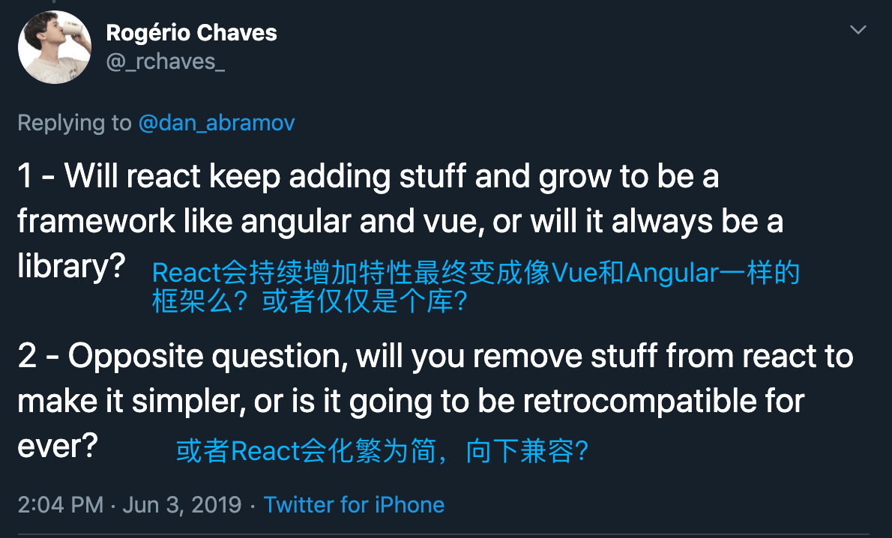
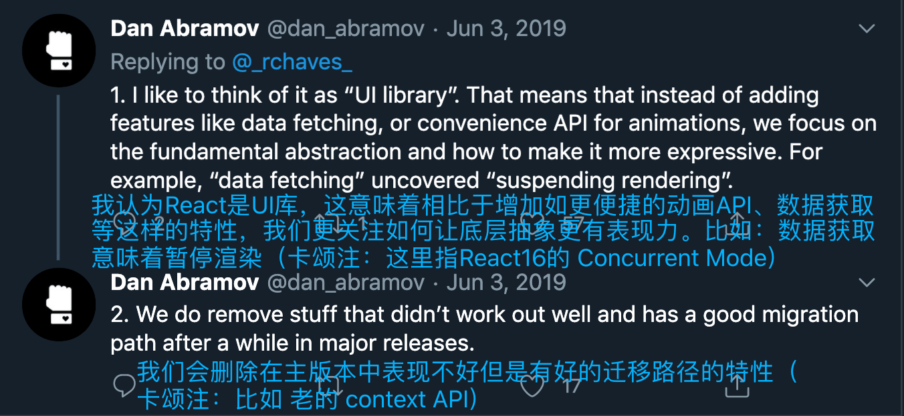
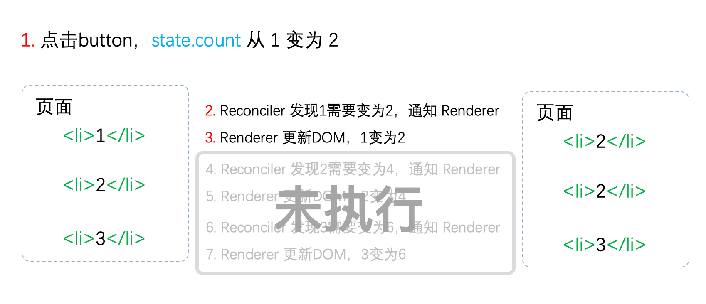

# React 理念

## React 理念

我们可以从官网看到 React 的理念：

> 我们认为，React 是用 JavaScript 构建快速响应的大型 Web 应用程序的首选方式。它在 Facebook 和 Instagram 上表现优秀。

那么该如何理解快速响应？可以从两个角度来看：

- 速度快
- 响应自然

React 是如何实现这两点的呢？

### 理解“速度快”

每当聊到一款前端框架，拉出来比比渲染速度成了老生常谈。

我们经常用“前端三大框架”指 React、Vue 和 Angular。相比于使用模版语言的 Vue、Angular，使用原生 js（JSX 仅仅是 js 的语法糖）开发 UI 的 React 在语法层面有更多灵活性。

然而，高灵活性意味着高不确定性。考虑如下 Vue 模版语句：

```html
<template>
    <ul>
        <li>0</li>
        <li>{{ name }}</li>
        <li>2</li>
        <li>3</li>
    </ul>
</template>
```

当编译时，由于模版语法的约束，Vue 可以明确知道在 li 中，只有 name 是变量，这可以提供一些优化线索。

而在 React 中，以上代码可以写成如下 JSX：

```js
function App({name}) {
    const children = [];
    for (let i = 0; i < 4; i++) {
        children.push(<li>{i === 1 ? name : i}</li>)
    }
    return <ul>{children}</ul>
}
```

由于语法的灵活，在编译时无法区分可能变化的部分。所以在运行时，React 需要遍历每个 li，判断其数据是否更新。

基于以上原因，相比于 Vue、Angular，缺少编译时优化手段的 React 为了速度快需要在运行时做出更多努力。

比如

- 使用 PureComponent 或 React.memo 构建组件
- 使用 shouldComponentUpdate 生命周期钩子
- 渲染列表时使用 key
- 使用 useCallback 和 useMemo 缓存函数和变量

由开发者来显式的告诉 React 哪些组件不需要重复计算、可以复用。

在后面源码的学习中，我们会看到这些优化手段是如何起作用的。比如经过优化后，React 会通过 bailoutOnAlreadyFinishedWork 方法跳过一些本次更新不需要处理的任务。

### 理解“响应自然”

该如何理解“响应自然”？ React 给出的答案是将人机交互研究的结果整合到真实的 UI 中。

设想以下场景：


有一个地址搜索框，在输入字符时会实时显示地址匹配结果。

当用户输入过快时可能输入变得不是那么流畅，这是由于下拉列表的更新会阻塞线程，我们一般是通过 debounce 或 throttle 来减少输入内容时触发回调的次数来解决这个问题。

但这只是治标不治本，只要组件的更新操作是同步的，那么当更新开始直到渲染完毕前，组件中总会有一定数量的工作占用线程，浏览器没有空闲时间绘制 UI，造成卡顿。

> React核心团队成员Dan在介绍React为什么会异步（Concurrent Mode）更新组件时说：
> 

让我们从“响应自然”的角度考虑：当输入字符时，用户是否在意下拉框能在一瞬间就更新？

事实是：并不在意。

如果我们能稍稍延迟下拉框更新的时间，为浏览器留出时间渲染 UI，让输入不卡顿。这样的体验是更自然的。

为了实现这个目标，需要将同步的更新变为可中断的异步更新。

在浏览器每一帧的时间中，预留一些时间给 JS 线程，React 利用这部分时间更新组件（可以看到，在源码中，预留的初始时间是 5ms）。

当预留的时间不够用时，React 将线程控制权交还给浏览器使其有时间渲染 UI，React 则等待下一帧时间到来继续被中断的工作。

### 总结

通过以上内容，我们可以看到，React 为了践行“构建快速响应的大型 Web 应用程序”理念做出的努力。

这其中有些优化手段可以在现有架构上增加，而有些（如：异步可中断更新）只能重构整个架构实现。

最后再让我们看看，Dan 回答网友关于 React 发展方向的提问：





相比于新增 feature，React 更在意底层抽象的表现力。结合理念，相信你已经明白这意味着什么了。

## 老的 React 架构

在上一节中我们了解了 React 的理念，简单概括就是速度快，响应自然。

React 从 v15 升级到 v16 后重构了整个架构。本节我们聊聊 v15，看看他为什么不能满足速度快，响应自然的理念，以至于被重构。

### React15 架构

React15 架构可以分为两层：

- Reconciler（协调器）—— 负责找出变化的组件
- Renderer（渲染器）—— 负责将变化的组件渲染到页面上

#### Reconciler（协调器）

我们知道，在 React 中可以通过 this.setState、this.forceUpdate、ReactDOM.render 等 API 触发更新。

每当有更新发生时，Reconciler 会做如下工作：

- 调用函数组件或 class 组件的 render 方法，将返回的 JSX 转化为虚拟 DOM
- 将虚拟 DOM 和上次更新时的虚拟 DOM 对比
- 通过对比找出本次更新中变化的虚拟 DOM
- 通知 Renderer 将变化的虚拟 DOM 渲染到页面上

#### Renderer（渲染器）

由于 React 支持跨平台，所以不同平台有不同的 Renderer，我们前端最熟悉的是负责在浏览器环境渲染的 Renderer —— ReactDOM。

除此之外，还有：

- ReactNative 渲染器，渲染 App 原生组件
- ReactTest 渲染器，渲染出纯 Js 对象用于测试
- ReactArt 渲染器，渲染到 Canvas, SVG 或 VML (IE8)

在每次更新发生时，Renderer 接到 Reconciler 通知，将变化的组件渲染在当前宿主环境。

### React15 架构的缺点

在 Reconciler 中，mount 的组件会调用 mountComponent，update 的组件会调用 updateComponent，这两个方法都会递归更新子组件

#### 递归更新的缺点

主流的浏览器刷新频率为 60Hz，即每 （1000ms / 60Hz）16.6ms 浏览器刷新一次。我们知道，JS 可以操作 DOM，GUI 渲染线程与 JS 线程是互斥的。所以 JS 脚本执行和浏览器布局、绘制不能同时执行。

在每 16.6ms 时间内，需要完成如下工作：

```
JS 脚本执行 ----- 样式布局 ----- 样式绘制
```

当 JS 执行时间过长，超出了 16.6ms，这次刷新就没有时间执行样式布局和样式绘制了。

对于用户在输入框输入内容这个行为来说，就体现为按下了键盘按键但是页面上不实时显示输入。

对于 React 的更新来说，由于递归执行，所以更新一旦开始，中途就无法中断。当层级很深时，递归更新时间超过了 16ms，用户交互就会卡顿。

在上一节中，我们已经提出了解决办法——用可中断的异步更新代替同步的更新。那么 React15 的架构支持异步更新么？

> 乘法小Demo  
初始化时 state.count = 1，每次点击按钮 state.count++  
列表中 3 个元素的值分别为 1，2，3 乘以 state.count 的结果

我用红色标注了更新的步骤。


我们可以看到，Reconciler 和 Renderer 是交替工作的，当第一个 li 在页面上已经变化后，第二个 li 再进入 Reconciler。

由于整个过程都是同步的，所以在用户看来所有 DOM 是同时更新的。

让我们看看在 React15 架构中如果中途中断更新会怎么样？



当第一个 li 完成更新时中断更新，即步骤 3 完成后中断更新，此时后面的步骤都还未执行。

用户本来期望 123 变为 246。实际却看见更新不完全的 DOM！（即 223）

基于这个原因，React 决定重写整个架构。

## 新的 React 架构

上一节我们聊到 React15 架构不能支撑异步更新以至于需要重构。那么这一节我们来学习重构后的 React16 是如何支持异步更新的。

### React16 架构

React16 架构可以分为三层：

- Scheduler（调度器）—— 调度任务的优先级，高优任务优先进入 Reconciler
- Reconciler（协调器）—— 负责找出变化的组件
- Renderer（渲染器）—— 负责将变化的组件渲染到页面上

可以看到，相较于 React15，React16 中新增了 Scheduler（调度器），让我们来了解下他。

### Scheduler（调度器）

既然我们以浏览器是否有剩余时间作为任务中断的标准，那么我们需要一种机制，当浏览器有剩余时间时通知我们。

其实部分浏览器已经实现了这个 API，这就是 requestIdleCallback。但是由于以下因素，React 放弃使用：

- 浏览器兼容性
- 触发频率不稳定，受很多因素影响。比如当我们的浏览器切换 tab 后，之前 tab 注册的 requestIdleCallback 触发的频率会变得很低

基于以上原因，React 实现了功能更完备的 requestIdleCallbackpolyfill，这就是 Scheduler。除了在空闲时触发回调的功能外，Scheduler 还提供了多种调度优先级供任务设置。

> Schduler 是独立于 React 的库

### Reconciler（协调器）

我们知道，在 React15 中 Reconciler 是递归处理虚拟 DOM 的，让我们看看 React16 的 Reconciler。

我们可以看见，更新工作从递归变成了可以中断的循环过程，每次循环都会调用 shouldYield 判断当前是否有剩余时间。

```js
/** @noinline */
function workLoopConcurrent() {
  // Perform work until Scheduler asks us to yield
  while (workInProgress !== null && !shouldYield()) {
    workInProgress = performUnitOfWork(workInProgress);
  }
}
```

那么 React16 是如何解决中断更新时 DOM 渲染不完全的问题呢？

在 React16 中，Reconciler 与 Renderer 不再是交替工作，当 Scheduler 将任务交给 Reconciler 后，Reconciler 会为变化的虚拟 DOM 打上代表增/删/更新的标记，类似这样：

```js
export const Placement = /*             */ 0b0000000000010;
export const Update = /*                */ 0b0000000000100;
export const PlacementAndUpdate = /*    */ 0b0000000000110;
export const Deletion = /*              */ 0b0000000001000;
```

整个 Scheduler 与 Reconciler 的工作都在内存中进行，只有当所有组件都完成 Reconciler 的工作，才会统一交给 Renderer。

### Renderer（渲染器）

Renderer 根据 Reconciler 为虚拟 DOM 打的标记，同步执行对应的 DOM 操作。

所以，对于我们在上一节使用过的 Demo

在 React16 架构中整个更新流程为：


其中红框中的步骤随时可能由于以下原因被中断：

- 有其他更高优任务需要先更新
- 当前帧没有剩余时间

由于红框中的工作都在内存中进行，不会更新页面上的 DOM，所以即使反复中断，React15 中的问题 (用户看见更新不完全的 DOM) 也不会出现。

> 事实上，由于 Scheduler 和 Reconciler 都是平台无关的，所以 React 为他们单独发了一个包 [react-reconciler](https://www.npmjs.com/package/react-reconciler)。你可以用这个包自己实现一个 ReactDOM，具体见参考资料

### 总结

通过本节我们知道了 React16 采用新的 Reconciler。

Reconciler 内部采用了 Fiber 的架构。

Fiber 是什么？他和 Reconciler 或者说和 React 之间是什么关系？我们会在接下来三节解答。

## Fiber架构的心智模型

React 核心团队成员 Sebastian Markbåge（React Hooks 的发明者）曾说：我们在 React 中做的就是践行代数效应（Algebraic Effects）。

那么，代数效应是什么呢？他和React有什么关系呢。

### 什么是代数效应

代数效应是函数式编程中的一个概念，用于将副作用从函数调用中分离。

接下来我们用虚构的语法来解释。

假设我们有一个函数 getTotalPicNum，传入 2 个用户名称后，分别查找该用户在平台保存的图片数量，最后将图片数量相加后返回。

```js
function getTotalPicNum(user1, user2) {
  const num1 = getPicNum(user1);
  const num2 = getPicNum(user2);

  return picNum1 + picNum2;
}
```

在 getTotalPicNum 中，我们不关注 getPicNum 的实现，只在乎“获取到两个数字后将他们相加的结果返回”这一过程。

接下来我们来实现 getPicNum。

"用户在平台保存的图片数量"是保存在服务器中的，为了获取该值，我们需要发起异步请求。

为了尽量保持 getTotalPicNum 的调用方式不变，我们首先想到了使用 async await：

```js
async function getTotalPicNum(user1, user2) {
  const num1 = await getPicNum(user1);
  const num2 = await getPicNum(user2);

  return picNum1 + picNum2;
}
```

但是，async await 是有传染性的 —— 当一个函数变为 async 后，这意味着调用他的函数也需要是 async，这破坏了 getTotalPicNum 的同步特性。

有没有什么办法能保持 getTotalPicNum 保持现有调用方式不变的情况下实现异步请求呢？

没有，不过我们可以虚构一个。

我们虚构一个类似 try...catch 的语法 —— try...handle 与两个操作符 perform、resume。

```js
function getPicNum(name) {
  const picNum = perform name;
  return picNum;
}

try {
  getTotalPicNum('kaSong', 'xiaoMing');
} handle (who) {
  switch (who) {
    case 'kaSong':
      resume with 230;
    case 'xiaoMing':
      resume with 122;
    default:
      resume with 0;
  }
}
```

当执行到 getTotalPicNum 内部的 getPicNum 方法时，会执行 perform name。

此时函数调用栈会从 getPicNum 方法内跳出，被最近一个 try...handle 捕获，类似 throw Error 后被最近一个 try...catch 捕获。

类似 throw Error 后 Error 会作为 catch 的参数，perform name 后 name 会作为 handle 的参数。

与 try...catch 最大的不同在于：当 Error 被 catch 捕获后，之前的调用栈就销毁了。而 handle 执行 resume 后会回到之前 perform 的调用栈。

对于 case 'kaSong'，执行完 resume with 230; 后调用栈会回到 getPicNum，此时 picNum === 230

总结一下：代数效应能够将副作用（例子中为请求图片数量）从函数逻辑中分离，使函数关注点保持纯粹。

并且，从例子中可以看出，perform resume 不需要区分同步异步。

### 代数效应在React中的应用

那么代数效应与 React 有什么关系呢？最明显的例子就是 Hooks。

对于类似 useState、useReducer、useRef 这样的 Hook，我们不需要关注 FunctionComponent 的 state 在 Hook 中是如何保存的，React 会为我们处理。

我们只需要假设 useState 返回的是我们想要的 state，并编写业务逻辑就行。

```js
function App() {
  const [num, updateNum] = useState(0);
  
  return (
    <button onClick={() => updateNum(num => num + 1)}>{num}</button>  
  )
}
```

如果这个例子还不够明显，可以看看官方的 Suspense Demo

在 Demo 中 ProfileDetails 用于展示用户名称，而用户名称是异步请求的。

但是 Demo 中完全是同步的写法。

```js
function ProfileDetails() {
  const user = resource.user.read();
  return <h1>{user.name}</h1>;
}
```

### 代数效应与 Generator

从 React15 到 React16，协调器（Reconciler）重构的一大目的是：将老的同步更新的架构变为异步可中断更新。

异步可中断更新可以理解为：更新在执行过程中可能会被打断（浏览器时间分片用尽或有更高优任务插队），当可以继续执行时恢复之前执行的中间状态。

这就是代数效应中 try...handle 的作用。

其实，浏览器原生就支持类似的实现，这就是 Generator。

但是 Generator 的一些缺陷使 React 团队放弃了他：

- 类似 async，Generator 也是传染性的，使用了 Generator 则上下文的其他函数也需要作出改变，这样心智负担比较重。
- Generator 执行的中间状态是上下文关联的。

考虑如下例子：

```js
function* doWork(A, B, C) {
  var x = doExpensiveWorkA(A);
  yield;
  var y = x + doExpensiveWorkB(B);
  yield;
  var z = y + doExpensiveWorkC(C);
  return z;
}
```

每当浏览器有空闲时间都会依次执行其中一个 doExpensiveWork，当时间用尽则会中断，当再次恢复时会从中断位置继续执行。

只考虑 `单一优先级任务的中断与继续` 情况下 Generator 可以很好的实现异步可中断更新。

但是当我们考虑 `高优先级任务插队` 的情况，如果此时已经完成 doExpensiveWorkA 与 doExpensiveWorkB 计算出 x 与 y。

此时 B 组件接收到一个高优先级更新，由于 Generator 执行的中间状态是上下文关联的，所以计算 y 时无法复用之前已经计算出的 x，需要重新计算。

如果通过全局变量保存之前执行的中间状态，又会引入新的复杂度。

> 更详细的解释可以参考[这个issue](https://github.com/facebook/react/issues/7942#issuecomment-254987818)

基于这些原因，React 没有采用 Generator 实现协调器。

### 代数效应与 Fiber

Fiber 并不是计算机术语中的新名词，他的中文翻译叫做纤程，与进程（Process）、线程（Thread）、协程（Coroutine）同为程序执行过程。

在很多文章中将纤程理解为协程的一种实现，在 JS 中协程的实现便是 Generator。

所以，我们可以将纤程(Fiber)、协程(Generator)理解为代数效应思想在 JS 中的体现。

React Fiber 可以理解为：

React 内部实现的一套状态更新机制，支持任务不同优先级，可中断与恢复，并且恢复后可以复用之前的中间状态。

其中每个任务更新单元为 React Element 对应的 Fiber 节点。

下一节，我们具体讲解 Fiber 架构的实现。

## Fiber 架构的实现原理

在新的 React 架构一节中，我们提到的虚拟 DOM 在 React 中有个正式的称呼——Fiber，在之后的学习中，我们会逐渐用 Fiber 来取代 React16 虚拟 DOM 这一称呼。

接下来让我们了解下 Fiber 因何而来？他的作用是什么？

### Fiber 的起源

> 最早的 Fiber 官方解释来源于 [2016 年 React 团队成员 Acdlite 的一篇介绍](https://github.com/acdlite/react-fiber-architecture)。

从上一章的学习我们知道：

在 React15 及以前，Reconciler 采用递归的方式创建虚拟 DOM，递归过程是不能中断的。如果组件树的层级很深，递归会占用线程很多时间造成卡顿。

为了解决这个问题，React16 将递归的无法中断的更新重构为异步的可中断更新，由于曾经用于递归的虚拟 DOM 数据结构已经无法满足需要。于是，全新的Fiber架构应运而生。

### Fiber的含义

Fiber 包含三层含义：

1. 作为架构来说，之前 React15 的 Reconciler 采用递归的方式执行，数据保存在递归调用栈中，所以被称为 stack Reconciler。React16 的 Reconciler 基于 Fiber 节点实现，被称为 Fiber Reconciler。
2. 作为静态的数据结构来说，每个 Fiber 节点对应一个 React element，保存了该组件的类型（函数组件/类组件/原生组件...）、对应的 DOM 节点等信息。
3. 作为动态的工作单元来说，每个 Fiber 节点保存了本次更新中该组件改变的状态、要执行的工作（需要被删除/被插入页面中/被更新...）。

### Fiber的结构

你可以从这里看到 Fiber 节点的属性定义，虽然属性很多，但我们可以按三层含义将他们分类来看

```js
function FiberNode(
  tag: WorkTag,
  pendingProps: mixed,
  key: null | string,
  mode: TypeOfMode,
) {
  // 作为静态数据结构的属性
  this.tag = tag;
  this.key = key;
  this.elementType = null;
  this.type = null;
  this.stateNode = null;

  // 用于连接其他 Fiber 节点形成 Fiber 树
  this.return = null;
  this.child = null;
  this.sibling = null;
  this.index = 0;

  this.ref = null;

  // 作为动态的工作单元的属性
  this.pendingProps = pendingProps;
  this.memoizedProps = null;
  this.updateQueue = null;
  this.memoizedState = null;
  this.dependencies = null;

  this.mode = mode;

  this.effectTag = NoEffect;
  this.nextEffect = null;

  this.firstEffect = null;
  this.lastEffect = null;

  // 调度优先级相关
  this.lanes = NoLanes;
  this.childLanes = NoLanes;

  // 指向该 fiber 在另一次更新时对应的 fiber
  this.alternate = null;
}
```

#### 作为架构来说

每个 Fiber 节点有个对应的 React element，多个 Fiber 节点是如何连接形成树呢？靠如下三个属性：

```js
// 指向父级 Fiber 节点
this.return = null;
// 指向子 Fiber 节点
this.child = null;
// 指向右边第一个兄弟 Fiber 节点
this.sibling = null;
```

举个例子，如下的组件结构：

```js
function App() {
  return (
    <div>
      i am
      <span>KaSong</span>
    </div>
  )
}
```

对应的 Fiber 树结构：


> 这里需要提一下，为什么父级指针叫做 return 而不是 parent 或者 father 呢？因为作为一个工作单元，return 指节点执行完 completeWork（本章后面会介绍）后会返回的下一个节点。子 Fiber 节点及其兄弟节点完成工作后会返回其父级节点，所以用 return 指代父级节点。

#### 作为静态的数据结构

作为一种静态的数据结构，保存了组件相关的信息：

```js
// Fiber 对应组件的类型 Function/Class/Host...
this.tag = tag;
// key 属性
this.key = key;
// 大部分情况同 type，某些情况不同，比如 FunctionComponent 使用 React.memo 包裹
this.elementType = null;
// 对于 FunctionComponent，指函数本身，对于 ClassComponent，指 class，对于 HostComponent，指 DOM 节点 tagName
this.type = null;
// Fiber 对应的真实 DOM 节点
this.stateNode = null;
```

#### 作为动态的工作单元

作为动态的工作单元，Fiber 中如下参数保存了本次更新相关的信息，我们会在后续的更新流程中使用到具体属性时再详细介绍

```js
// 保存本次更新造成的状态改变相关信息
this.pendingProps = pendingProps;
this.memoizedProps = null;
this.updateQueue = null;
this.memoizedState = null;
this.dependencies = null;

this.mode = mode;

// 保存本次更新会造成的 DOM 操作
this.effectTag = NoEffect;
this.nextEffect = null;

this.firstEffect = null;
this.lastEffect = null;
```

如下两个字段保存调度优先级相关的信息，会在讲解 Scheduler 时介绍。

```js
// 调度优先级相关
this.lanes = NoLanes;
this.childLanes = NoLanes;
```

> 注意  
> 在 2020 年 5 月，调度优先级策略经历了比较大的重构。以 expirationTime 属性为代表的优先级模型被 lane 取代。  
> 如果你的源码中 fiber.expirationTime 仍存在，请参照调试源码章节获取最新代码。

### 总结

本节我们了解了 Fiber 的起源与架构，其中 Fiber 节点可以构成 Fiber 树。那么 Fiber 树和页面呈现的 DOM 树有什么关系，React 又是如何更新 DOM 的呢？

我们会在下一节讲解。
