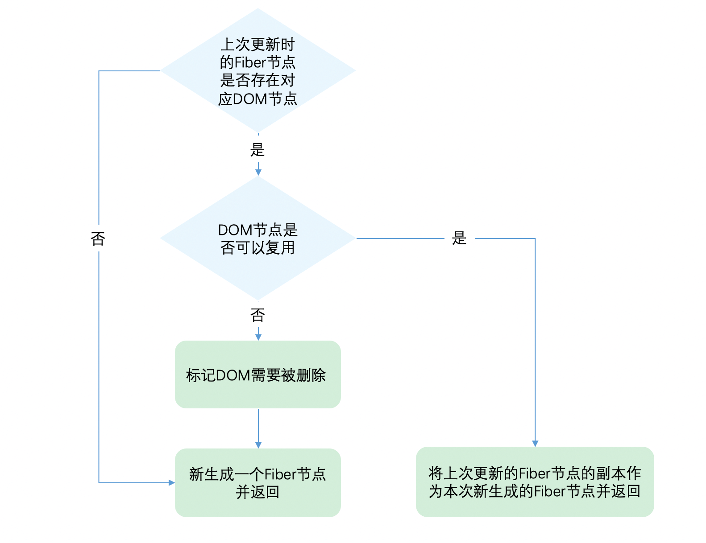
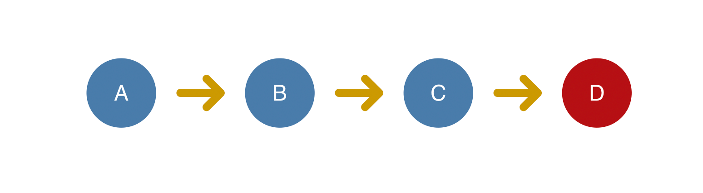
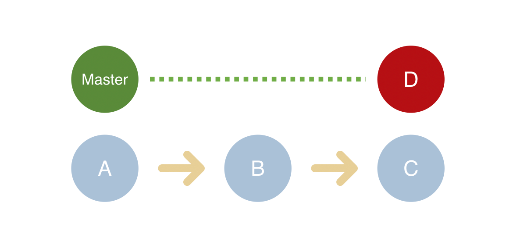
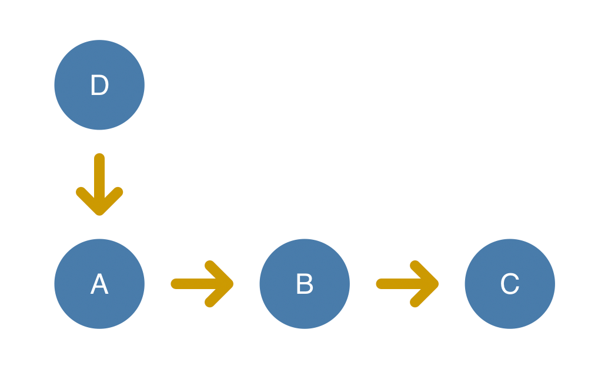
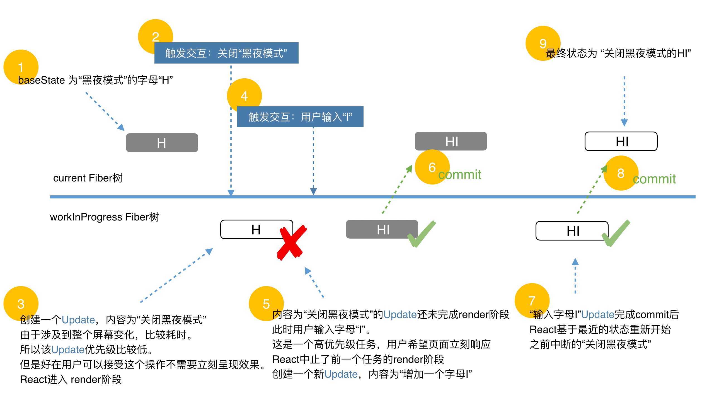

# Diff 算法

## 概览

在 beginWork 一节我们提到

> 对于 update 的组件，他会将当前组件与该组件在上次更新时对应的 Fiber 节点比较（也就是俗称的 Diff 算法），将比较的结果生成新 Fiber 节点。

这一章我们讲解 Diff 算法的实现。

你可以从[这里](https://zh-hans.reactjs.org/docs/reconciliation.html#the-diffing-algorithm)看到 Diff 算法的介绍。

为了防止概念混淆，这里再强调下

一个 DOM 节点在某一时刻最多会有 4 个节点和他相关。

1. current Fiber。如果该 DOM 节点已在页面中，current Fiber 代表该 DOM 节点对应的 Fiber 节点。
2. workInProgress Fiber。如果该 DOM 节点将在本次更新中渲染到页面中，workInProgress Fiber 代表该 DOM 节点对应的 Fiber 节点。
3. DOM 节点本身。
4. JSX 对象。即 ClassComponent 的 render 方法的返回结果，或 FunctionComponent 的调用结果。JSX 对象中包含描述 DOM 节点的信息。

Diff 算法的本质是对比 1 和 4，生成 2。

### Diff 的瓶颈以及 React 如何应对

由于 Diff 操作本身也会带来性能损耗，React 文档中提到，即使在最前沿的算法中，将前后两棵树完全比对的算法的复杂程度为 `O(n^3)`，其中 n 是树中元素的数量。

如果在 React 中使用了该算法，那么展示 1000 个元素所需要执行的计算量将在十亿的量级范围。这个开销实在是太过高昂。

为了降低算法复杂度，React 的 diff 会预设三个限制：

1. 只对同级元素进行 Diff。如果一个 DOM 节点在前后两次更新中跨越了层级，那么 React 不会尝试复用他。
2. 两个不同类型的元素会产生出不同的树。如果元素由 div 变为 p，React 会销毁 div 及其子孙节点，并新建 p 及其子孙节点。
3. 开发者可以通过 key prop 来暗示哪些子元素在不同的渲染下能保持稳定。考虑如下例子：

```js
// 更新前
<div>
  <p key="ka">ka</p>
  <h3 key="song">song</h3>
</div>

// 更新后
<div>
  <h3 key="song">song</h3>
  <p key="ka">ka</p>
</div>
```

如果没有 key，React 会认为 div 的第一个子节点由 p 变为 h3，第二个子节点由 h3 变为 p。这符合限制 2 的设定，会销毁并新建。

但是当我们用 key 指明了节点前后对应关系后，React 知道 `key === "ka"` 的 p 在更新后还存在，所以 DOM 节点可以复用，只是需要交换下顺序。

这就是 React 为了应对算法性能瓶颈做出的三条限制。

### Diff 是如何实现的

我们从 Diff 的入口函数 reconcileChildFibers 出发，该函数会根据 newChild（即 JSX 对象）类型调用不同的处理函数。

> 你可以从[这里](https://github.com/facebook/react/blob/1fb18e22ae66fdb1dc127347e169e73948778e5a/packages/react-reconciler/src/ReactChildFiber.new.js#L1280)看到 reconcileChildFibers 的源码。

```js
// 根据 newChild 类型选择不同 diff 函数处理
function reconcileChildFibers(
  returnFiber: Fiber,
  currentFirstChild: Fiber | null,
  newChild: any,
): Fiber | null {

  const isObject = typeof newChild === 'object' && newChild !== null;

  if (isObject) {
    // object 类型，可能是 REACT_ELEMENT_TYPE 或 REACT_PORTAL_TYPE
    switch (newChild.$$typeof) {
      case REACT_ELEMENT_TYPE:
        // 调用 reconcileSingleElement 处理
      // // ...省略其他 case
    }
  }

  if (typeof newChild === 'string' || typeof newChild === 'number') {
    // 调用 reconcileSingleTextNode 处理
    // ...省略
  }

  if (isArray(newChild)) {
    // 调用 reconcileChildrenArray 处理
    // ...省略
  }

  // 一些其他情况调用处理函数
  // ...省略

  // 以上都没有命中，删除节点
  return deleteRemainingChildren(returnFiber, currentFirstChild);
}
```

我们可以从同级的节点数量将 Diff 分为两类：

1. 当 newChild 类型为 object、number、string，代表同级只有一个节点
2. 当 newChild 类型为 Array，同级有多个节点

在接下来两节我们会分别讨论这两类节点的 Diff。

## 单节点 Diff

对于单个节点，我们以类型 object 为例，会进入 reconcileSingleElement

> 你可以从[这里](https://github.com/facebook/react/blob/1fb18e22ae66fdb1dc127347e169e73948778e5a/packages/react-reconciler/src/ReactChildFiber.new.js#L1141)看到 reconcileSingleElement 源码

```js
const isObject = typeof newChild === 'object' && newChild !== null;

if (isObject) {
  // 对象类型，可能是 REACT_ELEMENT_TYPE 或 REACT_PORTAL_TYPE
  switch (newChild.$$typeof) {
    case REACT_ELEMENT_TYPE:
      // 调用 reconcileSingleElement 处理
    // ...其他 case
  }
}
```

这个函数会做如下事情：



让我们看看第二步判断 DOM 节点是否可以复用是如何实现的。

```js
function reconcileSingleElement(
  returnFiber: Fiber,
  currentFirstChild: Fiber | null,
  element: ReactElement
): Fiber {
  const key = element.key;
  let child = currentFirstChild;
  
  // 首先判断是否存在对应 DOM 节点
  while (child !== null) {
    // 上一次更新存在 DOM 节点，接下来判断是否可复用

    // 首先比较 key 是否相同
    if (child.key === key) {

      // key 相同，接下来比较 type 是否相同

      switch (child.tag) {
        // ...省略 case
        
        default: {
          if (child.elementType === element.type) {
            // type 相同则表示可以复用
            // 返回复用的 fiber
            return existing;
          }
          
          // type 不同则跳出 switch
          break;
        }
      }
      // 代码执行到这里代表：key 相同但是 type 不同
      // 将该 fiber 及其兄弟 fiber 标记为删除
      deleteRemainingChildren(returnFiber, child);
      break;
    } else {
      // key 不同，将该 fiber 标记为删除
      deleteChild(returnFiber, child);
    }
    child = child.sibling;
  }

  // 创建新Fiber，并返回 ...省略
}
```

还记得我们刚才提到的，React 预设的限制么，

从代码可以看出，React 通过先判断 key 是否相同，如果 key 相同则判断 type 是否相同，只有都相同时一个 DOM 节点才能复用。

这里有个细节需要关注下：

- 当 child !== null 且 key 相同且 type 不同时执行 deleteRemainingChildren 将 child 及其兄弟 fiber 都标记删除。
- 当 child !== null 且 key 不同时仅将 child 标记删除。

考虑如下例子：

当前页面有 3 个 li，我们要全部删除，再插入一个 p。

```
// 当前页面显示的
ul > li * 3

// 这次需要更新的
ul > p
```

由于本次更新时只有一个 p，属于单一节点的 Diff，会走上面介绍的代码逻辑。

在 reconcileSingleElement 中遍历之前的 3 个 fiber（对应的 DOM 为 3 个 li），寻找本次更新的 p 是否可以复用之前的 3 个 fiber 中某个的 DOM。

当 key 相同且 type 不同时，代表我们已经找到本次更新的 p 对应的上次的 fiber，但是 p 与 li type 不同，不能复用。既然唯一的可能性已经不能复用，则剩下的 fiber 都没有机会了，所以都需要标记删除。

当 key 不同时只代表遍历到的该 fiber 不能被 p 复用，后面还有兄弟 fiber 还没有遍历到。所以仅仅标记该 fiber 删除。

### 练习题

让我们来做几道习题巩固下吧：

请判断如下 JSX 对象对应的 DOM 元素是否可以复用：

```jsx
// 习题1 更新前
<div>ka song</div>
// 更新后
<p>ka song</p>

// 习题2 更新前
<div key="xxx">ka song</div>
// 更新后
<div key="ooo">ka song</div>

// 习题3 更新前
<div key="xxx">ka song</div>
// 更新后
<p key="ooo">ka song</p>

// 习题4 更新前
<div key="xxx">ka song</div>
// 更新后
<div key="xxx">xiao bei</div>
```

公布答案：

习题1: 未设置 key prop 默认 key = null;，所以更新前后 key 相同，都为 null，但是更新前 type 为 div，更新后为 p，type 改变则不能复用。

习题2: 更新前后 key 改变，不需要再判断 type，不能复用。

习题3: 更新前后 key 改变，不需要再判断 type，不能复用。

习题4: 更新前后 key 与 type 都未改变，可以复用。children 变化，DOM 的子元素需要更新。

## 多节点 Diff

上一节我们介绍了单一节点的 Diff，现在考虑我们有一个 FunctionComponent：

```jsx
function List () {
  return (
    <ul>
      <li key="0">0</li>
      <li key="1">1</li>
      <li key="2">2</li>
      <li key="3">3</li>
    </ul>
  )
}
```

他的返回值 JSX 对象的 children 属性不是单一节点，而是包含四个对象的数组

```js
{
  $$typeof: Symbol(react.element),
  key: null,
  props: {
    children: [
      {$$typeof: Symbol(react.element), type: "li", key: "0", ref: null, props: {…}, …}
      {$$typeof: Symbol(react.element), type: "li", key: "1", ref: null, props: {…}, …}
      {$$typeof: Symbol(react.element), type: "li", key: "2", ref: null, props: {…}, …}
      {$$typeof: Symbol(react.element), type: "li", key: "3", ref: null, props: {…}, …}
    ]
  },
  ref: null,
  type: "ul"
}
```

这种情况下，reconcileChildFibers 的 newChild 参数类型为 Array，在 reconcileChildFibers 函数内部对应如下情况：

> 你可以在[这里](https://github.com/facebook/react/blob/1fb18e22ae66fdb1dc127347e169e73948778e5a/packages/react-reconciler/src/ReactChildFiber.new.js#L1352)看到这段源码逻辑

```js
if (isArray(newChild)) {
  // 调用 reconcileChildrenArray 处理
  // ...省略
}
```

这一节我们来看看，如何处理同级多个节点的 Diff。

### 概览

首先归纳下我们需要处理的情况：

我们以之前代表更新前的 JSX 对象，之后代表更新后的 JSX 对象

#### 情况1：节点更新

```jsx
// 之前
<ul>
  <li key="0" className="before">0<li>
  <li key="1">1<li>
</ul>

// 之后 情况1 —— 节点属性变化
<ul>
  <li key="0" className="after">0<li>
  <li key="1">1<li>
</ul>

// 之后 情况2 —— 节点类型更新
<ul>
  <div key="0">0</div>
  <li key="1">1<li>
</ul>
```

#### 情况2：节点新增或减少

```jsx
// 之前
<ul>
  <li key="0">0<li>
  <li key="1">1<li>
</ul>

// 之后 情况1 —— 新增节点
<ul>
  <li key="0">0<li>
  <li key="1">1<li>
  <li key="2">2<li>
</ul>

// 之后 情况2 —— 删除节点
<ul>
  <li key="1">1<li>
</ul>
```

#### 情况3：节点位置变化

```jsx
// 之前
<ul>
  <li key="0">0<li>
  <li key="1">1<li>
</ul>

// 之后
<ul>
  <li key="1">1<li>
  <li key="0">0<li>
</ul>
```

同级多个节点的 Diff，一定属于以上三种情况中的一种或多种。

### Diff 的思路

该如何设计算法呢？如果让我设计一个 Diff 算法，我首先想到的方案是：

1. 判断当前节点的更新属于哪种情况
2. 如果是新增，执行新增逻辑
3. 如果是删除，执行删除逻辑
4. 如果是更新，执行更新逻辑

按这个方案，其实有个隐含的前提——不同操作的优先级是相同的

但是 React 团队发现，在日常开发中，相较于新增和删除，更新组件发生的频率更高。所以 Diff 会优先判断当前节点是否属于更新。

>注意
>
>在我们做数组相关的算法题时，经常使用双指针从数组头和尾同时遍历以提高效率，但是这里却不行。
>
>虽然本次更新的 JSX 对象 newChildren为数组形式，但是和 newChildren 中每个组件进行比较的是 current fiber，同级的 Fiber 节点是由 sibling 指针链接形成的单链表，即不支持双指针遍历。
>
>即 `newChildren[0]` 与 fiber 比较，`newChildren[1]` 与 fiber.sibling 比较。
>
>所以无法使用双指针优化。

基于以上原因，Diff 算法的整体逻辑会经历两轮遍历：

第一轮遍历：处理更新的节点。

第二轮遍历：处理剩下的不属于更新的节点。

### 第一轮遍历

第一轮遍历步骤如下：

1. let i = 0，遍历 newChildren，将 `newChildren[i]` 与 oldFiber 比较，判断 DOM 节点是否可复用。
2. 如果可复用，i++，继续比较 `newChildren[i]` 与 oldFiber.sibling，可以复用则继续遍历。
3. 如果不可复用，分两种情况：
    1. key 不同导致不可复用，立即跳出整个遍历，第一轮遍历结束。
    2. key 相同 type 不同导致不可复用，会将 oldFiber 标记为 DELETION，并继续遍历
4. 如果 newChildren 遍历完（即i === newChildren.length - 1）或者 oldFiber 遍历完（即 oldFiber.sibling === null），跳出遍历，第一轮遍历结束。

> 你可以从[这里](https://github.com/facebook/react/blob/1fb18e22ae66fdb1dc127347e169e73948778e5a/packages/react-reconciler/src/ReactChildFiber.new.js#L818)看到这轮遍历的源码

当遍历结束后，会有两种结果：

#### 步骤 3 跳出的遍历

此时 newChildren 没有遍历完，oldFiber 也没有遍历完。

举个例子，考虑如下代码：

```jsx
// 之前
<li key="0">0</li>
<li key="1">1</li>
<li key="2">2</li>
            
// 之后
<li key="0">0</li>
<li key="2">1</li>
<li key="1">2</li>
```

第一个节点可复用，遍历到 key === 2 的节点发现 key 改变，不可复用，跳出遍历，等待第二轮遍历处理。

此时 oldFiber 剩下 key === 1、key === 2 未遍历，newChildren 剩下 key === 2、key === 1 未遍历。

#### 步骤 4 跳出的遍历

可能 newChildren 遍历完，或 oldFiber 遍历完，或他们同时遍历完。

举个例子，考虑如下代码：

```jsx
// 之前
<li key="0" className="a">0</li>
<li key="1" className="b">1</li>
            
// 之后 情况1 —— newChildren 与 oldFiber 都遍历完
<li key="0" className="aa">0</li>
<li key="1" className="bb">1</li>
            
// 之后 情况2 —— newChildren 没遍历完，oldFiber 遍历完
// newChildren 剩下 key === "2" 未遍历
<li key="0" className="aa">0</li>
<li key="1" className="bb">1</li>
<li key="2" className="cc">2</li>
            
// 之后 情况3 —— newChildren 遍历完，oldFiber 没遍历完
// oldFiber 剩下 key === "1" 未遍历
<li key="0" className="aa">0</li>
```

带着第一轮遍历的结果，我们开始第二轮遍历。

### 第二轮遍历

对于第一轮遍历的结果，我们分别讨论：

#### newChildren 与 oldFiber 同时遍历完

那就是最理想的情况：只需在第一轮遍历进行组件更新。此时 Diff 结束。

#### newChildren 没遍历完，oldFiber 遍历完

已有的 DOM 节点都复用了，这时还有新加入的节点，意味着本次更新有新节点插入，我们只需要遍历剩下的 newChildren 为生成的 workInProgress fiber 依次标记 Placement。

> 你可以在[这里](https://github.com/facebook/react/blob/1fb18e22ae66fdb1dc127347e169e73948778e5a/packages/react-reconciler/src/ReactChildFiber.new.js#L869)看到这段源码逻辑

#### newChildren 遍历完，oldFiber 没遍历完

意味着本次更新比之前的节点数量少，有节点被删除了。所以需要遍历剩下的 oldFiber，依次标记 Deletion。

> 你可以在[这里](https://github.com/facebook/react/blob/1fb18e22ae66fdb1dc127347e169e73948778e5a/packages/react-reconciler/src/ReactChildFiber.new.js#L863)看到这段源码逻辑

#### newChildren 与 oldFiber 都没遍历完

这意味着有节点在这次更新中改变了位置。

这是 Diff 算法最精髓也是最难懂的部分。我们接下来会重点讲解。

> 你可以在[这里](https://github.com/facebook/react/blob/1fb18e22ae66fdb1dc127347e169e73948778e5a/packages/react-reconciler/src/ReactChildFiber.new.js#L893)看到这段源码逻辑

### 处理移动的节点

由于有节点改变了位置，所以不能再用位置索引 i 对比前后的节点，那么如何才能将同一个节点在两次更新中对应上呢？

我们需要使用 key。

为了快速的找到 key 对应的 oldFiber，我们将所有还未处理的 oldFiber 存入以 key 为 key，oldFiber 为value 的 Map 中。

```js
const existingChildren = mapRemainingChildren(returnFiber, oldFiber);
```

> 你可以在[这里](https://github.com/facebook/react/blob/1fb18e22ae66fdb1dc127347e169e73948778e5a/packages/react-reconciler/src/ReactChildFiber.new.js#L890)看到这段源码逻辑

接下来遍历剩余的 newChildren，通过 `newChildren[i].key` 就能在 existingChildren 中找到 key 相同的 oldFiber。

### 标记节点是否移动

既然我们的目标是寻找移动的节点，那么我们需要明确：节点是否移动是以什么为参照物？

我们的参照物是：最后一个可复用的节点在 oldFiber 中的位置索引（用变量 lastPlacedIndex 表示）。

由于本次更新中节点是按 newChildren 的顺序排列。在遍历 newChildren 过程中，每个遍历到的可复用节点一定是当前遍历到的所有可复用节点中最靠右的那个，即一定在 lastPlacedIndex 对应的可复用的节点在本次更新中位置的后面。

那么我们只需要比较遍历到的可复用节点在上次更新时是否也在 lastPlacedIndex 对应的 oldFiber 后面，就能知道两次更新中这两个节点的相对位置改变没有。

我们用变量 oldIndex 表示遍历到的可复用节点在 oldFiber 中的位置索引。如果 oldIndex < lastPlacedIndex，代表本次更新该节点需要向右移动。

lastPlacedIndex 初始为 0，每遍历一个可复用的节点，如果 oldIndex >= lastPlacedIndex，则lastPlacedIndex = oldIndex。

单纯文字表达比较晦涩，这里我们提供两个 Demo，你可以对照着理解。

### Demo1

在 Demo 中我们简化下书写，每个字母代表一个节点，字母的值代表节点的 key

```
// 之前
abcd

// 之后
acdb

===第一轮遍历开始===
a（之后）vs a（之前）  
key 不变，可复用
此时 a 对应的 oldFiber（之前的 a）在之前的数组（abcd）中索引为 0
所以 lastPlacedIndex = 0;

继续第一轮遍历...

c（之后）vs b（之前）  
key 改变，不能复用，跳出第一轮遍历
此时 lastPlacedIndex === 0;
===第一轮遍历结束===

===第二轮遍历开始===
newChildren === cdb，没用完，不需要执行删除旧节点
oldFiber === bcd，没用完，不需要执行插入新节点

将剩余 oldFiber（bcd）保存为 map

// 当前 oldFiber：bcd
// 当前 newChildren：cdb

继续遍历剩余 newChildren

key === c 在 oldFiber 中存在
const oldIndex = c（之前）.index;
此时 oldIndex === 2;  // 之前节点为 abcd，所以c.index === 2
比较 oldIndex 与 lastPlacedIndex;

如果 oldIndex >= lastPlacedIndex 代表该可复用节点不需要移动
并将 lastPlacedIndex = oldIndex;
如果 oldIndex < lastplacedIndex 该可复用节点之前插入的位置索引小于这次更新需要插入的位置索引，代表该节点需要向右移动

在例子中，oldIndex 2 > lastPlacedIndex 0，
则 lastPlacedIndex = 2;
c 节点位置不变

继续遍历剩余 newChildren

// 当前oldFiber：bd
// 当前newChildren：db

key === d 在 oldFiber 中存在
const oldIndex = d（之前）.index;
oldIndex 3 > lastPlacedIndex 2 // 之前节点为 abcd，所以 d.index === 3
则 lastPlacedIndex = 3;
d 节点位置不变

继续遍历剩余 newChildren

// 当前 oldFiber：b
// 当前 newChildren：b

key === b 在 oldFiber 中存在
const oldIndex = b（之前）.index;
oldIndex 1 < lastPlacedIndex 3 // 之前节点为 abcd，所以 b.index === 1
则 b 节点需要向右移动
===第二轮遍历结束===

最终 acd 3 个节点都没有移动，b 节点被标记为移动
```

### Demo2

```
// 之前
abcd

// 之后
dabc

===第一轮遍历开始===
d（之后）vs a（之前）  
key 改变，不能复用，跳出遍历
===第一轮遍历结束===

===第二轮遍历开始===
newChildren === dabc，没用完，不需要执行删除旧节点
oldFiber === abcd，没用完，不需要执行插入新节点

将剩余 oldFiber（abcd）保存为 map

继续遍历剩余 newChildren

// 当前 oldFiber：abcd
// 当前 newChildren：dabc

key === d 在 oldFiber 中存在
const oldIndex = d（之前）.index;
此时 oldIndex === 3; // 之前节点为 abcd，所以 d.index === 3
比较 oldIndex 与 lastPlacedIndex;
oldIndex 3 > lastPlacedIndex 0
则 lastPlacedIndex = 3;
d 节点位置不变

继续遍历剩余 newChildren

// 当前 oldFiber：abc
// 当前 newChildren：abc

key === a 在 oldFiber 中存在
const oldIndex = a（之前）.index; // 之前节点为 abcd，所以 a.index === 0
此时 oldIndex === 0;
比较 oldIndex 与 lastPlacedIndex;
oldIndex 0 < lastPlacedIndex 3
则 a 节点需要向右移动

继续遍历剩余 newChildren

// 当前 oldFiber：bc
// 当前 newChildren：bc

key === b 在 oldFiber 中存在
const oldIndex = b（之前）.index; // 之前节点为 abcd，所以 b.index === 1
此时 oldIndex === 1;
比较 oldIndex 与 lastPlacedIndex;
oldIndex 1 < lastPlacedIndex 3
则 b 节点需要向右移动

继续遍历剩余 newChildren

// 当前 oldFiber：c
// 当前 newChildren：c

key === c 在 oldFiber 中存在
const oldIndex = c（之前）.index; // 之前节点为 abcd，所以 c.index === 2
此时 oldIndex === 2;
比较 oldIndex 与 lastPlacedIndex;
oldIndex 2 < lastPlacedIndex 3
则 c 节点需要向右移动

===第二轮遍历结束===
```

可以看到，我们以为从 abcd 变为 dabc，只需要将 d 移动到前面。

但实际上 React 保持 d 不变，将 abc 分别移动到了 d 的后面。

从这点可以看出，考虑性能，我们要尽量减少将节点从后面移动到前面的操作。

# 状态更新

## 流程概览

经过前几章的学习，我们终于有足够的前置知识理解状态更新的整个流程。

这一章我们看看几种常见的触发状态更新的方法是如何完成工作的。

### 几个关键节点

在开始学习前，我们先了解源码中几个关键节点（即几个关键函数的调用）。通过这章的学习，我们会将这些关键节点的调用路径串起来。

先从我们所熟知的概念开始。

#### render 阶段的开始

我们在 render 阶段流程概览一节讲到，

render 阶段开始于 performSyncWorkOnRoot 或 performConcurrentWorkOnRoot 方法的调用。这取决于本次更新是同步更新还是异步更新。

#### commit 阶段的开始

我们在 commit 阶段流程概览一节讲到，

commit 阶段开始于 commitRoot 方法的调用。其中 rootFiber 会作为传参。

我们已经知道，render 阶段完成后会进入 commit 阶段，让我们继续补全从触发状态更新到 render 阶段的路径。

```sh
触发状态更新（根据场景调用不同方法）

    |
    |
    v

    ？

    |
    |
    v

render阶段（`performSyncWorkOnRoot` 或 `performConcurrentWorkOnRoot`）

    |
    |
    v

commit阶段（`commitRoot`）
```

#### 创建 Update 对象

在 React 中，有如下方法可以触发状态更新（排除 SSR 相关）：

- ReactDOM.render
- this.setState
- this.forceUpdate
- useState
- useReducer

这些方法调用的场景各不相同，他们是如何接入同一套状态更新机制呢？

答案是：每次状态更新都会创建一个保存更新状态相关内容的对象，我们叫他 Update。在 render 阶段的 beginWork 中会根据 Update 计算新的 state。

我们会在下一节详细讲解 Update。

#### 从 fiber 到 root

现在触发状态更新的 fiber 上已经包含 Update 对象。

我们知道，render 阶段是从 rootFiber 开始向下遍历。那么如何从触发状态更新的 fiber 得到 rootFiber 呢？

答案是：调用 markUpdateLaneFromFiberToRoot 方法。

> 你可以从[这里](https://github.com/facebook/react/blob/1fb18e22ae66fdb1dc127347e169e73948778e5a/packages/react-reconciler/src/ReactFiberWorkLoop.new.js#L636)看到 markUpdateLaneFromFiberToRoot 的源码

该方法做的工作可以概括为：从触发状态更新的 fiber 一直向上遍历到 rootFiber，并返回 rootFiber。

由于不同更新优先级不尽相同，所以过程中还会更新遍历到的 fiber 的优先级。这对于我们当前属于超纲内容。

#### 调度更新

现在我们拥有一个 rootFiber，该 rootFiber 对应的 Fiber 树中某个 Fiber 节点包含一个 Update。

接下来通知 Scheduler 根据更新的优先级，决定以同步还是异步的方式调度本次更新。

这里调用的方法是 ensureRootIsScheduled。

以下是 ensureRootIsScheduled 最核心的一段代码：

```js
if (newCallbackPriority === SyncLanePriority) {
  // 任务已经过期，需要同步执行 render 阶段
  newCallbackNode = scheduleSyncCallback(
    performSyncWorkOnRoot.bind(null, root)
  );
} else {
  // 根据任务优先级异步执行 render 阶段
  var schedulerPriorityLevel = lanePriorityToSchedulerPriority(
    newCallbackPriority
  );
  newCallbackNode = scheduleCallback(
    schedulerPriorityLevel,
    performConcurrentWorkOnRoot.bind(null, root)
  );
}
```

> 你可以从[这里](https://github.com/facebook/react/blob/b6df4417c79c11cfb44f965fab55b573882b1d54/packages/react-reconciler/src/ReactFiberWorkLoop.new.js#L602)看到 ensureRootIsScheduled 的源码

其中，scheduleCallback 和 scheduleSyncCallback 会调用 Scheduler 提供的调度方法根据优先级调度回调函数执行。

可以看到，这里调度的回调函数为：

```js
performSyncWorkOnRoot.bind(null, root);
performConcurrentWorkOnRoot.bind(null, root);
```

即 render 阶段的入口函数。

至此，状态更新就和我们所熟知的 render 阶段连接上了。

### 总结

让我们梳理下状态更新的整个调用路径的关键节点：

```js
触发状态更新（根据场景调用不同方法）

    |
    |
    v

创建 Update 对象（接下来三节详解）

    |
    |
    v

从 fiber 到 root（`markUpdateLaneFromFiberToRoot`）

    |
    |
    v

调度更新（`ensureRootIsScheduled`）

    |
    |
    v

render阶段（`performSyncWorkOnRoot` 或 `performConcurrentWorkOnRoot`）

    |
    |
    v

commit阶段（`commitRoot`）
```

本节我们了解了状态更新的整个流程。

在接下来三节中，我们会花大量篇幅讲解 Update 的工作机制，因为他是构成 React concurrent mode 的核心机制之一。

## 心智模型

在深入源码前，让我们先建立更新机制的心智模型。

在后面两节讲解源码时，我们会将代码与心智模型联系上，方便你更好理解。

### 同步更新的 React

我们可以将更新机制类比代码版本控制。

在没有代码版本控制前，我们在代码中逐步叠加功能。一切看起来井然有序，直到我们遇到了一个紧急线上 bug（红色节点）。



为了修复这个 bug，我们需要首先将之前的代码提交。

在 React 中，所有通过 ReactDOM.render 创建的应用（其他创建应用的方式参考 ReactDOM.render 一节）都是通过类似的方式更新状态。

即没有优先级概念，高优更新（红色节点）需要排在其他更新后面执行。

### 并发更新的 React

当有了代码版本控制，有紧急线上 bug 需要修复时，我们暂存当前分支的修改，在 master 分支修复 bug 并紧急上线。



bug 修复上线后通过 git rebase 命令和开发分支连接上。开发分支基于修复 bug 的版本继续开发。



在 React 中，通过 ReactDOM.createBlockingRoot 和 ReactDOM.createRoot 创建的应用会采用并发的方式更新状态。

高优更新（红色节点）中断正在进行中的低优更新（蓝色节点），先完成 render - commit 流程。

待高优更新完成后，低优更新基于高优更新的结果重新更新。

接下来两节我们会从源码角度讲解这套并发更新是如何实现的。

## Update

通过本章第一节学习，我们知道状态更新流程开始后首先会创建 Update 对象。

本节我们学习 Update 的结构与工作流程。

> 你可以将 Update 类比心智模型中的一次 commit。

### Update 的分类

我们先来了解 Update 的结构。

首先，我们将可以触发更新的方法所隶属的组件分类：

- ReactDOM.render —— HostRoot
- this.setState —— ClassComponent
- this.forceUpdate —— ClassComponent
- useState —— FunctionComponent
- useReducer —— FunctionComponent

可以看到，一共三种组件（HostRoot | ClassComponent | FunctionComponent）可以触发更新。

由于不同类型组件工作方式不同，所以存在两种不同结构的 Update，其中 ClassComponent 与 HostRoot 共用一套 Update 结构，FunctionComponent 单独使用一种 Update 结构。

虽然他们的结构不同，但是他们工作机制与工作流程大体相同。在本节我们介绍前一种 Update，FunctionComponent 对应的 Update 在 Hooks 章节介绍。

### Update 的结构

ClassComponent 与 HostRoot（即 rootFiber.tag 对应类型）共用同一种 Update 结构。

对应的结构如下：

```js
const update: Update<*> = {
  eventTime,
  lane,
  suspenseConfig,
  tag: UpdateState,
  payload: null,
  callback: null,

  next: null,
};
```

> Update 由 createUpdate 方法返回，你可以从[这里](https://github.com/facebook/react/blob/1fb18e22ae66fdb1dc127347e169e73948778e5a/packages/react-reconciler/src/ReactUpdateQueue.old.js#L189)看到 createUpdate 的源码

字段意义如下：

- eventTime：任务时间，通过 performance.now() 获取的毫秒数。由于该字段在未来会重构，当前我们不需要理解他。
- lane：优先级相关字段。当前还不需要掌握他，只需要知道不同 Update 优先级可能是不同的。
    > 你可以将 lane 类比心智模型中需求的紧急程度。
- suspenseConfig：Suspense 相关，暂不关注。
- tag：更新的类型，包括 UpdateState | ReplaceState | ForceUpdate | CaptureUpdate。
- payload：更新挂载的数据，不同类型组件挂载的数据不同。对于 ClassComponent，payload 为 this.setState 的第一个传参。对于 HostRoot，payload 为 ReactDOM.render 的第一个传参。
- callback：更新的回调函数。即在 commit 阶段的 layout 子阶段一节中提到的回调函数。
- next：与其他 Update 连接形成链表。

### Update 与 Fiber的联系

我们发现，Update 存在一个连接其他 Update 形成链表的字段 next。联系 React 中另一种以链表形式组成的结构 Fiber，他们之间有什么关联么？

答案是肯定的。

从双缓存机制一节我们知道，Fiber 节点组成 Fiber 树，页面中最多同时存在两棵 Fiber 树：

- 代表当前页面状态的 current Fiber 树
- 代表正在 render 阶段的 workInProgress Fiber 树

类似 Fiber 节点组成 Fiber 树，Fiber 节点上的多个 Update 会组成链表并被包含在 fiber.updateQueue 中。

> 什么情况下一个 Fiber 节点会存在多个 Update？
>
>你可能疑惑为什么一个 Fiber 节点会存在多个 Update。这其实是很常见的情况。
>
>在这里介绍一种最简单的情况：
>
>```js
>onClick() {
> this.setState({
>   a: 1
> })
>
> this.setState({
>   b: 2
> })
>}
>```
> 在一个 ClassComponent 中触发 this.onClick 方法，方法内部调用了两次 this.setState。这会在该 fiber 中产生两个 Update。

Fiber 节点最多同时存在两个 updateQueue：

- current fiber 保存的 updateQueue 即 current updateQueue
- workInProgress fiber 保存的 updateQueue 即 workInProgress updateQueue

在 commit 阶段完成页面渲染后，workInProgress Fiber 树变为 current Fiber 树，workInProgress Fiber 树内 Fiber 节点的 updateQueue 就变成 current updateQueue。

### updateQueue

updateQueue 有三种类型，其中针对 HostComponent 的类型我们在 completeWork 一节介绍过。

剩下两种类型和 Update 的两种类型对应。

ClassComponent 与 HostRoot 使用的 UpdateQueue 结构如下：

```js
const queue: UpdateQueue<State> = {
  baseState: fiber.memoizedState,
  firstBaseUpdate: null,
  lastBaseUpdate: null,
  shared: {
    pending: null,
  },
  effects: null,
};
```

> UpdateQueue 由 initializeUpdateQueue 方法返回，你可以从这里看到 initializeUpdateQueue 的源码

字段说明如下：

- baseState：本次更新前该 Fiber 节点的 state，Update 基于该 state 计算更新后的 state。

    > 你可以将 baseState 类比心智模型中的 master 分支。

- firstBaseUpdate 与 lastBaseUpdate：本次更新前该 Fiber 节点已保存的 Update。以链表形式存在，链表头为 firstBaseUpdate，链表尾为 lastBaseUpdate。之所以在更新产生前该 Fiber 节点内就存在 Update，是由于某些 Update 优先级较低所以在上次 render 阶段由 Update 计算 state 时被跳过。

    > 你可以将 baseUpdate 类比心智模型中执行 git rebase 基于的 commit（节点 D）。

- shared.pending：触发更新时，产生的 Update 会保存在 shared.pending 中形成单向环状链表。当由 Update 计算 state 时这个环会被剪开并连接在 lastBaseUpdate 后面。

    > 你可以将 shared.pending 类比心智模型中本次需要提交的 commit（节点 ABC）。

- effects：数组。保存 update.callback !== null 的 Update。

### 例子

updateQueue 相关代码逻辑涉及到大量链表操作，比较难懂。在此我们举例对 updateQueue 的工作流程讲解下。

假设有一个 fiber 刚经历 commit 阶段完成渲染。

该 fiber 上有两个由于优先级过低所以在上次的 render 阶段并没有处理的 Update。他们会成为下次更新的 baseUpdate。

我们称其为 u1 和 u2，其中 u1.next === u2。

```js
fiber.updateQueue.firstBaseUpdate === u1;
fiber.updateQueue.lastBaseUpdate === u2;
u1.next === u2;
```

我们用 --> 表示链表的指向：

```js
fiber.updateQueue.baseUpdate: u1 --> u2
```

现在我们在 fiber 上触发两次状态更新，这会产生两个新 Update。

我们称其为 u3 和 u4。

```js
fiber.updateQueue.shared.pending === u3;
u3.next === u4;
u4.next === u3;
```

由于 shared.pending 是环状链表，用图表示为：

```js
fiber.updateQueue.shared.pending:   u3 --> u4 
                                     ^      |                                    
                                     |______|
```

更新调度完成后进入 render 阶段。

此时 shared.pending 的环被剪开并连接在 updateQueue.lastBaseUpdate 后面：

```js
fiber.updateQueue.baseUpdate: u1 --> u2 --> u3 --> u4
```

接下来遍历 updateQueue.baseUpdate 链表，以 fiber.updateQueue.baseState 为初始 state，依次与遍历到的每个 Update 计算并产生新的 state（该操作类比 Array.prototype.reduce）。

在遍历时如果有优先级低的 Update 会被跳过。

当遍历完成后获得的 state，就是该 Fiber 节点在本次更新的 state（源码中叫做 memoizedState）。

> render 阶段的 Update 操作由 processUpdateQueue 完成，你可以从[这里](https://github.com/facebook/react/blob/1fb18e22ae66fdb1dc127347e169e73948778e5a/packages/react-reconciler/src/ReactUpdateQueue.new.js#L405)看到 processUpdateQueue 的源码

state 的变化在 render 阶段产生与上次更新不同的 JSX 对象，通过 Diff 算法产生 effectTag，在 commit 阶段渲染在页面上。

渲染完成后 workInProgress Fiber 树变为 current Fiber 树，整个更新流程结束。

## 深入理解优先级

通过更新的心智模型，我们了解到更新具有优先级。

那么什么是优先级？优先级以什么为依据？如何通过优先级决定哪个状态应该先被更新？

本节我们会详细讲解。

### 什么是优先级

在 React 理念一节我们聊到 React 将人机交互研究的结果整合到真实的 UI 中。具体到 React 运行上这是什么意思呢？

状态更新由用户交互产生，用户心里对交互执行顺序有个预期。React 根据人机交互研究的结果中用户对交互的预期顺序为交互产生的状态更新赋予不同优先级。

具体如下：

- 生命周期方法：同步执行。
- 受控的用户输入：比如输入框内输入文字，同步执行。
- 交互事件：比如动画，高优先级执行。
- 其他：比如数据请求，低优先级执行。

### 如何调度优先级

我们在新的 React 结构一节讲到，React 通过 Scheduler 调度任务。

具体到代码，每当需要调度任务时，React 会调用 Scheduler 提供的方法 runWithPriority。

该方法接收一个优先级常量与一个回调函数作为参数。回调函数会以优先级高低为顺序排列在一个定时器中并在合适的时间触发。

对于更新来讲，传递的回调函数一般为状态更新流程概览一节讲到的 render 阶段的入口函数。

> 你可以在 `==unstable_runWithPriority==` [这里](https://github.com/facebook/react/blob/970fa122d8188bafa600e9b5214833487fbf1092/packages/scheduler/src/Scheduler.js#L217)看到 runWithPriority 方法的定义。在[这里](https://github.com/facebook/react/blob/970fa122d8188bafa600e9b5214833487fbf1092/packages/scheduler/src/SchedulerPriorities.js)看到 Scheduler 对优先级常量的定义。

### 例子

优先级最终会反映到 update.lane 变量上。当前我们只需要知道这个变量能够区分 Update 的优先级。

接下来我们通过一个例子结合上一节介绍的 Update 相关字段讲解优先级如何决定更新的顺序。

> 该例子来自 React Core Team Andrew 向网友讲解 Update 工作流程的[推文](https://twitter.com/acdlite/status/978412930973687808)



在这个例子中，有两个 Update。我们将“关闭黑夜模式”产生的 Update 称为 u1，输入字母 “I” 产生的 Update 称为 u2。

其中 u1 先触发并进入 render 阶段。其优先级较低，执行时间较长。此时：

```js
fiber.updateQueue = {
  baseState: {
    blackTheme: true,
    text: 'H'
  },
  firstBaseUpdate: null,
  lastBaseUpdate: null
  shared: {
    pending: u1
  },
  effects: null
};
```

在 u1 完成 render 阶段前用户通过键盘输入字母“I”，产生了 u2。u2 属于受控的用户输入，优先级高于 u1，于是中断 u1 产生的 render 阶段。

此时：

```js
fiber.updateQueue.shared.pending === u2 ----> u1
                                     ^        |
                                     |________|
// 即
u2.next === u1;
u1.next === u2;
```

其中 u2 优先级高于 u1。

接下来进入 u2 产生的 render 阶段。

在 processUpdateQueue 方法中，shared.pending 环状链表会被剪开并拼接在 baseUpdate 后面。

需要明确一点，shared.pending 指向最后一个 pending 的 update，所以实际执行时 update 的顺序为：

```js
u1 -- u2
```

接下来遍历 baseUpdate，处理优先级合适的 Update（这一次处理的是更高优的 u2）。

由于 u2 不是 baseUpdate 中的第一个 update，在其之前的 u1 由于优先级不够被跳过。

update 之间可能有依赖关系，所以被跳过的 update 及其后面所有 update 会成为下次更新的 baseUpdate。（即 u1 -- u2）。

最终 u2 完成 render - commit 阶段。

此时：

```js
fiber.updateQueue = {
  baseState: {
    blackTheme: true,
    text: 'HI'
  },
  firstBaseUpdate: u1,
  lastBaseUpdate: u2
  shared: {
    pending: null
  },
  effects: null
};
```

在 commit 阶段结尾会再调度一次更新。在该次更新中会基于 baseState 中 firstBaseUpdate 保存的 u1，开启一次新的 render 阶段。

最终两次 Update 都完成后的结果如下：

```js
fiber.updateQueue = {
  baseState: {
    blackTheme: false,
    text: 'HI'
  },
  firstBaseUpdate: null,
  lastBaseUpdate: null
  shared: {
    pending: null
  },
  effects: null
};
```

我们可以看见，u2 对应的更新执行了两次，相应的 render 阶段的生命周期勾子 componentWillXXX 也会触发两次。这也是为什么这些勾子会被标记为 unsafe_。

### 如何保证状态正确

现在我们基本掌握了 updateQueue 的工作流程。还有两个疑问：

- render 阶段可能被中断。如何保证 updateQueue 中保存的 Update 不丢失？
- 有时候当前状态需要依赖前一个状态。如何在支持跳过低优先级状态的同时保证状态依赖的连续性？

我们分别讲解下。

#### 如何保证Update不丢失

在上一节例子中我们讲到，在 render 阶段，shared.pending 的环被剪开并连接在 updateQueue.lastBaseUpdate 后面。

实际上 shared.pending 会被同时连接在 workInProgress updateQueue.lastBaseUpdate 与 current updateQueue.lastBaseUpdate 后面。

> 具体代码见[这里](https://github.com/facebook/react/blob/970fa122d8188bafa600e9b5214833487fbf1092/packages/react-reconciler/src/ReactUpdateQueue.new.js#L424)

当 render 阶段被中断后重新开始时，会基于 current updateQueue 克隆出 workInProgress updateQueue。由于 current updateQueue.lastBaseUpdate 已经保存了上一次的 Update，所以不会丢失。

当 commit 阶段完成渲染，由于 workInProgress updateQueue.lastBaseUpdate 中保存了上一次的 Update，所以 workInProgress Fiber 树变成 current Fiber 树后也不会造成 Update 丢失。

#### 如何保证状态依赖的连续性

当某个 Update 由于优先级低而被跳过时，保存在 baseUpdate 中的不仅是该 Update，还包括链表中该 Update 之后的所有 Update。

考虑如下例子：

```js
baseState: ''
shared.pending: A1 --> B2 --> C1 --> D2
```

其中字母代表该 Update 要在页面插入的字母，数字代表优先级，值越低优先级越高。

第一次 render，优先级为 1。

```js
baseState: ''
baseUpdate: null
render阶段使用的Update: [A1, C1]
memoizedState: 'AC'
```

其中 B2 由于优先级为 2，低于当前优先级，所以他及其后面的所有 Update 会被保存在 baseUpdate 中作为下次更新的 Update（即 B2 C1 D2）。

这么做是为了保持状态的前后依赖顺序。

第二次 render，优先级为 2。

```js
baseState: 'A'
baseUpdate: B2 --> C1 --> D2
render阶段使用的Update: [B2, C1, D2]
memoizedState: 'ABCD'
```

注意这里 baseState 并不是上一次更新的 memoizedState。这是由于 B2 被跳过了。

即当有 Update 被跳过时，下次更新的 baseState !== 上次更新的 memoizedState。

> 跳过 B2 的逻辑见[这里](https://github.com/facebook/react/blob/970fa122d8188bafa600e9b5214833487fbf1092/packages/react-reconciler/src/ReactUpdateQueue.new.js#L479)

通过以上例子我们可以发现，React 保证最终的状态一定和用户触发的交互一致，但是中间过程状态可能由于设备不同而不同。

