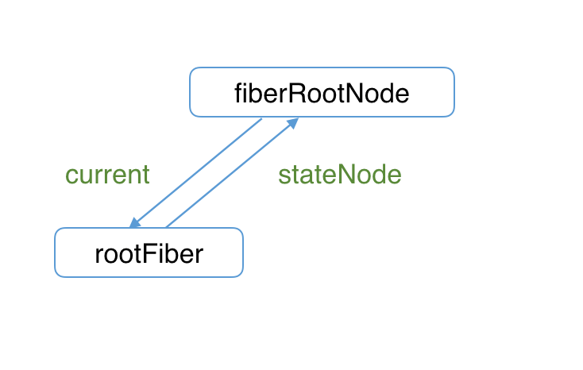

# Diff 算法

## 概览

在 beginWork 一节我们提到

> 对于 update 的组件，他会将当前组件与该组件在上次更新时对应的 Fiber 节点比较（也就是俗称的 Diff 算法），将比较的结果生成新 Fiber 节点。

这一章我们讲解 Diff 算法的实现。

你可以从[这里](https://zh-hans.reactjs.org/docs/reconciliation.html#the-diffing-algorithm)看到 Diff 算法的介绍。

为了防止概念混淆，这里再强调下

一个 DOM 节点在某一时刻最多会有 4 个节点和他相关。

1. current Fiber。如果该 DOM 节点已在页面中，current Fiber 代表该 DOM 节点对应的 Fiber 节点。
2. workInProgress Fiber。如果该 DOM 节点将在本次更新中渲染到页面中，workInProgress Fiber 代表该 DOM 节点对应的 Fiber 节点。
3. DOM 节点本身。
4. JSX 对象。即 ClassComponent 的 render 方法的返回结果，或 FunctionComponent 的调用结果。JSX 对象中包含描述 DOM 节点的信息。

Diff 算法的本质是对比 1 和 4，生成 2。

### Diff 的瓶颈以及 React 如何应对

由于 Diff 操作本身也会带来性能损耗，React 文档中提到，即使在最前沿的算法中，将前后两棵树完全比对的算法的复杂程度为 `O(n^3)`，其中 n 是树中元素的数量。

如果在 React 中使用了该算法，那么展示 1000 个元素所需要执行的计算量将在十亿的量级范围。这个开销实在是太过高昂。

为了降低算法复杂度，React 的 diff 会预设三个限制：

1. 只对同级元素进行 Diff。如果一个 DOM 节点在前后两次更新中跨越了层级，那么 React 不会尝试复用他。
2. 两个不同类型的元素会产生出不同的树。如果元素由 div 变为 p，React 会销毁 div 及其子孙节点，并新建 p 及其子孙节点。
3. 开发者可以通过 key prop 来暗示哪些子元素在不同的渲染下能保持稳定。考虑如下例子：

```js
// 更新前
<div>
  <p key="ka">ka</p>
  <h3 key="song">song</h3>
</div>

// 更新后
<div>
  <h3 key="song">song</h3>
  <p key="ka">ka</p>
</div>
```

如果没有 key，React 会认为 div 的第一个子节点由 p 变为 h3，第二个子节点由 h3 变为 p。这符合限制 2 的设定，会销毁并新建。

但是当我们用 key 指明了节点前后对应关系后，React 知道 `key === "ka"` 的 p 在更新后还存在，所以 DOM 节点可以复用，只是需要交换下顺序。

这就是 React 为了应对算法性能瓶颈做出的三条限制。

### Diff 是如何实现的

我们从 Diff 的入口函数 reconcileChildFibers 出发，该函数会根据 newChild（即 JSX 对象）类型调用不同的处理函数。

> 你可以从[这里](https://github.com/facebook/react/blob/1fb18e22ae66fdb1dc127347e169e73948778e5a/packages/react-reconciler/src/ReactChildFiber.new.js#L1280)看到 reconcileChildFibers 的源码。

```js
// 根据 newChild 类型选择不同 diff 函数处理
function reconcileChildFibers(
  returnFiber: Fiber,
  currentFirstChild: Fiber | null,
  newChild: any,
): Fiber | null {

  const isObject = typeof newChild === 'object' && newChild !== null;

  if (isObject) {
    // object 类型，可能是 REACT_ELEMENT_TYPE 或 REACT_PORTAL_TYPE
    switch (newChild.$$typeof) {
      case REACT_ELEMENT_TYPE:
        // 调用 reconcileSingleElement 处理
      // // ...省略其他 case
    }
  }

  if (typeof newChild === 'string' || typeof newChild === 'number') {
    // 调用 reconcileSingleTextNode 处理
    // ...省略
  }

  if (isArray(newChild)) {
    // 调用 reconcileChildrenArray 处理
    // ...省略
  }

  // 一些其他情况调用处理函数
  // ...省略

  // 以上都没有命中，删除节点
  return deleteRemainingChildren(returnFiber, currentFirstChild);
}
```

我们可以从同级的节点数量将 Diff 分为两类：

1. 当 newChild 类型为 object、number、string，代表同级只有一个节点
2. 当 newChild 类型为 Array，同级有多个节点

在接下来两节我们会分别讨论这两类节点的 Diff。

## 单节点 Diff

对于单个节点，我们以类型 object 为例，会进入 reconcileSingleElement

> 你可以从[这里](https://github.com/facebook/react/blob/1fb18e22ae66fdb1dc127347e169e73948778e5a/packages/react-reconciler/src/ReactChildFiber.new.js#L1141)看到 reconcileSingleElement 源码

```js
const isObject = typeof newChild === 'object' && newChild !== null;

if (isObject) {
  // 对象类型，可能是 REACT_ELEMENT_TYPE 或 REACT_PORTAL_TYPE
  switch (newChild.$$typeof) {
    case REACT_ELEMENT_TYPE:
      // 调用 reconcileSingleElement 处理
    // ...其他 case
  }
}
```

这个函数会做如下事情：


让我们看看第二步判断 DOM 节点是否可以复用是如何实现的。

```js
function reconcileSingleElement(
  returnFiber: Fiber,
  currentFirstChild: Fiber | null,
  element: ReactElement
): Fiber {
  const key = element.key;
  let child = currentFirstChild;
  
  // 首先判断是否存在对应 DOM 节点
  while (child !== null) {
    // 上一次更新存在 DOM 节点，接下来判断是否可复用

    // 首先比较 key 是否相同
    if (child.key === key) {

      // key 相同，接下来比较 type 是否相同

      switch (child.tag) {
        // ...省略 case
        
        default: {
          if (child.elementType === element.type) {
            // type 相同则表示可以复用
            // 返回复用的 fiber
            return existing;
          }
          
          // type 不同则跳出 switch
          break;
        }
      }
      // 代码执行到这里代表：key 相同但是 type 不同
      // 将该 fiber 及其兄弟 fiber 标记为删除
      deleteRemainingChildren(returnFiber, child);
      break;
    } else {
      // key 不同，将该 fiber 标记为删除
      deleteChild(returnFiber, child);
    }
    child = child.sibling;
  }

  // 创建新Fiber，并返回 ...省略
}
```

还记得我们刚才提到的，React 预设的限制么，

从代码可以看出，React 通过先判断 key 是否相同，如果 key 相同则判断 type 是否相同，只有都相同时一个 DOM 节点才能复用。

这里有个细节需要关注下：

- 当 child !== null 且 key 相同且 type 不同时执行 deleteRemainingChildren 将 child 及其兄弟 fiber 都标记删除。
- 当 child !== null 且 key 不同时仅将 child 标记删除。

考虑如下例子：

当前页面有 3 个 li，我们要全部删除，再插入一个 p。

```
// 当前页面显示的
ul > li * 3

// 这次需要更新的
ul > p
```

由于本次更新时只有一个 p，属于单一节点的 Diff，会走上面介绍的代码逻辑。

在 reconcileSingleElement 中遍历之前的 3 个 fiber（对应的 DOM 为 3 个 li），寻找本次更新的 p 是否可以复用之前的 3 个 fiber 中某个的 DOM。

当 key 相同且 type 不同时，代表我们已经找到本次更新的 p 对应的上次的 fiber，但是 p 与 li type 不同，不能复用。既然唯一的可能性已经不能复用，则剩下的 fiber 都没有机会了，所以都需要标记删除。

当 key 不同时只代表遍历到的该 fiber 不能被 p 复用，后面还有兄弟 fiber 还没有遍历到。所以仅仅标记该 fiber 删除。

### 练习题

让我们来做几道习题巩固下吧：

请判断如下 JSX 对象对应的 DOM 元素是否可以复用：

```jsx
// 习题1 更新前
<div>ka song</div>
// 更新后
<p>ka song</p>

// 习题2 更新前
<div key="xxx">ka song</div>
// 更新后
<div key="ooo">ka song</div>

// 习题3 更新前
<div key="xxx">ka song</div>
// 更新后
<p key="ooo">ka song</p>

// 习题4 更新前
<div key="xxx">ka song</div>
// 更新后
<div key="xxx">xiao bei</div>
```

公布答案：

习题1: 未设置 key prop 默认 key = null;，所以更新前后 key 相同，都为 null，但是更新前 type 为 div，更新后为 p，type 改变则不能复用。

习题2: 更新前后 key 改变，不需要再判断 type，不能复用。

习题3: 更新前后 key 改变，不需要再判断 type，不能复用。

习题4: 更新前后 key 与 type 都未改变，可以复用。children 变化，DOM 的子元素需要更新。

## 多节点 Diff

上一节我们介绍了单一节点的 Diff，现在考虑我们有一个 FunctionComponent：

```jsx
function List () {
  return (
    <ul>
      <li key="0">0</li>
      <li key="1">1</li>
      <li key="2">2</li>
      <li key="3">3</li>
    </ul>
  )
}
```

他的返回值 JSX 对象的 children 属性不是单一节点，而是包含四个对象的数组

```js
{
  $$typeof: Symbol(react.element),
  key: null,
  props: {
    children: [
      {$$typeof: Symbol(react.element), type: "li", key: "0", ref: null, props: {…}, …}
      {$$typeof: Symbol(react.element), type: "li", key: "1", ref: null, props: {…}, …}
      {$$typeof: Symbol(react.element), type: "li", key: "2", ref: null, props: {…}, …}
      {$$typeof: Symbol(react.element), type: "li", key: "3", ref: null, props: {…}, …}
    ]
  },
  ref: null,
  type: "ul"
}
```

这种情况下，reconcileChildFibers 的 newChild 参数类型为 Array，在 reconcileChildFibers 函数内部对应如下情况：

> 你可以在[这里](https://github.com/facebook/react/blob/1fb18e22ae66fdb1dc127347e169e73948778e5a/packages/react-reconciler/src/ReactChildFiber.new.js#L1352)看到这段源码逻辑

```js
if (isArray(newChild)) {
  // 调用 reconcileChildrenArray 处理
  // ...省略
}
```

这一节我们来看看，如何处理同级多个节点的 Diff。

### 概览

首先归纳下我们需要处理的情况：

我们以之前代表更新前的 JSX 对象，之后代表更新后的 JSX 对象

#### 情况1：节点更新

```jsx
// 之前
<ul>
  <li key="0" className="before">0<li>
  <li key="1">1<li>
</ul>

// 之后 情况1 —— 节点属性变化
<ul>
  <li key="0" className="after">0<li>
  <li key="1">1<li>
</ul>

// 之后 情况2 —— 节点类型更新
<ul>
  <div key="0">0</div>
  <li key="1">1<li>
</ul>
```

#### 情况2：节点新增或减少

```jsx
// 之前
<ul>
  <li key="0">0<li>
  <li key="1">1<li>
</ul>

// 之后 情况1 —— 新增节点
<ul>
  <li key="0">0<li>
  <li key="1">1<li>
  <li key="2">2<li>
</ul>

// 之后 情况2 —— 删除节点
<ul>
  <li key="1">1<li>
</ul>
```

#### 情况3：节点位置变化

```jsx
// 之前
<ul>
  <li key="0">0<li>
  <li key="1">1<li>
</ul>

// 之后
<ul>
  <li key="1">1<li>
  <li key="0">0<li>
</ul>
```

同级多个节点的 Diff，一定属于以上三种情况中的一种或多种。

### Diff 的思路

该如何设计算法呢？如果让我设计一个 Diff 算法，我首先想到的方案是：

1. 判断当前节点的更新属于哪种情况
2. 如果是新增，执行新增逻辑
3. 如果是删除，执行删除逻辑
4. 如果是更新，执行更新逻辑

按这个方案，其实有个隐含的前提——不同操作的优先级是相同的

但是 React 团队发现，在日常开发中，相较于新增和删除，更新组件发生的频率更高。所以 Diff 会优先判断当前节点是否属于更新。

>注意
>
>在我们做数组相关的算法题时，经常使用双指针从数组头和尾同时遍历以提高效率，但是这里却不行。
>
>虽然本次更新的 JSX 对象 newChildren为数组形式，但是和 newChildren 中每个组件进行比较的是 current fiber，同级的 Fiber 节点是由 sibling 指针链接形成的单链表，即不支持双指针遍历。
>
>即 `newChildren[0]` 与 fiber 比较，`newChildren[1]` 与 fiber.sibling 比较。
>
>所以无法使用双指针优化。

基于以上原因，Diff 算法的整体逻辑会经历两轮遍历：

第一轮遍历：处理更新的节点。

第二轮遍历：处理剩下的不属于更新的节点。

### 第一轮遍历

第一轮遍历步骤如下：

1. let i = 0，遍历 newChildren，将 `newChildren[i]` 与 oldFiber 比较，判断 DOM 节点是否可复用。
2. 如果可复用，i++，继续比较 `newChildren[i]` 与 oldFiber.sibling，可以复用则继续遍历。
3. 如果不可复用，分两种情况：
    1. key 不同导致不可复用，立即跳出整个遍历，第一轮遍历结束。
    2. key 相同 type 不同导致不可复用，会将 oldFiber 标记为 DELETION，并继续遍历
4. 如果 newChildren 遍历完（即i === newChildren.length - 1）或者 oldFiber 遍历完（即 oldFiber.sibling === null），跳出遍历，第一轮遍历结束。

> 你可以从[这里](https://github.com/facebook/react/blob/1fb18e22ae66fdb1dc127347e169e73948778e5a/packages/react-reconciler/src/ReactChildFiber.new.js#L818)看到这轮遍历的源码

当遍历结束后，会有两种结果：

#### 步骤 3 跳出的遍历

此时 newChildren 没有遍历完，oldFiber 也没有遍历完。

举个例子，考虑如下代码：

```jsx
// 之前
<li key="0">0</li>
<li key="1">1</li>
<li key="2">2</li>
            
// 之后
<li key="0">0</li>
<li key="2">1</li>
<li key="1">2</li>
```

第一个节点可复用，遍历到 key === 2 的节点发现 key 改变，不可复用，跳出遍历，等待第二轮遍历处理。

此时 oldFiber 剩下 key === 1、key === 2 未遍历，newChildren 剩下 key === 2、key === 1 未遍历。

#### 步骤 4 跳出的遍历

可能 newChildren 遍历完，或 oldFiber 遍历完，或他们同时遍历完。

举个例子，考虑如下代码：

```jsx
// 之前
<li key="0" className="a">0</li>
<li key="1" className="b">1</li>
            
// 之后 情况1 —— newChildren 与 oldFiber 都遍历完
<li key="0" className="aa">0</li>
<li key="1" className="bb">1</li>
            
// 之后 情况2 —— newChildren 没遍历完，oldFiber 遍历完
// newChildren 剩下 key === "2" 未遍历
<li key="0" className="aa">0</li>
<li key="1" className="bb">1</li>
<li key="2" className="cc">2</li>
            
// 之后 情况3 —— newChildren 遍历完，oldFiber 没遍历完
// oldFiber 剩下 key === "1" 未遍历
<li key="0" className="aa">0</li>
```

带着第一轮遍历的结果，我们开始第二轮遍历。

### 第二轮遍历

对于第一轮遍历的结果，我们分别讨论：

#### newChildren 与 oldFiber 同时遍历完

那就是最理想的情况：只需在第一轮遍历进行组件更新。此时 Diff 结束。

#### newChildren 没遍历完，oldFiber 遍历完

已有的 DOM 节点都复用了，这时还有新加入的节点，意味着本次更新有新节点插入，我们只需要遍历剩下的 newChildren 为生成的 workInProgress fiber 依次标记 Placement。

> 你可以在[这里](https://github.com/facebook/react/blob/1fb18e22ae66fdb1dc127347e169e73948778e5a/packages/react-reconciler/src/ReactChildFiber.new.js#L869)看到这段源码逻辑

#### newChildren 遍历完，oldFiber 没遍历完

意味着本次更新比之前的节点数量少，有节点被删除了。所以需要遍历剩下的 oldFiber，依次标记 Deletion。

> 你可以在[这里](https://github.com/facebook/react/blob/1fb18e22ae66fdb1dc127347e169e73948778e5a/packages/react-reconciler/src/ReactChildFiber.new.js#L863)看到这段源码逻辑

#### newChildren 与 oldFiber 都没遍历完

这意味着有节点在这次更新中改变了位置。

这是 Diff 算法最精髓也是最难懂的部分。我们接下来会重点讲解。

> 你可以在[这里](https://github.com/facebook/react/blob/1fb18e22ae66fdb1dc127347e169e73948778e5a/packages/react-reconciler/src/ReactChildFiber.new.js#L893)看到这段源码逻辑

### 处理移动的节点

由于有节点改变了位置，所以不能再用位置索引 i 对比前后的节点，那么如何才能将同一个节点在两次更新中对应上呢？

我们需要使用 key。

为了快速的找到 key 对应的 oldFiber，我们将所有还未处理的 oldFiber 存入以 key 为 key，oldFiber 为value 的 Map 中。

```js
const existingChildren = mapRemainingChildren(returnFiber, oldFiber);
```

> 你可以在[这里](https://github.com/facebook/react/blob/1fb18e22ae66fdb1dc127347e169e73948778e5a/packages/react-reconciler/src/ReactChildFiber.new.js#L890)看到这段源码逻辑

接下来遍历剩余的 newChildren，通过 `newChildren[i].key` 就能在 existingChildren 中找到 key 相同的 oldFiber。

### 标记节点是否移动

既然我们的目标是寻找移动的节点，那么我们需要明确：节点是否移动是以什么为参照物？

我们的参照物是：最后一个可复用的节点在 oldFiber 中的位置索引（用变量 lastPlacedIndex 表示）。

由于本次更新中节点是按 newChildren 的顺序排列。在遍历 newChildren 过程中，每个遍历到的可复用节点一定是当前遍历到的所有可复用节点中最靠右的那个，即一定在 lastPlacedIndex 对应的可复用的节点在本次更新中位置的后面。

那么我们只需要比较遍历到的可复用节点在上次更新时是否也在 lastPlacedIndex 对应的 oldFiber 后面，就能知道两次更新中这两个节点的相对位置改变没有。

我们用变量 oldIndex 表示遍历到的可复用节点在 oldFiber 中的位置索引。如果 oldIndex < lastPlacedIndex，代表本次更新该节点需要向右移动。

lastPlacedIndex 初始为 0，每遍历一个可复用的节点，如果 oldIndex >= lastPlacedIndex，则lastPlacedIndex = oldIndex。

单纯文字表达比较晦涩，这里我们提供两个 Demo，你可以对照着理解。

### Demo1

在 Demo 中我们简化下书写，每个字母代表一个节点，字母的值代表节点的 key

```
// 之前
abcd

// 之后
acdb

===第一轮遍历开始===
a（之后）vs a（之前）  
key 不变，可复用
此时 a 对应的 oldFiber（之前的 a）在之前的数组（abcd）中索引为 0
所以 lastPlacedIndex = 0;

继续第一轮遍历...

c（之后）vs b（之前）  
key 改变，不能复用，跳出第一轮遍历
此时 lastPlacedIndex === 0;
===第一轮遍历结束===

===第二轮遍历开始===
newChildren === cdb，没用完，不需要执行删除旧节点
oldFiber === bcd，没用完，不需要执行插入新节点

将剩余 oldFiber（bcd）保存为 map

// 当前 oldFiber：bcd
// 当前 newChildren：cdb

继续遍历剩余 newChildren

key === c 在 oldFiber 中存在
const oldIndex = c（之前）.index;
此时 oldIndex === 2;  // 之前节点为 abcd，所以c.index === 2
比较 oldIndex 与 lastPlacedIndex;

如果 oldIndex >= lastPlacedIndex 代表该可复用节点不需要移动
并将 lastPlacedIndex = oldIndex;
如果 oldIndex < lastplacedIndex 该可复用节点之前插入的位置索引小于这次更新需要插入的位置索引，代表该节点需要向右移动

在例子中，oldIndex 2 > lastPlacedIndex 0，
则 lastPlacedIndex = 2;
c 节点位置不变

继续遍历剩余 newChildren

// 当前oldFiber：bd
// 当前newChildren：db

key === d 在 oldFiber 中存在
const oldIndex = d（之前）.index;
oldIndex 3 > lastPlacedIndex 2 // 之前节点为 abcd，所以 d.index === 3
则 lastPlacedIndex = 3;
d 节点位置不变

继续遍历剩余 newChildren

// 当前 oldFiber：b
// 当前 newChildren：b

key === b 在 oldFiber 中存在
const oldIndex = b（之前）.index;
oldIndex 1 < lastPlacedIndex 3 // 之前节点为 abcd，所以 b.index === 1
则 b 节点需要向右移动
===第二轮遍历结束===

最终 acd 3 个节点都没有移动，b 节点被标记为移动
```

### Demo2

```
// 之前
abcd

// 之后
dabc

===第一轮遍历开始===
d（之后）vs a（之前）  
key 改变，不能复用，跳出遍历
===第一轮遍历结束===

===第二轮遍历开始===
newChildren === dabc，没用完，不需要执行删除旧节点
oldFiber === abcd，没用完，不需要执行插入新节点

将剩余 oldFiber（abcd）保存为 map

继续遍历剩余 newChildren

// 当前 oldFiber：abcd
// 当前 newChildren：dabc

key === d 在 oldFiber 中存在
const oldIndex = d（之前）.index;
此时 oldIndex === 3; // 之前节点为 abcd，所以 d.index === 3
比较 oldIndex 与 lastPlacedIndex;
oldIndex 3 > lastPlacedIndex 0
则 lastPlacedIndex = 3;
d 节点位置不变

继续遍历剩余 newChildren

// 当前 oldFiber：abc
// 当前 newChildren：abc

key === a 在 oldFiber 中存在
const oldIndex = a（之前）.index; // 之前节点为 abcd，所以 a.index === 0
此时 oldIndex === 0;
比较 oldIndex 与 lastPlacedIndex;
oldIndex 0 < lastPlacedIndex 3
则 a 节点需要向右移动

继续遍历剩余 newChildren

// 当前 oldFiber：bc
// 当前 newChildren：bc

key === b 在 oldFiber 中存在
const oldIndex = b（之前）.index; // 之前节点为 abcd，所以 b.index === 1
此时 oldIndex === 1;
比较 oldIndex 与 lastPlacedIndex;
oldIndex 1 < lastPlacedIndex 3
则 b 节点需要向右移动

继续遍历剩余 newChildren

// 当前 oldFiber：c
// 当前 newChildren：c

key === c 在 oldFiber 中存在
const oldIndex = c（之前）.index; // 之前节点为 abcd，所以 c.index === 2
此时 oldIndex === 2;
比较 oldIndex 与 lastPlacedIndex;
oldIndex 2 < lastPlacedIndex 3
则 c 节点需要向右移动

===第二轮遍历结束===
```

可以看到，我们以为从 abcd 变为 dabc，只需要将 d 移动到前面。

但实际上 React 保持 d 不变，将 abc 分别移动到了 d 的后面。

从这点可以看出，考虑性能，我们要尽量减少将节点从后面移动到前面的操作。

# 状态更新

## 流程概览

经过前几章的学习，我们终于有足够的前置知识理解状态更新的整个流程。

这一章我们看看几种常见的触发状态更新的方法是如何完成工作的。

### 几个关键节点

在开始学习前，我们先了解源码中几个关键节点（即几个关键函数的调用）。通过这章的学习，我们会将这些关键节点的调用路径串起来。

先从我们所熟知的概念开始。

#### render 阶段的开始

我们在 render 阶段流程概览一节讲到，

render 阶段开始于 performSyncWorkOnRoot 或 performConcurrentWorkOnRoot 方法的调用。这取决于本次更新是同步更新还是异步更新。

#### commit 阶段的开始

我们在 commit 阶段流程概览一节讲到，

commit 阶段开始于 commitRoot 方法的调用。其中 rootFiber 会作为传参。

我们已经知道，render 阶段完成后会进入 commit 阶段，让我们继续补全从触发状态更新到 render 阶段的路径。

```sh
触发状态更新（根据场景调用不同方法）

    |
    |
    v

    ？

    |
    |
    v

render阶段（`performSyncWorkOnRoot` 或 `performConcurrentWorkOnRoot`）

    |
    |
    v

commit阶段（`commitRoot`）
```

#### 创建 Update 对象

在 React 中，有如下方法可以触发状态更新（排除 SSR 相关）：

- ReactDOM.render
- this.setState
- this.forceUpdate
- useState
- useReducer

这些方法调用的场景各不相同，他们是如何接入同一套状态更新机制呢？

答案是：每次状态更新都会创建一个保存更新状态相关内容的对象，我们叫他 Update。在 render 阶段的 beginWork 中会根据 Update 计算新的 state。

我们会在下一节详细讲解 Update。

#### 从 fiber 到 root

现在触发状态更新的 fiber 上已经包含 Update 对象。

我们知道，render 阶段是从 rootFiber 开始向下遍历。那么如何从触发状态更新的 fiber 得到 rootFiber 呢？

答案是：调用 markUpdateLaneFromFiberToRoot 方法。

> 你可以从[这里](https://github.com/facebook/react/blob/1fb18e22ae66fdb1dc127347e169e73948778e5a/packages/react-reconciler/src/ReactFiberWorkLoop.new.js#L636)看到 markUpdateLaneFromFiberToRoot 的源码

该方法做的工作可以概括为：从触发状态更新的 fiber 一直向上遍历到 rootFiber，并返回 rootFiber。

由于不同更新优先级不尽相同，所以过程中还会更新遍历到的 fiber 的优先级。这对于我们当前属于超纲内容。

#### 调度更新

现在我们拥有一个 rootFiber，该 rootFiber 对应的 Fiber 树中某个 Fiber 节点包含一个 Update。

接下来通知 Scheduler 根据更新的优先级，决定以同步还是异步的方式调度本次更新。

这里调用的方法是 ensureRootIsScheduled。

以下是 ensureRootIsScheduled 最核心的一段代码：

```js
if (newCallbackPriority === SyncLanePriority) {
  // 任务已经过期，需要同步执行 render 阶段
  newCallbackNode = scheduleSyncCallback(
    performSyncWorkOnRoot.bind(null, root)
  );
} else {
  // 根据任务优先级异步执行 render 阶段
  var schedulerPriorityLevel = lanePriorityToSchedulerPriority(
    newCallbackPriority
  );
  newCallbackNode = scheduleCallback(
    schedulerPriorityLevel,
    performConcurrentWorkOnRoot.bind(null, root)
  );
}
```

> 你可以从[这里](https://github.com/facebook/react/blob/b6df4417c79c11cfb44f965fab55b573882b1d54/packages/react-reconciler/src/ReactFiberWorkLoop.new.js#L602)看到 ensureRootIsScheduled 的源码

其中，scheduleCallback 和 scheduleSyncCallback 会调用 Scheduler 提供的调度方法根据优先级调度回调函数执行。

可以看到，这里调度的回调函数为：

```js
performSyncWorkOnRoot.bind(null, root);
performConcurrentWorkOnRoot.bind(null, root);
```

即 render 阶段的入口函数。

至此，状态更新就和我们所熟知的 render 阶段连接上了。

### 总结

让我们梳理下状态更新的整个调用路径的关键节点：

```js
触发状态更新（根据场景调用不同方法）

    |
    |
    v

创建 Update 对象（接下来三节详解）

    |
    |
    v

从 fiber 到 root（`markUpdateLaneFromFiberToRoot`）

    |
    |
    v

调度更新（`ensureRootIsScheduled`）

    |
    |
    v

render阶段（`performSyncWorkOnRoot` 或 `performConcurrentWorkOnRoot`）

    |
    |
    v

commit阶段（`commitRoot`）
```

本节我们了解了状态更新的整个流程。

在接下来三节中，我们会花大量篇幅讲解 Update 的工作机制，因为他是构成 React concurrent mode 的核心机制之一。

## 心智模型

在深入源码前，让我们先建立更新机制的心智模型。

在后面两节讲解源码时，我们会将代码与心智模型联系上，方便你更好理解。

### 同步更新的 React

我们可以将更新机制类比代码版本控制。

在没有代码版本控制前，我们在代码中逐步叠加功能。一切看起来井然有序，直到我们遇到了一个紧急线上 bug（红色节点）。


为了修复这个 bug，我们需要首先将之前的代码提交。

在 React 中，所有通过 ReactDOM.render 创建的应用（其他创建应用的方式参考 ReactDOM.render 一节）都是通过类似的方式更新状态。

即没有优先级概念，高优更新（红色节点）需要排在其他更新后面执行。

### 并发更新的 React

当有了代码版本控制，有紧急线上 bug 需要修复时，我们暂存当前分支的修改，在 master 分支修复 bug 并紧急上线。


bug 修复上线后通过 git rebase 命令和开发分支连接上。开发分支基于修复 bug 的版本继续开发。


在 React 中，通过 ReactDOM.createBlockingRoot 和 ReactDOM.createRoot 创建的应用会采用并发的方式更新状态。

高优更新（红色节点）中断正在进行中的低优更新（蓝色节点），先完成 render - commit 流程。

待高优更新完成后，低优更新基于高优更新的结果重新更新。

接下来两节我们会从源码角度讲解这套并发更新是如何实现的。

## Update

通过本章第一节学习，我们知道状态更新流程开始后首先会创建 Update 对象。

本节我们学习 Update 的结构与工作流程。

> 你可以将 Update 类比心智模型中的一次 commit。

### Update 的分类

我们先来了解 Update 的结构。

首先，我们将可以触发更新的方法所隶属的组件分类：

- ReactDOM.render —— HostRoot
- this.setState —— ClassComponent
- this.forceUpdate —— ClassComponent
- useState —— FunctionComponent
- useReducer —— FunctionComponent

可以看到，一共三种组件（HostRoot | ClassComponent | FunctionComponent）可以触发更新。

由于不同类型组件工作方式不同，所以存在两种不同结构的 Update，其中 ClassComponent 与 HostRoot 共用一套 Update 结构，FunctionComponent 单独使用一种 Update 结构。

虽然他们的结构不同，但是他们工作机制与工作流程大体相同。在本节我们介绍前一种 Update，FunctionComponent 对应的 Update 在 Hooks 章节介绍。

### Update 的结构

ClassComponent 与 HostRoot（即 rootFiber.tag 对应类型）共用同一种 Update 结构。

对应的结构如下：

```js
const update: Update<*> = {
  eventTime,
  lane,
  suspenseConfig,
  tag: UpdateState,
  payload: null,
  callback: null,

  next: null,
};
```

> Update 由 createUpdate 方法返回，你可以从[这里](https://github.com/facebook/react/blob/1fb18e22ae66fdb1dc127347e169e73948778e5a/packages/react-reconciler/src/ReactUpdateQueue.old.js#L189)看到 createUpdate 的源码

字段意义如下：

- eventTime：任务时间，通过 performance.now() 获取的毫秒数。由于该字段在未来会重构，当前我们不需要理解他。
- lane：优先级相关字段。当前还不需要掌握他，只需要知道不同 Update 优先级可能是不同的。
    > 你可以将 lane 类比心智模型中需求的紧急程度。
- suspenseConfig：Suspense 相关，暂不关注。
- tag：更新的类型，包括 UpdateState | ReplaceState | ForceUpdate | CaptureUpdate。
- payload：更新挂载的数据，不同类型组件挂载的数据不同。对于 ClassComponent，payload 为 this.setState 的第一个传参。对于 HostRoot，payload 为 ReactDOM.render 的第一个传参。
- callback：更新的回调函数。即在 commit 阶段的 layout 子阶段一节中提到的回调函数。
- next：与其他 Update 连接形成链表。

### Update 与 Fiber的联系

我们发现，Update 存在一个连接其他 Update 形成链表的字段 next。联系 React 中另一种以链表形式组成的结构 Fiber，他们之间有什么关联么？

答案是肯定的。

从双缓存机制一节我们知道，Fiber 节点组成 Fiber 树，页面中最多同时存在两棵 Fiber 树：

- 代表当前页面状态的 current Fiber 树
- 代表正在 render 阶段的 workInProgress Fiber 树

类似 Fiber 节点组成 Fiber 树，Fiber 节点上的多个 Update 会组成链表并被包含在 fiber.updateQueue 中。

> 什么情况下一个 Fiber 节点会存在多个 Update？
>
>你可能疑惑为什么一个 Fiber 节点会存在多个 Update。这其实是很常见的情况。
>
>在这里介绍一种最简单的情况：
>
>```js
>onClick() {
> this.setState({
>   a: 1
> })
>
> this.setState({
>   b: 2
> })
>}
>```
> 在一个 ClassComponent 中触发 this.onClick 方法，方法内部调用了两次 this.setState。这会在该 fiber 中产生两个 Update。

Fiber 节点最多同时存在两个 updateQueue：

- current fiber 保存的 updateQueue 即 current updateQueue
- workInProgress fiber 保存的 updateQueue 即 workInProgress updateQueue

在 commit 阶段完成页面渲染后，workInProgress Fiber 树变为 current Fiber 树，workInProgress Fiber 树内 Fiber 节点的 updateQueue 就变成 current updateQueue。

### updateQueue

updateQueue 有三种类型，其中针对 HostComponent 的类型我们在 completeWork 一节介绍过。

剩下两种类型和 Update 的两种类型对应。

ClassComponent 与 HostRoot 使用的 UpdateQueue 结构如下：

```js
const queue: UpdateQueue<State> = {
  baseState: fiber.memoizedState,
  firstBaseUpdate: null,
  lastBaseUpdate: null,
  shared: {
    pending: null,
  },
  effects: null,
};
```

> UpdateQueue 由 initializeUpdateQueue 方法返回，你可以从这里看到 initializeUpdateQueue 的源码

字段说明如下：

- baseState：本次更新前该 Fiber 节点的 state，Update 基于该 state 计算更新后的 state。

    > 你可以将 baseState 类比心智模型中的 master 分支。

- firstBaseUpdate 与 lastBaseUpdate：本次更新前该 Fiber 节点已保存的 Update。以链表形式存在，链表头为 firstBaseUpdate，链表尾为 lastBaseUpdate。之所以在更新产生前该 Fiber 节点内就存在 Update，是由于某些 Update 优先级较低所以在上次 render 阶段由 Update 计算 state 时被跳过。

    > 你可以将 baseUpdate 类比心智模型中执行 git rebase 基于的 commit（节点 D）。

- shared.pending：触发更新时，产生的 Update 会保存在 shared.pending 中形成单向环状链表。当由 Update 计算 state 时这个环会被剪开并连接在 lastBaseUpdate 后面。

    > 你可以将 shared.pending 类比心智模型中本次需要提交的 commit（节点 ABC）。

- effects：数组。保存 update.callback !== null 的 Update。

### 例子

updateQueue 相关代码逻辑涉及到大量链表操作，比较难懂。在此我们举例对 updateQueue 的工作流程讲解下。

假设有一个 fiber 刚经历 commit 阶段完成渲染。

该 fiber 上有两个由于优先级过低所以在上次的 render 阶段并没有处理的 Update。他们会成为下次更新的 baseUpdate。

我们称其为 u1 和 u2，其中 u1.next === u2。

```js
fiber.updateQueue.firstBaseUpdate === u1;
fiber.updateQueue.lastBaseUpdate === u2;
u1.next === u2;
```

我们用 --> 表示链表的指向：

```js
fiber.updateQueue.baseUpdate: u1 --> u2
```

现在我们在 fiber 上触发两次状态更新，这会产生两个新 Update。

我们称其为 u3 和 u4。

```js
fiber.updateQueue.shared.pending === u3;
u3.next === u4;
u4.next === u3;
```

由于 shared.pending 是环状链表，用图表示为：

```js
fiber.updateQueue.shared.pending:   u3 --> u4 
                                     ^      |                                    
                                     |______|
```

更新调度完成后进入 render 阶段。

此时 shared.pending 的环被剪开并连接在 updateQueue.lastBaseUpdate 后面：

```js
fiber.updateQueue.baseUpdate: u1 --> u2 --> u3 --> u4
```

接下来遍历 updateQueue.baseUpdate 链表，以 fiber.updateQueue.baseState 为初始 state，依次与遍历到的每个 Update 计算并产生新的 state（该操作类比 Array.prototype.reduce）。

在遍历时如果有优先级低的 Update 会被跳过。

当遍历完成后获得的 state，就是该 Fiber 节点在本次更新的 state（源码中叫做 memoizedState）。

> render 阶段的 Update 操作由 processUpdateQueue 完成，你可以从[这里](https://github.com/facebook/react/blob/1fb18e22ae66fdb1dc127347e169e73948778e5a/packages/react-reconciler/src/ReactUpdateQueue.new.js#L405)看到 processUpdateQueue 的源码

state 的变化在 render 阶段产生与上次更新不同的 JSX 对象，通过 Diff 算法产生 effectTag，在 commit 阶段渲染在页面上。

渲染完成后 workInProgress Fiber 树变为 current Fiber 树，整个更新流程结束。

## 深入理解优先级

通过更新的心智模型，我们了解到更新具有优先级。

那么什么是优先级？优先级以什么为依据？如何通过优先级决定哪个状态应该先被更新？

本节我们会详细讲解。

### 什么是优先级

在 React 理念一节我们聊到 React 将人机交互研究的结果整合到真实的 UI 中。具体到 React 运行上这是什么意思呢？

状态更新由用户交互产生，用户心里对交互执行顺序有个预期。React 根据人机交互研究的结果中用户对交互的预期顺序为交互产生的状态更新赋予不同优先级。

具体如下：

- 生命周期方法：同步执行。
- 受控的用户输入：比如输入框内输入文字，同步执行。
- 交互事件：比如动画，高优先级执行。
- 其他：比如数据请求，低优先级执行。

### 如何调度优先级

我们在新的 React 结构一节讲到，React 通过 Scheduler 调度任务。

具体到代码，每当需要调度任务时，React 会调用 Scheduler 提供的方法 runWithPriority。

该方法接收一个优先级常量与一个回调函数作为参数。回调函数会以优先级高低为顺序排列在一个定时器中并在合适的时间触发。

对于更新来讲，传递的回调函数一般为状态更新流程概览一节讲到的 render 阶段的入口函数。

> 你可以在 `==unstable_runWithPriority==` [这里](https://github.com/facebook/react/blob/970fa122d8188bafa600e9b5214833487fbf1092/packages/scheduler/src/Scheduler.js#L217)看到 runWithPriority 方法的定义。在[这里](https://github.com/facebook/react/blob/970fa122d8188bafa600e9b5214833487fbf1092/packages/scheduler/src/SchedulerPriorities.js)看到 Scheduler 对优先级常量的定义。

### 例子

优先级最终会反映到 update.lane 变量上。当前我们只需要知道这个变量能够区分 Update 的优先级。

接下来我们通过一个例子结合上一节介绍的 Update 相关字段讲解优先级如何决定更新的顺序。

> 该例子来自 React Core Team Andrew 向网友讲解 Update 工作流程的[推文](https://twitter.com/acdlite/status/978412930973687808)


在这个例子中，有两个 Update。我们将“关闭黑夜模式”产生的 Update 称为 u1，输入字母 “I” 产生的 Update 称为 u2。

其中 u1 先触发并进入 render 阶段。其优先级较低，执行时间较长。此时：

```js
fiber.updateQueue = {
  baseState: {
    blackTheme: true,
    text: 'H'
  },
  firstBaseUpdate: null,
  lastBaseUpdate: null
  shared: {
    pending: u1
  },
  effects: null
};
```

在 u1 完成 render 阶段前用户通过键盘输入字母“I”，产生了 u2。u2 属于受控的用户输入，优先级高于 u1，于是中断 u1 产生的 render 阶段。

此时：

```js
fiber.updateQueue.shared.pending === u2 ----> u1
                                     ^        |
                                     |________|
// 即
u2.next === u1;
u1.next === u2;
```

其中 u2 优先级高于 u1。

接下来进入 u2 产生的 render 阶段。

在 processUpdateQueue 方法中，shared.pending 环状链表会被剪开并拼接在 baseUpdate 后面。

需要明确一点，shared.pending 指向最后一个 pending 的 update，所以实际执行时 update 的顺序为：

```js
u1 -- u2
```

接下来遍历 baseUpdate，处理优先级合适的 Update（这一次处理的是更高优的 u2）。

由于 u2 不是 baseUpdate 中的第一个 update，在其之前的 u1 由于优先级不够被跳过。

update 之间可能有依赖关系，所以被跳过的 update 及其后面所有 update 会成为下次更新的 baseUpdate。（即 u1 -- u2）。

最终 u2 完成 render - commit 阶段。

此时：

```js
fiber.updateQueue = {
  baseState: {
    blackTheme: true,
    text: 'HI'
  },
  firstBaseUpdate: u1,
  lastBaseUpdate: u2
  shared: {
    pending: null
  },
  effects: null
};
```

在 commit 阶段结尾会再调度一次更新。在该次更新中会基于 baseState 中 firstBaseUpdate 保存的 u1，开启一次新的 render 阶段。

最终两次 Update 都完成后的结果如下：

```js
fiber.updateQueue = {
  baseState: {
    blackTheme: false,
    text: 'HI'
  },
  firstBaseUpdate: null,
  lastBaseUpdate: null
  shared: {
    pending: null
  },
  effects: null
};
```

我们可以看见，u2 对应的更新执行了两次，相应的 render 阶段的生命周期勾子 componentWillXXX 也会触发两次。这也是为什么这些勾子会被标记为 unsafe_。

### 如何保证状态正确

现在我们基本掌握了 updateQueue 的工作流程。还有两个疑问：

- render 阶段可能被中断。如何保证 updateQueue 中保存的 Update 不丢失？
- 有时候当前状态需要依赖前一个状态。如何在支持跳过低优先级状态的同时保证状态依赖的连续性？

我们分别讲解下。

#### 如何保证Update不丢失

在上一节例子中我们讲到，在 render 阶段，shared.pending 的环被剪开并连接在 updateQueue.lastBaseUpdate 后面。

实际上 shared.pending 会被同时连接在 workInProgress updateQueue.lastBaseUpdate 与 current updateQueue.lastBaseUpdate 后面。

> 具体代码见[这里](https://github.com/facebook/react/blob/970fa122d8188bafa600e9b5214833487fbf1092/packages/react-reconciler/src/ReactUpdateQueue.new.js#L424)

当 render 阶段被中断后重新开始时，会基于 current updateQueue 克隆出 workInProgress updateQueue。由于 current updateQueue.lastBaseUpdate 已经保存了上一次的 Update，所以不会丢失。

当 commit 阶段完成渲染，由于 workInProgress updateQueue.lastBaseUpdate 中保存了上一次的 Update，所以 workInProgress Fiber 树变成 current Fiber 树后也不会造成 Update 丢失。

#### 如何保证状态依赖的连续性

当某个 Update 由于优先级低而被跳过时，保存在 baseUpdate 中的不仅是该 Update，还包括链表中该 Update 之后的所有 Update。

考虑如下例子：

```js
baseState: ''
shared.pending: A1 --> B2 --> C1 --> D2
```

其中字母代表该 Update 要在页面插入的字母，数字代表优先级，值越低优先级越高。

第一次 render，优先级为 1。

```js
baseState: ''
baseUpdate: null
render阶段使用的Update: [A1, C1]
memoizedState: 'AC'
```

其中 B2 由于优先级为 2，低于当前优先级，所以他及其后面的所有 Update 会被保存在 baseUpdate 中作为下次更新的 Update（即 B2 C1 D2）。

这么做是为了保持状态的前后依赖顺序。

第二次 render，优先级为 2。

```js
baseState: 'A'
baseUpdate: B2 --> C1 --> D2
render阶段使用的Update: [B2, C1, D2]
memoizedState: 'ABCD'
```

注意这里 baseState 并不是上一次更新的 memoizedState。这是由于 B2 被跳过了。

即当有 Update 被跳过时，下次更新的 baseState !== 上次更新的 memoizedState。

> 跳过 B2 的逻辑见[这里](https://github.com/facebook/react/blob/970fa122d8188bafa600e9b5214833487fbf1092/packages/react-reconciler/src/ReactUpdateQueue.new.js#L479)

通过以上例子我们可以发现，React 保证最终的状态一定和用户触发的交互一致，但是中间过程状态可能由于设备不同而不同。

## ReactDOM.render

经过五章的学习，我们终于回到了 React 应用的起点。

这一节我们完整的走通 ReactDOM.render 完成页面渲染的整个流程。

### 创建 fiber

从[双缓存机制一节](https://react.iamkasong.com/process/doubleBuffer.html#mount%E6%97%B6)我们知道，首次执行 ReactDOM.render 会创建 fiberRootNode 和 rootFiber。其中 fiberRootNode 是整个应用的根节点，rootFiber 是要渲染组件所在组件树的根节点。

这一步发生在调用 ReactDOM.render 后进入的 legacyRenderSubtreeIntoContainer 方法中。

```js
// container 指 ReactDOM.render 的第二个参数（即应用挂载的 DOM 节点）
root = container._reactRootContainer = legacyCreateRootFromDOMContainer(
  container,
  forceHydrate,
);
fiberRoot = root._internalRoot;
```

> 你可以从[这里](https://github.com/facebook/react/blob/1fb18e22ae66fdb1dc127347e169e73948778e5a/packages/react-dom/src/client/ReactDOMLegacy.js#L193)看到这一步的代码

legacyCreateRootFromDOMContainer 方法内部会调用 createFiberRoot 方法完成 fiberRootNode 和 rootFiber 的创建以及关联并初始化 updateQueue。

```js
export function createFiberRoot(
  containerInfo: any,
  tag: RootTag,
  hydrate: boolean,
  hydrationCallbacks: null | SuspenseHydrationCallbacks,
): FiberRoot {
  // 创建 fiberRootNode
  const root: FiberRoot = (new FiberRootNode(containerInfo, tag, hydrate): any);
  
  // 创建 rootFiber
  const uninitializedFiber = createHostRootFiber(tag);

  // 连接 rootFiber 与 fiberRootNode
  root.current = uninitializedFiber;
  uninitializedFiber.stateNode = root;

  // 初始化 updateQueue
  initializeUpdateQueue(uninitializedFiber);

  return root;
}
```

根据以上代码，现在我们可以在双缓存机制一节基础上补充上 rootFiber 到 fiberRootNode 的引用。



> 你可以从[这里](https://github.com/facebook/react/blob/1fb18e22ae66fdb1dc127347e169e73948778e5a/packages/react-reconciler/src/ReactFiberRoot.new.js#L97)看到这一步的代码

### 创建 update

我们已经做好了组件的初始化工作，接下来就等待创建 Update 来开启一次更新。

这一步发生在 updateContainer 方法中。

```js
export function updateContainer(
  element: ReactNodeList,
  container: OpaqueRoot,
  parentComponent: ?React$Component<any, any>,
  callback: ?Function,
): Lane {
  // ...省略与逻辑不相关代码

  // 创建 update
  const update = createUpdate(eventTime, lane, suspenseConfig);
  
  // update.payload 为需要挂载在根节点的组件
  update.payload = {element};

  // callback 为 ReactDOM.render 的第三个参数 —— 回调函数
  callback = callback === undefined ? null : callback;
  if (callback !== null) {
    update.callback = callback;
  }

  // 将生成的 update 加入 updateQueue
  enqueueUpdate(current, update);
  // 调度更新
  scheduleUpdateOnFiber(current, lane, eventTime);

  // ...省略与逻辑不相关代码
}
```

> 你可以从[这里](https://github.com/facebook/react/blob/1fb18e22ae66fdb1dc127347e169e73948778e5a/packages/react-reconciler/src/ReactFiberReconciler.new.js#L255)看到 updateContainer 的代码

值得注意的是其中 `update.payload = {element}`;

这就是我们在 Update 一节介绍的，对于 HostRoot，payload 为 ReactDOM.render 的第一个传参。

### 流程概览

至此，ReactDOM.render 的流程就和我们已知的流程连接上了。

整个流程如下：

```js
创建 fiberRootNode、rootFiber、updateQueue（`legacyCreateRootFromDOMContainer`）

    |
    |
    v

创建 Update 对象（`updateContainer`）

    |
    |
    v

从 fiber 到 root（`markUpdateLaneFromFiberToRoot`）

    |
    |
    v

调度更新（`ensureRootIsScheduled`）

    |
    |
    v

render 阶段（`performSyncWorkOnRoot` 或 `performConcurrentWorkOnRoot`）

    |
    |
    v

commit 阶段（`commitRoot`）
```

### React 的其他入口函数

当前 React 共有三种模式：

- legacy，这是当前 React 使用的方式。当前没有计划删除本模式，但是这个模式可能不支持一些新功能。
- blocking，开启部分 concurrent 模式特性的中间模式。目前正在实验中。作为迁移到 concurrent 模式的第一个步骤。
- concurrent，面向未来的开发模式。我们之前讲的任务中断/任务优先级都是针对concurrent模式。

你可以从下表看出各种模式对特性的支持：

||legacy 模式|blocking 模式|concurrent 模式|
|:--:|:--:|:--:|:--:|
|String Refs|✅|🚫**	|🚫**|
|Legacy Context|✅|🚫** |🚫**|
|findDOMNode|✅|🚫** |🚫**|
|Suspense|✅|✅|✅|
|SuspenseList|🚫|✅|✅|
|Suspense SSR + Hydration|🚫|✅|✅|
|Progressive Hydration|🚫|✅|✅|
|Selective Hydration|🚫|🚫|✅|
|Cooperative Multitasking|🚫|🚫|✅|
|Automatic batching of multiple setStates|🚫*|✅|✅|
|Priority-based Rendering|🚫|🚫|✅|
|Interruptible Prerendering|🚫|🚫|✅|
|useTransition|🚫|🚫|✅|
|useDeferredValue|🚫|🚫|✅|
|Suspense Reveal "Train"|🚫|🚫|✅|

*：legacy 模式在合成事件中有自动批处理的功能，但仅限于一个浏览器任务。非 React 事件想使用这个功能必须使用 unstable_batchedUpdates。在 blocking 模式和 concurrent 模式下，所有的 setState 在默认情况下都是批处理的。

**：会在开发中发出警告。

模式的变化影响整个应用的工作方式，所以无法只针对某个组件开启不同模式。

基于此原因，可以通过不同的入口函数开启不同模式：

- legacy -- `ReactDOM.render(<App />, rootNode)`
- blocking -- `ReactDOM.createBlockingRoot(rootNode).render(<App />)`
- concurrent -- `ReactDOM.createRoot(rootNode).render(<App />)`

> 你可以在[这里](https://zh-hans.reactjs.org/docs/concurrent-mode-adoption.html#why-so-many-modes)看到 React 团队解释为什么会有这么多模式

虽然不同模式的入口函数不同，但是他们仅对 fiber.mode 变量产生影响，对我们在流程概览中描述的流程并无影响。

## this.setState

当我们有了前面知识的铺垫，就很容易理解 this.setState 的工作流程。

### 流程概览

可以看到，this.setState 内会调用 this.updater.enqueueSetState 方法。

```js
Component.prototype.setState = function (partialState, callback) {
  if (!(typeof partialState === 'object' || typeof partialState === 'function' || partialState == null)) {
    {
      throw Error( "setState(...): takes an object of state variables to update or a function which returns an object of state variables." );
    }
  }
  this.updater.enqueueSetState(this, partialState, callback, 'setState');
};
```

> 你可以在[这里](https://github.com/facebook/react/blob/1fb18e22ae66fdb1dc127347e169e73948778e5a/packages/react/src/ReactBaseClasses.js#L57)看到这段代码

在 enqueueSetState 方法中就是我们熟悉的从创建 update 到调度 update 的流程了。

```js
enqueueSetState(inst, payload, callback) {
  // 通过组件实例获取对应 fiber
  const fiber = getInstance(inst);

  const eventTime = requestEventTime();
  const suspenseConfig = requestCurrentSuspenseConfig();

  // 获取优先级
  const lane = requestUpdateLane(fiber, suspenseConfig);

  // 创建 update
  const update = createUpdate(eventTime, lane, suspenseConfig);

  update.payload = payload;

  // 赋值回调函数
  if (callback !== undefined && callback !== null) {
    update.callback = callback;
  }

  // 将 update 插入 updateQueue
  enqueueUpdate(fiber, update);
  // 调度 update
  scheduleUpdateOnFiber(fiber, lane, eventTime);
}
```

> 你可以在[这里](https://github.com/facebook/react/blob/1fb18e22ae66fdb1dc127347e169e73948778e5a/packages/react-reconciler/src/ReactFiberClassComponent.old.js#L196)看到 enqueueSetState 代码

这里值得注意的是对于 ClassComponent，update.payload 为 this.setState 的第一个传参（即要改变的 state）。

### this.forceUpdate

在 this.updater 上，除了 enqueueSetState 外，还存在 enqueueForceUpdate，当我们调用 this.forceUpdate 时会调用他。

可以看到，除了赋值 `update.tag = ForceUpdate;` 以及没有 payload 外，其他逻辑与 this.setState 一致。

```js
enqueueForceUpdate(inst, callback) {
    const fiber = getInstance(inst);
    const eventTime = requestEventTime();
    const suspenseConfig = requestCurrentSuspenseConfig();
    const lane = requestUpdateLane(fiber, suspenseConfig);

    const update = createUpdate(eventTime, lane, suspenseConfig);

    // 赋值 tag 为 ForceUpdate
    update.tag = ForceUpdate;

    if (callback !== undefined && callback !== null) {
      update.callback = callback;
    }

    enqueueUpdate(fiber, update);
    scheduleUpdateOnFiber(fiber, lane, eventTime);
  },
};
```

> 你可以在[这里](https://github.com/facebook/react/blob/1fb18e22ae66fdb1dc127347e169e73948778e5a/packages/react-reconciler/src/ReactFiberClassComponent.old.js#L260)看到 enqueueForceUpdate 代码

那么赋值 `update.tag = ForceUpdate;` 有何作用呢？

在判断 ClassComponent 是否需要更新时有两个条件需要满足：

```js
const shouldUpdate =
checkHasForceUpdateAfterProcessing() ||
checkShouldComponentUpdate(
  workInProgress,
  ctor,
  oldProps,
  newProps,
  oldState,
  newState,
  nextContext,
);
```

> 你可以在[这里](https://github.com/facebook/react/blob/1fb18e22ae66fdb1dc127347e169e73948778e5a/packages/react-reconciler/src/ReactFiberClassComponent.old.js#L1137)看到这段代码

- checkHasForceUpdateAfterProcessing：内部会判断本次更新的 Update 是否为 ForceUpdate。即如果本次更新的 Update 中存在 tag 为 ForceUpdate，则返回 true。
- checkShouldComponentUpdate：内部会调用 shouldComponentUpdate 方法。以及当该 ClassComponent 为 PureComponent 时会浅比较 state 与 props。

> 你可以在[这里](https://github.com/facebook/react/blob/1fb18e22ae66fdb1dc127347e169e73948778e5a/packages/react-reconciler/src/ReactFiberClassComponent.old.js#L294)看到 checkShouldComponentUpdate 代码

所以，当某次更新含有 tag 为 ForceUpdate 的 Update，那么当前 ClassComponent 不会受其他性能优化手段（shouldComponentUpdate|PureComponent）影响，一定会更新。

### 总结

至此，我们学习完了 `HostRoot | ClassComponent` 所使用的Update的更新流程。

在下一章我们会学习另一种数据结构的 Update —— 用于 Hooks 的 Update。

# Hooks

## Hooks 理念

你可以从[这里](https://zh-hans.reactjs.org/docs/hooks-intro.html#motivation)了解 Hooks 的设计动机。作为一名框架使用者，了解设计动机对于我们日常开发就足够了。

但是，为了更好的理解 Hooks 的源码架构，我们需要转换身份，以框架开发者的角度来看待 Hooks 的设计理念。

### 从 LOGO 聊起

React LOGO 的图案是代表原子（atom）的符号。世间万物由原子组成，原子的类型与属性决定了事物的外观与表现。

同样，在 React 中，我们可以将 UI 拆分为很多独立的单元，每个单元被称为 Component。这些 Component 的属性与类型决定了 UI 的外观与表现。

讽刺的是，原子在希腊语中的意思为不可分割的（indivisible），但随后科学家在原子中发现了更小的粒子 —— 电子（electron）。电子可以很好的解释原子是如何工作的。

在 React 中，我们可以说 ClassComponent 是一类原子。

但对于 Hooks 来说，与其说是一类原子，不如说他是更贴近事物运行规律的电子。

我们知道，React 的架构遵循 schedule - render - commit 的运行流程，这个流程是 React 世界最底层的运行规律。

ClassComponent 作为 React 世界的原子，他的生命周期（componentWillXXX/componentDidXXX）是为了介入 React 的运行流程而实现的更上层抽象，这么做是为了方便框架使用者更容易上手。

相比于 ClassComponent 的更上层抽象，Hooks 则更贴近 React 内部运行的各种概念（state | context | life-cycle）。

作为使用 React 技术栈的开发者，当我们初次学习 Hooks 时，不管是官方文档还是身边有经验的同事，总会拿 ClassComponent 的生命周期来类比 Hooks API 的执行时机。

这固然是很好的上手方式，但是当我们熟练运用 Hooks 时，就会发现，这两者的概念有很多割裂感，并不是同一抽象层次可以互相替代的概念。

比如：替代 componentWillReceiveProps 的 Hooks 是什么呢？

可能有些同学会回答，是 useEffect：

```js
useEffect( () => {
  console.log('something updated');
}, [props.something])
```

但是 componentWillReceiveProps 是在 render 阶段执行，而 useEffect 是在 commit 阶段完成渲染后异步执行。

> 这篇文章可以帮你更好理解 componentWillReceiveProps：[深入源码剖析componentWillXXX为什么UNSAFE](https://juejin.im/post/5f05a3e25188252e5c576cdb)

所以，从源码运行规律的角度看待 Hooks，可能是更好的角度。这也是为什么上文说 Hooks 是 React 世界的电子而不是原子的原因。

> 以上见解参考自[React Core Team Dan在 React Conf2018的演讲](https://www.youtube.com/watch?v=dpw9EHDh2bM&feature=youtu.be)

### 总结

Concurrent Mode 是 React 未来的发展方向，而 Hooks 是能够最大限度发挥 Concurrent Mode 潜力的 Component 构建方式。

正如 Dan 在 React Conf 2018 演讲结尾所说：你可以从 React 的 LOGO 中看到这些围绕着核心的电子飞行轨道，Hooks 可能一直就在其中。

## 极简 Hooks 实现

为了更好理解 Hooks 原理，这一节我们遵循 React 的运行流程，实现一个不到 100 行代码的极简 useState Hook。建议对照着代码来看本节内容。

### 工作原理

对于 useState Hook，考虑如下例子：

```js
function App() {
  const [num, updateNum] = useState(0);

  return <p onClick={() => updateNum(num => num + 1)}>{num}</p>;
}
```

可以将工作分为两部分：

1. 通过一些途径产生更新，更新会造成组件 render。
2. 组件 render 时 useState 返回的 num 为更新后的结果。

其中步骤 1 的更新可以分为 mount 和 update：

1. 调用 ReactDOM.render 会产生 mount 的更新，更新内容为 useState 的 initialValue（即 0）。
2. 点击 p 标签触发 updateNum 会产生一次 update 的更新，更新内容为 num => num + 1。

接下来讲解这两个步骤如何实现。

### 更新是什么

> 通过一些途径产生更新，更新会造成组件 render。

首先我们要明确更新是什么。

在我们的极简例子中，更新就是如下数据结构：

```js
const update = {
  // 更新执行的函数
  action,
  // 与同一个 Hook 的其他更新形成链表
  next: null
}
```

对于 App 来说，点击 p 标签产生的 update 的 action 为 num => num + 1。

如果我们改写下 App 的 onClick：

```js
// 之前
return <p onClick={() => updateNum(num => num + 1)}>{num}</p>;

// 之后
return <p onClick={() => {
  updateNum(num => num + 1);
  updateNum(num => num + 1);
  updateNum(num => num + 1);
}}>{num}</p>;
```

那么点击 p 标签会产生三个 update。

### update 数据结构

这些 update 是如何组合在一起呢？

答案是：他们会形成环状单向链表。

调用 updateNum 实际调用的是 `dispatchAction.bind(null, hook.queue)`，我们先来了解下这个函数：

```js
function dispatchAction(queue, action) {
  // 创建 update
  const update = {
    action,
    next: null
  }

  // 环状单向链表操作
  if (queue.pending === null) {
    update.next = update;
  } else {
    update.next = queue.pending.next;
    queue.pending.next = update;
  }
  queue.pending = update;

  // 模拟 React 开始调度更新
  schedule();
}
```

环状链表操作不太容易理解，这里我们详细讲解下。

当产生第一个 update（我们叫他 u0），此时 `queue.pending === null`。

`update.next = update;` 即 `u0.next = u0`，他会和自己首尾相连形成单向环状链表。

然后 `queue.pending = update;` 即 `queue.pending = u0`

```js
queue.pending = u0 ---> u0
                ^       |
                |       |
                ---------
```

当产生第二个 update（我们叫他 u1），`update.next = queue.pending.next;`，此时 `queue.pending.next === u0`，即 `u1.next = u0`。

`queue.pending.next = update;` 即 `u0.next = u1`。

然后 `queue.pending = update;` 即 `queue.pending = u1`

```js
queue.pending = u1 ---> u0   
                ^       |
                |       |
                ---------
```

你可以照着这个例子模拟插入多个 update 的情况，会发现 queue.pending 始终指向最后一个插入的 update。

这样做的好处是，当我们要遍历 update 时，queue.pending.next 指向第一个插入的 update。

### 状态如何保存

现在我们知道，更新产生的 update 对象会保存在 queue 中。

不同于 ClassComponent 的实例可以存储数据，对于 FunctionComponent，queue 存储在哪里呢？

答案是：FunctionComponent 对应的 fiber 中。

我们使用如下精简的 fiber 结构：

```js
// App 组件对应的 fiber 对象
const fiber = {
  // 保存该 FunctionComponent 对应的 Hooks 链表
  memoizedState: null,
  // 指向 App 函数
  stateNode: App
};
```

### Hook 数据结构

接下来我们关注 fiber.memoizedState 中保存的 Hook 的数据结构。

可以看到，Hook 与 update 类似，都通过链表连接。不过 Hook 是无环的单向链表。

```js
hook = {
  // 保存 update 的 queue，即上文介绍的 queue
  queue: {
    pending: null
  },
  // 保存 hook 对应的 state
  memoizedState: initialState,
  // 与下一个 Hook 连接形成单向无环链表
  next: null
}
```

>注意
>
>注意区分 update 与 hook 的所属关系：
>
>每个 useState 对应一个 hook 对象。
>
>调用 `const [num, updateNum] = useState(0);` 时 updateNum（即上文介绍的 dispatchAction）产生的 update 保存在 useState 对应的 hook.queue 中。

### 模拟 React 调度更新流程

在上文 dispatchAction 末尾我们通过 schedule 方法模拟 React 调度更新流程。

```js
function dispatchAction(queue, action) {
  // ...创建 update
  
  // ...环状单向链表操作

  // 模拟 React 开始调度更新
  schedule();
}
```

现在我们来实现他。

我们用 isMount 变量指代是 mount 还是 update。

```js
// 首次 render 时是 mount
isMount = true;

function schedule() {
  // 更新前将 workInProgressHook 重置为 fiber 保存的第一个 Hook
  workInProgressHook = fiber.memoizedState;
  // 触发组件 render
  fiber.stateNode();
  // 组件首次 render 为 mount，以后再触发的更新为 update
  isMount = false;
}
```

通过 workInProgressHook 变量指向当前正在工作的 hook。

```js
workInProgressHook = fiber.memoizedState;
```

在组件 render 时，每当遇到下一个 useState，我们移动 workInProgressHook 的指针。

```js
workInProgressHook = workInProgressHook.next;
```

这样，只要每次组件 render 时 useState 的调用顺序及数量保持一致，那么始终可以通过 workInProgressHook 找到当前 useState 对应的 hook 对象。

到此为止，我们已经完成第一步。

> 通过一些途径产生更新，更新会造成组件 render。

接下来实现第二步。

> 组件 render 时 useState 返回的 num 为更新后的结果。

### 计算 state

组件 render 时会调用 useState，他的大体逻辑如下：

```js
function useState(initialState) {
  // 当前 useState 使用的 hook 会被赋值该该变量
  let hook;

  if (isMount) {
    // ...mount 时需要生成 hook 对象
  } else {
    // ...update 时从 workInProgressHook 中取出该 useState 对应的 hook
  }

  let baseState = hook.memoizedState;
  if (hook.queue.pending) {
    // ...根据 queue.pending 中保存的 update 更新 state
  }
  hook.memoizedState = baseState;

  return [baseState, dispatchAction.bind(null, hook.queue)];
}
```

我们首先关注如何获取 hook 对象：

```js
if (isMount) {
  // mount 时为该 useState 生成 hook
  hook = {
    queue: {
      pending: null
    },
    memoizedState: initialState,
    next: null
  }

  // 将 hook 插入 fiber.memoizedState 链表末尾
  if (!fiber.memoizedState) {
    fiber.memoizedState = hook;
  } else {
    workInProgressHook.next = hook;
  }
  // 移动 workInProgressHook 指针
  workInProgressHook = hook;
} else {
  // update 时找到对应 hook
  hook = workInProgressHook;
  // 移动 workInProgressHook 指针
  workInProgressHook = workInProgressHook.next;
}
```

当找到该 useState 对应的 hook 后，如果该 hook.queue.pending 不为空（即存在 update），则更新其 state。

```js
// update 执行前的初始 state
let baseState = hook.memoizedState;

if (hook.queue.pending) {
  // 获取 update 环状单向链表中第一个 update
  let firstUpdate = hook.queue.pending.next;

  do {
    // 执行 update action
    const action = firstUpdate.action;
    baseState = action(baseState);
    firstUpdate = firstUpdate.next;

    // 最后一个 update 执行完后跳出循环
  } while (firstUpdate !== hook.queue.pending.next)

  // 清空 queue.pending
  hook.queue.pending = null;
}

// 将 update action 执行完后的 state 作为 memoizedState
hook.memoizedState = baseState;
```

完整代码如下：

```js
function useState(initialState) {
  let hook;

  if (isMount) {
    hook = {
      queue: {
        pending: null
      },
      memoizedState: initialState,
      next: null
    }
    if (!fiber.memoizedState) {
      fiber.memoizedState = hook;
    } else {
      workInProgressHook.next = hook;
    }
    workInProgressHook = hook;
  } else {
    hook = workInProgressHook;
    workInProgressHook = workInProgressHook.next;
  }

  let baseState = hook.memoizedState;
  if (hook.queue.pending) {
    let firstUpdate = hook.queue.pending.next;

    do {
      const action = firstUpdate.action;
      baseState = action(baseState);
      firstUpdate = firstUpdate.next;
    } while (firstUpdate !== hook.queue.pending)

    hook.queue.pending = null;
  }
  hook.memoizedState = baseState;

  return [baseState, dispatchAction.bind(null, hook.queue)];
}
```

### 对触发事件进行抽象

最后，让我们抽象一下 React 的事件触发方式

通过调用 App 返回的 click 方法模拟组件 click 的行为。

```js
function App() {
  const [num, updateNum] = useState(0);

  console.log(`${isMount ? 'mount' : 'update'} num: `, num);

  return {
    click() {
      updateNum(num => num + 1);
    }
  }
}
```

### 在线 Demo

至此，我们完成了一个不到 100 行代码的 Hooks。重要的是，他与 React 的运行逻辑相同。

<iframe src="/examples/react-technology-notes-realization/use-state-demo.html" width="400" height="100"></iframe>

`embed:react-technology-notes-realization/use-state-demo.html`

### 与 React 的区别

我们用尽可能少的代码模拟了 Hooks 的运行，但是相比 React Hooks，他还有很多不足。以下是他与 React Hooks 的区别：

1. React Hooks 没有使用 isMount 变量，而是在不同时机使用不同的 dispatcher。换言之，mount 时的 useState 与 update 时的 useState 不是同一个函数。
2. React Hooks 有中途跳过更新的优化手段。
3. React Hooks 有 batchedUpdates，当在 click 中触发三次 updateNum，精简 React 会触发三次更新，而 React 只会触发一次。
4. React Hooks 的 update 有优先级概念，可以跳过不高优先的 update。

更多的细节，我们会在本章后续小节讲解。

## Hooks 数据结构

在上一节我们实现了一个极简的 useState，了解了 Hooks 的运行原理。

本节我们讲解 Hooks 的数据结构，为后面介绍具体的 hook 打下基础。

### dispatcher

在上一节的极简 useState 实现中，使用 isMount 变量区分 mount 与 update。

在真实的 Hooks 中，组件 mount 时的 hook 与 update 时的 hook 来源于不同的对象，这类对象在源码中被称为 dispatcher。

```js
// mount 时的 Dispatcher
const HooksDispatcherOnMount: Dispatcher = {
  useCallback: mountCallback,
  useContext: readContext,
  useEffect: mountEffect,
  useImperativeHandle: mountImperativeHandle,
  useLayoutEffect: mountLayoutEffect,
  useMemo: mountMemo,
  useReducer: mountReducer,
  useRef: mountRef,
  useState: mountState,
  // ...省略
};

// update 时的 Dispatcher
const HooksDispatcherOnUpdate: Dispatcher = {
  useCallback: updateCallback,
  useContext: readContext,
  useEffect: updateEffect,
  useImperativeHandle: updateImperativeHandle,
  useLayoutEffect: updateLayoutEffect,
  useMemo: updateMemo,
  useReducer: updateReducer,
  useRef: updateRef,
  useState: updateState,
  // ...省略
};
```

可见，mount 时调用的 hook 和 update 时调用的 hook 其实是两个不同的函数。

在 FunctionComponent render 前，会根据 FunctionComponent 对应 fiber 的以下条件区分 mount 与 update。

```js
current === null || current.memoizedState === null
```

并将不同情况对应的 dispatcher 赋值给全局变量 ReactCurrentDispatcher 的 current 属性。

```js
ReactCurrentDispatcher.current =
      current === null || current.memoizedState === null
        ? HooksDispatcherOnMount
        : HooksDispatcherOnUpdate;  
```

> 你可以在[这里](https://github.com/acdlite/react/blob/1fb18e22ae66fdb1dc127347e169e73948778e5a/packages/react-reconciler/src/ReactFiberHooks.new.js#L409)看到这行代码

在 FunctionComponent render 时，会从 ReactCurrentDispatcher.current（即当前 dispatcher）中寻找需要的 hook。

换言之，不同的调用栈上下文为 ReactCurrentDispatcher.current 赋值不同的 dispatcher，则 FunctionComponent render 时调用的 hook 也是不同的函数。

> 除了这两个 dispatcher，你可以在[这里](https://github.com/acdlite/react/blob/1fb18e22ae66fdb1dc127347e169e73948778e5a/packages/react-reconciler/src/ReactFiberHooks.new.js#L1775)看到其他dispatcher定义

### 一个 dispatcher 使用场景

当错误的书写了嵌套形式的 hook，如：

此时 ReactCurrentDispatcher.current 已经指向 ContextOnlyDispatcher，所以调用 useState 实际会调用 throwInvalidHookError，直接抛出异常。

```js
export const ContextOnlyDispatcher: Dispatcher = {
  useCallback: throwInvalidHookError,
  useContext: throwInvalidHookError,
  useEffect: throwInvalidHookError,
  useImperativeHandle: throwInvalidHookError,
  useLayoutEffect: throwInvalidHookError,
  // ...省略
```

你可以在[这里](https://github.com/acdlite/react/blob/1fb18e22ae66fdb1dc127347e169e73948778e5a/packages/react-reconciler/src/ReactFiberHooks.new.js#L458)看到这段逻辑

### Hook 的数据结构

接下来我们学习 hook 的数据结构。

```js
const hook: Hook = {
  memoizedState: null,

  baseState: null,
  baseQueue: null,
  queue: null,

  next: null,
};
```

> 你可以在[这里](https://github.com/acdlite/react/blob/1fb18e22ae66fdb1dc127347e169e73948778e5a/packages/react-reconciler/src/ReactFiberHooks.new.js#L546)看到创建 hook 的逻辑

其中除 memoizedState 以外字段的意义与上一章介绍的 updateQueue 类似。

### memoizedState

hook 与 FunctionComponent fiber 都存在 memoizedState 属性，不要混淆他们的概念。

fiber.memoizedState：FunctionComponent 对应 fiber 保存的 Hooks 链表。

hook.memoizedState：Hooks 链表中保存的单一 hook 对应的数据。

不同类型 hook 的 memoizedState 保存不同类型数据，具体如下：

- useState：对于 `const [state, updateState] = useState(initialState)`，memoizedState 保存 state 的值
- useReducer：对于 `const [state, dispatch] = useReducer(reducer, {});`，memoizedState 保存 state 的值
- useEffect：memoizedState 保存包含 useEffect 回调函数、依赖项等的链表数据结构 effect，你可以在[这里](https://github.com/acdlite/react/blob/1fb18e22ae66fdb1dc127347e169e73948778e5a/packages/react-reconciler/src/ReactFiberHooks.new.js#L1181)看到 effect 的创建过程。effect 链表同时会保存在 fiber.updateQueue 中
- useRef：对于 useRef(1)，memoizedState 保存 `{current: 1}`
- useMemo：对于 `useMemo(callback, [depA])`，memoizedState 保存[ `[callback(), depA]`
- useCallback：对于 `useCallback(callback, [depA])`，memoizedState 保存 `[callback, depA]`。与 useMemo 的区别是，useCallback 保存的是 callback 函数本身，而 useMemo 保存的是 callback 函数的执行结果

有些 hook 是没有 memoizedState 的，比如：

- useContext

## useState 与 useReducer

Redux 的作者 Dan 加入 React 核心团队后的一大贡献就是“将 Redux 的理念带入 React”。

这里面最显而易见的影响莫过于 useState 与 useReducer 这两个 Hook。本质来说，useState 只是预置了 reducer 的 useReducer。

本节我们来学习 useState 与 useReducer 的实现。

### 流程概览

我们将这两个 Hook 的工作流程分为声明阶段和调用阶段，对于：

```js
function App() {
  const [state, dispatch] = useReducer(reducer, {a: 1});

  const [num, updateNum] = useState(0);
  
  return (
    <div>
      <button onClick={() => dispatch({type: 'a'})}>{state.a}</button>  
      <button onClick={() => updateNum(num => num + 1)}>{num}</button>  
    </div>
  )
}
```

声明阶段即 App 调用时，会依次执行 useReducer 与 useState 方法。

调用阶段即点击按钮后，dispatch 或 updateNum 被调用时。

### 声明阶段

当 FunctionComponent 进入 render 阶段的 beginWork 时，会调用 [renderWithHooks](https://github.com/acdlite/react/blob/1fb18e22ae66fdb1dc127347e169e73948778e5a/packages/react-reconciler/src/ReactFiberBeginWork.new.js#L1419) 方法。

该方法内部会执行 FunctionComponent 对应函数（即 fiber.type）。

你可以在 [这里](https://github.com/acdlite/react/blob/1fb18e22ae66fdb1dc127347e169e73948778e5a/packages/react-reconciler/src/ReactFiberHooks.new.js#L415) 看到这段逻辑

对于这两个 Hook，他们的源码如下：

```js
function useState(initialState) {
  var dispatcher = resolveDispatcher();
  return dispatcher.useState(initialState);
}
function useReducer(reducer, initialArg, init) {
  var dispatcher = resolveDispatcher();
  return dispatcher.useReducer(reducer, initialArg, init);
}
```

正如上一节 [dispatcher](https://react.iamkasong.com/hooks/structure.html#dispatcher) 所说，在不同场景下，同一个 Hook 会调用不同处理函数。

我们分别讲解 mount 与 update 两个场景。

#### mount 时

mount 时，useReducer 会调用 [mountReducer](https://github.com/acdlite/react/blob/1fb18e22ae66fdb1dc127347e169e73948778e5a/packages/react-reconciler/src/ReactFiberHooks.new.js#L638)，useState 会调用 [mountState](https://github.com/acdlite/react/blob/1fb18e22ae66fdb1dc127347e169e73948778e5a/packages/react-reconciler/src/ReactFiberHooks.new.js#L1143)。

我们来简单对比这这两个方法：

```js
function mountState<S>(
  initialState: (() => S) | S,
): [S, Dispatch<BasicStateAction<S>>] {
  // 创建并返回当前的 hook
  const hook = mountWorkInProgressHook();

  // ...赋值初始 state

  // 创建 queue
  const queue = (hook.queue = {
    pending: null,
    dispatch: null,
    lastRenderedReducer: basicStateReducer,
    lastRenderedState: (initialState: any),
  });

  // ...创建 dispatch
  return [hook.memoizedState, dispatch];
}

function mountReducer<S, I, A>(
  reducer: (S, A) => S,
  initialArg: I,
  init?: I => S,
): [S, Dispatch<A>] {
  // 创建并返回当前的 hook
  const hook = mountWorkInProgressHook();

  // ...赋值初始 state

  // 创建 queue
  const queue = (hook.queue = {
    pending: null,
    dispatch: null,
    lastRenderedReducer: reducer,
    lastRenderedState: (initialState: any),
  });

  // ...创建 dispatch
  return [hook.memoizedState, dispatch];
}
```

其中 mountWorkInProgressHook 方法会创建并返回对应 hook，对应极简 Hooks 实现中 useState 方法的 isMount 逻辑部分。

可以看到，mount 时这两个 Hook 的唯一区别为 queue 参数的 lastRenderedReducer 字段。

queue 的数据结构如下：

```js
const queue = (hook.queue = {
  // 与极简实现中的同名字段意义相同，保存 update 对象
  pending: null,
  // 保存 dispatchAction.bind() 的值
  dispatch: null,
  // 上一次 render 时使用的 reducer
  lastRenderedReducer: reducer,
  // 上一次 render 时的 state
  lastRenderedState: (initialState: any),
});
```

其中，useReducer 的 lastRenderedReducer 为传入的 reducer 参数。useState 的 lastRenderedReducer 为 basicStateReducer。

basicStateReducer 方法如下：

```js
function basicStateReducer<S>(state: S, action: BasicStateAction<S>): S {
  return typeof action === 'function' ? action(state) : action;
}
```

可见，useState 即 reducer 参数为 basicStateReducer 的 useReducer。

mount 时的整体运行逻辑与极简实现的 isMount 逻辑类似，你可以对照着看。

#### update 时

如果说 mount 时这两者还有区别，那 update 时，useReducer 与 useState 调用的则是同一个函数 [updateReducer](https://github.com/acdlite/react/blob/1fb18e22ae66fdb1dc127347e169e73948778e5a/packages/react-reconciler/src/ReactFiberHooks.new.js#L665)。

```js
function updateReducer<S, I, A>(
  reducer: (S, A) => S,
  initialArg: I,
  init?: I => S,
): [S, Dispatch<A>] {
  // 获取当前 hook
  const hook = updateWorkInProgressHook();
  const queue = hook.queue;
  
  queue.lastRenderedReducer = reducer;

  // ...同 update 与 updateQueue 类似的更新逻辑

  const dispatch: Dispatch<A> = (queue.dispatch: any);
  return [hook.memoizedState, dispatch];
}
```

整个流程可以概括为一句话：

> 找到对应的 hook，根据 update 计算该 hook 的新 state 并返回。

mount 时获取当前 hook 使用的是 mountWorkInProgressHook，而 update 时使用的是 updateWorkInProgressHook，这里的原因是：

- mount 时可以确定是调用 ReactDOM.render 或相关初始化 API 产生的更新，只会执行一次。
- update 可能是在事件回调或副作用中触发的更新或者是 render 阶段触发的更新，为了避免组件无限循环更新，后者需要区别对待。
