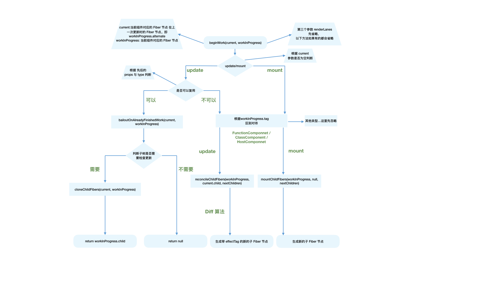
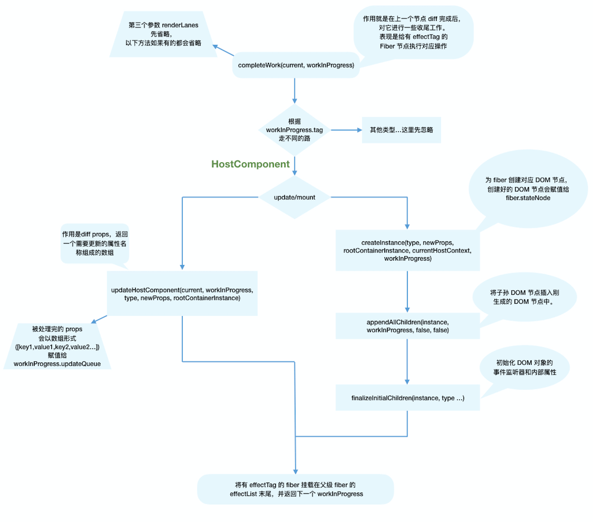

# render 阶段

## 流程概览

本章我们会讲解 Fiber 节点是如何被创建并构建 Fiber 树的。

render 阶段开始于 performSyncWorkOnRoot 或 performConcurrentWorkOnRoot 方法的调用。这取决于本次更新是同步更新还是异步更新。

我们现在还不需要学习这两个方法，只需要知道在这两个方法中会调用如下两个方法：

```js
// performSyncWorkOnRoot会调用该方法
function workLoopSync() {
  while (workInProgress !== null) {
    performUnitOfWork(workInProgress);
  }
}

// performConcurrentWorkOnRoot会调用该方法
function workLoopConcurrent() {
  while (workInProgress !== null && !shouldYield()) {
    performUnitOfWork(workInProgress);
  }
}
```

可以看到，他们唯一的区别是是否调用 shouldYield。如果当前浏览器帧没有剩余时间，shouldYield 会中止循环，直到浏览器有空闲时间后再继续遍历。

workInProgress 代表当前已创建的 workInProgress fiber。

performUnitOfWork 方法会创建下一个 Fiber 节点并赋值给 workInProgress，并将 workInProgress 与已创建的 Fiber 节点连接起来构成 Fiber 树。

> 你可以从[这里](https://github.com/facebook/react/blob/970fa122d8188bafa600e9b5214833487fbf1092/packages/react-reconciler/src/ReactFiberWorkLoop.new.js#L1599)看到 workLoopConcurrent 的源码

我们知道 Fiber Reconciler 是从 Stack Reconciler 重构而来，通过遍历的方式实现可中断的递归，所以 performUnitOfWork 的工作可以分为两部分：“递”和“归”。

### “递”阶段

首先从 rootFiber 开始向下深度优先遍历。为遍历到的每个 Fiber 节点调用 [beginWork 方法](https://github.com/facebook/react/blob/970fa122d8188bafa600e9b5214833487fbf1092/packages/react-reconciler/src/ReactFiberBeginWork.new.js#L3058)。

该方法会根据传入的 Fiber 节点创建子 Fiber 节点，并将这两个 Fiber 节点连接起来。

当遍历到叶子节点（即没有子组件的组件）时就会进入“归”阶段。

### “归”阶段

在“归”阶段会调用 [completeWork](https://github.com/facebook/react/blob/970fa122d8188bafa600e9b5214833487fbf1092/packages/react-reconciler/src/ReactFiberCompleteWork.new.js#L652) 处理 Fiber 节点。

当某个 Fiber 节点执行完 completeWork，如果其存在兄弟 Fiber 节点（即 fiber.sibling !== null），会进入其兄弟 Fiber 的“递”阶段。

如果不存在兄弟 Fiber，会进入父级 Fiber 的“归”阶段。

“递”和“归”阶段会交错执行直到“归”到 rootFiber。至此，render 阶段的工作就结束了。

### 例子

以上一节的例子举例：

```js
function App() {
  return (
    <div>
      i am
      <span>KaSong</span>
    </div>
  );
}

ReactDOM.render(<App />, document.getElementById('root'));
```

对应的 Fiber 树结构：


render 阶段会依次执行：

```sh
1. rootFiber beginWork
2. App Fiber beginWork
3. div Fiber beginWork
4. "i am" Fiber beginWork
5. "i am" Fiber completeWork
6. span Fiber beginWork
7. span Fiber completeWork
8. div Fiber completeWork
9. App Fiber completeWork
10. rootFiber completeWork
```

> 注意
>
> 之所以没有 “KaSong” Fiber 的 beginWork/completeWork，是因为作为一种性能优化手段，针对只有单一文本子节点的 Fiber，React 会特殊处理。

## beginWork

上一节我们了解到 render 阶段的工作可以分为“递”阶段和“归”阶段。其中“递”阶段会执行 beginWork，“归”阶段会执行 completeWork。这一节我们看看“递”阶段的 beginWork 方法究竟做了什么。

### 方法概览

可以从[源码这里](https://github.com/facebook/react/blob/1fb18e22ae66fdb1dc127347e169e73948778e5a/packages/react-reconciler/src/ReactFiberBeginWork.new.js#L3075)看到 beginWork 的定义。整个方法大概有 500 行代码。

从上一节我们已经知道，beginWork 的工作是传入当前 Fiber 节点，创建子 Fiber 节点，我们从传参来看看具体是如何做的。

#### 从传参看方法执行

```js
function beginWork(current: Fiber | null, workInProgress: Fiber, renderLanes: Lanes): Fiber | null {
  // ...省略函数体
}
```

其中传参：

- current：当前组件对应的 Fiber 节点在上一次更新时的 Fiber 节点，即 workInProgress.alternate
- workInProgress：当前组件对应的 Fiber 节点
- renderLanes：优先级相关，在讲解 Scheduler 时再讲解

从双缓存机制一节我们知道，除 rootFiber 以外， 组件 mount 时，由于是首次渲染，是不存在当前组件对应的 Fiber 节点在上一次更新时的 Fiber 节点，即 mount 时 current === null。

组件 update 时，由于之前已经 mount 过，所以 current !== null。

所以我们可以通过 `current === null` 来区分组件是处于 mount 还是 update。

基于此原因，beginWork 的工作可以分为两部分：

- update 时：如果 current 存在，在满足一定条件时可以复用 current 节点，这样就能克隆 current.child 作为 workInProgress.child，而不需要新建 workInProgress.child。
- mount 时：除 fiberRootNode 以外，current === null。会根据 fiber.tag 不同，创建不同类型的子 Fiber 节点

```js
function beginWork(current: Fiber | null, workInProgress: Fiber, renderLanes: Lanes): Fiber | null {
  // update 时：如果 current 存在可能存在优化路径
  // 可以复用 current（即上一次更新的 Fiber 节点）
  if (current !== null) {
    // ...省略

    // 复用 current
    return bailoutOnAlreadyFinishedWork(current, workInProgress, renderLanes);
  } else {
    didReceiveUpdate = false;
  }

  // mount 时：根据 tag 不同，创建不同的子 Fiber 节点
  switch (workInProgress.tag) {
    case IndeterminateComponent:
    // ...省略
    case LazyComponent:
    // ...省略
    case FunctionComponent:
    // ...省略
    case ClassComponent:
    // ...省略
    case HostRoot:
    // ...省略
    case HostComponent:
    // ...省略
    case HostText:
    // ...省略
    // ...省略其他类型
  }
}
```

### update 时

我们可以看到，满足如下情况时 didReceiveUpdate === false（即可以直接复用前一次更新的子 Fiber，不需要新建子 Fiber）

1. `oldProps === newProps && workInProgress.type === current.type`，即 props 与 fiber.type 不变
2. `!includesSomeLane(renderLanes, updateLanes)`，即当前 Fiber 节点优先级不够，会在讲解 Scheduler 时介绍

```js
if (current !== null) {
  const oldProps = current.memoizedProps;
  const newProps = workInProgress.pendingProps;

  if (oldProps !== newProps || hasLegacyContextChanged() || (__DEV__ ? workInProgress.type !== current.type : false)) {
    didReceiveUpdate = true;
  } else if (!includesSomeLane(renderLanes, updateLanes)) {
    didReceiveUpdate = false;
    switch (
      workInProgress.tag
      // 省略处理
    ) {
    }
    return bailoutOnAlreadyFinishedWork(current, workInProgress, renderLanes);
  } else {
    didReceiveUpdate = false;
  }
} else {
  didReceiveUpdate = false;
}
```

### mount 时

当不满足优化路径时，我们就进入第二部分，新建子 Fiber。

我们可以看到，根据 fiber.tag 不同，进入不同类型 Fiber 的创建逻辑。

可以从[这里](https://github.com/facebook/react/blob/1fb18e22ae66fdb1dc127347e169e73948778e5a/packages/react-reconciler/src/ReactWorkTags.js)看到 tag 对应的组件类型

```js
// mount 时：根据 tag 不同，创建不同的 Fiber 节点
switch (workInProgress.tag) {
  case IndeterminateComponent:
  // ...省略
  case LazyComponent:
  // ...省略
  case FunctionComponent:
  // ...省略
  case ClassComponent:
  // ...省略
  case HostRoot:
  // ...省略
  case HostComponent:
  // ...省略
  case HostText:
  // ...省略
  // ...省略其他类型
}
```

对于我们常见的组件类型，如（FunctionComponent/ClassComponent/HostComponent），最终会进入 reconcileChildren 方法。

### reconcileChildren

从该函数名就能看出这是 Reconciler 模块的核心部分。那么他究竟做了什么呢？

- 对于 mount 的组件，他会创建新的子 Fiber 节点
- 对于 update 的组件，他会将当前组件与该组件在上次更新时对应的 Fiber 节点比较（也就是俗称的 Diff 算法），将比较的结果生成新 Fiber 节点

```js
export function reconcileChildren(current: Fiber | null, workInProgress: Fiber, nextChildren: any, renderLanes: Lanes) {
  if (current === null) {
    // 对于mount的组件
    workInProgress.child = mountChildFibers(workInProgress, null, nextChildren, renderLanes);
  } else {
    // 对于update的组件
    workInProgress.child = reconcileChildFibers(workInProgress, current.child, nextChildren, renderLanes);
  }
}
```

从代码可以看出，和 beginWork 一样，他也是通过 `current === null` 区分 mount 与 update。

不论走哪个逻辑，最终他会生成新的子 Fiber 节点并赋值给 workInProgress.child，作为本次 beginWork 返回值，并作为下次 performUnitOfWork 执行时 workInProgress 的传参。

> 注意
>
> 值得一提的是，mountChildFibers 与 reconcileChildFibers 这两个方法的逻辑基本一致。唯一的区别是：reconcileChildFibers 会为生成的 Fiber 节点带上 effectTag 属性，而 mountChildFibers 不会。

### effectTag

我们知道，render 阶段的工作是在内存中进行，当工作结束后会通知 Renderer 需要执行的 DOM 操作。要执行 DOM 操作的具体类型就保存在 fiber.effectTag 中。

> 你可以从[这里](https://github.com/facebook/react/blob/1fb18e22ae66fdb1dc127347e169e73948778e5a/packages/react-reconciler/src/ReactSideEffectTags.js)看到 effectTag 对应的 DOM 操作

比如：

```js
// DOM 需要插入到页面中
export const Placement = /*                */ 0b00000000000010;
// DOM 需要更新
export const Update = /*                   */ 0b00000000000100;
// DOM 需要插入到页面中并更新
export const PlacementAndUpdate = /*       */ 0b00000000000110;
// DOM 需要删除
export const Deletion = /*                 */ 0b00000000001000;
```

> 通过二进制表示 effectTag，可以方便的使用位操作为 fiber.effectTag 赋值多个 effect。

那么，如果要通知 Renderer 将 Fiber 节点对应的 DOM 节点插入页面中，需要满足两个条件：

1. fiber.stateNode 存在，即 Fiber 节点中保存了对应的 DOM 节点
2. (fiber.effectTag & Placement) !== 0，即 Fiber 节点存在 Placement effectTag

我们知道，mount 时，`fiber.stateNode === null`，且在 reconcileChildren 中调用的 mountChildFibers 不会为 Fiber 节点赋值 effectTag。那么首屏渲染如何完成呢？

针对第一个问题，fiber.stateNode 会在 completeWork 中创建，我们会在下一节介绍。

第二个问题的答案十分巧妙：假设 mountChildFibers 也会赋值 effectTag，那么可以预见 mount 时整棵 Fiber 树所有节点都会有 Placement effectTag。那么 commit 阶段在执行 DOM 操作时每个节点都会执行一次插入操作，这样大量的 DOM 操作是极低效的。

为了解决这个问题，在 mount 时只有 rootFiber 会赋值 Placement effectTag，在 commit 阶段只会执行一次插入操作。

### 参考资料

beginWork 流程图



## completeWork

在流程概览一节我们了解组件在 render 阶段会经历 beginWork 与 completeWork。

上一节我们讲解了组件执行 beginWork 后会创建子 Fiber 节点，节点上可能存在 effectTag。

这一节让我们看看 completeWork 会做什么工作。

你可以从[这里](https://github.com/facebook/react/blob/1fb18e22ae66fdb1dc127347e169e73948778e5a/packages/react-reconciler/src/ReactFiberCompleteWork.new.js#L673)看到 completeWork 方法定义。

### 流程概览

类似 beginWork，completeWork 也是针对不同 fiber.tag 调用不同的处理逻辑。

```js
function completeWork(
  current: Fiber | null,
  workInProgress: Fiber,
  renderLanes: Lanes,
): Fiber | null {
  const newProps = workInProgress.pendingProps;

  switch (workInProgress.tag) {
    case IndeterminateComponent:
    case LazyComponent:
    case SimpleMemoComponent:
    case FunctionComponent:
    case ForwardRef:
    case Fragment:
    case Mode:
    case Profiler:
    case ContextConsumer:
    case MemoComponent:
      return null;
    case ClassComponent: {
      // ...省略
      return null;
    }
    case HostRoot: {
      // ...省略
      updateHostContainer(workInProgress);
      return null;
    }
    case HostComponent: {
      // ...省略
      return null;
    }
  // ...省略
```

我们重点关注页面渲染所必须的 HostComponent（即原生 DOM 组件对应的 Fiber 节点），其他类型 Fiber 的处理留在具体功能实现时讲解。

### 处理 HostComponent

和 beginWork 一样，我们根据 `current === null` 判断是 mount 还是 update。

同时针对 HostComponent，判断 update 时我们还需要考虑 `workInProgress.stateNode != null`（即该 Fiber 节点是否存在对应的 DOM 节点）

```js
case HostComponent: {
  popHostContext(workInProgress);
  const rootContainerInstance = getRootHostContainer();
  const type = workInProgress.type;

  if (current !== null && workInProgress.stateNode != null) {
    // update的情况
    // ...省略
  } else {
    // mount的情况
    // ...省略
  }
  return null;
}
```

### update 时

当 update 时，Fiber 节点已经存在对应 DOM 节点，所以不需要生成 DOM 节点。需要做的主要是处理 props，比如：

- onClick、onChange 等回调函数的注册
- 处理 style prop
- 处理 DANGEROUSLY_SET_INNER_HTML prop
- 处理 children prop

我们去掉一些当前不需要关注的功能（比如 ref），可以看到最主要的逻辑是调用 updateHostComponent 方法。

```js
if (current !== null && workInProgress.stateNode != null) {
  // update的情况
  updateHostComponent(current, workInProgress, type, newProps, rootContainerInstance);
}
```

你可以从[这里](https://github.com/facebook/react/blob/1fb18e22ae66fdb1dc127347e169e73948778e5a/packages/react-reconciler/src/ReactFiberCompleteWork.new.js#L225)看到 updateHostComponent 方法定义。

在 updateHostComponent 内部，被处理完的 props 会被赋值给 workInProgress.updateQueue，并最终会在 commit 阶段被渲染在页面上。

```js
workInProgress.updateQueue = (updatePayload: any);
```

其中 updatePayload 为数组形式，他的奇数索引的值为变化的 prop key，偶数索引的值为变化的 prop value。

> 具体渲染过程见 mutation 阶段一节

### mount 时

同样，我们省略了不相关的逻辑。可以看到，mount 时的主要逻辑包括三个：

- 为 Fiber 节点生成对应的 DOM 节点
- 将子孙 DOM 节点插入刚生成的 DOM 节点中
- 与 update 逻辑中的 updateHostComponent 类似的处理 props 的过程

```js
// mount 的情况

// ...省略服务端渲染相关逻辑

const currentHostContext = getHostContext();
// 为 fiber 创建对应 DOM 节点
const instance = createInstance(type, newProps, rootContainerInstance, currentHostContext, workInProgress);
// 将子孙 DOM 节点插入刚生成的 DOM 节点中
appendAllChildren(instance, workInProgress, false, false);
// DOM 节点赋值给 fiber.stateNode
workInProgress.stateNode = instance;

// 与 update 逻辑中的 updateHostComponent 类似的处理 props 的过程
if (finalizeInitialChildren(instance, type, newProps, rootContainerInstance, currentHostContext)) {
  markUpdate(workInProgress);
}
```

还记得上一节我们讲到：mount 时只会在 rootFiber 存在 Placement effectTag。那么 commit 阶段是如何通过一次插入 DOM 操作（对应一个 Placement effectTag）将整棵 DOM 树插入页面的呢？

原因就在于 completeWork 中的 appendAllChildren 方法。

由于 completeWork 属于“归”阶段调用的函数，每次调用 appendAllChildren 时都会将已生成的子孙 DOM 节点插入当前生成的 DOM 节点下。那么当“归”到 rootFiber 时，我们已经有一个构建好的离屏 DOM 树。

### effectList

至此 render 阶段的绝大部分工作就完成了。

还有一个问题：作为 DOM 操作的依据，commit 阶段需要找到所有有 effectTag 的 Fiber 节点并依次执行 effectTag 对应操作。难道需要在 commit 阶段再遍历一次 Fiber 树寻找 `effectTag !== null` 的 Fiber 节点么？

这显然是很低效的。

为了解决这个问题，在 completeWork 的上层函数 completeUnitOfWork 中，每个执行完 completeWork 且存在 effectTag 的 Fiber 节点会被保存在一条被称为 effectList 的单向链表中。

effectList 中第一个 Fiber 节点保存在 fiber.firstEffect，最后一个元素保存在 fiber.lastEffect。

类似 appendAllChildren，在“归”阶段，所有有 effectTag 的 Fiber 节点都会被追加在 effectList 中，最终形成一条以 rootFiber.firstEffect 为起点的单向链表。

```
                       nextEffect         nextEffect
rootFiber.firstEffect -----------> fiber -----------> fiber
```

这样，在 commit 阶段只需要遍历 effectList 就能执行所有 effect 了。

你可以在[这里](https://github.com/facebook/react/blob/1fb18e22ae66fdb1dc127347e169e73948778e5a/packages/react-reconciler/src/ReactFiberWorkLoop.new.js#L1744)看到这段代码逻辑。

借用 React 团队成员 Dan Abramov 的话：effectList 相较于 Fiber 树，就像圣诞树上挂的那一串彩灯。

### 流程结尾

至此，render 阶段全部工作完成。在 performSyncWorkOnRoot 函数中 fiberRootNode 被传递给 commitRoot 方法，开启 commit 阶段工作流程。

```js
commitRoot(root);
```

代码见[这里](https://github.com/facebook/react/blob/1fb18e22ae66fdb1dc127347e169e73948778e5a/packages/react-reconciler/src/ReactFiberWorkLoop.new.js#L1107)。

### 参考资料



# commit 阶段

## 流程概览

commitRoot 方法是 commit 阶段工作的起点，fiberRootNode 会作为传参。

```js
commitRoot(root);
```

在 rootFiber.firstEffect 上保存了一条需要执行副作用的 Fiber 节点的单向链表 effectList，这些 Fiber 节点的 updateQueue 中保存了变化的 props。

这些副作用对应的 DOM 操作在 commit 阶段执行。

除此之外，一些生命周期钩子（比如 componentDidXXX）、hook（比如 useEffect）需要在 commit 阶段执行。

commit 阶段的主要工作（即 Renderer 的工作流程）分为三部分：

- before mutation 阶段（执行 DOM 操作前）
- mutation 阶段（执行 DOM 操作）
- layout 阶段（执行 DOM 操作后）

你可以从[这里](https://github.com/facebook/react/blob/1fb18e22ae66fdb1dc127347e169e73948778e5a/packages/react-reconciler/src/ReactFiberWorkLoop.new.js#L2001)看到 commit 阶段的完整代码

在 before mutation 阶段之前和 layout 阶段之后还有一些额外工作，涉及到比如 useEffect 的触发、优先级相关的重置、ref 的绑定/解绑。

这些对我们当前属于超纲内容，为了内容完整性，在这节简单介绍。

### before mutation 之前

commitRootImpl 方法中直到第一句 `if (firstEffect !== null)` 之前属于 before mutation 之前。

我们大体看下他做的工作，现在你还不需要理解他们：

```js
do {
  // 触发 useEffect 回调与其他同步任务。由于这些任务可能触发新的渲染，所以这里要一直遍历执行直到没有任务
  flushPassiveEffects();
} while (rootWithPendingPassiveEffects !== null);

// root 指 fiberRootNode
// root.finishedWork 指当前应用的 rootFiber
const finishedWork = root.finishedWork;

// 凡是变量名带 lane 的都是优先级相关
const lanes = root.finishedLanes;
if (finishedWork === null) {
  return null;
}
root.finishedWork = null;
root.finishedLanes = NoLanes;

// 重置 Scheduler 绑定的回调函数
root.callbackNode = null;
root.callbackId = NoLanes;

let remainingLanes = mergeLanes(finishedWork.lanes, finishedWork.childLanes);
// 重置优先级相关变量
markRootFinished(root, remainingLanes);

// 清除已完成的 discrete updates，例如：用户鼠标点击触发的更新。
if (rootsWithPendingDiscreteUpdates !== null) {
  if (!hasDiscreteLanes(remainingLanes) && rootsWithPendingDiscreteUpdates.has(root)) {
    rootsWithPendingDiscreteUpdates.delete(root);
  }
}

// 重置全局变量
if (root === workInProgressRoot) {
  workInProgressRoot = null;
  workInProgress = null;
  workInProgressRootRenderLanes = NoLanes;
} else {
}

// 将 effectList 赋值给 firstEffect
// 由于每个 fiber 的 effectList 只包含他的子孙节点
// 所以根节点如果有 effectTag 则不会被包含进来
// 所以这里将有 effectTag 的根节点插入到 effectList 尾部
// 这样才能保证有 effect 的 fiber 都在 effectList 中
let firstEffect;
if (finishedWork.effectTag > PerformedWork) {
  if (finishedWork.lastEffect !== null) {
    finishedWork.lastEffect.nextEffect = finishedWork;
    firstEffect = finishedWork.firstEffect;
  } else {
    firstEffect = finishedWork;
  }
} else {
  // 根节点没有 effectTag
  firstEffect = finishedWork.firstEffect;
}
```

可以看到，before mutation 之前主要做一些变量赋值，状态重置的工作。

这一长串代码我们只需要关注最后赋值的 firstEffect，在 commit 的三个子阶段都会用到他。

### layout 之后

接下来让我们简单看下 layout 阶段执行完后的代码，现在你还不需要理解他们：

```js
const rootDidHavePassiveEffects = rootDoesHavePassiveEffects;

// useEffect 相关
if (rootDoesHavePassiveEffects) {
  rootDoesHavePassiveEffects = false;
  rootWithPendingPassiveEffects = root;
  pendingPassiveEffectsLanes = lanes;
  pendingPassiveEffectsRenderPriority = renderPriorityLevel;
} else {
}

// 性能优化相关
if (remainingLanes !== NoLanes) {
  if (enableSchedulerTracing) {
    // ...
  }
} else {
  // ...
}

// 性能优化相关
if (enableSchedulerTracing) {
  if (!rootDidHavePassiveEffects) {
    // ...
  }
}

// ...检测无限循环的同步任务
if (remainingLanes === SyncLane) {
  // ...
}

// 在离开 commitRoot 函数前调用，触发一次新的调度，确保任何附加的任务被调度
ensureRootIsScheduled(root, now());

// ...处理未捕获错误及老版本遗留的边界问题

// 执行同步任务，这样同步任务不需要等到下次事件循环再执行
// 比如在 componentDidMount 中执行 setState 创建的更新会在这里被同步执行
// 或 useLayoutEffect
flushSyncCallbackQueue();

return null;
```

> 你可以在[这里](https://github.com/facebook/react/blob/1fb18e22ae66fdb1dc127347e169e73948778e5a/packages/react-reconciler/src/ReactFiberWorkLoop.new.js#L2195)看到这段代码

主要包括三点内容：

1. useEffect 相关的处理。

   我们会在讲解 layout 阶段时讲解。

2. 性能追踪相关。

   源码里有很多和 interaction 相关的变量。他们都和追踪 React 渲染时间、性能相关，在 [Profiler API](https://zh-hans.reactjs.org/docs/profiler.html) 和 [DevTools](https://github.com/facebook/react-devtools/pull/1069) 中使用。

   你可以在这里看到 [interaction](https://gist.github.com/bvaughn/8de925562903afd2e7a12554adcdda16#overview) 的定义

3. 在 commit 阶段会触发一些生命周期钩子（如 componentDidXXX）和 hook（如 useLayoutEffect、useEffect）。

   在这些回调方法中可能触发新的更新，新的更新会开启新的 render-commit 流程。

## before mutation 阶段

在本节正式开始前，让我们复习下这一章到目前为止所学的。

Renderer 工作的阶段被称为 commit 阶段，commit 阶段可以分为三个子阶段：

- before mutation 阶段（执行 DOM 操作前）
- mutation 阶段（执行 DOM 操作）
- layout 阶段（执行 DOM 操作后）

本节我们看看 before mutation 阶段（执行 DOM 操作前）都做了什么。

### 概览

before mutation 阶段的代码很短，整个过程就是遍历 effectList 并调用 commitBeforeMutationEffects 函数处理。

这部分源码在[这里](https://github.com/facebook/react/blob/1fb18e22ae66fdb1dc127347e169e73948778e5a/packages/react-reconciler/src/ReactFiberWorkLoop.new.js#L2104-L2127)。为了增加可读性，示例代码中删除了不相关的逻辑

```js
// 保存之前的优先级，以同步优先级执行，执行完毕后恢复之前优先级
const previousLanePriority = getCurrentUpdateLanePriority();
setCurrentUpdateLanePriority(SyncLanePriority);

// 将当前上下文标记为 CommitContext，作为 commit 阶段的标志
const prevExecutionContext = executionContext;
executionContext |= CommitContext;

// 处理 focus 状态
focusedInstanceHandle = prepareForCommit(root.containerInfo);
shouldFireAfterActiveInstanceBlur = false;

// beforeMutation 阶段的主函数
commitBeforeMutationEffects(finishedWork);

focusedInstanceHandle = null;
```

我们重点关注 beforeMutation 阶段的主函数 commitBeforeMutationEffects 做了什么。

### commitBeforeMutationEffects

大体代码逻辑：

```js
function commitBeforeMutationEffects() {
  while (nextEffect !== null) {
    const current = nextEffect.alternate;

    if (!shouldFireAfterActiveInstanceBlur && focusedInstanceHandle !== null) {
      // ...focus blur 相关
    }

    const effectTag = nextEffect.effectTag;

    // 调用 getSnapshotBeforeUpdate
    if ((effectTag & Snapshot) !== NoEffect) {
      commitBeforeMutationEffectOnFiber(current, nextEffect);
    }

    // 调度 useEffect
    if ((effectTag & Passive) !== NoEffect) {
      if (!rootDoesHavePassiveEffects) {
        rootDoesHavePassiveEffects = true;
        scheduleCallback(NormalSchedulerPriority, () => {
          flushPassiveEffects();
          return null;
        });
      }
    }
    nextEffect = nextEffect.nextEffect;
  }
}
```

整体可以分为三部分：

1. 处理 DOM 节点渲染/删除后的 autoFocus、blur 逻辑。
2. 调用 getSnapshotBeforeUpdate 生命周期钩子。
3. 调度 useEffect。

我们讲解下 2、3 两点。

### 调用 getSnapshotBeforeUpdate

commitBeforeMutationEffectOnFiber 是 commitBeforeMutationLifeCycles 的别名。

在该方法内会调用 getSnapshotBeforeUpdate。

你可以在[这里](https://github.com/facebook/react/blob/1fb18e22ae66fdb1dc127347e169e73948778e5a/packages/react-reconciler/src/ReactFiberCommitWork.old.js#L222)看到这段逻辑

从 Reactv16 开始，componentWillXXX 钩子前增加了 UNSAFE\_ 前缀。

究其原因，是因为 Stack Reconciler 重构为 Fiber Reconciler 后，render 阶段的任务可能中断/重新开始，对应的组件在 render 阶段的生命周期钩子（即 componentWillXXX）可能触发多次。

这种行为和 Reactv15 不一致，所以标记为 UNSAFE\_。

更详细的解释参照[这里](https://juejin.im/post/6847902224287285255#comment)

为此，React 提供了替代的生命周期钩子 getSnapshotBeforeUpdate。

我们可以看见，getSnapshotBeforeUpdate 是在 commit 阶段内的 before mutation 阶段调用的，由于 commit 阶段是同步的，所以不会遇到多次调用的问题。

### 调度 useEffect

在这几行代码内，scheduleCallback 方法由 Scheduler 模块提供，用于以某个优先级异步调度一个回调函数。

```js
// 调度 useEffect
if ((effectTag & Passive) !== NoEffect) {
  if (!rootDoesHavePassiveEffects) {
    rootDoesHavePassiveEffects = true;
    scheduleCallback(NormalSchedulerPriority, () => {
      // 触发 useEffect
      flushPassiveEffects();
      return null;
    });
  }
}
```

在此处，被异步调度的回调函数就是触发 useEffect 的方法 flushPassiveEffects。

我们接下来讨论 useEffect 如何被异步调度，以及为什么要异步（而不是同步）调度。

#### 如何异步调度

在 flushPassiveEffects 方法内部会从全局变量 rootWithPendingPassiveEffects 获取 effectList。

关于 flushPassiveEffects 的具体讲解参照 useEffect 与 useLayoutEffect 一节

在 completeWork 一节我们讲到，effectList 中保存了需要执行副作用的 Fiber 节点。其中副作用包括

- 插入 DOM 节点（Placement）
- 更新 DOM 节点（Update）
- 删除 DOM 节点（Deletion）

除此外，当一个 FunctionComponent 含有 useEffect 或 useLayoutEffect，他对应的 Fiber 节点也会被赋值 effectTag。

你可以从[这里](https://github.com/facebook/react/blob/1fb18e22ae66fdb1dc127347e169e73948778e5a/packages/react-reconciler/src/ReactHookEffectTags.js)看到 hook 相关的 effectTag

在 flushPassiveEffects 方法内部会遍历 rootWithPendingPassiveEffects（即 effectList）执行 effect 回调函数。

如果在此时直接执行 `rootWithPendingPassiveEffects === null`。

那么 rootWithPendingPassiveEffects 会在何时赋值呢？

在上一节 layout 之后的代码片段中会根据 `rootDoesHavePassiveEffects === true` 决定是否赋值 rootWithPendingPassiveEffects。

```js
const rootDidHavePassiveEffects = rootDoesHavePassiveEffects;
if (rootDoesHavePassiveEffects) {
  rootDoesHavePassiveEffects = false;
  rootWithPendingPassiveEffects = root;
  pendingPassiveEffectsLanes = lanes;
  pendingPassiveEffectsRenderPriority = renderPriorityLevel;
}
```

所以整个 useEffect 异步调用分为三步：

1. before mutation 阶段在 scheduleCallback 中调度 flushPassiveEffects
2. layout 阶段之后将 effectList 赋值给 rootWithPendingPassiveEffects
3. scheduleCallback 触发 flushPassiveEffects，flushPassiveEffects 内部遍历 rootWithPendingPassiveEffects

#### 为什么需要异步调用

摘录自 React 文档 effect 的执行时机：

与 componentDidMount、componentDidUpdate 不同的是，在浏览器完成布局与绘制之后，传给 useEffect 的函数会延迟调用。这使得它适用于许多常见的副作用场景，比如设置订阅和事件处理等情况，因此不应在函数中执行阻塞浏览器更新屏幕的操作。

可见，useEffect 异步执行的原因主要是防止同步执行时阻塞浏览器渲染。

### 总结

经过本节学习，我们知道了在 before mutation 阶段，会遍历 effectList，依次执行：

1. 处理 DOM 节点渲染/删除后的 autoFocus、blur 逻辑
2. 调用 getSnapshotBeforeUpdate 生命周期钩子
3. 调度 useEffect

## mutation 阶段

终于到了执行 DOM 操作的 mutation 阶段

### 概览

类似 before mutation 阶段，mutation 阶段也是遍历 effectList，执行函数。这里执行的是 commitMutationEffects。

```js
nextEffect = firstEffect;
do {
  try {
    commitMutationEffects(root, renderPriorityLevel);
  } catch (error) {
    invariant(nextEffect !== null, 'Should be working on an effect.');
    captureCommitPhaseError(nextEffect, error);
    nextEffect = nextEffect.nextEffect;
  }
} while (nextEffect !== null);
```

### commitMutationEffects

代码如下：

> 你可以在[这里](https://github.com/facebook/react/blob/1fb18e22ae66fdb1dc127347e169e73948778e5a/packages/react-reconciler/src/ReactFiberWorkLoop.old.js#L2091)看到 commitMutationEffects 源码

```js
function commitMutationEffects(root: FiberRoot, renderPriorityLevel) {
  // 遍历 effectList
  while (nextEffect !== null) {
    const effectTag = nextEffect.effectTag;

    // 根据 ContentReset effectTag 重置文字节点
    if (effectTag & ContentReset) {
      commitResetTextContent(nextEffect);
    }

    // 更新 ref
    if (effectTag & Ref) {
      const current = nextEffect.alternate;
      if (current !== null) {
        commitDetachRef(current);
      }
    }

    // 根据 effectTag 分别处理
    const primaryEffectTag = effectTag & (Placement | Update | Deletion | Hydrating);
    switch (primaryEffectTag) {
      // 插入DOM
      case Placement: {
        commitPlacement(nextEffect);
        nextEffect.effectTag &= ~Placement;
        break;
      }
      // 插入 DOM 并更新 DOM
      case PlacementAndUpdate: {
        // 插入
        commitPlacement(nextEffect);
        nextEffect.effectTag &= ~Placement;
        // 更新
        const current = nextEffect.alternate;
        commitWork(current, nextEffect);
        break;
      }
      // SSR
      case Hydrating: {
        nextEffect.effectTag &= ~Hydrating;
        break;
      }
      // SSR
      case HydratingAndUpdate: {
        nextEffect.effectTag &= ~Hydrating;

        const current = nextEffect.alternate;
        commitWork(current, nextEffect);
        break;
      }
      // 更新 DOM
      case Update: {
        const current = nextEffect.alternate;
        commitWork(current, nextEffect);
        break;
      }
      // 删除 DOM
      case Deletion: {
        commitDeletion(root, nextEffect, renderPriorityLevel);
        break;
      }
    }

    nextEffect = nextEffect.nextEffect;
  }
}
```

commitMutationEffects 会遍历 effectList，对每个 Fiber 节点执行如下三个操作：

1. 根据 ContentReset effectTag 重置文字节点
2. 更新 ref
3. 根据 effectTag 分别处理，其中 effectTag 包括 (Placement | Update | Deletion | Hydrating)

我们关注步骤三中的 Placement | Update | Deletion。Hydrating 作为服务端渲染相关，我们先不关注。

### Placement effect

当 Fiber 节点含有 Placement effectTag，意味着该 Fiber 节点对应的 DOM 节点需要插入到页面中。

调用的方法为 commitPlacement。

> 你可以在[这里](https://github.com/facebook/react/blob/970fa122d8188bafa600e9b5214833487fbf1092/packages/react-reconciler/src/ReactFiberCommitWork.new.js#L1156)看到 commitPlacement 源码

该方法所做的工作分为三步：

1. 获取父级 DOM 节点。其中 finishedWork 为传入的 Fiber 节点。

   ```js
   const parentFiber = getHostParentFiber(finishedWork);
   // 父级 DOM 节点
   const parentStateNode = parentFiber.stateNode;
   ```

2. 获取 Fiber 节点的 DOM 兄弟节点

   ```js
   const before = getHostSibling(finishedWork);
   ```

3. 根据 DOM 兄弟节点是否存在决定调用 parentNode.insertBefore 或 parentNode.appendChild 执行 DOM 插入操作。

   ```js
   // parentStateNode 是否是 rootFiber
   if (isContainer) {
     insertOrAppendPlacementNodeIntoContainer(finishedWork, before, parent);
   } else {
     insertOrAppendPlacementNode(finishedWork, before, parent);
   }
   ```

值得注意的是，getHostSibling（获取兄弟 DOM 节点）的执行很耗时，当在同一个父 Fiber 节点下依次执行多个插入操作，getHostSibling 算法的复杂度为指数级。

这是由于 Fiber 节点不只包括 HostComponent，所以 Fiber 树和渲染的 DOM 树节点并不是一一对应的。要从 Fiber 节点找到 DOM 节点很可能跨层级遍历。

考虑如下例子：

```jsx
function Item() {
  return <li><li>;
}

function App() {
  return (
    <div>
      <Item/>
    </div>
  )
}

ReactDOM.render(<App/>, document.getElementById('root'));
```

对应的 Fiber 树和 DOM 树 结构为：

```
// Fiber树
          child      child      child       child
rootFiber -----> App -----> div -----> Item -----> li

// DOM树
#root ---> div ---> li
```

当在 div 的子节点 Item 前插入一个新节点 p，即 App 变为：

```jsx
function App() {
  return (
    <div>
      <p></p>
      <Item />
    </div>
  );
}
```

对应的 Fiber 树和 DOM 树结构为：

```
// Fiber树
          child      child      child
rootFiber -----> App -----> div -----> p
                                       | sibling       child
                                       | -------> Item -----> li
// DOM树
#root ---> div ---> p
             |
               ---> li
```

此时 DOM 节点 p 的兄弟节点为 li，而 Fiber 节点 p 对应的兄弟 DOM 节点为：

```
fiberP.sibling.child
```

即 fiber p 的兄弟 fiber Item 的子 fiber li

### Update effect

当 Fiber 节点含有 Update effectTag，意味着该 Fiber 节点需要更新。调用的方法为 commitWork，他会根据 Fiber.tag 分别处理。

> 你可以在[这里](https://github.com/facebook/react/blob/970fa122d8188bafa600e9b5214833487fbf1092/packages/react-reconciler/src/ReactFiberCommitWork.new.js#L1441)看到 commitWork 源码

这里我们主要关注 FunctionComponent 和 HostComponent。

#### FunctionComponent mutation

当 fiber.tag 为 FunctionComponent，会调用 commitHookEffectListUnmount。该方法会遍历 effectList，执行所有 useLayoutEffect hook 的销毁函数。

> 你可以在[这里](https://github.com/facebook/react/blob/970fa122d8188bafa600e9b5214833487fbf1092/packages/react-reconciler/src/ReactFiberCommitWork.new.js#L314)看到 commitHookEffectListUnmount 源码

所谓“销毁函数”，见如下例子：

```js
useLayoutEffect(() => {
  // ...一些副作用逻辑

  return () => {
    // ...这就是销毁函数
  };
});
```

你不需要很了解 useLayoutEffect，我们会在下一节详细介绍。你只需要知道在 mutation 阶段会执行 useLayoutEffect 的销毁函数。

#### HostComponent mutation

当 fiber.tag 为 HostComponent，会调用 commitUpdate。

你可以在[这里](https://github.com/facebook/react/blob/970fa122d8188bafa600e9b5214833487fbf1092/packages/react-dom/src/client/ReactDOMHostConfig.js#L423)看到 commitUpdate 源码

最终会在 updateDOMProperties 中将 render 阶段 completeWork 中为 Fiber 节点赋值的 updateQueue 对应的内容渲染在页面上。

```js
for (let i = 0; i < updatePayload.length; i += 2) {
  const propKey = updatePayload[i];
  const propValue = updatePayload[i + 1];

  // 处理 style
  if (propKey === STYLE) {
    setValueForStyles(domElement, propValue);
    // 处理 DANGEROUSLY_SET_INNER_HTML
  } else if (propKey === DANGEROUSLY_SET_INNER_HTML) {
    setInnerHTML(domElement, propValue);
    // 处理 children
  } else if (propKey === CHILDREN) {
    setTextContent(domElement, propValue);
  } else {
    // 处理剩余 props
    setValueForProperty(domElement, propKey, propValue, isCustomComponentTag);
  }
}
```

### Deletion effect

当 Fiber 节点含有 Deletion effectTag，意味着该 Fiber 节点对应的 DOM 节点需要从页面中删除。调用的方法为 commitDeletion。

> 你可以在[这里](https://github.com/facebook/react/blob/970fa122d8188bafa600e9b5214833487fbf1092/packages/react-reconciler/src/ReactFiberCommitWork.new.js#L1421)看到 commitDeletion 源码

该方法会执行如下操作：

1. 递归调用 Fiber 节点及其子孙 Fiber 节点中 fiber.tag 为 ClassComponent 的 componentWillUnmount 生命周期钩子，从页面移除 Fiber 节点对应 DOM 节点
2. 解绑 ref
3. 调度 useEffect 的销毁函数

### 总结

从这节我们学到，mutation 阶段会遍历 effectList，依次执行 commitMutationEffects。该方法的主要工作为“根据 effectTag 调用不同的处理函数处理 Fiber。

## layout 阶段

该阶段之所以称为 layout，因为该阶段的代码都是在 DOM 渲染完成（mutation 阶段完成）后执行的。

该阶段触发的生命周期钩子和 hook 可以直接访问到已经改变后的 DOM，即该阶段是可以参与 DOM layout 的阶段。

### 概览

与前两个阶段类似，layout 阶段也是遍历 effectList，执行函数。

具体执行的函数是 commitLayoutEffects。

```js
root.current = finishedWork;

nextEffect = firstEffect;
do {
  try {
    commitLayoutEffects(root, lanes);
  } catch (error) {
    invariant(nextEffect !== null, 'Should be working on an effect.');
    captureCommitPhaseError(nextEffect, error);
    nextEffect = nextEffect.nextEffect;
  }
} while (nextEffect !== null);

nextEffect = null;
```

### commitLayoutEffects

代码如下：

> 你可以在[这里](https://github.com/facebook/react/blob/970fa122d8188bafa600e9b5214833487fbf1092/packages/react-reconciler/src/ReactFiberWorkLoop.new.js#L2302)看到 commitLayoutEffects 源码

```js
function commitLayoutEffects(root: FiberRoot, committedLanes: Lanes) {
  while (nextEffect !== null) {
    const effectTag = nextEffect.effectTag;

    // 调用生命周期钩子和 hook
    if (effectTag & (Update | Callback)) {
      const current = nextEffect.alternate;
      commitLayoutEffectOnFiber(root, current, nextEffect, committedLanes);
    }

    // 赋值 ref
    if (effectTag & Ref) {
      commitAttachRef(nextEffect);
    }

    nextEffect = nextEffect.nextEffect;
  }
}
```

commitLayoutEffects 一共做了两件事：

1. commitLayoutEffectOnFiber（调用生命周期钩子和 hook 相关操作）
2. commitAttachRef（赋值 ref）

### commitLayoutEffectOnFiber

commitLayoutEffectOnFiber 方法会根据 fiber.tag 对不同类型的节点分别处理。

> 你可以在[这里](https://github.com/facebook/react/blob/970fa122d8188bafa600e9b5214833487fbf1092/packages/react-reconciler/src/ReactFiberCommitWork.new.js#L459)看到 commitLayoutEffectOnFiber 源码（commitLayoutEffectOnFiber 为别名，方法原名为 commitLifeCycles）

- 对于 ClassComponent，他会通过 `current === null` 区分是 mount 还是 update，调用 componentDidMount 或 componentDidUpdate。

  触发状态更新的 this.setState 如果赋值了第二个参数回调函数，也会在此时调用。

  ```js
  this.setState({ xxx: 1 }, () => {
    console.log('i am update~');
  });
  ```

- 对于 FunctionComponent 及相关类型，他会调用 useLayoutEffect hook 的回调函数，调度 useEffect 的销毁与回调函数

  相关类型指特殊处理后的 FunctionComponent，比如 ForwardRef、React.memo 包裹的 FunctionComponent

  ```js
  switch (finishedWork.tag) {
    // 以下都是 FunctionComponent 及相关类型
    case FunctionComponent:
    case ForwardRef:
    case SimpleMemoComponent:
    case Block: {
      // 执行 useLayoutEffect 的回调函数
      commitHookEffectListMount(HookLayout | HookHasEffect, finishedWork);
      // 调度 useEffect 的销毁函数与回调函数
      schedulePassiveEffects(finishedWork);
      return;
  }
  ```

  > 你可以从[这里](https://github.com/facebook/react/blob/1fb18e22ae66fdb1dc127347e169e73948778e5a/packages/react-reconciler/src/ReactFiberCommitWork.old.js#L465-L491)看到这段代码

在上一节介绍过，mutation 阶段会执行 useLayoutEffect hook 的销毁函数。

结合这里我们可以发现，useLayoutEffect hook 从上一次更新的销毁函数调用到本次更新的回调函数调用是同步执行的。

而 useEffect 则需要先调度，在 Layout 阶段完成后再异步执行。

这就是 useLayoutEffect 与 useEffect 的区别。

- 对于 HostRoot，即 rootFiber，如果赋值了第三个参数回调函数，也会在此时调用。

  ```js
  ReactDOM.render(<App />, document.querySelector('#root'), function() {
    console.log('i am mount~');
  });
  ```

### commitAttachRef

commitLayoutEffects 会做的第二件事是 commitAttachRef。

> 你可以在[这里](https://github.com/facebook/react/blob/970fa122d8188bafa600e9b5214833487fbf1092/packages/react-reconciler/src/ReactFiberCommitWork.new.js#L823)看到 commitAttachRef 源码

```js
function commitAttachRef(finishedWork: Fiber) {
  const ref = finishedWork.ref;
  if (ref !== null) {
    const instance = finishedWork.stateNode;

    // 获取 DOM 实例
    let instanceToUse;
    switch (finishedWork.tag) {
      case HostComponent:
        instanceToUse = getPublicInstance(instance);
        break;
      default:
        instanceToUse = instance;
    }

    if (typeof ref === 'function') {
      // 如果 ref 是函数形式，调用回调函数
      ref(instanceToUse);
    } else {
      // 如果 ref 是 ref 实例形式，赋值 ref.current
      ref.current = instanceToUse;
    }
  }
}
```

代码逻辑很简单：获取 DOM 实例，更新 ref。

### current Fiber 树切换

至此，整个 layout 阶段就结束了。

在结束本节的学习前，我们关注下这行代码：

```js
root.current = finishedWork;
```

> 你可以在[这里](https://github.com/facebook/react/blob/970fa122d8188bafa600e9b5214833487fbf1092/packages/react-reconciler/src/ReactFiberWorkLoop.new.js#L2022)看到这行代码

在双缓存机制一节我们介绍过，workInProgress Fiber 树在 commit 阶段完成渲染后会变为 current Fiber 树。这行代码的作用就是切换 fiberRootNode 指向的 current Fiber 树。

那么这行代码为什么在这里呢？（在 mutation 阶段结束后，layout 阶段开始前。）

我们知道 componentWillUnmount 会在 mutation 阶段执行。此时 current Fiber 树还指向前一次更新的 Fiber 树，在生命周期钩子内获取的 DOM 还是更新前的。

componentDidMount 和 componentDidUpdate 会在 layout 阶段执行。此时 current Fiber 树已经指向更新后的 Fiber 树，在生命周期钩子内获取的 DOM 就是更新后的。

### 总结

从这节我们学到，layout 阶段会遍历 effectList，依次执行 commitLayoutEffects。该方法的主要工作为“根据 effectTag 调用不同的处理函数处理 Fiber 并更新 ref。
