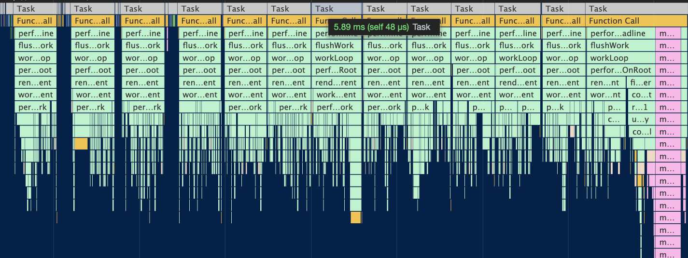
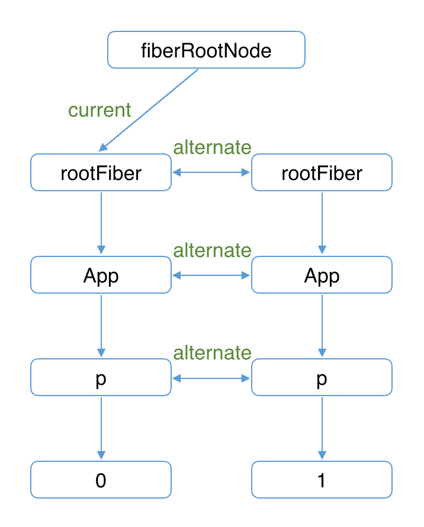
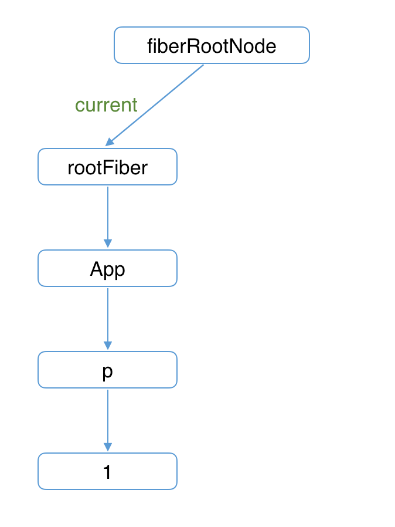

# React 理念

## React 理念

我们可以从官网看到 React 的理念：

> 我们认为，React 是用 JavaScript 构建快速响应的大型 Web 应用程序的首选方式。它在 Facebook 和 Instagram 上表现优秀。

可见，关键是实现快速响应。那么制约快速响应的因素是什么呢？

我们日常使用 App，浏览网页时，有两类场景会制约快速响应：

- 当遇到大计算量的操作或者设备性能不足使页面掉帧，导致卡顿。
- 发送网络请求后，由于需要等待数据返回才能进一步操作导致不能快速响应。

这两类场景可以概括为：

- CPU 的瓶颈
- IO 的瓶颈

React 是如何解决这两个瓶颈的呢？

### CPU 的瓶颈

当项目变得庞大、组件数量繁多时，就容易遇到 CPU 的瓶颈。

考虑如下 Demo，我们向视图中渲染 3000 个 li：

```jsx
function App() {
  const len = 3000;
  return (
    <ul>
      {Array(len)
        .fill(0)
        .map((_, i) => (
          <li>{i}</li>
        ))}
    </ul>
  );
}

const rootEl = document.querySelector('#root');
ReactDOM.render(<App />, rootEl);
```

主流浏览器刷新频率为 60Hz，即每 （1000ms / 60Hz）16.6ms 浏览器刷新一次。

我们知道，JS 可以操作 DOM，GUI 渲染线程与 JS 线程是互斥的。所以 JS 脚本执行和浏览器布局、绘制不能同时执行。

在每 16.6ms 时间内，需要完成如下工作：

```
JS 脚本执行 -----  样式布局 ----- 样式绘制
```

当 JS 执行时间过长，超出了 16.6ms，这次刷新就没有时间执行样式布局和样式绘制了。

在 Demo 中，由于组件数量繁多（3000 个），JS 脚本执行时间过长，页面掉帧，造成卡顿。

可以从打印的执行堆栈图看到，JS 执行时间为 73.65ms，远远多于一帧的时间。


如何解决这个问题呢？

答案是：在浏览器每一帧的时间中，预留一些时间给 JS 线程，React 利用这部分时间更新组件（可以看到，在源码中，预留的初始时间是 5ms）。

当预留的时间不够用时，React 将线程控制权交还给浏览器使其有时间渲染 UI，React 则等待下一帧时间到来继续被中断的工作。

> 这种将长任务分拆到每一帧中，像蚂蚁搬家一样一次执行一小段任务的操作，被称为时间切片（time slice）

接下来我们开启 Concurrent Mode（后续章节会讲到，当前你只需了解开启后会启用时间切片）：

```js
// 通过使用ReactDOM.unstable_createRoot开启Concurrent Mode
// ReactDOM.render(<App/>, rootEl);
ReactDOM.unstable_createRoot(rootEl).render(<App />);
```

此时我们的长任务被拆分到每一帧不同的 task 中，JS 脚本执行时间大体在 5ms 左右，这样浏览器就有剩余时间执行样式布局和样式绘制，减少掉帧的可能性。



所以，解决 CPU 瓶颈的关键是实现时间切片，而时间切片的关键是：将同步的更新变为可中断的异步更新。

### IO 的瓶颈

网络延迟是前端开发者无法解决的。如何在网络延迟客观存在的情况下，减少用户对网络延迟的感知？

React 给出的答案是将人机交互研究的结果整合到真实的 UI 中。

这里我们以业界人机交互最顶尖的苹果举例，在 IOS 系统中：

点击“设置”面板中的“通用”，进入“通用”界面：

<a target="_blank" href="./res/legacy-move.gif">通用</a>

作为对比，再点击“设置”面板中的“Siri 与搜索”，进入“Siri 与搜索”界面：

<a target="_blank" href="./res/concurrent-move.gif">Siri 与搜索</a>

你能感受到两者体验上的区别么？

事实上，点击“通用”后的交互是同步的，直接显示后续界面。而点击“Siri 与搜索”后的交互是异步的，需要等待请求返回后再显示后续界面。但从用户感知来看，这两者的区别微乎其微。

这里的窍门在于：点击“Siri 与搜索”后，先在当前页面停留了一小段时间，这一小段时间被用来请求数据。

当“这一小段时间”足够短时，用户是无感知的。如果请求时间超过一个范围，再显示 loading 的效果。

试想如果我们一点击“Siri 与搜索”就显示 loading 效果，即使数据请求时间很短，loading 效果一闪而过。用户也是可以感知到的。

为此，React 实现了 Suspense 功能及配套的 hook——useDeferredValue。

而在源码内部，为了支持这些特性，同样需要将同步的更新变为可中断的异步更新。

### 总结

通过以上内容，我们可以看到，React 为了践行“构建快速响应的大型 Web 应用程序”理念做出的努力。

其中的关键是解决 CPU 的瓶颈与 IO 的瓶颈。而落实到实现上，则需要将同步的更新变为可中断的异步更新。

## 老的 React 架构

React 从 v15 升级到 v16 后重构了整个架构。本节我们聊聊 v15，看看他为什么不能满足快速响应的理念，以至于被重构。

### React15 架构

React15 架构可以分为两层：

- Reconciler（协调器）—— 负责找出变化的组件
- Renderer（渲染器）—— 负责将变化的组件渲染到页面上

#### Reconciler（协调器）

我们知道，在 React 中可以通过 this.setState、this.forceUpdate、ReactDOM.render 等 API 触发更新。

每当有更新发生时，Reconciler 会做如下工作：

- 调用函数组件、或 class 组件的 render 方法，将返回的 JSX 转化为虚拟 DOM
- 将虚拟 DOM 和上次更新时的虚拟 DOM 对比
- 通过对比找出本次更新中变化的虚拟 DOM
- 通知 Renderer 将变化的虚拟 DOM 渲染到页面上

#### Renderer（渲染器）

由于 React 支持跨平台，所以不同平台有不同的 Renderer。我们前端最熟悉的是负责在浏览器环境渲染的 Renderer —— ReactDOM。

除此之外，还有：

- ReactNative 渲染器，渲染 App 原生组件
- ReactTest 渲染器，渲染出纯 Js 对象用于测试
- ReactArt 渲染器，渲染到 Canvas, SVG 或 VML (IE8)

在每次更新发生时，Renderer 接到 Reconciler 通知，将变化的组件渲染在当前宿主环境。

### React15 架构的缺点

在 Reconciler 中，mount 的组件会调用 mountComponent，update 的组件会调用 updateComponent。这两个方法都会递归更新子组件。

#### 递归更新的缺点

由于递归执行，所以更新一旦开始，中途就无法中断。当层级很深时，递归更新时间超过了 16ms，用户交互就会卡顿。

在上一节中，我们已经提出了解决办法——用可中断的异步更新代替同步的更新。那么 React15 的架构支持异步更新么？让我们看一个例子：

我用红色标注了更新的步骤。


我们可以看到，Reconciler 和 Renderer 是交替工作的，当第一个 li 在页面上已经变化后，第二个 li 再进入 Reconciler。

由于整个过程都是同步的，所以在用户看来所有 DOM 是同时更新的。

接下来，让我们模拟一下，如果中途中断更新会怎么样？

> 注意  
> 以下是我们模拟中断的情况，实际上 React15 并不会中断进行中的更新


当第一个 li 完成更新时中断更新，即步骤 3 完成后中断更新，此时后面的步骤都还未执行。

用户本来期望 123 变为 246。实际却看见更新不完全的 DOM！（即 223）

基于这个原因，React 决定重写整个架构。

## 新的 React 架构

### React16 架构

React16 架构可以分为三层：

- Scheduler（调度器）—— 调度任务的优先级，高优任务优先进入 Reconciler
- Reconciler（协调器）—— 负责找出变化的组件
- Renderer（渲染器）—— 负责将变化的组件渲染到页面上

可以看到，相较于 React15，React16 中新增了 Scheduler（调度器），让我们来了解下他。

#### Scheduler（调度器）

既然我们以浏览器是否有剩余时间作为任务中断的标准，那么我们需要一种机制，当浏览器有剩余时间时通知我们。

其实部分浏览器已经实现了这个 API，这就是 requestIdleCallback。但是由于以下因素，React 放弃使用：

- 浏览器兼容性
- 触发频率不稳定，受很多因素影响。比如当我们的浏览器切换 tab 后，之前 tab 注册的 requestIdleCallback 触发的频率会变得很低

基于以上原因，React 实现了功能更完备的 requestIdleCallbackpolyfill，这就是 Scheduler。除了在空闲时触发回调的功能外，Scheduler 还提供了多种调度优先级供任务设置。

> Scheduler 是独立于 React 的库

#### Reconciler（协调器）

我们知道，在 React15 中 Reconciler 是递归处理虚拟 DOM 的。让我们看看 React16 的 Reconciler。

我们可以看见，更新工作从递归变成了可以中断的循环过程。每次循环都会调用 shouldYield 判断当前是否有剩余时间。

```js
/** @noinline */
function workLoopConcurrent() {
  // Perform work until Scheduler asks us to yield
  while (workInProgress !== null && !shouldYield()) {
    workInProgress = performUnitOfWork(workInProgress);
  }
}
```

那么 React16 是如何解决中断更新时 DOM 渲染不完全的问题呢？

在 React16 中，Reconciler 与 Renderer 不再是交替工作。当 Scheduler 将任务交给 Reconciler 后，Reconciler 会为变化的虚拟 DOM 打上代表增/删/更新的标记，类似这样：

```js
export const Placement = /*             */ 0b0000000000010;
export const Update = /*                */ 0b0000000000100;
export const PlacementAndUpdate = /*    */ 0b0000000000110;
export const Deletion = /*              */ 0b0000000001000;
```

> 全部的标记见[这里](https://github.com/facebook/react/blob/1fb18e22ae66fdb1dc127347e169e73948778e5a/packages/react-reconciler/src/ReactSideEffectTags.js)

整个 Scheduler 与 Reconciler 的工作都在内存中进行。只有当所有组件都完成 Reconciler 的工作，才会统一交给 Renderer。

> 你可以在[这里](https://zh-hans.reactjs.org/docs/codebase-overview.html#fiber-reconciler)看到 React 官方对 React16 新 Reconciler 的解释

#### Renderer（渲染器）

Renderer 根据 Reconciler 为虚拟 DOM 打的标记，同步执行对应的 DOM 操作。

所以，对于我们在上一节使用过的 Demo

在 React16 架构中整个更新流程为：


其中红框中的步骤随时可能由于以下原因被中断：

- 有其他更高优任务需要先更新
- 当前帧没有剩余时间

由于红框中的工作都在内存中进行，不会更新页面上的 DOM，所以即使反复中断，用户也不会看见更新不完全的 DOM（即上一节演示的情况）。

> 由于 Scheduler 和 Reconciler 都是平台无关的，所以 React 为他们单独发了一个包 react-Reconciler。你可以用这个包自己实现一个 ReactDOM，具体见参考资料

### 总结

通过本节我们知道了 React16 采用新的 Reconciler。

Reconciler 内部采用了 Fiber 的架构。

Fiber 是什么？他和 Reconciler 或者说和 React 之间是什么关系？我们会在接下来三节解答。

## Fiber 架构的心智模型

React 核心团队成员 Sebastian Markbåge（React Hooks 的发明者）曾说：我们在 React 中做的就是践行代数效应（Algebraic Effects）。

那么，代数效应是什么呢？他和 React 有什么关系呢。

### 什么是代数效应

代数效应是函数式编程中的一个概念，用于将副作用从函数调用中分离。

接下来我们用虚构的语法来解释。

假设我们有一个函数 getTotalPicNum，传入 2 个用户名称后，分别查找该用户在平台保存的图片数量，最后将图片数量相加后返回。

```js
function getTotalPicNum(user1, user2) {
  const num1 = getPicNum(user1);
  const num2 = getPicNum(user2);

  return picNum1 + picNum2;
}
```

在 getTotalPicNum 中，我们不关注 getPicNum 的实现，只在乎“获取到两个数字后将他们相加的结果返回”这一过程。

接下来我们来实现 getPicNum。

"用户在平台保存的图片数量"是保存在服务器中的。所以，为了获取该值，我们需要发起异步请求。

为了尽量保持 getTotalPicNum 的调用方式不变，我们首先想到了使用 async await

```js
async function getTotalPicNum(user1, user2) {
  const num1 = await getPicNum(user1);
  const num2 = await getPicNum(user2);

  return picNum1 + picNum2;
}
```

但是，async await 是有传染性的 —— 当一个函数变为 async 后，这意味着调用他的函数也需要是 async，这破坏了 getTotalPicNum 的同步特性。

有没有什么办法能保持 getTotalPicNum 保持现有调用方式不变的情况下实现异步请求呢？

没有。不过我们可以虚构一个。

我们虚构一个类似 try...catch 的语法 —— try...handle 与两个操作符 perform、resume。

```js
function getPicNum(name) {
  const picNum = perform name;
  return picNum;
}

try {
  getTotalPicNum('kaSong', 'xiaoMing');
} handle (who) {
  switch (who) {
    case 'kaSong':
      resume with 230;
    case 'xiaoMing':
      resume with 122;
    default:
      resume with 0;
  }
}
```

当执行到 getTotalPicNum 内部的 getPicNum 方法时，会执行 perform name。

此时函数调用栈会从 getPicNum 方法内跳出，被最近一个 try...handle 捕获。类似 throw Error 后被最近一个 try...catch 捕获。

类似 throw Error 后 Error 会作为 catch 的参数，perform name 后 name 会作为 handle 的参数。

与 try...catch 最大的不同在于：当 Error 被 catch 捕获后，之前的调用栈就销毁了。而 handle 执行 resume 后会回到之前 perform 的调用栈。

对于 `case 'kaSong'`，执行完 `resume with 230;` 后调用栈会回到 getPicNum，此时 `picNum === 230`

> 注意  
> 再次申明，try...handle 的语法是虚构的，只是为了演示代数效应的思想。

总结一下：代数效应能够将副作用（例子中为请求图片数量）从函数逻辑中分离，使函数关注点保持纯粹。

并且，从例子中可以看出，`perform resume` 不需要区分同步异步。

### 代数效应在 React 中的应用

那么代数效应与 React 有什么关系呢？最明显的例子就是 Hooks。

对于类似 useState、useReducer、useRef 这样的 Hook，我们不需要关注 FunctionComponent 的 state 在 Hook 中是如何保存的，React 会为我们处理。

我们只需要假设 useState 返回的是我们想要的 state，并编写业务逻辑就行。

```jsx
function App() {
  const [num, updateNum] = useState(0);

  return <button onClick={() => updateNum((num) => num + 1)}>{num}</button>;
}
```

如果这个例子还不够明显，可以看看官方的 [Suspense Demo](https://codesandbox.io/s/frosty-hermann-bztrp?file=/src/index.js:152-160)

在 Demo 中 ProfileDetails 用于展示用户名称。而用户名称是异步请求的。

但是 Demo 中完全是同步的写法。

```jsx
function ProfileDetails() {
  const user = resource.user.read();
  return <h1>{user.name}</h1>;
}
```

### 代数效应与 Generator

从 React15 到 React16，协调器（Reconciler）重构的一大目的是：将老的同步更新的架构变为异步可中断更新。

异步可中断更新可以理解为：更新在执行过程中可能会被打断（浏览器时间分片用尽或有更高优任务插队），当可以继续执行时恢复之前执行的中间状态。

这就是代数效应中 try...handle 的作用。

其实，浏览器原生就支持类似的实现，这就是 Generator。

但是 Generator 的一些缺陷使 React 团队放弃了他：

- 类似 async，Generator 也是传染性的，使用了 Generator 则上下文的其他函数也需要作出改变。这样心智负担比较重。
- Generator 执行的中间状态是上下文关联的。

考虑如下例子：

```js
function* doWork(A, B, C) {
  var x = doExpensiveWorkA(A);
  yield;
  var y = x + doExpensiveWorkB(B);
  yield;
  var z = y + doExpensiveWorkC(C);
  return z;
}
```

每当浏览器有空闲时间都会依次执行其中一个 doExpensiveWork，当时间用尽则会中断，当再次恢复时会从中断位置继续执行。

只考虑“单一优先级任务的中断与继续”情况下 Generator 可以很好的实现异步可中断更新。

但是当我们考虑“高优先级任务插队”的情况，如果此时已经完成 doExpensiveWorkA 与 doExpensiveWorkB 计算出 x 与 y。

此时 B 组件接收到一个高优更新，由于 Generator 执行的中间状态是上下文关联的，所以计算 y 时无法复用之前已经计算出的 x，需要重新计算。

如果通过全局变量保存之前执行的中间状态，又会引入新的复杂度。

> 更详细的解释可以参考[这个 issue](https://github.com/facebook/react/issues/7942#issuecomment-254987818)

基于这些原因，React 没有采用 Generator 实现协调器。

### 代数效应与 Fiber

Fiber 并不是计算机术语中的新名词，他的中文翻译叫做纤程，与进程（Process）、线程（Thread）、协程（Coroutine）同为程序执行过程。

在很多文章中将纤程理解为协程的一种实现。在 JS 中，协程的实现便是 Generator。

所以，我们可以将纤程(Fiber)、协程(Generator)理解为代数效应思想在 JS 中的体现。

React Fiber 可以理解为：

React 内部实现的一套状态更新机制。支持任务不同优先级，可中断与恢复，并且恢复后可以复用之前的中间状态。

其中每个任务更新单元为 React Element 对应的 Fiber 节点。

## Fiber 架构的实现原理

在新的 React 架构一节中，我们提到的虚拟 DOM 在 React 中有个正式的称呼——Fiber。在之后的学习中，我们会逐渐用 Fiber 来取代 React16 虚拟 DOM 这一称呼。

接下来让我们了解下 Fiber 因何而来？他的作用是什么？

### Fiber 的起源

> 最早的 Fiber 官方解释来源于 [2016 年 React 团队成员 Acdlite 的一篇介绍](https://github.com/acdlite/react-fiber-architecture)。

从上一章的学习我们知道：

在 React15 及以前，Reconciler 采用递归的方式创建虚拟 DOM，递归过程是不能中断的。如果组件树的层级很深，递归会占用线程很多时间，造成卡顿。

为了解决这个问题，React16 将递归的无法中断的更新重构为异步的可中断更新，由于曾经用于递归的虚拟 DOM 数据结构已经无法满足需要。于是，全新的 Fiber 架构应运而生。

### Fiber 的含义

Fiber 包含三层含义：

1. 作为架构来说，之前 React15 的 Reconciler 采用递归的方式执行，数据保存在递归调用栈中，所以被称为 stack Reconciler。React16 的 Reconciler 基于 Fiber 节点实现，被称为 Fiber Reconciler。
2. 作为静态的数据结构来说，每个 Fiber 节点对应一个 React element，保存了该组件的类型（函数组件/类组件/原生组件...）、对应的 DOM 节点等信息。
3. 作为动态的工作单元来说，每个 Fiber 节点保存了本次更新中该组件改变的状态、要执行的工作（需要被删除/被插入页面中/被更新...）。

### Fiber 的结构

你可以从这里看到 [Fiber 节点的属性定义](https://github.com/facebook/react/blob/1fb18e22ae66fdb1dc127347e169e73948778e5a/packages/react-reconciler/src/ReactFiber.new.js#L117)。虽然属性很多，但我们可以按三层含义将他们分类来看

```js
function FiberNode(tag: WorkTag, pendingProps: mixed, key: null | string, mode: TypeOfMode) {
  // 作为静态数据结构的属性
  this.tag = tag;
  this.key = key;
  this.elementType = null;
  this.type = null;
  this.stateNode = null;

  // 用于连接其他 Fiber 节点形成 Fiber 树
  this.return = null;
  this.child = null;
  this.sibling = null;
  this.index = 0;

  this.ref = null;

  // 作为动态的工作单元的属性
  this.pendingProps = pendingProps;
  this.memoizedProps = null;
  this.updateQueue = null;
  this.memoizedState = null;
  this.dependencies = null;

  this.mode = mode;

  this.effectTag = NoEffect;
  this.nextEffect = null;

  this.firstEffect = null;
  this.lastEffect = null;

  // 调度优先级相关
  this.lanes = NoLanes;
  this.childLanes = NoLanes;

  // 指向该 fiber 在另一次更新时对应的 fiber
  this.alternate = null;
}
```

#### 作为架构来说

每个 Fiber 节点有个对应的 React element，多个 Fiber 节点是如何连接形成树呢？靠如下三个属性：

```js
// 指向父级 Fiber 节点
this.return = null;
// 指向子 Fiber 节点
this.child = null;
// 指向右边第一个兄弟 Fiber 节点
this.sibling = null;
```

举个例子，如下的组件结构：

```js
function App() {
  return (
    <div>
      i am
      <span>KaSong</span>
    </div>
  );
}
```

对应的 Fiber 树结构：


> 这里需要提一下，为什么父级指针叫做 return 而不是 parent 或者 father 呢？因为作为一个工作单元，return 指节点执行完 completeWork 后会返回的下一个节点。子 Fiber 节点及其兄弟节点完成工作后会返回其父级节点，所以用 return 指代父级节点。

#### 作为静态的数据结构

作为一种静态的数据结构，保存了组件相关的信息：

```js
// Fiber 对应组件的类型 Function/Class/Host...
this.tag = tag;
// key 属性
this.key = key;
// 大部分情况同 type，某些情况不同，比如 FunctionComponent 使用 React.memo 包裹
this.elementType = null;
// 对于 FunctionComponent，指函数本身，对于 ClassComponent，指 class，对于 HostComponent，指 DOM 节点 tagName
this.type = null;
// Fiber 对应的真实 DOM 节点
this.stateNode = null;
```

#### 作为动态的工作单元

作为动态的工作单元，Fiber 中如下参数保存了本次更新相关的信息，我们会在后续的更新流程中使用到具体属性时再详细介绍

```js
// 保存本次更新造成的状态改变相关信息
this.pendingProps = pendingProps;
this.memoizedProps = null;
this.updateQueue = null;
this.memoizedState = null;
this.dependencies = null;

this.mode = mode;

// 保存本次更新会造成的DOM操作
this.effectTag = NoEffect;
this.nextEffect = null;

this.firstEffect = null;
this.lastEffect = null;
```

如下两个字段保存调度优先级相关的信息，会在讲解 Scheduler 时介绍。

```js
// 调度优先级相关
this.lanes = NoLanes;
this.childLanes = NoLanes;
```

> 注意
>
> 在 2020 年 5 月，调度优先级策略经历了比较大的重构。以 expirationTime 属性为代表的优先级模型被 lane 取代。详见[这个 PR](https://github.com/facebook/react/pull/18796)
>
> 如果你的源码中 fiber.expirationTime 仍存在，请参照调试源码章节获取最新代码。

### 总结

本节我们了解了 Fiber 的起源与架构，其中 Fiber 节点可以构成 Fiber 树。那么 Fiber 树和页面呈现的 DOM 树有什么关系，React 又是如何更新 DOM 的呢？

## Fiber 架构的工作原理

通过上一节的学习，我们了解了 Fiber 是什么，知道 Fiber 节点可以保存对应的 DOM 节点。

相应的，Fiber 节点构成的 Fiber 树就对应 DOM 树。

那么如何更新 DOM 呢？这需要用到被称为“双缓存”的技术。

### 什么是“双缓存”

当我们用 canvas 绘制动画，每一帧绘制前都会调用 ctx.clearRect 清除上一帧的画面。

如果当前帧画面计算量比较大，导致清除上一帧画面到绘制当前帧画面之间有较长间隙，就会出现白屏。

为了解决这个问题，我们可以在内存中绘制当前帧动画，绘制完毕后直接用当前帧替换上一帧画面，由于省去了两帧替换间的计算时间，不会出现从白屏到出现画面的闪烁情况。

这种在内存中构建并直接替换的技术叫做双缓存。

React 使用“双缓存”来完成 Fiber 树的构建与替换——对应着 DOM 树的创建与更新。

### 双缓存 Fiber 树

在 React 中最多会同时存在两棵 Fiber 树。当前屏幕上显示内容对应的 Fiber 树称为 current Fiber 树，正在内存中构建的 Fiber 树称为 workInProgress Fiber 树。

current Fiber 树中的 Fiber 节点被称为 current fiber，workInProgress Fiber 树中的 Fiber 节点被称为 workInProgress fiber，他们通过 alternate 属性连接。

```js
currentFiber.alternate === workInProgressFiber;
workInProgressFiber.alternate === currentFiber;
```

React 应用的根节点通过 current 指针在不同 Fiber 树的 rootFiber 间切换来实现 Fiber 树的切换。

当 workInProgress Fiber 树构建完成交给 Renderer 渲染在页面上后，应用根节点的 current 指针指向 workInProgress Fiber 树，此时 workInProgress Fiber 树就变为 current Fiber 树。

每次状态更新都会产生新的 workInProgress Fiber 树，通过 current 与 workInProgress 的替换，完成 DOM 更新。

接下来我们以具体例子讲解 mount 时、update 时的构建/替换流程。

### mount 时

考虑如下例子：

```js
function App() {
  const [num, add] = useState(0);
  return <p onClick={() => add(num + 1)}>{num}</p>;
}

ReactDOM.render(<App />, document.getElementById('root'));
```

1. 首次执行 ReactDOM.render 会创建 fiberRootNode（源码中叫 fiberRoot）和 rootFiber。其中 fiberRootNode 是整个应用的根节点，rootFiber 是 `<App/>` 所在组件树的根节点。

   之所以要区分 fiberRootNode 与 rootFiber，是因为在应用中我们可以多次调用 ReactDOM.render 渲染不同的组件树，他们会拥有不同的 rootFiber。但是整个应用的根节点只有一个，那就是 fiberRootNode。

   fiberRootNode 的 current 会指向当前页面上已渲染内容对应对 Fiber 树，被称为 current Fiber 树。

   

   ```js
   fiberRootNode.current = rootFiber;
   ```

   由于是首屏渲染，页面中还没有挂载任何 DOM，所以 fiberRootNode.current 指向的 rootFiber 没有任何子 Fiber 节点（即 current Fiber 树为空）。

2. 接下来进入 render 阶段，根据组件返回的 JSX 在内存中依次创建 Fiber 节点并连接在一起构建 Fiber 树，被称为 workInProgress Fiber 树。（下图中右侧为内存中构建的树，左侧为页面显示的树）

   在构建 workInProgress Fiber 树时会尝试复用 current Fiber 树中已有的 Fiber 节点内的属性，在首屏渲染时只有 rootFiber 存在对应的 current fiber（即 rootFiber.alternate）。

   

3. 图中右侧已构建完的 workInProgress Fiber 树在 commit 阶段渲染到页面。

   此时 DOM 更新为右侧树对应的样子。fiberRootNode 的 current 指针指向 workInProgress Fiber 树使其变为 current Fiber 树。

   

### update 时

1. 接下来我们点击 p 节点触发状态改变，这会开启一次新的 render 阶段并构建一棵新的 workInProgress Fiber 树。

   

   和 mount 时一样，workInProgress fiber 的创建可以复用 current Fiber 树对应的节点数据。

   > 这个决定是否复用的过程就是 Diff 算法，后面章节会详细讲解

2. workInProgress Fiber 树在 render 阶段完成构建后进入 commit 阶段渲染到页面上。渲染完毕后，workInProgress Fiber 树变为 current Fiber 树。

   

### 总结

本文介绍了 Fiber 树的构建与替换过程，这个过程伴随着 DOM 的更新。

那么在构建过程中每个 Fiber 节点具体是如何创建的呢？我们会在架构篇的 render 阶段讲解。

## 总结

通过本章的学习，我们了解了 React 的 Scheduler-Reconciler-Renderer 架构体系，在结束本章前，我想介绍几个源码内的术语：

- Reconciler 工作的阶段被称为 render 阶段。因为在该阶段会调用组件的 render 方法。
- Renderer 工作的阶段被称为 commit 阶段。就像你完成一个需求的编码后执行 git commit 提交代码。commit 阶段会把 render 阶段提交的信息渲染在页面上。
- render 与 commit 阶段统称为 work，即 React 在工作中。相对应的，如果任务正在 Scheduler 内调度，就不属于 work。
- 在架构篇我们会分别讲解 Reconciler 和 Renderer 的工作流程，所以章节名分别为 render 阶段和 commit 阶段。

# 前置知识

## 源码的文件结构

经过之前的学习，我们已经知道 React16 的架构分为三层：

- Scheduler（调度器）—— 调度任务的优先级，高优任务优先进入 Reconciler
- Reconciler（协调器）—— 负责找出变化的组件
- Renderer（渲染器）—— 负责将变化的组件渲染到页面上

那么架构是如何体现在源码的文件结构上呢，让我们一起看看吧。

### 顶层目录

除去配置文件和隐藏文件夹，根目录的文件夹包括三个：

```
根目录
├── fixtures        # 包含一些给贡献者准备的小型 React 测试项目
├── packages        # 包含元数据（比如 package.json）和 React 仓库中所有 package 的源码（子目录 src）
├── scripts         # 各种工具链的脚本，比如 git、jest、eslint 等
```

这里我们关注 packages 目录

### packages 目录

目录下的文件夹非常多，我们来看下：

#### react 文件夹

React 的核心，包含所有全局 React API，如：

- React.createElement
- React.Component
- React.Children

这些 API 是全平台通用的，它不包含 ReactDOM、ReactNative 等平台特定的代码。在 NPM 上作为单独的一个包发布。

#### scheduler 文件夹

Scheduler（调度器）的实现。

#### shared 文件夹

源码中其他模块公用的方法和全局变量，比如在 shared/ReactSymbols.js 中保存 React 不同组件类型的定义。

```js
// ...
export let REACT_ELEMENT_TYPE = 0xeac7;
export let REACT_PORTAL_TYPE = 0xeaca;
export let REACT_FRAGMENT_TYPE = 0xeacb;
// ...
```

#### Renderer 相关的文件夹

如下几个文件夹为对应的 Renderer

```
- react-art
- react-dom                 # 注意这同时是 DOM 和 SSR（服务端渲染）的入口
- react-native-renderer
- react-noop-renderer       # 用于 debug fiber（后面会介绍 fiber）
- react-test-renderer
```

#### 试验性包的文件夹

React 将自己流程中的一部分抽离出来，形成可以独立使用的包，由于他们是试验性质的，所以不被建议在生产环境使用。包括如下文件夹：

```
- react-server        # 创建自定义 SSR 流
- react-client        # 创建自定义的流
- react-fetch         # 用于数据请求
- react-interactions  # 用于测试交互相关的内部特性，比如 React 的事件模型
- react-reconciler    # Reconciler 的实现，你可以用他构建自己的 Renderer
```

#### 辅助包的文件夹

React 将一些辅助功能形成单独的包。包括如下文件夹：

```
- react-is       # 用于测试组件是否是某类型
- react-client   # 创建自定义的流
- react-fetch    # 用于数据请求
- react-refresh  # “热重载”的React官方实现
```

#### react-reconciler 文件夹

我们需要重点关注 react-reconciler，在接下来源码学习中 80% 的代码量都来自这个包。

虽然他是一个实验性的包，内部的很多功能在正式版本中还未开放。但是他一边对接 Scheduler，一边对接不同平台的 Renderer，构成了整个 React16 的架构体系。

## 深入理解 JSX

### JSX 简介

相信作为 React 的使用者，你已经接触过 JSX。如果你还不了解他，可以看下官网对其的描述。

JSX 在编译时会被 Babel 编译为 React.createElement 方法。

这也是为什么在每个使用 JSX 的 JS 文件中，你必须显式的声明

```js
import React from 'react';
```

否则在运行时该模块内就会报未定义变量 React 的错误。

JSX 并不是只能被编译为 React.createElement 方法，你可以通过 @babel/plugin-transform-react-jsx 插件显式告诉 Babel 编译时需要将 JSX 编译为什么函数的调用（默认为 React.createElement）。

比如在 preact 这个类 React 库中，JSX 会被编译为一个名为 h 的函数调用。

```jsx
// 编译前
<p>KaSong</p>;
// 编译后
h('p', null, 'KaSong');
```

### React.createElement

既然 JSX 会被编译为 React.createElement，让我们看看他做了什么：

```js
export function createElement(type, config, children) {
  let propName;

  const props = {};

  let key = null;
  let ref = null;
  let self = null;
  let source = null;

  if (config != null) {
    // 将 config 处理后赋值给 props
    // ...省略
  }

  const childrenLength = arguments.length - 2;
  // 处理 children，会被赋值给 props.children
  // ...省略

  // 处理 defaultProps
  // ...省略

  return ReactElement(type, key, ref, self, source, ReactCurrentOwner.current, props);
}

const ReactElement = function(type, key, ref, self, source, owner, props) {
  const element = {
    // 标记这是个 React Element
    $$typeof: REACT_ELEMENT_TYPE,

    type: type,
    key: key,
    ref: ref,
    props: props,
    _owner: owner
  };

  return element;
};
```

我们可以看到，React.createElement 最终会调用 ReactElement 方法返回一个包含组件数据的对象，该对象有个参数 `$$typeof: REACT_ELEMENT_TYPE` 标记了该对象是个 React Element。

所以调用 React.createElement 返回的对象就是 React Element 么？

React 提供了验证合法 React Element 的全局 API [React.isValidElement](https://github.com/facebook/react/blob/1fb18e22ae66fdb1dc127347e169e73948778e5a/packages/react/src/ReactElement.js#L547)，我们看下他的实现：

```js
export function isValidElement(object) {
  return typeof object === 'object' && object !== null && object.$$typeof === REACT_ELEMENT_TYPE;
}
```

可以看到，`$$typeof === REACT_ELEMENT_TYPE` 的非 null 对象就是一个合法的 React Element。换言之，在 React 中，所有 JSX 在运行时的返回结果（即 `React.createElement()` 的返回值）都是 React Element。

那么 JSX 和 React Component 的关系呢?

### React Component

在 React 中，我们常使用 ClassComponent 与 FunctionComponent 构建组件。

```jsx
class AppClass extends React.Component {
  render() {
    return <p>KaSong</p>;
  }
}
console.log('这是ClassComponent：', AppClass);
console.log('这是Element：', <AppClass />);

function AppFunc() {
  return <p>KaSong</p>;
}
console.log('这是FunctionComponent：', AppFunc);
console.log('这是Element：', <AppFunc />);
```

我们可以从 Demo 控制台打印的对象看出，ClassComponent 对应的 Element 的 type 字段为 AppClass 自身。

FunctionComponent 对应的 Element 的 type 字段为 AppFunc 自身，如下所示：

```js
{
  $$typeof: Symbol(react.element),
  key: null,
  props: {},
  ref: null,
  type: ƒ AppFunc(),
  _owner: null,
  _store: {validated: false},
  _self: null,
  _source: null
}
```

值得注意的一点，由于

```js
AppClass instanceof Function === true;
AppFunc instanceof Function === true;
```

所以无法通过引用类型区分 ClassComponent 和 FunctionComponent。React 通过 ClassComponent 实例原型上的 isReactComponent 变量判断是否是 ClassComponent。

```js
ClassComponent.prototype.isReactComponent = {};
```

### JSX 与 Fiber 节点

从上面的内容我们可以发现，JSX 是一种描述当前组件内容的数据结构，他不包含组件 schedule、reconcile、render 所需的相关信息。

比如如下信息就不包括在 JSX 中：

- 组件在更新中的优先级
- 组件的 state
- 组件被打上的用于 Renderer 的标记

这些内容都包含在 Fiber 节点中。

所以，在组件 mount 时，Reconciler 根据 JSX 描述的组件内容生成组件对应的 Fiber 节点。

在 update 时，Reconciler 将 JSX 与 Fiber 节点保存的数据对比，生成组件对应的 Fiber 节点，并根据对比结果为 Fiber 节点打上标记。
