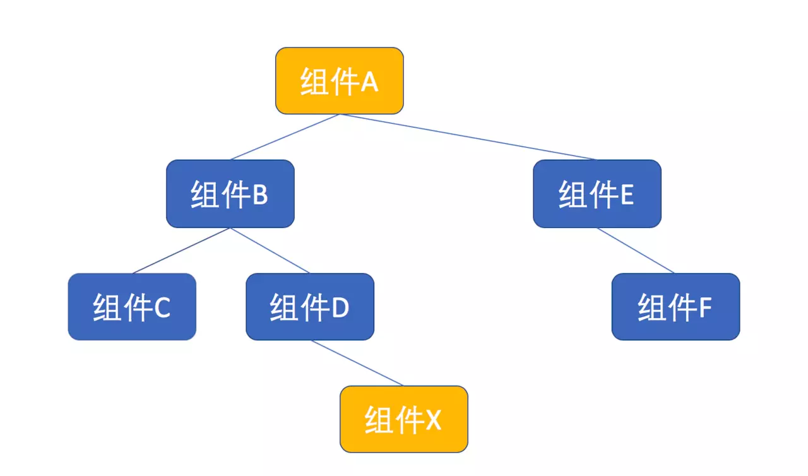
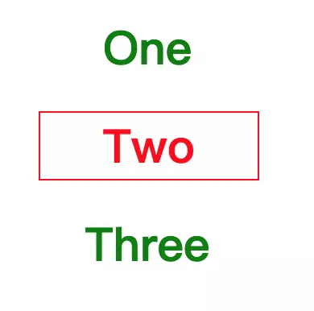

# 组件实践

## 组件接口设计三原则

1. 保持接口小，props 数量要少
2. 根据数据边界来划分组件，利用组合（composition）
3. 把 state 尽量往上层组件提取

同时，我们也接触了这样一些最佳实践：

1. 避免 renderXXXX 函数，直接使用独立的纯函数组件
2. 给回调函数类型的 props 加统一前缀，比如 on 或者 handle
3. 使用 propTypes 来定义组件的 props

## 组件内部实现

1. 尽量每个组件都有自己专属的源代码文件；
2. 用解构赋值（destructuring assignment）的方法获取参数 props 的每个属性值；
3. 利用属性初始化（property initializer）来定义 state 和成员函数。

## 组件化样式

1. React 将内容、样式和动态功能聚集在一个模块中，是高聚合的表现；
2. React 原生 style 属性的用法；
3. 组件化样式 styled jsx 的用法。

# 组件设计模式

## 聪明组件与傻瓜组件

### 傻瓜组件（展示组件、无状态组件）

```jsx
import SmileFace from './yaoming_simile.png';

const Joke = ({ value }) => {
  return (
    <div>
      
      {value || 'loading...'}
    </div>
  );
};
```

### PureComponent

因为傻瓜组件一般没有自己的状态，所以可以像上面的 Joke 一样实现为函数形式，其实，我们可以进一步改进，利用 PureComponent 来提高傻瓜组件的性能。

函数形式的 React 组件，好处是不需要管理 state，占用资源少，但是，函数形式的组件无法利用 shouldComponentUpdate。

PureComponent 中 shouldComponentUpdate 的实现方式就是比较这次渲染的 props 是否和上一次 props 相同。

```jsx
class Joke extends React.PureComponent {
  render() {
    return (
      <div>
        
        {this.props.value || 'loading...'}
      </div>
    );
  }
}
```

值得一提的是，PureComponent 中 shouldComponentUpdate 对 props 做得只是浅层比较，不是深层比较，如果 props 是一个深层对象，就容易产生问题。

### React.memo

如果你使用 React v16.6.0 之后的版本，可以使用一个新功能 React.memo 来完美实现 React 组件，而不需要用 class，上面的 Joke 组件可以这么写：

```jsx
const Joke = React.memo(() => (
  <div>
    
    {this.props.value || 'loading...'}
  </div>
));
```

## 高阶组件

### 基本形式

```jsx
const withDoNothing = (Component) => {
  const NewComponent = (props) => {
    return <Component {...props} />;
  };
  return NewComponent;
};
```

### 基本思路

1. 高阶组件不能去修改作为参数的组件，高阶组件必须是一个纯函数，不应该有任何副作用。
2. 高阶组件返回的结果必须是一个新的 React 组件，这个新的组件的 JSX 部分肯定会包含作为参数的组件。
3. 高阶组件一般需要把传给自己的 props 转手传递给作为参数的组件。

### 用高阶组件抽取共同逻辑

接下来，我们对 withDoNothing 进行一些改进，让它实现“只有在登录时才显示”这个功能。

假设我们已经有一个函数 getUserId 能够从 cookies 中读取登录用户的 ID，如果用户未登录，这个 getUserId 就返回空，那么“退出登录按钮“就需要这么写：

```jsx
const LogoutButton = () => {
  if (getUserId()) {
    return ...; // 显示”退出登录“的JSX
  } else {
    return null;
  }
};
```

同样，购物车的代码就是这样：

```jsx
const ShoppintCart = () => {
  if (getUserId()) {
    return ...; // 显示”购物车“的JSX
  } else {
    return null;
  }
};
```

上面两个组件明显有重复的代码，我们可以把重复代码抽取出来，形成 withLogin 这个高阶组件，代码如下：

```jsx
const withLogin = (Component) => {
  const NewComponent = (props) => {
    if (getUserId()) {
      return <Component {...props} />;
    } else {
      return null;
    }
  };

  return NewComponent;
};
```

如此一来，我们就只需要这样定义 LogoutButton 和 ShoppintCart：

```jsx
const LogoutButton = withLogin((props) => {
  return ...; // 显示”退出登录“的JSX
});

const ShoppingCart = withLogin(() => {
  return ...; // 显示”购物车“的JSX
});
```

### 高阶组件的高级用法

高阶组件只需要返回一个 React 组件即可，没人规定高阶组件只能接受一个 React 组件作为参数，完全可以传入多个 React 组件给高阶组件。

比如，我们可以改进上面的 withLogin，让它接受两个 React 组件，根据用户是否登录选择渲染合适的组件。

```jsx
const withLoginAndLogout = (ComponentForLogin, ComponentForLogout) => {
  const NewComponent = (props) => {
    if (getUserId()) {
      return <ComponentForLogin {...props} />;
    } else {
      return <ComponentForLogout {...props} />;
    }
  };
  return NewComponent;
};
```

有了上面的 withLoginAndLogout，就可以产生根据用户登录状态显示不同的内容。

```jsx
const TopButtons = withLoginAndLogout(LogoutButton, LoginButton);
```

### 链式调用高阶组件

高阶组件最巧妙的一点，是可以链式调用。

假设，你有三个高阶组件分别是 withOne、withTwo 和 withThree，那么，如果要赋予一个组件 X 某个高阶组件的超能力，那么，你要做的就是挨个使用高阶组件包装，代码如下：

```jsx
const X1 = withOne(X);
const X2 = withTwo(X1);
const X3 = withThree(X2);
const SuperX = X3; //最终的SuperX具备三个高阶组件的超能力
```

很自然，我们可以避免使用中间变量 X1 和 X2，直接连续调用高阶组件，如下：

```jsx
const SuperX = withThree(withTwo(withOne(X)));
```

对于 X 而言，它被高阶组件包装了，至于被一个高阶组件包装，还是被 N 个高阶组件包装，没有什么差别。而高阶组件本身就是一个纯函数，纯函数是可以组合使用的，所以，我们其实可以把多个高阶组件组合为一个高阶组件，然后用这一个高阶组件去包装 X，代码如下：

```jsx
const hoc = compose(
  withThree,
  withTwo,
  withOne
);
const SuperX = hoc(X);
```

在上面代码中使用的 compose，是函数式编程中很基础的一种方法，作用就是把多个函数组合为一个函数，在很多开源的代码库中都可以看到，下面是一个参考实现：

```jsx
export default function compose(...funcs) {
  if (funcs.length === 0) {
    return (arg) => arg;
  }

  if (funcs.length === 1) {
    return funcs[0];
  }

  return funcs.reduce((a, b) => (...args) => a(b(...args)));
}
```

React 组件可以当做积木一样组合使用，现在有了 compose，我们就可以把高阶组件也当做积木一样组合，进一步重用代码。

假如一个应用中多个组件都需要同样的多个高阶组件包装，那就可以用 compose 组合这些高阶组件为一个高阶组件，这样在使用多个高阶组件的地方实际上就只需要使用一个高阶组件了。

### 不要滥用高阶组件

高阶组件虽然可以用一种可重用的方式扩充现有 React 组件的功能，但高阶组件并不是绝对完美的。

首先，高阶组件不得不处理 displayName，不然 debug 会很痛苦。当 React 渲染出错的时候，靠组件的 displayName 静态属性来判断出错的组件类，而高阶组件总是创造一个新的 React 组件类，所以，每个高阶组件都需要处理一下 displayName。

如果要做一个最简单的什么增强功能都没有的高阶组件，也必须要写下面这样的代码：

```jsx
const withExample = (Component) => {
  const NewComponent = (props) => {
    return <Component {...props} />;
  };

  NewComponent.displayName = `withExample(${Component.displayName || Component.name || 'Component'})`;

  return NewCompoennt;
};
```

每个高阶组件都这么写，就会非常的麻烦。

对于 React 生命周期函数，高阶组件不用怎么特殊处理，但是，如果内层组件包含定制的静态函数，这些静态函数的调用在 React 生命周期之外，那么高阶组件就必须要在新产生的组件中增加这些静态函数的支持，这更加麻烦。

其次，高阶组件支持嵌套调用，这是它的优势。但是如果真的一大长串高阶组件被应用的话，当组件出错，你看到的会是一个超深的 stack trace，十分痛苦。

最后，使用高阶组件，一定要非常小心，要避免重复产生 React 组件，比如，下面的代码是有问题的：

```jsx
const Example = () => {
  const EnhancedFoo = withExample(Foo);
  return <EnhancedFoo />;
};
```

像上面这样写，每一次渲染 Example，都会用高阶组件产生一个新的组件，虽然都叫做 EnhancedFoo，但是对 React 来说是一个全新的东西，在重新渲染的时候不会重用之前的虚拟 DOM，会造成极大的浪费。

正确的写法是下面这样，自始至终只有一个 EnhancedFoo 组件类被创建：

```jsx
const EnhancedFoo = withExample(Foo);

const Example = () => {
  return <EnhancedFoo />;
};
```

总之，高阶组件是重用代码的一种方式，但并不是唯一方式，在下一小节，我们会介绍一种更加精妙的方式。

以上更新于`2019-3-19 21:09:53`

---

## render props 模式

所谓 render props，指的是让 React 组件的 props 支持函数这种模式。因为作为 props 传入的函数往往被用来渲染一部分界面，所以这种模式被称为 render props。

一个最简单的 render props 组件 RenderAll，代码如下：

```jsx
const RenderAll = (props) => {
  return <React.Fragment>{props.children(props)}</React.Fragment>;
};
```

这个 RenderAll 预期子组件是一个函数，它所做的事情就是把子组件当做函数调用，调用参数就是传入的 props，然后把返回结果渲染出来，除此之外什么事情都没有做。

使用 RenderAll 的代码如下：

```jsx
<RenderAll>{() => <h1>hello world</h1>}</RenderAll>
```

可以看到，RenderAll 的子组件，也就是夹在 RenderAll 标签之间的部分，其实是一个函数。这个函数渲染出 `<h1>hello world</h1>`，这就是上面使用 RenderAll 渲染出来的结果。

当然，这个 RenderAll 没做任何实际工作，接下来我们看 render props 真正强悍的使用方法。

### 传递 props

和高阶组件一样，render props 可以做很多的定制功能，我们还是以根据是否登录状态来显示一些界面元素为例，来实现一个 render props。

下面是实现 render props 的 Login 组件，可以看到，render props 和高阶组件的第一个区别，就是 render props 是真正的 React 组件，而不是一个返回 React 组件的函数。

```jsx
const Login = (props) => {
  const userName = getUserName();

  if (userName) {
    const allProps = { userName, ...props };
    return <React.Fragment>{props.children(allProps)}</React.Fragment>;
  } else {
    return null;
  }
};
```

当用户处于登录状态，getUserName 返回当前用户名，否则返回空，然后我们根据这个结果决定是否渲染 props.children 返回的结果。

当然，render props 完全可以决定哪些 props 可以传递给 props.children，在 Login 中，我们把 userName 作为增加的 props 传递给下去，这样就是 Login 的增强功能。

一个使用上面 Login 的 JSX 代码示例如下：

```jsx
<Login>{({ userName }) => <h1>Hello {userName}</h1>}</Login>
```

对于名为`程墨Morgan`的用户登录，上面的 JSX 会产生 `<h1>Hello 程墨Morgan</h1>`。

### 不局限于 children

在上面的例子中，作为 render 方法的 props 就是 children，在我写的《深入浅出 React 和 Redux》中，将这种模式称为“以函数为子组件（function as child）”的模式，这可以算是 render props 的一种具体形式，也就利用 children 这个 props 来作为函数传递。

实际上，render props 这个模式不必局限于 children 这一个 props，任何一个 props 都可以作为函数，也可以利用多个 props 来作为函数。

我们来扩展 Login，不光在用户登录时显示一些东西，也可以定制用户没有登录时显示的东西，我们把这个组件叫做 Auth，对应代码如下：

```js
const Auth = (props) => {
  const userName = getUserName();

  if (userName) {
    const allProps = { userName, ...props };
    return <React.Fragment>{props.login(allProps)}</React.Fragment>;
  } else {
    <React.Fragment>{props.nologin(props)}</React.Fragment>;
  }
};
```

使用 Auth 的话，可以分别通过 login 和 nologin 两个 props 来指定用户登录或者没登录时显示什么，用法如下：

```js
<Auth login={({ userName }) => <h1>Hello {userName}</h1>} nologin={() => <h1>Please login</h1>} />
```

### 依赖注入

render props 其实就是 React 世界中的“依赖注入”（Dependency Injection)。

所谓依赖注入，指的是解决这样一个问题：逻辑 A 依赖于逻辑 B，如果让 A 直接依赖于 B，当然可行，但是 A 就没法做得通用了。依赖注入就是把 B 的逻辑以函数形式传递给 A，A 和 B 之间只需要对这个函数接口达成一致就行，如此一来，再来一个逻辑 C，也可以用一样的方法重用逻辑 A。

在上面的代码示例中，Login 和 Auth 组件就是上面所说的逻辑 A，而传递给组件的函数类型 props，就是逻辑 B 和 C。

### render props 和高阶组件的比较

我们来比对一下这两种重用 React 组件逻辑的模式。

首先，render props 模式的应用，就是做一个 React 组件，而高阶组件，虽然名为“组件”，其实只是一个产生 React 组件的函数。

render props 不像上一小节中介绍的高阶组件有那么多毛病，如果说 render props 有什么缺点，那就是 render props 不能像高阶组件那样链式调用，当然，这并不是一个致命缺点。

render props 相对于高阶组件还有一个显著优势，就是对于新增的 props 更加灵活。还是以登录状态为例，假如我们扩展 withLogin 的功能，让它给被包裹的组件传递用户名这个 props，代码如下：

```jsx
const withLogin = (Component) => {
  const NewComponent = (props) => {
    const userName = getUserName();
    if (userName) {
      return <Component {...props} userName={userName} />;
    } else {
      return null;
    }
  };

  return NewComponent;
};
```

这就要求被 withLogin 包住的组件要接受 userName 这个 props。可是，假如有一个现成的 React 组件不接受 userName，却接受名为 name 的 props 作为用户名，这就麻烦了。我们就不能直接用 withLogin 包住这个 React 组件，还要再造一个组件来做 userName 到 name 的映射，十分费事。

对于应用 render props 的 Login，就不存在这个问题，接受 name 不接受 userName 是吗？这样写就好了：

```jsx
<Login>
  {(props) => {
    const { userName } = props;
    return <TheComponent {...props} name={userName} />;
  }}
</Login>
```

所以，当需要重用 React 组件的逻辑时，建议首先看这个功能是否可以抽象为一个简单的组件；如果行不通的话，考虑是否可以应用 render props 模式；再不行的话，才考虑应用高阶组件模式。

这并不表示高阶组件无用武之地，在后续章节，我们会对 render props 和高阶组件分别讲解具体的实例。

以上更新于 `2019-3-20 15:54:08`

---

## 提供者模式

### 问题场景

在 React 中，props 是组件之间通讯的主要手段，但是，有一种场景单纯靠 props 来通讯是不恰当的，那就是两个组件之间间隔着多层其他组件，下面是一个简单的组件树示例图：



在上图中，组件 A 需要传递信息给组件 X，如果通过 props 的话，那么从顶部的组件 A 开始，要把 props 传递给组件 B，然后组件 B 传递给组件 D，最后组件 D 再传递给组件 X。

其实组件 B 和组件 D 完全用不上这些 props，但是又被迫传递这些 props，这明显不合理，要知道组件树的结构会变化的，将来如果组件 B 和组件 D 之间再插入一层新的组件，这个组件也需要传递这个 props，这就麻烦无比。

可见，对于跨级的信息传递，我们需要一个更好的方法。

在 React 中，解决这个问题应用的就是“提供者模式”。

### 提供者模式

虽然这个模式叫做“提供者模式”，但是其实有两个角色，一个叫“提供者”（Provider），另一个叫“消费者”（Consumer），这两个角色都是 React 组件。其中“提供者”在组件树上居于比较靠上的位置，“消费者”处于靠下的位置。在上面的组件树中，组件 A 可以作为提供者，组件 X 就是消费者。

既然名为“提供者”，它可以提供一些信息，而且这些信息在它之下的所有组件，无论隔了多少层，都可以直接访问到，而不需要通过 props 层层传递。

避免 props 逐级传递，即是提供者的用途。

### 如何实现提供者模式

实现提供者模式，需要 React 的 Context 功能，可以说，提供者模式只不过是让 Context 功能更好用一些而已。

所谓 Context 功能，就是能够创造一个“上下文”，在这个上下文笼罩之下的所有组件都可以访问同样的数据。

在 React v16.3.0 之前，React 虽然提供了 Context 功能，但是官方文档上都建议尽量不要使用，因为对应的 API 他们并不满意，觉得迟早要废弃掉。即使如此，依然有很多库和应用使用 Context 功能，可见对这个需求的呼声有多大。

当 React 发布 v16.3.0 时，终于提供了“正式版本”的 Context 功能 API，和之前的有很大不同，当然，这也带来一些问题，我在后面会介绍。

提供者模式的一个典型用例就是实现“样式主题”（Theme），由顶层的提供者确定一个主题，下面的样式就可以直接使用对应主题里的样式。这样，当需要切换样式时，只需要修改提供者就行，其他组件不用修改。

为了方便比对，这里我会介绍提供者模式用不同 Context API 的实现方法。不过，你如果完全不在意老版本 React 如何实现的，可以略过下面一段。

#### React v16.3.0 之前的提供者模式

在 React v16.3.0 之前，要实现提供者，就要实现一个 React 组件，不过这个组件要做两个特殊处理。

1. 需要实现 getChildContext 方法，用于返回“上下文”的数据；
2. 需要定义 childContextTypes 属性，声明“上下文”的结构。

下面就是一个实现“提供者”的例子，组件名为 ThemeProvider：

```jsx
class ThemeProvider extends React.Component {
  getChildContext() {
    return {
      theme: this.props.value
    };
  }

  render() {
    return <React.Fragment>{this.props.children}</React.Fragment>;
  }
}

ThemeProvider.childContextTypes = {
  theme: PropTypes.object
};
```

在上面的例子中，getChildContext 只是简单返回名为 value 的 props 值，但是，因为 getChildContext 是一个函数，它可以有更加复杂的操作，比如可以从 state 或者其他数据源获得数据。

对于 ThemeProvider，我们创造了一个上下文，这个上下文就是一个对象，结构是这样：

```json
{
  "theme": {
    //一个对象
  }
}
```

接下来，我们来做两个消费（也就是使用）这个“上下文”的组件，第一个是 Subject，代表标题；第二个是 Paragraph，代表章节。

```jsx
class Subject extends React.Component {
  render() {
    const { mainColor } = this.context.theme;
    return <h1 style={{ color: mainColor }}>{this.props.children}</h1>;
  }
}

Subject.contextTypes = {
  theme: PropTypes.object
};
```

在 Subject 的 render 函数中，可以通过 this.context 访问到“上下文”数据，因为 ThemeProvider 提供的“上下文”包含 theme 字段，所以可以直接访问 this.context.theme。

千万不要忘了 Subject 必须增加 contextTypes 属性，必须和 ThemeProvider 的 childContextTypes 属性一致，不然，this.context 就不会得到任何值。

读者可能会问了，为什么这么麻烦呢？为什么要求“提供者”用 childContextTypes 定义一次上下文结构，又要求“消费者”再用 contextTypes 再重复定义一次呢？这不是很浪费吗？

React 这么要求，是考虑到“上下文”可能会嵌套，就是一个“提供者”套着另一个“提供者”，这时候，底层的消费者组件到底消费哪一个“提供者”呢？通过这种显式的方式指定。

不过，实话实说，这样的 API 设计的确麻烦了一点，难怪 React 官方在最初就不建议使用。

上面的 Subject 是一个类，其实也可以把消费者实现为一个纯函数组件，只不过访问“上下文”的方式有些不同，我们用纯函数的方式实现另一个消费者 Paragraph，代码如下：

```jsx
const Paragraph = (props, context) => {
  const { textColor } = context.theme;
  return <p style={{ color: textColor }}>{props.children}</p>;
};

Paragraph.contextTypes = {
  theme: PropTypes.object
};
```

从上面的代码可以看到，因为 Paragraph 是一个函数形式，所以不可能访问 this.context，但是函数的第二个参数其实就是 context。

当然，也不要忘了设定 Paragraph 的 contextTypes，不然参数 context 也不会是上下文。

最后，我们看如何结合”提供者“和”消费者“。

我们做一个组件来使用 Subject 和 Paragraph，这个组件不需要帮助传递任何 props，代码如下：

```jsx
const Page = () => (
  <div>
    <Subject>这是标题</Subject>
    <Paragraph>这是正文</Paragraph>
  </div>
);
```

上面的组件 Page 使用了 Subject 和 Paragraph，现在我们想要定制样式主题，只需要在 Page 或者任何需要应用这个主题的组件外面包上 ThemeProvider，对应的 JSX 代码如下：

```jsx
<ThemeProvider value={{ mainColor: 'green', textColor: 'red' }}>
  <Page />
</ThemeProvider>
```

最后，看到的效果如下：


当我们需要改变一个样式主题的时候，改变传给 ThemeProvider 的 value 值就搞定了。

#### React v16.3.0 之后的提供者模式

到了 React v16.3.0 的时候，新的 Context API 出来了，这套 API 毫不掩饰自己就是“提供者模式”的实现，命名上就带 “Provider” 和 “Consumer”。

还是上面的样式主题的例子，首先，要用新提供的 createContext 函数创造一个“上下文”对象。

```jsx
const ThemeContext = React.createContext();
```

这个“上下文”对象 ThemeContext 有两个属性，分别就是 Provider 和 Consumer。

```jsx
const ThemeProvider = ThemeContext.Provider;
const ThemeConsumer = ThemeContext.Consumer;
```

创造“提供者”极大简化了，都不需要我们创造一个 React 组件类。

使用“消费者”也同样简单，而且应用了上一节我们介绍的 render props 模式，比如，Subject 的代码如下:

```jsx
class Subject extends React.Component {
  render() {
    return (
      <ThemeConsumer>{(theme) => <h1 style={{ color: theme.mainColor }}>{this.props.children}</h1>}</ThemeConsumer>
    );
  }
}
```

上面的 ThemeConsumer 其实就是一个应用了 render props 模式的组件，它要求子组件是一个函数，会把“上下文”的数据作为参数传递给这个函数，而这个函数里就可以通过参数访问“上下文”对象。

在新的 API 里，不需要设定组件的 childContextTypes 或者 contextTypes 属性，这省了不少事。

可以注意到，Subject 没有自己的状态，没必要实现为类，我们用纯函数的形式实现 Paragraph，代码如下：

```jsx
const Paragraph = (props, context) => {
  return <ThemeConsumer>{(theme) => <p style={{ color: theme.textColor }}>{props.children}</p>}</ThemeConsumer>;
};
```

实现 Page 的方式并没有变化，而应用 ThemeProvider 的代码和之前也完全一样:

```jsx
<ThemeProvider value={{ mainColor: 'green', textColor: 'red' }}>
  <Page />
</ThemeProvider>
```

### 两种提供者模式实现方式的比较

通过上面的代码，可以很清楚地看到，新的 Context API 更简洁，但是也并不是十全十美。

在老版 Context API 中，“上下文”只是一个概念，并不对应一个代码，两个组件之间达成一个协议，就诞生了“上下文”。

在新版 Context API 中，需要一个“上下文”对象（上面的例子中就是 ThemeContext)，使用“提供者”的代码和“消费者”的代码往往分布在不同的代码文件中，那么，这个 ThemeContext 对象放在哪个代码文件中呢？

最好是放在一个独立的文件中，这么一来，就多出一个代码文件，而且所有和这个“上下文”相关的代码，都要依赖于这个“上下文”代码文件，虽然这没什么大不了的，但是的确多了一层依赖关系。

为了避免依赖关系复杂，每个应用都不要滥用“上下文”，应该限制“上下文”的使用个数。

不管怎么说，新版本的 Context API 才是未来，在 React v17 中，可能就会删除对老版 Context API 的支持，所以，现在大家都应该使用第二种实现方式。

## 组合组件

组合组件模式要解决的是这样一类问题：父组件想要传递一些信息给子组件，但是，如果用 props 传递又显得十分麻烦。

一看到这个问题描述，读者应该能立刻想到上一节我们介绍过的 Context API，利用 Context，可以让组件之间不用 props 来传递信息。

不过，使用 Context 也不是完美解法，上一节我们介绍过，使用 React 在 v16.3.0 之后提供的新的 Context API，需要让“提供者”和“消费者”共同依赖于一个 Context 对象，而且消费者也要使用 render props 模式。

如果不嫌麻烦，用 Context 来解决问题当然好，但是我们肯定会想有没有更简洁的方式。

### 问题描述

为了让问题更加具体，我们来解决一个实例。

很多界面都有 Tab 这样的元件，我们需要一个 Tabs 组件和 TabItem 组件，Tabs 是容器，TabItem 是一个一个单独的 Tab，因为一个时刻只有一个 TabItem 被选中，很自然希望被选中的 TabItem 样式会和其他 TabItem 不同。

这并不是一个很难的功能，首先我们想到的就是，用 Tabs 中一个 state 记录当前被选中的 Tabitem 序号，然后根据这个 state 传递 props 给 TabItem，当然，还要传递一个 onClick 事件进去，捕获点击选择事件。

按照这样的设计，Tabs 中如果要显示 One、Two、Three 三个 TabItem，JSX 代码大致这么写：

```jsx
<TabItem active={true} onClick={this.onClick}>One</TabItem>
<TabItem active={false} onClick={this.onClick}>Two</TabItem>
<TabItem active={false} onClick={this.onClick}>Three</TabItem>
```

上面的 TabItem 组件接受 active 这个 props，如果 true 代表当前是选中状态，当然可以工作，但是，也存在大问题：

1. 每次使用 TabItem 都要传递一堆 props，好麻烦；
2. 每增加一个新的 TabItem，都要增加对应的 props，更麻烦；
3. 如果要增加 TabItem，就要去修改 Tabs 的 JSX 代码，超麻烦。

我们不想要这么麻烦，理想情况下，我们希望可以随意增加减少 TabItem 实例，不用传递一堆 props，也不用去修改 Tabs 的代码，最好代码就这样：

```jsx
<Tabs>
  <TabItem>One</TabItem>
  <TabItem>Two</TabItem>
  <TabItem>Three</TabItem>
</Tabs>
```

如果能像上面一样写代码，那就达到目的了。

像上面这样，Tabs 和 TabItem 不通过表面的 props 传递也能心有灵犀，二者之间有某种神秘的“组合”，就是我们所说的“组合组件”。

### 实现方式

上面我们说过，利用 Context API，可以实现组合组件，但是那样 TabItem 需要应用 render props，至于如何实现，读者可以参照上一节的介绍自己尝试。

在这里，我们用一种更巧妙的方式来实现组合组件，可以避免 TabItem 的复杂化。

我们先写出 TabItem 的代码，如下：

```jsx
const TabItem = (props) => {
  const { active, onClick } = props;
  const tabStyle = {
    'max-width': '150px',
    color: active ? 'red' : 'green',
    border: active ? '1px red solid' : '0px'
  };
  return (
    <h1 style={tabStyle} onClick={onClick}>
      {props.children}
    </h1>
  );
};
```

TabItem 有两个重要的 props：active 代表自己是否被激活，onClick 是自己被点击时应该调用的回调函数，这就足够了。TabItem 所做的就是根据这两个 props 渲染出 props.children，没有任何复杂逻辑，是一个活脱脱的“傻瓜组件”，所以，用一个纯函数实现就可以了。

接下来要做的，就看 Tabs 如何把 active 和 onClick 传递给 TabItem。

我们再来看一下使用组合组件的 JSX 代码：

```jsx
<Tabs>
  <TabItem>One</TabItem>
  <TabItem>Two</TabItem>
  <TabItem>Three</TabItem>
</Tabs>
```

没有 props 的传递啊，怎么悄无声息地把 active 和 onClick 传递给 TabItem 呢？

Tabs 虽然可以访问到作为 props 的 children，但是到手的 children 已经是创造好的元素，而且是不可改变的，Tabs 是不可能把创造好的元素再强塞给 children 的。

怎么办？

办法还是有的，如果 Tabs 并不去渲染 children，而是把 children 拷贝一份，就有机会去篡改这份拷贝，最后渲染这份拷贝就好了。

```jsx
class Tabs extends React.Component {
  state = {
    activeIndex: 0
  };

  render() {
    const newChildren = React.Children.map(this.props.children, (child, index) => {
      if (child.type) {
        return React.cloneElement(child, {
          active: this.state.activeIndex === index,
          onClick: () => this.setState({ activeIndex: index })
        });
      } else {
        return child;
      }
    });

    return <Fragment>{newChildren}</Fragment>;
  }
}
```

在 render 函数中，我们用了 React 中不常用的两个 API：

1. React.Children.map
2. React.cloneElement

使用 React.Children.map，可以遍历 children 中所有的元素，因为 children 可能是一个数组嘛。

使用 React.cloneElement 可以复制某个元素。这个函数第一个参数就是被复制的元素，第二个参数可以增加新产生元素的 props，我们就是利用这个机会，把 active 和 onClick 添加了进去。

这两个 API 双剑合璧，就能实现不通过表面的 props 传递，完成两个组件的“组合”。

最终的效果如下：



点击任何一个 TabItem，其样式就会立刻改变。而维护哪个 TabItem 是当前选中的状态，则是 Tabs 的责任。

### 实际应用

从上面的代码可以看出来，对于组合组件这种实现方式，TabItem 非常简化；Tabs 稍微麻烦了一点，但是好处就是把复杂度都封装起来了，从使用者角度，连 props 都看不见。

所以，应用组合组件的往往是共享组件库，把一些常用的功能封装在组件里，让应用层直接用就行。在 antd 和 bootstrap 这样的共享库中，都使用了组合组件这种模式。

如果你的某两个组件并不需要重用，那么就要谨慎使用组合组件模式，毕竟这让代码复杂了一些。

以上更新于 `2019-3-21 21:27:09`

---
