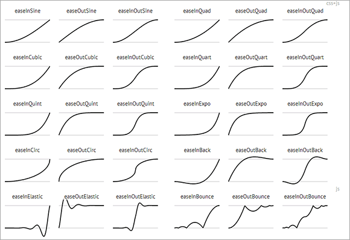

# 原理

浏览器（如页面）每次要洗澡（重绘），就会通知我(requestAnimationFrame)，而 setTimeout 貌似是多个独立绘制。

# 作用

## 统一的向下兼容策略

CSS3 实现动画即高效又方便，但是对于 PC 浏览器，IE10+ CSS3 实现，IE9-之流 JS setTimeout 实现，实现方式也是不统一，但是 requestAnimationFrame 跟 setTimeout 非常类似，都是单回调

```js
var handle = setTimeout(renderLoop, PERIOD);
var handle = requestAnimationFrame(renderLoop);
```

为了统一代码，需要对 IE9-的浏览器做下兼容性处理

### 简单的兼容（IE6+）

```js
window.requestAnimFrame = (function() {
  return (
    window.requestAnimationFrame ||
    window.webkitRequestAnimationFrame ||
    window.mozRequestAnimationFrame ||
    function(callback) {
      window.setTimeout(callback, 1000 / 60);
    }
  );
})();
```

但是呢，并不是所有设备的绘制时间间隔是 1000/60 ms, 以及上面并木有 cancel 相关方法，所以，就有下面这份更全面的兼容方法：

### 较全面的兼容（IE6+）

```js
(function() {
  var lastTime = 0;
  var vendors = ['webkit', 'moz'];
  for (var x = 0; x < vendors.length && !window.requestAnimationFrame; ++x) {
    window.requestAnimationFrame = window[vendors[x] + 'RequestAnimationFrame'];
    window.cancelAnimationFrame =
      window[vendors[x] + 'CancelAnimationFrame'] || window[vendors[x] + 'CancelRequestAnimationFrame']; // Webkit中此取消方法的名字变了
  }

  if (!window.requestAnimationFrame) {
    window.requestAnimationFrame = function(callback, element) {
      var currTime = new Date().getTime();
      // 计算离每帧16.7ms还有多少调用时间，不得超过16.7ms每帧，否则延迟调用，
      var timeToCall = Math.max(0, 16.7 - (currTime - lastTime));
      var id = window.setTimeout(function() {
        callback(currTime + timeToCall);
      }, timeToCall);
      // 真正的调用时间
      lastTime = currTime + timeToCall;
      return id;
    };
  }
  if (!window.cancelAnimationFrame) {
    window.cancelAnimationFrame = function(id) {
      clearTimeout(id);
    };
  }
})();
```

## CSS3 动画不能应用所有属性

比方说 scrollTop 值。如果我们希望返回顶部是个平滑滚动效果，就目前而言，CSS3 似乎是无能为力的。

<iframe src="/examples/css3-animation-requestanimationframe-tween/scroll-to-top-bottom.html" width="400" height="100"></iframe>

`embed:css3-animation-requestanimationframe-tween/scroll-to-top-bottom.html`

## CSS3 支持的动画效果有限

由于 CSS3 动画的贝塞尔曲线是一个标准 3 次方曲线，因此只能是：Linear, Sine, Quad, Cubic, Expo 等，但对于 Back, Bounce 等缓动则无能为力。



此时只能用 js 来实现。

这里需要了解下缓动(Tween)知识：

- Linear：无缓动效果
- Quadratic：二次方的缓动（t^2）
- Cubic：三次方的缓动（t^3）
- Quartic：四次方的缓动（t^4）
- Quintic：五次方的缓动（t^5）
- Sinusoidal：正弦曲线的缓动（sin(t)）
- Exponential：指数曲线的缓动（2^t）
- Circular：圆形曲线的缓动（sqrt(1-t^2)）
- Elastic：指数衰减的正弦曲线缓动
- 超过范围的三次方缓动（(s+1)*t^3 – s*t^2）
- 指数衰减的反弹缓动

每个效果都分三个缓动方式，分别是：

- easeIn：从 0 开始加速的缓动，先慢后快；
- easeOut：减速到 0 的缓动，先快后慢；
- easeInOut：前半段从 0 开始加速，后半段减速到 0 的缓动，先慢后快然后再慢。

每周动画效果都有其自身的算法。我们都知道 jQuery UI 中就有缓动，As 脚本也内置了缓动，其中的运动算法都是一致的：

```js
/*
 * Tween.js
 * t: current time（当前时间）
 * b: beginning value（初始值）
 * c: change in value（变化量）
 * d: duration（持续时间）
 */
var Tween = {
  Linear: function(t, b, c, d) {
    return (c * t) / d + b;
  },
  Quad: {
    easeIn: function(t, b, c, d) {
      return c * (t /= d) * t + b;
    },
    easeOut: function(t, b, c, d) {
      return -c * (t /= d) * (t - 2) + b;
    },
    easeInOut: function(t, b, c, d) {
      if ((t /= d / 2) < 1) return (c / 2) * t * t + b;
      return (-c / 2) * (--t * (t - 2) - 1) + b;
    }
  },
  Cubic: {
    easeIn: function(t, b, c, d) {
      return c * (t /= d) * t * t + b;
    },
    easeOut: function(t, b, c, d) {
      return c * ((t = t / d - 1) * t * t + 1) + b;
    },
    easeInOut: function(t, b, c, d) {
      if ((t /= d / 2) < 1) return (c / 2) * t * t * t + b;
      return (c / 2) * ((t -= 2) * t * t + 2) + b;
    }
  },
  Quart: {
    easeIn: function(t, b, c, d) {
      return c * (t /= d) * t * t * t + b;
    },
    easeOut: function(t, b, c, d) {
      return -c * ((t = t / d - 1) * t * t * t - 1) + b;
    },
    easeInOut: function(t, b, c, d) {
      if ((t /= d / 2) < 1) return (c / 2) * t * t * t * t + b;
      return (-c / 2) * ((t -= 2) * t * t * t - 2) + b;
    }
  },
  Quint: {
    easeIn: function(t, b, c, d) {
      return c * (t /= d) * t * t * t * t + b;
    },
    easeOut: function(t, b, c, d) {
      return c * ((t = t / d - 1) * t * t * t * t + 1) + b;
    },
    easeInOut: function(t, b, c, d) {
      if ((t /= d / 2) < 1) return (c / 2) * t * t * t * t * t + b;
      return (c / 2) * ((t -= 2) * t * t * t * t + 2) + b;
    }
  },
  Sine: {
    easeIn: function(t, b, c, d) {
      return -c * Math.cos((t / d) * (Math.PI / 2)) + c + b;
    },
    easeOut: function(t, b, c, d) {
      return c * Math.sin((t / d) * (Math.PI / 2)) + b;
    },
    easeInOut: function(t, b, c, d) {
      return (-c / 2) * (Math.cos((Math.PI * t) / d) - 1) + b;
    }
  },
  Expo: {
    easeIn: function(t, b, c, d) {
      return t == 0 ? b : c * Math.pow(2, 10 * (t / d - 1)) + b;
    },
    easeOut: function(t, b, c, d) {
      return t == d ? b + c : c * (-Math.pow(2, (-10 * t) / d) + 1) + b;
    },
    easeInOut: function(t, b, c, d) {
      if (t == 0) return b;
      if (t == d) return b + c;
      if ((t /= d / 2) < 1) return (c / 2) * Math.pow(2, 10 * (t - 1)) + b;
      return (c / 2) * (-Math.pow(2, -10 * --t) + 2) + b;
    }
  },
  Circ: {
    easeIn: function(t, b, c, d) {
      return -c * (Math.sqrt(1 - (t /= d) * t) - 1) + b;
    },
    easeOut: function(t, b, c, d) {
      return c * Math.sqrt(1 - (t = t / d - 1) * t) + b;
    },
    easeInOut: function(t, b, c, d) {
      if ((t /= d / 2) < 1) return (-c / 2) * (Math.sqrt(1 - t * t) - 1) + b;
      return (c / 2) * (Math.sqrt(1 - (t -= 2) * t) + 1) + b;
    }
  },
  Elastic: {
    easeIn: function(t, b, c, d, a, p) {
      var s;
      if (t == 0) return b;
      if ((t /= d) == 1) return b + c;
      if (typeof p == 'undefined') p = d * 0.3;
      if (!a || a < Math.abs(c)) {
        s = p / 4;
        a = c;
      } else {
        s = (p / (2 * Math.PI)) * Math.asin(c / a);
      }
      return -(a * Math.pow(2, 10 * (t -= 1)) * Math.sin(((t * d - s) * (2 * Math.PI)) / p)) + b;
    },
    easeOut: function(t, b, c, d, a, p) {
      var s;
      if (t == 0) return b;
      if ((t /= d) == 1) return b + c;
      if (typeof p == 'undefined') p = d * 0.3;
      if (!a || a < Math.abs(c)) {
        a = c;
        s = p / 4;
      } else {
        s = (p / (2 * Math.PI)) * Math.asin(c / a);
      }
      return a * Math.pow(2, -10 * t) * Math.sin(((t * d - s) * (2 * Math.PI)) / p) + c + b;
    },
    easeInOut: function(t, b, c, d, a, p) {
      var s;
      if (t == 0) return b;
      if ((t /= d / 2) == 2) return b + c;
      if (typeof p == 'undefined') p = d * (0.3 * 1.5);
      if (!a || a < Math.abs(c)) {
        a = c;
        s = p / 4;
      } else {
        s = (p / (2 * Math.PI)) * Math.asin(c / a);
      }
      if (t < 1) return -0.5 * (a * Math.pow(2, 10 * (t -= 1)) * Math.sin(((t * d - s) * (2 * Math.PI)) / p)) + b;
      return a * Math.pow(2, -10 * (t -= 1)) * Math.sin(((t * d - s) * (2 * Math.PI)) / p) * 0.5 + c + b;
    }
  },
  Back: {
    easeIn: function(t, b, c, d, s) {
      if (typeof s == 'undefined') s = 1.70158;
      return c * (t /= d) * t * ((s + 1) * t - s) + b;
    },
    easeOut: function(t, b, c, d, s) {
      if (typeof s == 'undefined') s = 1.70158;
      return c * ((t = t / d - 1) * t * ((s + 1) * t + s) + 1) + b;
    },
    easeInOut: function(t, b, c, d, s) {
      if (typeof s == 'undefined') s = 1.70158;
      if ((t /= d / 2) < 1) return (c / 2) * (t * t * (((s *= 1.525) + 1) * t - s)) + b;
      return (c / 2) * ((t -= 2) * t * (((s *= 1.525) + 1) * t + s) + 2) + b;
    }
  },
  Bounce: {
    easeIn: function(t, b, c, d) {
      return c - Tween.Bounce.easeOut(d - t, 0, c, d) + b;
    },
    easeOut: function(t, b, c, d) {
      if ((t /= d) < 1 / 2.75) {
        return c * (7.5625 * t * t) + b;
      } else if (t < 2 / 2.75) {
        return c * (7.5625 * (t -= 1.5 / 2.75) * t + 0.75) + b;
      } else if (t < 2.5 / 2.75) {
        return c * (7.5625 * (t -= 2.25 / 2.75) * t + 0.9375) + b;
      } else {
        return c * (7.5625 * (t -= 2.625 / 2.75) * t + 0.984375) + b;
      }
    },
    easeInOut: function(t, b, c, d) {
      if (t < d / 2) {
        return Tween.Bounce.easeIn(t * 2, 0, c, d) * 0.5 + b;
      } else {
        return Tween.Bounce.easeOut(t * 2 - d, 0, c, d) * 0.5 + c * 0.5 + b;
      }
    }
  }
};
Math.tween = Tween;
```

<iframe src="/examples/css3-animation-requestanimationframe-tween/animation-function.html" width="400" height="300"></iframe>

`embed:css3-animation-requestanimationframe-tween/animation-function.html`

# 实现方式

FireFox/Chrome 浏览器对 setInterval, setTimeout 做了优化，页面处于闲置状态的时候，如果定时间隔小于 1 秒钟(1000ms)，则停止了定时器。与 requestAnimationFrame 有类似行为。但如果时间间隔大于或等于 1000ms，定时器依然执行，即使页面最小化或非激活状态。

参见下表：

|         | setInterval | requestAnimationFrame |
| :------ | :---------- | :-------------------- |
| IE      | 无影响      | 暂停                  |
| Safari  | 无影响      | 暂停                  |
| Firefox | >=1s        | 1s - 3s               |
| Chrome  | >=1s        | 暂停                  |
| Opera   | 无影响      | 暂停                  |
