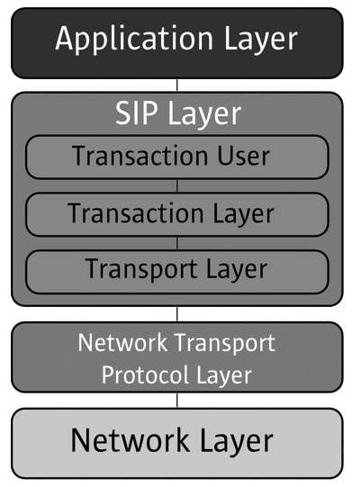
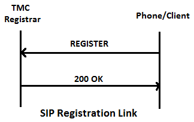
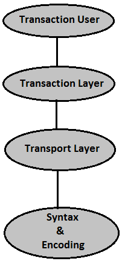
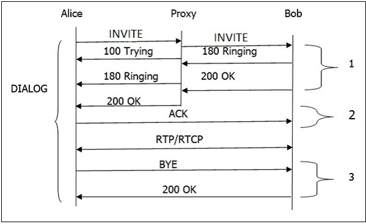
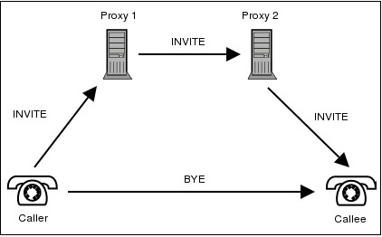

会话发起协议（SIP）是 VoIP 技术中最常用的协议之一。它是一种应用层协议，与其他应用层协议协同工作，通过 Internet 控制多媒体通信会话。

# 概述

- SIP 是用于通过因特网协议创建，修改和终止多媒体会话的信令协议。会话只不过是两个端点之间的简单调用。端点可以是智能电话，笔记本电脑或可以通过因特网接收和发送多媒体内容的任何设备。
- SIP 是由 IETF（Internet Engineering Task Force） 标准定义的应用层协议。它在 RFC 3261 中定义。
- SIP 体现了客户端 - 服务器体系结构，以及使用 HTTP 和 URL 的 URL 和 URI 以及 SMTP 的文本编码方案和头样式。
- SIP 采用 SDP（会话描述协议） 的帮助，它描述了用于通过 IP 网络传送语音和视频的会话和 RTP（实时传输协议）。
- SIP 可用于双方（单播）或多方（多播）会话。
- 其他 SIP 应用包括文件传输，即时通讯，视频会议，网络游戏，以及流多媒体分发。

下图说明了 SIP 在一般方案中的适用性：

通常，SIP 协议用于两个或多个端点之间的互联网电话和多媒体分发。例如，一个人可以使用 SIP 发起对另一个人的电话呼叫，或者有人可以与许多参与者建立电话会议。

SIP 协议的设计非常简单，配置有限的命令。它也是基于文本的，所以任何人都可以读取 SIP 会话中的端点之间传递的 SIP 消息。

有一些实体帮助 SIP 创建其网络。在 SIP 中，每个网元由 SIP URI（统一资源标识符） 来标识，它像一个地址。以下是网络元素：

- 用户代理
- 代理服务器
- 注册服务器
- 重定向服务器
- 位置服务器

## 用户代理

它是 SIP 网络的端点和最重要的网络元素之一。端点可以启动，修改或终止会话。用户代理是 SIP 网络中最智能的设备或网络元件。它可以是软电话，手机或笔记本电脑。

用户代理在逻辑上分为两部分：

- 用户代理客户端（UAC） - 发送请求并接收响应的实体。
- 用户代理服务器（UAS） - 接收请求并发送响应的实体。

SIP 基于客户机 - 服务器架构，其中呼叫者的电话充当发起呼叫的客户端，被叫方的电话充当响应呼叫的服务器。

## 代理服务器

网络元素接收来自用户代理的请求并将其转发给另一个用户。

- 基本上代理服务器的作用就像一个路由器。
- 它有一些智慧来了解 SIP 请求，并在 URI 的帮助下发送它。
- 代理服务器位于两个用户代理之间。
- 源和目的地之间最多可以有 70 个代理服务器。

有两种类型的代理服务器：

- 无状态代理服务器 - 它只是转发收到的消息。这种类型的服务器不存储任何呼叫或交易的信息。
- 有状态代理服务器 - 这种类型的代理服务器可以跟踪收到的每个请求和响应，并且如果需要，可以将来使用它。如果对方没有响应，它可以重新发送请求。

## 注册服务器

注册服务器接受用户代理的注册请求。它可以帮助用户在网络中进行身份验证。它将 URI 和用户的位置存储在数据库中，以帮助同一域内的其他 SIP 服务器。

看看下面的示例，显示 SIP 注册的过程：

这里呼叫者想要向 TMC 域注册。因此，它向 TMC 的 Registrar 服务器发送 REGISTER 请求，并且服务器在授权客户端时返回 200 OK 响应。

## 重定向服务器

重定向服务器接收请求，并在注册器创建的位置数据库中查找请求的预期收件人。

重定向服务器使用数据库获取位置信息，并以 3xx（重定向响应） 响应给用户。我们将在本教程的后面讨论响应代码。

## 位置服务器

位置服务器提供有关呼叫者可能的位置到重定向和代理服务器的信息。

只有代理服务器或重定向服务器可以联系位置服务器。

下图描绘了每个网络元素在建立会话中所扮演的角色：

# 系统架构

SIP 被构造为分层协议，这意味着其行为根据一组相当独立的处理阶段来描述，只有每个阶段之间的松散耦合。

- SIP 的最低层是其语法和编码。其编码使用增强的 Backus-Naur 表格语法（BNF）来指定。
- 第二层是传输层。它定义客户端如何发送请求并接收响应，以及服务器如何接收请求并通过网络发送响应，所有 SIP 元素都包含传输层。
- 接下来是事务层。事务是由客户端事务（使用传输层）发送到服务器事务的请求，以及从服务器事务发送回客户端的对该请求的所有响应。用户代理客户端（UAC）完成的任何任务都将使用一系列事务进行。无状态代理不包含事务层。
- 事务层上面的层称为事务用户。除了无状态代理之外，每个 SIP 实体都是一个事务用户。

下图显示了 SIP 会话的基本呼叫流程：

以下是对上述呼叫流程的逐步说明：

- 发送到代理服务器的 INVITE 请求负责启动会话。
- 代理服务器发送 100 尝试立即响应呼叫者（Alice）以停止 INVITE 请求的重新发送。
- 代理服务器在位置服务器中搜索 Bob 的地址。获取地址后，进一步转发 INVITE 请求。
- 此后，Bob 手机生成的 180 振铃（临时响应）返回给爱丽丝。
- 鲍勃拿起手机后一个 200 OK 响应很快产生。
- 一旦 200 OK 到达 Alice，Bob 从 Alice 收到一个 ACK。
- 同时，会话建立，RTP 数据包（会话）从两端开始流动。
- 会话结束后，任何参与者（Alice 或 Bob）都可以发送一个 BYE 请求来终止会话。
- BYE 直接从 Alice 到 Bob 绕过代理服务器。
- 最后，Bob 发送 200 OK 响应来确认 BYE，会话终止。
- 在上述基本呼叫流程中，可以使用三个事务（标记为 1，2，3）。

完整的呼叫（从 INVITE 到 200 OK）称为对话 Dialog。

# SIP 梯形

代理如何帮助一个用户与另一个用户连接？让我们在下图的帮助下找出。

图中所示的拓扑结构称为 SIP 梯形图。该过程发生如下：

- 当呼叫方发起呼叫时，将向代理服务器发送 INVITE 消息。代理服务器收到 INVITE 后，尝试借助 DNS 服务器解析受理者的地址。
- 在获得下一个路由之后，呼叫者的代理服务器（代理 1，也称为出站代理服务器）将 INVITE 请求转发给作为被呼叫者的入站代理服务器（代理服务器 2）的被呼叫者的代理服务器。
- 入站代理服务器联系位置服务器以获取用户注册的被叫方地址信息。
- 从位置服务器获取信息后，将呼叫转发到其目的地。
- 一旦用户代理知道他们的地址，他们可以绕过呼叫，即直接通话。

以上更新于`2019-6-10 20:24:54`

---
