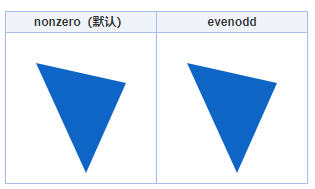
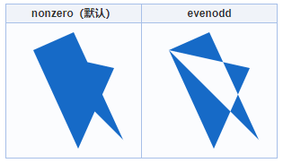
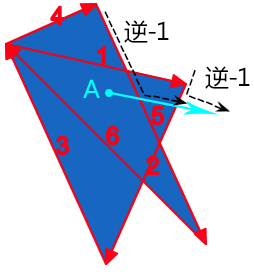
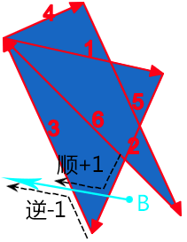
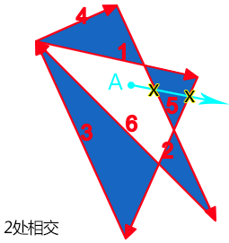
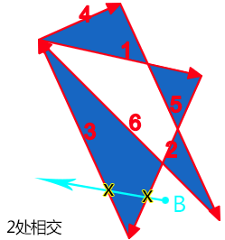
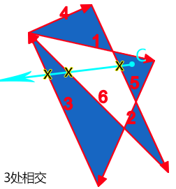

# 填充的两种规则

只要是路径填充，都有两种规则 nonzero 和 evenodd，无论是 SVG 中的路径填充，还是 Canvas 中的路径填充，如果还有其他和路径相关的技术（甚至设计软件），也离不开这两种填充规则。

如果我们用 3 个点，连成一个三角形，则这两种填充规则没什么区别，如下对比

如果是两个三角形，并且发生重叠，差异就出现了，如下：

# 交叉点

填充规则的关键，就是确定复杂路径构成的图形，哪些是内部，哪些是外部。内部则填充，外部则透明。

“nonzero 规则”顾名思意就是“非零规则”，用通俗的话讲，就算计算某些东西是不是 0，如果不是 0 则内部，填充；如果是 0 则外部，不填充。

“evenodd 规则”顾名思意就是“奇偶规则”，用通俗的话讲，就算计算某些东西是不是奇数，如果是是奇数则内部，填充；如果是偶数则外部，不填充。

nonzero 规则和 evenodd 规则计算的东西还不一样，nonzero 是计算顺时针逆时针数量，evenodd 是交叉路径数量。

## nonzero 规则

起始值为 0，射线会和路径相交，如果路径方向和射线方向形成的是顺时针方向则+1，如果是逆时针方向则-1，最后如果数值为 0，则是路径的外部；如果不是 0，则是路径的内部，因此被称为“非 0 规则”。

例如上图点 A，我们随便发出一条射线，结果经过了路径 5 和路径 2，我们顺着路径前进方向和射线前进方向，可以看到，合并后的运动方向都是逆时针，逆时针方向-1，因此，最后计算值是-2，不是 0，因此，是内部，fill 时候可以被填充。

再看外部的例子：

点 B 再发出一条射线，经过两条路径片段，为路径 2 和路径 3，我们顺着路径前进方向和射线前进方向，可以看到，合并后的运动方向一个是逆时针，-1，一个是顺时针，+1，因此，最后的计算值是 0，是外部，因此，不被填充。

## evenodd 规则

起始值为 0，射线会和路径相交，每交叉一条路径，我们计数就+1，最后看我们的总计算数值，如果是奇数，则认为是路径内部，如果是偶数，则认为是路径外部。

例如上图点 A，我们随便发出一条射线，结果经过了路径 5 和路径 2，交叉的路径个数为 2，是偶数，因此，属于路径外，不填充。

点 B 再发出一条射线，经过路径片段路径 2 和路径 3，交叉的路径个数为 2，是偶数，因此，也属于路径外，不填充。

最后这个点 C，发出的射线总共和 3 个路径交叉，是奇数。因此，属于路径内，填充。
