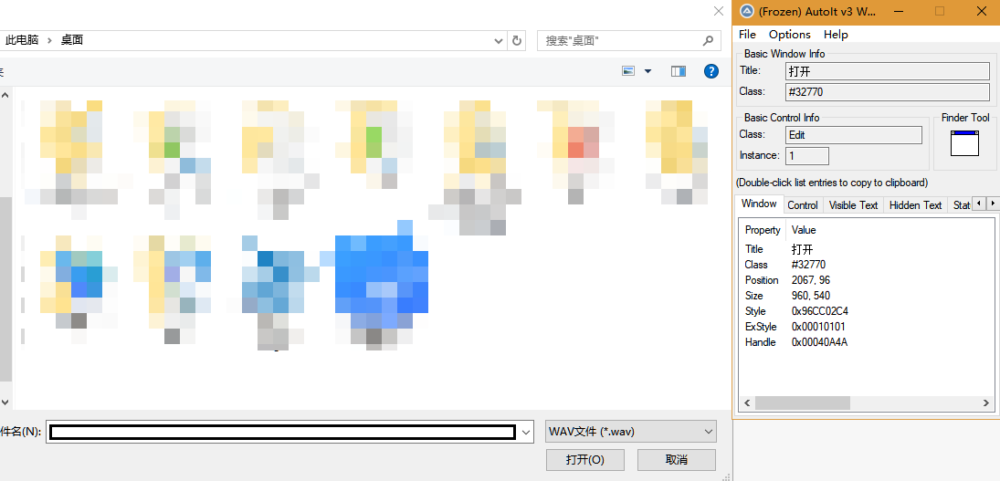

# 项目背景

最近帮平台组做 UI 自动化测试，在多次调研下，选定阿里的 macaca 作为技术栈，参考 [sample-nodejs](https://github.com/macaca-sample/sample-nodejs)，在模板 [macaca-nodejs-boilerplate](https://github.com/macaca-sample/macaca-nodejs-boilerplate) 的基础下进行 UI 自动化测试的开发

# 前期准备

因为 UI 自动化测试需要用到 CSS 选择器，为了查找的方便，要在做自动化测试的项目中设置锚点，本人以 `name=""` 属性作为自动化测试的锚点

# 研究过程以及疑难点

## 查看报告结果

目标：在 macaca 编译成功输出报告后打开相应的浏览器查看

1. 安装 open 库

```bash
yarn add open
```

2. 编写 open.js 工具类

```js
const open = require('open');
const path = require('path');

// Opens the image in the default image viewer
(async () => {
  // Specify app arguments
  await open(path.join(__dirname, '..', 'reports', 'index.html'), { app: 'chrome' });
})();
```

3. 在 package.json 文件调用

```json
"scripts": {
  "doctor": "macaca doctor",
  "start": "npm run test:chrome & yarn test:report", // 注意必须要用 & 否则测试失败后不会调用
  "test:chrome": "cross-env browser=chrome npm run test:desktop-browser",
  "test:desktop-browser": "macaca run --reporter macaca-reporter --verbose -d ./test/index.js",
  "test:report": "node ./utils/open.js"
}
```

## 自定义截图到 screenshots 文件夹下

在 wx-extend.js 中编写自定义方法

```js
wd.addPromiseChainMethod('customSaveScreenshot', function(context) {
  const filepath = path.join(__dirname, '..', 'screenshots', `${_.uuid()}.png`);
  const reportspath = path.join(__dirname, '..', 'reports');
  _.mkdir(path.dirname(filepath));
  return this.saveScreenshot(filepath).then(() => {
    appendToContext(context, `${path.relative(reportspath, filepath)}`);
  });
});
```

## 调用相同逻辑的操作步骤

实际上考察的是 Promise 的用法

```js
const Promise = require('bluebird');

const array = [1, 2, 3, 4];
// 调用 Promise.reduce 以实现链式顺序调用
// 其中 reduce 方法是从第 2 个数据开始遍历的，故需要在 array 前加 null
return driver
  .then(() => Promise.reduce([null, ...array], (total, graph, index) => {
      return driver
      .elementByCss(选择器)
      .click()
      .sleep(1000)
    }
  ))
});
```

## 模拟上传文件操作

项目中用的是 antd 的框架，这里尝试了几种方式

### domEvent

调用 domEvent 方法模拟 `<input type="file">` 的 change 操作

```js
driver.elementByCss('#input-element').domEvent('change', {
  data: {
    files: [{ file: 'foo.jpg' }]
  }
});
```

在 antd 中不成功，估计是需要调用 upload 组件的方法才起作用

### sendKeys

sendKeys 方法直接赋值给 input 控件也是不成功，原因同上

### 用 autoit 软件编辑脚本，模拟上传操作

1. 首先在官网下载 autoit 软件，安装完毕后打开上传窗口同时打开 autoit 软件，找出文件名和打开两个控件所对应的 ID，如下图

   

2. 打开编辑器，添加以下代码

   ```cs
   ControlFocus("[Class:#32770]","","Edit1") // 对文件名发起焦点事件
   WinWait("[Class:#32770]","",10) // 等待 10 ms
   ControlSetText("[Class:#32770]","","Edit1",$CmdLine[1]) // 对文件名赋值，其中 $CmdLine[1] 代表调用命令的第一个参数
   Sleep(2000)
   ControlClick("[Class:#32770]","","Button1") // 点击打开按钮
   ```

3. 编译以上代码生成 upload.exe

4. 在 wx-extend.js 中编写自定义方法

   ```js
   require('shelljs/global');
   wd.addPromiseChainMethod('uploadFile', function(filePath) {
     const uploadPath = path.resolve(__dirname, upload.exe所在目录);
     const voicePath = path.resolve(__dirname, 上传文件所在目录);
     exec(`${uploadPath} ${path.join(voicePath, filePath)}`);
   });
   ```

5. 愉快的调用方法，成功上传

   ```js
   driver.uploadFile(文件名);
   ```
