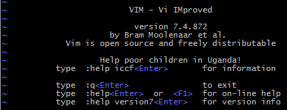
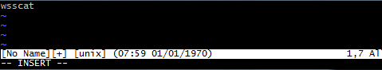
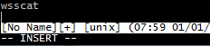
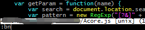
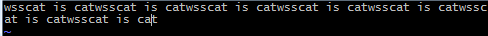
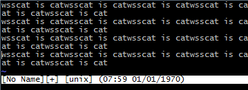
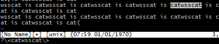
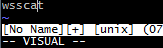

# 预览

# i

Insert 模式，按 ESC 回到 Normal 模式，反正如果不知道现在是在什么模式下，就一直按 ESC，回到 Normal 模式，下面功能键都是在 Normal 模式触发的

此时 Insert 模式跟记事本一样

操作 vim 会经常在这两个模式下切换，就如同在记事本中你在选项卡和编辑内容窗口中切换一样

# x

Normal 模式下，按 x 删除当前光标向后所在的一个字符，大写字母 X 删除当前光标向前的字符

# :wq

保存+退出 vim(:w 保存 :q 退出) 后面跟文件名

这个相当于记事本中的文件->（保存）另存为

# dd

删除当前行，并把删除的行保存到剪贴板里面，也是 IDE 里面常用的，快速删除一行代码，不用长按退格了。

大写字母 D 删除当前行当前及之后的字符，如果当前以及当前之后的字符没有，则按一次删除之前的一个字符

# p

粘贴剪切板，这个功能挺常用的，如果在外面复制完东西，直接在 vim 界面按 p 就可以粘贴了

# yy

复制当前行到剪切板

# help

显示相关命令的帮助

# :q

退出

# :q!

不保存直接退出

# a

在光标后插入，如果本来光标不在最后就会自动帮你定格到最后输入

大写字母 A 在行尾插入

# o

在当前行后面插入一个新行，相当于记事本一行的最后敲回车键

大写字母 O 在当前行前面插入

# 0

按数字 0 就是到行头，跟 \$ 是相反的

# ^ 符号

这个是要结合 shift+6，到本行第一个非 blank 字符的位置（所谓 blank 字符就是空格，tab，换行，回车等）

# \$ 符号

光标切换到本行行尾

# /pattern

搜索 pattern 的字符串

如果搜索出多个匹配，按 n 可以定位到下一个

# u

撤销就是 Undo，这个功能基本 IDE 都是有的，挺常用的，如同我用 PS 时候 ctrl+z 那样方便

# ctrl+r

重做也就是 Redo

# :e <文件路径/文件名>

打开一个文件，直接在 Vim 中打开某文件

# :w

保存

# :saveas <文件路径/文件名>

另存为

# :x、ZZ、shift+z、:wq

上面这三个都是保存并退出，注意 ZZ 是不需要输入冒号和回车的

# q!

退出但不保存

# :qa

强行退出所有的正在编辑的文件，就算别的文件有更改

# :bn, :bq

有时候我们需要打开多个文件，就是在一个文件已经打开的情况下我们可以继续用:e 来打开其他文件，当打开多个文件的时候，可以使用上面这两个命令来切换下一个或者上一个文件

# . 符号

这个命令可以重复执行自己运行的上一个命令

# N<命令>

打这个的时候是不可见的，也就是盲打，N 就是输入一个数字，比如我输入 9p，就会出现下图这个

# G

将光标定位到最后一行的头部

# w

到下一个单词的开头。

# e

到下一个单词的结尾。

- 如果你认为单词是由默认方式，那么就用小写的 e 和 w。默认上来说，一个单词由字母，数字和下划线组成
- 如果你认为单词是由 blank 字符分隔符，那么你需要使用大写的 E 和 W。

# \* 和 `#`

当你把光标放到 catwsscat 上的时候按 \* 或者 # 就会移动到匹配该单词的上一个或者下一个

- `*` 在键盘左边是匹配上一个单词
- `#` 在键盘右边是匹配下一个单词

# `%` 符号

匹配括号移动，支持(，{， [，你需要把光标先移到括号上

# v

进入可视化选择后按键盘的上下左右的方向键都会帮你自动选择

可视化选择下

- J → 把所有的行连接起来（变成一行）
- < 或 > → 左右缩进
- = → 自动给缩进 （这个确实挺方便的）
