从 2017 年发出关于 v5 的投票开始，到 2019 年 10 月发布第一个 beta 版本，目前是 5.0.0-beta.16。现在在收集使用反馈、生态升级的过程中，相信不久后就可以正式发布了。这次升级重点：性能改进、Tree Shacking、Code Generation、Module Federation。

下面我们跟着 Changelog 来动手，测测重点内容~

# 优化持久缓存

首先简单说 Webpack 中 graph 的概念：

Webpack 在执行的时候，以配置的 entry 为入口，递归解析文件依赖，构建一个 graph，记录代码中各个 module 之间的关系。每当有文件更新的时候，递归过程会重来，graph 发生改变。

如果简单粗暴地重建 graph 再编译，会有很大的性能开销，Webpack 利用缓存实现增量编译，从而提升构建性能。

缓存（内存 / 磁盘两种形式）中的主要内容是 module objects，在编译的时候会将 graph 以二进制或者 json 文件存储在硬盘上。每当代码变化、模块之间依赖关系改变导致 graph 改变时，Webpack 会读取记录做增量编译。

## 之前持久缓存的方式

之前可以使用 loader 设置缓存：

1. 使用 cache-loader 可以将编译结果写入硬盘缓存，Webpack 再次构建时如果文件没有发生变化则会直接拉取缓存
2. 还有一部分 loader 自带缓存配置，比如 babel-loader，可以配置参数 cacheDirectory 使用缓存，将每次的编译结果写进磁盘（默认在 node_modules/.cache/babel-loader 目录），UglifyJsPlugin 插件中的 cache 选项
3. terser-webpack-plugin 开启缓存
4. hard-source-webpack-plugin 插件
5. webpack.DllPlugin 插件

## 现在的方案

v5 中缓存默认是 memory，你可以修改设置写入硬盘：

```js
module.exports = {
  cache: {
    type: 'filesystem',
    // cacheDirectory 默认路径是 node_modules/.cache/webpack
    cacheDirectory: path.resolve(__dirname, '.temp_cache')
  }
};
```

注：对大部分 `node_modules` 哈希处理以构建依赖项，代价昂贵，还降低 Webpack 执行速度。为避免这种情况出现，Webpack 加入了一些优化，默认会跳过 `node_modules`，并使用 package.json 中的 version 和 name 作为数据源，有点类似于 webpack.DllPlugin

# 优化长期缓存

Webpack 5 针对 moduleId 和 chunkId 的计算方式进行了优化，增加确定性的 moduleId 和 chunkId 的生成策略。moduleId 根据上下文模块路径，chunkId 根据 chunk 内容计算，最后为 moduleId 和 chunkId 生成 3 - 4 位的数字 id，实现长期缓存，生产环境下默认开启。

## 对比原来的 moduleId

原来的 moduleId 默认值是自增 id，容易导致文件缓存失效。在 v4 之前，可以安装 HashedModuleIdsPlugin 插件覆盖默认的 moduleId 规则， 它会使用模块路径生成的 hash 作为 moduleId。在 v4 中，可以配置 optimization.moduleIds = 'hashed'

## 对比原来的 chunkId

原来的 chunkId 默认值自增 id。比如这样的配置下，如果有新的 entry 增加，chunk 数量也会跟着增加，chunkId 也会递增。之前可以安装 NamedChunksPlugin 插件来稳定 chunkId；或者配置 optimization.chunkIds = 'named'

# NodeJS 的 polyfill 脚本被移除

最开始，Webpack 目标是允许在浏览器中运行 Node 模块。但是现在在 Webpack 看来，大多模块就是专门为前端开发的。在 v4 及以前的版本中，对于大多数的 Node 模块会自动添加 polyfill 脚本，polyfill 会加到最终的 bundle 中，其实通常情况下是没有必要的。在 v5 中将停止这一行为。

比如以下一段代码：

```js
// index.js
import sha256 from 'crypto-js/sha256';

const hashDigest = sha256('hello world');
console.log(hashDigest);
```

在 v4 中，会主动添加 crypto 的 polyfill，也就是 crypto-browserify。我们运行的代码是不需要的，反而最后的包变大，编译结果 `417 kb`：

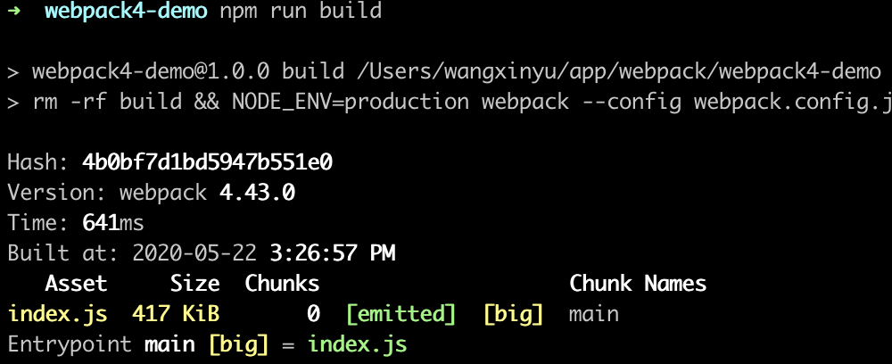

在 v5 中，如果遇到了这样的情况，会提示你进行确认。如果确认不需要 node polyfill，按照提示 alias 设置为 false 即可。最后的编译结果仅有 `5.69 kb`：

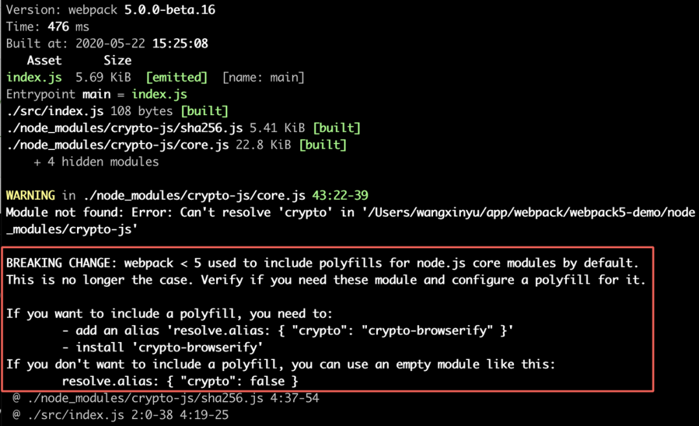

配置 `resolve.alias: { crypto: false }：`

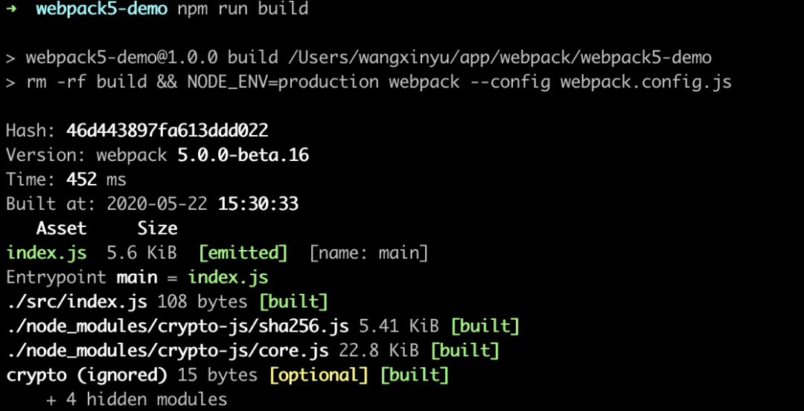

浏览器执行结果：

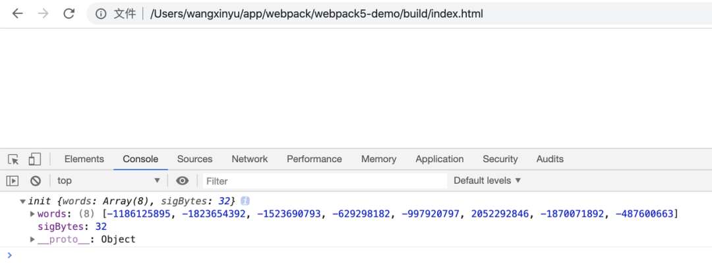

# 更好的 TreeShaking

现在有这样一段代码：

```js
// inner.js
export const a = 'aaaaaaaaaa';
export const b = 'bbbbbbbbbb';

// module.js
import * as inner from './inner';
export { inner };

// index.js
import * as module from './module';
console.log(module.inner.a);
```

在 v4 中毫无疑问，以上代码 a、b 变量是被全部打包的：

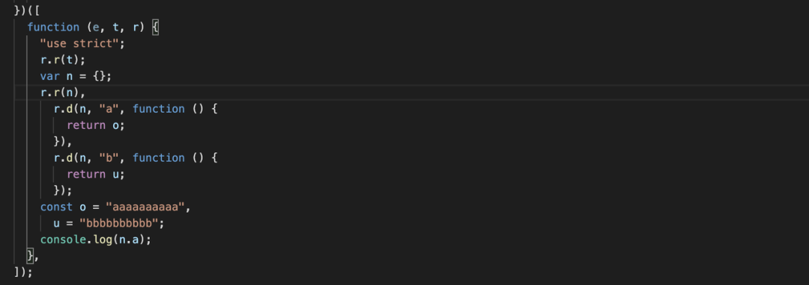

但我们只调用了 a 变量，理想情况应该是 b 被识别为 unused，不被打包。这一优化在 v5 中实现了。在 v5 中会分析模块 export 与 import 之间的依赖关系，最终的代码生成非常简洁：

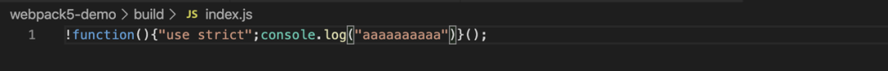

# Module Federation

让 Webpack 达到了线上 runtime 的效果，让代码直接在独立应用间利用 CDN 直接共享，不再需要本地安装 NPM 包、构建再发布了！

## 之前共享代码的处理方式

### NPM

维护一个 CommonComponents 的 NPM 包，在不同项目中安装、使用。如果 NPM 包升级，对应项目都需要安装新版本，本地编译，打包到 bundle 中。

### UMD

UMD 优点在 runtime。缺点也明显，体积优化不方便，容易有版本冲突。

### 微前端

独立应用间的共享也是问题。一般有两种打包方式：

1. 子应用独立打包，模块解耦了，但公共的依赖不易维护处理
2. 整体应用一起打包，能解决公共依赖；但庞大的多个项目又使打包变慢，后续也不好扩展

## 全新的解决方案


从图中可以看到，这个方案是直接将一个应用的 bundle，应用于另一个应用。

应用可以模块化输出，就是说它本身可以自我消费，也可以动态分发 runtime 子模块给其他应用。

理论比较抽象，我们动手试一下。

## 实践测试

现在有两个应用 app1 (localhost:3001)、app2 (localhost:3002)：

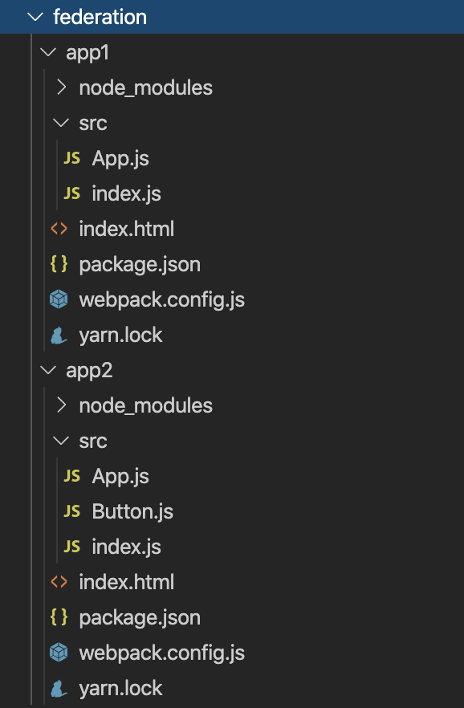

入口文件：

```js
// app1 & app2: index.js
import App from './App';
import React from 'react';
import ReactDOM from 'react-dom';

ReactDOM.render(<App />, document.getElementById('root'));
```

app2 生产了 Button 组件：

```js
// app2: Button.js
import React from 'react';

const Button = () => <button>App 2 Button</button>;

export default Button;
```

app2 自身消费 Button 组件：

```js
// app2: App.js
import LocalButton from './Button';
import React from 'react';

const App = () => (
  <div>
    <h1>Basic Host-Remote</h1>
    <h2>App 2</h2>
    <LocalButton />
  </div>
);

export default App;
```

app1 引用 app2 的 Button 组件：

```js
// app1: App.js
import React from 'react';
const RemoteButton = React.lazy(() => import('app2/Button'));

const App = () => (
  <div>
    <h1>Basic Host-Remote</h1>
    <h2>App 1</h2>
    <React.Suspense fallback='Loading Button'>
      <RemoteButton />
    </React.Suspense>
  </div>
);

export default App;
```

先看生产了 Button 组件的 app2，其配置文件：

```js
// app2：webpack.config.js
const HtmlWebpackPlugin = require('html-webpack-plugin');
const { ModuleFederationPlugin } = require('webpack').container;
const path = require('path');

module.exports = {
  entry: './src/index',
  mode: 'development',
  devServer: {
    contentBase: path.join(__dirname, 'dist'),
    port: 3002
  },
  output: {
    publicPath: 'http://localhost:3002/'
  },
  module: {
    rules: [
      // ...
    ]
  },
  plugins: [
    new ModuleFederationPlugin({
      name: 'app2Lib',
      library: { type: 'var', name: 'app2Lib' },
      filename: 'app2-remote-entry.js',
      exposes: {
        Button: './src/Button'
      },
      shared: ['react', 'react-dom']
    }),
    new HtmlWebpackPlugin({
      template: './index.html'
    })
  ]
};
```

这段配置描述了，需要暴露出 Button 组件、需要依赖 react、react-dom。管理 exposes 和 shared 的模块为 app2Lib，生成入口文件名为 app-remote-entry.js。

app1 的配置文件：

```js
const HtmlWebpackPlugin = require('html-webpack-plugin');
const { ModuleFederationPlugin } = require('webpack').container;
const path = require('path');

module.exports = {
  entry: './src/index',
  mode: 'development',
  devServer: {
    contentBase: path.join(__dirname, 'dist'),
    port: 3001
  },
  output: {
    publicPath: 'http://localhost:3001/'
  },
  module: {
    rules: [
      // ...
    ]
  },
  plugins: [
    new ModuleFederationPlugin({
      name: 'app1',
      library: { type: 'var', name: 'app1' },
      remotes: {
        app2: 'app2Lib'
      },
      shared: ['react', 'react-dom']
    }),
    new HtmlWebpackPlugin({
      template: './index.html'
    })
  ]
};
```

这段配置描述了，使用远端模块 app2Lib，依赖 react、react-dom。

最后一步：在 app1 html 中加载 app2-remote-entry.js：

```html
<!-- app1: index.html -->
<html>
  <head>
    <script src="http://localhost:3002/app2-remote-entry.js"></script>
  </head>
  <body>
    <div id="root"></div>
  </body>
</html>
```

运行结果：

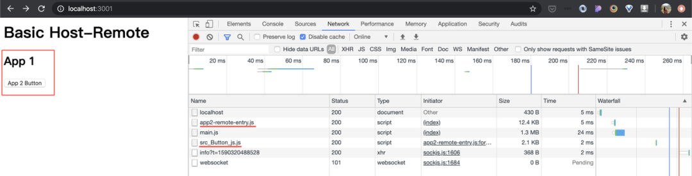

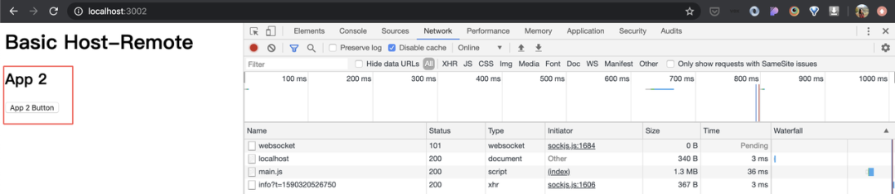

## 引用的 app2/Button 是如何找到的呢？

通过 app1 的配置文件，知道了 app2 是远端加载。在生成的 app1 main.js 描述为：

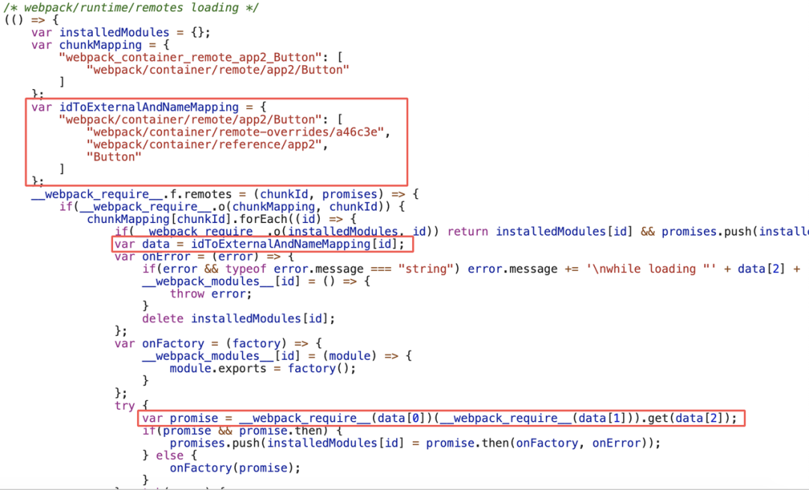

看这里的 data 数组：

data[1] 即 webpack/container/reference/app2，这里是返回 app2Lib 对象：

```js
module.exports = app2Lib;
```

data[0] 即 webpack/container/remote-overrides/a46c3e，这里提供了 app2 需要的 react、react-dom 依赖，并返回 app2Lib：

```js
module.exports = (external) => {
  if (external.override) {
    external.override(
      Object.assign(
        {
          react: () => {
            return Promise.resolve().then(() => {
              return () => __webpack_require__(/*! react */ './node_modules/react/index.js');
            });
          },
          'react-dom': () => {
            return Promise.resolve().then(() => {
              return () => __webpack_require__(/*! react-dom */ './node_modules/react-dom/index.js');
            });
          }
        },
        __webpack_require__.O
      )
    );
  }
  return external;
};
```

所以最后 promise 的赋值变成了：

```js
var promise = app2Lib.get('Button');
```

这么一看，app2Lib 是全局变量呀。

继续看 app1 加载的 app2-remote-entry.js 内容。果然，生成了一个全局变量 app2Lib：

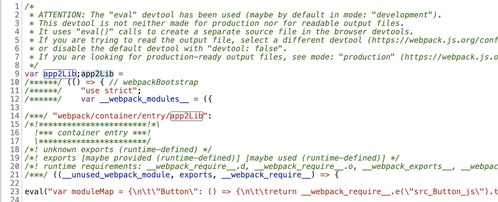

app2Lib 对象拥有两个方法，具体为：

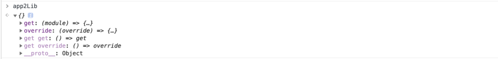

```js
var get = (module) => {
  return __webpack_require__.o(moduleMap, module)
    ? moduleMap[module]()
    : Promise.resolve().then(() => {
        throw new Error('Module "' + module + '" does not exist in container.');
      });
};

var override = (override) => {
  Object.assign(__webpack_require__.O, override);
};
```

所以，app2/Button 实际就是 app2Lib.get('Button')，然后根据映射找到模块，随后 `__webpack_require__`：

```js
var moduleMap = {
  Button: () => {
    return __webpack_require__
      .e('src_Button_js')
      .then(() => () => __webpack_require__(/*! ./src/Button */ './src/Button.js'));
  }
};
```

最后再说 shared: ['react', 'react-dom']：

app2 中指明了需要依赖 react、react-dom，并期望消费的应用提供。如果 app1 没有提供，或没有提供指定版本，如下把代码注释：

```js
plugins: [
  new ModuleFederationPlugin({
    name: 'app1',
    library: { type: 'var', name: 'app1' },
    remotes: {
      app2: 'app2Lib'
    }
    // shared: ["react", "react-dom"],
    // 版本不一致同理
    // shared: {
    //   "react-15": "react",
    //   "react-dom": "react-dom",
    // },
  }),
  new HtmlWebpackPlugin({
    template: './index.html'
  })
];
```

那么，刚才 app1 main.js 中的 data[0] 即 webpack/container/remote-overrides/a46c3e 会变为：

```js
module.exports = (external) => {
  if (external.override) {
    external.override(__webpack_require__.O);
    // external.override(Object.assign({
    //   "react": () => {
    //     return Promise.resolve().then(() => {
    //       return () => __webpack_require__(/*! react */ "./node_modules/react/index.js")
    //     })
    //   },
    //   "react-dom": () => {
    //     return Promise.resolve().then(() => {
    //       return () => __webpack_require__(/*! react-dom */ "./node_modules/react-dom/index.js")
    //     })
    //   }
    // }, __webpack_require__.O))
  }
  return external;
};
```

app1 则从 app2 加载 react 依赖：


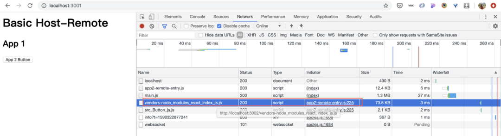

总结，根据 app2 配置的 exposes & shared 内容，产生对应的模块文件，以及模块映射关系，通过全局变量 app2Lib 进行访问；app1 通过全局变量 get 能知道应该去如何加载 button.js，override 能知道共享依赖的模块。

以上，Federation 初看很像 DLL + External，但好处是你无需手动维护、打包依赖，代码运行时加载。这种模式下，调试也变得容易，不再需要复制粘贴代码或者 npm link，只需要启动应用即可。这里仅以 Button 组件为例，Button 可以是一个组件，也可以是一个页面、一个应用。Module Federation 的落地，结合自动化流程等系列工作，还需要大家在各自场景中实践。

# 其他特性

- Top Level Await
- SplitChunks 支持更灵活的资源拆分
- 不包含 JS 代码的 Chunk 将不再生成 JS 文件
- Output 默认生成 ES6 规范代码，也支持配置为 5 - 11
