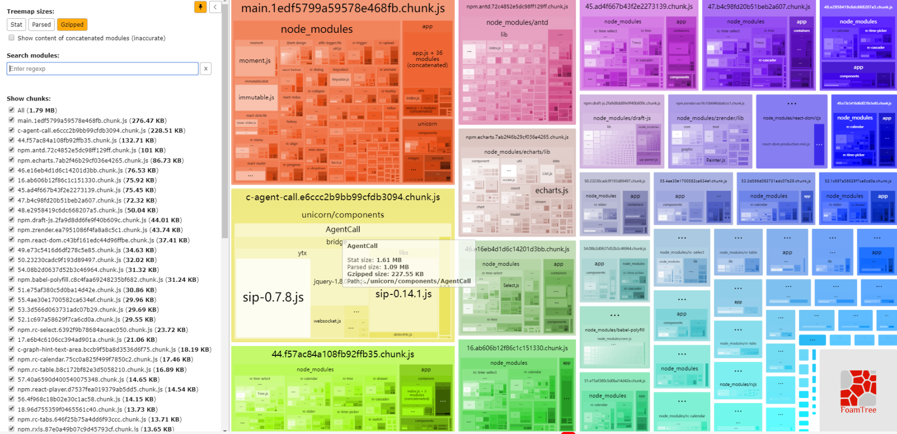
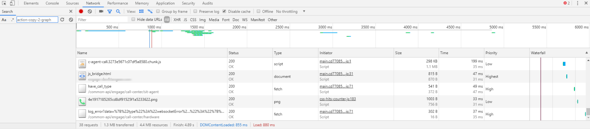
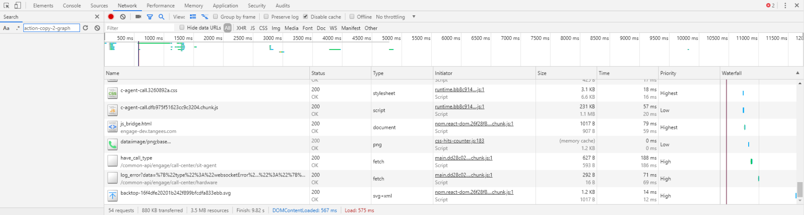

接上文[Webpack配置笔记](/webpack-config-note/)

# 分包策略

在分支 `feature/optimize_webpack` 上启动 `yarn analyze` 脚本，得到分包策略如下：



# 首屏加载对比

## 原始首屏加载



## 升级后加载



# 分包优化步骤

## echarts只提取需要的包

`app\components\ECharts\component.js`

```js
import echarts from 'echarts/lib/echarts';
import 'echarts/lib/chart/bar';
import 'echarts/lib/chart/line';
import 'echarts/lib/chart/pie';

import 'echarts/lib/component/tooltip';
import 'echarts/lib/component/legendScroll';
```

## immutable 指向同一份，避免 draft 与 antd 重复打包

`internals/webpack/webpack.base.babel.js`

```js
'immutable': path.resolve(process.cwd(), 'node_modules/immutable'),
```

## 分大模块改写法

### 根据路由来分

这里原来的路由引用模块已经是 `import().then()` 形式的了，所以我在 `webpack` 里的 `splitChunks` 加了如下策略

`internals/webpack/webpack.prod.babel.js`

```js
splitChunks: {
  chunks: 'all', // 不管文件是动态还是非动态载入，统一将文件分离。当页面首次载入会引入所有的包
  maxInitialRequests: 10, // 最大初始化请求数
  minSize: 0, // 默认30000，为了不合并 chunk
  cacheGroups: {
    vendor: {
      test: /[\\/]node_modules[\\/]/,
      name(module) {
        const packageName = module.context.match(
          /[\\/]node_modules[\\/](.*?)([\\/]|$)/,
        )[1];
        return `npm.${packageName.replace('@', '')}`; // 提取各个第三方组件，只在需要时提取
      },
    },
  },
},
```

经实验，可以看到各个页面只加载所需的包

### 根据组件来分

对其中比较大的组件进行了懒加载处理，react-player/draft/echarts

其中有一个比较大的问题就是懒加载组件引用不到 ref 的问题，经多次实验，更改写法如下

```js{16-23}
import React from 'react';
import Loadable from 'react-loadable';

const LoaderCache = new Map();
export default function loadComponent(loader, options) {
  let component = LoaderCache.get(loader);
  if (!component) {
    component = Loadable({
      loader,
      loading: (props) => {
        if (props.error) {// eslint-disable-line
          console.error('[chunk loader]', props.error); // eslint-disable-line
        }
        return <div />;
      },
      render: (loaded, props) => {
        const Component = loaded.default;
        const { withRef, ...rest } = props; // eslint-disable-line
        return (<Component
          ref={(r) => { withRef && withRef(r); }}
          {...rest}
        />);
      },
      ...options,
    });
    LoaderCache.set(loader, component);
    // component.preload();
  }
  return component;
}
```

用法：

`app\components\GraphHintTextArea\index.js`

```js
import loadComponent from 'utils/loader';

export default loadComponent(() => import(/* webpackChunkName: "c-graph-hint-text-area" */'./component'), null);
```

```jsx
<GraphHintTextArea
  withRef={(r) => { this.graphHintTextArea = r; }}
/>
```

## antd只加载需要的icon

`internals/webpack/webpack.base.babel.js`

```js
'@ant-design/icons/lib/dist$': path.resolve('app/icons'),
```

`app/icons/index.js`

```js
// fill
export {
  default as ExclamationCircleFill,
} from '@ant-design/icons/lib/fill/ExclamationCircleFill';
// outline
export {
  default as QuestionCircleOutline,
} from '@ant-design/icons/lib/outline/QuestionCircleOutline';
// twotone
export {
  default as ProfileTwoTone,
} from '@ant-design/icons/lib/twotone/ProfileTwoTone';
```
