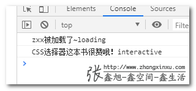
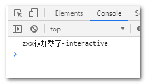

# 简介

document.readyState 是一个只读属性，可以返回当前文档的准备状态。

语法

```js
var state = document.readyState;
```

其中 state 值包含下面三个值：

- loading  
  表示文档正在加载中。
- interactive  
  表示文档已完成加载，文档已被解析，但图像、样式表和框架等子资源仍在加载。
- complete  
  表示文档和所有子资源已完成加载。如果状态变成这个，表明 load 事件即将触发。

# DOM 事件绑定没必要等 domready

对于 web 页面开发，JavaScript 最主要的功能之一就是页面上 DOM 元素的交互实现，如果 DOM 元素还没有加载也没有被解析，自然这些 DOM 操作难以为继。于是，JS 初始化的时机就变得很重要。

实际上，如果我们的 JS 文件以及 script 代码都放在页面的底部，我们不用考虑 JS 初始化时机，因为 JS 放在底部，等到要执行的时候，上面 DOM 都已经解析好了。也就是什么 readyState，什么 DOMContentLoaded 都不需要考虑。

```js
$(document).ready(function() {});
// $(document).ready这一戳东西删掉，只要你的JS代码是在页面底部的，这些都完全不需要
(function() {})();
```

# DOMContentLoaded 事件

document.readyState 越来越少用到的另外一个原因，就是半路上杀出一个程咬金——'DOMContentLoaded'事件。

DOMContentLoaded 事件是 DOM Level 3 新增的一个事件类型，IE9+浏览器支持，表示 DOM 节点内容加载完毕。

```js
document.addEventListener('DOMContentLoaded', function() {});

window.addEventListener('DOMContentLoaded', function() {});
```

DOMContentLoaded 设计初衷就是为了方便 JS 代码的初始化，要比记得记不住的 interactive 状态容易理解，也容易使用的多。

因此，如果为了提防我们的 JavaScript 代码不小心跑到了页面的顶部，需要确保在 DOM 加载完毕之后执行，推荐使用下面代码：

```js
window.addEventListener('DOMContentLoaded', function() {});
```

由于`<script>`元素本身也是 DOM 元素，因此，只要脚本不是异步加载的，无论放在页面什么位置，DOMContentLoaded 事件一定会触发。

假设有一个名为 insert.js 的文件，里面的 JS 代码如下：

```js
console.log('zxx被加载了~' + document.readyState);
window.addEventListener('DOMContentLoaded', function() {
  console.log('CSS选择器这本书很赞哦！' + document.readyState);
});
```

然后还有一个名为 load-test.html 的页面，里面代码这样：

```html
<body>
  <script src="./insert.js"></script>
</body>
```

结果页面进入，控制台出现了下图所示的结果：



可以看到，"DOMContentLoaded"事件绑定时候文档状态是'loading'，执行的时候文档状态是可交互的'interactive'。

配合其他测试（这里不展示），我们可以得出一个网页文档几个加载状态变化和事件触发顺序是这样子的：

```bash
document.readyState = 'loading'
↓
document.readyState变成'interactive'
↓
'DOMContentLoaded'事件执行
↓
document.readyState变成'complete'
↓
'load'事件执行
```

以及可以推测出一个结论：

**DOMContentLoaded 事件必须在文档状态为 loading 时候绑定才有效。**

正是由于上面推论，才使得 document.readyState 有了应用场景。

# 应用

由于 DOMContentLoaded 事件绑定后可能并不会执行，于是出现了需要用到 document.readyState 的场景。

什么时候 DOMContentLoaded 事件不会执行呢？

那就是相关脚本是在页面 DOM 加载完毕后执行的场景下。

假设有一个名为 insert.js 的文件，里面的 JS 代码如下：

```js
console.log('zxx被加载了~' + document.readyState);
window.addEventListener('DOMContentLoaded', function() {
  console.log('CSS选择器这本书很赞哦！');
});
```

然后还有一个名为 load-test.html 的页面，里面代码这样：

```html
<body>
  <script>
    var eleScript = document.createElement('script');
    eleScript.src = './insert.js';
    document.head.appendChild(eleScript);
  </script>
</body>
```

结果页面进入，控制台只有'zxx 被加载了~'的文案，并没有 DOMContentLoaded 事件中的 console.log 输出，如下图所示：



因为 DOMContentLoaded 事件绑定的时候，页面的准备状态已经是'interactive'而不是'loading'了。

如果 insert.js 是一个公用组件，尤其以后会开源的那种，那势必要考虑到各种加载场景，页面的头部，页面底部，或者异步动态加载，此时，单纯靠 DOMContentLoaded 事件只能覆盖前两种情况，异步动态加载无能为力。

此时，一直认为没什么锤子用的 document.readyState 倒是排上了用场，假设组件的初始方法名为 init，则好的实现方法是这样的：

```js
if (document.readyState != 'loading') {
  init();
} else {
  window.addEventListener('DOMContentLoaded', function() {
    init();
  });
}
```

这是当下实际开发中，唯一需要使用 document.readyState 的场景，在开源或者大规模使用的框架或组件中精准初始化使用。
