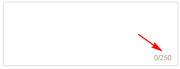
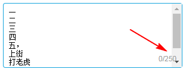
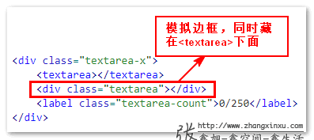

# 了解 CSS :focus-within 伪类

CSS :focus-within 伪类选择器和 IE8 就开始支持的:focus 可以说是近亲，区别在于:focus 表示当前元素处于 focus 状态时候干嘛干嘛，而:focus-within 表示当前元素或者当前元素的子元素处于 focus 状态时候干嘛干嘛。

举个例子：

```css
form:focus {
  outline: solid;
}
```

表示仅仅当`<form>`处于 focus 状态时候，`<form>`元素 outline 出现。换句话说，子元素 focus，可以让任意父级元素样式发生变化。

这个新特性的支持，未来势必会带来更加丰富的交互形式，以及特定场景简化我们实现。

# CSS :focus-within 伪类实际应用举例

## 表单输入勿扰模式

当我们表单输入，选择或者进行交互时候，页面上表单以为其他内容全部都不可见。

<iframe src="/examples/css-focus-within-pseudo-class-selector/focus-within-form-dnd-mode.html" width="400" height="100"></iframe>

`embed:css-focus-within-pseudo-class-selector/focus-within-form-dnd-mode.html`

本案例是真实的勿扰模式效果可以放心大胆在实际项目中使用，因为这是一个体验增强的交互，就算浏览器不支持，对原本功能也不会有任何影响。

## 带计数文本域的 focus 高亮

对于带计数的组件化的多行文本域，计数的数值通常是设计在文本域的右下角，这样能够适应各种复杂的场景。如下截图：



然而这种设计对我们的布局实现带来的挑战。

我们通常想到的方法是，计数元素浮在下面的 textarea 元素上。然而这种实现存在有致命的不足，那就是输入框的内容有可能和我们的计数重叠，以及出现的滚动条和技术文本重叠，如下截图所示：



因此，我们通常做法就是：边框使用父级`<div>`元素模拟，文本域元素和技术元素上下依次排列（非重叠），文本域原本的边框去除。

假设 HTML 如下：

```html
<div class="textarea-x">
  <textarea></textarea>
  <label class="textarea-count">0/250</label>
</div>
```

则核心 CSS 这样：

```css
/* 父级div元素模拟边框 */
.textarea-x {
  border: 1px solid #d0d0d5;
  border-radius: 4px;
  background-color: #fff;
}

/* 文本域原本的边框去除 */
.textarea-x > textarea {
  border: 0;
  background: none;
}
```

然而上面的实现有个非常严重的不足，那就是`<textarea>`元素 :focus 时候，边框无法高亮，因为 CSS 中没有父选择器！

因此，实际开发的时候，我们会使用相邻兄弟选择器，以及新建一个兄弟元素来模拟边框。

HTML 结构如下：

```html
<div class="textarea-x">
  <textarea></textarea>
  <div class="textarea"></div>
  <label class="textarea-count">0/250</label>
</div>
```

原理如下图示意：



```css
.textarea-x {
  position: relative;
  z-index: 0;
}

.textarea-x > textarea {
  border: 0;
  background: none;
  outline: 0;
  resize: none;
  position: relative;
}

.textarea-x > .textarea {
  position: absolute;
  border: 1px solid #d0d0d5;
  border-radius: 4px;
  background-color: #fff;
  top: 0;
  bottom: 0;
  left: 0;
  right: 0;
  z-index: -1;
}

.textarea-x > :focus + .textarea {
  border-color: #00a5e0;
}
```

由于.textarea 元素和原生的`<textarea>`元素是相邻兄弟关系，因此我们可以借助相邻兄弟选择器，让`<textarea>`元素 focus 时候后面用来模拟边框的 .textarea 元素高亮。也就是这么一段 CSS 代码：

```css
.textarea-x > :focus + .textarea {
  border-color: #00a5e0;
}
```

这种实现兼容 IE7+ 浏览器。

<iframe src="/examples/css-focus-within-pseudo-class-selector/focus-textarea-border-highlight-compatible.html" width="400" height="100"></iframe>

`embed:css-focus-within-pseudo-class-selector/focus-textarea-border-highlight-compatible.html`

但是，现在有了 CSS :focus-within 伪类选择器，我们的事情就简单多了。

<iframe src="/examples/css-focus-within-pseudo-class-selector/focus-within-textarea-highlight.html" width="400" height="100"></iframe>

`embed:css-focus-within-pseudo-class-selector/focus-within-textarea-highlight.html`

# 更多场景

:focus-within 伪类原本设计的作用是原生表单元素 focus 时候，祖先`<form>`元素可以也有状态变化。

但是在我看来，:focus-within 功能之强悍，远远不是仅仅和祖先`<form>`元素玩过家家这么简单。

理论上，只要页面上任意一个元素 focus，通过:focus-within 就能对页面上任意的元素进行样式控制。

例如：

```css
html:focus-within xxx {
}
```

1. 相邻选择器，加号，或者弯弯都只能选择后面的元素，但是有了:focus-within，我们就可以对前面元素进行控制，虽然只能在:focus 行为场景下。例如请重复输入密码时候，让上面的输入密码框也高亮。
2. 基于纯 CSS 和 focus 行为实现下拉列表的交互成为了可能。只要把按钮和下拉元素放在一个容器中，就可以了。

   <iframe src="/examples/css-focus-within-pseudo-class-selector/focus-within-pure-css-droplist.html" width="400" height="100"></iframe>

   `embed:css-focus-within-pseudo-class-selector/focus-within-pure-css-droplist.html`
