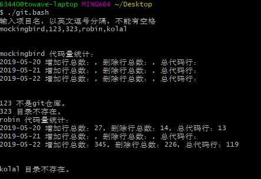
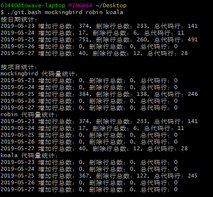
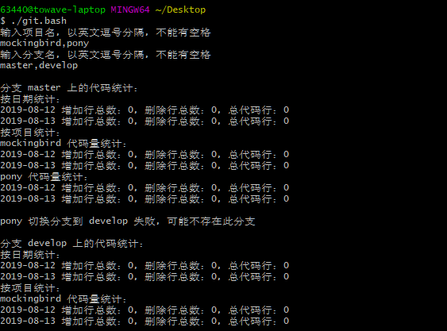
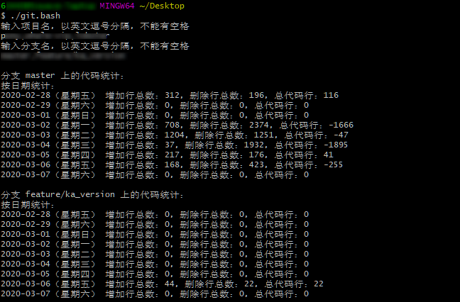
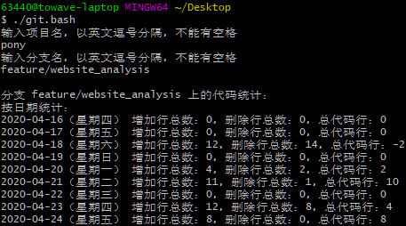

# 需求背景

由于每个周末放假前都要给出代码量的统计，如果是手动统计的话需要到各个开发过的项目下运行相应的脚本，太过繁琐。故写出以下第一版统计代码量的脚本

# 代码展示

以下是统计 G:/project/tungee/ 目录下的代码量，其中标红部分需要修改为自己的项目路径和 git 邮箱

## 第一版

### 按项目统计

```bash{25,29,33,40}
#!/bin/sh
# 能够检测一些错误，并在错误发生时中断程序并输出信息
# 使用 set -e 令脚本在发生错误时退出而不是继续运行；使用 set -u 来检查是否使用了未赋值的变量；试试 set -o pipefail，它可以监测管道中的错误。
set -euo pipefail
trap "echo 'error: Script failed: see failed command above'" ERR
# {} 防止下载不完全代码被执行
{
  function to_array(){
    x=$1
    OLD_IFS="$IFS"
    IFS=","
    array=($x)
    IFS="$OLD_IFS"
    for each in ${array[*]}
    do
    echo $each
    done
  }
  echo "输入项目名，以英文逗号分隔，不能有空格"
  read input
  files=($(to_array $input))
  echo -e "\n"
  for file in ${files[@]}
  do
    if [ ! -d "G:/project/tungee/$file" ]; then
      echo -e "$file 目录不存在。"
      continue;
    fi
    if [ ! -d "G:/project/tungee/$file/.git" ]; then
      echo -e "$file 不是git仓库。"
      continue;
    fi
    cd "G:/project/tungee/$file"
    echo "$file 代码量统计："
    i=`date +%w`
    while [ $i -ge 1 ]
    do
      sinceDate=`date -d "-$i day" +%Y-%m-%d`
      untilDate=`date -d "-$(($i-1)) day" +%Y-%m-%d`
      git log --author="634407147@qq.com" --since=$sinceDate --until=$untilDate --pretty=tformat: --numstat | gawk '{ add += $1 ; subs += $2 ; loc += $1 - $2 } END { printf "'$untilDate' 增加行总数：%s，删除行总数：%s，总代码行：%s\n", add, subs, loc }'
      i=$(($i-1))
    done
    echo -e "\n"
  done
}
```

### 运行效果



以上更新于`2019-5-22 22:17:24`

---

## 第二版

### 增加按日期统计和 shell 参数输入

```bash{21-22}
#!/bin/sh
# 周一到今天的代码量统计，使用方式：./git.bash mockingbird robin koala 或 执行 ./git.bash 后自行输入
# 能够检测一些错误，并在错误发生时中断程序并输出信息
# 使用 set -e 令脚本在发生错误时退出而不是继续运行；使用 set -u 来检查是否使用了未赋值的变量；试试 set -o pipefail，它可以监测管道中的错误。
set -euo pipefail
trap "echo 'error: Script failed: see failed command above'" ERR
# {} 防止下载不完全代码被执行
{
  function to_array() {
    x=$1
    OLD_IFS="$IFS"
    IFS=","
    array=($x)
    IFS="$OLD_IFS"
    for each in ${array[*]}
    do
    echo $each
    done
  }

  file_path="G:/project/tungee"
  git_email="634407147@qq.com"
  date_stat="date +%w" # 今天是一周的第几天，可换成具体数字 date_stat="echo 5" 以实现统计几天前代码的功能

  if [ $# -lt 1 ]; then
    echo "输入项目名，以英文逗号分隔，不能有空格"
    read input
    files=($(to_array $input))
  else
    files=$*
  fi

  echo -e "按日期统计："
  i=$($date_stat)
  while [ $i -ge 1 ]
  do
    add_sum=0
    subs_sum=0
    loc_sum=0
    for file in ${files[@]}
    do
      if [ ! -d "$file_path/$file" ]; then
        echo -e "$file 目录不存在。"
        continue;
      fi
      if [ ! -d "$file_path/$file/.git" ]; then
        echo -e "$file 不是git仓库。"
        continue;
      fi
      cd "$file_path/$file"
      since_date=`date -d "-$i day" +%Y-%m-%d`
      until_date=`date -d "-$(($i-1)) day" +%Y-%m-%d`
      eval $(git log --author=$git_email --since=$since_date --until=$until_date --pretty=tformat: --numstat | awk -v add=0 -v subs=0 -v loc=0 '{ add += $1 ; subs += $2 ; loc += $1 - $2 } END { printf "add=%s; subs=%s; loc=%s;", add, subs, loc }')
      add_sum=$(($add_sum + $add))
      subs_sum=$(($subs_sum + $subs))
      loc_sum=$(($loc_sum + $loc))
    done
    printf "$until_date 增加行总数：$add_sum，删除行总数：$subs_sum，总代码行：$loc_sum\n"
    i=$(($i-1))
  done

  echo -e "\n按项目统计："
  for file in ${files[@]}
  do
    if [ ! -d "$file_path/$file" ]; then
      echo -e "$file 目录不存在。"
      continue;
    fi
    if [ ! -d "$file_path/$file/.git" ]; then
      echo -e "$file 不是git仓库。"
      continue;
    fi
    cd "$file_path/$file"
    echo "$file 代码量统计："
    i=$($date_stat)
    while [ $i -ge 1 ]
    do
      since_date=`date -d "-$i day" +%Y-%m-%d`
      until_date=`date -d "-$(($i-1)) day" +%Y-%m-%d`
      git log --author=$git_email --since=$since_date --until=$until_date --pretty=tformat: --numstat | awk -v add=0 -v subs=0 -v loc=0 '{ add += $1 ; subs += $2 ; loc += $1 - $2 } END { printf "'$until_date' 增加行总数：%s，删除行总数：%s，总代码行：%s\n", add, subs, loc }'
      i=$(($i-1))
    done
  done
}
```

### 运行效果



## 第三版

### 增加按分支统计的功能，去掉 shell 参数输入（暂时不支持）

```bash
#!/bin/sh
# 周一到今天的代码量统计，使用方式：./git.bash mockingbird robin koala 或 执行 ./git.bash 后自行输入
# 能够检测一些错误，并在错误发生时中断程序并输出信息
# 使用 set -e 令脚本在发生错误时退出而不是继续运行；使用 set -u 来检查是否使用了未赋值的变量；试试 set -o pipefail，它可以监测管道中的错误。
# set -euo pipefail
# trap "echo 'error: Script failed: see failed command above'" ERR
# {} 防止下载不完全代码被执行
{
  function to_array() {
    x=$1
    OLD_IFS="$IFS"
    IFS=","
    array=($x)
    IFS="$OLD_IFS"
    for each in ${array[*]}
    do
    echo $each
    done
  }

  file_path="G:/project/tungee"
  git_email="634407147@qq.com"
  date_stat="date +%w" # 今天是一周的第几天，可换成具体数字如 date_stat="echo 5" 以实现统计几天前代码的功能

  echo "输入项目名，以英文逗号分隔，不能有空格"
  read input
  projects=($(to_array $input))
  echo "输入分支名，以英文逗号分隔，不能有空格"
  read input
  branches=($(to_array $input))

  for branch in ${branches[@]}
  do
    exist_branch_projects=()
    for file in ${projects[@]}
    do
      if [ ! -d "$file_path/$file" ]; then
        echo -e "$file 目录不存在。"
        continue;
      fi
      if [ ! -d "$file_path/$file/.git" ]; then
        echo -e "$file 不是git仓库。"
        continue;
      fi
      cd "$file_path/$file"
      git checkout $branch -q >/dev/null 2>&1 # 重定向错误信息，即屏蔽错误信息
      if [ $? -ne 0 ]; then
        echo -e "\n$file 切换分支到 $branch 失败，可能不存在此分支"
      else
        exist_branch_projects+=($file)
        git pull origin $branch -q
      fi
    done
    echo -e "\n分支 $branch 上的代码统计："
    {
      echo -e "按日期统计："
      i=$($date_stat)
      while [ $i -ge 1 ]
      do
        add_sum=0
        subs_sum=0
        loc_sum=0
        for file in ${exist_branch_projects[@]}
        do
          if [ ! -d "$file_path/$file" ]; then
            echo -e "$file 目录不存在。"
            continue;
          fi
          if [ ! -d "$file_path/$file/.git" ]; then
            echo -e "$file 不是git仓库。"
            continue;
          fi
          cd "$file_path/$file"
          # git checkout master
          since_date=`date -d "-$i day" +%Y-%m-%d`
          until_date=`date -d "-$(($i-1)) day" +%Y-%m-%d`
          eval $(git log --author=$git_email --since=$since_date --until=$until_date --pretty=tformat: --numstat | awk -v add=0 -v subs=0 -v loc=0 '{ add += $1 ; subs += $2 ; loc += $1 - $2 } END { printf "add=%s; subs=%s; loc=%s;", add, subs, loc }')
          add_sum=$(($add_sum + $add))
          subs_sum=$(($subs_sum + $subs))
          loc_sum=$(($loc_sum + $loc))
        done
        printf "$until_date 增加行总数：$add_sum，删除行总数：$subs_sum，总代码行：$loc_sum\n"
        i=$(($i-1))
      done

      echo -e "按项目统计："
      for file in ${exist_branch_projects[@]}
      do
        if [ ! -d "$file_path/$file" ]; then
          echo -e "$file 目录不存在。"
          continue;
        fi
        if [ ! -d "$file_path/$file/.git" ]; then
          echo -e "$file 不是git仓库。"
          continue;
        fi
        cd "$file_path/$file"
        # git checkout master
        echo "$file 代码量统计："
        i=$($date_stat)
        while [ $i -ge 1 ]
        do
          since_date=`date -d "-$i day" +%Y-%m-%d`
          until_date=`date -d "-$(($i-1)) day" +%Y-%m-%d`
          git log --author=$git_email --since=$since_date --until=$until_date --pretty=tformat: --numstat | awk -v add=0 -v subs=0 -v loc=0 '{ add += $1 ; subs += $2 ; loc += $1 - $2 } END { printf "'$until_date' 增加行总数：%s，删除行总数：%s，总代码行：%s\n", add, subs, loc }'
          i=$(($i-1))
        done
      done
    }
  done
}
```

### 运行效果



以上更新于`2019-8-15 20:49:40`

---

## 第四版

第三版的统计代码的数量对不上对应的时间，把昨天写的代码统计到今天了，做以下修复

同时增加星期几的优化提示

### 修复代码统计对应不上错误的时间以及添加星期几的提示

```bash{61-65,83,90}
#!/bin/sh
# 周一到今天的代码量统计，使用方式：./git.bash mockingbird robin koala 或 执行 ./git.bash 后自行输入
# 能够检测一些错误，并在错误发生时中断程序并输出信息
# 使用 set -e 令脚本在发生错误时退出而不是继续运行；使用 set -u 来检查是否使用了未赋值的变量；试试 set -o pipefail，它可以监测管道中的错误。
# set -euo pipefail
# trap "echo 'error: Script failed: see failed command above'" ERR
# {} 防止下载不完全代码被执行
{
  function to_array() {
    x=$1
    OLD_IFS="$IFS"
    IFS=","
    array=($x)
    IFS="$OLD_IFS"
    for each in ${array[*]}
    do
    echo $each
    done
  }

  file_path="G:/project/tungee"
  git_email="634407147@qq.com"
  date_stat="date +%w" # 今天是一周的第几天，可换成具体数字如 date_stat="echo 5" 以实现统计几天前代码的功能

  # if [ $date_stat -eq 0 ]; then
  #   date_stat=7
  # fi

  echo "输入项目名，以英文逗号分隔，不能有空格"
  read input
  projects=($(to_array $input))
  echo "输入分支名，以英文逗号分隔，不能有空格"
  read input
  branches=($(to_array $input))

  for branch in ${branches[@]}
  do
    exist_branch_projects=()
    for file in ${projects[@]}
    do
      if [ ! -d "$file_path/$file" ]; then
        echo -e "$file 目录不存在。"
        continue;
      fi
      if [ ! -d "$file_path/$file/.git" ]; then
        echo -e "$file 不是git仓库。"
        continue;
      fi
      cd "$file_path/$file"
      git checkout $branch -q >/dev/null 2>&1 # 重定向错误信息，即屏蔽错误信息
      if [ $? -eq 0 ]; then
        exist_branch_projects+=($file)
        git pull origin $branch -q
      # else
      #   # echo -e "\n$file 切换分支到 $branch 失败，可能不存在此分支"
      fi
    done
    echo -e "\n分支 $branch 上的代码统计："
    {
      echo -e "按日期统计："
      # 或 i=$(($($date_stat)-1))
      # $(($a+$b)) 用于整数运算，相当于 `expr $a + $b`
      # $() 与 `` 相当于命令替换，执行结果替换
      i=`expr $($date_stat) - 1`
      while [ $i -ge 0 ]
      do
        add_sum=0
        subs_sum=0
        loc_sum=0
        for file in ${exist_branch_projects[@]}
        do
          if [ ! -d "$file_path/$file" ]; then
            echo -e "$file 目录不存在。"
            continue;
          fi
          if [ ! -d "$file_path/$file/.git" ]; then
            echo -e "$file 不是git仓库。"
            continue;
          fi
          cd "$file_path/$file"
          # git checkout $branch
          since_date=`date -d "-$i day" +%Y-%m-%d`
          since_week=`date -d "-$i day" +%A`
          until_date=`date -d "-$(($i-1)) day" +%Y-%m-%d`
          eval $(git log --author=$git_email --since=$since_date --until=$until_date --pretty=tformat: --numstat | awk -v add=0 -v subs=0 -v loc=0 '{ add += $1 ; subs += $2 ; loc += $1 - $2 } END { printf "add=%s; subs=%s; loc=%s;", add, subs, loc }')
          add_sum=$(($add_sum + $add))
          subs_sum=$(($subs_sum + $subs))
          loc_sum=$(($loc_sum + $loc))
        done
        printf "$since_date（$since_week） 增加行总数：$add_sum，删除行总数：$subs_sum，总代码行：$loc_sum\n"
        i=$(($i-1))
      done

      # echo -e "按项目统计："
      # for file in ${exist_branch_projects[@]}
      # do
      #   if [ ! -d "$file_path/$file" ]; then
      #     echo -e "$file 目录不存在。"
      #     continue;
      #   fi
      #   if [ ! -d "$file_path/$file/.git" ]; then
      #     echo -e "$file 不是git仓库。"
      #     continue;
      #   fi
      #   cd "$file_path/$file"
      #   # git checkout $branch
      #   echo "$file 代码量统计："
      #   i=$($date_stat)
      #   while [ $i -ge 1 ]
      #   do
      #     since_date=`date -d "-$i day" +%Y-%m-%d`
      #     until_date=`date -d "-$(($i-1)) day" +%Y-%m-%d`
      #     git log --author=$git_email --since=$since_date --until=$until_date --pretty=tformat: --numstat | awk -v add=0 -v subs=0 -v loc=0 '{ add += $1 ; subs += $2 ; loc += $1 - $2 } END { printf "'$until_date' 增加行总数：%s，删除行总数：%s，总代码行：%s\n", add, subs, loc }'
      #     i=$(($i-1))
      #   done
      # done
    }
  done
}
```

### 运行效果



以上更新于`2020-3-7 11:57:55`

---

## 第五版

第四版的代码统计今天的代码有 2 个问题：

1. 当 i 循环到 0 时，`-$(($i-1))` 这一行代码有问题，统计到的 `until_date` 比 `since_date` 反而早了一天，造成脚本统计错误
2. 统计今天的代码时，只传年月日会默认带上当前时分秒的时间导致统计不上，即还要加上时分秒，否则不能统计到今天的代码

### 修复统计今天代码

```bash{83-88}
#!/bin/sh
# 周一到今天的代码量统计，使用方式：./git.bash mockingbird robin koala 或 执行 ./git.bash 后自行输入
# 能够检测一些错误，并在错误发生时中断程序并输出信息
# 使用 set -e 令脚本在发生错误时退出而不是继续运行；使用 set -u 来检查是否使用了未赋值的变量；试试 set -o pipefail，它可以监测管道中的错误。
# set -euo pipefail
# trap "echo 'error: Script failed: see failed command above'" ERR
# {} 防止下载不完全代码被执行
{
  function to_array() {
    x=$1
    OLD_IFS="$IFS"
    IFS=","
    array=($x)
    IFS="$OLD_IFS"
    for each in ${array[*]}
    do
    echo $each
    done
  }

  file_path="G:/project/tungee"
  git_email="634407147@qq.com"
  date_stat="echo 9" # 今天是一周的第几天，可换成具体数字如 date_stat="echo 5" 以实现统计几天前代码的功能

  # if [ $date_stat -eq 0 ]; then
  #   date_stat=7
  # fi

  echo "输入项目名，以英文逗号分隔，不能有空格"
  read input
  projects=($(to_array $input))
  echo "输入分支名，以英文逗号分隔，不能有空格"
  read input
  branches=($(to_array $input))

  for branch in ${branches[@]}
  do
    exist_branch_projects=()
    for file in ${projects[@]}
    do
      if [ ! -d "$file_path/$file" ]; then
        echo -e "$file 目录不存在。"
        continue;
      fi
      if [ ! -d "$file_path/$file/.git" ]; then
        echo -e "$file 不是git仓库。"
        continue;
      fi
      cd "$file_path/$file"
      git checkout $branch -q >/dev/null 2>&1 # 重定向错误信息，即屏蔽错误信息
      if [ $? -eq 0 ]; then
        exist_branch_projects+=($file)
        # git pull origin $branch -q
      # else
      #   # echo -e "\n$file 切换分支到 $branch 失败，可能不存在此分支"
      fi
    done
    echo -e "\n分支 $branch 上的代码统计："
    {
      echo -e "按日期统计："
      # 或 i=$(($($date_stat)-1))
      # $(($a+$b)) 用于整数运算，相当于 `expr $a + $b`
      # $() 与 `` 相当于命令替换，执行结果替换
      i=`expr $($date_stat) - 1`
      while [ $i -ge 0 ]
      do
        add_sum=0
        subs_sum=0
        loc_sum=0
        for file in ${exist_branch_projects[@]}
        do
          if [ ! -d "$file_path/$file" ]; then
            echo -e "$file 目录不存在。"
            continue;
          fi
          if [ ! -d "$file_path/$file/.git" ]; then
            echo -e "$file 不是git仓库。"
            continue;
          fi
          cd "$file_path/$file"
          # git checkout $branch
          since_date=`date -d "-$i day" +%Y-%m-%d`
          if [ $i -ge 1 ]; then
            until_date=`date -d "-$(($i-1)) day" +%Y-%m-%d`
          else
            until_date=`date -d "+$((0-$i+1)) day" +%Y-%m-%d`
          fi
          eval $(git log --author=$git_email --since="$since_date 00:00:00" --until="$until_date 00:00:00" --pretty=tformat: --numstat | awk -v add=0 -v subs=0 -v loc=0 '{ add += $1 ; subs += $2 ; loc += $1 - $2 } END { printf "add=%s; subs=%s; loc=%s;", add, subs, loc }')
          add_sum=$(($add_sum + $add))
          subs_sum=$(($subs_sum + $subs))
          loc_sum=$(($loc_sum + $loc))
        done
        since_week=`date -d "-$i day" +%A`
        printf "$since_date（$since_week） 增加行总数：$add_sum，删除行总数：$subs_sum，总代码行：$loc_sum\n"
        i=$(($i-1))
      done

      # echo -e "按项目统计："
      # for file in ${exist_branch_projects[@]}
      # do
      #   if [ ! -d "$file_path/$file" ]; then
      #     echo -e "$file 目录不存在。"
      #     continue;
      #   fi
      #   if [ ! -d "$file_path/$file/.git" ]; then
      #     echo -e "$file 不是git仓库。"
      #     continue;
      #   fi
      #   cd "$file_path/$file"
      #   # git checkout $branch
      #   echo "$file 代码量统计："
      #   i=$($date_stat)
      #   while [ $i -ge 1 ]
      #   do
      #     since_date=`date -d "-$i day" +%Y-%m-%d`
      #     until_date=`date -d "-$(($i-1)) day" +%Y-%m-%d`
      #     git log --author=$git_email --since=$since_date --until=$until_date --pretty=tformat: --numstat | awk -v add=0 -v subs=0 -v loc=0 '{ add += $1 ; subs += $2 ; loc += $1 - $2 } END { printf "'$until_date' 增加行总数：%s，删除行总数：%s，总代码行：%s\n", add, subs, loc }'
      #     i=$(($i-1))
      #   done
      # done
    }
  done
}
```

### 运行效果


