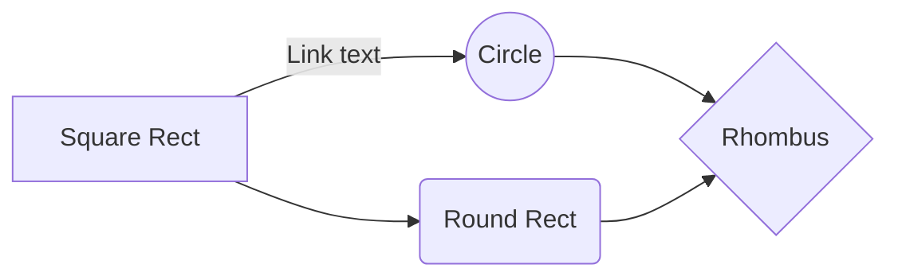
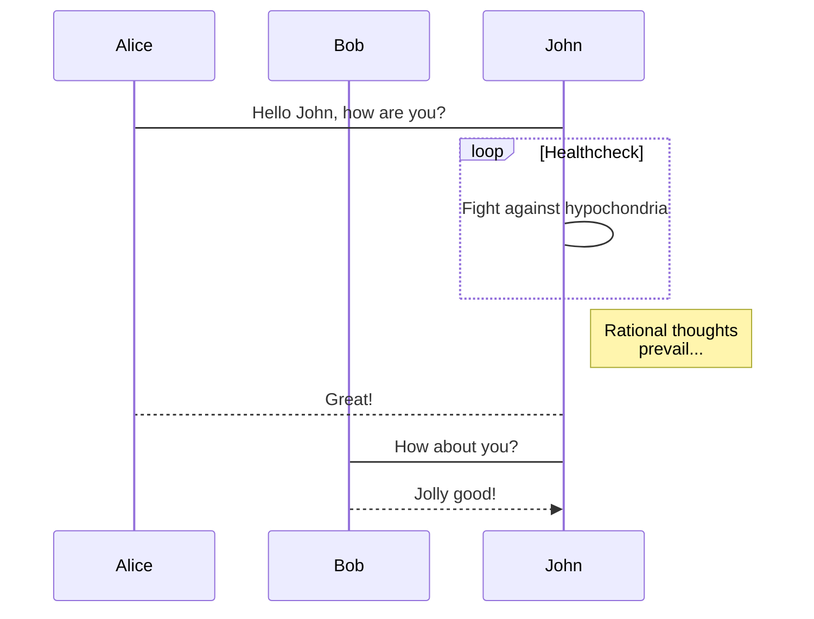

 Welcome to [Hexo](http://hexo.io/)! This is your very first post. Check [documentation](http://hexo.io/docs/) for more info. If you get any problems when using Hexo, you can find the answer in [troubleshooting](http://hexo.io/docs/troubleshooting.html) or you can ask me on [GitHub](https://github.com/hexojs/hexo/issues).

$$
x = \dfrac{-b \pm \sqrt{b^2 - 4ac}}{2a}
$$

Quick Start

## Create a new post

<style>
    img[alt="111"] {
        width: 300px;
        float: right ;
        clear: right ;
    }
</style>

```bash
$ hexo new "My New Post"
```

More info: [Writing](http://hexo.io/docs/writing.html)

- [x] All
- [x] is
- [x] Well
- [x] !

Run server

```bash
$ hexo server
```

More info: [Server](http://hexo.io/docs/server.html)

Generate static files

```bash
$ hexo generate
```

More info: [Generating](http://hexo.io/docs/generating.html)

Deploy to remote sites

```bash
$ hexo deploy
```

More info: [Deployment](http://hexo.io/docs/deployment.html)

```css{3}
.article-entry
  pre, code
    font-family: font-mono
  code
    background: color-background
    text-shadow: 0 1px #fff
    padding: 0 0.3em
  pre
```

`http://veryveryveryveryveryveryveryveryveryveryveryveryveryveryveryveryveryveryveryveryveryveryveryveryveryveryveryveryveryveryveryveryveryveryveryveryveryveryveryveryveryveryveryveryveryveryveryveryveryveryveryveryveryveryveryveryveryveryveryveryveryveryveryveryveryveryveryv`

<i class="fa fa-fort-awesome"></i>

| A | B |
| :-- | :-- |
| 1 | This is a sample.`http://veryveryveryveryveryveryveryveryveryveryveryveryveryveryveryveryveryveryveryveryveryveryveryveryveryveryveryveryveryveryveryveryveryveryveryveryveryveryveryveryveryveryveryveryveryveryveryveryveryveryveryveryveryveryveryveryveryveryveryveryveryveryveryveryveryveryveryv` |
| 2 | This is a sample. |

> dasdads

```c
tcpsumblock = (char *)malloc (packetSize * sizeof (char));
```

```js{1,4}
class Test{
  void Test(){}
}

tcpsumblock = (char *)malloc (packetSize * sizeof (char));ddddddddddddddddddddddddddddddddddddddddddddddddddddddddddddddd
```

## fdf

### fdsaf





This is a beautiful iframe:

<iframe src="http://www.baidu.com/" width="600" height="400"></iframe>

```audio
autoplay: false
loop: false
name: Sound File #1
src: "/sound.mp3"
span: 6
```

```color
name: Smaragd
color: #939d7b
```

```color-palette
T400 - Shabby, #448c6c
T300 - Legendary, #dca114
T200 - Smoke, #6c3b0b
```

```download
color: white
image: true
span: 6
src: "http://acg.bakayun.cn/randbg.php"
subtitle: 8KB
title: Avatar Social
width: 100%
```

```hint|directive
Make it so!
```

```hint
Neutral Hint
```

```hint|warning
nooooooooo, not this way
```

```typography
42|700|Display|42, line height is 1.1x|Bold, 700|Display type is used for visual impact and emphasis
32|400|Page title|32, line height is 1.1x|Normal, 400|Page title is used to provide hiearchy
```

```video
autoplay: false
loop: false
muted: false
name: Animation Video
src: "http://pgccdn.v.baidu.com/1433338647_3201895533_20170601063418.mp4?authorization=bce-auth-v1%2Fc308a72e7b874edd9115e4614e1d62f6%2F2017-05-31T22%3A34%3A23Z%2F-1%2F%2F02736a11697d263da0886271f479d44dc9c2ed5c6d76d230f135f2e915ac1134&responseCacheControl=max-age%3D8640000&responseExpires=Sat%2C+09+Sep+2017+06%3A34%3A23+GMT&xcode=8819c6695b10432f4bdfb8ea24f47350d262a7c4b51fdd36&time=1525536483&_=1525453380361"
span: 6
width: 100%
```
