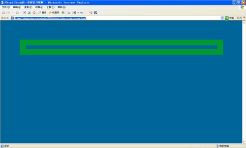
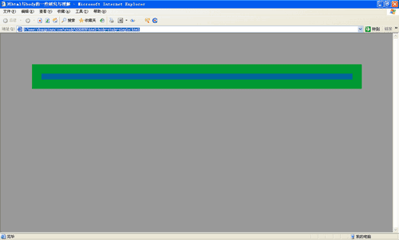
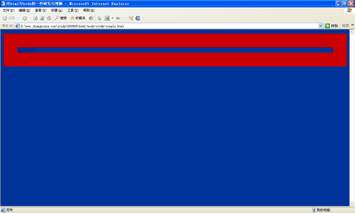

# 背景色

一般情况下，我们css控制的最高节点就是body，例如设置：

```css
body {
  background: #069;
}
```

body作为一个根节点起作用了，`<html>`标签未被激活，body担当类似于根节点的节点，其background背景色被浏览器俘获，浏览器界面背景色为background的背景色

```css
body {
  background: #069; 
  margin: 100px; 
  border: 30px solid #093;
}
```

按照对一般标签的理解，100像素的外边距应该不含有背景色的，然而显示的结果是（Firefox下表现与此类似）：



一旦设置了`<html>`节点的background背景色之后，`<body>`的背景色将失效。例如下面的简短代码：

```css
html {
  background: #999;
}

body {
  background: #069; 
  margin: 100px; 
  border: 30px solid #093;
}
```



此时的`<html>`标签最顶级，背景色被浏览器获取，成为浏览器的背景色。

# margin支持

IE6浏览器下html对margin不敏感不支持，Firefox浏览器下html标签支持margin外边距

# 滚动条

```css
html {
  overflow-y: scroll;
}
```

可以让IE和Firefox（包括chrome）浏览器默认产生滚动条的滚动槽了。

# background的fixed固定定位

Firefox是支持background:fixed定位的，IE6只能说是半支持，就是背景图片固定的效果似乎只在根结点起作用。举个很简单的例子：

```css
body {
  background: url(../image/404.png) no-repeat fixed center center;
}

div {
  height: 2000px;
}
```

```html
<body>
  <div></div>
</body>
```

其结果是无论IE6还是火狐浏览器下，背景图片都是固定的死死的，不错。但是，一旦`<html>`标签带着background属性掺和进来，事情就要发生转变了。问题代码：

```css
html {
  background: white;
}

body {
  background: url(../image/404.png) no-repeat fixed center center;
}

div {
  height: 2000px;
}
```

结果IE6下，背景不固定了，只看到背景图片随着滚动条上下移动而移动，IE11下背景图片随着滚动条上下而抖动。

要解决这个问题呢，也是有办法的，就是将fixed属性值转移到html标签上就可以了。即：

```css
html {
  background: white url(../image/404.png) no-repeat fixed center center;
}

div {
  height: 2000px;
}
```

# height:100%

要想高度百分比起作用，一般来说，要满足两个条件：其一，父标签有高度可寻，就是向上遍历父标签要找到一个定值高度（body，html另外讨论），如果中途有个height为auto或是没有设置height属性，则高度百分比不起作用；其二，标签本身的属性，如果inline属性的标签，如果没有浮动，zoom，或是绝对定位之类属性是不支持百分比高度的，block或inline-block属性可以说是高度百分比起作用的前提条件之一吧。

而这里要讲的是关于body和html的高度百分比显示的。

默认状态下，`<body>`不是高度100%显示的，不要看`<body>`定义background属性好像`<body>`就是满屏显示的，正如上面所推断的，此背景已非`<body>`之背景。用下面这个一测便知。

```css
body {
  background: #039; 
  border: 50px solid #C00;
}
```

看边框范围是否高度100%显示，答案是否定的。见下图（截自IE6，Firefox浏览器下表现一致）：



要想让Firefox浏览器也支持`<body>`的height:100%是简单的，就是设置`<html>`标签height:100%，一旦设置了height:100%则无论哪个浏览器下`<body>`都支持height:100%了，而`<body>`内部的容器也可以支持height:100%了。

透明层无论滚动与否都满屏显示，其实就是对`<html>`和`<body>`标签做一番手脚，两者高度100%显示，同时溢出隐藏（overflow:hidden），然后用一个`<div>`高度100%显示，溢出滚动。而这个透明层就使用绝对定位且与这个`<div>`平级，高宽100%显示，就可以使得无论怎么滚动这个透明覆盖层都是满屏显示的。这其实也就解决IE6下浮动层固定定位的经典方法。

# body overflow

单纯如下body overflow是无法隐藏高度不足一屏的元素的，例如：

```css
body {
  height: 30px;
  overflow: hidden;
}
body > div {
  height: 300px;
  background-color: #cd0000;
}
```

此时body的子元素div依然保持300px高度的显示，如果想要隐藏，需要设置html的overflow:hidden。

并不是说body overflow无效，而是body天然的overflow计算容器是一屏高度，因此，如果div高度很高，例如3000px：

```css
body > div {
  height: 3000px;
  background-color: #cd0000;
}
```

大家可以看到body的子元素div也就显示了屏幕的高度。
