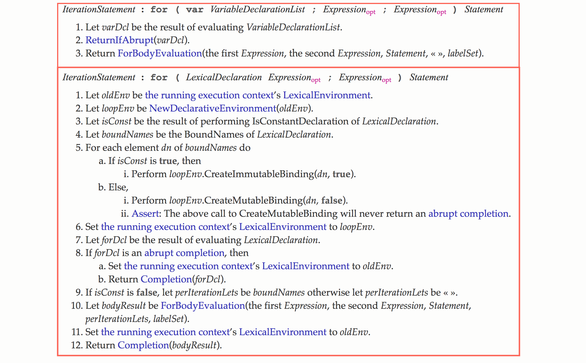
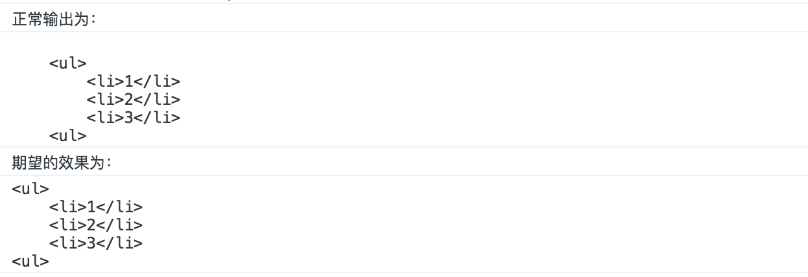
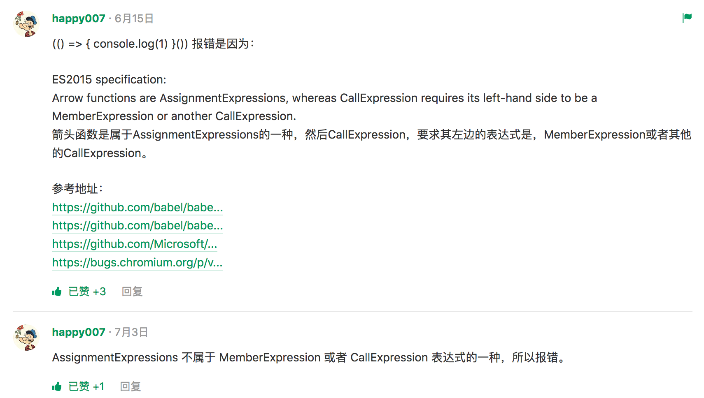

# let 和 const

## 块级作用域的出现

通过 var 声明的变量存在变量提升的特性：

```js
if (condition) {
    var value = 1;
}
console.log(value);
```

初学者可能会觉得只有 condition 为 true 的时候，才会创建 value，如果 condition 为 false，结果应该是报错，然而因为变量提升的原因，代码相当于：

```js
var value;
if (condition) {
    value = 1;
}
console.log(value);
```

如果 condition 为 false，结果会是 undefined。

除此之外，在 for 循环中：

```js
for (var i = 0; i < 10; i++) {
    ...
}
console.log(i); // 10
```

即便循环已经结束了，我们依然可以访问 i 的值。

为了加强对变量生命周期的控制，ECMAScript 6 引入了块级作用域。

块级作用域存在于：

- 函数内部
- 块中(字符 { 和 } 之间的区域)

## let 和 const

块级声明用于声明在指定块的作用域之外无法访问的变量。

let 和 const 都是块级声明的一种。

我们来回顾下 let 和 const 的特点：

### 不会被提升

```js
if (false) {
    let value = 1;
}
console.log(value); // Uncaught ReferenceError: value is not defined
```

### 重复声明报错

```js
var value = 1;
let value = 2; // Uncaught SyntaxError: Identifier 'value' has already been declared
```

### 不绑定全局作用域

当在全局作用域中使用 var 声明的时候，会创建一个新的全局变量作为全局对象的属性。

```js
var value = 1;
console.log(window.value); // 1
```

然而 let 和 const 不会：

```js
let value = 1;
console.log(window.value); // undefined
```

再来说下 let 和 const 的区别：

const 用于声明常量，其值一旦被设定不能再被修改，否则会报错。

值得一提的是：const 声明不允许修改绑定（赋值），但允许修改值。这意味着当用 const 声明对象时：

```js
const data = {
    value: 1
}

// 没有问题
data.value = 2;
data.num = 3;

// 报错
data = {}; // Uncaught TypeError: Assignment to constant variable.
```

## 临时死区

临时死区(Temporal Dead Zone)，简写为 TDZ。

let 和 const 声明的变量不会被提升到作用域顶部，如果在声明之前访问这些变量，会导致报错：

```js
console.log(typeof value); // Uncaught ReferenceError: value is not defined
let value = 1;
```

这是因为 JavaScript 引擎在扫描代码发现变量声明时，要么将它们提升到作用域顶部(遇到 var 声明)，要么将声明放在 TDZ 中(遇到 let 和 const 声明)。访问 TDZ 中的变量会触发运行时错误。只有执行过变量声明语句后，变量才会从 TDZ 中移出，然后方可访问。

看似很好理解，不保证你不犯错：

```js
var value = "global";

// 例子1
(function() {
    console.log(value);

    let value = 'local';
}());

// 例子2
{
    console.log(value);

    const value = 'local';
};
```

两个例子中，结果并不会打印 "global"，而是报错 Uncaught ReferenceError: value is not defined，就是因为 TDZ 的缘故。

## 循环中的块级作用域

```js
var funcs = [];
for (var i = 0; i < 3; i++) {
    funcs[i] = function () {
        console.log(i);
    };
}
funcs[0](); // 3
```

一个老生常谈的面试题，解决方案如下：

```js
var funcs = [];
for (var i = 0; i < 3; i++) {
    funcs[i] = (function(i){
        return function() {
            console.log(i);
        }
    }(i))
}
funcs[0](); // 0
```

ES6 的 let 为这个问题提供了新的解决方法：

```js
var funcs = [];
for (let i = 0; i < 3; i++) {
    funcs[i] = function () {
        console.log(i);
    };
}
funcs[0](); // 0
```

问题在于，上面讲了 let 不提升，不能重复声明，不能绑定全局作用域等等特性，可是为什么在这里就能正确打印出 i 值呢？

如果是不重复声明，在循环第二次的时候，又用 let 声明了 i，应该报错呀，就算因为某种原因，重复声明不报错，一遍一遍迭代，i 的值最终还是应该是 3 呀，还有人说 for 循环的设置循环变量的那部分是一个单独的作用域，就比如：

```js
for (let i = 0; i < 3; i++) {
  // 此处的 let 建立一个隐藏的作用域
  let i = 'abc';
  console.log(i);
}
// abc
// abc
// abc
```

这个例子是对的，如果我们把 let 改成 var 呢？

```js
for (var i = 0; i < 3; i++) {
  // 这里并没有建立隐藏域
  var i = 'abc';
  console.log(i);
}
// abc
```

为什么结果就不一样了呢，如果有单独的作用域，结果应该是相同的呀……

如果要追究这个问题，就要抛弃掉之前所讲的这些特性！这是因为 let 声明在循环内部的行为是标准中专门定义的，不一定就与 let 的不提升特性有关，其实在早期的 let 实现中就不包含这一行为。

我们查看 ECMAScript 规范第 13.7.4.7 节:



我们会发现，在 for 循环中使用 let 和 var，底层会使用不同的处理方式。

那么当使用 let 的时候底层到底是怎么做的呢？

简单的来说，就是在 for (let i = 0; i < 3; i++) 中，即圆括号之内建立一个隐藏的作用域，这就可以解释为什么：

```js
for (let i = 0; i < 3; i++) {
  let i = 'abc';
  console.log(i);
}
// abc
// abc
// abc
```

然后每次迭代循环时都创建一个新变量，并以之前迭代中同名变量的值将其初始化。这样对于下面这样一段代码

```js
var funcs = [];
for (let i = 0; i < 3; i++) {
    funcs[i] = function () {
        console.log(i);
    };
}
funcs[0](); // 0
```

就相当于：

```js
// 伪代码
(let i = 0) {
    funcs[0] = function() {
        console.log(i)
    };
}

(let i = 1) {
    funcs[1] = function() {
        console.log(i)
    };
}

(let i = 2) {
    funcs[2] = function() {
        console.log(i)
    };
};
```

当执行函数的时候，根据词法作用域就可以找到正确的值，其实你也可以理解为 let 声明模仿了闭包的做法来简化循环过程。

## 循环中的 let 和 const

不过到这里还没有结束，如果我们把 let 改成 const 呢？

```js
var funcs = [];
for (const i = 0; i < 10; i++) {
    funcs[i] = function () {
        console.log(i);
    };
}
funcs[0](); // Uncaught TypeError: Assignment to constant variable.
```

结果会是报错，因为虽然我们每次都创建了一个新的变量，然而我们却在迭代中尝试修改 const 的值，所以最终会报错。

说完了普通的 for 循环，我们还有 for in 循环呢~

那下面的结果是什么呢？

```js
var funcs = [], object = {a: 1, b: 1, c: 1};
for (var key in object) {
    funcs.push(function(){
        console.log(key)
    });
}

funcs[0]()
```

结果是 'c';

那如果把 var 改成 let 或者 const 呢？

使用 let，结果自然会是 'a'，const 呢？ 报错还是 'a'?

结果是正确打印 'a'，这是因为在 for in 循环中，每次迭代不会修改已有的绑定，而是会创建一个新的绑定。

## Babel

在 Babel 中是如何编译 let 和 const 的呢？我们来看看编译后的代码：

```js
let value = 1;
```

编译为:

```js
var value = 1;
```

我们可以看到 Babel 直接将 let 编译成了 var，如果是这样的话，那么我们来写个例子：

```js
if (false) {
    let value = 1;
}
console.log(value); // Uncaught ReferenceError: value is not defined
```

如果还是直接编译成 var，打印的结果肯定是 undefined，然而 Babel 很聪明，它编译成了：

```js
if (false) {
    var _value = 1;
}
console.log(value);
```

我们再写个直观的例子：

```js
let value = 1;
{
    let value = 2;
}
value = 3;
```

```js
var value = 1;
{
    var _value = 2;
}
value = 3;
```

本质是一样的，就是改变量名，使内外层的变量名称不一样。

那像 const 的修改值时报错，以及重复声明报错怎么实现的呢？

其实就是在编译的时候直接给你报错……

那循环中的 let 声明呢？

```js
var funcs = [];
for (let i = 0; i < 10; i++) {
    funcs[i] = function () {
        console.log(i);
    };
}
funcs[0](); // 0
```

Babel 巧妙的编译成了：

```js
var funcs = [];

var _loop = function _loop(i) {
    funcs[i] = function () {
        console.log(i);
    };
};

for (var i = 0; i < 10; i++) {
    _loop(i);
}
funcs[0](); // 0
```

## 最佳实践

在我们开发的时候，可能认为应该默认使用 let 而不是 var ，这种情况下，对于需要写保护的变量要使用 const。然而另一种做法日益普及：默认使用 const，只有当确实需要改变变量的值的时候才使用 let。这是因为大部分的变量的值在初始化后不应再改变，而预料之外的变量改变是很多 bug 的源头。

# 模板字符串

```js
let message = `Hello World`;
console.log(message);
```

如果你碰巧要在字符串中使用反撇号，你可以使用反斜杠转义：

```js
let message = `Hello \` World`;
console.log(message);
```

值得一提的是，在模板字符串中，空格、缩进、换行都会被保留：

```js
let message = `
  <ul>
    <li>1</li>
    <li>2</li>
  </ul>
`;
console.log(message);
```


注意，打印的结果中第一行是一个换行，你可以使用 trim 函数消除换行：

## 嵌入变量

模板字符串支持嵌入变量，只需要将变量名写在 ${} 之中，其实不止变量，任意的 JavaScript 表达式都是可以的：

```js
let x = 1, y = 2;
let message = `<ul><li>${x}</li><li>${x + y}</li></ul>`;
console.log(message); // <ul><li>1</li><li>3</li></ul>
```

值得一提的是，模板字符串支持嵌套:

```js
let arr = [{value: 1}, {value: 2}];
let message = `
  <ul>
    ${arr.map((item) => {
      return `
        <li>${item.value}</li>
      `
    }).join('')}
  </ul>
`;
console.log(message);
```

## 模板标签

模板标签是一个非常重要的能力，模板字符串可以紧跟在一个函数名后面，该函数将被调用来处理这个模板字符串，举个例子：

```js
let x = 'Hi', y = 'Kevin';
var res = message`${x}, I am ${y}`;
console.log(res);
```

我们可以自定义 message 函数来处理返回的字符串:

```js
// literals 文字
// 注意在这个例子中 literals 的第一个元素和最后一个元素都是空字符串
function message(literals, value1, value2) {
  console.log(literals); // [ "", ", I am ", "" ]
  console.log(value1); // Hi
  console.log(value2); // Kevin
}
```

我们利用这些参数将其拼合回去：

```js
function message(literals, ...values) {
  let result = '';

  for (let i = 0; i < values.length; i++) {
    result += literals[i];
    result += values[i];
  }

  result += literals[literals.length - 1];

  return result;
}
```

你也可以这样写：

```js
function message(literals, ...values) {
  let result = literals.reduce((prev, next, i) => {
      let value = values[i - 1];
      return prev + value + next;
  });

  return result;
}
```

学着拼合回去是一件非常重要的事情，因为我们经过各种处理，最终都还是要拼回去的……

## oneLine

讲完了基础，我们可以来看一些实际的需求：

```js
let message = `
  Hi,
  Daisy!
  I am
  Kevin.
`;
```

出于可读性或者其他原因，我希望书写的时候是换行的，但是最终输出的字符是在一行，这就需要借助模板标签来实现了，我们尝试写一个这样的函数：

```js
// oneLine 第一版
function oneLine(template, ...expressions) {
    let result = template.reduce((prev, next, i) => {
        let expression = expressions[i - 1];
        return prev + expression + next;
    });

    result = result.replace(/(\s+)/g, " ");
    result = result.trim();

    return result;
}
```

实现原理很简单，拼合回去然后将多个空白符如换行符、空格等替换成一个空格。

使用如下：

```js
let message = oneLine `
    Hi,
    Daisy!
    I am
    Kevin.
`;
console.log(message); // Hi, Daisy! I am Kevin.
```

不过你再用下去就会发现一个问题，如果字符间就包括多个空格呢？举个例子：

```js
let message = oneLine`
  Preserve eg sentences.  Double
  spaces within input lines.
`;
```

如果使用这种匹配方式，sentences. 与 Double 之间的两个空格也会被替换成一个空格。

我们可以再优化一下，我们想要的效果是将每行前面的多个空格替换成一个空格，其实应该匹配的是换行符以及换行符后面的多个空格，然后将其替换成一个空格，我们可以将正则改成：

```js
result = result.replace(/(\n\s*)/g, " ");
```

就可以正确的匹配代码，最终的代码如下：

```js
// oneLine 第二版
function oneLine(template, ...expressions) {
    let result = template.reduce((prev, next, i) => {
        let expression = expressions[i - 1];
        return prev + expression + next;
    });

    result = result.replace(/(\n\s*)/g, " ");
    result = result.trim();

    return result;
}
```

## stripIndents

假设有这样一段 HTML：

```js
let html = `
  <span>1<span>
  <span>2<span>
    <span>3<span>
`;
```

为了保持可读性，我希望最终输入的样式为：

```html
<span>1<span>
<span>2<span>
<span>3<span>
```

其实就是匹配每行前面的空格，然后将其替换为空字符串。

```js
// stripIndents 第一版
function stripIndents(template, ...expressions) {
    let result = template.reduce((prev, next, i) => {
        let expression = expressions[i - 1];
        return prev + expression + next;
    });


    result = result.replace(/\n[^\S\n]*/g, '\n');
    result = result.trim();

    return result;
}
```

最难的或许就是这个正则表达式了：

```js
result = result.replace(/\n[^\S\n]*/g, '\n');
```

\S 表示匹配一个非空白字符

[^\S\n] 表示匹配非空白字符和换行符之外的字符，其实也就是空白字符去除换行符

\n[^\S\n]* 表示匹配换行符以及换行符后的多个不包含换行符的空白字符

replace(/\n[^\S\n]*/g, '\n') 表示将一个换行符以及换行符后的多个不包含换行符的空白字符替换成一个换行符，其实也就是将换行符后面的空白字符消掉的意思

其实吧，不用写的这么麻烦，我们还可以这样写：

```js
result = result.replace(/^[^\S\n]+/gm, '');
```

看似简单了一点，之所以能这样写，是因为匹配模式的缘故，你会发现，这次除了匹配全局之外，这次我们还匹配了多行，m 标志用于指定多行输入字符串时应该被视为多个行，而且如果使用 m 标志，^ 和 $ 匹配的开始或结束是输入字符串中的每一行，而不是整个字符串的开始或结束。

[^\S\n] 表示匹配空白字符去除换行符

^[^\S\n]+ 表示匹配以去除换行符的空白字符为开头的一个或者多个字符

result.replace(/^[^\S\n]+/gm, '') 表示将每行开头一个或多个去除换行符的空白字符替换成空字符串，也同样达到了目的。

最终的代码如下：

```js
// stripIndents 第二版
function stripIndents(template, ...expressions) {
    let result = template.reduce((prev, next, i) => {
        let expression = expressions[i - 1];
        return prev + expression + next;
    });


    result = result.replace(/^[^\S\n]+/gm, '');
    result = result.trim();

    return result;
}
```

## stripIndent

注意，这次的 stripIndent 相比上面一节的标题少了一个字母 s，而我们想要实现的功能是：

```js
let html = `
  <ul>
    <li>1</li>
    <li>2</li>
    <li>3</li>
  <ul>
`;
```



其实也就是去除第一行的换行以及每一行的部分缩进。

这个实现就稍微麻烦了一点，因为我们要计算出每一行到底要去除多少个空白字符。

实现的思路如下：

1. 使用 match 函数，匹配每一行的空白字符，得到一个包含每一行空白字符的数组
2. 数组遍历比较，得到最小的空白字符长度
3. 构建一个正则表达式，然后每一行都替换掉最小长度的空白字符

实现的代码如下：

```js
let html = `
  <ul>
    <li>1</li>
    <li>2</li>
    <li>3</li>
  <ul>
`;

function stripIndent(template, ...expressions) {
    let result = template.reduce((prev, next, i) => {
        let expression = expressions[i - 1];
        return prev + expression + next;
    });

    const match = result.match(/^[^\S\n]*(?=\S)/gm);
    console.log(match); // Array [ "    ", "        ", "        ", "        ", "    " ]

    const indent = match && Math.min(...match.map(el => el.length));
    console.log(indent); // 4

    if (indent) {
        const regexp = new RegExp(`^.{${indent}}`, 'gm');
        console.log(regexp); // /^.{4}/gm

        result =  result.replace(regexp, '');
    }

    result = result.trim();

    return result;
}
```

值得一提的是，我们一般会以为正则中 . 表示匹配任意字符，其实是匹配除换行符之外的任何单个字符。

最终精简的代码如下：

```js
function stripIndent(template, ...expressions) {
    let result = template.reduce((prev, next, i) => {
        let expression = expressions[i - 1];
        return prev + expression + next;
    });

    const match = result.match(/^[^\S\n]*(?=\S)/gm);
    const indent = match && Math.min(...match.map(el => el.length));

    if (indent) {
        const regexp = new RegExp(`^.{${indent}}`, 'gm');
        result =  result.replace(regexp, '');
    }

    result = result.trim();

    return result;
}
```

## includeArrays

前面我们讲到为了避免 ${} 表达式中返回一个数组，自动转换会导致多个逗号的问题，需要每次都将数组最后再 join('') 一下，再看一遍例子：

```js
let arr = [{value: 1}, {value: 2}];
let message = `
  <ul>
    ${arr.map((item) => {
      return `
        <li>${item.value}</li>
      `
    }).join('')}
  </ul>
`;
console.log(message);
```

利用标签模板，我们可以轻松的解决这个问题：

```js
function includeArrays(template, ...expressions) {
    let result = template.reduce((prev, next, i) => {

        let expression = expressions[i - 1];

        if (Array.isArray(expression)) {
            expression = expression.join('');
        }

        return prev + expression + next;
    });

    result = result.trim();

    return result;
}
```

## 最后

你会发现以上这些函数拼合的部分都是重复的，我们完全可以将其封装在一起，根据不同的配置实现不能的功能。如果你想在项目中使用这些函数，可以自己封装一个或者直接使用 common-tags。

# 箭头函数

我们先来回顾下箭头函数的基本语法。

ES6 增加了箭头函数：

```js
let func = value => value;
```

相当于：

```js
let func = function (value) {
    return value;
};
```

如果需要给函数传入多个参数：

```js
let func = (value, num) => value * num;
```

如果函数的代码块需要多条语句：

```js
let func = (value, num) => {
    return value * num
};
```

如果需要直接返回一个对象：

```js
let func = (value, num) => ({total: value * num});
```

与变量解构结合：

```js
let func = ({value, num}) => ({total: value * num})

// 使用
var result = func({
    value: 10,
    num: 10
})

console.log(result); // {total: 100}
```

很多时候，你可能想不到要这样用，所以再来举个例子，比如在 React 与 Immutable 的技术选型中，我们处理一个事件会这样做：

```js
handleEvent = () => {
  this.setState({
    data: this.state.data.set("key", "value")
  })
};
```

其实就可以简化为：

```js
handleEvent = () => {
  this.setState(({data}) => ({
    data: data.set("key", "value")
  }))
};
```

## 比较

本篇我们重点比较一下箭头函数与普通函数。

主要区别包括：

### 没有 this

箭头函数没有 this，所以需要通过查找作用域链来确定 this 的值。

这就意味着如果箭头函数被非箭头函数包含，this 绑定的就是最近一层非箭头函数的 this。

模拟一个实际开发中的例子：

我们的需求是点击一个按钮，改变该按钮的背景色。

为了方便开发，我们抽离一个 Button 组件，当需要使用的时候，直接：

```js
// 传入元素 id 值即可绑定该元素点击时改变背景色的事件
new Button("button")
```

HTML 代码如下：

```html
<button id="button">点击变色</button>
```

JavaScript 代码如下：

```js
function Button(id) {
    this.element = document.querySelector("#" + id);
    this.bindEvent();
}

Button.prototype.bindEvent = function() {
    this.element.addEventListener("click", this.setBgColor, false);
};

Button.prototype.setBgColor = function() {
    this.element.style.backgroundColor = '#1abc9c'
};

var button = new Button("button");
```

看着好像没有问题，结果却是报错 Uncaught TypeError: Cannot read property 'style' of undefined

这是因为当使用 addEventListener() 为一个元素注册事件的时候，事件函数里的 this 值是该元素的引用。

所以如果我们在 setBgColor 中 console.log(this)，this 指向的是按钮元素，那 this.element 就是 undefined，报错自然就理所当然了。

也许你会问，既然 this 都指向了按钮元素，那我们直接修改 setBgColor 函数为：

```js
Button.prototype.setBgColor = function() {
    this.style.backgroundColor = '#1abc9c'
};
```

不就可以解决这个问题了？

确实可以这样做，但是在实际的开发中，我们可能会在 setBgColor 中还调用其他的函数，比如写成这种：

```js
Button.prototype.setBgColor = function() {
    this.setElementColor();
    this.setOtherElementColor();
};
```

所以我们还是希望 setBgColor 中的 this 是指向实例对象的，这样就可以调用其他的函数。

利用 ES5，我们一般会这样做：

```js
Button.prototype.bindEvent = function() {
    this.element.addEventListener("click", this.setBgColor.bind(this), false);
};
```

为避免 addEventListener 的影响，使用 bind 强制绑定 setBgColor() 的 this 为实例对象

使用 ES6，我们可以更好的解决这个问题：

```js
Button.prototype.bindEvent = function() {
    this.element.addEventListener("click", event => this.setBgColor(event), false);
};
```

由于箭头函数没有 this，所以会向外层查找 this 的值，即 bindEvent 中的 this，此时 this 指向实例对象，所以可以正确的调用 this.setBgColor 方法，而 this.setBgColor 中的 this 也会正确指向实例对象。

在这里再额外提一点，就是注意 bindEvent 和 setBgColor 在这里使用的是普通函数的形式，而非箭头函数，如果我们改成箭头函数，会导致函数里的 this 指向 window 对象 (非严格模式下)。

最后，因为箭头函数没有 this，所以也不能用 call()、apply()、bind() 这些方法改变 this 的指向，可以看一个例子：

```js
var value = 1;
var result = (() => this.value).bind({value: 2})();
console.log(result); // 1
```

### 没有 arguments

箭头函数没有自己的 arguments 对象，这不一定是件坏事，因为箭头函数可以访问外围函数的 arguments 对象：

```js
function constant() {
    return () => arguments[0]
}

var result = constant(1);
console.log(result()); // 1
```

那如果我们就是要访问箭头函数的参数呢？

你可以通过命名参数或者 rest 参数的形式访问参数:

```js
let nums = (...nums) => nums;
```

### 不能通过 new 关键字调用

JavaScript 函数有两个内部方法：[[Call]] 和 [[Construct]]。

当通过 new 调用函数时，执行 [[Construct]] 方法，创建一个实例对象，然后再执行函数体，将 this 绑定到实例上。

当直接调用的时候，执行 [[Call]] 方法，直接执行函数体。

箭头函数并没有 [[Construct]] 方法，不能被用作构造函数，如果通过 new 的方式调用，会报错。

```js
var Foo = () => {};
var foo = new Foo(); // TypeError: Foo is not a constructor
```

### 没有 new.target

因为不能使用 new 调用，所以也没有 new.target 值。

关于 new.target，可以参考 http://es6.ruanyifeng.com/#docs/class#new-target-%E5%B1%9E%E6%80%A7

### 没有原型

由于不能使用 new 调用箭头函数，所以也没有构建原型的需求，于是箭头函数也不存在 prototype 这个属性。

```js
var Foo = () => {};
console.log(Foo.prototype); // undefined
```

### 没有 super

连原型都没有，自然也不能通过 super 来访问原型的属性，所以箭头函数也是没有 super 的，不过跟 this、arguments、new.target 一样，这些值由外围最近一层非箭头函数决定。

## 总结

最后，关于箭头函数，引用 MDN 的介绍就是：

箭头函数表达式的语法比函数表达式更短，并且不绑定自己的this，arguments，super或 new.target。这些函数表达式最适合用于非方法函数(non-method functions)，并且它们不能用作构造函数。

那么什么是 non-method functions 呢？

我们先来看看 method 的定义：

对象属性中的函数就被称之为 method，那么 non-mehtod 就是指不被用作对象属性中的函数了，可是为什么说箭头函数更适合 non-method 呢？

让我们来看一个例子就明白了：

```js
var obj = {
  i: 10,
  b: () => console.log(this.i, this),
  c: function() {
    console.log( this.i, this)
  }
}
obj.b();
// undefined Window
obj.c();
// 10, Object {...}
```

## 自执行函数

自执行函数的形式为：

```js
(function(){
    console.log(1)
})()
```

或者

```js
(function(){
    console.log(1)
}())
```

利用箭头简化自执行函数的写法：

```js
(() => {
    console.log(1)
})()
```

但是注意：使用以下这种写法却会报错：

```js
(() => {
    console.log(1)
}())
```


