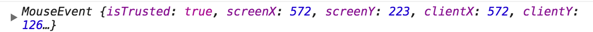
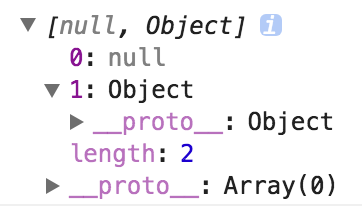

# 防抖

## 前言

在前端开发中会遇到一些频繁的事件触发，比如：

1. window 的 resize、scroll
2. mousedown、mousemove
3. keyup、keydown

为此，我们举个示例代码来了解事件如何频繁的触发：

我们写个 index.html 文件：

```html
<!DOCTYPE html>
<html lang="zh-cmn-Hans">
  <head>
    <meta charset="utf-8">
    <meta http-equiv="x-ua-compatible" content="IE=edge, chrome=1">
    <title>debounce</title>
    <style>
        #container {
            width: 100%;
            height: 200px;
            line-height: 200px;
            text-align: center;
            color: #fff;
            background-color: #444;
            font-size: 30px;
        }
    </style>
  </head>
  <body>
      <div id="container"></div>
      <script src="debounce.js"></script>
  </body>
</html>
```

debounce.js 文件的代码如下：

```js
var count = 1;
var container = document.getElementById('container');

function getUserAction() {
    container.innerHTML = count++;
};

container.onmousemove = getUserAction;
```

我们来看看效果：


从左边滑到右边就触发了 165 次 getUserAction 函数！

因为这个例子很简单，所以浏览器完全反应的过来，可是如果是复杂的回调函数或是 ajax 请求呢？假设 1 秒触发了 60 次，每个回调就必须在 1000 / 60 = 16.67ms 内完成，否则就会有卡顿出现。

为了解决这个问题，一般有两种解决方案：

1. debounce 防抖
2. throttle 节流

## 防抖

今天重点讲讲防抖的实现。

防抖的原理就是：你尽管触发事件，但是我一定在事件触发 n 秒后才执行，如果你在一个事件触发的 n 秒内又触发了这个事件，那我就以新的事件的时间为准，n 秒后才执行，总之，就是要等你触发完事件 n 秒内不再触发事件，我才执行

## 第一版

根据这段表述，我们可以写第一版的代码：

```js
// 第一版
function debounce(func, wait) {
    var timeout;
    return function () {
        clearTimeout(timeout)
        timeout = setTimeout(func, wait);
    }
}
```

如果我们要使用它，以最一开始的例子为例：

```js
container.onmousemove = debounce(getUserAction, 1000);
```

现在随你怎么移动，反正你移动完 1000ms 内不再触发，我才执行事件。看看使用效果：


顿时就从 165 次降成了 1 次!

## this

如果我们在 getUserAction 函数中 console.log(this)，在不使用 debounce 函数的时候，this 的值为：

```js
<div id="container"></div>
```

但是如果使用我们的 debounce 函数，this 就会指向 Window 对象！

所以我们需要将 this 指向正确的对象。

我们修改下代码：

```js
// 第二版
function debounce(func, wait) {
    var timeout;

    return function () {
        var context = this;

        clearTimeout(timeout)
        timeout = setTimeout(function(){
            func.apply(context)
        }, wait);
    }
}
```

## event 对象

JavaScript 在事件处理函数中会提供事件对象 event，我们修改下 getUserAction 函数：

```js
function getUserAction(e) {
    console.log(e);
    container.innerHTML = count++;
};
```

如果我们不使用 debouce 函数，这里会打印 MouseEvent 对象，如图所示：



但是在我们实现的 debounce 函数中，却只会打印 undefined!

所以我们再修改一下代码：

```js
// 第二版
function debounce(func, wait) {
    var timeout;

    return function () {
        var context = this;
        var args = arguments;

        clearTimeout(timeout)
        timeout = setTimeout(function(){
            func.apply(context, args)
        }, wait);
    }
}
```

到此为止，我们修复了两个小问题：

1. this 指向
2. event 对象

## 立刻执行

这个时候，代码已经很是完善了，但是为了让这个函数更加完善，我们接下来思考一个新的需求。

这个需求就是：

我不希望非要等到事件停止触发后才执行，我希望立刻执行函数，然后等到停止触发 n 秒后，才可以重新触发执行。

想想这个需求也是很有道理的嘛，那我们加个 immediate 参数判断是否是立刻执行。

```js
// 第四版，immediate 代表停止触发 n 秒后立即执行
function debounce(func, wait, immediate) {

    var timeout;

    return function () {
        var context = this;
        var args = arguments;

        if (timeout) clearTimeout(timeout);
        if (immediate) {
            // 如果已经执行过，不再执行
            var callNow = !timeout;
            // 拿 click 事件为例，如果传递的 immediate 为 true, 那么连续点击过程中仅在第一次点击时执行，后面的点击会被 if (timeout) clearTimeout(timeout); 拦截，点击再多次都不会再次执行；当停止点击 wait 毫秒后，设置 timeout = null; 恢复初始时的状态，这次的第一次点击就不会被 if (timeout) clearTimeout(timeout); 拦截。所以这句必须要加，是比较关键的代码。
            timeout = setTimeout(function(){
                timeout = null;
            }, wait)
            if (callNow) func.apply(context, args)
        }
        else {
            timeout = setTimeout(function(){
                func.apply(context, args)
            }, wait);
        }
    }
}
```

再来看看使用效果：


## 返回值

此时注意一点，就是 getUserAction 函数可能是有返回值的，所以我们也要返回函数的执行结果，但是当 immediate 为 false 的时候，因为使用了 setTimeout ，我们将 func.apply(context, args) 的返回值赋给变量，最后再 return 的时候，值将会一直是 undefined，所以我们只在 immediate 为 true 的时候返回函数的执行结果。

```js
// 第五版
function debounce(func, wait, immediate) {

    var timeout, result;

    return function () {
        var context = this;
        var args = arguments;

        if (timeout) clearTimeout(timeout);
        if (immediate) {
            // 如果已经执行过，不再执行
            var callNow = !timeout;
            timeout = setTimeout(function(){
                timeout = null;
            }, wait)
            if (callNow) result = func.apply(context, args)
        }
        else {
            timeout = setTimeout(function(){
                func.apply(context, args)
            }, wait);
        }
        return result;
    }
}
```

## 取消

最后我们再思考一个小需求，我希望能取消 debounce 函数，比如说我 debounce 的时间间隔是 10 秒钟，immediate 为 true，这样的话，我只有等 10 秒后才能重新触发事件，现在我希望有一个按钮，点击后，取消防抖，这样我再去触发，就可以又立刻执行啦，是不是很开心？

为了这个需求，我们写最后一版的代码：

```js
// 第六版
function debounce(func, wait, immediate) {

    var timeout, result;

    var debounced = function () {
        var context = this;
        var args = arguments;

        if (timeout) {
          clearTimeout(timeout);
        }
        if (immediate) {
            // 如果已经执行过，不再执行
            var callNow = !timeout;
            timeout = setTimeout(function(){
                timeout = null;
            }, wait)
            if (callNow) result = func.apply(context, args)
        } else {
            timeout = setTimeout(function(){
                func.apply(context, args)
            }, wait);
        }
        return result;
    };

    debounced.cancel = function() {
        clearTimeout(timeout);
        timeout = null;
    };

    return debounced;
}
```

那么该如何使用这个 cancel 函数呢？依然是以上面的 demo 为例：

```js
var count = 1;
var container = document.getElementById('container');

function getUserAction(e) {
    container.innerHTML = count++;
};

var setUseAction = debounce(getUserAction, 10000, true);

container.onmousemove = setUseAction;

document.getElementById("button").addEventListener('click', function(){
    setUseAction.cancel();
})
```

演示效果如下：


至此我们已经完整实现了一个 underscore 中的 debounce 函数，恭喜，撒花！

# 节流

节流的原理很简单：

如果你持续触发事件，每隔一段时间，只执行一次事件。

根据首次是否执行以及结束后是否执行，效果有所不同，实现的方式也有所不同。
我们用 leading 代表首次是否执行，trailing 代表结束后是否再执行一次。

关于节流的实现，有两种主流的实现方式，一种是使用时间戳，一种是设置定时器。

## 使用时间戳

让我们来看第一种方法：使用时间戳，当触发事件的时候，我们取出当前的时间戳，然后减去之前的时间戳(最一开始值设为 0 )，如果大于设置的时间周期，就执行函数，然后更新时间戳为当前的时间戳，如果小于，就不执行。

看了这个表述，是不是感觉已经可以写出代码了…… 让我们来写第一版的代码：

```js
// 第一版
function throttle(func, wait) {
    var previous = 0; 

    return function() {
        var now = +new Date();
        var context = this;
        var args = arguments;
        if (now - previous > wait) {
            func.apply(context, args);
            previous = now;
        }
    }
}
```

例子依然是用讲 debounce 中的例子，如果你要使用：

```js
container.onmousemove = throttle(getUserAction, 1000);
```

效果演示如下：


我们可以看到：当鼠标移入的时候，事件立刻执行，每过 1s 会执行一次，如果在 4.2s 停止触发，以后不会再执行事件。

## 使用定时器

接下来，我们讲讲第二种实现方式，使用定时器。

当触发事件的时候，我们设置一个定时器，再触发事件的时候，如果定时器存在，就不执行，直到定时器执行，然后执行函数，清空定时器，这样就可以设置下个定时器。

```js
// 第一版
function throttle(func, wait) {
    var timer; 

    return function() {
        var context = this;
        var args = arguments;
        if (!timer) {
          timer = setTimeout(function() {
            func.apply(context, args);
            timer = null;
          }, wait);
        }
    }
}
```

为了让效果更加明显，我们设置 wait 的时间为 3s，效果演示如下：


我们可以看到：当鼠标移入的时候，事件不会立刻执行，晃了 3s 后终于执行了一次，此后每 3s 执行一次，当数字显示为 3 的时候，立刻移出鼠标，相当于大约 9.2s 的时候停止触发，但是依然会在第 12s 的时候执行一次事件。

所以比较两个方法：

1. 第一种事件会立刻执行，第二种事件会在 n 秒后第一次执行
2. 第一种事件停止触发后没有办法再执行事件，第二种事件停止触发后依然会再执行一次事件

## 双剑合璧

那我们想要一个什么样的呢？

有人就说了：我想要一个有头有尾的！就是鼠标移入能立刻执行，停止触发的时候还能再执行一次！

所以我们综合两者的优势，然后双剑合璧，写一版代码：

```js
// 第三版
function throttle(func, wait) {
    var timeout, context, args;
    var previous = 0;

    var later = function() {
        previous = +new Date();
        timeout = null;
        func.apply(context, args);
    };

    var throttled = function() {
        var now = +new Date();
        // 下次触发 func 剩余的时间
        var remaining = wait - (now - previous);
        context = this;
        args = arguments;
         // 如果没有剩余的时间了或者你改了系统时间
        if (remaining <= 0 || remaining > wait) {
            if (timeout) {
                clearTimeout(timeout);
                timeout = null;
            }
            previous = now;
            func.apply(context, args);
        } else if (!timeout) {
            timeout = setTimeout(later, remaining);
        }
    };

    return throttled;
}
```

效果演示如下：


我们可以看到：鼠标移入，事件立刻执行，晃了 3s，事件再一次执行，当数字变成 3 的时候，也就是 6s 后，我们立刻移出鼠标，停止触发事件，9s 的时候，依然会再执行一次事件。

## 优化

但是我有时也希望无头有尾，或者有头无尾，这个咋办？

那我们设置个 options 作为第三个参数，然后根据传的值判断到底哪种效果，我们约定:

leading：false 表示禁用第一次执行
trailing: false 表示禁用停止触发的回调

我们来改一下代码：

```js
// 第四版
function throttle(func, wait, options) {
    var timeout, context, args;
    var previous = 0;
    if (!options) options = {};

    var later = function() {
        // 这个作用？
        previous = options.leading === false ? 0 : new Date().getTime();
        timeout = null;
        func.apply(context, args);
        if (!timeout) {
          context = args = null;
        }
    };

    var throttled = function() {
        var now = new Date().getTime();
        if (!previous && options.leading === false) {
          previous = now;
        }
        var remaining = wait - (now - previous);
        context = this;
        args = arguments;
        if (remaining <= 0 || remaining > wait) {
            // 因为 setTimeOut 有误差，所以有可能到时间了定时器还没有执行，就会进入时间戳判断逻辑，所以要把定时器删掉
            if (timeout) {
                clearTimeout(timeout);
                timeout = null;
            }
            previous = now;
            func.apply(context, args);
            if (!timeout) {
              context = args = null;
            }
        } else if (!timeout && options.trailing !== false) {
            timeout = setTimeout(later, remaining);
        }
    };
    return throttled;
}
```

## 取消

在 debounce 的实现中，我们加了一个 cancel 方法，throttle 我们也加个 cancel 方法：

```js
throttled.cancel = function() {
    clearTimeout(timeout);
    previous = 0;
    timeout = null;
}
```

## 注意

我们要注意 underscore 的实现中有这样一个问题：

那就是 leading：false 和 trailing: false 不能同时设置。

如果同时设置的话，比如当你将鼠标移出的时候，因为 trailing 设置为 false，停止触发的时候不会设置定时器，所以只要再过了设置的时间，再移入的话，就会立刻执行，就违反了 leading: false，bug 就出来了，所以，这个 throttle 只有三种用法：

```js
container.onmousemove = throttle(getUserAction, 1000);
container.onmousemove = throttle(getUserAction, 1000, {
    leading: false
});
container.onmousemove = throttle(getUserAction, 1000, {
    trailing: false
});
```

# 数组去重

## 双层循环

```js
var array = [1, 1, '1', '1'];

function unique(array) {
    // res用来存储结果
    var res = [];
    for (var i = 0, arrayLen = array.length; i < arrayLen; i++) {
        for (var j = 0, resLen = res.length; j < resLen; j++ ) {
            // 相等说明可能有重复值
            if (array[i] === res[j]) {
                break;
            }
        }
        // 如果 array[i] 是唯一的，那么执行完循环，j 等于resLen
        if (j === resLen) {
            res.push(array[i]);
        }
    }
    return res;
}

console.log(unique(array)); // [1, "1"]
```

在这个方法中，我们使用循环嵌套，最外层循环 array，里面循环 res，如果 `array[i]` 的值跟 `res[j]` 的值相等，就跳出循环，如果都不等于，说明元素是唯一的，这时候 j 的值就会等于 res 的长度，根据这个特点进行判断，将值添加进 res。

看起来很简单吧，之所以要讲一讲这个方法，是因为——————兼容性好！

## indexOf

我们可以用 indexOf 简化内层的循环：

```js
var array = [1, 1, '1'];

function unique(array) {
    var res = [];
    for (var i = 0, len = array.length; i < len; i++) {
        var current = array[i];
        if (res.indexOf(current) === -1) {
            res.push(current);
        }
    }
    return res;
}

console.log(unique(array));
```

## 排序后去重

试想我们先将要去重的数组使用 sort 方法排序后，相同的值就会被排在一起，然后我们就可以只判断当前元素与上一个元素是否相同，相同就说明重复，不相同就添加进 res，让我们写个 demo：

```js
var array = [1, 1, '1'];

function unique(array) {
    var res = [];
    var sortedArray = array.concat().sort();
    var seen;
    for (var i = 0, len = sortedArray.length; i < len; i++) {
        // 如果是第一个元素或者相邻的元素不相同
        if (!i || seen !== sortedArray[i]) {
            res.push(sortedArray[i])
        }
        seen = sortedArray[i];
    }
    return res;
}

console.log(unique(array));
```

如果我们对一个已经排好序的数组去重，这种方法效率肯定高于使用 indexOf。

## unique API

知道了这两种方法后，我们可以去尝试写一个名为 unique 的工具函数，我们根据一个参数 isSorted 判断传入的数组是否是已排序的，如果为 true，我们就判断相邻元素是否相同，如果为 false，我们就使用 indexOf 进行判断

```js
var array1 = [1, 2, '1', 2, 1];
var array2 = [1, 1, '1', 2, 2];

// 第一版
function unique(array, isSorted) {
    var res = [];
    var seen = [];

    for (var i = 0, len = array.length; i < len; i++) {
        var value = array[i];
        if (isSorted) {
            if (!i || seen !== value) {
                res.push(value)
            }
            seen = value;
        }
        else if (res.indexOf(value) === -1) {
            res.push(value);
        }        
    }
    return res;
}

console.log(unique(array1)); // [1, 2, "1"]
console.log(unique(array2, true)); // [1, "1", 2]
```

## 优化

尽管 unqique 已经可以试下去重功能，但是为了让这个 API 更加强大，我们来考虑一个需求：

新需求：字母的大小写视为一致，比如'a'和'A'，保留一个就可以了！

虽然我们可以先处理数组中的所有数据，比如将所有的字母转成小写，然后再传入unique函数，但是有没有方法可以省掉处理数组的这一遍循环，直接就在去重的循环中做呢？让我们去完成这个需求：

```js
var array3 = [1, 1, 'a', 'A', 2, 2];

// 第二版
// iteratee 英文释义：迭代 重复
function unique(array, isSorted, iteratee) {
    var res = [];
    var seen = [];

    for (var i = 0, len = array.length; i < len; i++) {
        var value = array[i];
        var computed = iteratee ? iteratee(value, i, array) : value;
        if (isSorted) {
            if (!i || seen !== computed) {
                res.push(value)
            }
            seen = computed;
        } else if (iteratee) {
            if (seen.indexOf(computed) === -1) {
                seen.push(computed);
                res.push(value);
            }
        } else if (res.indexOf(value) === -1) {
            res.push(value);
        }        
    }
    return res;
}

console.log(unique(array3, false, function(item){
    return typeof item == 'string' ? item.toLowerCase() : item
})); // [1, "a", 2]
```

在这一版也是最后一版的实现中，函数传递三个参数：

array：表示要去重的数组，必填

isSorted：表示函数传入的数组是否已排过序，如果为 true，将会采用更快的方法进行去重

iteratee：传入一个函数，可以对每个元素进行重新的计算，然后根据处理的结果进行去重

至此，我们已经仿照着 underscore 的思路写了一个 unique 函数，具体可以查看 Github。

## filter

ES5 提供了 filter 方法，我们可以用来简化外层循环：

比如使用 indexOf 的方法：

```js
var array = [1, 2, 1, 1, '1'];

function unique(array) {
    var res = array.filter(function(item, index, array){
        return array.indexOf(item) === index;
    })
    return res;
}

console.log(unique(array));
```

排序去重的方法：

```js
var array = [1, 2, 1, 1, '1'];

function unique(array) {
    return array.concat().sort().filter(function(item, index, array) {
        return !index || item !== array[index - 1]
    })
}

console.log(unique(array));
```

## Object 键值对

去重的方法众多，尽管我们已经跟着 underscore 写了一个 unqiue API，但是让我们看看其他的方法拓展下视野：

这种方法是利用一个空的 Object 对象，我们把数组的值存成 Object 的 key 值，比如 `Object[value1]` = true，在判断另一个值的时候，如果 `Object[value2]` 存在的话，就说明该值是重复的。示例代码如下：

```js
var array = [1, 2, 1, 1, '1'];

function unique(array) {
    var obj = {};
    return array.filter(function(item, index, array) {
        return obj.hasOwnProperty(item) ? false : (obj[item] = true)
    })
}

console.log(unique(array)); // [1, 2]
```

我们可以发现，是有问题的，因为 1 和 '1' 是不同的，但是这种方法会判断为同一个值，这是因为对象的键值只能是字符串，所以我们可以使用 typeof item + item 拼成字符串作为 key 值来避免这个问题：

```js
var array = [1, 2, 1, 1, '1'];

function unique(array) {
    var obj = {};
    return array.filter(function(item, index, array) {
        return obj.hasOwnProperty(typeof item + item) ? false : (obj[typeof item + item] = true)
    })
}

console.log(unique(array)); // [1, 2, "1"]
```

然而，即便如此，我们依然无法正确区分出两个对象，比如 {value: 1} 和 {value: 2}，因为 typeof item + item 的结果都会是 object[object Object]，不过我们可以使用 JSON.stringify 将对象序列化：

```js
var array = [{value: 1}, {value: 1}, {value: 2}];

function unique(array) {
    var obj = {};
    return array.filter(function(item, index, array) {
        console.log(typeof item + JSON.stringify(item));
        return obj.hasOwnProperty(typeof item + JSON.stringify(item)) ? false : (obj[typeof item + JSON.stringify(item)] = true)
    })
}

console.log(unique(array)); // [{value: 1}, {value: 2}]
```

## ES6

随着 ES6 的到来，去重的方法又有了进展，比如我们可以使用 Set 和 Map 数据结构，以 Set 为例，ES6 提供了新的数据结构 Set。它类似于数组，但是成员的值都是唯一的，没有重复的值。

是不是感觉就像是为去重而准备的？让我们来写一版：

```js
var array = [1, 2, 1, 1, '1'];

function unique(array) {
   return Array.from(new Set(array));
}

console.log(unique(array)); // [1, 2, "1"]
```

甚至可以再简化下：

```js
function unique(array) {
    return [...new Set(array)];
}
```

还可以再简化下：

```js
var unique = (a) => [...new Set(a)]
```

此外，如果用 Map 的话：

```js
function unique (arr) {
    const seen = new Map()
    return arr.filter((a) => !seen.has(a) && seen.set(a, 1))
}
```

## JavaScript 的进化

我们可以看到，去重方法从原始的 14 行代码到 ES6 的 1 行代码，其实也说明了 JavaScript 这门语言在不停的进步，相信以后的开发也会越来越高效。

## 特殊类型比较

去重的方法就到此结束了，然而要去重的元素类型可能是多种多样，除了例子中简单的 1 和 '1' 之外，其实还有 null、undefined、NaN、对象等，那么对于这些元素，之前的这些方法的去重结果又是怎样呢？

在此之前，先让我们先看几个例子：

```js
var str1 = '1';
var str2 = new String('1');

console.log(str1 == str2); // true
console.log(str1 === str2); // false

console.log(null == null); // true
console.log(null === null); // true

console.log(undefined == undefined); // true
console.log(undefined === undefined); // true

console.log(NaN == NaN); // false
console.log(NaN === NaN); // false

console.log(/a/ == /a/); // false
console.log(/a/ === /a/); // false

console.log({} == {}); // false
console.log({} === {}); // false
```

那么，对于这样一个数组

```js
var array = [1, 1, '1', '1', null, null, undefined, undefined, new String('1'), new String('1'), /a/, /a/, NaN, NaN];
```

以上各种方法去重的结果到底是什么样的呢？

我特地整理了一个列表，我们重点关注下对象和 NaN 的去重情况：

|方法 | 结果 | 说明
|:--:|:--:|:--:|
|for循环|[1, "1", null, undefined, String, String, /a/, /a/, NaN, NaN]|对象和 NaN 不去重|
|indexOf|[1, "1", null, undefined, String, String, /a/, /a/, NaN, NaN]|对象和 NaN 不去重|
|sort|	[/a/, /a/, "1", 1, String, 1, String, NaN, NaN, null, undefined]|对象和 NaN 不去重 数字 1 也不去重|
|filter + indexOf|[1, "1", null, undefined, String, String, /a/, /a/]|对象不去重 NaN 会被忽略掉|
|filter + sort|[/a/, /a/, "1", 1, String, 1, String, NaN, NaN, null, undefined]|对象和 NaN 不去重 数字 1 不去重|
|优化后的键值对方法|[1, "1", null, undefined, String, /a/, NaN]|全部去重|
|Set|[1, "1", null, undefined, String, String, /a/, /a/, NaN]|对象不去重、NaN 去重|

想了解为什么会出现以上的结果，看两个 demo 便能明白：

```js
// demo1
var arr = [1, 2, NaN];
arr.indexOf(NaN); // -1
```

indexOf 底层还是使用 === 进行判断，因为 NaN === NaN 的结果为 false，所以使用 indexOf 查找不到 NaN 元素

```js
// demo2
function unique(array) {
   return Array.from(new Set(array));
}
console.log(unique([NaN, NaN])) // [NaN]
```

Set 认为尽管 NaN === NaN 为 false，但是这两个元素是重复的。

# 类型判断

类型判断在 web 开发中有非常广泛的应用，简单的有判断数字还是字符串，进阶一点的有判断数组还是对象，再进阶一点的有判断日期、正则、错误类型，再再进阶一点还有比如判断 plainObject、空对象、Window 对象等等。

## typeof

我们最最常用的莫过于 typeof，注意尽管我们会看到诸如：

```js
console.log(typeof('yayu')) // string
```

的写法，但是 typeof 可是一个正宗的运算符，就跟加减乘除一样！这就能解释为什么下面这种写法也是可行的：

```js
console.log(typeof 'yayu') // string
```

引用《JavaScript权威指南》中对 typeof 的介绍：

> typeof 是一元操作符，放在其单个操作数的前面，操作数可以是任意类型。返回值为表示操作数类型的一个字符串。

那我们都知道，在 ES6 前，JavaScript 共六种数据类型，分别是：

Undefined、Null、Boolean、Number、String、Object

然而当我们使用 typeof 对这些数据类型的值进行操作的时候，返回的结果却不是一一对应，分别是：

undefined、object、boolean、number、string、object

注意以上都是小写的字符串。Null 和 Object 类型都返回了 object 字符串。

尽管不能一一对应，但是 typeof 却能检测出函数类型：

```js
function a() {}

console.log(typeof a); // function
```

所以 typeof 能检测出六种类型的值，但是，除此之外 Object 下还有很多细分的类型呐，如 Array、Function、Date、RegExp、Error 等。

如果用 typeof 去检测这些类型，举个例子：

```js
var date = new Date();
var error = new Error();
console.log(typeof date); // object
console.log(typeof error); // object
```

返回的都是 object 呐，这可怎么区分~ 所以有没有更好的方法呢？

## Object.prototype.toString

是的，当然有！这就是 Object.prototype.toString！

那 Object.protototype.toString 究竟是一个什么样的方法呢？

为了更加细致的讲解这个函数，让我先献上 ES5 规范地址：https://es5.github.io/#x15.2.4.2。

在第 15.2.4.2 节讲的就是 Object.prototype.toString()，为了不误导大家，我先奉上英文版：

> When the toString method is called, the following steps are taken:
> 1. If the `this` value is `undefined`, return `"[object Undefined]"`.
> 2. If the `this` value is `null`, return `"[object Null]"`.
> 3. Let O be the result of calling ToObject passing the `this` value as the argument.
> 4. Let class be the value of the [[Class]] internal property of O.
> 5. Return the String value that is the result of concatenating the three Strings `"[object ", class, and "]"`.

凡是规范上加粗或者斜体的，在这里我也加粗或者斜体了，就是要让大家感受原汁原味的规范！

如果没有看懂，就不妨看看我理解的：

当 toString 方法被调用的时候，下面的步骤会被执行：

1. 如果 this 值是 undefined，就返回 [object Undefined]
2. 如果 this 的值是 null，就返回 [object Null]
3. 让 O 成为 ToObject(this) 的结果
4. 让 class 成为 O 的内部属性 [[Class]] 的值
5. 最后返回由 "[object " 和 class 和 "]" 三个部分组成的字符串

通过规范，我们至少知道了调用 Object.prototype.toString 会返回一个由 "[object " 和 class 和 "]" 组成的字符串，而 class 是要判断的对象的内部属性。

让我们写个 demo:

```js
console.log(Object.prototype.toString.call(undefined)) // [object Undefined]
console.log(Object.prototype.toString.call(null)) // [object Null]

var date = new Date();
console.log(Object.prototype.toString.call(date)) // [object Date]
```

由此我们可以看到这个 class 值就是识别对象类型的关键！

正是因为这种特性，我们可以用 Object.prototype.toString 方法识别出更多类型！

那到底能识别多少种类型呢？

至少 12 种！

```js
// 以下是 11 种：
var number = 1;          // [object Number]
var string = '123';      // [object String]
var boolean = true;      // [object Boolean]
var und = undefined;     // [object Undefined]
var nul = null;          // [object Null]
var obj = {a: 1}         // [object Object]
var array = [1, 2, 3];   // [object Array]
var date = new Date();   // [object Date]
var error = new Error(); // [object Error]
var reg = /a/g;          // [object RegExp]
var func = function a(){}; // [object Function]

function checkType() {
    for (var i = 0; i < arguments.length; i++) {
        console.log(Object.prototype.toString.call(arguments[i]))
    }
}

checkType(number, string, boolean, und, nul, obj, array, date, error, reg, func)
```

除了以上 11 种之外，还有：

```js
console.log(Object.prototype.toString.call(Math)); // [object Math]
console.log(Object.prototype.toString.call(JSON)); // [object JSON]
```

除了以上 13 种之外，还有：

```js
function a() {
    console.log(Object.prototype.toString.call(arguments)); // [object Arguments]
}
a();
```

所以我们可以识别至少 14 种类型，当然我们也可以算出来，[[class]] 属性至少有 12 个。

## type API

既然有了 Object.prototype.toString 这个神器！那就让我们写个 type 函数帮助我们以后识别各种类型的值吧！

我的设想：

写一个 type 函数能检测各种类型的值，如果是基本类型，就使用 typeof，引用类型就使用 toString。此外鉴于 typeof 的结果是小写，我也希望所有的结果都是小写。

考虑到实际情况下并不会检测 Math 和 JSON，所以去掉这两个类型的检测。

我们来写一版代码：

```js
// 第一版
var class2type = {};

// 生成class2type映射
"Boolean Number String Function Array Date RegExp Object Error Null Undefined".split(" ").map(function(item, index) {
    class2type["[object " + item + "]"] = item.toLowerCase();
})

function type(obj) {
    return typeof obj === "object" || typeof obj === "function" ?
        class2type[Object.prototype.toString.call(obj)] || "object" :
        typeof obj;
}
```

嗯，看起来很完美的样子~~ 但是注意，在 IE6 中，null 和 undefined 会被 Object.prototype.toString 识别成 [object Object]！

我去，竟然还有这个兼容性！有什么简单的方法可以解决吗？那我们再改写一版，绝对让你惊艳！

```js
// 第二版
var class2type = {};

// 生成class2type映射
"Boolean Number String Function Array Date RegExp Object Error".split(" ").map(function(item, index) {
    class2type["[object " + item + "]"] = item.toLowerCase();
})

function type(obj) {
    // 一箭双雕
    if (obj == null) {
        return obj + "";
    }
    return typeof obj === "object" || typeof obj === "function" ?
        class2type[Object.prototype.toString.call(obj)] || "object" :
        typeof obj;
}
```

## isFunction

有了 type 函数后，我们可以对常用的判断直接封装，比如 isFunction：

```js
function isFunction(obj) {
    return type(obj) === "function";
}
```

## 数组

jQuery 判断数组类型，旧版本是通过判断 Array.isArray 方法是否存在，如果存在就使用该方法，不存在就使用 type 函数。

```js
var isArray = Array.isArray || function(obj) {
    return type(obj) === "array";
}
```

但是在 jQuery v3.0 中已经完全采用了 Array.isArray。

## plainObject

plainObject 来自于 jQuery，可以翻译成纯粹的对象，所谓"纯粹的对象"，就是该对象是通过 "{}" 或 "new Object" 创建的，该对象含有零个或者多个键值对。

之所以要判断是不是 plainObject，是为了跟其他的 JavaScript对象如 null，数组，宿主对象（documents）等作区分，因为这些用 typeof 都会返回object。

jQuery提供了 isPlainObject 方法进行判断，先让我们看看使用的效果：

```js
function Person(name) {
    this.name = name;
}

console.log($.isPlainObject({})) // true

console.log($.isPlainObject(new Object)) // true

console.log($.isPlainObject(Object.create(null))); // true

console.log($.isPlainObject(Object.assign({a: 1}, {b: 2}))); // true

console.log($.isPlainObject(new Person('yayu'))); // false

console.log($.isPlainObject(Object.create({}))); // false
```

由此我们可以看到，除了 {} 和 new Object 创建的之外，jQuery 认为一个没有原型的对象也是一个纯粹的对象。

实际上随着 jQuery 版本的提升，isPlainObject 的实现也在变化，我们今天讲的是 3.0 版本下的 isPlainObject，我们直接看源码：

```js
// 上节中写 type 函数时，用来存放 toString 映射结果的对象
var class2type = {};

// 相当于 Object.prototype.toString
var toString = class2type.toString;

// 相当于 Object.prototype.hasOwnProperty
var hasOwn = class2type.hasOwnProperty;

function isPlainObject(obj) {
    var proto, Ctor;

    // 排除掉明显不是 obj 的以及一些宿主对象如Window
    if (!obj || toString.call(obj) !== "[object Object]") {
        return false;
    }

    /**
     * getPrototypeOf es5 方法，获取 obj 的原型
     * 以 new Object 创建的对象为例的话
     * obj.__proto__ === Object.prototype
     */
    proto = Object.getPrototypeOf(obj);

    // 没有原型的对象是纯粹的，Object.create(null) 就在这里返回 true
    if (!proto) {
        return true;
    }

    /**
     * 以下判断通过 new Object 方式创建的对象
     * 判断 proto 是否有 constructor 属性，如果有就让 Ctor 的值为 proto.constructor
     * 如果是 Object 函数创建的对象，Ctor 在这里就等于 Object 构造函数
     */
    Ctor = hasOwn.call(proto, "constructor") && proto.constructor;

    // 在这里判断 Ctor 构造函数是不是 Object 构造函数，用于区分自定义构造函数和 Object 构造函数，比较函数源代码字符串
    return typeof Ctor === "function" && hasOwn.toString.call(Ctor) === hasOwn.toString.call(Object);
}
```

注意：我们判断 Ctor 构造函数是不是 Object 构造函数，用的是 hasOwn.toString.call(Ctor)，这个方法可不是 Object.prototype.toString，不信我们在函数里加上下面这两句话：

```js
console.log(hasOwn.toString.call(Ctor)); // function Object() { [native code] }
console.log(Object.prototype.toString.call(Ctor)); // [object Function]
```

发现返回的值并不一样，这是因为 hasOwn.toString 调用的其实是 Function.prototype.toString，毕竟 hasOwnProperty 可是一个函数！

而且 Function 对象覆盖了从 Object 继承来的 Object.prototype.toString 方法。函数的 toString 方法会返回一个表示函数源代码的字符串。具体来说，包括 function 关键字，形参列表，大括号，以及函数体中的内容。

## EmptyObject

jQuery 提供了 isEmptyObject 方法来判断是否是空对象，代码简单，我们直接看源码：

```js
function isEmptyObject( obj ) {
  var name;

  for (name in obj) {
      return false;
  }

  return true;
}
```

其实所谓的 isEmptyObject 就是判断是否有属性，for 循环一旦执行，就说明有属性，有属性就会返回 false。

但是根据这个源码我们可以看出 isEmptyObject 实际上判断的并不仅仅是空对象。

举个栗子：

```js
console.log(isEmptyObject({})); // true
console.log(isEmptyObject([])); // true
console.log(isEmptyObject(null)); // true
console.log(isEmptyObject(undefined)); // true
console.log(isEmptyObject(1)); // true
console.log(isEmptyObject('')); // true
console.log(isEmptyObject(true)); // true
```

以上都会返回 true。

但是既然 jQuery 是这样写，可能是因为考虑到实际开发中 isEmptyObject 用来判断 {} 和 {a: 1} 是足够的吧。如果真的是只判断 {}，完全可以结合上篇写的 type 函数筛选掉不适合的情况。

## Window 对象

Window 对象作为客户端 JavaScript 的全局对象，它有一个 window 属性指向自身，这点在《JavaScript深入之变量对象》中讲到过。我们可以利用这个特性判断是否是 Window 对象。

```js
function isWindow( obj ) {
    return obj != null && obj === obj.window;
}
```

## isArrayLike

isArrayLike，看名字可能会让我们觉得这是判断类数组对象的，其实不仅仅是这样，jQuery 实现的 isArrayLike，数组和类数组都会返回 true。

因为源码比较简单，我们直接看源码：

```js
function isArrayLike(obj) {
    // obj 必须有 length属性
    var length = !!obj && "length" in obj && obj.length;
    var typeRes = type(obj);

    // 排除掉函数和 Window 对象
    if (typeRes === "function" || isWindow(obj)) {
        return false;
    }

    return typeRes === "array" || length === 0 ||
        typeof length === "number" && length > 0 && (length - 1) in obj;
}
```

重点分析 return 这一行，使用了或语句，只要一个为 true，结果就返回 true。

所以如果 isArrayLike 返回 true，至少要满足三个条件之一：

1. 是数组
2. 长度为 0
3. lengths 属性是大于 0 的数字类型，并且 obj[length - 1] 必须存在

第一个就不说了，看第二个，为什么长度为 0 就可以直接判断为 true 呢？

那我们写个对象：

```js
var obj = {
  a: 1,
  b: 2,
  length: 0
}
```

isArrayLike 函数就会返回 true，那这个合理吗？

回答合不合理之前，我们先看一个例子：

```js
function a() {
    console.log(isArrayLike(arguments))
}
a();
```

如果我们去掉 length === 0 这个判断，就会打印 false，然而我们都知道 arguments 是一个类数组对象，这里是应该返回 true 的。

所以是不是为了放过空的 arguments 时也放过了一些存在争议的对象呢？

第三个条件：length 是数字，并且 length > 0 且最后一个元素存在。

为什么仅仅要求最后一个元素存在呢？

让我们先想下数组是不是可以这样写：

```js
var arr = [,,3]
```

当我们写一个对应的类数组对象就是：

```js
var arrLike = {
    2: 3,
    length: 3
}
```

也就是说当我们在数组中用逗号直接跳过的时候，我们认为该元素是不存在的，类数组对象中也就不用写这个元素，但是最后一个元素是一定要写的，要不然 length 的长度就不会是最后一个元素的 key 值加 1。比如数组可以这样写

```js
var arr = [1,,];
console.log(arr.length) // 2
```

但是类数组对象就只能写成：

```js
var arrLike = {
    0: 1,
    length: 1
}
```

所以符合条件的类数组对象是一定存在最后一个元素的！

这就是满足 isArrayLike 的三个条件，其实除了 jQuery 之外，很多库都有对 isArrayLike 的实现，比如 underscore:

```js
var MAX_ARRAY_INDEX = Math.pow(2, 53) - 1;

var isArrayLike = function(collection) {
    var length = getLength(collection);
    return typeof length == 'number' && length >= 0 && length <= MAX_ARRAY_INDEX;
};
```

## isElement

isElement 判断是不是 DOM 元素。

```js
isElement = function(obj) {
    return !!(obj && obj.nodeType === 1);
};
```

# 深浅拷贝

## 数组的浅拷贝

如果是数组，我们可以利用数组的一些方法比如：slice、concat 返回一个新数组的特性来实现拷贝。

比如：

```js
var arr = ['old', 1, true, null, undefined];

var new_arr = arr.concat();

new_arr[0] = 'new';

console.log(arr) // ["old", 1, true, null, undefined]
console.log(new_arr) // ["new", 1, true, null, undefined]
```

用 slice 可以这样做：

```js
var new_arr = arr.slice();
```

但是如果数组嵌套了对象或者数组的话，比如：

```js
var arr = [{old: 'old'}, ['old']];

var new_arr = arr.concat();

arr[0].old = 'new';
arr[1][0] = 'new';

console.log(arr) // [{old: 'new'}, ['new']]
console.log(new_arr) // [{old: 'new'}, ['new']]
```

我们会发现，无论是新数组还是旧数组都发生了变化，也就是说使用 concat 方法，克隆的并不彻底。

如果数组元素是基本类型，就会拷贝一份，互不影响，而如果是对象或者数组，就会只拷贝对象和数组的引用，这样我们无论在新旧数组进行了修改，两者都会发生变化。

我们把这种复制引用的拷贝方法称之为浅拷贝，与之对应的就是深拷贝，深拷贝就是指完全的拷贝一个对象，即使嵌套了对象，两者也相互分离，修改一个对象的属性，也不会影响另一个。

所以我们可以看出使用 concat 和 slice 是一种浅拷贝。

## 数组的深拷贝

那如何深拷贝一个数组呢？这里介绍一个技巧，不仅适用于数组还适用于对象！那就是：

```js
var arr = ['old', 1, true, ['old1', 'old2'], {old: 1}]

var new_arr = JSON.parse(JSON.stringify(arr));

console.log(new_arr);
```

是一个简单粗暴的好方法，就是有一个问题，不能拷贝函数，我们做个试验：

```js
var arr = [function(){
    console.log(a)
}, {
    b: function(){
        console.log(b)
    }
}]

var new_arr = JSON.parse(JSON.stringify(arr));

console.log(new_arr);
```

我们会发现 new_arr 变成了：



## 浅拷贝的实现

以上三个方法 concat、slice、JSON.stringify 都算是技巧类，可以根据实际项目情况选择使用，接下来我们思考下如何实现一个对象或者数组的浅拷贝。

想一想，好像很简单，遍历对象，然后把属性和属性值都放在一个新的对象不就好了~

嗯，就是这么简单，注意几个小点就可以了：

```js
var shallowCopy = function(obj) {
    // 只拷贝对象
    if (typeof obj !== 'object') return;
    // 根据 obj 的类型判断是新建一个数组还是对象
    var newObj = obj instanceof Array ? [] : {};
    // 遍历obj，并且判断是obj的属性才拷贝
    for (var key in obj) {
        if (obj.hasOwnProperty(key)) {
            newObj[key] = obj[key];
        }
    }
    return newObj;
}
```

## 深拷贝的实现

那如何实现一个深拷贝呢？说起来也好简单，我们在拷贝的时候判断一下属性值的类型，如果是对象，我们递归调用深拷贝函数不就好了~

```js
var deepCopy = function(obj) {
    if (typeof obj !== 'object') return;
    var newObj = obj instanceof Array ? [] : {};
    for (var key in obj) {
        if (obj.hasOwnProperty(key)) {
            newObj[key] = typeof obj[key] === 'object' ? deepCopy(obj[key]) : obj[key];
        }
    }
    return newObj;
}
```

# 求数组的最大值和最小值

取出数组中的最大值或者最小值是开发中常见的需求，但你能想出几种方法来实现这个需求呢？

## Math.max

JavaScript 提供了 Math.max 函数返回一组数中的最大值，用法是：

```js
Math.max([value1[,value2, ...]])
```

值得注意的是：

1. 如果有任一参数不能被转换为数值，则结果为 NaN。
2. max 是 Math 的静态方法，所以应该像这样使用：Math.max()，而不是作为 Math 实例的方法 (简单的来说，就是不使用 new )
3. 如果没有参数，则结果为 -Infinity (注意是负无穷大)

而我们需要分析的是：

1. 如果任一参数不能被转换为数值，这就意味着如果参数可以被转换成数字，就是可以进行比较的，比如：

```js
Math.max(true, 0) // 1
Math.max(true, '2', null) // 2
Math.max(1, undefined) // NaN
Math.max(1, {}) // NaN
```

2. 如果没有参数，则结果为 -Infinity，对应的 Math.min 函数，如果没有参数，则结果为 Infinity，所以：

```js
var min = Math.min();
var max = Math.max();
console.log(min > max);
```

了解了 Math.max 方法，我们以求数组最大值的为例，思考有哪些方法可以实现这个需求。

## 原始方法

最最原始的方法，莫过于循环遍历一遍：

```js
var arr = [6, 4, 1, 8, 2, 11, 23];

var result = arr[0];
for (var i = 1; i < arr.length; i++) {
    result =  Math.max(result, arr[i]);
}
console.log(result);
```

## reduce

既然是通过遍历数组求出一个最终值，那么我们就可以使用 reduce 方法：

```js
var arr = [6, 4, 1, 8, 2, 11, 23];

function max(prev, next) {
    return Math.max(prev, next);
}

console.log(arr.reduce(max));
```

## 排序

如果我们先对数组进行一次排序，那么最大值就是最后一个值：

```js
var arr = [6, 4, 1, 8, 2, 11, 23];

arr.sort(function(a,b){return a - b;});
console.log(arr[arr.length - 1])
```

## eval

Math.max 支持传多个参数来进行比较，那么我们如何将一个数组转换成参数传进 Math.max 函数呢？eval 便是一种

```js
var arr = [6, 4, 1, 8, 2, 11, 23];

var max = eval("Math.max(" + arr + ")");
console.log(max)
```

## apply

使用 apply 是另一种。

```js
var arr = [6, 4, 1, 8, 2, 11, 23];
console.log(Math.max.apply(null, arr))
```

## ES6 ...

使用 ES6 的扩展运算符：

```js
var arr = [6, 4, 1, 8, 2, 11, 23];
console.log(Math.max(...arr))
```

# 数组扁平化

## 扁平化

数组的扁平化，就是将一个嵌套多层的数组 array (嵌套可以是任何层数)转换为只有一层的数组。

举个例子，假设有个名为 flatten 的函数可以做到数组扁平化，效果就会如下：

```js
var arr = [1, [2, [3, 4]]];
console.log(flatten(arr)) // [1, 2, 3, 4]
```

## 递归

我们最一开始能想到的莫过于循环数组元素，如果还是一个数组，就递归调用该方法：

```js
// 方法 1
var arr = [1, [2, [3, 4]]];

function flatten(arr) {
    var result = [];
    for (var i = 0, len = arr.length; i < len; i++) {
        if (Array.isArray(arr[i])) {
            result = result.concat(flatten(arr[i]))
        } else {
            result.push(arr[i])
        }
    }
    return result;
}


console.log(flatten(arr))
```

## toString

如果数组的元素都是数字，那么我们可以考虑使用 toString 方法，因为：

```js
[1, [2, [3, 4]]].toString() // "1,2,3,4"
```

调用 toString 方法，返回了一个逗号分隔的扁平的字符串，这时候我们再 split，然后转成数字不就可以实现扁平化了吗？

```js
// 方法2
var arr = [1, [2, [3, 4]]];

function flatten(arr) {
    return arr.toString().split(',').map(function(item){
        return +item
    })
}

console.log(flatten(arr))
```

然而这种方法使用的场景却非常有限，如果数组是 [1, '1', 2, '2'] 的话，这种方法就会产生错误的结果。

## reduce

既然是对数组进行处理，最终返回一个值，我们就可以考虑使用 reduce 来简化代码：

```js
// 方法3
var arr = [1, [2, [3, 4]]];

function flatten(arr) {
    return arr.reduce(function(prev, next){
        return prev.concat(Array.isArray(next) ? flatten(next) : next)
    }, [])
}

console.log(flatten(arr))
```

## ES6 ...

ES6 增加了扩展运算符，用于取出参数对象的所有可遍历属性，拷贝到当前对象之中：

```js
var arr = [1, [2, [3, 4]]];
console.log([].concat(...arr)); // [1, 2, [3, 4]]
```

我们用这种方法只可以扁平一层，但是顺着这个方法一直思考，我们可以写出这样的方法：

```js
// 方法4
var arr = [1, [2, [3, 4]]];

function flatten(arr) {
    while (arr.some(item => Array.isArray(item))) {
        arr = [].concat(...arr);
    }
    return arr;
}

console.log(flatten(arr))
```

## undercore

那么如何写一个抽象的扁平函数，来方便我们的开发呢，所有又到了我们抄袭 underscore 的时候了~

在这里直接给出源码和注释，但是要注意，这里的 flatten 函数并不是最终的 _.flatten，为了方便多个 API 进行调用，这里对扁平进行了更多的配置。

```js
/**
 * 数组扁平化
 * @param  {Array} input   要处理的数组
 * @param  {boolean} shallow 是否只扁平一层
 * @param  {boolean} strict  是否严格处理元素，下面有解释
 * @param  {Array} output  这是为了方便递归而传递的参数
 * 源码地址：https://github.com/jashkenas/underscore/blob/master/underscore.js#L528
 */
function flatten(input, shallow, strict, output) {
  // 递归使用的时候会用到output
  output = output || [];
  var idx = output.length;

  for (var i = 0, len = input.length; i < len; i++) {

      var value = input[i];
      // 如果是数组，就进行处理
      if (Array.isArray(value)) {
          // 如果是只扁平一层，遍历该数组，依此填入 output
          if (shallow) {
              var j = 0, length = value.length;
              while (j < length) output[idx++] = value[j++];
          }
          // 如果是全部扁平就递归，传入已经处理的 output，递归中接着处理 output
          else {
              flatten(value, shallow, strict, output);
              idx = output.length;
          }
      }
      // 不是数组，根据 strict 的值判断是跳过不处理还是放入 output
      else if (!strict){
          output[idx++] = value;
      }
  }

  return output;
}
```

解释下 strict，在代码里我们可以看出，当遍历数组元素时，如果元素不是数组，就会对 strict 取反的结果进行判断，如果设置 strict 为 true，就会跳过不进行任何处理，这意味着可以过滤非数组的元素，举个例子：

```js
var arr = [1, 2, [3, 4]];
console.log(flatten(arr, true, true)); // [3, 4]
```

那么设置 strict 到底有什么用呢？不急，我们先看下 shallow 和 strct 各种值对应的结果：

- shallow true + strict false ：正常扁平一层
- shallow false + strict false ：正常扁平所有层
- shallow true + strict true ：去掉非数组元素
- shallow false + strict true ： 返回一个[]

我们看看 underscore 中哪些方法调用了 flatten 这个基本函数：

## _.flatten

首先就是 _.flatten：

```js
_.flatten = function(array, shallow) {
    return flatten(array, shallow, false);
};
```

在正常的扁平中，我们并不需要去掉非数组元素。

## _.union

接下来是 _.union：

该函数传入多个数组，然后返回传入的数组的并集，

举个例子：

```js
_.union([1, 2, 3], [101, 2, 1, 10], [2, 1]);
=> [1, 2, 3, 101, 10]
```

如果传入的参数并不是数组，就会将该参数跳过：

```js
_.union([1, 2, 3], [101, 2, 1, 10], 4, 5);
=> [1, 2, 3, 101, 10]
```

为了实现这个效果，我们可以将传入的所有数组扁平化，然后去重，因为只能传入数组，这时候我们直接设置 strict 为 true，就可以跳过传入的非数组的元素。

```js
// 关于 unique 可以查看《JavaScript专题之数组去重》[](https://github.com/mqyqingfeng/Blog/issues/27)
function unique(array) {
   return Array.from(new Set(array));
}

_.union = function() {
    return unique(flatten(arguments, true, true));
}
```

## _.difference

是不是感觉折腾 strict 有点用处了，我们再看一个 _.difference：

语法为：

> _.difference(array, *others)

效果是取出来自 array 数组，并且不存在于多个 other 数组的元素。跟 _.union 一样，都会排除掉不是数组的元素。

举个例子：

```js
_.difference([1, 2, 3, 4, 5], [5, 2, 10], [4], 3);
=> [1, 3]
```

实现方法也很简单，扁平 others 的数组，筛选出 array 中不在扁平化数组中的值：

```js
function difference(array, ...rest) {

    rest = flatten(rest, true, true);

    return array.filter(function(item){
        return rest.indexOf(item) === -1;
    })
}
```

注意，以上实现的细节并不是完全按照 underscore，具体细节的实现感兴趣可以查看源码。
