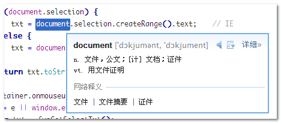

# 功能简述

一般翻译软件都有划词翻译功能，例如有道桌面词典的桌面划词翻译功能：

在 web 页面上，我们也是可以实现类似的效果的：划词 → 显示提示 → 分享。这就是本文要展示的内容。

# 效果与 demo

<iframe src="/examples/text-selected-shared/demo.html" width="400" height="200"></iframe>

`embed:text-selected-shared/demo.html`

# 结语及补充

其实呢，此方法不仅支持新浪微博，支持企鹅微博（腾讯微博），狐狸微博（搜狐微博），也是可以的，只要根据各个微博分享页面的 API 地址，将 window.open()中的地址换换就可以了。
