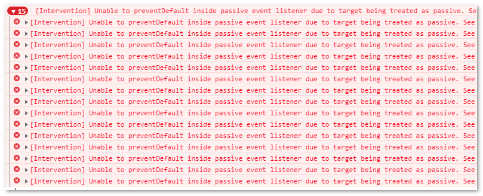

# Chrome 和 Safari 浏览器 preventDefault 报 treated as passive 错误

其实这个问题出现有一段时间了，主要麻烦的是，以前没有，后来，Chrome 和 Safari 浏览器升级了，然后出现这个错误，而且就在一个月前，Chrome 浏览器还只是黄色的警告，现在直接就红色错误献上。

例如，随便新建一个空白页面，写上如下 JavaScript 代码：

```js
document.addEventListener('touchmove', function(event) {
  event.preventDefault();
});
```

然后在移动端模式下页面上点击滑来滑去记下，就可以看到一大堆错误：

> [Intervention] Unable to preventDefault inside passive event listener due to target being treated as passive. See…



如果仅仅是错误，不影响功能其实还好，但是，这个报错会影响我们之前运行很 OK 的交互操作，例如，自定义滚动，或者元素拖拽效果等，会触发浏览器原生的滚动，产生不好的交互体验效果。

有以下 2 种解决方案：

# touch-action:none 解决 treated as passive 错误

加入如下 CSS：

```css
html {
  touch-action: none;
}
```

报错就会无影无踪。

touch-action 是移动端一个与手势触摸密切相关的 CSS 属性，原本源自 windows phone 手机，微软系，后来被 Chrome 吸收借鉴，Firefox 浏览器跟上，然后 Safari 也部分支持，目前已经可以说是在移动端可以畅行的 CSS 属性。

支持的关键字值有：

```css
touch-action: auto;
touch-action: none;
touch-action: pan-x;
touch-action: pan-left;
touch-action: pan-right;
touch-action: pan-y;
touch-action: pan-up;
touch-action: pan-down;
touch-action: pinch-zoom;
touch-action: manipulation;
```

其中：

- auto 是默认值，表示手势操作什么的完全由浏览器自己决定（如`<meta>`元素的 viewport 设置）。
- manipulation 表示浏览器只允许进行滚动和持续缩放操作，类似双击缩放这种非标准操作就不可以。想当初，click 事件在移动端有个 300ms 延时，就是因为避免和手机双击行为发生冲突。然而，当我们设置了 touch-action:manipulation 干掉了双击行为，则显然，300ms 延时就不复存在，因此，下面的 CSS 声明可以用来避免浏览器 300ms 延时问题。
  ```css
  html {
    touch-action: manipulation;
  }
  ```

上面 2 个关键字属性值（auto 和 manipulation）是 Safari 唯一支持的两个 touch-action 属性值，iOS Safari 就是为用户操碎了心，就怕开发者把一些对用户无障碍访问有帮助的东西去掉，例如不支持 touch-action:none 以及 iOS10+中设置 viewport 的 user-scalable=no 已经无法阻止用户手指缩放屏幕了，或许在 Safari 看来，对于一个网页，没有任何理由阻止用户放大看你的网页内容。

至于其他关键字，正如字面意思，要么只能左移，要么只能左右移动，要么只能右移之类，具体如下：

- none 表示不进行任何 touch 相关默认行为，例如，你想用手指滚动网页就不行，双击放大缩小页面也不可以，所有这些行为要自定义。
- pan-x 表示手指头可以水平移来移去。
- pan-left 表示手指头可以往左移动，移动开始后还是可以往右恢复的。
- pan-right 表示手指头可以可以往右移动，移动开始后还是可以往左恢复的。
- pan-y 表示手指头可以垂直移来移去。
- pan-up 表示手指头可以往上移，移动开始后还是可以往下恢复的。
- pan-down 表示手指头可以往下移，移动开始后还是可以往上恢复的。
- pan-zoom 表示手指头可以用来缩放页面

上述部分关键字可以组合使用，分 pan-y, pan-up, pan-down 和 pan-x, pan-left, pan-right 以及 pan-zoom 这三组，然后这三组关键字可以任意组合，例如：

```css
.example {
  touch-action: pan-left pan-up pan-zoom;
}
```

表示可以左移，上移和缩放。

此方法不足

1. iOS Safari 浏览器不支持；
2. 干掉了可能需要的原生的 touch 相关行为。

不过主要问题还是 iOS Safari 浏览器不支持，第 2 点不足我们可以当我们需要阻止时候 JS 设置 touch-action 为 none，不需要在 JS 还原即可，不是大问题。

iOS Safari 对于传统移动网页可是重要浏览器，不可忽略，怎么办，有没有什么其他方法呢？有！就是下面这个。

# 直接传递 passive:false 解决 treated as passive 错误

问题代码是：

```js
document.addEventListener('touchmove', function(event) {
  event.preventDefault();
});
```

修复后的 JavaScript 代码是：

```js
document.addEventListener(
  'touchmove',
  function(event) {
    event.preventDefault();
  },
  {
    passive: false
  }
);
```

也就是 addEventListener 的第三个参数传递 passive:false，告诉浏览器，我这个事件就是不是消极的，是老子主动要这么做的。浏览器此时也不好说什么，然后，我们以前出问题的代码就能正常运行了。

如果是 Zepto.js 语法下的事件呢，例如：

```js
$(document).on('touchmove', function(event) {
  event.preventDefault();
});
```

根据我查看 Zepto 的源码分析，目前并不支持，请使用原生的 addEventListener 代替。

# 结束语

意外学到了 CSS touch-action 相关的一些知识。有了 touch-action:manipulation，我们可以在网页中放心大胆使用 click 事件了，至于自定义的 touch 事件之流可以退出历史舞台了。
