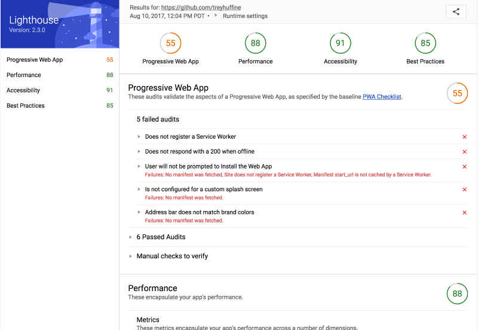
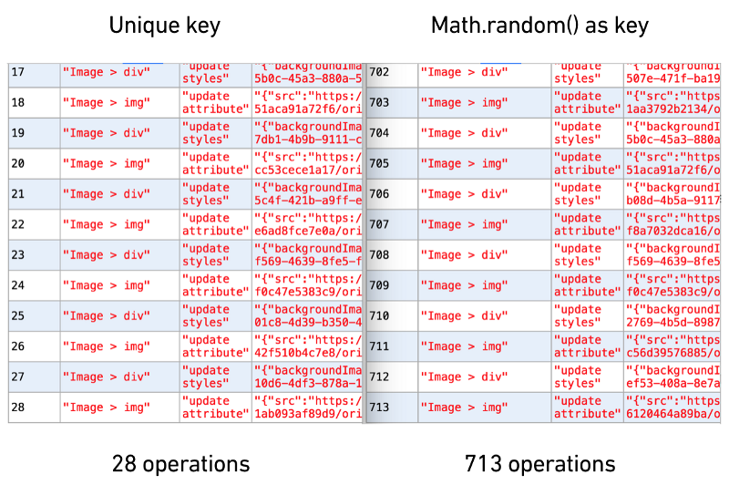

翻译转载：[Optimize React Performance](https://levelup.gitconnected.com/optimize-react-performance-c1a491ed9c36?ref=reddit&amp;utm_source=reddit&amp;utm_medium=react-12-12-2017)

# 如何提高生产中的React性能，避免常见的错误

>您是否知道key在列表中使用不正确可以将DOM操作增加10倍以上？据了解，React的Virtual DOM实现速度非常快。但是，即使使用React的内置性能，也有一些UI可能开始感觉迟缓的情况。造成业绩不佳的罪魁祸首是产生了太多渲染和状态同步。我们将介绍4种技术，以帮助确保您的应用程序得到优化，并提供快速的用户体验。

1. key正确使用
2. 管理 shouldComponentUpdate
3. 扩展PureComponent而不是Component
4. 建立生产


# 衡量效率

在深入研究代码之前，了解您正在优化的内容以及它所带来的影响是非常重要的。我建议使用的两个工具是Lighthouse和react-addons-perf。这两个工具都可以通过NPM（安装[1](https://www.npmjs.com/package/lighthouse)，[2](https://www.npmjs.com/package/react-addons-perf)），并都提供一个浏览器扩展（[1](https://chrome.google.com/webstore/detail/lighthouse/blipmdconlkpinefehnmjammfjpmpbjk)，[2](https://chrome.google.com/webstore/detail/react-perf/hacmcodfllhbnekmghgdlplbdnahmhmm?hl=en-US)）。我个人建议使用npm for Lighthouse，因为结果似乎更可靠，并使用React Perf的Chrome扩展。以下是来自Lighthouse的输出示例，我们将在以下部分查看React Perf的结果。



注意：Lighthouse从版本60开始可以通过Chrome本地浏览，而react-addons-perf将不再与React 16.0 +兼容，但以下结果对任何版本的React仍然有效。

# 正确的使用key

`key`:React中在应用程序生命周期的任何时刻唯一标识列表中的元素。如果DOM被更新，React能够识别哪些项目已经改变。因此，key组件上的值必须是唯一的，并且与列表中的同级组件相关。这是React开发人员倾向于使用的一个属性，但是不论经验多少的React开发人员在生成列表时可能不会真正理解使用该属性。两个常见的错误是使用index期间map(element, index)或使用Math.random()生成一个key。最好的解决方案是与列表项关联UUID，但任何唯一标识符都可以。在列表中您将使用key的典型场景如下。

```js
function ListItem(props) {
  // Correct! There is no need to specify the key here:
  return <li>{props.value}</li>;
}

function UserList(props) {
  const users = props.users;
  const listItems = users.map((user) =>
    // Correct! Key should be specified inside the array.
    <ListItem key={user.id.toString()}
              value={user.name} />
  );
  return (
    <ul>
      {listItems}
    </ul>
  );
}

const users = [ 
  {id: 1, name: 'Khaleesi'} , 
  {id: 2, name: 'Jon'}, 
  {id: 3, name: 'Arya'}
];

<UserList users={users} />
```

由于用户ID是唯一的，我们可以确信地使用它作为列表项的关键字。对于更实际的应用程序，我创建了一个Postmate的feed的模拟版本，当点击时从DOM中删除了一个商店。




使用react-addons-perf Chrome扩展，我计算了使用UUID作为关键字以及使用Math.random()一个关键字来移除一个元素的操作次数。结果表明，使用唯一一致的密钥只需要28个操作来移除项目，而随机生成的密钥需要超过`25倍的数目操作才能执行完全相同的任务`。谨慎用你的`key`。

# 管理shouldComponentUpdate

管理组件生命周期允许您准确指定组件应该呈现的时间。既然您作为开发人员了解您的应用程序并不知道您的应用程序，您就可以确定组件是否需要重新渲染。渲染和重绘是React中最昂贵的操作，因此根据您的领域知识消除任何不必要的调用可以为您的性能和用户体验带来巨大的改进。

# 使用React.PureComponent而不是React.Component

React提供PureComponent了管理shouldComponentUpdate开发人员的生命周期钩子。PureComponent将做所有道具/状态的浅层比较，并且只会在任何道具/状态发生变化时进行渲染。大多数情况下，您可以放弃使用PureComponent而不是自己处理。它确实带有一些仔细的考虑，可能导致讨厌的错误。在将对象分配给变量时，JavaScript使用指针。这意味着变量指向内存中的特定位置，而不是指向对象本身的任何特定位置。如果更新对象的属性，指针将保持不变，因此浅比较将无法识别更新。为了避免这种情况，您可以

1. 直接将变量传递给组件，而不是传递给对象
2. 包含不可变的数据结构。

以下示例使用PureComponent将获得与我们的示例相同的结果shouldComponentUpdate。

```js
class CounterButton extends React.PureComponent {
  constructor(props) {
    super(props);
    this.state = {count: 1};
    this.handleClick = this.handleClick.bind(this);
  }
  
  handleClick() {
    this.setState(state => ({count: state.count + 1}));
  }

  render() {
    return (
      <button
        color={this.props.color}
        onClick={this.handleClick}>
        Count: {this.state.count}
      </button>
    );
  }
}
```

最后一个考虑因素是功能组件还没有针对React进行优化，但是团队已经答应在将来这样做。如果您在应用程序中确定了需要优化的区域，则最好使用类组件来确保获得所需的性能。

# 建立生产

建设生产看起来很明显，但重要的是你检查你的过程，以确保它编译使用NODE_ENV = 'production'。React包含许多警告，可帮助您调试在生产中被剥离的内容。这些警告使开发更友好，但也使得React的构建变得越来越慢。生产React构建比开发构建渲染速度快2-8倍。

以下Webpack插件将提供所需的生产版本：

```js
plugins: [
  new webpack.DefinePlugin({
    'process.env': {
      NODE_ENV: JSON.stringify('production')
    }
  }),
  new webpack.optimize.UglifyJsPlugin()
  'transform-react-constant-elements',
  'transform-react-inline-elements',
  ...otherPlugins
]
```

在DefinePlugin确保NODE_ENV设置是否正确，以及UglifyJsPlugin压缩的JavaScript。所述transform-react-constant-elements移动常数元件以更高的范围，和transform-react-inline-elements替换天然React.createElement()具有更优化的版本。请注意，这些只能在生产中使用，因为它们会产生模糊的错误，使开发调试变得困难。您可以使用React Developer for Chrome来评估您是否使用React的生产版本。