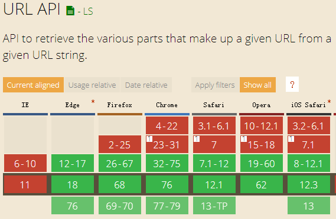
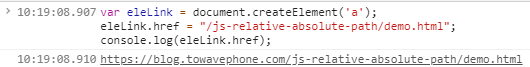
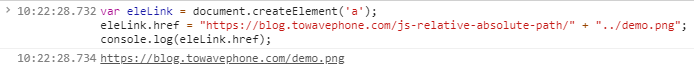

# new URL()方法

有时候为了方便的处理 URL 地址，会使用 URL()方法。例如：

```js
var myUrl = new URL('https://blog.towavephone.com/js-relative-absolute-path');
// 可以方便获得URL地址的各个组成部分
console.log(myUrl.host);
console.log(myUrl.path);
console.log(myUrl.search);
```

除了上面的 URL 地址拆家，URL()方法还有一个隐藏的功能，就是可以实现相对地址变成绝对地址的效果。

## 语法

```js
var myUrl = new URL(url, [base]);
```

看到后面的可选参数`[base]`没有，这个就可以实现相对路径变成绝对路径。

## 方法封装

实际开发，base 往往就是当前页面的域名地址，因此，我们可以简单封装一个方法，简化我们平时的调用

```js
var relative2absolute = function(url, base) {
  if (!base) {
    base = location.protocol + location.host;
  }
  return new URL(url, base).href;
};
```

## 总结

URL()方法进行相册地址到绝对地址要转换，非常方便，也非常灵活，没有任何域名的限制，属于各种场景。

但是有一个非常大的缺点，就是兼容性不太好。Edge 12+支持。



不过可以添加 polyfill 使支持，[https://github.com/lifaon74/url-polyfill](https://github.com/lifaon74/url-polyfill)，兼容到 IE9+

但是就有点麻烦了，可以试试下面的`<a>`元素法

# a|form 元素法

还可以借助链接元素的直接返回绝对地址的特性实现需求。

例如`<a>`元素的 href 属性，或者`<form>`元素的 action 属性。

## 案例

直接上 JavaScript 代码：

```js
var eleLink = document.createElement('a');
eleLink.href = '/js-relative-absolute-path/demo.html';
console.log(eleLink.href);
// 结果就是本文的URL地址
// https://blog.towavephone.com/js-relative-absolute-path/demo.html
```

控制台测试结果如下：



## 案例 2

带有路径关系的地址也是类似的实现。例如：

```js
var eleLink = document.createElement('a');
eleLink.href = 'https://blog.towavephone.com/js-relative-absolute-path/' + '../demo.png';
console.log(eleLink.href);
// 结果是https://blog.towavephone.com/demo.png
```

控制台测试结果如下：



## 方法封装

```js
var relative2absolute = function(url, base) {
  var ele = document.createElement('a');
  ele.href = (base || '') + url;
  return eleLink.href;
};
```

## 总结

借助链接元素的相对地址转换方法，其最大的优点就是兼容性非常好，即使是极低版本的 IE 浏览器也是支持的。

至于缺点，就是需要在浏览器环境中才行，不支持 Node.js 环境。
