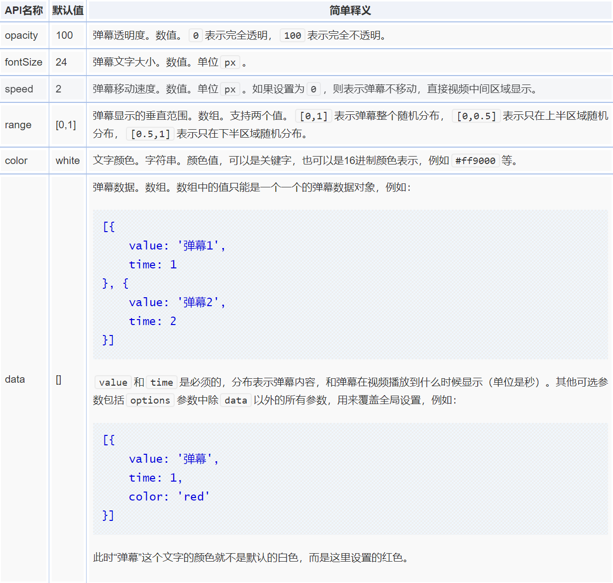

# canvas实现弹幕性能较好

从技术实现成本角度讲，要实现弹幕效果，最简单的方法就是DOM+CSS3控制，如果我们的弹幕效果比较简单，使用CSS3动画实现也不失为一个好的方法。

但是如果我们的弹幕数据量比较大，就像下面这种：


使用DOM来实现很容易卡成了80年代的拖拉机——一顿一顿的。

很显然，面对这种多元素的复杂动画，使用canvas实现是更加合适的，动画会流畅很多。

本文就将展示两个案例，使用canvas实现弹幕效果。其中一个效果是静态的弹幕数据固定的无限循环的效果，适合在个人博客或者运营页面，这种非视频场景使用；另外一个效果是动态的弹幕数据可变的和真实HTML5 `<video>` 交互的弹幕效果，也就是真视频弹幕效果。

两个高保真demo的源代码都是可以免费使用的，使用MIT许可，也就是需要保留源代码中的版权声明。

好，下面我们一个人来看一下。

# canvas实现的静态循环滚动播放弹幕

<iframe src="/examples/html5-canvas-video-barrage/static-barrage.html" width="400" height="100"></iframe>

`embed:html5-canvas-video-barrage/static-barrage.html`

## 使用方法和API

语法如下：

```js
canvasBarrage(canvas, data);
```

其中：

- canvas  
  canvas表示我们的`<canvas>`画布元素，可以直接是DOM元素，也可以是`<canvas>`画布元素的选择器。
- data  
  data表示弹幕数据，是一个数组。例如下面：
  ```js
  [{
    value: '弹幕1',
    color: 'blue',
    range: [0, 0.5]
  }, {
    value: '弹幕2',
    color: 'red',
    range: [0.5, 1]
  }]
  ```

可以看到数组中的每一个值表示一个弹幕的信息对象。其中value表示弹幕的文字内容；color表示弹幕描边的颜色（弹幕文字本身默认是白色）；range表示弹幕在画布中的区域范围，例如[0, 0.5]表示弹幕在画布中的上半区域显示，[0.5, 1]表示弹幕在画布中的下半区域显示。

然后就可以看到无限滚动的弹幕效果了。

### 补充说明

此弹幕效果默认文字大小是28px，并且文字加粗，如果这个效果不符合您的需求，需要在canvasBarrage()方法中修改源代码。因为本来就是个简单静态效果，因此没有专门设计成API。

此弹幕效果默认是白色文字加可变颜色描边，同样的，如果这个效果不符合您的需求，需要在canvasBarrage()方法中修改源代码。
跟真实的弹幕效果有所不同，这里的弹幕出现的速度和时机不是基于特定时间，而是随机产生。所以看到有些文字好像开飞机，而有些文字好像坐着拖拉机。因为是死数据，这样设计会看上去更真实写。

# canvas实现的video真实交互的弹幕

这个原型就有点厉害了，市面上估计很难找到这么负责任的原型页面了。实现的动机完全兴趣使然，上面实现了个简单的，就想着要不实现一个真实的，万一以后用得到呢？

## 使用方法和API

语法如下：

```js
new CanvasBarrage(canvas, video, options);
```

其中：

- canvas  
  canvas表示我们的`<canvas>`画布元素，只能是DOM元素。
- video  
  video表示我们播放的视频元素，只能是DOM元素。
- options  
  options为可选参数，包括：



## 如何修改全局设置和添加弹幕？

当我们使用new CanvasBarrage()构造完我们的弹幕方法后，会返回一个弹幕对象，通过调用这个对象暴露的属性和方法，就可以进行全局的设置和添加弹幕等。例如：

```js
var myBarrage = new CanvasBarrage(canvas, video, options);
```

如果我们想把弹幕透明度改成50%透明，可以：

```js
myBarrage.opacity = 50;
```

就这么简单，于是新出现的弹幕都会以50%透明显示，类似的，弹幕文字大小和颜色，弹幕显示的区域范围都可以通过这样设置，例如：

```js
myBarrage.fontSize = 20;
```

就是把弹幕文字颜色改成20px大小。

如果我们想动态添加弹幕，可以使用暴露的add()方法，语法如下：

```js
myBarrage.add(obj);
```

其中obj的参数类型和支持属性和options-data数组中对象一模一样。例如：

```js
myBarrage.add({
    value: 'new CanvasBarrage()',
    color: '#ff0000',
    time: 0
});
```

myBarrage还暴露了一个名为reset()方法，可以清除屏幕上所有的弹幕，并重新根据视频时间开始运动与显示。视频点击跳转时候的弹幕处理就是调用的此方法。
