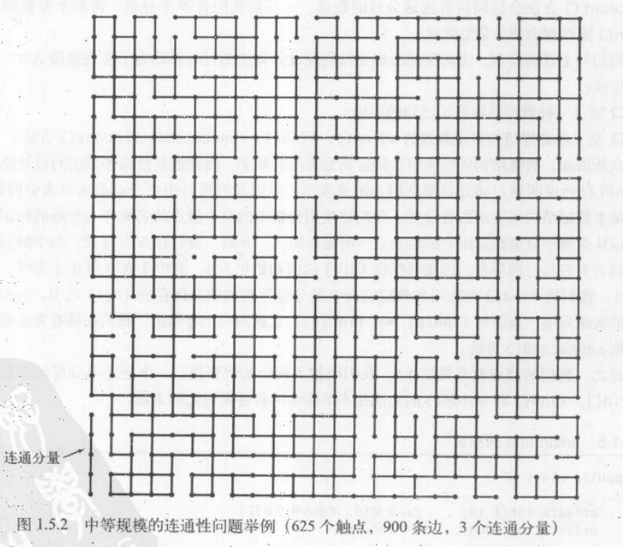
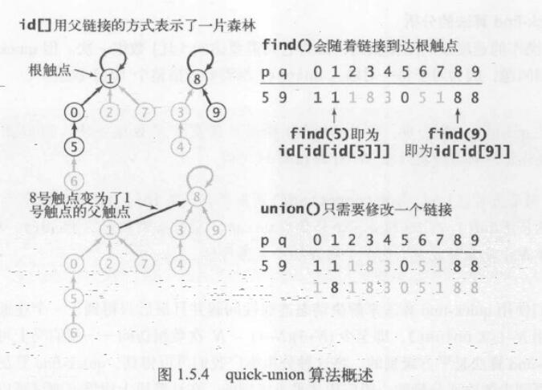
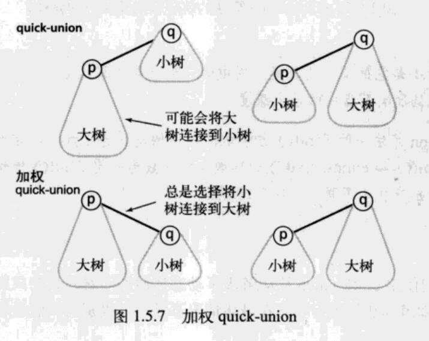

## 加权 quick-union 算法







### 特点

- 对于 N 个触点，加权 quick-union 算法构造的森林中的任意节点的深度最多为 lgN。
- 对于加权 quick-union 算法和 N 个触点，在最坏情况下 find()、connected()和 union()的成本的增长数量级为 logN。

### 实现

```java
package edu.princeton.cs.algs4;

public class WeightedQuickUnionUF {
    private int[] parent;   // parent[i] = parent of i
    private int[] size;     // size[i] = number of sites in subtree rooted at i
    private int count;      // number of components

    /**
     * Initializes an empty union–find data structure with {@code n} sites
     * {@code 0} through {@code n-1}. Each site is initially in its own
     * component.
     *
     * @param  n the number of sites
     * @throws IllegalArgumentException if {@code n < 0}
     */
    public WeightedQuickUnionUF(int n) {
        count = n;
        parent = new int[n];
        size = new int[n];
        for (int i = 0; i < n; i++) {
            parent[i] = i;
            size[i] = 1;
        }
    }

    /**
     * Returns the number of components.
     *
     * @return the number of components (between {@code 1} and {@code n})
     */
    public int count() {
        return count;
    }

    /**
     * Returns the component identifier for the component containing site {@code p}.
     *
     * @param  p the integer representing one object
     * @return the component identifier for the component containing site {@code p}
     * @throws IllegalArgumentException unless {@code 0 <= p < n}
     */
    public int find(int p) {
        validate(p);
        int tmp = p;
        while(parent[tmp] != tmp){
            tmp = parent[tmp];
        }
        // 在检查结点的同时将他们直接链接到根结点
        // 这就是带路径压缩的加权quick-union算法
        while (p != parent[p]){
            p = parent[p];
            parent[p] = tmp;
        }
        return p;
    }

    // validate that p is a valid index
    private void validate(int p) {
        int n = parent.length;
        if (p < 0 || p >= n) {
            throw new IllegalArgumentException("index " + p + " is not between 0 and " + (n-1));
        }
    }

    /**
     * Returns true if the the two sites are in the same component.
     *
     * @param  p the integer representing one site
     * @param  q the integer representing the other site
     * @return {@code true} if the two sites {@code p} and {@code q} are in the same component;
     *         {@code false} otherwise
     * @throws IllegalArgumentException unless
     *         both {@code 0 <= p < n} and {@code 0 <= q < n}
     */
    public boolean connected(int p, int q) {
        return find(p) == find(q);
    }

    /**
     * Merges the component containing site {@code p} with the
     * the component containing site {@code q}.
     *
     * @param  p the integer representing one site
     * @param  q the integer representing the other site
     * @throws IllegalArgumentException unless
     *         both {@code 0 <= p < n} and {@code 0 <= q < n}
     */
    public void union(int p, int q) {
        int rootP = find(p);
        int rootQ = find(q);
        if (rootP == rootQ) return;

        // make smaller root point to larger one
        if (size[rootP] < size[rootQ]) {
            parent[rootP] = rootQ;
            size[rootQ] += size[rootP];
        }
        else {
            parent[rootQ] = rootP;
            size[rootP] += size[rootQ];
        }
        count--;
    }


    /**
     * Reads in a sequence of pairs of integers (between 0 and n-1) from standard input,
     * where each integer represents some object;
     * if the sites are in different components, merge the two components
     * and print the pair to standard output.
     *
     * @param args the command-line arguments
     */
    public static void main(String[] args) {
        int n = StdIn.readInt();
        WeightedQuickUnionUF uf = new WeightedQuickUnionUF(n);
        while (!StdIn.isEmpty()) {
            int p = StdIn.readInt();
            int q = StdIn.readInt();
            if (uf.connected(p, q)) continue;
            uf.union(p, q);
            StdOut.println(p + " " + q);
        }
        StdOut.println(uf.count() + " components");
    }

}
```
