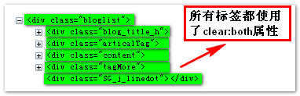
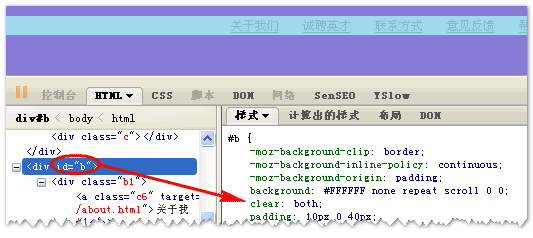
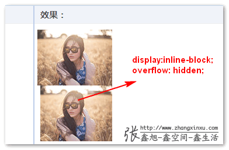
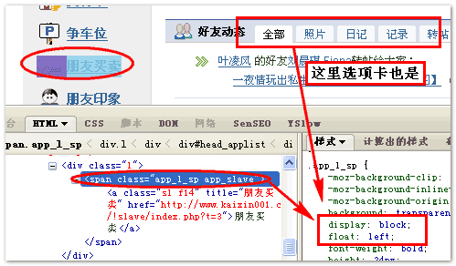
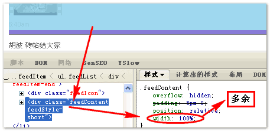
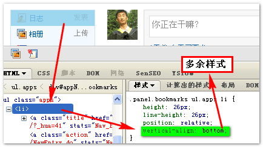
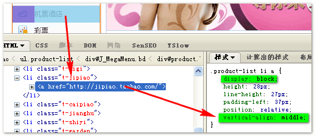
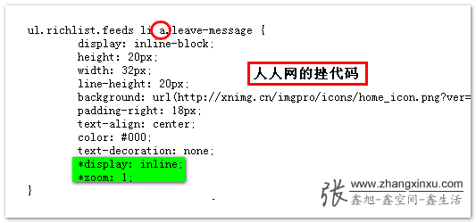

# 一些常见不必要 CSS 样式

## 与默认 CSS 样式一致

我们有时候写的 CSS 样式会与浏览器默认的 CSS 样式一致，有时候您自己都可能没有意识到。

常见的例子有：

### width / height

```css
div {
  width: auto;
  height: auto;
}
```

很显然，这段样式是没有必要的，默认的任何块状元素的高度几乎都是 auto。

### padding

```css
body,
p,
h1,
h2,
h3,
h4,
h5,
h6 {
  margin: 0;
  padding: 0;
}
```

上面有关 body,p 等标签的样式中有个样式是无效的，与默认值一致的，这个样式就是 padding:0，对于 body,p,h1~6 这些标签，本身的 padding 值就是 0，所以只需要 margin:0 就可以了。

因为 ul,ol 还要独立设置 list-style 样式，而且常用的标签就 ul,ol 列表元素有默认的 padding 值，高效的写法应该是：

```css
body,
p,
h1,
h2,
h3,
h4,
h5,
h6 {
  margin: 0;
}

ul,
ol {
  list-type: none;
  margin: 0;
  padding: 0;
}
```

### display: inline

```css
span {
  display: inline;
  float: left;
  margin-left: 3px;
}
```

出现这种情况的原因可能与 IE6 的浮动双边距 bug 有关，我们可以用设置 display:inline 的方法修复 IE6 的这个 bug。

但是对于 span/a/em/cite/i/b/strong 等行内元素默认就是 display:inline 的，所以给其设置 display:inline 属性是多此一举。

类似的情况还有对本身就是 block 水平的元素设置 display:block 属性，例如：

```css
li {
  display: block;
  padding: 4px 0;
}
```

上面的情况屡见不鲜，甚至在比较优秀的网站上也会有这类低级的样式问题。

### 其他

```css
div {
  margin: auto;
}

textarea {
  overflow: auto;
}

img,
input,
button {
  vertical-align: baseline;
}

div {
  background-position: 0 0;
}
```

## 没有必要出现的样式

最常见的就是 clear:both 的使用。  
如果前后没有浮动元素干扰，使用 clear:both 是没有道理的。  
比如说新浪新版博客个人博客的首页，clear:both 属性可以说是滥用：



在博客列表主体处基本上每个 div 标签都使用了 clear:both 属性，而这里所有的 clear:both 属性都是可以去除的。

clear:both 的多余使用可以说是相当普遍使用的情况。像是开心网底部网站信息：



要是前后没有直接的浮动元素，使用 clear:both 就是多余的。

## 不起作用的单样式

有些 CSS 样式只针对特定显示水平的标签起作用。

### inline 水平

inline 水平的元素对很多 CSS 样式都不起反应，例如 height/width, clear, margin-top/margin-bottom, overflow 等。举个实例吧，拿 overflow:hidden 属性举例，对于 inline 水平的元素而言，设置 overflow:hidden 属性是没有作用的。例如下面的测试代码：

```html
<span style="overflow: hidden;">
  
  <span></span
></span>
```

对比于：

```html
<span style="display: inline-block; overflow: hidden;">
  
  <span></span
></span>
```

对比图如下：



### block 水平

block 水平的元素对 vertical-align 属性没有作用。

### 组合起作用

有些样式需要和其他一些特定的 CSS 属性一起使用才有作用。常见的就是 z-index 与 position 属性的组合使用，left/top/bottom/right 与 position 属性的组合使用。

## 组合样式中多余的 CSS 代码

### display:block;

```css
a {
  display: block;
  float: left;
  margin-top: 2px;
}
```

这可以说是最常见的含有多余样式的例子了，开心网个人首页可谓随处可见，见下图：



这里的 display 属性完全没有必要，对于 a 或是 span 标签而言，没有任何理由使用 display+float 的组合，因为 float 所产生的“包裹”作用已经让元素如同一个 inline-block 水平的元素，这种作用大于直接的 display 设置。

仅仅一种情况下有必要使用 display+float 的组合，就是 block 水平的元素在 IE6 下的双边距 bug 问题，这种情况的唯一写法就是 display:inline; float:left; margin-left:3px;一定要有与 float 浮动同方向的 margin 值，否则 display:inline 是多余的，可以直接去掉。

### height:25px;

```css
div {
  height: 25px;
  line-height: 25px;
}
```

这又是一种常见的平时不注意的可以精简的 CSS 代码，这段代码高度与 line-height 值一致，通常作用是实现单行文字的垂直居中显示。但是实际上，很多情况下，这里的 height 是个多余的值，尤其在模块标题处。对于单行文字而言，您设置 line-height 多大，其实际占据的垂直高度就是多高，没有任何的兼容性问题，可以放心使用。

但是，有时候这里的 height 值是有必要的，什么时候呢？就是 IE6/7 清除浮动影响的时候，IE6/7 下设置 height 值可以让元素 haslayout 从而清除浮动的影响，而 line-height 无此作用，还有就是其他一些需要 layout 的情况。

### width:100%;

```css
span {
  display: block;
  width: 100%;
}

div {
  width: 100%;
}

body {
  width: 100%;
}
```

这也是常见的使用多余 CSS 样式的情况，width:100%。在一般情况下，对于 block 属性的元素，width:100%这个属性绝对是多余的。默认的，block 水平的元素就是宽度相对于父标签 100%显示的。

当然，不使用 100%的情况不是绝对的，下面这个组合可能使用 width:100%是有必要的。

```css
div {
  width: 100%;
  overflow: hidden;
}
```

在 IE6/7（没有 IE8）下，对于 block 水平的元素，我们可以使用 width:100%清除浮动造成的影响，原因与上例一样，haslayout，除了这种情况，纯粹的{width:100%;}样式（无 float 或是 position:absolute 之类的样式）是不可能出现的。所以，如果您的 CSS 代码中出现上述情况，检查下您的 width:100%是不是多余的。（下图为搜狐白社会动态列表中多余 width:100%情况）



### vertical-align:middle;

```css
div {
  float: left; /* 或display:inline;*/
  vertical-align: middle;
}
```

设置无用的 vertical-align 属性也是常见的。对于 block/inline 水平的元素或是设置了浮动属性或是 absolute 绝对定位的元素，其都不支持 vertical-align 属性。所以这些属性与 vertical-align 同时出现时，vertical-align 属性不起任何作用是多余的。

例如人人网右侧的垂直菜单 block 水平的 li 元素：



或是淘宝新版首页左上侧的垂直列表：



### display:inline; float:left; margin-left:10px;

```css
div {
  position: absolute;
  left: 0;
  top: 0;
  display: inline;
  float: left;
  margin-left: 10px;
}
```

设置了绝对定位属性的元素相对特殊些，其不支持的 CSS 样式可就多了，首先对于 display 属性，完全没有必要，无论是 block/inline-block/inline 都是如此，除了显示隐藏外，没有任何组合使用的理由。还有其他很多属性都不支持，例如 clear，vertical-align 等。

### zoom:1;

```css
div {
  height: 20px; /* 或width:200px; */
  zoom: 1;
  overflow: hidden;
}
```

我们可能会使用 zoom 清除 IE6/7（对 IE8 无效）浏览器下浮动造成的影响。但是对于 IE6/7 而言，如果您已经设置了高度值或是宽度值，那么 zoom:1 完全就是多余的，在 IE6/7 下含有定值的 height 或是 width 与 zoom:1 起到了同样的一个作用，就是使元素 haslayout，可用来清除浮动产生的影响，所以，width/height 与 zoom:1 同时出现也是没有任何理由的。

### 其他

```css
a {
  display: inline-block;
  *display: inline;
  *zoom: 1;
}
```

这是设置元素的 inline-block 属性，但是对于 inline 行内元素来说，后面的两个样式就是多余的，因为 display:inline-block 可以让 inline 水平的元素表现的就如同真正的 inline-block 水平一样。

所以，下图人人网样式代码中标注的代码就是多余的。如果是 div，则需要上面完整代码。


