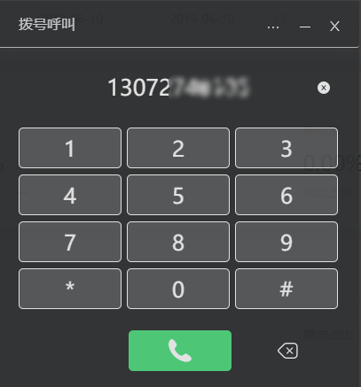
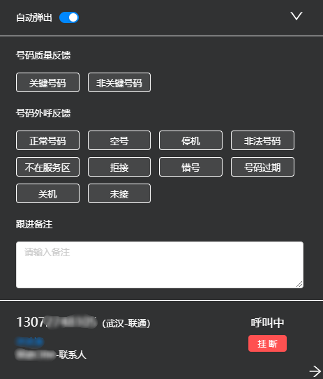
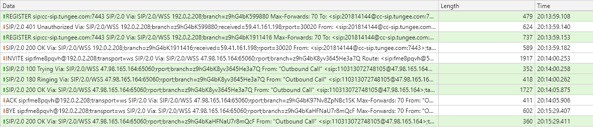

# 需求背景

最近由于第三方云端电话私自更改接口导致了线上事故的发生，所以公司决定由前端直接连接 freeswitch ，用它来借助第三方线路打云端电话

# 知识背景

[SIP协议入门学习](/SIP-protocol-introduction-learning/)

# 核心思路

首先在网上找到相应前端的 SIP 连接库，发现大概满足的有 2 种，一个是 JsSIP，看了一下支持的列表里面是没有 freeswitch 的，所以选了支持 freeswitch 的 SIP.js

# 代码预览

在写代码时考虑到要兼容之前第三方云端电话的逻辑，所以需要将所有的方法封装成一个类

```js
// Call
import { UA } from './libs/sip-0.14.1';

class Call {
  constructor() {
    // eslint-disable-next-line constructor-super
    this.callInfo = null;
    this.userAgent = null; // 注册 SIP 后实例
    this.session = null; // 拨打成功后 session 实例
    this.remoteView = null;

    this.hasSignedIn = false;
    this.createElements();

    window.onbeforeunload = () => { // eslint-disable-line
      this.signOut();
    };
  }

  createElements() {
    this.remoteView = document.createElement('video');
    this.remoteView.style.display = 'none';
    document.body.appendChild(this.remoteView);
  }

  async signIn(callInfo) {
    const { ws_domain: sipServer, ws_port: sipPort, ws_protocol: wsType } = await getCallInfo();
    return new Promise((resolve, reject) => {
      this.signInResolve = resolve;
      this.signInReject = reject;
      this.callInfo = {
        authorizationUser: callInfo.agent_id,
        password: callInfo.agent_pwd,
        sipServer,
        sipPort,
        wsType,
      };
      this.registerSip();
    });
  }

  // 注册分机（软电话）
  registerSip() {
    const {
      authorizationUser,
      password,
      sipServer,
      sipPort,
      wsType,
    } = this.callInfo;
    const config = {
      // Replace this IP address with your FreeSWITCH IP address
      uri: `${authorizationUser}@${sipServer}:${sipPort}`,
      transportOptions: {
        wsServers: [`${wsType}://${sipServer}:${sipPort}`],
      },
      // Replace sipjs.com with your domain name
      // and replace the port with your FreeSWITCH wss port
      ws_servers: `${wsType}://${sipServer}:${sipPort}/`,
      // FreeSWITCH Default Username
      authorizationUser,
      // FreeSWITCH Default Password
      password,
      // displayName: '8300211193',
      hackIpInContact: true,
      // register: true,
      sessionDescriptionHandlerFactoryOptions: {
        constraints: {
          audio: true,
          video: false,
        },
      },
    };

    this.userAgent = new UA(config);

    this.userAgent.on('connected', () => {
      console.log('连接成功');
    });

    this.userAgent.on('disconnected', () => {
      console.log('连接断开');
    });

    this.userAgent.on('registered', () => {
      console.log('注册成功');
      this.hasSignedIn = true;
      this.signInResolve();
    });

    this.userAgent.on('unregistered', () => {
      console.log('反注册成功');
      this.upperSelf.onAgentStateChange && this.upperSelf.onAgentStateChange('0', '2');
      this.hasSignedIn = false;
      this.signInReject();
    });

    this.userAgent.on('registrationFailed', () => {
      console.log('注册失败');
      this.hasSignedIn = false;
      this.signInReject();
    });

    this.userAgent.once('transportCreated', (transport) => {
      console.log('transportCreated', transport);
    });

    this.userAgent.on('message', () => {
      console.log('message');
    });

    this.userAgent.on('invite', (incomingSession) => {
      console.log('incomingSession', incomingSession);
      this.session = incomingSession;
      this.session.accept();
      // 播放对方会话
      this.session.on('trackAdded', () => {
        console.log('trackAdded');
        const pc = this.session.sessionDescriptionHandler.peerConnection;
        // Gets remote tracks
        const remoteStream = new MediaStream();
        pc.getReceivers().forEach((receiver) => {
          remoteStream.addTrack(receiver.track);
        });
        this.remoteView.srcObject = remoteStream;
        this.remoteView.play();
      });
      this.session.on('progress', (response) => {
        console.log('progress', response);
      });
      this.session.on('failed', (response, cause) => {
        console.log('failed', response, cause);
      });
      // 响铃动作
      this.session.on('accepted', (data) => {
        console.log('accepted', data);
      });
      this.session.on('rejected', (response, cause) => {
        console.log('rejected', response, cause);
      });
      // 挂断动作
      this.session.on('terminated', (message, cause) => {
        console.log('terminated', message, cause);
      });
      this.session.on('referRequested', () => {
        console.log('referRequested');
      });
      this.session.on('reinvite', () => {
        console.log('reinvite');
      });
      this.session.on('replaced', () => {
        console.log('replaced');
      });
      this.session.on('cancel', () => {
        console.log('cancel');
      });
      // 挂断动作
      this.session.on('bye', (request) => {
        console.log('bye', request);
      });
      this.session.on('directionChanged', () => {
        console.log('directionChanged');
      });
      this.session.on('SessionDescriptionHandler-created', () => {
        console.log('SessionDescriptionHandler-created');
      });
    });
  }

  // 来电挂断
  hangup() {
    console.log('挂断', this.session);
    if (this.session) {
      this.session.bye();
    }
  }

  signOut() {
    console.log('退出登录成功');
    if (this.userAgent) {
      this.userAgent.stop();
      this.userAgent = null;
    }
    if (this.session) {
      this.session.terminate();
      this.session = null;
    }
    this.hasSignedIn = false;
  }

  // 603 Decline
  // 当成功访问到被叫方的设备，但是用户明确的不想应答。这个应答可以通过增加一个Retry-After头域更明确的告诉呼叫方多久以后可以继续呼叫
  // 只有当终端知道没有其他任何终端设备能够响应这个呼叫的势能才能给出这个应答。
  makeIdle() {
    console.log('在忙');
    // this.session.reply({
    //   statusCode: '486',
    // });
  }
}

export default Call;
```

# 疑难问题

以上因为 freeswitch 第三方线路的失败回调导致挂断电话不能正常挂断，此时最佳的解决办法就是后端写 websocket 来推送给前端以做到实时更新，否则总是有些不成功的回调导致UI显示错误，现阶段主要采用轮询后端的方式来获取最新的状态。

以上更新于`2019-6-10 20:20:52`

---

# 实现效果






