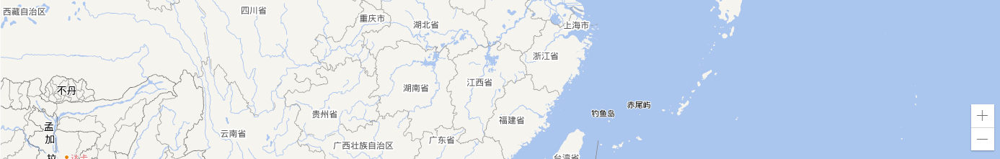
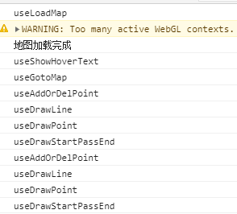
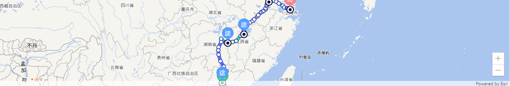

# 需求背景

基于公司的要求，需要对地图组件做出选型，以支持在地图上展示线路轨迹

# 技术选型

|     选型     |                  优点                   |              缺点              |
| :----------: | :-------------------------------------: | :----------------------------: |
|   百度地图   | 大厂支持、UI 比较美观、API 文档较为清楚 |      内网搭建访问较为困难      |
|   高德地图   | 大厂支持、UI 比较美观、API 文档较为清楚 |      内网搭建访问较为困难      |
| echarts 地图 |        UI 美观、API 文档较为清楚        | 内网搭建访问较为困难、功能较弱 |
|    天地图    |        支持离线访问、是专用地图         |   UI 不够美观、文档不够清楚    |
|    arcgis    |  支持离线访问、UI 上可做到切换不同图层  |          文档不够清楚          |

最终由于是内网相关的项目，需要支持离线访问，同时那边所采用的地图组件也是 arcgis，所以最终采用 arcgis

# 前期准备

## 三方库本地化

考虑到在内网离线运行，所以要对 arcgis 的 js 库进行本地化，大致经历了以下过程：

### 配合内网验证 demo 静态文件服务器

直接使用 nginx 或者 http-server 静态服务器，将 arcgis 脚本地址改为本地

### 静态文件服务器托管

将 arcgis 三方库托管在静态文件服务器上，同时反代相关路径，这里的后端采用 koa 技术栈

src\server\controllers\stat-multi.controller.js

```js
// 访问地址的 css 路径：/stat-multi/arcgis/esri/themes/light/main.css
// 访问地址的 url 路径：/stat-multi/arcgis/init.js
const config = require('config'); // 全局配置
const proxy = require('http-proxy-middleware');
const c2k = require('koa2-connect');

function proxyArcgis(ctx, next) {
  const proxyMiddleware = c2k(
    proxy({
      target: config.arcgisMapHost,
      // 对 /stat-multi/arcgis 开头的 url 进行反代
      pathRewrite: (path) => path.replace('/stat-multi/arcgis', ''),
      onProxyRes: (proxyRes) => {
        console.log('proxyRes', proxyRes);
        // proxyRes.headers['Cache-Control'] = 'private,max-stale=0,max-age=0'
      },
      onProxyReq: (proxyReq) => {
        console.log('proxyReq', proxyReq);
      }
    })
  );
  return proxyMiddleware(ctx, next);
}

proxyArcgis();
```

### npm 私有库托管

由于此三方库的静态文件服务器需要单独进行配置，略显繁琐，于是决定上传到公司 npm 私有库上，安装到后端对应的项目，并在后端以静态文件服务器的形式提供访问，这里后端采用 midway 技术栈

server\src\config\config.default.ts

```js
// 访问地址的 css 路径：/static-apps/mut/arcgis/esri/themes/light/main.css
// 访问地址的 url 路径：/static-apps/mut/arcgis/init.js

config.static = {
  prefix: '/static-apps/mut',
  dir: [
    path.join(appInfo.baseDir, 'app/public'),
    {
      prefix: '/static-apps/mut/arcgis',
      dir: path.join(process.cwd(), 'node_modules/上传到 npm 私有库的三方库/dist'),
      maxAge: 60 * 10 // 缓存 10 分钟
    }
  ]
};
```

## 内网图层验证

由于需要在内网离线运行，验证在内网 demo 是否能正常加载图层

### react-arcgis

首先确保没有多余的外网请求，在采用 [react-arcgis](https://github.com/Esri/react-arcgis) 的过程中，发现无论采用什么图层也会加载 arcgis 的默认图层（在内网的情况下会阻塞内网图层的加载，同时也会对地图的加载速度造成影响），所以直接使用 [esri-loader](https://github.com/Esri/esri-loader) 加载图层

### esri-loader

写出一个基本的 demo，在外网的情况下以天地图的图层进行访问，在内网以内部服务器返回的图层进行访问，在内网验证成功，未发现多余请求，主要验证代码如下：

<iframe src="/examples/arcgis-map-component-build-deploy/load-map-demo.html" width="400" height="100"></iframe>

`embed:arcgis-map-component-build-deploy/load-map-demo.html`

## 经纬度修复

在地图上加载公司数据组给的数据时，发现有很多地点对应的经纬度有偏差，需要对数据组的经纬度数据修复

### 外网天地图修复脚本

核心逻辑：

1. 申请天地图服务器端的 key，确保根据地点获取地点详情接口请求成功
2. 考虑到天地图开放 API 可能有频率限制，采用串行逻辑请求接口
3. 更新数据库时采用增量更新的方式，即需要判断写入的 lat 或 lon 字段是否已写入，每次查出未写入的再进行更新

```js
const request = require('request');
const lodash = require('lodash');
const ProgressBar = require('progress');

const { sequelize } = require('./sequelize.js');
const { targetTable } = require('./config.js');

// curl --connect-timeout 999999 -m 999999 'http://localhost:8000/stat-multi/train-analysis/get-all-station-info?isUseTianDiTuApi=1&isUpdateDatabase=1&pageSize=1000'
// http://api.tianditu.gov.cn/geocoder?ds={"keyWord":"弯坵火车站"}&tk=f73eace6fbf7a640861984ea1b3ffa07
async function updateGps(params = {}) {
  const { isUseTianDiTuApi, isUpdateDatabase, pageSize = 10, current = 1 } = params;
  const offset = (current - 1) * pageSize;
  const sql = `select * from ${targetTable} where lat is null or lon is null order by zmdm limit ${pageSize} offset ${offset}`;
  const rsp = await sequelize.query(sql, {
    type: sequelize.QueryTypes.SELECT
  });
  function getTianDiTuInfo(keyword) {
    const tianDiTuApiUrl = 'http://api.tianditu.gov.cn';
    const token = 'ab61c4d11eab1728b7f6ff48639bc73e';
    return new Promise((resolve, reject) => {
      request(
        {
          method: 'GET',
          url: encodeURI(`${tianDiTuApiUrl}/geocoder?ds={"keyWord":"${keyword}"}&tk=${token}`),
          timeout: 10000
        },
        (error, response) => {
          if (error) {
            reject(error);
          } else {
            resolve(response.body);
          }
        }
      );
    });
  }

  async function getListByKeyword() {
    const list = [];
    const bar = new ProgressBar('更新中 [:bar] :rate/bps :percent :etas', { total: rsp.length });
    for (const item of rsp) {
      const rsp2 = await getTianDiTuInfo(`${item.zm}火车站`);
      const response = JSON.parse(rsp2);
      const lon = lodash.get(response, 'location.lon');
      const lat = lodash.get(response, 'location.lat');
      if (isUpdateDatabase) {
        const sql = `update ${targetTable} set lat='${lat}', lon='${lon}' where zmdm='${item.zmdm}'`;
        const rsp3 = await sequelize.query(sql, {
          type: sequelize.QueryTypes.UPDATE
        });
        bar.tick();
        // console.log(rsp3)
      }
      list.push({
        ...item,
        lon,
        lat
      });
    }
    if (bar.complete) {
      console.log('\n刷新数据库完成\n');
    }
    return list;
  }

  if (isUseTianDiTuApi) {
    return getListByKeyword();
  }
  return rsp;
}

updateGps({
  isUseTianDiTuApi: true, // 是否使用天地图 API 获取经纬度
  isUpdateDatabase: true, // 是否更新数据库
  current: 1, // 当前页
  pageSize: 100 // 第几页
}).then((rsp) => {
  console.log(`${rsp.length} 个数据更新成功`);
  process.exit(0);
});
```

### 内网修复脚本

在以上的版本上，核心逻辑多了以下功能：

1. 内网接口返回的经纬度单位是转换墨卡托投影单位，需要用 gcoord 三方库做转换
2. get 参数处理
3. 增加成功、失败总数统计

```js
const request = require('request');
const lodash = require('lodash');
const ProgressBar = require('progress');
const gcoord = require('gcoord');

// const result = gcoord.transform(
//   [12580093.358100001, 3273944.1777000017],    // 经纬度坐标
//   gcoord.WebMercator,               // 当前坐标系
//   gcoord.WGS84                 // 目标坐标系
// );

// console.log(result)

const { sequelize } = require('./sequelize.js');
const { targetTable } = require('./config.js');
const { withExtraQuery } = require('./utils');

function getInfoByZm(searchText) {
  // const apiUrl = 'http://api.tianditu.gov.cn/geocoder'
  // const token = 'ab61c4d11eab1728b7f6ff48639bc73e'
  // const url = encodeURI(`${apiUrl}/geocoder?ds={"keyWord":"${searchText}"}&tk=${token}`)

  const apiUrl = 'http://10.160.9.49:8080/OneMapServer/rest/services/SEARCH_QGCZ/Transfer/find';
  const params = {
    f: 'json',
    searchText,
    contains: false,
    layers: '0',
    searchFields: 'name,label'
  };
  const url = withExtraQuery(apiUrl, params);
  // console.log(url)
  return new Promise((resolve, reject) => {
    request(
      {
        method: 'GET',
        url,
        timeout: 10000
      },
      (error, response) => {
        if (error) {
          reject(error);
        } else {
          resolve(response.body);
        }
      }
    );
  });
}

async function updateList(rsp, isUpdate) {
  const list = [];
  const bar = new ProgressBar('更新中 [:bar] :rate/bps :percent :etas 第 :current 个 总共 :total 个', {
    total: rsp.length
  });
  let successTotal = 0;
  let failTotal = 0;
  for (const item of rsp) {
    try {
      const rsp2 = await getInfoByZm(item.zm.trim());

      const response = JSON.parse(rsp2);
      // 墨卡托投影单位，需要做转换
      const x = lodash.get(response, 'results[0].geometry.x');
      const y = lodash.get(response, 'results[0].geometry.y');

      let lon = x;
      let lat = y;
      if (x && y) {
        const result = gcoord.transform(
          [x, y], // 坐标
          gcoord.WebMercator, // 当前坐标系
          gcoord.WGS84 // 目标坐标系
        );
        lon = result[0];
        lat = result[1];
      }

      // const lon = lodash.get(response, 'location.lon')
      // const lat = lodash.get(response, 'location.lat')

      if (isUpdate) {
        const sql = `update ${targetTable} set lat='${lat}', lon='${lon}' where zmdm='${item.zmdm}'`;
        const rsp3 = await sequelize.query(sql, {
          type: sequelize.QueryTypes.UPDATE
        });
        successTotal += 1;
        bar.tick();
      }
      list.push({
        ...item,
        lon,
        lat
      });
    } catch (error) {
      console.log(error);
      if (isUpdate) {
        bar.tick();
        failTotal += 1;
      }
    }
  }
  if (bar.complete) {
    console.log(`${successTotal} 个数据更新成功，${failTotal} 个数据更新失败`);
  }
  return list;
}

// isUseApi: 是否使用 api 查询地理坐标
// isUpdate: 是否同步到数据库
async function getGps(params = {}) {
  const { isUseApi, isUpdate, pageSize, current } = params;
  const offset = (current - 1) * pageSize;
  const sql = `select * from ${targetTable} where lat is null or lon is null order by zmdm limit ${pageSize} offset ${offset}`;
  const rsp = await sequelize.query(sql, {
    type: sequelize.QueryTypes.SELECT
  });

  if (isUseApi) {
    return updateList(rsp, isUpdate);
  }
  return rsp;
}

getGps({
  isUseApi: true,
  isUpdate: true,
  current: 1,
  pageSize: 1000
}).then((rsp) => {
  // console.log(rsp)
  process.exit(0);
});
```

内网执行脚本刷新结果：共 `8493` 条数据，`2038` 条查不出结果(部分原因是命名不规范或者不存在这个站)，`6455` 条查出经纬度并完成入库

### 脚本执行线程池化

在以上的版本上，利用线程池的概念优化取数逻辑

1. 请求接口线程池化
2. 数据库数据更新线程池化
3. 数据库批量更新数据

#### 带有并发数限制的异步任务

concurrentRun.js

```js
/**
 * 执行多个异步任务
 * @param {*} fnList 任务列表
 * @param {*} max 最大并发数限制
 * @param {*} taskName 任务名称
 */
module.exports = async function concurrentRun(fnList = [], max = 5, taskName = '未命名') {
  if (!fnList.length) return;

  console.log(`开始执行多个异步任务，最大并发数： ${max}`);
  const replyList = []; // 收集任务执行结果
  const count = fnList.length; // 总任务数量
  const startTime = new Date().getTime(); // 记录任务执行开始时间

  let current = 0;
  // 任务执行程序
  const schedule = async (index) => {
    return new Promise(async (resolve) => {
      try {
        const fn = fnList[index];
        if (!fn) return resolve();

        // 执行当前异步任务
        const reply = await fn();
        replyList[index] = reply;
      } catch (e) {
        console.log(e);
        // 报错了不管继续下一个
        resolve();
      }

      current++;
      console.log(
        `${taskName} 事务进度，第 ${current} 个，共 ${count} 个，进度为 ${((current / count) * 100).toFixed(2)}% `
      );

      // 执行完当前任务后，继续执行任务池的剩余任务
      await schedule(index + max);
      resolve();
    });
  };

  // 任务池执行程序
  const scheduleList = new Array(max).fill(0).map((_, index) => schedule(index));
  // 使用 Promise.all 批量执行
  const r = await Promise.all(scheduleList);

  const cost = (new Date().getTime() - startTime) / 1000;
  console.log(`执行完成，最大并发数： ${max}，耗时：${cost}s`);
  return replyList;
};
```

#### 请求接口并发执行/数据更新并发执行

index.js

```js
const request = require('request');
const lodash = require('lodash');

const { sequelize } = require('./sequelize.js');
const { targetTable } = require('./config.js');
const concurrentRun = require('./concurrentRun.js');

function getInfoByZm(keyword) {
  const tianDiTuApiUrl = 'http://api.tianditu.gov.cn';
  const token = 'ab61c4d11eab1728b7f6ff48639bc73e';
  return new Promise((resolve, reject) => {
    request(
      {
        method: 'GET',
        url: encodeURI(`${tianDiTuApiUrl}/geocoder?ds={"keyWord":"${keyword}"}&tk=${token}`),
        timeout: 10000
      },
      (error, response) => {
        if (error) {
          reject(error);
        } else {
          resolve(response.body);
        }
      }
    );
  });
}

async function updateDataBase(rsp) {
  const zmdms = [];
  const lons = [];
  const lats = [];
  rsp.forEach((item) => {
    const lon = lodash.get(item.response, 'location.lon');
    const lat = lodash.get(item.response, 'location.lat');
    zmdms.push(`'${item.zmdm}'`);
    lons.push(`when '${item.zmdm}' then '${lon}'`);
    lats.push(`when '${item.zmdm}' then '${lat}'`);
  });

  const sql = `
    update ${targetTable} set 
    lon = case zmdm ${lons.join(' ')} end,
    lat = case zmdm ${lats.join(' ')} end 
    where zmdm in (${zmdms.join(',')})
  `;

  const rsp3 = await sequelize.query(sql, {
    type: sequelize.QueryTypes.UPDATE
  });
}

async function updateList(rsp, isUpdate) {
  const requestFnList = rsp.map((item) => () => getInfoByZm(`${item.zm.trim()}火车站`));

  const list = await concurrentRun(requestFnList, 100, '请求天地图');

  const result = rsp.map((item, index) => {
    try {
      return {
        ...item,
        response: JSON.parse(list[index])
      };
    } catch (e) {
      return item;
    }
  });

  if (isUpdate) {
    // 每 100 个分隔成一组
    const updateFnList = lodash.chunk(result, 100).map((item) => () => updateDataBase(item));

    await concurrentRun(updateFnList, 5, '保存到数据库');
  }
  return list;
}

// isUseApi: 是否使用 api 查询地理坐标
// isUpdate: 是否同步到数据库
// pageSize:
async function getGps(params = {}) {
  const { isUseApi, isUpdate, pageSize = 10, current = 1 } = params;
  const offset = (current - 1) * pageSize;
  const sql = `select * from ${targetTable} where lat is null or lon is null order by zmdm limit ${pageSize} offset ${offset}`;
  const rsp = await sequelize.query(sql, {
    type: sequelize.QueryTypes.SELECT
  });

  if (isUseApi) {
    return updateList(rsp, isUpdate);
  }
  return rsp;
}

getGps({
  isUseApi: true,
  isUpdate: true,
  current: 1,
  pageSize: 9000
}).then((rsp) => {
  // console.log(rsp)
  process.exit(0);
});
```

#### 执行结果

以 1000 个数据为例

不带并行执行情况：

```
1000 个数据更新成功，0 个数据更新失败
Done in 168.70s.
```

带并行执行情况：

```
开始执行多个异步任务，最大并发数： 100
执行完成，最大并发数： 100，耗时：19.954s
开始执行多个异步任务，最大并发数： 5
执行完成，最大并发数： 5，耗时：0.289s
Done in 21.41s.
```

### 人工修复

经过以上修复，还是有部分数据未查到结果，最终采用内部（另外合作商）经纬度去修复

# 组件设计

```bash
.
├── api.js # api 请求，主要用来获取地图配置
├── components
│   ├── map
│   │   ├── hooks
│   │   │   ├── use-goto-map.js # 地图导航
│   │   │   └── use-load-map.js # 地图加载
│   │   └── index.jsx # 地图组件主入口
│   └── route-display-layer
│       ├── hooks
│       │   ├── use-add-or-del-point.js # 设置删除、添加的监听事件
│       │   ├── use-draw-line # 画地图上的线
│       │   │   ├── const.js
│       │   │   └── index.js
│       │   ├── use-draw-point # 画地图上的非选中的点
│       │   │   └── index.js
│       │   ├── use-draw-start-pass-end # 画地图上的选中点
│       │   │   ├── images
│       │   │   │   ├── 圆心.png
│       │   │   │   ├── 定位_终点.svg
│       │   │   │   ├── 定位_起点.svg
│       │   │   │   └── 定位_途点.svg
│       │   │   └── index.js
│       │   └── use-show-hover-text.js # 设置悬浮文字
│       ├── index.jsx # 路线组件主入口
│       └── styles.less
├── index.jsx # 主入口文件
└── styles.less
```

# 具体功能

## 主入口文件

核心逻辑：

1. 兼容地图配置从外部传入的情况
2. path（站点数据）需要过滤掉经纬度无意义的站点
3. route（路线信息）需要过滤掉缺失的线路，即 2 个站点间的路线有可能未知
4. map, view 实例存在时才去渲染路线相关的组件

```js
import React, { useState, useEffect } from 'react';
import { setDefaultOptions } from 'esri-loader';

import RouteDisplayLayer from './components/route-display-layer';
import Map from './components/map';
import { getConfig } from './api';

import styles from './styles.less';

setDefaultOptions({
  css: '/static-apps/mut/arcgis/esri/themes/light/main.css',
  url: '/static-apps/mut/arcgis/init.js'
});

/*
  config: esri 三方库后端配置地址（外部配置）
  height: 地图高度
  onRef：map 的 ref 回调
  settings： {
    centerLon 地图中心经度
    centerLat 地图中心纬度
    zoom 缩放级别
  }
  pointInfo: 过滤条件的起点、终点、途径点渲染
  onPointInfoChange: 过滤条件变化回调
  goToCenter: 初次加载是否到中心点
  showAddOrDelBtn: 是否显示添加删除按钮，
  showLineInfo: 是否显示路线信息
  path: 站点信息
  route: 路线信息
  transport: 运输信息（线路密度）
*/

export { getConfig };

export default function RailwayMap(props) {
  const { path, route } = props;
  const [config, setConfig] = useState(props.config);

  useEffect(() => {
    const fetchConfig = async () => {
      const data = await getConfig();
      setConfig(data.result);
    };
    if (!config) {
      fetchConfig();
    }
  }, [config]);

  const { centerLon = 110, centerLat = 38, zoom = 5 } = props.settings || {};

  const [map, setMap] = useState();
  const [view, setView] = useState();

  if (!config) {
    return null;
  }

  const isFloat = (number) => /^(-?\d+)(\.\d+)?$/.test(number);

  // 过滤掉没有经纬度结点或者经纬度为 0 的结点
  const filterPath = path.filter(
    (item) => isFloat(item.lat) && isFloat(item.lon) && +item.lat !== 0 && +item.lon !== 0
  );

  const getPointInfoByZmdm = (zmdm) => path.find((item) => item.zmdm === zmdm) || {};

  const filterRoute = [];
  for (let i = 0; i < route.length; i++) {
    // 补充缺失的线路，比如这种情况长沙-湘潭-武汉，长沙-湘潭段属于长湘线，湘潭到武汉属于湘武线
    // 湘潭的经纬度为空，那么直接连起来的长沙 - 武汉叫长湘线
    if (
      getPointInfoByZmdm(route[i].zmdm).lon &&
      getPointInfoByZmdm(route[i].zmdm).lat &&
      (!getPointInfoByZmdm(route[i].next_zmdm).lon || !getPointInfoByZmdm(route[i].next_zmdm).lat)
    ) {
      const { zm: startZm, zmdm: startZmdm, xm } = route[i];

      // 累加缺失的站点的里程数
      let distance = 0;
      if (route[i].czjl) {
        distance = route[i].czjl;
      }

      let index = null;
      for (let j = i + 1; j < route.length; j++) {
        if (route[j].czjl) {
          distance += route[j].czjl;
        }
        // 这里需要找到第一个终点站经纬度不为零的站点的下标，以此来进行缺失经纬度站点的合并
        if (getPointInfoByZmdm(route[j].next_zmdm).lon && getPointInfoByZmdm(route[j].next_zmdm).lat) {
          index = j;
          break;
        }
      }
      if (!index) {
        // eslint-disable-next-line no-continue
        continue;
      }
      const { next_zmdm: endZmdm, next_zm: endZm } = route[index];
      filterRoute.push({
        zmdm: startZmdm,
        zm: startZm,
        next_zmdm: endZmdm,
        next_zm: endZm,
        xm,
        czjl: distance
      });
      i = index;
    }

    // 经纬度都有的结点直接插入
    if (
      getPointInfoByZmdm(route[i].zmdm).lon &&
      getPointInfoByZmdm(route[i].zmdm).lat &&
      getPointInfoByZmdm(route[i].next_zmdm).lon &&
      getPointInfoByZmdm(route[i].next_zmdm).lat
    ) {
      filterRoute.push(route[i]);
    }
  }

  return (
    <div className={styles.container}>
      <Map
        {...props}
        config={config}
        viewProperties={{
          zoom: +zoom,
          center: [+centerLon, +centerLat]
        }}
        setMap={setMap}
        setView={setView}
        view={view}
      />
      {map && view && <RouteDisplayLayer {...props} path={filterPath} route={filterRoute} map={map} view={view} />}
    </div>
  );
}
```

## 地图组件主入口

采用 hooks 方式拆分，下面的组件也是采用类似的拆分

```js
import { useRef } from 'react';

import useLoadMap from './hooks/use-load-map';
import useGotoMap from './hooks/use-goto-map';

export default function Map(props) {
  const { height } = props;
  const mapRef = useRef();
  useLoadMap({
    ...props,
    mapRef
  });
  useGotoMap(props);

  return (
    <div
      style={{
        height
      }}
      ref={mapRef}
    />
  );
}
```

## 地图加载

需要监听地图组件图层加载完毕事件

```js
import { useEffect } from 'react';
import { loadModules } from 'esri-loader';

// 地图加载
export default function useLoadMap(props) {
  const { setMap, setView, viewProperties, config, mapRef, onRef } = props;
  const { mapLayerUrlTemplate, subDomains, markerLayerUrlTemplate } = config;

  useEffect(() => {
    // https://developers.arcgis.com/javascript/latest/sample-code/sandbox/index.html?sample=layers-webtile-3d
    loadModules(['esri/Map', 'esri/views/MapView', 'esri/layers/WebTileLayer'])
      .then(([Map, MapView, WebTileLayer]) => {
        const mapLayer = new WebTileLayer({
          urlTemplate: mapLayerUrlTemplate,
          subDomains
        });
        const markerLayer = new WebTileLayer({
          urlTemplate: markerLayerUrlTemplate,
          subDomains
        });

        const map = new Map({
          layers: [mapLayer, markerLayer]
        });

        const view = new MapView({
          container: mapRef.current,
          map,
          ...viewProperties
        });

        view.ui.move('zoom', 'bottom-right');

        view.when(
          () => {
            console.log('地图加载完成');
            setMap(map);
            setView(view);
            onRef &&
              onRef({
                map,
                view
              });
          },
          (error) => {
            console.log('地图加载失败', error);
          }
        );
      })
      .catch((err) => {
        // handle any errors
        console.error(err);
      });
    // eslint-disable-next-line react-hooks/exhaustive-deps
  }, [setMap, setView]);
}
```

## 地图导航

初始化时直接导航到相应路线（暂时有 bug，因为不能确定路线组件完全加载的时机而导致的偶尔路线渲染不出来的现象）

```js
import { useEffect } from 'react';

// 地图导航
export default function useGotoMap(props) {
  const { view, goToCenter, path } = props;

  useEffect(() => {
    if (!view || !goToCenter || !path || !path.length) {
      return;
    }

    // 暂时未找到 view.graphics 完全加载时的方法，会造成白屏 bug
    if (goToCenter === true) {
      view.goTo(
        {
          target: view.graphics
        },
        {
          animate: false
        }
      );
    } else {
      view.goTo(goToCenter);
    }
  }, [path, view, goToCenter]);

  // console.log('view', view)
  // const eventRef = useRef()
  // useEffect(() => {
  //   if (!view) {
  //     return
  //   }

  //   eventRef.current = view.on('layerview-create', () => {
  //     console.log('dsads')
  //     console.log(get(view, 'graphics._items', []).length)
  //   })

  //   return () => {
  //     eventRef.current && eventRef.current.remove()
  //   }
  // }, [view])
}
```

## 路线组件主入口

1. 渲染路线信息组件
2. 渲染悬浮文字组件

```js
import { Fragment, useRef, useState } from 'react';
import { ShrinkOutlined, ArrowsAltOutlined } from '@ant-design/icons';
import classnames from 'classnames';
import { Button } from 'antd';

import useDrawLine from './hooks/use-draw-line';
import useDrawPoint from './hooks/use-draw-point';
import useDrawStartPassEnd from './hooks/use-draw-start-pass-end';
import useAddOrDelPoint from './hooks/use-add-or-del-point';
import useShowHoverText from './hooks/use-show-hover-text';

import styles from './styles.less';

export default function RouteDisplayLayer(props) {
  const { showLineInfo = true } = props;

  const { lineInfo } = useDrawLine(props);

  const [isExpand, setIsExpand] = useState(true);

  useDrawPoint(props);

  useDrawStartPassEnd(props);

  useAddOrDelPoint(props);

  const hoverNodeRef = useRef();

  useShowHoverText({
    ...props,
    hoverNodeRef
  });

  const totalDistance = lineInfo.reduce((pre, cur) => pre + cur.distance, 0);

  const totalHint = (
    <span>
      全程
      {totalDistance}
      公里
    </span>
  );

  return (
    <Fragment>
      <span className={styles.hoverNode} ref={hoverNodeRef} />
      {showLineInfo &&
        lineInfo &&
        lineInfo.length > 0 &&
        (isExpand ? (
          <div className={classnames(styles.lineInfoContainer, styles.lineInfo)}>
            <div className={styles.header}>
              {totalHint}
              <div className={styles.expandBtn}>
                <ShrinkOutlined onClick={() => setIsExpand(false)} />
              </div>
            </div>
            <div className={styles.body}>
              {lineInfo.map((item) => (
                <div key={item.xm} className={styles.item}>
                  <span
                    className={styles.color}
                    style={{
                      background: item.color
                    }}
                  />
                  <span className={styles.xm}>{item.xm}</span>
                </div>
              ))}
            </div>
          </div>
        ) : (
          <div className={styles.lineInfoContainer}>
            <Button onClick={() => setIsExpand(true)} icon={<ArrowsAltOutlined />}>
              {totalHint}
            </Button>
          </div>
        ))}
    </Fragment>
  );
}
```

## 画地图上的线

1. 根据 route、path 渲染路线
2. 根据 transport 渲染路线粗细，同时弹窗显示线路密度

```js
import { useEffect, useRef } from 'react';
import { loadModules } from 'esri-loader';
import { get, groupBy } from 'lodash';

import { LINE_COLORS, getLineSize } from './const';

// 画地图上的线
export default function useDrawLine(props) {
  const { path, view, route, transport } = props;

  const polylineGraphicsRef = useRef();

  useEffect(() => {
    const groupMap = groupBy(route, (item) => item.xm);
    const getPointInfoByZmdm = (zmdm) => path.find((item) => item.zmdm === zmdm);

    // https://developers.arcgis.com/javascript/latest/guide/display-point-line-and-polygon-graphics/
    // https://developers.arcgis.com/javascript/latest/sample-code/intro-graphics/index.html
    loadModules(['esri/Graphic'])
      .then(([Graphic]) => {
        if (polylineGraphicsRef.current) {
          polylineGraphicsRef.current.forEach((item) => {
            view.graphics.remove(item);
          });
          polylineGraphicsRef.current = [];
        }

        /* 根据 path、transport 计算密度总数 */
        // 根据经过的 path 即站点累加密度情况
        const transportList = []; // 运输密度统计表，以 path 最小单元做计算
        if (transport && transport.length > 0) {
          transport.forEach((item) => {
            // 找到上车站的下标
            const startIndex = path.findIndex((item2) => item2.zmdm === item.zmdm_sc);
            // 找到下车站的下标
            const endIndex = path.findIndex((item2) => item2.zmdm === item.zmdm_xc);
            // 遍历上车站到下车站的站点，累加所有密度
            for (let i = startIndex; i < endIndex; i++) {
              const startZmdm = get(path, `[${i}].zmdm`);
              const endZmdm = get(path, `[${i + 1}].zmdm`);
              const findTransportList = transportList.find(
                (item2) => get(item2, 'start.zmdm') === startZmdm && get(item2, 'end.zmdm') === endZmdm
              );
              if (findTransportList) {
                findTransportList.total += item.ysrs;
              } else {
                transportList.push({
                  start: path[i],
                  end: path[i + 1],
                  total: item.ysrs
                });
              }
            }
          });
        }
        // 根据起点代码、终点代码找到密度数
        const getPeopleNumberByStartEnd = (startZmdm, endZmdm) =>
          get(
            transportList.find((item) => get(item, 'start.zmdm') === startZmdm && get(item, 'end.zmdm') === endZmdm),
            'total',
            0
          );
        /* 根据 path、transport 计算密度总数 */

        const polylineGraphics = [];

        // 渲染线路
        const renderLine = ({ paths, width, distance, xm, index, peopleNumber }) => {
          const content = [];
          if (distance) {
            content.push(`里程：${distance} 公里`);
          }
          if (peopleNumber) {
            content.push(`运输密度：${peopleNumber} 人`);
          }
          const polylineGraphic = new Graphic({
            geometry: {
              type: 'polyline',
              paths: paths.map((item) => [+get(item, 'lon', 0), +get(item, 'lat', 0)])
            },
            symbol: {
              type: 'simple-line',
              color: LINE_COLORS[index % LINE_COLORS.length],
              width
            },
            attributes: {
              xm
            },
            popupTemplate: {
              title: xm,
              content: content.join('、')
            }
          });
          polylineGraphics.push(polylineGraphic);
          view.graphics.add(polylineGraphic);
        };

        Object.keys(groupMap).forEach((key, index) => {
          const paths = [];
          let totalDistance = 0;
          groupMap[key].forEach((item) => {
            const startPointInfo = getPointInfoByZmdm(item.zmdm);
            const endPointInfo = getPointInfoByZmdm(item.next_zmdm);
            totalDistance += item.czjl || 0;
            paths.push([startPointInfo, endPointInfo]);
          });
          if (transport && transport.length > 0) {
            paths.forEach((item) => {
              const [startPointInfo, endPointInfo] = item;
              const peopleNumber = getPeopleNumberByStartEnd(get(startPointInfo, 'zmdm'), get(endPointInfo, 'zmdm'));
              const width = getLineSize(peopleNumber);
              // console.log(get(startPointInfo, 'zm'), get(endPointInfo, 'zm'), key, peopleNumber, width)
              renderLine({
                distance: totalDistance,
                width: `${width}px`,
                paths: item,
                xm: key,
                index,
                peopleNumber
              });
            });
          } else {
            paths.forEach((item) => {
              // const [startPointInfo, endPointInfo] = item
              // console.log(get(startPointInfo, 'zm'), get(endPointInfo, 'zm'), key)
              renderLine({
                distance: totalDistance,
                width: '6px',
                paths: item,
                xm: key,
                index
              });
            });
          }
        });
        polylineGraphicsRef.current = polylineGraphics;
      })
      .catch((err) => {
        console.error(err);
      });
  }, [view, path, transport, route]);

  const lineInfo = [];

  const groupMap = groupBy(route, (item) => item.xm);
  Object.keys(groupMap).forEach((key, index) => {
    lineInfo.push({
      xm: key,
      color: LINE_COLORS[index % LINE_COLORS.length],
      distance: groupMap[key].reduce((pre, cur) => pre + (cur.czjl || 0), 0)
    });
  });

  return {
    lineInfo
  };
}
```

## 画地图上的非选中的点

渲染非选中的站点，弹窗显示站点信息并显示添加按钮

```js
import { useEffect, useRef } from 'react';
import { loadModules } from 'esri-loader';
import { get } from 'lodash';

// 画地图上的非过滤条件上的点
export default function useDrawPoint(props) {
  const { path, pointInfo = [], view, showAddOrDelBtn = true } = props;
  const routerRef = useRef({
    // 属于路径但不在过滤条件里面的点
    notFilterPointGraphics: []
  });

  useEffect(() => {
    // https://developers.arcgis.com/javascript/latest/guide/display-point-line-and-polygon-graphics/
    // https://developers.arcgis.com/javascript/latest/sample-code/intro-graphics/index.html
    loadModules(['esri/Graphic'])
      .then(([Graphic]) => {
        /** 画点 **/
        const notFilterPointGraphicsRef = routerRef.current.notFilterPointGraphics;
        if (notFilterPointGraphicsRef.length) {
          notFilterPointGraphicsRef.forEach((item) => {
            view.graphics.remove(item);
          });
          routerRef.current.notFilterPointGraphics = [];
        }
        /* 非查询条件上的点 */
        const notFilterPointGraphics = [];
        const filterPath = pointInfo
          .filter((item) => item.value)
          .map((item) => ({
            ...item,
            zmdm: get(item, 'value.key', '')
          }));
        path.forEach((item) => {
          const filterPathIndex = filterPath.findIndex((item2) => item2.zmdm === item.zmdm);
          if (filterPathIndex === -1) {
            /** 不在筛选条件里面的点 **/
            const pointGraphic = new Graphic({
              attributes: {
                point: item,
                path
              },
              geometry: {
                type: 'point',
                longitude: +item.lon,
                latitude: +item.lat
              },
              symbol: {
                type: 'simple-marker',
                color: '#fff',
                size: '10px',
                outline: {
                  color: '#2c42af',
                  width: '2px'
                }
              },
              popupTemplate: {
                title: `${item.zm}`,
                content: `经度：${item.lon}，纬度：${item.lat}`,
                actions: showAddOrDelBtn
                  ? [
                      {
                        title: '添加',
                        id: 'add',
                        className: 'esri-icon-add-attachment'
                      }
                    ]
                  : []
              }
            });
            notFilterPointGraphics.push(pointGraphic);
            view.graphics.add(pointGraphic);
            /** 不在筛选条件里面的点 **/
          }
        });

        routerRef.current.notFilterPointGraphics = notFilterPointGraphics;
        /** 画点 **/
      })
      .catch((err) => {
        console.error(err);
      });
  }, [view, path, pointInfo, showAddOrDelBtn]);
}
```

## 画地图上的选中点

渲染选中的站点，弹窗显示站点信息并显示删除按钮

```js
import { useEffect, useRef } from 'react';
import { loadModules } from 'esri-loader';
import { get } from 'lodash';

import startPositionIcon from './images/定位_起点.svg';
import byPositionIcon from './images/定位_途点.svg';
import endPositionIcon from './images/定位_终点.svg';
import CircleIcon from './images/圆心.png';

// 画地图上过滤条件上的点
export default function useDrawStartPassEnd(props) {
  const { path, pointInfo = [], view, showAddOrDelBtn = true } = props;
  const routerRef = useRef({
    // 过滤条件上的点
    filterPointGraphics: []
  });

  useEffect(() => {
    // https://developers.arcgis.com/javascript/latest/guide/display-point-line-and-polygon-graphics/
    // https://developers.arcgis.com/javascript/latest/sample-code/intro-graphics/index.html
    loadModules(['esri/Graphic'])
      .then(([Graphic]) => {
        /** 画点 **/
        const filterPointGraphicsRef = routerRef.current.filterPointGraphics;
        if (filterPointGraphicsRef.length) {
          filterPointGraphicsRef.forEach((item) => {
            const [pointGraphic, markerGraphic] = item;
            view.graphics.removeMany([pointGraphic, markerGraphic]);
          });
          routerRef.current.filterPointGraphics = [];
        }
        /* 查询条件上的点 */
        const filterPointGraphics = [];
        const filterPath = pointInfo
          .filter((item) => item.value)
          .map((item) => ({
            ...item,
            zmdm: get(item, 'value.key', '')
          }));
        path.forEach((item) => {
          const filterPathIndex = filterPath.findIndex((item2) => item2.zmdm === item.zmdm);
          if (filterPathIndex !== -1) {
            /** 画起点、终点、途点 **/
            let positionIcon = byPositionIcon;
            if (filterPathIndex === 0) {
              positionIcon = startPositionIcon;
            } else if (filterPathIndex === filterPath.length - 1) {
              positionIcon = endPositionIcon;
            }
            const markerGraphic = new Graphic({
              geometry: {
                type: 'point',
                longitude: +item.lon,
                latitude: +item.lat
              },
              symbol: {
                type: 'picture-marker',
                url: positionIcon,
                yoffset: '25px',
                width: '32px',
                height: '37px'
              }
            });
            /** 画起点、终点、途点 **/

            /** 画查询条件里面的标记点 **/
            const pointGraphic = new Graphic({
              attributes: {
                point: item
              },
              geometry: {
                type: 'point',
                longitude: +item.lon,
                latitude: +item.lat
              },
              symbol: {
                type: 'picture-marker',
                url: CircleIcon,
                width: '20px',
                height: '20px'
              },
              popupTemplate: {
                title: `${item.zm}：第${filterPathIndex + 1}站`,
                content: `经度：${item.lon}，纬度：${item.lat}`,
                actions:
                  showAddOrDelBtn && filterPath.length > 2
                    ? [
                        {
                          title: '删除',
                          id: 'delete',
                          className: 'esri-icon-trash'
                        }
                      ]
                    : []
              }
            });
            /** 画查询条件里面的标记点 **/
            filterPointGraphics.push([pointGraphic, markerGraphic]);
            // routerRef.current.filterPointGraphics = filterPointGraphics
            view.graphics.addMany([pointGraphic, markerGraphic]);
          }
        });

        routerRef.current.filterPointGraphics = filterPointGraphics;
        /** 画点 **/
      })
      .catch((err) => {
        console.error(err);
      });
  }, [view, path, pointInfo, showAddOrDelBtn]);
}
```

## 设置悬浮文字

设置鼠标轨迹监听事件，对站点、路线做悬浮文字提示处理

```js
import { useEffect, useRef } from 'react';
import { get, throttle } from 'lodash';

// 添加悬浮文字监听事件
export default function useShowHoverText(props) {
  const { hoverNodeRef, view } = props;
  const removePointerMoveEventRef = useRef(() => {});

  useEffect(() => {
    const handlePointMoveEvent = throttle((event) => {
      if (!hoverNodeRef.current) {
        return;
      }
      view.hitTest(event).then((response) => {
        const type = get(response, 'results[0].graphic.geometry.type');
        const attributes = get(response, 'results[0].graphic.attributes');
        if (type === 'polyline' && attributes) {
          event.native.target.style = 'cursor: pointer';
          const xm = get(attributes, 'xm');
          hoverNodeRef.current.innerText = xm;
          hoverNodeRef.current.style.left = `${event.x}px`;
          hoverNodeRef.current.style.top = `${event.y}px`;
          hoverNodeRef.current.style.display = 'block';
        } else if (type === 'point' && attributes) {
          event.native.target.style = 'cursor: pointer';
          const zm = get(attributes, 'point.zm');
          hoverNodeRef.current.innerText = zm;
          hoverNodeRef.current.style.left = `${event.x - zm.length * 9}px`;
          hoverNodeRef.current.style.top = `${event.y - 40}px`;
          hoverNodeRef.current.style.display = 'block';
        } else {
          hoverNodeRef.current.style.display = 'none';
          event.native.target.style = 'cursor: default';
        }
      });
    }, 200);

    removePointerMoveEventRef.current();
    const removePointerMoveEvent = view.on('pointer-move', (event) => {
      handlePointMoveEvent(event);
    });
    removePointerMoveEventRef.current = removePointerMoveEvent;
    // eslint-disable-next-line react-hooks/exhaustive-deps
  }, []);
}
```

## 设置删除、添加的监听事件

```js
import { useEffect, useRef } from 'react';
import { get } from 'lodash';
import produce from 'immer';

// 设置删除、添加的监听事件
export default function useAddOrDelPoint(props) {
  const { view, onPointInfoChange, pointInfo } = props;
  const removeTriggerActionEventRef = useRef(() => {});

  useEffect(() => {
    const getFilterPointIndex = (point) => pointInfo.findIndex((item) => get(item, 'value.key') === point.zmdm);

    const handleAddPoint = () => {
      const { point, path } = view.popup.viewModel.selectedFeature.attributes;
      const state = produce(pointInfo, (draftState) => {
        const filterIndex = getFilterPointIndex(point);
        if (filterIndex !== -1) {
          return;
        }
        const maxId = Math.max(...draftState.map((item) => item.id));
        let insertIndex = 0;
        const index = path.findIndex((item) => item.zmdm === point.zmdm);
        // 向前查找
        for (let i = index - 1; i >= 0; i--) {
          const filterPointIndex = getFilterPointIndex(path[i]);
          if (filterPointIndex !== -1) {
            insertIndex = filterPointIndex + 1;
            break;
          }
        }
        draftState.splice(insertIndex, 0, {
          id: maxId + 1,
          value: {
            key: point.zmdm,
            label: point.zm
          },
          options: []
        });
      });
      onPointInfoChange && onPointInfoChange(state);
    };

    const handleDeletePoint = () => {
      const { point } = view.popup.viewModel.selectedFeature.attributes;
      const state = produce(pointInfo, (draftState) => {
        const index = getFilterPointIndex(point);
        if (index !== -1) {
          draftState.splice(index, 1);
        }
      });
      onPointInfoChange && onPointInfoChange(state);
    };

    removeTriggerActionEventRef.current();
    const removeTriggerActionEvent = view.popup.on('trigger-action', (event) => {
      const eventMap = {
        add: handleAddPoint,
        delete: handleDeletePoint
      };
      eventMap[event.action.id] && eventMap[event.action.id](event);
      view.popup.close();
    }).remove;
    removeTriggerActionEventRef.current = removeTriggerActionEvent;
    // eslint-disable-next-line react-hooks/exhaustive-deps
  }, [pointInfo]);
}
```

## 实现效果

<a target="_blank" href="./basic-map.gif">基本功能</a>

<a target="_blank" href="./basic-map-2.gif">基本功能-路线的粗细</a>

# 修复路线未加载

`暂时未找到 view.graphics 完全加载时的方法，会造成白屏 bug` 的原因是在跳转页面时发现这个组件会有一定概率渲染不出路线，经过调试打印发现，是路线多次渲染造成的，需要解决多次渲染的问题，以下是跳转页面到这个组件：





如图所示这里 hooks 多次渲染是导致路线加载不出来的原因，需要修复依赖的数据多次改变的问题，使用 useMemo 修复

## 主入口文件

```js{54-59,61-118}
import React, { useState, useEffect, useMemo } from 'react';
import { setDefaultOptions } from 'esri-loader';

import RouteDisplayLayer from './components/route-display-layer';
import Map from './components/map';
import { getConfig } from './api';

import styles from './styles.less';

setDefaultOptions({
  css: '/static-apps/mut/arcgis/esri/themes/light/main.css',
  url: '/static-apps/mut/arcgis/init.js'
});

/*
  config: esri 三方库后端配置地址（外部配置）
  height: 地图高度
  onRef：map 的 ref 回调
  settings： {
    centerLon 地图中心经度
    centerLat 地图中心纬度
    zoom 缩放级别
  }
  pointInfo: 过滤条件的起点、终点、途径点渲染
  onPointInfoChange: 过滤条件变化回调
  goToCenter: 初次加载是否到中心点
  isAddOrEdit: 是否显示添加删除按钮
  path: 站点信息
  route: 路线信息
  transport: 运输信息
*/

export { getConfig };

export default function RailwayMap(props) {
  const { path, route } = props;
  const [config, setConfig] = useState(props.config);

  useEffect(() => {
    const fetchConfig = async () => {
      const data = await getConfig();
      setConfig(data.result);
    };
    if (!config) {
      fetchConfig();
    }
  }, [config]);

  const { centerLon = 110, centerLat = 38, zoom = 5 } = props.settings || {};

  const [map, setMap] = useState();
  const [view, setView] = useState();

  const isFloat = (number) => /^(-?\d+)(\.\d+)?$/.test(number);

  // 过滤掉没有经纬度结点或者经纬度为 0 的结点
  const filterPath = useMemo(() => {
    return path.filter((item) => isFloat(item.lat) && isFloat(item.lon) && +item.lat !== 0 && +item.lon !== 0);
  }, [path]);

  const filterRoute = useMemo(() => {
    const getPointInfoByZmdm = (zmdm) => path.find((item) => item.zmdm === zmdm) || {};
    const renderFilterRoute = [];
    for (let i = 0; i < route.length; i++) {
      // 补充缺失的线路，比如这种情况长沙-湘潭-武汉，长沙-湘潭段属于长湘线，湘潭到武汉属于湘武线
      // 湘潭的经纬度为空，那么直接连起来的长沙 - 武汉叫长湘线
      if (
        getPointInfoByZmdm(route[i].zmdm).lon &&
        getPointInfoByZmdm(route[i].zmdm).lat &&
        (!getPointInfoByZmdm(route[i].next_zmdm).lon || !getPointInfoByZmdm(route[i].next_zmdm).lat)
      ) {
        const { zm: startZm, zmdm: startZmdm, xm } = route[i];

        // 累加缺失的站点的里程数
        let distance = 0;
        if (route[i].czjl) {
          distance = route[i].czjl;
        }

        let index = null;
        for (let j = i + 1; j < route.length; j++) {
          if (route[j].czjl) {
            distance += route[j].czjl;
          }
          // 这里需要找到第一个终点站经纬度不为零的站点的下标，以此来进行缺失经纬度站点的合并
          if (getPointInfoByZmdm(route[j].next_zmdm).lon && getPointInfoByZmdm(route[j].next_zmdm).lat) {
            index = j;
            break;
          }
        }
        if (!index) {
          // eslint-disable-next-line no-continue
          continue;
        }
        const { next_zmdm: endZmdm, next_zm: endZm } = route[index];
        renderFilterRoute.push({
          zmdm: startZmdm,
          zm: startZm,
          next_zmdm: endZmdm,
          next_zm: endZm,
          xm,
          czjl: distance
        });
        i = index;
      }

      // 经纬度都有的结点直接插入
      if (
        getPointInfoByZmdm(route[i].zmdm).lon &&
        getPointInfoByZmdm(route[i].zmdm).lat &&
        getPointInfoByZmdm(route[i].next_zmdm).lon &&
        getPointInfoByZmdm(route[i].next_zmdm).lat
      ) {
        renderFilterRoute.push(route[i]);
      }
    }
    return renderFilterRoute;
  }, [route, path]);

  if (!config) {
    return null;
  }

  return (
    <div className={styles.container}>
      <Map
        {...props}
        config={config}
        viewProperties={{
          zoom: +zoom,
          center: [+centerLon, +centerLat]
        }}
        setMap={setMap}
        setView={setView}
        view={view}
      />
      {map && view && <RouteDisplayLayer {...props} path={filterPath} route={filterRoute} map={map} view={view} />}
    </div>
  );
}
```

## 传入的参数文件

```js{8-17}
import React, { useMemo } from 'react';
import _ from 'lodash';
import RailwayMap from '@/common/railway-map';

export default function RailwayMapDisplay({ data, config, index }: any) {
  const path = _.get(data, `[${index}].result.path`, []);
  const pointInfo = _.get(data, `[${index}].filter.pointInfo`, []);
  const filterPointInfo = useMemo(
    () =>
      pointInfo.map((item: any) => ({
        value: {
          key: item.zmdm,
          label: item.zm
        }
      })),
    [pointInfo]
  );
  return (
    config && (
      <RailwayMap
        path={path}
        route={_.get(data, `[${index}].result.route`, [])}
        transport={_.get(data, `[${index}].result.transport`, [])}
        height={240}
        goToCenter
        showAddOrDelBtn={false}
        showLineInfo={false}
        config={config}
        pointInfo={filterPointInfo}
      />
    )
  );
}
```

## 修复效果




