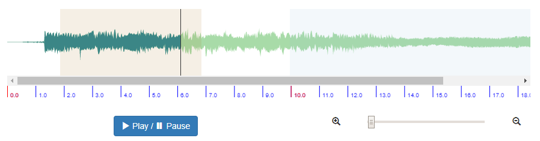

# 需求背景

最近要做一个声音波形图组件，方便运营人员对声音进行切分，以配合完成人工切分录音的工作

# 核心思路

利用 ref 属性调用原生方法

# 解决方案

## 功能点

- 点击播放只会在播放区域进行播放，再次点击暂停播放，鼠标右键点击播放区域也可播放
- 可以添加播放区域，添加时会删除上一个播放区域，按住 shift + 鼠标右键可删除播放区域
- 可以放大缩小波形图

## WaveFormDivider/index.js

```jsx
/* eslint-disable no-unused-expressions */
/* eslint-disable import/no-unresolved */
/* eslint-disable no-param-reassign */
import React from 'react';
import WaveSurfer from 'waveSurfer.js';
import RegionsPlugin from 'waveSurfer.js/dist/plugin/waveSurfer.regions';
import TimelinePlugin from 'waveSurfer.js/dist/plugin/waveSurfer.timeline';
import MinimapPlugin from 'waveSurfer.js/dist/plugin/waveSurfer.minimap';
import { Slider, Button, Icon } from 'antd';
import { fromJS } from 'immutable';
import styles from './styles.css';

/**
 * Use formatTimeCallback to style the notch labels as you wish, such
 * as with more detail as the number of pixels per second increases.
 *
 * Here we format as M:SS.frac, with M suppressed for times < 1 minute,
 * and frac having 0, 1, or 2 digits as the zoom increases.
 *
 * Note that if you override the default function, you'll almost
 * certainly want to override timeInterval, primaryLabelInterval and/or
 * secondaryLabelInterval so they all work together.
 *
 * @param: seconds
 * @param: pxPerSec
 */
function formatTimeCallback(seconds, pxPerSec) {
  seconds = Number(seconds);
  const minutes = Math.floor(seconds / 60);
  seconds %= 60;

  // fill up seconds with zeroes
  let secondsStr = Math.round(seconds).toString();
  if (pxPerSec >= 25 * 10) {
    secondsStr = seconds.toFixed(2);
  } else if (pxPerSec >= 25 * 1) {
    secondsStr = seconds.toFixed(1);
  }

  if (minutes > 0) {
    if (seconds < 10) {
      secondsStr = `0${secondsStr}`;
    }
    return `${minutes}:${secondsStr}`;
  }
  return secondsStr;
}

/**
 * Use timeInterval to set the period between notches, in seconds,
 * adding notches as the number of pixels per second increases.
 *
 * Note that if you override the default function, you'll almost
 * certainly want to override formatTimeCallback, primaryLabelInterval
 * and/or secondaryLabelInterval so they all work together.
 *
 * @param: pxPerSec
 */
function timeInterval(pxPerSec) {
  let retval = 1;
  if (pxPerSec >= 25 * 100) {
    retval = 0.01;
  } else if (pxPerSec >= 25 * 40) {
    retval = 0.025;
  } else if (pxPerSec >= 25 * 10) {
    retval = 0.1;
  } else if (pxPerSec >= 25 * 4) {
    retval = 0.25;
  } else if (pxPerSec >= 25) {
    retval = 1;
  } else if (pxPerSec * 5 >= 25) {
    retval = 5;
  } else if (pxPerSec * 15 >= 25) {
    retval = 15;
  } else {
    retval = Math.ceil(0.5 / pxPerSec) * 60;
  }
  return retval;
}

/**
 * Return the cadence of notches that get labels in the primary color.
 * EG, return 2 if every 2nd notch should be labeled,
 * return 10 if every 10th notch should be labeled, etc.
 *
 * Note that if you override the default function, you'll almost
 * certainly want to override formatTimeCallback, primaryLabelInterval
 * and/or secondaryLabelInterval so they all work together.
 *
 * @param pxPerSec
 */
function primaryLabelInterval(pxPerSec) {
  let retval = 1;
  if (pxPerSec >= 25 * 100) {
    retval = 10;
  } else if (pxPerSec >= 25 * 40) {
    retval = 4;
  } else if (pxPerSec >= 25 * 10) {
    retval = 10;
  } else if (pxPerSec >= 25 * 4) {
    retval = 4;
  } else if (pxPerSec >= 25) {
    retval = 1;
  } else if (pxPerSec * 5 >= 25) {
    retval = 5;
  } else if (pxPerSec * 15 >= 25) {
    retval = 15;
  } else {
    retval = Math.ceil(0.5 / pxPerSec) * 60;
  }
  return retval;
}

/**
 * Return the cadence of notches to get labels in the secondary color.
 * EG, return 2 if every 2nd notch should be labeled,
 * return 10 if every 10th notch should be labeled, etc.
 *
 * Secondary labels are drawn after primary labels, so if
 * you want to have labels every 10 seconds and another color labels
 * every 60 seconds, the 60 second labels should be the secondaries.
 *
 * Note that if you override the default function, you'll almost
 * certainly want to override formatTimeCallback, primaryLabelInterval
 * and/or secondaryLabelInterval so they all work together.
 *
 * @param pxPerSec
 */
function secondaryLabelInterval(pxPerSec) {
  // draw one every 10s as an example
  return Math.floor(10 / timeInterval(pxPerSec));
}

export class WaveFormDivider extends React.PureComponent {
  // eslint-disable-line react/prefer-stateless-function
  static defaultProps = {
    startTime: undefined,
    endTime: undefined,
    src: ''
  };

  static initState = {
    data: fromJS({
      zoom: 0,
      playing: false
    })
  };

  state = WaveFormDivider.initState;

  componentDidMount() {
    const { src } = this.props;
    src && this.initWaveSurfer();
  }

  componentWillUnmount() {
    this.destroyWaveSurfer();
  }

  setImmState = (fn, cb) => {
    this.setState(
      ({ data }) => ({
        data: fn(data)
      }),
      cb
    );
  };

  destroyWaveSurfer = () => {
    this.setState(WaveFormDivider.initState);
    this.waveSurfer && this.waveSurfer.destroy();
  };

  initWaveSurfer = () => {
    const { data } = this.state;
    const { handleChangeStartEnd, src, startTime, endTime } = this.props;
    this.waveSurfer = WaveSurfer.create({
      container: this.waveForm,
      scrollParent: true,
      waveColor: '#A8DBA8',
      progressColor: '#3B8686',
      plugins: [
        MinimapPlugin.create(),
        RegionsPlugin.create({
          dragSelection: {
            slop: 5
          }
        }),
        TimelinePlugin.create({
          container: this.waveTimeline,
          formatTimeCallback,
          timeInterval,
          primaryLabelInterval,
          secondaryLabelInterval,
          primaryColor: 'blue',
          secondaryColor: 'red',
          primaryFontColor: 'blue',
          secondaryFontColor: 'red'
        })
      ]
    });
    this.waveSurfer.load(src);
    this.waveSurfer.on('ready', () => {
      this.waveSurfer.zoom(data.get('zoom'));
      if (data.get('playing')) {
        this.waveSurfer.play();
      }
      startTime !== undefined && endTime !== undefined && this.addWaveFormRegion(startTime, endTime);
    });
    this.waveSurfer.on('region-update-end', (e) => {
      const { start, end } = e;
      handleChangeStartEnd && handleChangeStartEnd(start, end);
    });
    this.waveSurfer.on('region-created', () => {
      this.waveSurfer.clearRegions();
    });
    // this.waveSurfer.on('region-removed', () => {
    //   handleChangeStartEnd && handleChangeStartEnd(undefined, undefined);
    // });
    this.waveSurfer.on('pause', () => {
      this.setImmState((dat) => dat.set('playing', false));
    });
    this.waveSurfer.on('play', () => {
      this.setImmState((dat) => dat.set('playing', true));
    });
    this.waveSurfer.on('zoom', (value) => {
      this.setImmState((dat) => dat.set('zoom', value));
    });
    this.waveSurfer.on('region-click', (region, e) => {
      e.stopPropagation();
      if (e.shiftKey) {
        region.remove();
        handleChangeStartEnd && handleChangeStartEnd(undefined, undefined);
      } else {
        region.play();
      }
    });
  };

  addWaveFormRegion = (start, end) => {
    this.waveSurfer.addRegion({
      start,
      end,
      color: 'hsla(400, 100%, 30%, 0.5)'
    });
  };

  handleWaveFormZoom = (value) => {
    let tmp = value;
    if (value < 0) {
      tmp = 0;
    }
    if (value > 1000) {
      tmp = 1000;
    }
    this.waveSurfer.zoom(tmp);
  };

  handleWaveFormPlayOrPause = () => {
    const { data } = this.state;
    const { startTime, endTime } = this.props;
    if (data.get('playing')) {
      this.waveSurfer.pause();
    } else {
      this.waveSurfer.play(startTime, endTime);
    }
  };

  render() {
    const { data } = this.state;
    return (
      <div className={styles.container}>
        <div
          ref={(r) => {
            this.waveForm = r;
          }}
          className={styles.waveForm}
        />
        <div
          ref={(r) => {
            this.waveTimeline = r;
          }}
        />
        <div className={styles.control}>
          <div className={styles.zoomContainer}>
            <Icon type='minus-circle-o' onClick={() => this.handleWaveFormZoom(data.get('zoom') - 100)} />
            <Slider
              tipFormatter={(value) => `${value}%`}
              max={1000}
              onChange={(value) => this.handleWaveFormZoom(value)}
              value={data.get('zoom')}
            />
            <Icon type='plus-circle-o' onClick={() => this.handleWaveFormZoom(data.get('zoom') + 100)} />
          </div>
          <Button className={styles.playBtn} type='primary' onClick={this.handleWaveFormPlayOrPause}>
            {data.get('playing') ? '暂停' : '播放'}
          </Button>
        </div>
      </div>
    );
  }
}

WaveFormDivider.propTypes = {
  src: React.PropTypes.string,
  handleChangeStartEnd: React.PropTypes.func,
  startTime: React.PropTypes.number,
  endTime: React.PropTypes.number
};

export default WaveFormDivider;
```

## WaveFormDivider/styles.css

```css
@import 'styles/vars.css';

.control {
  text-align: center;
}

.zoomContainer {
  position: relative;
  padding: 0 30px;

  :global {
    .anticon {
      position: absolute;
      top: -2px;
      width: 16px;
      height: 16px;
      line-height: 1;
      font-size: 16px;
      color: rgba(0, 0, 0, 0.25);
      cursor: pointer;

      &:hover {
        color: var(--color-primary);
      }
    }

    .anticon:first-child {
      left: 0;
    }

    .anticon:last-child {
      right: 0;
    }
  }
}
```

# 类似实现效果


