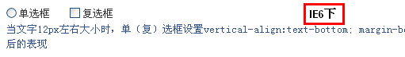
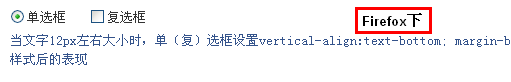
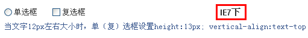
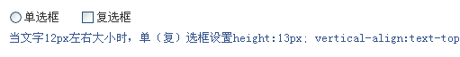
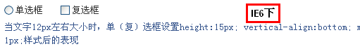
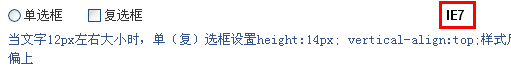
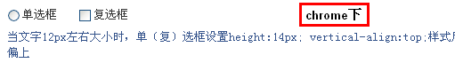
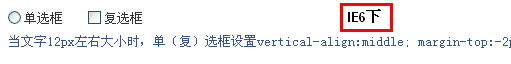
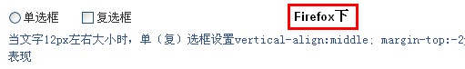

# 产生的条件

对于 14 像素大小的字体是没有本篇所要探讨的单（复）选框与文字对齐的问题的。（见下图）

但是，对于 12 像素大小的文字，则就存在对齐问题了，尤其在 Firefox 火狐浏览器以及 chrome 谷歌浏览器下。（见下图）

这就是本文所要研究与解决的问题，可以肯定的是单复选框与文字默认以 vertical-align:baseline 的方式对齐的。

# 解决方案

## vertical-align: text-bottom

css 代码如下：vertical-align:text-bottom; margin-bottom:2px; margin-bottom:-2px\9;

结果如下图（以 IE6 浏览器和 Firefox 浏览器示例）：

## vertical-align:text-top

css 代码如下：height:13px; vertical-align:text-top; margin-top:0;

结果如下图（以 IE7 浏览器和 chrome 浏览器截图示例）：

## vertical-align:bottom

css 代码如下：height:15px; vertical-align:bottom; margin-bottom:3px; margin-top:-1px;

结果如下图（以 IE6 和 Firefox 浏览器截图做示例）：

## vertical-align:top

css 代码如下：height:14px; vertical-align:top; 结果如下图（chrome 下文字略微偏上，其他浏览器下很完美，以 IE7 和 chrome 浏览器示例）：

## vertical-align:middle

css 代码如下：vertical-align:middle; margin-top:-2px; margin-bottom:1px; 结果如下截图（以 IE6 和 Firefox 示例）：

# 总结

vertical-align:bottom 和 vertical-align:middle 从兼容性，代码的利用率，css 的消耗等来讲都是我非常推荐的两种方法
